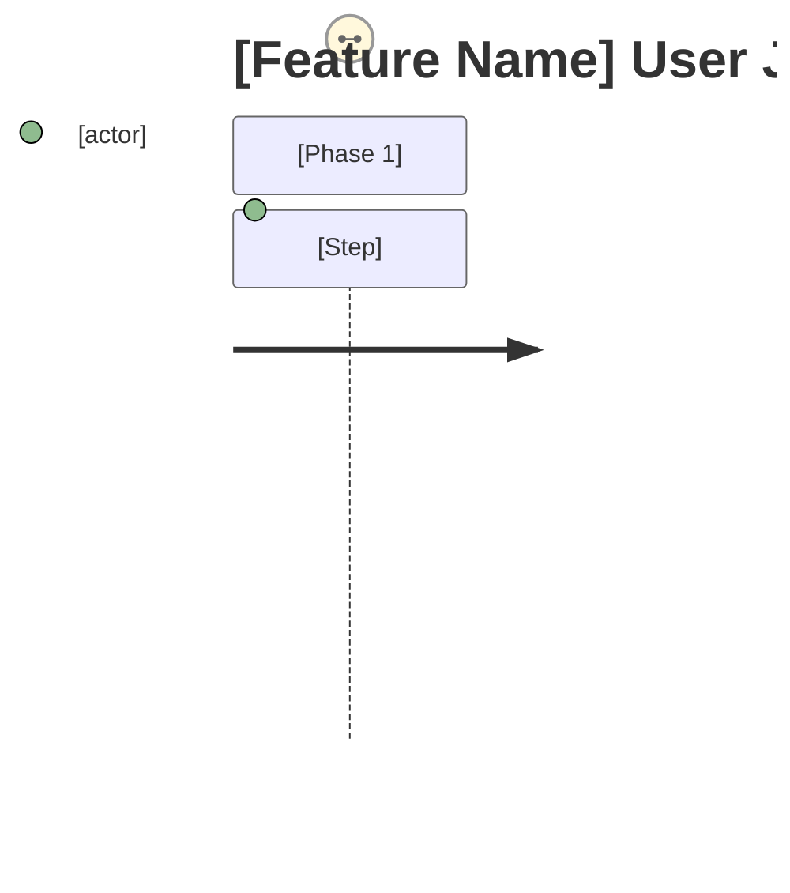

# PRD: [Feature Name]

## Contents

Section completion checklist — each box must be checked (including `N/A — out of scope` rows) before this document leaves draft. The reviewer's Gate 0 check uses this list as the structural-presence anchor.

- [ ] Overview
- [ ] Stakeholders
- [ ] User Stories
- [ ] Functional Requirements
- [ ] Non-Functional Requirements
- [ ] Product Policy Decisions
- [ ] Success Criteria
- [ ] Technical Considerations
- [ ] Rollout Plan
- [ ] Undetermined Items
- [ ] Appendix

**Note to authoring sub-agent:** update this list if you add or remove top-level (H2) sections from the document. Do NOT remove the `## Contents` heading — it is required for Gate 0 structural review. Mark each box `[x]` when the corresponding section is complete (or contains an explicit `N/A — out of scope` marker for layers not in scope).

## Overview

### One-line Summary

[Describe this feature in one line]

### Background

[Why is this feature needed? What problem does it solve?]

### Layer Scope

Declare which engineering layers this feature touches.

**Canonical source.** The layer enumeration is maintained in [`.claude/canonical/engineering-domain-layers.yaml`](../../../../canonical/engineering-domain-layers.yaml) (machine source) with the verbatim checkbox block mirrored in its prose companion [`../layer-taxonomy.md`](../layer-taxonomy.md) §"Layer Scope checkbox block (verbatim)". When filling in this template, **copy the checkbox block verbatim from the prose companion** — do not retype the layer list from memory or from a different artifact. If the canonical file lists 10 layers, the PRD has 10 checkboxes; if it lists 9, the PRD has 9. This template intentionally omits the inline list to force the author to consult the canonical source.

Product-surface concerns (end-user experience, release cadence, residency, etc.) live in Stakeholders, User Stories, Non-Functional Requirements, and Product Policy Decisions — NOT in Layer Scope. Layer Scope answers the engineering question "which subsystems will this feature touch?" not the product question "whose experience does this affect?"

<!-- Paste the Layer Scope checkbox block from layer-taxonomy.md here, then tick the checkboxes for layers this feature touches. -->

## Stakeholders

### Stakeholder Inventory

List every group whose experience is affected by this feature. A stakeholder belongs here if at least one acceptance criterion is written from their perspective. Unchecked stakeholders may be omitted.

| Stakeholder | Description | Primary Layer(s) | Relationship | Volume / Importance |
|-------------|-------------|------------------|--------------|---------------------|
| End user / Customer | [Who they are] | Frontend, Backend | Direct user | [Count or tier] |
| API consumer / Integration partner | [Who they are] | API | External developer | [Count or tier] |
| Admin / Internal operator | [Who they are] | Frontend, Backend, Data | Power user | [Count] |
| SRE / On-call | [Who they are] | Infra, Release, Backend | Operator | [Team] |
| Developer / Contributor | [Who they are] | Codespaces, Claude Code, Release | Maintainer | [Team] |
| Compliance / Legal | [Who they are] | Data, Infra | Reviewer | [Team] |
| [Other] | [...] | [...] | [...] | [...] |

### Primary Users

[Of the stakeholders above, which are the primary target for this release? Naming the primary user clarifies trade-off decisions when needs conflict.]

## User Stories

Group stories by stakeholder. Only include groups whose experience changes meaningfully — empty groups are a smell that the layer doesn't belong in scope.

### End User

```
As a [user type]
I want to [goal/desire]
So that [expected value/benefit]
```

### API Consumer (when API as Product in scope)

```
As an integration developer
I want to [capability]
So that [their product can do X]
```

### Admin / Internal Operator (when applicable)

```
As an admin
I want to [capability]
So that [operational benefit]
```

### SRE / On-call (when Infra/Release in scope)

```
As an on-call engineer
I want to [observability/control capability]
So that [I can respond/prevent X]
```

### Developer / Contributor (when DX in scope)

```
As a contributor
I want to [workflow capability]
So that [I can be productive faster / safer]
```

### Use Cases

1. [Specific usage scenario 1 — name the stakeholder]
2. [Specific usage scenario 2 — name the stakeholder]
3. [Specific usage scenario 3 — name the stakeholder]

### User Journey Diagram



[Map the end-to-end experience from trigger event to goal completion. If multiple stakeholders have distinct journeys, include a journey diagram per primary stakeholder.]

### Scope Boundary Diagram

```mermaid
C4Context
    Boundary(scope, "In Scope") {
        [Components in scope]
    }
    Boundary(out, "Out of Scope") {
        [Components out of scope]
    }
```

[Clarify what is and is not included. When the feature spans layers, make explicit which layers are *product surface* versus *implementation detail covered transitively*.]

## Functional Requirements

Tag each requirement with the **stakeholder** it serves and the **layer** where its acceptance is observed. This keeps requirements honest — every requirement should be observable by some named person somewhere.

### Must Have (P1 - MVP)

- [ ] **Requirement 1** — Stakeholder: [...] — Layer: [...]
  [Detailed description]
  - AC-001: [Acceptance criteria — Given/When/Then format or measurable standard]
  - AC-002: [Acceptance criteria]
- [ ] **Requirement 2** — Stakeholder: [...] — Layer: [...]
  [Detailed description]
  - AC-003: [Acceptance criteria]

### Should Have (P2)

- [ ] **Requirement 1** — Stakeholder: [...] — Layer: [...]
  - AC-004: [Acceptance criteria]

### Could Have (P3)

- [ ] **Requirement 1** — Stakeholder: [...] — Layer: [...]

### Won't Have (this release)

- Item 1: [Description and reason for exclusion]
- Item 2: [Description and reason for exclusion]

## Non-Functional Requirements

NFRs are organized by quality attribute. Within each attribute, call out per-layer specifics only when they differ from the global commitment. Use `N/A — out of scope` for attributes that don't apply.

### Performance

- **End-user latency** (Frontend / Backend): [target — e.g., p95 < 300ms for primary interactions]
- **API latency** (when API in scope): [p95 / p99 targets per endpoint class]
- **Throughput**: [requests/sec, concurrent users]
- **Background job timeliness**: [e.g., notification sent within N minutes of trigger]
- **Build / deploy time** (when Release in scope): [main pipeline duration target]
- **Codespace boot time** (when DX in scope): [cold start / prebuild targets]
- **Query / data freshness**: [how recent the data shown to users must be — real-time / eventual within N seconds / batch hourly]

### Reliability

- **Availability**: [target — e.g., 99.9% monthly]
- **Error rate**: [target — e.g., < 0.1% of requests]
- **Mean time to recovery (MTTR)**: [target]
- **Rollback time** (when Release in scope): [time from decision to revert reaching users]
- **Disaster recovery** (when Infra in scope): [RPO / RTO targets]
- **Data durability** (when Database in scope): [e.g., zero data loss guarantee, backup cadence visible to users]

### Security

- **Authentication / Authorization requirements**: [what the product promises about access control]
- **Data classification touched**: [PII / PHI / financial / confidential / public]
- **Audit & traceability**: [what user actions must be auditable]
- **Compliance commitments**: [SOC2 / HIPAA / GDPR / PCI / regional — and what evidence this feature must produce]
- **Supply chain / contributor trust** (when DX or Claude Code in scope): [policy on third-party actions, dotfiles, agent-driven changes]

### Scalability

- **Growth assumptions**: [users / requests / data volume projections this must handle]
- **Per-tenant limits** (when multi-tenant): [hard limits, soft limits, fairness expectations]
- **Cost ceiling**: [if there's an explicit budget envelope]

### Accessibility (when Frontend in scope)

- **Compliance standard**: [Default: WCAG 2.1 AA — use organization standard if available]
- **Target assistive technologies**: [Screen reader, keyboard operation, voice control, etc.]
- **Platform requirements**: [e.g., app store review requirements]
- **Known constraints**: [e.g., external library limitations]

### Compatibility (when API as Product in scope)

- **Backward compatibility commitment**: [e.g., no breaking changes within major version]
- **Browser / runtime / SDK support matrix**: [versions supported]
- **Deprecation notice period**: [time between deprecation and removal]

### Data (when Data as Product or Database in scope)

- **Retention**: [how long each data category is kept, who can request earlier deletion]
- **Residency**: [where data may physically live]
- **Portability / export**: [formats, completeness, time to fulfill request]
- **Privacy controls**: [user-visible privacy settings, opt-outs]
- **Historical access**: [how far back users can query / view]

### Operability (when Release / Infra in scope)

- **Release cadence expectation**: [continuous / weekly / on-demand]
- **Preview environment commitment**: [per-PR / per-branch / none]
- **Observability commitment**: [what dashboards/metrics the operator will have]
- **On-call burden**: [acceptable pages/week, alert quality bar]

### Developer Experience (when DX / Codespaces / Claude Code in scope)

- **Time to first productive commit** (new contributor): [target]
- **Local-to-prod parity**: [what the dev environment guarantees vs. doesn't]
- **Agent-driven workflow support** (Claude Code): [which workflows must be accessible to coding agents — e.g., slash commands, skills, hooks]

## Product Policy Decisions

This section captures cross-cutting product-level decisions that PMs own but that ripple across layers. Each policy here is a *deliberate product commitment*, distinct from implementation choice. Skip entries that don't apply.

| Policy Area | Decision | Rationale | Affected Layers |
|-------------|----------|-----------|-----------------|
| Data retention | [e.g., 90 days for events, indefinite for billing] | [why] | Data, Database |
| Data deletion / right to erasure | [SLA and scope] | [why] | Data, Database, API |
| API versioning scheme | [URL / header / semver policy] | [why] | API |
| API deprecation policy | [notice period, sunset header behavior] | [why] | API |
| Release cadence | [continuous / weekly / opt-in] | [why] | Release |
| Feature flag exposure | [internal only / customer-toggleable / per-tenant] | [why] | Release, Frontend |
| Regional availability | [regions supported at launch, regions blocked] | [why] | Infra, Data |
| Multi-tenancy boundary | [shared / dedicated / hybrid; isolation guarantee] | [why] | Infra, Database |
| Quotas & rate limits | [defaults, paid tier deltas] | [why] | API, Backend |
| Pricing / billing surface | [is this feature billable, how metered] | [why] | API, Backend |
| Privacy defaults | [opt-in vs. opt-out for new data collection] | [why] | Frontend, Data |
| Contributor / agent access | [what coding agents are allowed to do in this repo] | [why] | Claude Code, DX |

## Success Criteria

### Quantitative Metrics

Per primary stakeholder, define metrics that will tell you whether this feature succeeded.

| Metric | Stakeholder | Target | Measurement Method | Timeframe |
|--------|-------------|--------|--------------------|-----------|
| [Metric name] | [End user / API consumer / etc.] | [Numeric target] | [How measured — analytics event, log query, survey, etc.] | [When measured] |

### Qualitative Metrics

1. [User experience metric 1 — name the stakeholder]
2. [User experience metric 2 — name the stakeholder]

### UI Quality Metrics (when Frontend in scope)

1. [Key operation completion rate / error recovery rate / retry success rate]
2. [Accessibility audit target score]

### API Quality Metrics (when API as Product in scope)

1. [Integration time — how long from signup to first successful API call]
2. [Documentation satisfaction / first-call success rate]
3. [Breaking-change incident count — target zero]

### Operational Metrics (when Release / Infra in scope)

1. [Deploy frequency / lead time for changes]
2. [Change failure rate]
3. [Time to restore service]

### Developer Experience Metrics (when DX in scope)

1. [Time from repo clone to first passing local test]
2. [Codespace cold-start time]
3. [Onboarding survey score for new contributors]

## Technical Considerations

The PRD names *what's true about the environment*; the design doc names *what to build*. Keep this section descriptive, not prescriptive.

### Dependencies

- **Existing systems we depend on**: [list and purpose]
- **External services we depend on**: [vendor, contract status, SLA]
- **Upstream features that must ship first**: [feature → why required]
- **Downstream consumers affected by this change**: [team/system → notification plan]

### Constraints

- **Technical constraints**: [stack choices already made, platforms supported]
- **Resource constraints**: [team capacity, budget envelope, infra quotas]
- **Time constraints**: [hard deadlines and what drives them]
- **Regulatory / contractual constraints**: [obligations the design must respect]

### Assumptions

Each assumption should name how it will be validated, by whom, and by when. Unvalidated assumptions become risks.

- [ ] [Assumption 1] — Validation: [method] — Owner: [...] — By: [date]
- [ ] [Assumption 2] — Validation: [method] — Owner: [...] — By: [date]

### Risks and Mitigation

| Risk | Stakeholder Affected | Impact | Probability | Mitigation |
|------|----------------------|--------|-------------|------------|
| [Risk 1] | [Who feels it] | High/Medium/Low | High/Medium/Low | [Countermeasure] |
| [Risk 2] | [Who feels it] | High/Medium/Low | High/Medium/Low | [Countermeasure] |

## Rollout Plan

When Release / Frontend / API is in scope, describe how users will encounter this feature over time.

- **Launch audience progression**: [internal → beta → GA, with criteria for advancing]
- **Communication plan**: [release notes, in-app messaging, developer docs, partner notification]
- **Migration path** (when changing existing behavior): [what existing users must do, when, and what happens if they don't]
- **Kill criteria**: [conditions that would cause us to pull the feature]

## Undetermined Items

- [ ] [Question 1]: [Description of options or impacts] — Owner: [...] — Needed by: [...]
- [ ] [Question 2]: [Description of options or impacts] — Owner: [...] — Needed by: [...]

*Discuss with user until this section is empty, then delete after confirmation.*

## Appendix

### References

- [Related document 1]
- [Related document 2]

### Glossary

- **Term 1**: [Definition]
- **Term 2**: [Definition]