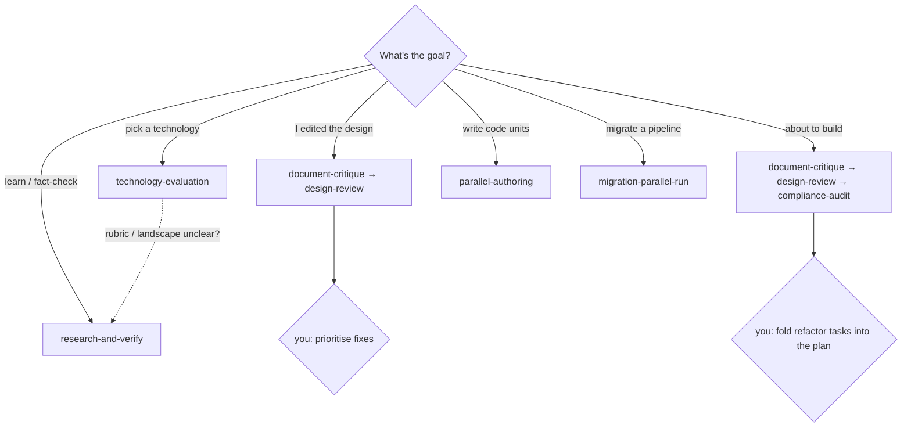
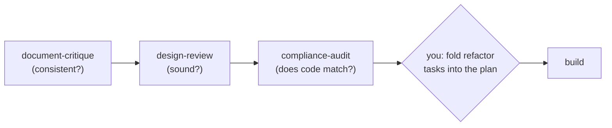

# `.claude/workflows/` — Use-Case Flows (when to reach for which workflow)

Companion to [`AGENTS.md`](AGENTS.md) (the portfolio manual). That file says *what each workflow is*; this one says *how they chain into real work, by role*.

**Where these sit.** All eight workflows are **design- and governance-layer** tools — they evolve and vet the system itself. **You** (or the main agent on your behalf) invoke them. The pipeline's runtime sub-agents never do (one-level dispatch — a workflow script is the sole dispatcher, and agents it spawns cannot spawn agents), and they do **not** run *inside* a feature-pipeline run. **The human sits at every decision seam.**

## Who reaches for what

| Hat | Responsibility | Workflow(s) |
|---|---|---|
| **Researcher** | gather verified, recent evidence | `research-and-verify` |
| **Decision-maker** | choose a technology within the boundaries | `technology-evaluation` |
| **Architect** | keep the design consistent *and* sound | `document-critique`, `design-review` |
| **Auditor** | confirm the code matches the design | `compliance-audit` (+ the `auditing-*` skills for CC config) |
| **Builder** | implement deliverables (post-freeze) | `parallel-authoring`, `migration-parallel-run` |
| **Owner (you)** | prioritise, decide at every seam, approve promotion | — you sit at the seam of all of them |

## Master map — goal → workflow

## The use-case flows

### ① Decide a technology
*e.g. the decision-graph store; or re-evaluating GreptimeDB when its trigger fires*
- **Owner:** Decision-maker.
- **Flow:** *(optional)* `research-and-verify` the landscape → `technology-evaluation` (boundary-screen → score → verify → draft decision record) → **you pick** at the seam → record in the plan (ADR when the freeze lifts).
- **Skip for:** a reversible, low-blast-radius pick swappable behind a stable interface — that's a plan-level choice, not worth the machinery.

### ② Evolve the architecture or plan
*added a Part, a decision, reframed something*
- **Owner:** Architect.
- **Flow:** edit → `document-critique` (is it *consistent*?) → **you prioritise** the findings → apply → `design-review` (is it *sound*? — the forensic sweep of every Part/rule/anti-pattern + correctness + credentials + schedulability) → **you adjudicate** → apply. Re-run `document-critique` if the edits were large.
- **Skip for:** a typo — just fix it.

### ③ Get build-ready (the three-review gate)
*before lifting the freeze to implement*

- **Owner:** Architect → Builder hand-off.
- **Why the order:** each gates the next — auditing code against an unsound design just propagates the unsoundness; reviewing soundness of an inconsistent doc wastes effort.

### ④ Build the deliverables
*WS-0…WS-4 units, post-freeze*
- **Owner:** Builder.
- **Flow:** `parallel-authoring` for independent units (distinct paths, each verified as it lands); `migration-parallel-run` for the orchestrator/pipeline Strangler-Fig cutover.
- **Skip for:** sequential/stateful work (the orchestrator-migration core isn't a fan-out); a single-pipeline migration is just the `parallel_run_diff.py` script.

### ⑤ Add or remove a domain
*a new engineering layer or cross-cutting domain*
- **Owner:** Maintainer.
- **Flow:** design the bundle → `document-critique` (does the arch/plan still cohere?) → `parallel-authoring` builds the bundle units → the WS-2 conformance/orphan check (a **script**, not a workflow) confirms zero orphans. Optionally `compliance-audit` to confirm the whole repo still conforms.
- **Skip for:** the scaffold/teardown themselves — those are scripts, not workflows.

### ⑥ A re-evaluation trigger fires
*a tech decision's expiry/signal (e.g. the GenAI semconv reaches stable, or a 6-month backstop)*
- **Owner:** Maintainer.
- **Flow:** `technology-evaluation` re-runs from Frame and **supersedes** the old record → **you re-affirm or change** → update the plan.

### ⑦ Pure research
*a design fork, or a fact-check before a recommendation*
- **Owner:** anyone. `research-and-verify` standalone.

## Standing guardrails

- **The three reviews run in order:** consistency (`document-critique`) → soundness (`design-review`) → code (`compliance-audit`). Don't skip ahead.
- **Never chain a review → build without you at the seam.** Critique/design findings are *yours* to prioritise; refactor tasks are *yours* to fold in. The workflows surface candidates; you decide — flashlight, not autopilot.
- **Report-only workflows are freeze-safe**; the two build-time ones (`parallel-authoring`, `migration-parallel-run`) run only post-freeze.
- **These are governance tools, not pipeline roles.** They improve the architecture / plan / tooling; they are distinct from the runtime sub-agents that author PRDs/Blueprints inside a feature-pipeline run, and from the `auditing-*` skills that audit generic Claude Code config.
- **`research-and-verify` nests** inside `technology-evaluation` (cost-capped Verify step) and can precede any decision; otherwise each workflow is a standalone step with you between it and the next.
