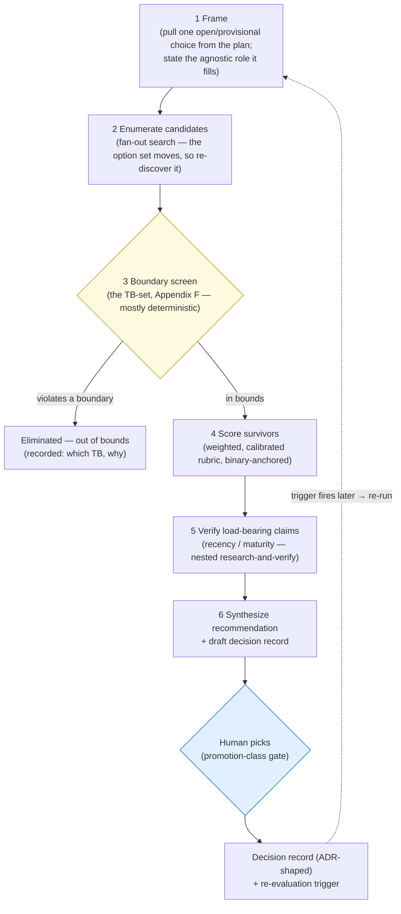

# `technology-evaluation` — workflow design (on paper, for review)

> **Status: DESIGN ONLY.** This is the spec for a proposed workflow — no `.js`, no agents run yet. It defines the phases, the boundary-screen logic, the scoring rubric, and the decision-record template, and works one real example end to end (the observability backend) so we can judge the shape before building. Decisions for you are collected at the end.

---

## 1. Why this exists — the gap it closes

We pick technology by one-shot research that stops at *"here's what the community uses."* That is the **evidence** step, not a **decision**. Three things are missing — the same three you named:

| Missing piece | What goes wrong without it |
|---|---|
| **A re-run mechanism** | In AI/agent tooling the *candidate set itself* moves monthly. A one-time pick silently rots; nothing tells us when it's stale. |
| **Explicit trade-off scoring** | "Grounded in research" picks a plausible option but never weighs maturity vs operability vs lock-in vs reversibility against one another on the record. |
| **Boundaries as a filter** | Plenty of technology *works* but cannot live inside our architecture's constraints. That filter should run **first** and eliminate candidates before we spend effort scoring them. |

Our portfolio has the **evidence arm** (`research-and-verify`) and the **artifact-check arm** (`document-critique`). It has **no decision arm**. This is it.

This workflow is the design-time embodiment of the architecture's own thesis applied to *our own tooling choices*: deterministic constraints (the boundary screen) governing a probabilistic search (candidate discovery + judged scoring), with a human at the decision seam.

---

## 2. The shape

The load-bearing design move: **the boundary screen is a hard gate that runs before any scoring.** A candidate that violates a constraint is eliminated cheaply, with the reason recorded — never scored, never deliberated.



The dotted edge is the moving-target answer: the decision record carries a **re-evaluation trigger**, and when it fires the workflow re-runs from Frame. A technology decision is never "done forever" — it is "valid until X."

---

## 3. What it solves / does NOT solve (the sharp boundary)

- **Solves.** Turning an open technology choice into a *recorded, defensible, boundary-filtered, trade-off-scored decision* with verified recent evidence and a built-in expiry — repeatably.
- **Does NOT solve.** It does not *decide for you* (you pick at the seam). It does not *write the ADR into the repo* during a freeze (it drafts; the write waits). It does not do deep methodology research on *how to evaluate* (that's a separate `research-and-verify` run — see §9). It is not for choices that aren't boundaries — a thing you can swap behind a stable interface at low blast radius is a plan-level pick, not worth this machinery.

---

## 4. The phases (what each agent step does)

| # | Phase | Fan-out? | Does | Returns |
|---|---|---|---|---|
| 1 | **Frame** | single | Read the plan's provisional choice; restate the **agnostic role** (from the architecture, not the vendor); list which boundaries (TBs) bind this choice; set/confirm the rubric weights | a `decision-frame` object |
| 2 | **Enumerate** | parallel (by search angle: official registries / community roundups / "alternatives to" / recent releases) | Discover the *current* candidate set; dedupe; stamp the enumeration date | a candidate list (~6–10) |
| 3 | **Boundary screen** | parallel (one per candidate) | Check each candidate against each binding TB; **default-eliminate on uncertainty for hard boundaries**; record the failing TB + evidence | each candidate → `in_bounds` or `eliminated{tb, reason}` |
| 4 | **Score** | parallel (one per survivor) | Score on the weighted rubric (§6) with **chain-of-thought before the score**, binary-anchored levels, **abstain allowed** | per-survivor scorecard |
| 5 | **Verify** | nested `research-and-verify`, one level deep | Adversarially verify the *load-bearing* claims behind the top survivors' scores — especially maturity/recency/trajectory; produce a could-not-verify list | verified claims + confidence |
| 6 | **Synthesize** | single | Rank survivors; write the draft decision record (§7); name the runner-up and the swap path; propose the re-evaluation trigger | the draft record + a short rationale |
| — | **Human picks** | *(outside the workflow)* | You read the record, choose, and (post-freeze) the ADR is written | — |

**Cost discipline (baked in):** cap enumeration (~8), let the screen kill most cheaply, and run the expensive Verify step only on the **top 2–3 survivors' load-bearing claims** — not every claim of every candidate. One decision per run.

### 4a. Enumeration discipline (the recency trap cuts both ways)

Enumeration is where the moving target bites. Two failure modes, opposite directions: **missing a live option** that has emerged since we last looked, and **dredging up a dead one** that looks plausible but is abandoned. The discipline guards both ends.

- **Seed from the last decision, then expand.** Always start from the incumbent + the prior decision record's candidate list (continuity), then discover fresh entrants. **The diff is itself a signal** — what appeared or disappeared since the last enumeration tells us how fast this category is moving.
- **Seed the known prominent vendors for the category explicitly.** Don't rely on search alone to surface the obvious players — name them in the seed so they at least appear *eliminated-on-the-record* rather than silently absent. (The observability pilot's first runs missed LangSmith and Langfuse entirely; both would be eliminated at the screen — paid-enterprise self-host on k8s/compose + ClickHouse/Postgres/Redis — but their absence from the record was a gap, not a judgment.)
- **Always include the incumbent as a candidate.** A re-evaluation must be able to *confirm* the current choice, not just replace it. The incumbent runs the screen and scoring like any other.
- **Search several angles in parallel** (so no single blind spot dominates): official registry / awareness lists; "alternatives to \<incumbent\>" comparisons; recent releases and changelogs; and the prior record. Each angle is blind to the others.
- **Liveness pre-filter, before the boundary screen** (cheap): flag any candidate with no release/commit in ~12 months. Do **not** silently drop it — some tools are *done, not dead*. Record `excluded: no activity since <date>` or `kept: stable-and-complete` with the reason. (This is the "no silent caps" rule — a dropped candidate is always logged with why.)
- **Recency window is split by purpose.** Use recent sources (~last 6–9 months) to answer *"what exists now"*; use the **full** history to judge maturity/trajectory in §6. Don't let a fresh blog post inflate a young tool's maturity score.
- **Dedupe across rebrands/forks** to a canonical name (the same project surfaces under old and new names; a fork is a distinct candidate only if independently maintained).
- **Cap with a logged tail.** Keep ~8–10 into the screen; if more survive liveness, keep the most-adopted + most-recent and **log what was set aside** — never truncate silently.

Each enumerated candidate carries `{name, url, last_release_date, license, one_line, discovered_via}` so the screen and the decision record have the facts they need without re-fetching.

---

## 5. The boundary screen — deterministic vs judgment

The screen reuses Appendix F (TB1–TB11) as an **elimination filter**. Each check is one of two kinds, and the kind decides *who* runs it and *what happens when the answer is unclear*:

- **Mechanical** — a deterministic predicate over an observable fact (install method, footprint, license, format). These are the **same predicates the WS-0 fitness functions run in CI** — screen and fitness function read one source (the canonical boundary file, §10) so a candidate that would fail the build is also rejected at evaluation. A mechanical check returns pass/fail with a cited fact (a docs URL, a `docker-compose.yml` in the repo, a license string); on a *missing* fact it does not guess — it downgrades to a judgment check.
- **Judgment** — needs an agent to read and reason (e.g. "stays off the critical path" is architectural, not a string match). The rule for the **hard boundaries** (the ones that make a candidate fundamentally unusable — TB1, TB2, TB3, TB10, TB11) is **default-eliminate on uncertainty**: if the agent cannot confirm in-bounds from evidence, the candidate is out, with the uncertainty recorded. Better to drop a usable tool than to score an out-of-bounds one.

Every elimination records `{tb, check_type, evidence, verdict}` so the decision record can show *why* each loser fell — boundary failure, and which one.

| Boundary | Screen question (fail ⇒ eliminated) | Check type | Signal it reads | On uncertainty |
|---|---|---|---|---|
| **TB1** single container, no compose; default 4-core/16 GB, footprint a tunable cost dial | Needs compose / k8s / multi-node (→ hard fail)? Or a footprint over the 16 GB default (→ flag the larger tier + $/hr, don't eliminate)? | **mechanical** | install method (`docker-compose.yml` / k8s = structural fail), stated RAM vs 16 GB | eliminate on compose/multi-node; **flag cost** on size |
| **TB2** git is system-of-record | *Requires* an external datastore as the durable record? | **mechanical** | architecture docs, required services | eliminate (hard) |
| **TB3** no mandatory external service on the critical path | SaaS-only / no self-host / pipeline can't complete with it down? | **mechanical** | self-host docs, license/offering page | eliminate (hard) |
| **TB10** credential indirection only | Forces inline credentials (no env / secret-store path)? | **mechanical** | config / auth docs | eliminate (hard) |
| **TB11** OTel-shaped, self-hostable, JSONL-of-record, no WORM | Ingests OTel self-hosted **and** stays off the critical path? | **mixed** — OTLP ingest is mechanical; "off the critical path" is judgment | OTLP support matrix; integration model (OpenLineage ingest NOT required — D-OBS-2) | eliminate (hard) |
| **TB5 / TB8** canonical-read, Python/subprocess | *(library/validator decisions only, not services)* divergent rule copy / non-Python runtime? | **mechanical** | language, packaging | eliminate (hard) |
| **TB9** text-first formats | Does it force a binary/proprietary format on the PIPELINE'S OWN artifacts/record? **A backend's internal cache format is NOT screened** (every trace store is binary; it's a replayable cache, not our record). | **mechanical** | the pipeline's emitted artifact formats — not the backend's storage engine | keep on uncertainty (flag, don't eliminate) |
| **TB4 / TB6 / TB7** deterministic gates / file-handoff / sole-dispatcher | *(orchestration decisions only)* breaks deterministic gating, needs shared in-memory state, or spawns agents? | **judgment** | execution model | eliminate (hard) |
| trajectory / maturity / cost | — | *not a boundary* | — | **scored in §6, never screened** |

**Implication for the build:** the mechanical rows should be authored as the actual WS-0 fitness functions first; the workflow's screen phase then *calls them*, rather than re-implementing the logic in a prompt. Only the judgment rows live as agent reasoning. This keeps the boundary as the single deterministic contract the architecture intends (TB4 spirit) and stops the screen and CI from drifting.

The screen records *why* each loser fell, so the decision record can distinguish **"ruled out by a boundary"** from **"lost on trade-offs"** — your "works but doesn't fit" case, made explicit.

---

## 6. The scoring rubric (survivors only)

Per our reviewer-gate discipline (D-RG-1): **anchored levels, calibrated, chain-of-thought before the score, abstain allowed** — not a vibe number. Weights are explicit, human-set, and sum to 100.

**Active profile: "Hedge the moving target."** This profile leads with the two levers that protect us when the landscape shifts — **trajectory** (bet on what stays maintained) and **reversibility/lock-in** (keep a wrong bet cheap to undo) — while keeping operability and standard-shape high. It is the chosen emphasis, **confirmed and hardened** by the methodology research (`methodology-research.OUTPUT.md`, 2026-05-29) — which validated the screen→score pipeline and added the door-type weight modifier, the capability re-anchoring, and the decision rules below (rubric v1.2.0).

| Criterion | Why it matters here | Weight |
|---|---|---|
| **Maturity & trajectory** | Release cadence, maintainer health, adoption, *not abandoned*. **The recency axis** — verified in Phase 5. The lead lever: it hedges the moving target. | **22** |
| **Standard-shape conformance** | How natively it ingests the OpenTelemetry standard (OTLP + GenAI semconv). Low conformance = lock-in + churn. OpenLineage ingestion is NOT scored — lineage is the freshness gate's job (D-OBS-2). | **18** |
| **Reversibility / lock-in** | Can we swap it behind the stable JSONL-of-record? Proprietary schema or open? One-way vs two-way door. *Reversibility decays* — a two-way door becomes one-way as data/consumers accumulate. Weight is **door-type-aware** (see below). | **18** † |
| **Operability in one ephemeral container** | Single-process / pip / binary, modest footprint, simple start. The TB1 reality past the pass/fail line. | **16** |
| **Capability fit** | Does it answer **our written questions** (gate pass/fail counts, judge stability, cycle-time, trace=run/span=step) — scored against *that list*, **not** general breadth. Broad-but-doesn't-answer scores low; narrow-but-purpose-built scores high. | **12** † |
| **Durability-model fit** | Local persistent store on a mounted volume; no external sink required. | **6** |
| **Licensing / cost** | OSS license, no seat cost, no rug-pull risk. | **5** |
| **Docs & support** | Onboarding docs, issue responsiveness. | **3** |

**Scoring scale:** `0 = fails the intent` · `1 = partial / with caveats` · `2 = meets it cleanly` · `3 = clearly best-in-class`. **Abstain** is allowed and routes that criterion to a note rather than a guessed number. Weighted score = Σ(level × weight) / 3, normalized to 100.

**Calibration anchors (so two scorers land on the same number):**

| Criterion | 0 | 1 | 2 | 3 |
|---|---|---|---|---|
| Maturity & trajectory | abandoned / pre-release churn | young or visibly slowing | active, steady releases, real adoption | broad adoption + strong momentum + healthy maintainers |
| Standard-shape conformance | proprietary format only | OTLP ingest, but custom semconv mapping needed | ingests OTLP + OTel GenAI semconv natively | native OTel GenAI semconv with broad signal coverage (traces/metrics/logs) |
| Reversibility / lock-in | proprietary store + schema, hard exit | swappable with migration effort | swappable behind our JSONL-of-record, open schema | fully standard, drop-in, zero migration |
| Operability (1 container) | needs compose / multi-service* | single container but heavy (>4 GB) or fiddly | single container, modest, simple start | lightweight single binary / pip, trivial start |
| Capability fit | does not answer our questions | answers a few of our questions; real gaps | answers most of our questions with light custom work | answers all of our questions natively / out-of-the-box |
| Durability-model fit | no local persistence | local store, awkward on a volume | local store on a mounted volume, cleanly | that + easy backup / compaction |
| Licensing / cost | restrictive / seat-cost / rug-pull risk | OSS with caveats (e.g. SSPL) | permissive OSS, no seat cost | permissive + foundation-governed |
| Docs & support | sparse | basic | solid docs + responsive issues | excellent docs + active community |

\* A multi-service candidate is normally eliminated at the boundary screen (TB1); a `0` here only appears if a survivor degrades to multi-service in a needed configuration.

**† Door-type weight modifier (methodology research, Q2).** Reversibility's weight tracks the reversal stakes, so it is adjusted *after* the profile is chosen by the decision's door-type — net-zero, so the weights still sum to 100:

| Decision class | Reversibility | Capability fit | Why |
|---|---|---|---|
| **two-way door** | −6 (→ 12) | +6 (→ 18) | reversal is cheap and usually uniform across survivors — spend the weight on fit |
| **one-way door** | +6 (→ 24) | −6 (→ 6) | exit cost can outrank raw capability |

**Decision rules (methodology research — the failure-mode guards).** These live in `evaluation-rubric.yaml` and bind the workflow:

- **Lock weights before scoring** — weights are set in Frame, before any option data is seen (anti-weight-gaming).
- **Score against evidence, not breadth** — capability is scored against the *written question list*, never a vendor feature list.
- **Sensitivity test** — shift the top weight ±10%; if the ranking flips, the result is not robust, and the workflow says so.
- **Too-close-to-call band (10 pts)** — if the top-two normalized-score gap is under 10 points, the call goes to **judgment**, not the number.

---

## 7. The decision-record template (ADR-shaped, draft only under freeze)

The output is a draft that becomes an ADR when the freeze lifts (honoring D-KN: index + supersession + status). Shape:

```markdown
# ADR-00NN — <agnostic role>: choose <technology>
Status: Proposed · Date: <enumeration date> · Decision class: <one-way | two-way door>

## Context & role
The agnostic role this fills (quoted from the architecture, no vendor) + the plan workstream it serves.

## Boundaries that bind this choice
TBx, TBy, … (from Appendix F) — and the litmus reason each applies.

## Candidates considered  (enumerated <date> — recency stamp)
The full discovered set, so a re-run can diff against it.

## Boundary eliminations
| Candidate | Eliminated by | Reason |

## Scoring (survivors)
| Candidate | <criteria columns, weighted> | Total |
Chain-of-thought + abstentions referenced, not inlined.

## Evidence & verification
Load-bearing claims with verified / could-not-verify status (from Phase 5).

## Decision
Chosen option + why it won (boundary-clean AND highest weighted score). Runner-up + the swap path.

## Consequences
What we accept; what we give up; what we must watch.

## Re-evaluation trigger        ← the freshness hook
A date ("re-check by <date>") OR a signal ("re-check when <e.g. the GenAI semconv reaches stable>").

## Links
Boundaries satisfied · plan workstream · supersedes / superseded_by.
```

The **re-evaluation trigger** is the same freshness concept the architecture applies to artifacts (Part IV), applied to technology decisions: the decision carries its own expiry, so it can't silently rot.

### 7a. Re-evaluation trigger conventions

A trigger is only useful if it actually fires and someone is watching for it. The conventions make every trigger *checkable* and *owned*.

**Every record carries exactly one trigger, of one of three types:**

| Type | Form | Use when | Who checks it |
|---|---|---|---|
| **Date** | "re-check by `YYYY-MM-DD`" | fast-moving category with no single deciding event | the periodic improvement-loop batch (D-IL-1) scans dates |
| **Signal** | "re-check when `<observable event>`" | a specific named event would change the answer | wired to a watch where one exists (see below) |
| **Hybrid** | date **or** signal, whichever fires first | the common case — a hard backstop date plus an early signal | both of the above |

**The two rules that make a trigger valid:**

1. **It must be observable.** "Re-check when something better comes along" is banned — it never fires, which is silent rot. A good signal is checkable: *a standard reaches stable* (e.g. the OpenTelemetry GenAI semantic conventions leave experimental), *the chosen tool's license changes*, *its release cadence stalls* (no release in N months), *its maintainer/owner changes*, or *a bound boundary itself changes*.
2. **It names its check mechanism — and prefers CI enforcement over a bare date.** The methodology research is blunt here: the dominant anti-pattern is the trigger that never fires, and the strongest mechanisms *couple the trigger to the running system* — a fitness function or an expiry test that passes until a review date then **fails the build**, converting time into an active signal. So: a license/cadence signal → a small CI check on the incumbent's repo; a source-staleness signal → the domain-freshness check (D-DOM-4); a date backstop → an expiry test that fails CI on the review date, not just a line in a doc scanned by the improvement-loop batch. A date with no enforcement is the weakest form and is only a fallback when nothing observable exists.

**Default horizons by volatility** (the date backstop, tunable):

| Decision volatility | Example | Default horizon |
|---|---|---|
| High (AI/agent infra) | observability backend, LLM-eval tooling | **6 months** |
| Medium (general infra/libs) | a serialization lib, a CI action | 12 months |
| Low (stable, "done") | RFC-8785 canonicalization lib | 18–24 months |

**On fire — supersede, never silently overwrite (D-KN-3).** A fired trigger re-runs the workflow from Frame. The new record either **re-affirms** (same choice, fresh date, `supersedes` the old) or **changes** the choice (new choice, `supersedes` the old, old marked `superseded_by`). Either way the lineage is kept bi-temporally — we can always see what was true when, and why it changed. A re-affirmation is a feature, not wasted work: it converts "we never looked again" into "we looked on `<date>` and it still holds."

---

## 8. Worked pilot — the observability backend

This is the proof case you chose. It's a strong pilot because the boundary screen does real eliminating work and the role is already stated agnostically in the architecture.

**Frame.**
- *Agnostic role (from the architecture, Part V):* "a self-hostable single-container OpenTelemetry backend with a durable local store, never on the critical path." (Resolved 2026-05-29 after the pilot: OTel-only — artifact lineage is the freshness gate's in-git `derived_from` graph, not an ingested OpenLineage backend, per D-OBS-2. A re-run therefore scores standard-shape on OTel alone.)
- *Plan home:* WS-4 (observability). *Currently provisional in the plan:* a specific product is named but explicitly open to revision.
- *Binding boundaries:* **TB11** (standard-shape, self-hostable, JSONL-of-record, no WORM) is the dominant one; **TB1** (single container + no compose; default 4-core/16 GB, footprint a tunable cost dial), **TB2** (git system-of-record), **TB3** (off the critical path), **TB10** (credential indirection) all bind. TB5/TB8/TB9 don't apply (this is a service, not a validator/library).
- *Decision class:* **two-way door** — we deliberately keep the JSONL as the system-of-record so the backend is swappable behind a stable interface. That's *why* this is a plan-level technology pick and not itself a boundary.

**Enumerate (illustrative seeds — the real run re-discovers the current set and stamps the date).** The space of self-hostable trace/LLM-observability backends is crowded and moving: single-container OSS trace UIs, LLM-observability platforms that ingest OTel GenAI, and the heavier multi-service stacks. *I am deliberately not naming winners here* — on-paper, no agents; naming a "best" would be exactly the un-verified one-shot pick we're trying to retire.

**How the screen would bite (illustrative, not a verdict):**
- A SaaS-only platform with no self-host path → **out on TB3/TB11**.
- A multi-service stack that needs docker-compose or several containers → **out on TB1**.
- One that demands an external datastore as its durable record → **out on TB2**.
- *Calibration note (from the re-run):* a candidate must NOT be eliminated for its **internal** storage being binary (Parseable was wrongly cut on TB9 for internal Parquet — but GreptimeDB, the chosen tool, also stores Parquet internally). TB9 governs *our* artifacts/record, not a backend's cache (fixed in technology-boundaries.yaml v1.3.0). And prominent vendors must be **seeded explicitly** so they appear eliminated-on-the-record (LangSmith/Langfuse were missed entirely — both would be out on TB1: enterprise k8s/compose + ClickHouse/Postgres/Redis).
- Survivors = self-hostable single-container backends that ingest the standard shape and keep a local store. *Those* go to scoring.

**Scoring weights for this decision:** the defaults in §6 fit well; the run should likely lift **operability (TB1 reality)** and **trajectory (the AI-observability space churns fast)** slightly, because both are where this category actually differentiates. To be confirmed by the methodology research.

**Expected output:** a draft ADR for the observability-backend role, with the current candidate set, the boundary eliminations, a scorecard of the self-hostable survivors, verified maturity claims, a chosen option + named runner-up + swap path, and a re-evaluation trigger tied to the GenAI semconv reaching stable.

---

## 9. Combine / don't-combine (portfolio rules)

| Mechanism | Decision |
|---|---|
| **`research-and-verify` nested in Phase 5** | **Yes** — one level deep, as the evidence/verification sub-step. It still runs standalone for pure research. |
| **Fold into `document-critique`** | **No** — different job (critique checks an artifact's consistency; this makes a decision). |
| **Methodology research** ("how should we score / weight / trigger?") | **Separate `research-and-verify` run, before we finalize the rubric.** You deferred this for now; it hardens §6's weights and §7's trigger conventions when we're ready. |
| **Human seam between Phase 6 and the record** | **Never collapsed.** The workflow recommends; you pick (the promotion-class gate). |

---

## 10. Freeze posture & how it joins the portfolio

- **Report-only.** Emits the recommendation + draft record to chat / a draft file; it does **not** write an ADR while the freeze holds (ADRs are frozen). Freeze-safe.
- When built, it lands as `technology-evaluation.js` here, with a `meta` literal (name, description, phases) and the standard schema-constrained agent calls, and gets a row in [`AGENTS.md`](AGENTS.md) with its solves / does-not-solve boundary.

### 10a. Canonical homes (so the screen and rubric aren't hardcoded)

CANON-1 forbids embedded rule copies — tools read their rules from canonical. The screen logic and the rubric are exactly such rules, so they get canonical homes. **Two new files, both WS-0 follow-ons (specified here, created when the freeze lifts):**

| File | Holds | Read by |
|---|---|---|
| `.claude/canonical/technology-boundaries.yaml` | per TB: `id`, `constraint`, `litmus`, `applies_to` (services \| libraries \| orchestration \| all), and a `screen` block — `check_type` (mechanical \| judgment \| mixed), `signal`, `on_uncertainty` (eliminate \| keep), `fitness_function` (the WS-0 check id, where mechanical) | the screen phase **and** the WS-0 fitness functions — one source, no drift between evaluation and CI |
| `.claude/canonical/evaluation-rubric.yaml` | `profiles` (named weight sets — `hedge-moving-target`, `lean-container`, `capability-first`), `active_profile`, and `criteria` (per-criterion weight + the 0–3 `anchors`) | the score phase; any rubric audit |

Accessed through `canonical.py` (`boundaries()`, `boundary(id)`, `rubric(profile)`) — never inlined in a prompt or a `.js` literal.

**Source-of-truth split (keeps the architecture authoritative).** The architecture's **Appendix F owns the constraint statement and its litmus** — the *what/why* (D-TB-1 authority). The canonical file owns the **machine-checkable screen + fitness-function binding** — the *how-checked*. They are joined by TB id. The **drift sentinel** (WS-0) enforces the join so the two representations can't diverge:

- every TB in Appendix F has a `technology-boundaries.yaml` entry, and vice versa (id correspondence);
- each entry's `constraint` summary matches the Appendix-F row;
- every `fitness_function` id names a fitness function that actually exists;
- in `evaluation-rubric.yaml`, every profile's weights sum to 100 and every criterion has all four anchors.

A **new boundary** is therefore authored in Appendix F (architecture change) *and* given its canonical screen entry in the same commit — the sentinel fails the build if one is added without the other.

**Adjacent, not merged:** `tools.yaml` (the tool vocabulary / operational registry, D-TOOL-1) lists the tools we *use*; `technology-boundaries.yaml` constrains what we *may adopt*. Different jobs — cross-referenced, never combined. And the **decisions themselves** need no new home: they are ADRs under `adrs/` with the decision-log index (D-KN-1/2); the trigger dates feed the improvement-loop batch (D-IL-1).

---

## 11. Status & what's left

**Settled:**
- ✅ **Shape approved** — boundary-screen-first, weighted-scored survivors, verified evidence, human picks, expiry trigger.
- ✅ **Rubric weights** — the "Hedge the moving target" profile is active (§6), with calibration anchors.
- ✅ **Four refinements applied** — canonical homes (§10a), enumeration discipline (§4a), trigger conventions (§7a), screen deterministic/judgment split (§5).

**Parked (circle back):**
- ⏸ **Methodology research (§9)** — deferred. Run a `research-and-verify` pass on selection methodology before we treat the weights/anchors as final.

**The one open call:**
- **Build trigger** — author `technology-evaluation.js` + run the observability pilot, or keep refining on paper. Note two soft dependencies: the screen is cleanest once the WS-0 fitness functions and the two canonical files (§10a) exist, and the rubric is firmest after the parked methodology research. We *can* build against this spec now (reading the spec directly) and migrate to canonical later, or sequence canonical-first.
