# The Governed Pipeline — A Reliability-and-Extensibility Architecture for Multi-Agent Orchestration

> A multi-agent AI pipeline is a chain of **probabilistic actors** (LLM sub-agents) joined by handoffs. Left ungoverned, three failure classes dominate: bad or stale artifacts reach expensive agents and trigger rework (a **reliability** failure); the capabilities the pipeline is built from cannot be added or removed predictably (an **extensibility** failure); and the durable knowledge it accumulates — decisions, memory, context files — goes stale, conflicting, and un-navigable (a **knowledge-governance** failure). This architecture governs all three from a single **deterministic substrate** — a canonical registry, a validator library, a drift sentinel, and an observability surface — applied at three levels: the **documents** that flow through a run, the **domains** the pipeline is composed of, and the **durable knowledge** it accumulates across runs. The unifying principle: *push truth into deterministic, declarative code; keep probabilistic agents stateless and replaceable; govern everything from one canonical source.*

**How to read this document.** Part I states the problems with evidence. Part II states the principle and the substrate. Parts III–V are the three reliability mechanisms (contract gates, the freshness gate, observability). Part VI is the extensibility mechanism (the domain-pack pattern). Part VII is durable-knowledge governance (decision records, memory, context files). Part VIII collects the cross-cutting disciplines (rules, anti-patterns, maintainability, dev-environment lifecycle). Part IX covers where the architecture lives and how it is enforced. Part X is application — worked example, metrics, rollout. Appendices carry the evidence map, trade-offs, decisions, sources, a visual index, and the technology-boundary registry that binds the plan. Operational crash-recovery (durable execution) is folded in minimally at §18 — reusing the run-event log as the recovery journal — rather than left as a silent gap.

**On the visuals.** Each diagram is rendered inline as Mermaid (renders on GitHub and in the IDE), labelled **Figure Vn** and catalogued in Appendix E. The C4 views (V3, V4) use Mermaid's experimental C4 support; if they fail to render in a given viewer, they can be regenerated via Structurizr/PlantUML from the same node/edge set.

---

# Part I — The Problems

## 1. Executive summary

A probabilistic pipeline with no deterministic substrate of record fails in three ways:

- **Reliability.** Cheap, mechanical defects — a missing section, a broken cross-reference, a stale predecessor — slip past the unguarded seams between stages and are caught only by the most expensive agents downstream, after they have already triggered rework. By audit-finding category, roughly three-quarters of findings fall in this mechanical class (a categorization estimate, not a measured rework-time share — see Appendix A).
- **Extensibility.** The pipeline is assembled from "domains" (engineering layers and external systems). Adding one is a manual, uneven assembly; removing one is a hand-hunt across scopes that leaves orphans. There is no registry that records what is installed and no check that a domain is wholly present or wholly gone.
- **Knowledge governance.** The decisions (ADRs), agent memory, and context files the system accumulates across runs have size and credential hygiene only — no index, no freshness, no conflict control. A large, densely-linked decision store becomes un-navigable, and stale or contradictory knowledge silently shapes every future run.

All three have the same root cause and the same answer (Part II).

## 2. Problem A — Reliability: bad and stale artifacts reach expensive agents

Validation exists between most stages, but the chain is uneven, and the cheapest, most-common failure modes occur at the **unguarded** seams.

- Four of seven pre-handoff seams are ungated; one more relies only on a human approval gate.
- The four lightest documents (Research Plan, Acceptance Tests, Phase Validators, `tasks.json`) have no machine-readable contract or no wired validator.
- Triage is real but not immediate: every issue propagates to the reconciler, queues against a 4-cycle cap, and re-invokes the expensive author.
- Contract drift between templates and authoring agents is undetected — no agent pins a template version, so a field rename propagates silently.
- In-run version lineage is untracked — when an upstream artifact is revised mid-run, nothing detects that downstream artifacts derive from the superseded version (Part IV).
- Runs are not measurable — the only runtime telemetry is install events, so where cycle time goes is unknown (Part V).

### Evidence — prior runs

Across 14 feature runs, eleven reached the audit stages and eight required at least one reconciliation cycle.

| Run | Blueprint versions | PRD versions | Plan versions | Reconciliation cycles | Worst audit count |
|---|---|---|---|---|---|
| execution-pipeline-design | **v1–v5** | v1, v1.1 | v1–v2 | 3 | 7 architecture-audit rounds |
| devcontainer-mcp-provisioning | v1–v3 | v1–v3 | v1 | 3 | 8 per-doc reviewer issue files |
| issue-capture-mechanism | v1–v3 | v1–v2 | v1–v2 | 2 | 10 architecture-audit issues |
| audit-findings-remediation | v1, v1.1 | v1 | v1–v1.2 | 2 | 3 cross-artifact issues |
| pipeline-quickwins-hardening | v1–v2 | v1 | v1 | 3 | 8 cross-artifact issues |
| adr-placement-mechanism-repair | v1 | v1 | v1 | 1 | 15 architecture-audit issues |
| pipeline-design-time-discipline | v1 | v1 | v1 | 1 | 7 architecture-audit issues |
| execute-orchestrator-dispatch-repair | — | — | — | per-doc reviewer cycles (5 docs) | reviewer issues across 5 docs |
| 3 runs stalled pre-audit | — | — | — | — | never reached audit |
| 1 run abandoned mid-pipeline | split into two runs | — | — | — | — |

**Top revision triggers across all audit JSONs:** (1) cross-artifact consistency drift — 72 instances (version desync, filename drift, count mismatches, stale contract-ID references); (2) completeness / missing sections — 53 instances; (3) clarity / substantive design — 40 instances. Categories 1 and 2 account for **125 of 165** findings — about three-quarters — and are exactly what a mechanical validator can catch. Category 3 is genuinely substantive: it is what expensive auditors *should* spend their tokens on.

**Figure V1 — The validation chain today.** Where the chain leaks: red = ungated seams, amber = reviewed-only.

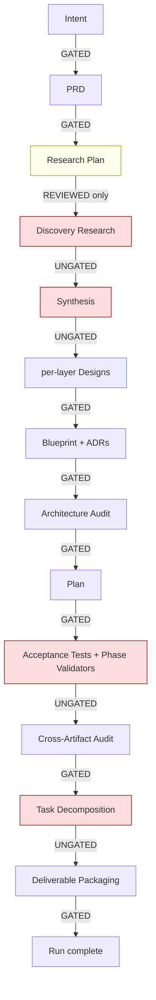

### What enforces today, and where it leaks

Three structural enforcement mechanisms exist:

- **`shared-document-reviewer`** — a Gate 0 (structural) + Gate 1 (semantic) review on five document types (Intent, PRD, Design Doc, Plan, Deliverable Archive).
- **`verdict_findings_parity.py`** — hard-halts the pipeline if any reviewer's or auditor's verdict contradicts its own findings (five surfaces).
- **`validate_adr_placement.py`** + **`check_feature_touch_predicate.py`** — close-gate the Design Composition stage.

**No hooks fire on document writes.** `settings.json` registers SessionStart/SessionEnd plus three PreToolUse matchers (a Task-intercept and two serena helpers) — **none on Write/Edit**; write-time validation is entirely orchestrator-driven, so every gate depends on the orchestrator remembering to invoke it. There is no defense-in-depth.

The leaks are specific — four ungated seams and one reviewed-only seam:

| Seam | What passes unchecked | Why it bites later |
|---|---|---|
| **Discovery Research → Synthesis** | `codebase-analysis.json` + N research notes — no schema, only provenance | Bad inputs to Synthesis drive Blueprint churn |
| **Synthesis → per-layer Design** | `synthesis.md` — no template, no reviewer, no schema | Designers improvise off uneven synthesis; surfaces later as "blueprint missing X" |
| **Test Authoring → Cross-Artifact Audit** | `acceptance-tests.md` + `phase-validators.md` — no doc-type in the reviewer taxonomy | The expensive cross-artifact auditor is the first eye on them |
| **Task Decomposition → Packager** | `tasks.json` — schema in a different KB, no validator | Bad task DAGs reach execution unchecked |
| **Research Plan → Discovery Research** (reviewed, not gated) | no reviewer doc-type; only an existence-and-topic-count check | Bad research plans cascade all the way to Blueprint revisions |

### The contract layer today

The documentation KB owns templates and disciplines for nine document types; coverage is asymmetric.

| Doc type | Template? | Schema? | Frontmatter spec? | Cross-artifact contract? | Authoring agent integration | Validator wired in? |
|---|---|---|---|---|---|---|
| Intent Clarification | yes, v1.0.0 | frontmatter only | yes | derived-from chain | explicit Read + cites template | via reviewer |
| PRD | yes, v1.0.0 | frontmatter only | yes | trace chain declared | explicit Read + cites template | via reviewer |
| Research Plan | yes (no version) | frontmatter only if present | partial | token chain expected | explicit Read | via reviewer (no doc-type) |
| Blueprint | yes, v1.0.0 | frontmatter only | yes (most elaborate) | FR/AC IDs declared binding | explicit Read | via reviewer |
| ADR | yes, v1.0.0 | placement + prescription validators | yes | ADR registry | explicit Read | yes |
| Plan | yes, v1.0.0 | frontmatter + stub detector | yes | satisfies-AC declared | explicit Read | via reviewer |
| Acceptance Tests | **none** | none | partial | declared, **not enforced** | improvises | **none** |
| Phase Validators | **none** | none | partial | same | improvises | **none** |
| tasks.json | **different KB**, inline literal | none | n/a | contract IDs not referenced | by name only | **none** |

The cross-artifact-discipline validator scripts (`validate_pipeline_frontmatter.py`, `detect_stubs.py`, `audit_canonical_drift.py`, and peers) exist but are nearly orphan — invoked only by the document reviewer and the phase-check harness, never at authoring time. They are available but unenforced.

The specific drift surfaces, descending:

1. **Acceptance Tests + Phase Validators** — no template in the KB; the authoring agents fall back to a structure that lives only in the agent body.
2. **tasks.json** — schema is an inline literal in a different KB, with no JSON Schema file and no validator; contract IDs are not referenced.
3. **Research Plan** — the template carries no `version:` line, so frontmatter conformance can't be reliably checked.
4. **FR → AC → task → test traceability** — declared in conventions and assigned to the cross-artifact auditor, but with no programmatic validator; detection is reviewer judgment.
5. **doc-type emission backfill** — planning-side agents still need `doc_type:` frontmatter; until then, new artifacts produce a structural finding.
6. **No template-version pinning** — agents reference templates by path, not version, so a field rename propagates silently.
7. **Conditional template language** — test authors say "if a dedicated template exists" for templates that never existed, masking a permanent gap as temporary.

## 3. Problem B — Extensibility: domains add and remove unpredictably

The project is assembled from **domains** — engineering layers (frontend, backend, … claude-code) and cross-cutting systems (GitHub Actions, Codespaces, MCP). Each domain ships, by convention, a standard bundle: a **Platform KB** (facts), a **Design KB** (discipline), an **Auditor**, and a per-layer **designer** agent. But the convention is unenforced, so the bundle is ragged and the lifecycle is manual.

| Domain | Kind | Platform KB | Design KB | Auditor | Designer |
|---|---|---|---|---|---|
| claude-code | engineering-layer | ✅ | ✅ | ✅ | ✅ |
| cicd | engineering-layer | ✅ | ✅ | ✅ | ✅ |
| mcp | cross-cutting | ✅ | ✅ | ✅ | folded-in |
| codespaces | engineering-layer | ✅ | ✅ | ❌ | ✅ |
| frontend | engineering-layer | (storybook) | ✅ | ❌ | ✅ |
| backend / api / query / database / iac | engineering-layer | ❌ | ✅ | ❌ | ✅ |
| **observability** | — (cross-cutting, unrecognized) | ❌ | ❌ | ❌ | ❌ |

Only **two** domains carry the complete bundle. The registry that records layers (`engineering-domain-layers.yaml`) has **no auditor field, no MCP-server inventory, and no install-scope tracking**. Auditor dispatch is a hard-coded table. No check verifies that a declared domain has its full bundle, and none flags an installed-but-undeclared part.

### Evidence — the removal that proved the gap

Removing one MCP server (gitnexus) touched **15+ surfaces by hand**, and nothing tracked that the same capability was also installed at **user scope** (`~/.claude/skills/` + a hook) — a scope the project-level removal never reached, so it lingered as an orphan and resurfaced every session until found and deleted manually. The earlier removal of another server is recorded only as a deprecation annotation, not in any live registry. **There is no source of truth that reconciles all install sites.**

**Figure V2 — The domain-bundle coverage matrix** is the table immediately above: only `claude-code` and `cicd` carry the full bundle; the all-❌ `observability` row is the obvious gap. (Rendered as the table rather than a redundant heatmap — the cells already read at a glance.)

## 4. The shared root cause and the unifying principle

All three problems are the same shape: a **probabilistic, evolving system with no deterministic substrate of record** — for the documents that flow through it, the domains it is composed of, and the knowledge it accumulates. There is no single declarative source for what a valid document is, what an installed domain is, or what the current body of decisions and memory holds — so correctness and completeness are re-derived by hand (or by expensive agents) every time, and drift is invisible until something downstream breaks.

The answer is one principle applied at three levels:

> **Push truth into deterministic, declarative code. Keep probabilistic agents stateless and replaceable. Govern everything from one canonical source — and let a sentinel enforce that the source and reality agree.**

- At the **document level**, the canonical source declares contracts and the pipeline topology; deterministic gates enforce them before expensive agents run (Parts III–V).
- At the **domain level**, the canonical source declares each domain's bill-of-materials; a conformance check enforces that every domain is wholly present and nothing is orphaned (Part VI).
- At the **knowledge level**, a generated index is the source of truth for durable knowledge (decisions, memory, context files); a supersession lifecycle plus the sentinel keep it fresh, non-conflicting, and navigable (Part VII).

Same substrate, same sentinel, three levels.

The substrate also imposes **technology boundaries** — architecturally-significant constraints (tech-agnostic; they name no vendor) that bind which technologies the plan may choose. These are collected as a binding registry in **Appendix F**.

---

# Part II — The Principle and the Substrate

## 5. The principle

A pipeline separates cleanly into four concerns that must each change without rotting the others: *what is true* (declarative data), *what is enforced* (deterministic code), *what is coordinated* (a manifest-driven loop), and *what is generated* (the probabilistic agents). Truth flows down into validators and the coordinator; knowledge flows in to the agents; the sentinel watches the whole substrate from the side; every gate and stage emits an event. Agents are the only probabilistic component, and because they are stateless and communicate by reference, they are replaceable — swap a model, the gates still hold.

## 6. The substrate components

| # | Component | Role | Realized as |
|---|---|---|---|
| 1 | **Canonical Layer** | One versioned, declarative source for every vocabulary, schema, contract, the pipeline topology, **and the domain registry**. Everything else derives; nothing restates. | `.claude/canonical/*.yaml` + the pipeline manifest + the domain bill-of-materials |
| 2 | **Validation Library** | Pure deterministic checkers that read rules *from* canonical (never hardcode), shared across pipelines, dispatched by subprocess. | `auditing-shared/scripts/` + the `canonical.py` typed accessor |
| 3 | **Actors** | Probabilistic producers/consumers — stateless, single-purpose, communicate by reference, never self-approve, never dispatch each other. | the sub-agents |
| 4 | **Coordinator** | Drives the loop: read manifest → dispatch actor → run gate → route. Owns cycle counters; **human gates sit between segments** (a gate can't live inside a workflow script). Holds no domain rules — reads them from the manifest. | per-segment Dynamic Workflow scripts + a sequencing coordinator (D-ORCH-1) |
| 5 | **Knowledge Layer** | Passive discipline that shapes *how* actors author well. Read by actors; not executable. | the `KB-*` skills |
| 6 | **Drift Sentinel** | The meta-gate. Audits the substrate itself — every contract has a validator, every manifest edge has a gate, every declared domain has its full bundle, nothing redefines canonical or is orphaned. Config-time / CI, not runtime. | the canonical-drift + conformance audits |
| 7 | **Observability** | Append-only run-event log + projection. Records what each run actually *did* — stage/gate/cycle/cost/staleness events. Runtime, not config-time; distinct from the sentinel. The log has a **triple role** — audit, operational recovery journal (§18), and the improvement-loop flywheel (Part V) — one append-only surface for all three. | the run-event surface |

**Figure V3 — System context (C4 Level 1).** The pipeline and the external systems and people it touches.

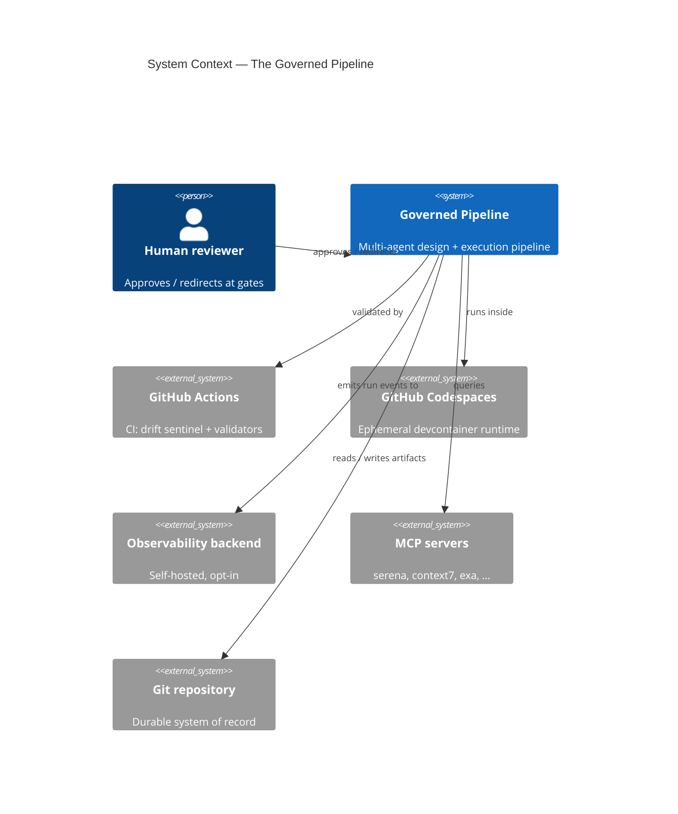

**Figure V4 — Container view (C4 Level 2).** The deterministic substrate (the boundary box) governing the probabilistic actors.

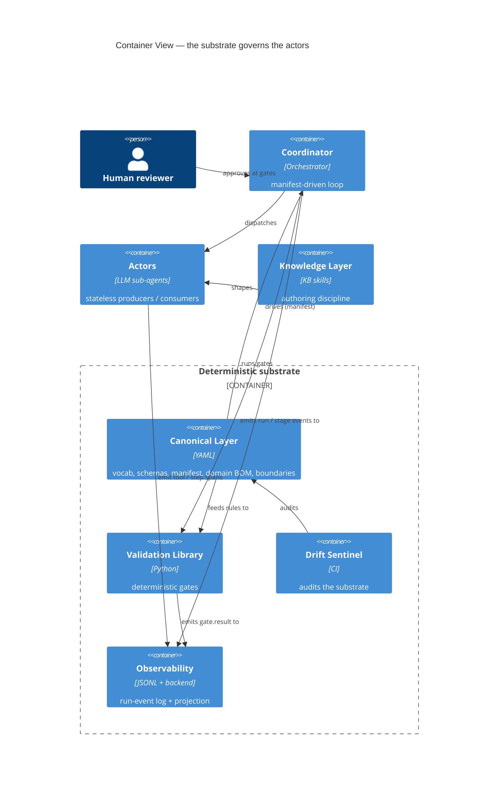

### Platform foundations

The pattern is **instantiated on a platform substrate** the rest of the architecture assumes. Per the Appendix F litmus, each platform choice here is **architecturally significant** — hard to reverse and structural — so it is named as a *binding*, not treated as vendor leakage: the *role* is technology-agnostic, the *binding* is the architecturally-significant decision. These are the external systems in the System Context (V3).

| Platform role | Binding | Why architecturally significant | Sources |
|---|---|---|---|
| **AI-agent platform** | Claude Code | the whole pattern is built from its primitives — skills, sub-agents, hooks, MCP, slash commands; swapping it rewrites the Actors, Coordinator, and Knowledge layers | TB4 (deterministic gates as code), TB6 (file-path handoff), TB7 (sole dispatcher), TB8 (Python validators), the primitive vocabulary |
| **Devcontainer environment** | GitHub Codespaces | the ephemeral single-container lifecycle shapes durability and provisioning for every component | TB1, TB2 |
| **Remote VCS of record** | GitHub | the remote counterpart to local git-of-record; pull requests are a human-gate surface | TB2 (remote half) |
| **IDE** | VSCode (inside the Codespace) | where the human reviewer adjudicates, diagrams render, and the agent extension runs | the human-gate + visual surfaces |
| **CI/CD platform** | GitHub Actions | where the drift sentinel, technology-boundary fitness functions, and conformance/freshness checks execute | enforces the TB-set + R8 |

A platform swap is therefore an **architecture-level** change (it moves the architecturally-significant binding and the boundaries that flow from it), not a plan-level technology choice.

## 7. Three levels, one pattern

The same substrate governs three things, on three timescales. **Documents** flow through a run and are gated by **contracts** (Parts III–V) — the reliability level, *within a run*. **Domains** compose the pipeline and are gated by the **registry** (Part VI) — the extensibility level, *across compositions*. **Durable knowledge** — decisions, memory, context files — accumulates and is governed by an **index plus a supersession lifecycle** (Part VII) — the knowledge level, *across time*. The mechanisms rhyme at every level: a declarative source of truth, deterministic enforcement, a sentinel that flags divergence, and a lifecycle that makes change predictable. Each level is the same pattern stretched over a longer timescale than the last.

**Figure V15 — The three governed levels.** One substrate, one pattern, three timescales.

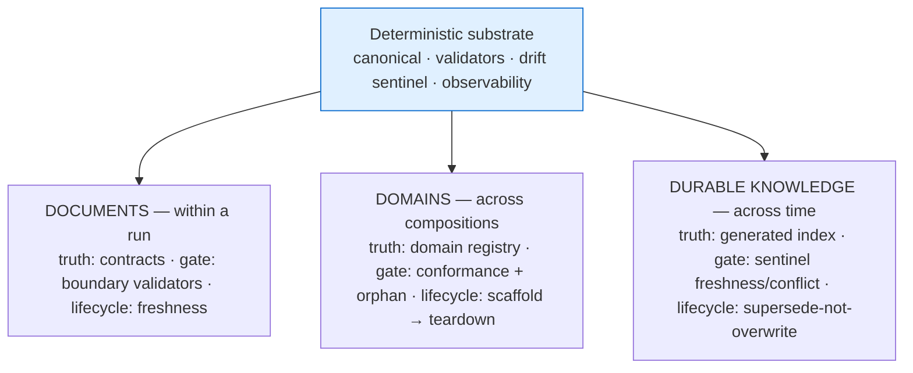

---

# Part III — Reliability I: The Contract-Gated Pipeline (document level)

## 8. The gates and the manifest keystone

Deterministic gates are interposed at every expensive handoff, cheapest first, so the expensive reviewer sees only input that already cleared the cheap checks:

- **Producer self-check** — the authoring agent runs a validator on its own draft before its final write (cheapest place; context still hot).
- **Boundary validator** — an independent check at the handoff seam (the producer cannot mark its own homework).
- **Consumer pre-flight** — a read-time check before the downstream agent begins expensive work.
- **Reviewer / auditor** — the single expensive, opus-class semantic pass, run once, on clean input.

**The keystone.** The stage sequence and which gate guards which handoff must live as **declarative data in a pipeline manifest**, not as prose in the orchestrator. When topology is prose, an edit can silently drop a gate and nothing notices — the deepest failure mode. With a manifest, the coordinator becomes a generic loop and the sentinel can assert *"every edge has a gate."* The coordinator is **hybrid by design**: static topology (stages, edges, gate-per-edge) comes from the manifest; dynamic routing (reconciliation re-entry, conditional edges) stays as typed state-conditional code, because router-decided edges cannot be captured statically.

**Figure V5 — Gate decision flow.** Cheapest checks first; mechanical failures loop back locally, semantic ones escalate. The Reviewer node is a *hardened* judge (binary verdict + calibrated rubric + abstain/escalate + cross-provider panel for high-tier), not a single oracle — see "Hardening the reviewer gate" (§9).

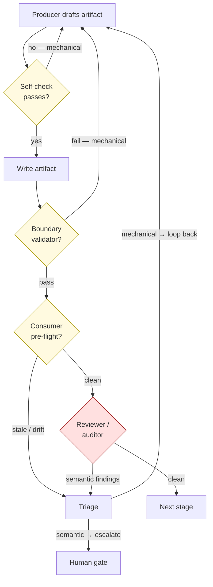

## 9. Runtime flow and timing

| When | What runs | Cost | Why then |
|---|---|---|---|
| At authoring start | Producer reads contract + pins version | — | The pin is the basis for drift detection |
| Before the final write | **Self-check** | ~free | Cheapest place to catch errors |
| At the stage transition | **Boundary validator** + **freshness gate** (Part IV) | ~free | First independent eye; first staleness check |
| Before the consumer reads | **Pre-flight** | ~free | Last cheap check before expensive work |
| After all mechanical gates pass | **Reviewer / auditor** | expensive | Semantic judgment, once, on clean input |
| At any contract bump | **Drift sentinel** | ~free | Surfaces stale agents before they author |
| At every gate + stage | **Observability emit** (Part V) | ~free | Records what happened so cost is measurable |

**Figure V6 — Gate firing order over one handoff.** The expensive reviewer is reached only after the cheap gates clear.

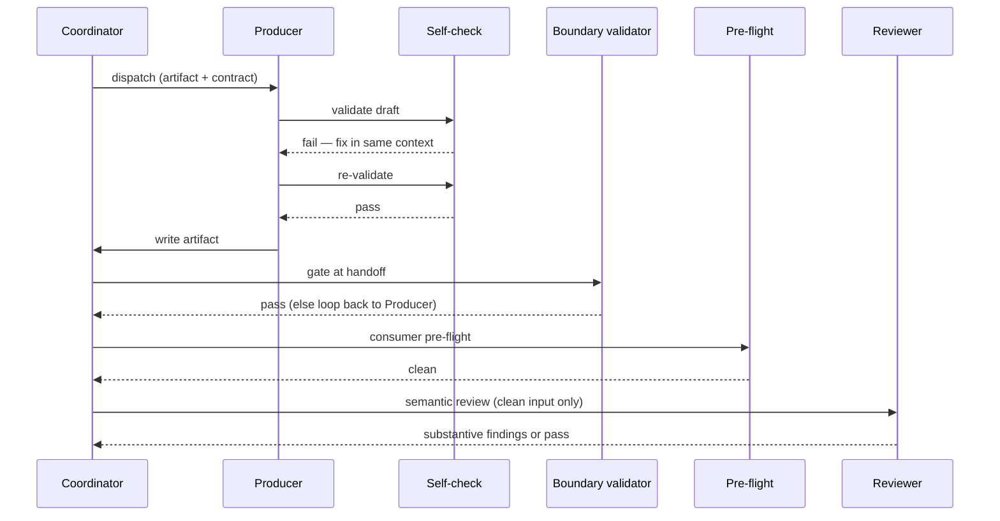

### Hardening the reviewer gate

The reviewer/auditor is the trusted semantic gate — but an LLM judge is a biased, non-deterministic instrument, and a **single-pass single judge with no rubric is the most fragile possible configuration**. Current evidence: a temperature-0 judge flipped its verdict on ~28% of re-runs of one pair; **style/formatting bias now dominates** (judges prefer identical content rendered in markdown over plain prose) while position bias has gone near-negligible on frontier judges; and reliability **degrades monotonically** as scoring moves from binary to multi-level ordinal. So the gate is **hardened**, scaled to blast radius (R10):

- **Binary verdicts, not ordinal scores** — pass / needs-revision + typed findings, never a 1–5 quality score (binary is materially more reliable than ordinal).
- **A calibrated, human-authored rubric** — the dominant reliability lever (atomic human-authored rubrics beat self-generated by ~26pp). The rubric is canonical (the review-discipline KB + the routing classifier), not improvised per run.
- **Chain-of-thought before the verdict** — safe for the factual/structural conformance this gate performs (CoT can *hurt* on belief-laden judgment, which this gate does not do).
- **An abstain / escalate path** — the reviewer may defer an uncertain verdict to the human gate rather than force pass/fail; abstention routes to the semantic-escalation class (see human oversight).
- **A diverse cross-provider panel (quorum) for high-tier pipelines only** — full-tier (feature / execution) gates use a k=3 cross-model panel; low-tier flows keep the single-pass judge. Same-model repetition only cuts variance, not systematic error — and quorum is not a free fix (debate amplifies bias; shared-rubric consensus can be illusory), so the panel is diverse-by-provider and advisory, never a rubber stamp.
- **Never the unhardened sole authority (R20)** — the judge's verdict is one input to a *binary* gate whose escape valve is the human gate; mechanical findings still loop back deterministically regardless of the judge.

Reviewer verdicts are **noisy evals, tracked as such**: observability records each gate's judge *stability* (verdict agreement across re-runs / order-swaps / panel members), not just the verdict — and the human-gate adjudications accumulate as the ground-truth set the judge is calibrated against (the improvement loop).

## 10. Primitive role assignment

Putting a concern in the wrong primitive is what causes drift. The rule is about enforceability and reproducibility:

| You are adding… | Home | Why |
|---|---|---|
| A flow / sequence / gate ordering | **Orchestrator**, as a *manifest entry* | Flow is coordination; it lives in the manifest the orchestrator reads, never hardcoded in its body. |
| An authored work product | **Sub-agent** + a contract in canonical | Production is probabilistic; the actor generates, the contract constrains. |
| A machine-checkable rule | **Canonical YAML + a validator script** | A checkable rule in prose is an unenforced rule — it drifts. |
| Prose guidance on authoring well | **Passive Knowledge Skill** | Genuinely semantic; shapes the actor, can't gate it. |
| A semantic quality judgment | **Reviewer sub-agent** | When the check needs judgment, not a regex — the only place an expensive reviewer belongs. |

The litmus: *can a deterministic function decide pass/fail exactly?* Yes → canonical + validator. No → reviewer sub-agent. Three structural rules hold the pattern together: the orchestrator is the **sole dispatcher** — realized as a Claude Code Dynamic Workflows script that spawns actors but forbids actor-spawns-actor (one-level nesting), so a gate can always be interposed (D-ORCH-1); the validation library is **dispatched by subprocess**, not loaded as agent knowledge; and actors **communicate by file-path reference**, which is what makes them stateless and re-runnable.

---

# Part IV — Reliability II: In-Run Lineage and the Freshness Gate

## 11. The stale-predecessor problem

Reconciliation revises an upstream artifact (a requirements doc, v2 → v3). A downstream artifact was derived from v2; nothing forces it to re-sync to the corrected upstream. A later stage then hands off — or a re-run consumes — a **stale predecessor**. The untruth is injected early, rides downstream silently, and is caught (if at all) only by the expensive late auditor: the worst, most costly place to catch it. In plain terms this is a **cache-invalidation problem over the run's artifact dependency graph** — when an input changes, every artifact derived from the old input is stale and must be re-derived or blocked.

**Figure V7 — The stale cascade.** A mid-run upstream revision silently orphans its descendants (solid = derivation, dotted = staleness).

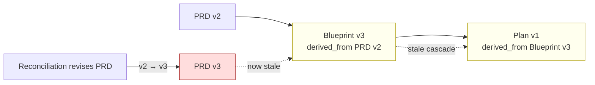

## 12. What the field settled on

No major agent framework detects a superseded-upstream derivation and forces re-sync; the agent world either **pins** (durable-execution engines reuse cached results and contain version *skew*, but do not re-derive dependents) or relies on **forward-only gating**. The settled answer lives in the two adjacent fields that solved this — data pipelines and build systems:

| Dimension | The settled answer |
|---|---|
| **Detect staleness** | **Content/input hashing** (Bazel content-addressing; Dagster hashes code-version + input data-versions). Version counters second; timestamps weakest. |
| **Propagate** | **Mark-and-flood the reverse transitive closure** — invalidate exactly the downstream descendants (dbt `state:modified+`; Bazel reverse-closure). |
| **Auto-rerun vs gate** | Both exist; **write-audit-publish gates** — a new version is blocked from becoming what consumers see until it passes. |
| **Scope** | **Only the affected subgraph** — "early cutoff" stops at any node whose recomputed result is unchanged. |
| **Identity** | Mature systems **combine** content-addressing (precise, needs deterministic outputs) with version counters (cheap, tolerate non-determinism). |

## 13. The freshness mechanism

The input-digest detection at the core of this mechanism is empirically validated and is treated as decided. Six moves:

1. **Stamp lineage digests, not just paths.** Each artifact records, for every declared upstream, that upstream's version-id and a **content digest of its declared structured-boundary fields** (requirement / AC / contract IDs and their statements, canonicalized via RFC 8785 — see D16), **not the surrounding prose**. An LLM regenerates prose every run, so a whole-file byte-hash false-invalidates; the structured-boundary digest detects "the input I was built from has changed" without tripping on cosmetic churn. A whole-file hash is the per-doc-type fallback where structured extraction is unreliable.
2. **Run a freshness gate at every handoff and reconciliation re-entry** — does each artifact's recorded upstream digest still match the current digest? Mismatch → stale. Cheap code, not an LLM call.
3. **Propagate down the reverse transitive closure** — one graph walk marks every transitive downstream of a bumped upstream stale; no agent invocations.
4. **Gate; don't blind-rerun** — block forward progress, surface the exact stale set, hand it to the reconciler to re-author upstream-first.
5. **Re-derive from clean context, never patch in place** — re-author a stale downstream from clean context plus the fresh upstream, rather than editing it with carried-over contaminated context. (Distinct from crash *replay*, which restores an *interrupted* run without redoing work — see the Operational recovery subsection following §18.)
6. **Pin the run to fixed contract versions** — separately from artifact freshness, pin the substrate so templates/contracts can't shift mid-flight. Freshness handles stale *instances*; pinning handles stale *contracts*; the two are orthogonal.

**Figure V8 — The freshness mechanism, end to end.** Detect by digest, gate, re-author from clean context, re-stamp.

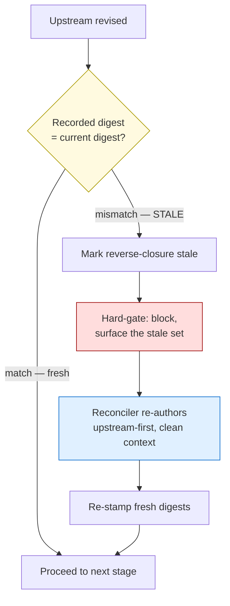

## 14. The invalidation decision

| Option | Verdict | Reason |
|---|---|---|
| **Detect + hard-gate** | **Adopted (v1)** | Block forward progress, flag the stale set, let the reconciler decide order. Cheap, no thrash, surfaces staleness immediately — the write-audit-publish posture. |
| **Auto re-derive everything** | **Rejected** | Auto-rerunning expensive non-deterministic agents on every minor upstream tweak thrashes. |
| **Tiered / early-cutoff** | **Adopted (spike-gated frontier)** | Fine-grained early-cutoff over non-deterministic artifacts is unsolved: the approach is to declare sub-artifact dependency edges and hash each one's structured boundary, with an LLM judge usable only to *suppress* an invalidation it is confident is immaterial (never as sole authority). Sequenced as a spike; the v1 whole-descendant invalidation is the always-correct fallback. |

---

# Part V — Reliability III: Observability

## 15. What observability entails

Observability is **runtime telemetry** answering one question: *what did the pipeline actually do on this run?* — which stages ran, which gates passed or failed, how many reconciliation cycles, where tokens and time went, when an artifact went stale. It is distinct from the drift sentinel (which checks the substrate is *built* right) and from evals (which judge whether output is *good*). Two standards inform the design — but **only one is ingested into a backend**. OpenTelemetry carries the **execution** half (what ran, how long, what failed). The **artifact-lineage** half is *not* sent to a separate lineage backend — it is already captured in git by the freshness gate's `derived_from` graph (Part IV); we borrow OpenLineage's run-lifecycle vocabulary to shape that view, but run no OpenLineage service (it would cost a second container for provenance we already hold in git — TB2):

| Standard | Owns | Model |
|---|---|---|
| **OpenTelemetry GenAI semantic conventions** (`gen_ai.*`) | LLM / agent-call telemetry | **trace = run, span = step**; each agent/tool call a span, nested into a DAG. (Still experimental; core attributes stable in shape.) |
| **OpenLineage** (model borrowed, *not* a backend) | artifact / lineage telemetry | **Job → Run → Dataset**; a run is `START` + one terminal event; metadata is additive; extensible facets. We borrow this vocabulary to shape the lineage view; the data itself is the freshness gate's in-git `derived_from` graph (Part IV) — no OpenLineage service runs. |

The settled answers: trace = run, span = step; capture operation/provider/model/tokens/latency/error + tool name (cost derived from tokens; large payloads in span events); gate results attach to the run as typed pass/fail with severity; **freshness is a first-class status, not a buried metric**; the append-only event log is the system of record and the queryable view is a projection folded from it. Crucially, the **backend ingests OpenTelemetry only**: artifact provenance is the freshness gate's `derived_from` graph (Part IV), queryable from git and projected into the run-summary — there is no OpenLineage backend, because that lineage already lives in git and a second service would buy nothing.

## 16. Sentinel vs observability — the distinction

| Dimension | Drift Sentinel (component 6) | Observability (component 7) |
|---|---|---|
| Question | "Is the machine wired correctly?" | "What did the machine do on this run?" |
| Subject | the **substrate** | a **run** |
| When | config-time / CI / SessionStart | runtime, during every run |
| Output | pass/fail on substrate integrity | an append-only stream of run events |
| Prevents | a dropped gate, a hardcoded rule, a missing contract or bundle part | being unable to tell where cycle time went |

The sentinel guarantees the gates *exist*; observability records whether, when run, they *fired and helped*.

## 17. The run-event surface

Emit **one append-only JSONL log per run** (the system of record), with the run-summary as the projection folded from it. Telemetry is **two-level**: the coordinator emits the stage-boundary events below, and the runtime captures **per-actor spans** (and the tool calls inside them) nested under the stage — the "span = step" depth, the same per-agent record the workflow runtime already writes. Actors stay stateless: they do not write the log themselves; the runtime instruments them at their boundaries (hence the Actors → Observability edge in V4). Event shapes borrow OpenLineage's run lifecycle and OTel's attribute names:

| Event | When | Carries |
|---|---|---|
| `run.start` / `run.complete` / `run.fail` | pipeline begin / end | run id, pipeline name, manifest version, scope class |
| `stage.start` / `stage.complete` | each stage | actor, artifact + version + digest, input artifacts + their digests, tokens, cost, latency |
| `gate.result` | each gate | gate id + type, pass/fail, classification (mechanical/semantic), severity, finding count |
| `freshness.stale` | digest mismatch | the bumped artifact, the stale reverse-closure set |
| `cycle.open` / `cycle.close` | reconciliation | cycle index, what bumped, what re-authored |
| `actor.span` (+ tool / retry sub-spans) | each actor, nested under its stage | actor id, parent stage, tool name, tokens, cost, latency, retry count — **runtime-captured** (the "span = step" depth) |

**Figure V9 — Run-event data flow.** Events fold into one append-only log (the system of record); the projection is a queryable view.

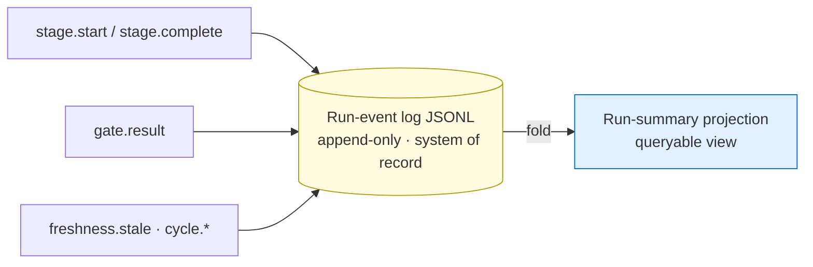

## 18. Observability vs evals; durability; export

- **Observability ≠ evals — separate but linked.** Deterministic `gate.result` events are the "code evals"; reviewer/auditor verdicts are the "judge evals." Both attach to the same run by id, but they are not the same signal. And because judge evals are themselves **noisy**, observability tracks each reviewer gate's **stability** — verdict agreement across re-runs / order-swaps / panel members (R20) — as a reliability metric on `gate.result`, not just the pass/fail.
- **Durability.** Point the backend's persistent store at a **mounted persistent volume** so run history survives restarts and rebuilds; commit the run-summary projection to the deliverable archive for a durable human record. There is **no** immutable / compliance audit trail — no WORM / object-lock store and no retention lock. Config-versioning (pinning prompt/model/tool/template versions per event) is an optional reproducibility aid, not a requirement.
- **Export.** The JSONL log is the system of record; the primary export path is a small SDK-free script that POSTs it to OTLP, landing in a **self-hostable single-container OTel backend** (the plan names the product — D13/D17 — now open to re-evaluation). A log-shipping connector is an optional convenience, so the script is preferred. The pipeline never depends on the backend being up.

---

### Operational recovery (crash-safety)

A pattern whose economics rest on "don't re-run expensive non-reproducible actors" must survive a mid-run crash without redoing them — so crash-recovery is **in scope**, folded in minimally by *reusing the run-event log* rather than adding a durable-execution engine. The engines (Temporal, Restate, LangGraph) converge on one pattern: *persist progress at step boundaries; on restart replay what already happened rather than re-running it; put every outside-world effect behind a boundary that records its result so it fires once.* Three obligations:

1. **The run-event log is the recovery journal** (its role beside audit and the improvement loop — the log's triple role, see "The improvement loop" below). On restart, completed `stage.complete` / `gate.result` boundaries replay from the log rather than re-execute. *Caveat:* a journal that doubles as the audit trail carries a confidentiality obligation — entries are plaintext unless encrypted, so keep credentials/PII out (TB10), and the log is bounded (compact/rotate; don't grow it without limit).
2. **Idempotent actor boundaries (R21).** R5 guarantees an actor is *re-runnable*, not that re-running won't *duplicate* a side effect. Any actor whose write touches the outside world carries an **idempotency key derived by the coordinator from durable run-state (`{run}:{stage}`), never minted by the model** — a key living only in an actor's context vanishes on replay. Generate it at the stage boundary (stable across attempts); treat a duplicate as success.
3. **Durable human approvals.** A human-gate decision is a recorded, durable boundary: an interrupted approval replays to its wait point on restart — never lost, never silently re-requested. (Requires a persistent checkpoint; an in-memory one loses the approval on eviction.)

This **reconciles with freshness** (Part IV): replay restores an *interrupted* run without redoing work; freshness re-derivation deliberately *redoes* a *stale* artifact from clean context. Different triggers (a crash vs. a superseded upstream), different actions — they do not conflict. Recovery is exercised by replaying recorded run-logs against current code in CI, and by deliberately crashing at the worst moments (after a side effect succeeds but before its boundary is written; after an approval but before execution).

---

### The improvement loop (the data flywheel)

Observability that only fills a dashboard is wasted. The consensus is that **the improvement loop begins and ends with a trace**: collect run-events → enrich with evals + human-gate feedback → identify failure patterns → make a targeted change → validate it against an accumulated eval suite before shipping → repeat from a higher baseline (LangChain). This turns the document's own "you can't maintain what you can't measure" from a slogan into a flywheel, and is the **third role of the run-event log** (beside audit and recovery). It **reuses the existing surface** — the append-only log is the raw material; a **periodic batch** (not per-run) does the work — via four mechanisms:

1. **Trace-to-eval curation.** Recurring findings and human-gate adjudications become labeled examples. A recurring *mechanical* finding becomes a **new cheap deterministic validator** — promoted *down* from the expensive reviewer to a cheap gate, closing the document's own thesis (push mechanical work to cheap code) as a *measured* loop, not a one-time design act. A recurring *semantic* finding becomes a new **rubric dimension** for the reviewer (R20). Every surfaced failure becomes a permanent **regression case** in the corpus — the golden set (MLflow: eval datasets built from traces).
2. **Gate ROI / dead-gate pruning.** Track per-gate fire-rate, true-positive (catch) rate, false-positive rate, and downstream cost-saved. Prune gates that never fire or only false-positive; add a cheap upstream gate at any seam that keeps producing late findings. This is the maintainability payoff (Part VIII) the document promised but never operationalized.
3. **Online vs. offline evals.** *Online* = the `gate.result` / `cycle.*` stream scored continuously on every run (deterministic gates are the "code evals"; sampled reviewer verdicts the "judge evals," carrying their stability metric, R20). *Offline* = the historical-run regression corpus (rollout WS-0), replayed against every change — a new gate, a contract bump, a manifest edit, a rubric/prompt change — for a concrete before/after, so each iteration is proven *better*, not merely *different*.
4. **Insights / clustering.** Cluster findings across runs to discover failure modes nobody pre-defined (Part I's "top revision triggers by frequency" is a manual, one-shot version; the loop makes it continuous). This is also where domain-source drift (R23) and judge instability (R20) surface as trends.

**Human-approved promotion is mandatory (R24).** Telemetry *proposes* — a new validator, a pruned gate, a rubric change; a human (the **promotion** class of the human gate) *approves* before it lands. Auto-promotion is forbidden: it invites Goodhart (stub-stuffing to satisfy a metric) and the self-referential fragility the document already names (a meta-run that tightens its own gates). The flywheel is a **flashlight, not an autopilot** (NVIDIA): it illuminates; humans decide. And it is cleanly distinct from run-time gates — *gates enforce at run time; the flywheel refines the gates/contracts/rubrics over time* (the guardrails-vs-feedback-pipeline split, Databricks; the OTel→Lakehouse flywheel).

**Figure V18 — The improvement loop (the flywheel).** How run-events become a better pipeline over time — proposals are human-approved and corpus-validated before shipping; begins and ends with a trace.

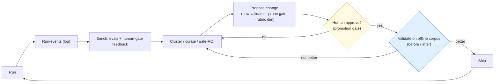

---

# Part VI — Extensibility: The Domain-Pack Pattern (domain level)

## 19. The domain bundle and the two kinds

A **domain** is a unit the pipeline is composed of, and it ships a standard bundle — its **bill-of-materials**:

- **Platform KB** — facts about the system (or `none`, for layers whose platform varies).
- **Design KB** — the design discipline for that domain.
- **Auditor** — a config-surface auditor (or `none`, with a rationale, where there is nothing checkable).
- **Designer** — a per-layer designer agent (or `folded_into` other designers, the MCP model).

Two kinds, both registered with a bill-of-materials:

- **`engineering-layer`** — the Layer-Scope-bearing layers consumed by per-layer designers (frontend … claude-code).
- **`cross-cutting-domain`** — domains that ship a triad but are not one of the layers and touch many of them. **MCP is the exemplar; observability follows it.** This respects the rule against inventing a new engineering layer: observability is a cross-cutting domain, not a tenth layer.

## 20. The domain registry — source of truth

Every domain is declared once, in the canonical registry, with its full bill-of-materials and its **install sites** (the scopes and paths where each part lives — project `.claude/`, user `~/.claude/`, the MCP config, the devcontainer). Nothing counts as installed unless the registry says so; legitimately-partial bundles are explicit (`auditor: none (rationale)`, `designer: folded_into: […]`) so completeness can be checked without false-flagging an intentional gap.

**Figure V10 — Domain registry and conformance.** The registry declares the bundle; the conformance check verifies presence and flags orphans.

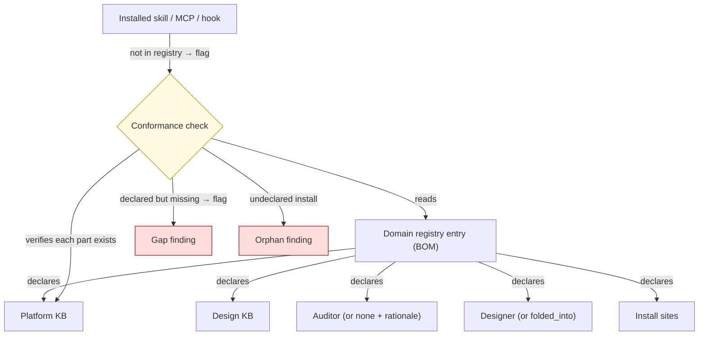

## 21. The conformance and orphan check

The keystone of predictable extensibility is a deterministic check, run by the same drift sentinel, that:

- **Completeness** — every registered domain has its declared bundle parts present on disk (honoring `none` / `folded_into` markers).
- **Orphan detection** — every installed `KB-*` / `auditing-*` / `design-*` skill, MCP server, and hook is declared in the registry; anything installed-but-undeclared, **across project and user scope**, is flagged. This is the check that would have caught the orphaned capability the manual removal missed.

Auditor dispatch is **registry-driven**, not a hard-coded table — adding an auditor is a registry entry, not a code edit.

## 22. The domain lifecycle

- **Add** — a scaffold emits the standard bundle (KB skeletons, auditor, designer or `folded_into`) **and** the registry entry atomically, so a domain can never be half-installed. Uniform additions, by construction.
- **Conform** — the conformance check confirms the new bundle is complete and registered.
- **Remove** — teardown is a **registry-driven reconciliation across all install sites**, not a delete: read the install sites, remove each part, drop the registry entry, then run the orphan check as the completion gate. This is the lesson the field is unanimous on — Terraform removes a provider only when every reference drops it; Kubernetes keeps an object "Terminating" until finalizers confirm cleanup and owner-references prevent orphans.

**Figure V11 — The domain lifecycle.** Add → conform → teardown, with the orphan check as the removal completion gate.

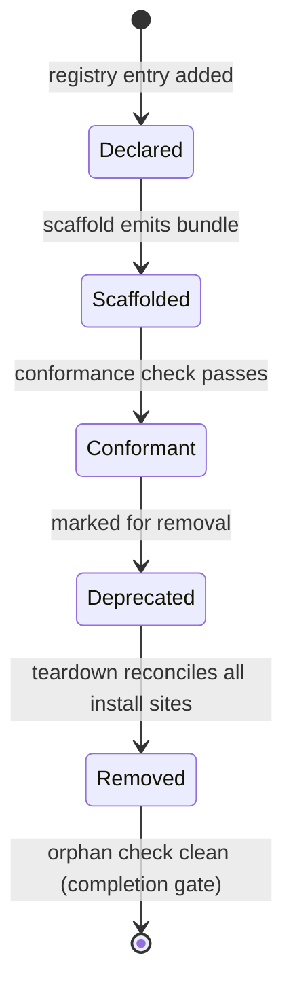

## 23. Observability as the first domain through the pattern

Observability is added **through** this mechanism — both delivering its bundle and proving the scaffold and conformance on a real case. Its bundle: a Platform KB (OpenTelemetry + the self-hosted backend the plan selects; the lineage view is the freshness gate's in-git `derived_from` graph, not an ingested OpenLineage backend), a Design KB (the discipline in Part V), an Auditor (checking the run-event schema, the emitter wiring, the persistent-volume store, the export path), and a designer `folded_into` the layers that instrument (backend, query, api, cicd, iac). It registers as a `cross-cutting-domain` with its install sites recorded, so it is itself teardown-able.

---

### Tool governance (the MCP layer)

Actors act through **tools** — MCP servers and built-ins. Today the tool *vocabulary* is canonical (`tools.yaml`) and MCP is itself a domain (its platform/design KBs + auditor), but the **operational tool lifecycle is ungoverned**: which agent gets which tool, at what permission, how it loads, whether it is *available and initialized* in the agent's run context, and how it is added/updated/removed. This is where the recurring dev-environment failures live — a startup probe found a server *reachable but not initialized* (serena with no active project) in a fresh agent context. The fix is the **domain-pack pattern at the tool grain**: a registry + lifecycle + health probe + usage telemetry, reusing the same machinery, not a new system.

**The tool registry (canonical)** declares, per tool — answering *why / what / how / where / when*:
- **assigned agents + role-permission scope** — *which* agents, at a *narrow per-tool* allowlist vs whole-server scope set by the agent's role (the MCP design discipline); least-privilege by role.
- **context budget** — tools cost context; declare preloaded vs deferred (loaded on demand via tool-search) so an agent isn't bloated by tools it rarely uses.
- **load + init mechanism** — *how* the agent obtains it: `skills:`-preload, subprocess dispatch, deferred tool-search, or an MCP server that additionally requires an **init step** (e.g. `activate_project`). The init requirement is part of the contract, not folklore.
- **read / write class** — most tools read (a knowledge-substrate action); some write (take action). Write-class tools inherit the idempotency obligation (R21) and credential indirection (TB10).
- **health / availability check** — a startup probe validates the tool is reachable *and initialized* in the agent's actual run context, not merely configured (the existing `.devcontainer/lib/mcp-ping.sh` + `mcp-auth-probe.sh` are the seed).

**The lifecycle (add / update / remove)** is registry-driven and **scope-aware** — the orphan lesson applies to tools verbatim: a tool removed from the project but still installed at user scope orphans and resurfaces (the exact failure that took a multi-surface manual hunt). Add = register + assign + scope-permission + health-check; remove = teardown reconciliation across *all* install scopes (project + user + config) + the orphan check (reuse the Part VI teardown). **Usage is observed** — tools emit tool-use spans (D-OBS-1): which agent used which tool, failures, latency — so a never-used grant can be pruned and a failing tool surfaced. This makes tooling a governed component with the same registry + conformance + lifecycle + orphan-check shape as domains (R22).

### Keeping domains fresh (KB + auditor drift)

A domain's KBs are **durable knowledge** (Part VII) derived from authoritative upstream sources — and those sources move (a spec revises, a tool deprecates; the removed servers are examples). Two rots follow: **KB staleness** (the KB lags its source) and **auditor drift** (the auditor enforces rules its KB no longer states, or misses rules the KB now states). Neither is detected today. The mechanism reuses what we have:
- **Declare authoritative sources.** The domain BOM gains an `authoritative_sources` field — the upstream specs/docs the KB derives from, each with a captured digest/date (the lineage-digest idea, R11, applied to *external* sources).
- **Detect drift.** A periodic check (the `research-and-verify` workflow) re-checks each source; a material upstream change flags the KB **stale** via bi-temporal supersession (R18 — mark superseded, surface current), never silently.
- **Refresh + re-sync the auditor.** A KB refresh triggers an **auditor-sync check** asserting the auditor's enforced rules match the current KB (no dropped rule still enforced; no new KB rule unenforced) — the canonical-drift discipline applied to the KB↔auditor contract.

This runs inside the improvement loop (Part V) — a periodic batch, not per-run — governed by the same drift sentinel (R23).

---

# Part VII — Durable Knowledge Governance (the across-time level)

## 24. The third level: knowledge that accumulates over time

Documents are governed within a run (Parts III–V); domains are governed as the pipeline is composed (Part VI). A third class of state accumulates *across runs* and must also be governed: **durable knowledge** — the decision records (ADRs), the agents' persistent memory, the auto-memory, and the context/instruction files (`CLAUDE.md` / `AGENTS.md`). It is the freshness problem of Part IV on the longest timescale: knowledge that was true once silently shapes every future run after it stops being true.

The cross-cutting diagnosis is uniform across all three knowledge surfaces: governance today is **size and credential hygiene only**. Freshness, content-conflict, and stale-supersession are not checked anywhere. The substrate answers it the same way it answers the other two levels:

- a **generated index** is the entry point (the registry-of-truth for knowledge), not grep;
- **supersede, never overwrite** — append-only with invalidation, surfacing a current view (the project already does this for ADRs; it must extend to memory);
- the **sentinel** checks freshness, conflict, and anchoring-to-canonical — not just size and credentials.

Current state (evidence: Appendix A): 68 live ADRs with ~1,470 internal cross-references and **no index**, with two live-but-`Superseded` records intermixed; sub-agent and auto-memory carry **no freshness field and no conflict/supersession check**; and the multi-level memory/context hierarchy is **additive — "no override, no de-duplication"** by design, so cross-level conflicts go unresolved.

## 25. Decision records at scale (ADRs)

The decision store is large and densely linked but has no entry point. The field's consensus is not "write fewer ADRs" — it is **generate a decision-log index and filter to a current view**:

- **A generated index** lists every ADR with status, title, tags, and links — produced from the folder (e.g. adr-log / Log4brains), never hand-maintained, with a CI drift check against the folder. For a large, un-indexed store this is the single highest-leverage move: it turns ~1,470 raw cross-references into a navigable entry point.
- **A status-filtered "current decisions" view** keeps the live set small while history stays intact — superseded records move to a `superseded/` subtree or are filtered out of the live index.
- **Supersession discipline already exists** here (append-only; `supersedes` / `superseded_by` frontmatter, all links resolving). Keep it, and close the hygiene gaps: enforce **two-way links**, normalize the status casing, and relocate the two live-but-superseded records.
- **One decision per ADR, with stable IDs that are never renumbered** — so a decision can be superseded cleanly and every cross-reference stays valid.
- **The decision graph (the AI-interfacing surface — D-KN-2).** Typed, bidirectional relations (`supersedes`, `depends_on`, `constrains`, `conflicts_with`) **derived from the committed ADR frontmatter + canonical** — *authored, not LLM-extracted*, so it skips GraphRAG's costly/brittle entity-extraction step and most of its failure modes. **No graph database**: the graph is built from frontmatter into a file/SQLite form (recursive queries suffice well below 10⁵ edges; we have ~68 ADRs), keeping it inside TB1/TB2. Agents *query* it through a **typed MCP surface** — predefined parameterized queries ("which superseded decisions are still in production?", "what blocks this migration?"), **not** raw Cypher or natural-language-to-query, with context-budget discipline (timeouts, truncation). Supersession is **bi-temporal — invalidate the edge (`invalid_at`), never delete** — so both "true now" and "believed at time T" stay answerable. A **cross-link-integrity validator** (two-way links + supersession resolution) guards it in the sentinel. The generated status-filtered index stays the *human* entry point; the graph is the *agent* entry point. This is where the dense cross-link web becomes an asset instead of a navigation cost.

**Figure V16 — Decision log + decision graph.** A generated, status-filtered index is the entry point into an otherwise un-navigable store (representative subgraph, not all ADRs).

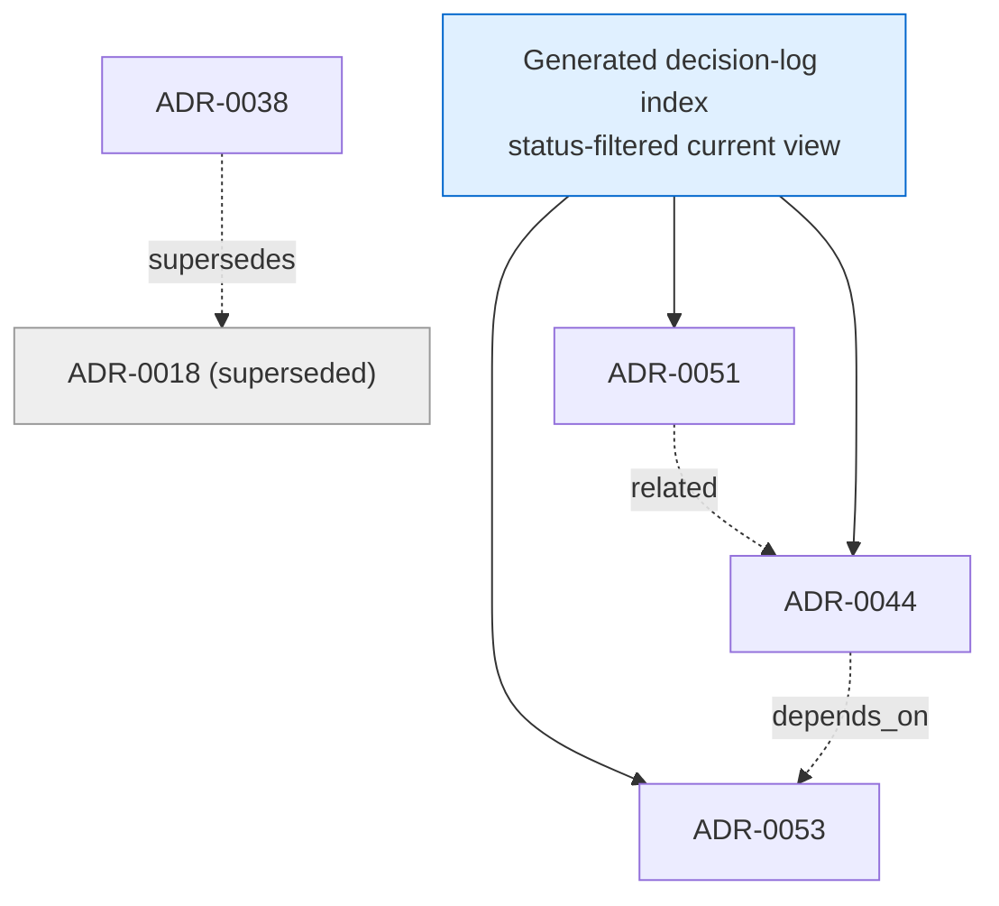

## 26. Memory and context-file governance

**Agent and auto memory.** The conflict-resolution mechanism the field converged on is **bi-temporal validity with invalidate-not-delete**: separate *when a fact was true* from *when it was learned*; when a new memory contradicts an existing one, **mark the old superseded** (keep its lineage) and surface the current one by recency + source-authority + relevance — never destructively overwrite, and never go append-only-without-resolution (which defers conflict forever). The lifecycle is **detect → resolve → prune**: on write, retrieve semantically-similar memories and judge contradiction with a model (not a bare cosine gate); resolve by invalidation; prune asynchronously (dedup, decay past a freshness threshold, consolidate) while retaining lineage. Writes are **anchored to canonical** — a memory that contradicts current canonical or a superseding ADR is flagged. The drift sentinel gains a **memory freshness + conflict check** beside its existing size/credential checks, and memory entries carry a written-at field (and, where apt, a validity window).

**Context files (`CLAUDE.md` / `AGENTS.md`).** The single-source design is already correct — `CLAUDE.md` is a symlink to one `AGENTS.md`, under the ~200-line budget, so every tool reads identical bytes. Two disciplines close the remaining gaps: (1) **resolve cross-level conflicts by not authoring them** — no agent tool runs a true override engine; all levels (enterprise / user / project / local) concatenate and the model arbitrates, so a rule lives at **exactly one level**, never duplicated; (2) **grow by path-scoped loading, not bloat** — as the file nears its budget, move conditional rules into path-scoped `.claude/rules/` (loaded only when work touches that subtree) rather than enlarging the always-on file, because `@import` is organizational only (it does not save tokens) and accuracy degrades as the always-on context grows ("context rot").

**Figure V17 — The memory lifecycle (detect → resolve → prune).** The freshness mechanism (V8) on the across-runs timescale: supersede-not-overwrite, anchored to canonical.

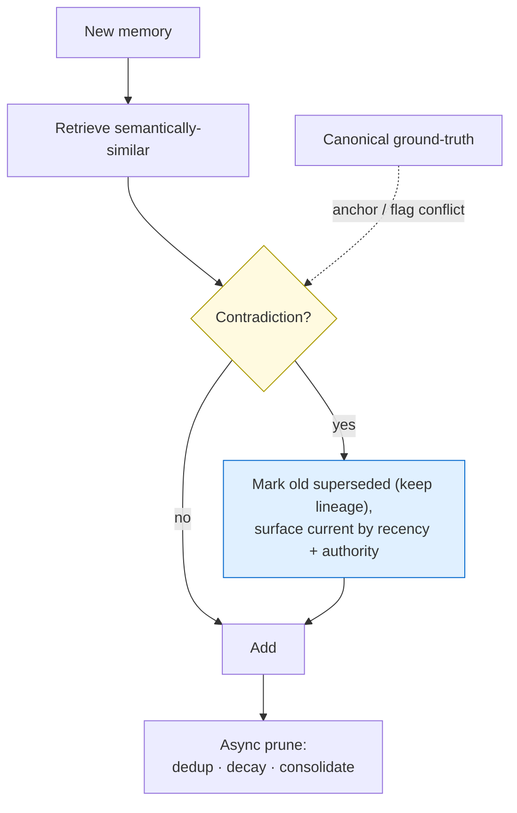

---

# Part VIII — Cross-Cutting Disciplines

## 27. The rules

| # | Rule | Level |
|---|---|---|
| R1 | **Single source of truth.** Every rule, vocabulary, schema, topology, and domain bill-of-materials lives once, as data. | both |
| R2 | **Deterministic gates guard probabilistic handoffs.** Cheap check before expensive agent, at every seam. | document |
| R3 | **Gates are declared, not remembered.** The manifest enumerates every edge and its gate; the coordinator drives from it. | document |
| R4 | **Independence of the checker.** What validates an artifact is never what produced it. | document |
| R5 | **Communicate by reference; actors are stateless.** Any actor is re-runnable from its inputs. | document |
| R6 | **Fail loud, fail early.** Missing contract or malformed canonical halts with a clear error, never proceeds on defaults. | both |
| R7 | **Route by classification.** Findings are typed; mechanical loops back, semantic escalates. | document |
| R8 | **The substrate audits itself.** The sentinel: every contract has a validator, every edge a gate, every domain its bundle, no hardcoded rules, no orphans. | both |
| R9 | **Version and propagate atomically.** A contract/template change bumps its version and lands with dependent fixes in one commit. | both |
| R10 | **Tier gates to blast radius.** Not every pipeline gets every gate; the manifest declares the tier. | document |
| R11 | **Lineage freshness.** Every artifact records the digest of each upstream; a freshness gate blocks any stage operating on a superseded predecessor. | document |
| R12 | **Pin the run to fixed contract versions.** A live run pins its substrate so contracts can't shift mid-flight (complement to R11). | document |
| R13 | **Every gate emits a typed event.** A gate you can't measure can't be pruned or defended. | document |
| R14 | **The domain registry is the source of truth.** Every domain declares its full bill-of-materials and install sites; nothing is installed unless registered. | domain |
| R15 | **Removal is registry-driven reconciliation.** Teardown enumerates all install sites from the registry and an orphan check confirms completion — never a manual delete. | domain |
| R16 | **Additions are uniform and atomic.** A domain is added via a scaffold that emits the standard bundle and the registry entry in one step. | domain |
| R17 | **Durable knowledge has a generated index.** The decision log and the memory index are generated entry points with a CI drift check — not hand-maintained, not navigated by grep. | knowledge |
| R18 | **Supersede, never overwrite; surface the current.** Knowledge (decisions, memory) is append-only with invalidation; a new entry that contradicts an old one marks it superseded (bi-temporal validity), and a current view filters to live entries. | knowledge |
| R19 | **Anchor knowledge to canonical; check freshness + conflict.** The sentinel flags memory or decisions that contradict current canonical or a superseding record, and flags entries past their validity — the freshness discipline on the across-time scale. | knowledge |
| R20 | **The probabilistic judge is never the unhardened sole authority.** A reviewer gate uses binary verdicts + a calibrated human-authored rubric + chain-of-thought + an abstain/escalate path; high-tier gates add a diverse cross-provider panel. Generalizes the freshness "judge may only suppress, never sole authority" to the main reviewer. | document |
| R21 | **Idempotent, replayable execution.** The run-event log is the recovery journal; on restart, completed boundaries replay rather than re-run. Any actor with an external side effect carries a coordinator-derived idempotency key (`{run}:{stage}`, never model-minted); human approvals are durable boundaries. | document |
| R22 | **Tools are governed like domains.** Every tool is registry-declared (assigned agents, role-permission scope, context budget, load+init mechanism, health check, read/write class); add/update/remove is registry-driven and scope-aware; a startup probe validates availability *and initialization* in the agent's actual context. | both |
| R23 | **Domains declare authoritative sources and are kept fresh.** Each bundle records its upstream sources (digest/date); a periodic check flags a KB stale when its source drifts, and a KB refresh triggers an auditor-sync check so the auditor's rules track the KB. | both |
| R24 | **Telemetry closes the loop.** A periodic batch over the run-event log curates evals, computes gate ROI, and clusters failures; it *proposes* new validators / pruned gates / rubric changes that a human approves before they land (never auto-promote), each validated against the offline corpus. The system learns from its own runs. | both |

> R9 versions the *substrate* (templates/contracts); R11 versions *artifact instances within a run* and detects a superseded-upstream derivation. Different problems, different timescales.

## 28. The anti-patterns

| # | Anti-pattern | What it looks like |
|---|---|---|
| A1 | **Rules in prose only** | A checkable rule in Markdown with nothing enforcing it. |
| A2 | **Orchestrator as rulebook** | Topology baked into orchestrator prose, so an edit silently drops a gate. |
| A3 | **Self-approving actor** | An agent that authors *and* validates its own output. |
| A4 | **Agent-to-agent dispatch** | Actors spawning actors — loses the coordination point where gates interpose. |
| A5 | **Local redefinition** | A validator hardcoding a constant instead of importing canonical. |
| A6 | **Contract-in-prompt** | Embedding the document spec in the agent prompt instead of reading the canonical template — drift on every spec change. |
| A7 | **Silent skill reference** | Naming a nonexistent skill — loads as nothing; the system believes it has knowledge it doesn't. |
| A8 | **Gate without instrumentation** | A check that logs no pass/fail/classification — can't be proven worth keeping or pruned. |
| A9 | **Over-gating** | Forcing the full gate stack on a single-doc, human-approved flow with no expensive downstream. |
| A10 | **Wrong gate type** | A reviewer checking what a script could check exactly — or a script judging something genuinely semantic. |
| A11 | **Stale handoff** | A stage consumes an artifact derived from a superseded upstream, with no freshness check. |
| A12 | **Patch-in-place re-derivation** | Re-running a stale downstream by editing it with contaminated context, not re-authoring from clean context. |
| A13 | **Observability as evals** | Conflating telemetry ("what happened") with quality judgment ("was it good"). |
| A14 | **Ragged bundle** | A domain missing bundle parts with no explicit `none` rationale — silent incompleteness. |
| A15 | **Untracked install scope** | A capability installed at a scope the registry doesn't record — the orphan that resurfaces after "removal." |
| A16 | **Manual teardown** | Removing a domain by hand-hunting surfaces instead of registry-driven reconciliation. |
| A17 | **Ungoverned knowledge sprawl** | A decision or memory store grown large with no generated index, navigated only by grep. |
| A18 | **Destructive memory overwrite** | Replacing a memory in place (losing history, creating silent conflict) — or append-only-without-resolution, which never resolves and defers conflict forever. |
| A19 | **Cross-level instruction conflict** | Authoring contradictory rules at different memory/context levels (no override engine exists), or duplicating a rule across levels. |
| A20 | **Single-pass judge as sole authority** | One unhardened LLM judge issuing an ordinal score as the final gate verdict — no rubric, no order-swap, no abstain path, no panel for a high-stakes gate. The most bias-prone, least reproducible configuration. |
| A21 | **Non-idempotent re-execution** | Replaying or retrying an actor whose write has a side effect with no idempotency key (or a model-minted one that vanishes on replay) — duplicating or corrupting external state on recovery. |
| A22 | **Unvalidated tool assumption** | An agent assuming a tool is available/initialized in its context with no health check (e.g. serena reachable but no active project), or a tool installed at one scope but not declared/torn-down across all scopes (the orphan, for tools). |
| A23 | **Stale domain bundle / auditor drift** | A KB lagging its authoritative upstream source with no staleness signal; or an auditor enforcing rules its KB no longer states (or missing rules it now states). |
| A24 | **Auto-promotion from telemetry** | Letting the flywheel change gates/contracts/rubrics without human approval — invites Goodhart (gaming the metric) and self-referential fragility (a meta-run tightening its own gates). |

## 29. Maintainability

**The paradox.** A pattern that exists to kill drift can *multiply* it: a document type whose rules are restated in the template, the validator, the reviewer checks, the agent instructions, and the enum has five places to disagree. The load-bearing principle is therefore single-source-of-truth, derive the rest (R1). If parts restate rules instead of deriving them, the pattern rots within a few runs.

| Failure mode | Mitigation |
|---|---|
| **Silent gate / bundle removal** | The sentinel asserts every manifest edge has a gate and every domain has its bundle (R3, R8, R14). |
| **Validator false-positive** | Validators are code → they need test fixtures; a flaky validator is an outage. |
| **Goodhart / stub-stuffing** | Validators check substance (stub detection), not just presence. |
| **Misrouted triage** | The mechanical-vs-semantic classifier is the linchpin; it is a **distinct axis from severity** (routing ≠ severity — `severity.yaml` does not own it) and needs its own canonical home — a routing-classifier entry the plan schedules (WS-0), read by R7/A10. |
| **Pin-and-forget** | Version-bump→propagate must be cheap and enforced, or pins become cargo-cult. |
| **Contract can't express the rule** | Keep the mechanical/semantic boundary explicit (A10) so a gate never claims coverage it lacks. |
| **Shared-harness blast radius** | The shared harness gets the strictest change discipline and best test coverage. |
| **Self-referential fragility** | The pipeline improves itself; pin the run (R12) and tier gates (R10) so over-tightened gates don't bite the meta-runs. |

**Two prerequisites.** *You can't maintain what you can't measure* — instrument every gate (R13) before adding more, or dead gates accumulate unfalsifiably. *Reuse the mature thing* — the execution side already has schema'd result artifacts, stub detection, and dimensional verdicts; extract its proven gating into the shared harness rather than growing a second one.

**Tier to blast radius (R10).** Full gate stack for the feature and execution pipelines (expensive downstream, low reversibility); a light self-check for report-only flows; a minimal self-check for single-doc human-approved flows. Once the coordinator drives the manifest via Dynamic Workflows (D-ORCH-1), each new pipeline is a manifest entry that picks a tier.

### Human oversight (a designed control, not an escape hatch)

The human gate is load-bearing in two distinct, durable places — both are *designed controls* with a defined decision-scope, not an undefined escape hatch:

- **Run-time — the semantic-escalation class.** Triage routes *mechanical* findings back to the producer automatically (the cheap loop); only the **semantic-escalation class** reaches the human — a substantive design disagreement, or a reviewer *abstention* (R20). The human never adjudicates mechanical loops.
- **Over-time — the promotion class.** The improvement loop *proposes* changes to gates / contracts / rubrics; the human **approves promotion** before they land (R24, A24). No auto-promotion.

Both are **durable, recorded boundaries** (R21): an interrupted approval replays to its wait point on restart — never lost, never silently re-requested (requires a persistent checkpoint). Oversight is **tiered by blast radius** (R10): full-tier pipelines escalate more (low reversibility); minimal-tier flows treat the single human approval as *the* gate. So the human gate has a defined scope (which decision class), a durability contract (survives a crash), and a tier (how much escalates) — a control, not a catch-all. (Run-time escalation appears in V5; promotion appears in V18.)

## 30. Dev-environment (Codespaces) lifecycle constraints

The pipeline runs inside an ephemeral Codespace (single container: Dockerfile + Features; no docker-compose). The lifecycle treats artifacts very differently:

| Artifact | Durability |
|---|---|
| Contracts, manifest, registry, validators, **corpus fixtures** (committed to git) | survives rebuild/delete |
| Run-event JSONL (gitignored runtime dir) | ephemeral — lost on rebuild |
| Backend store (on a mounted persistent volume) | survives rebuild **only if** on a mounted persistent volume; mutable |
| Run-pinning state (`/workspaces`) | survives stop/start, lost on rebuild |

Discipline: install persistent tools (validator deps, the observability backend + its log-shipper) in the **Dockerfile** (prebuild-captured, survives rebuild); start the observability backend **opt-in**, never on every session start, and never via docker-compose for a service not always run; the default machine is 4-core/16 GB (the `8 GB` in `hostRequirements` is a loose minimum, not the provisioned size — the smallest tier meeting the 4-core floor is 16 GB, per the GitHub Codespaces machine-types docs; resizable at proportional cost — footprint is a tunable dial, single-container/no-compose is the hard rule), so keep the backend opt-in to stay on the cheap default; forward the backend's port at **private** visibility; route any remote-backend secret through Codespaces Secrets with env-block indirection. The committed corpus and contracts are durable by virtue of being in git — which is exactly why the corpus is a reliable regression guard across rebuilds; validation inputs never live in the ephemeral runtime dir.

---

# Part IX — Adoption: Where It Lives and How It's Enforced

## 31. The knowledge layering

There are layers of project knowledge. Platform KBs say *what primitives exist*; design KBs say *how to build one primitive well*; the **architecture discipline** says *how to compose and harden a whole pipeline* — a layer that sits above the others and composes them.

**Figure V12 — The knowledge layering.** The architecture discipline composes the lower layers and is enforced by code.

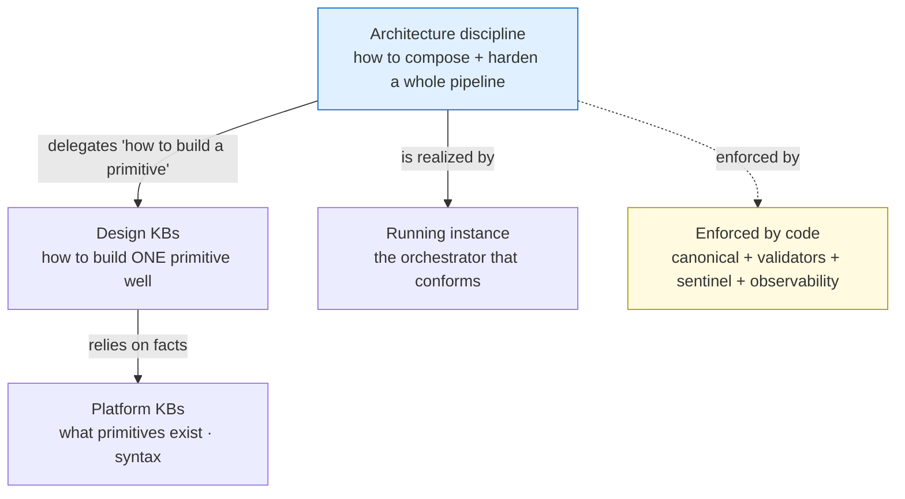

## 32. The skill homes and the four-way split

The architecture discipline is **not** one artifact. Putting the whole thing in a skill would be anti-pattern A1. It splits four ways:

| Concern | Home | Why |
|---|---|---|
| **Discipline** — principle, components, rules, anti-patterns, role-assignment, tiering, when-to-apply | a **Knowledge Skill** | Prose discipline, read when architecting; passive. |
| **Enforcement** — manifest schema, conformance/freshness/orphan checks | **canonical + validation library + drift sentinel** | A skill can't enforce; the teeth must be code. |
| **Runtime** — driving the manifest (hybrid; dynamic routing in code) | **per-segment Dynamic Workflow scripts + a sequencing coordinator** | One workflow per human-gated segment, sequenced via state in the run-event log (a gate can't live inside a script); migrated from prose by Strangler-Fig + parallel-run (D-ORCH-1). |
| **Observability** — event schema + emitter + projection | **canonical schema + validation library + run-summary** | Telemetry is code + data, not discipline. |

The decision to adopt is recorded as an **ADR**; the working discipline lives in the skill. The discipline skill **composes and cross-links** the per-primitive design KB, the contract KB, the validator library, and the reviewer discipline — it is an index/composition layer above them, with a sharp, explicitly-bounded description so it never collides on routing with the primitive-level design KB.

---

# Part X — Application

## 33. Worked example — Acceptance Tests in a real run

In one run, the test author improvised acceptance tests with no template, no self-check, and no boundary validator. The expensive cross-artifact auditor was the first eye on them, found two missing AC mappings and a phantom reference, plus four substantive drifts (seven findings total), and the reconciler re-invoked both the test author and the Composer — three audit rounds, two of them re-runs caused by mechanical findings the author could have caught itself.

Under the pattern: the test author reads the contract, pins its version and upstream digest, runs a self-check that fails on the missing/phantom references, fixes them in the same context window for free, and writes. A boundary validator (schema + cross-ref + freshness) passes clean. The auditor sees only clean input and spends its tokens on the four substantive drifts — one round. A mid-run Blueprint revision would have tripped the freshness gate before the auditor ever saw the stale tests.

**Figure V13 — Worked example: before.** Mechanical defects reach the expensive auditor and drive three rounds.

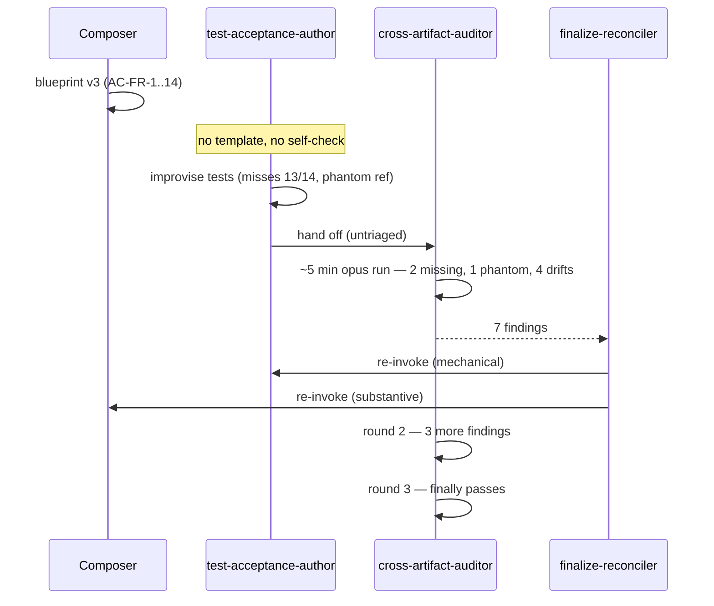

**Figure V14 — Worked example: after.** The self-check catches the mechanical defects for free; the auditor sees clean input and runs once.

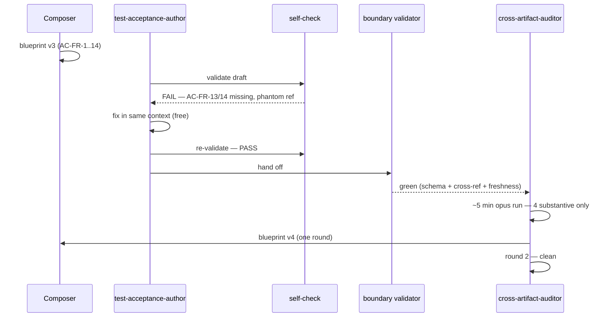

## 34. Metrics

| Run | Audit/recon cycles | Mechanical share (extrapolated) | Projected under pattern | Cycles saved |
|---|---|---|---|---|
| execution-pipeline-design | 7 audit, 3 recon | ~75% | 2 audit, 1 recon | **5 audit + 2 recon** |
| devcontainer-mcp-provisioning | 3 recon, 8 reviewer files | ~75% | 1 recon | **2 recon** |
| issue-capture-mechanism | 2 recon, 10 issues | ~70% | 1 recon | **1 recon** |
| audit-findings-remediation | 2 recon | ~50% | 1 recon | **1 recon** |
| pipeline-quickwins-hardening | 3 recon | ~75% | 1 recon | **2 recon** |
| adr-placement-mechanism-repair | 1 recon, 15 issues | ~80% | 0 recon | **1 recon** |
| pipeline-design-time-discipline | 1 recon | ~60% | 1 recon | **0** |
| execute-orchestrator-dispatch-repair | reviewer issues × 5 docs | ~30 findings | reviewer churn → self-check | **most reviewer cycles** |

**Aggregate (conservative):** reconciliation cycles across 8 runs ~15 → ~6 (**−60%**); architecture-audit re-runs ~14 → ~8 (**−43%**); mechanical load reaching the expensive auditor ~75% → ~5% (**−93%**); ~18 expensive opus invocations and ~9 human-gate interrupts avoided. The worst run alone collapses from 3 reconciliation cycles and 7 audit rounds to ~1 and ~2.

> **Caveat.** These percentages are extrapolated from audit-issue category counts, not measured timings — the only runtime telemetry today is install events. Direction and relative magnitude are well-supported; precise counts are illustrative. The observability surface (Part V) is what makes future numbers measured.

## 35. Rollout

A single plan — [`implementation-plan.md`](implementation-plan.md) — builds this **outside** the feature pipeline (the pipeline is the artifact under repair; using it to build its own hardening invites the self-referential fragility named in §29). It is structured as workstreams under one shared sequencing view:

- **WS-0 — Substrate foundation:** the historical-run regression corpus, the parallel-run harness, the single drift sentinel, the CI workflow, and the technology-boundary fitness functions.
- **WS-1 — Document reliability:** contracts → validators + boundary gates → the pipeline manifest + contract-completeness check → the freshness gate → the early-cutoff spike → the hybrid manifest-driven orchestrator.
- **WS-2 — Domain extensibility:** the domain bill-of-materials registry → the conformance + orphan check (registry-driven auditor dispatch) → the add-a-domain scaffold → teardown reconciliation.
- **WS-3 — Knowledge governance:** the generated decision-log index + current view → memory bi-temporal supersession + freshness/conflict checks → context-file DRY + path-scoped loading.
- **WS-4 — Observability:** built once (event schema + emitter + self-hosted backend), then *packaged* as the first domain through the WS-2 scaffold.
- **Close-out:** multi-pipeline migration → a single warn→enforce flip across all gate families → run-pinning → the discipline skill.

All workstreams register their checks into the **one** drift sentinel and read from the **one** canonical layer. The validation backbone is the **historical-run regression corpus** plus **parallel-run diffing** plus the conformance check run against the live repo — no feature-pipeline run is required to validate any of it.

---

# Appendices

## Appendix A — Evidence map

*Direct* = the symptom appears verbatim in audit JSONs / version counts / removal records; *Inferred* = the most likely cause of an observed effect, not a single labelled incident.

| Mechanism | Problem it solves | Evidence | Strength |
|---|---|---|---|
| Producer self-check + boundary validators (III) | Cheap mechanical errors caught only by the late auditor | 165 findings counted (Direct); the 125 "mechanical" split is by category mapping (Inferred-by-categorization); one run ran 7 audit rounds (Direct) | Direct / Inferred |
| Contracts for ATs / Phase Validators / Research Plan / tasks.json (I, III) | Template-less artifacts first seen by the cross-artifact auditor | ATs + PVs have no template; that seam is UNGATED | Direct |
| Manifest + gates-declared (III) | Silent gate removal; unguarded seams | 3 UNGATED + 2 reviewed-only seams; filename drift | Direct |
| Freshness gate (IV) | Stale-predecessor drift as upstreams are revised | 72 consistency findings incl. stale contract-ID refs + version desync; Blueprint v1–v5, PRD v1–v3 churn | Direct (symptom) / Inferred (that staleness drove the churn) |
| Observability (V) | Cannot tell where cycle time goes; runs stall invisibly | Only install telemetry exists; 3 runs stalled pre-audit with no recorded reason; every metric here is extrapolated | Direct |
| Domain registry + conformance/orphan check (VI) | Unpredictable add; orphaned removal | The ragged bundle matrix; one removal touched 15+ surfaces and orphaned a user-scope install | Direct |
| Knowledge governance: index + supersession + freshness/conflict (VII) | ADR sprawl; stale/conflicting memory | 68 ADRs + ~1,470 cross-references (approx., by grep) + no index + 2 live-but-superseded records; memory has no freshness/conflict field or check; multi-level memory is additive ("no override, no de-duplication") | Direct (counts approx.) |
| Maintainability / tiering (VIII) | Over/under-gating; meta-run fragility | Two runs are self-improving meta-runs; one was abandoned/split mid-pipeline | Direct |

## Appendix B — Trade-offs register

| Area | Chosen | Rejected | Trade-off accepted |
|---|---|---|---|
| Staleness response | Detect + hard-gate | Auto re-derive every dependent | Staleness needs a reconciler pass — accepted to avoid thrash |
| Staleness detection | Hash declared structured-boundary fields (RFC 8785) | Whole-file byte-hash / hash the output | Requires declaring the boundary per doc type; v1 whole-descendant invalidation — accepted because always-correct |
| Pipeline topology | Declarative manifest | Topology in orchestrator prose | One more canonical file + a drift check — accepted to make silent gate-removal impossible |
| Gate coverage | Tiered by blast radius | Full stack everywhere | Per-pipeline tier decisions — accepted to avoid over-gating |
| Observability export | JSONL of record + export to a single-container self-hosted backend | A heavy multi-service stack, or no export | One local container; experimental semconv — accepted; pipeline never depends on the backend |
| Re-derivation | Re-author from clean context | Patch in place | More tokens per re-derivation — accepted for correctness |
| Version safety | Both freshness (instances) and run-pinning (contracts) | Either alone | Two mechanisms — accepted; each covers a failure the other doesn't |
| Orchestrator topology | Hybrid — static declarative, dynamic routing in code | Fully declarative | Router-decided edges can't be captured statically — accepted that some routing stays code |
| Migration | Strangler-Fig + parallel-run | Big-bang rewrite | Two paths coexist during migration — accepted to never break a live run |
| Domain kinds | Engineering-layer vs cross-cutting-domain | Force everything into the 9 layers | Two kinds in the registry — accepted; observability ≈ MCP, not a new layer |
| Pattern home | A dedicated discipline skill + code teeth | Fold into the primitive design KB | Routing-collision risk — mitigated by a sharp, bounded description |
| Knowledge index | Generated decision-log index + status-filtered current view | Hand-maintained index, or grep-only | A generator + CI drift check to maintain — accepted; grep does not scale past a few dozen densely-linked records |
| Memory conflict | Supersede-not-overwrite (bi-temporal validity) | Destructive overwrite, or append-only-without-resolution | Keep lineage + a current view — accepted; overwrite loses history, append-only defers conflict forever |
| Cross-level instructions | DRY (one rule, one level) + path-scoped loading | An override/precedence engine | No tool offers a true override engine, so author no cross-level conflicts — accepted as a discipline, not a mechanism |

## Appendix C — Decisions register

| ID | Decision | Status |
|---|---|---|
| D1 | Adopt the Contract-Gated Pipeline (deterministic gates around probabilistic actors) | Adopted |
| D2 | Make the pipeline manifest the canonical keystone (gates declared, not remembered) | Adopted |
| D3 | Freshness gate using detect-and-gate behavior | Adopted (v1) |
| D4 | Tiered / early-cutoff invalidation (research frontier) | Adopted — spike-gated |
| D5 | Auto re-derive every dependent on any upstream bump | Rejected |
| D6 | Input-content-hash staleness detection (empirically validated) | Adopted |
| D7 | Re-derive stale artifacts from clean context, never patch-in-place | Adopted |
| D8 | Run-level contract/template pinning | Adopted |
| D9 | Observability surface: append-only JSONL + projection, OTel-shaped (artifact lineage via the in-git freshness graph, not an ingested lineage backend — D-OBS-2) | Adopted |
| D10 | Keep observability and evals separate but linked | Adopted |
| D11 | A dedicated architecture-discipline skill; enforcement in canonical + validators; ADR records the decision | Adopted |
| D12 | Full-scope rollout (nothing deferred), observability before/with freshness | Adopted |
| D13 | Full observability export to a self-hostable single-container OTel backend with a durable local store; no immutable/WORM store. The specific product is a **plan** choice (open to re-evaluation) | Adopted |
| D14 | Hybrid orchestrator — static topology (`pipelines.yaml`) declarative, dynamic routing in code; realized on **Claude Code Dynamic Workflows** (the script is the deterministic dispatcher reading the manifest — D-ORCH-1) | Adopted |
| D15 | Strangler-Fig + parallel-run for the prose→**per-segment workflow-script** migration | Adopted |
| D16 | Structured-field (RFC 8785) digest for staleness, not whole-prose hash | Adopted |
| D17 | Observability durability = the backend's store on a persistent volume + committed run-summary; no external immutable sink | Adopted |
| D18 | Provision the observability backend via Dockerfile install + opt-in start (not docker-compose, not postStart) | Adopted |
| D-DOM-1 | Two domain kinds — engineering-layer vs cross-cutting-domain; observability is cross-cutting (MCP model), not a new layer | Adopted |
| D-DOM-2 | Every domain declares a full bill-of-materials + install sites; partial bundles explicitly rationalized | Adopted |
| D-DOM-3 | Reuse the canonical registry + drift sentinel; conformance/orphan check is a sentinel check; registry-driven auditor dispatch | Adopted |
| D-DOM-4 | Domain bundles declare `authoritative_sources` and carry a freshness + auditor-sync check (research-and-verify re-checks sources; bi-temporal supersession flags stale KBs; an auditor-sync check keeps the auditor's rules matched to its KB) | Adopted |
| D-KN-1 | Govern durable knowledge (ADRs, memory, context files) as Level 3 via the same substrate — index + supersession lifecycle + sentinel | Adopted |
| D-KN-2 | Knowledge governance is a **derived decision graph** over committed ADR frontmatter + canonical (nodes = decisions; typed edges = supersedes / depends-on / constrains / conflicts-with), exposed through a **typed MCP query surface** (parameterized queries — *not* raw Cypher or NL-to-query). Edges are **authored, not LLM-extracted** (skips GraphRAG's costly/brittle step); **no graph DB** (file/SQLite-derived from frontmatter; reach for a DB only past ~10⁵ edges — we have ~68 ADRs). A generated status-filtered index stays the human entry point; the graph is the AI-interfacing surface. The decision-graph MCP server registers as a tool (D-TOOL-1) / cross-cutting domain (D-DOM-1), like observability. | Adopted |
| D-KN-3 | Memory conflict resolution = supersede-not-overwrite + bi-temporal validity; add a sentinel memory freshness/conflict check; anchor writes to canonical. **The decision graph implements this**: supersession **invalidates** an edge (stamps `invalid_at`), never deletes — so "what is true now" and "what we believed at time T" both stay queryable (the cross-vendor bi-temporal consensus). A **cross-link-integrity validator** (bidirectional links + supersession resolution) guards it in the sentinel — not just a schema. | Adopted |
| D-KN-4 | Context-file discipline: keep the symlink single-source + budget; resolve cross-level conflicts by DRY authoring (one rule, one level) + path-scoped loading | Adopted |
| D-TB-1 | Technology boundaries are a first-class binding constraint registry (Appendix F): the architecture states them tech-agnostically; the plan chooses technologies *within* them; fitness functions enforce them in CI | Adopted |
| D-PF-1 | Platform foundations are named **architecturally-significant bindings** (Claude Code · GitHub Codespaces · GitHub · VSCode · GitHub Actions) per the Appendix-F litmus — the role is agnostic, the binding is architectural; a platform swap is an architecture-level change. Within Claude Code, **Dynamic Workflows is the named orchestration-substrate binding** (D-ORCH-1). | Adopted |
| D-OBS-1 | Observability is two-level: the coordinator emits stage-boundary events; the runtime captures per-actor / per-tool spans nested under the stage (actors stay stateless — the runtime instruments them) | Adopted |
| D-OBS-2 | The observability backend ingests **OpenTelemetry only**; artifact provenance/lineage is served by the freshness gate's in-git `derived_from` graph (Part IV), **not** an ingested OpenLineage backend — no second service for lineage already held in git (TB2). OpenLineage's Job→Run→Dataset vocabulary is borrowed to shape that view. | Adopted |
| D-RG-1 | The reviewer gate is **hardened** (binary verdicts, calibrated human-authored rubric, CoT-before-verdict, abstain/escalate, diverse cross-provider panel for high-tier) and is never the unhardened sole authority; judge stability is tracked as an eval reliability metric | Adopted |
| D-DR-1 | Crash-recovery is **in scope** (folded in, not a silent gap): the run-event log doubles as the recovery journal; actors with external side effects carry coordinator-derived idempotency keys; human approvals are durable. Reuse the log, don't add an engine. **Confirmed against the orchestration substrate:** Dynamic Workflows' resume is *session-local* and does NOT survive process restart / Codespace rebuild, so the run-event log is the cross-restart recovery layer — engine + log compose (D-ORCH-1). | Adopted |
| D-ORCH-1 | The orchestration substrate is **Claude Code Dynamic Workflows** — the workflow script is the sole deterministic dispatcher (TB7) that reads `pipelines.yaml` (D2) and routes on typed state (D14); actors hand off by file path (TB6) and never spawn actors (one-level nesting). Because a workflow **cannot hold a human approval gate mid-run**, the pipeline decomposes into **one workflow per human-gated segment**, sequenced by a thin coordinator that persists state in the run-event log (D-DR-1). The engine gives in-session orchestration only; durability/recovery is the log. Research-preview + token-heavy ⇒ bounded segments, JSONL as the always-available record. | Adopted |
| D-TOOL-1 | Tool/MCP governance is the domain-pack pattern at the tool grain: a canonical tool registry (per-agent assignment, role-permissions, context budget, load+init, health, read/write class) + registry-driven scope-aware add/update/remove + a startup availability/health probe + tool-use observability | Adopted |
| D-IL-1 | The telemetry→improvement loop is **mandatory and human-gated**: a periodic batch curates evals + computes gate-ROI + clusters failures and *proposes* changes; a human approves before promotion; changes validate on the offline corpus. Flashlight, not autopilot — no auto-promotion. | Adopted |
| D-HO-1 | The human gate is a **designed control** with two durable adjudication classes — run-time semantic-escalation (not mechanical loops) and over-time promotion (improvement-loop changes); tiered by blast radius; approvals are durable boundaries (R21). | Adopted |

## Appendix D — Sources & references

> Sources were gathered via web search; dates are publisher-stated where visible and labelled "foundational" otherwise. Verify links and dates directly before any ADR cites them — search output is input to verify, not ground truth.
>
> **Verification pass (adversarial citation check).** 10 of 13 recent/dated citations verified. Three were corrected here: **(1)** a "context-contamination / clean-restart" arXiv paper (2605.08563) **could not be verified and is withdrawn** — three independent searches found no trace; it was likely an LLM-fabricated reference. The clean-context re-derivation (§13 move 5 / D7) is sound design judgment and is independently supported by the *verified* Execution Lineage paper's branch-isolation result, so the decision stands without it. **(2)** the "OpenLineage AgentRunFacet RFC" **does not exist** — the agent-facet work is in OpenTelemetry's GenAI SIG, not OpenLineage; corrected below. **(3)** the OTel GenAI-observability post is real but supports only the span-tree model, **not** the "eval scores attachable" half (that is a separate OTel artifact, `gen_ai.evaluation.result`); scoped below.

**Freshness / lineage / invalidation:** Execution Lineage (arXiv 2605.06365, 2026-05-07); AI21 caching in agentic pipelines (2026-05-13); Restate updating agents (2026-03-11); the stale-world-model framing (2026-04-10); dbt `state:modified+` (2026-05); Dagster asset versioning (foundational); Bazel Skyframe (foundational); Salsa red-green / early cutoff (foundational); write-audit-publish (dbt Labs, 2024-12).

**Observability:** OpenTelemetry GenAI semantic conventions (foundational; status: experimental); OTel GenAI agent spans (foundational); OTel GenAI observability (2026-05-14 — supports the span-tree model; eval-score attachment is a separate OTel artifact, `gen_ai.evaluation.result`); OpenLineage run cycle (foundational; the agent-facet work lives in OTel's GenAI SIG, not an OpenLineage "AgentRunFacet"); dbt `run_results.json` (2026-05); Dagster asset health (foundational); Braintrust observability-vs-evals (2026-02-09); Monte Carlo five pillars (foundational); Temporal event history (foundational); Microsoft + Cisco multi-agent OTel conventions (2025-10 / 2026-03).

**Extensibility / plugin-registry pattern:** the Open-Closed Principle and microkernel/plug-in architecture (foundational); VS Code contribution points and Eclipse extension registry (foundational); Terraform provider lockfile (2025-11); Kubernetes finalizers + owner-references (2025); OpenTelemetry Collector component model (2026); Backstage software catalog + templates (foundational); Open Plugin Specification v1.0.0 (2026-04); AI-agent plugin/extension architecture surveys (2026-02).

**Durable-knowledge governance (Part VII):** Nygard + Fowler ADR (supersede-never-edit; foundational + 2026); MADR (foundational); adr-log / Log4brains / Backstage ADR plugin (foundational; generated index/site); decision-graph tools (2026); Zep/Graphiti bi-temporal validity + edge invalidation (2025-01); mem0 / Letta / LangMem memory lifecycle (2025–2026); the AGENTS.md standard + Claude memory docs (foundational; ~200-line budget, additive precedence); Chroma "context rot" (2025-07).

**LLM-as-judge reliability (§9 reviewer gate) — verified pass.** Binary > ordinal for gate reliability (RAND + multiple, verified); style-bias-now-dominant / position-bias-negligible-on-frontier-judges (verified, with one persistence counter-signal); single-judge fragility incl. the ~28%-flip case (verified); "Judging the Judges: bias-mitigation strategies" (arXiv 2604.23178, verified — this is the real source of the LLMBar CoT figures); Prior Prejudice (ACL 2026 Findings, verified for the belief-bias / CoT-can-hurt point only); diverse-cross-provider-panel > single (verified). *Excluded as unverified:* the "Prior Prejudice/Soumik" CoT-figure attribution (misattributed), and the Future-AGI calibration numbers (kappa thresholds / recalibration cadence not on the cited page) — so those specifics are not load-bearing here.

**Durable execution / operational recovery (§18) — verified pass.** Temporal Event History (append-only log = recovery + audit; plaintext/codec + PII caveat; event-history limits) (verified); Restate journal / event-sourcing (verified); LangGraph persistence/checkpointing + the pre-interrupt re-execution footgun, persistent-checkpointer requirement (verified); AWS idempotency-key-generated-in-step (verified). *Excluded as unverified:* a Temporal `temporal-replayer` k8s init-container deploy-gate (refuted — no such pattern), a TS `replayWorkflowHistory()` method name (SDK conflation), and a tiered read-vs-write retry rule (not in its cited source). The "industry consensus" *label* is partly vendor-blog-anchored (medium); the mechanisms are corroborated by primary docs.

**Architecture-diagramming vocabulary (for Appendix E):** the C4 model (c4model.com; foundational); arc42 runtime/building-block views (foundational); Mermaid diagram-type coverage (v11.x, 2026); flowchart-vs-DFD-vs-decision-tree distinctions (2026).

## Appendix E — Visual index

The visuals are rendered inline at the sections listed below. Diagram-type choices follow the architecture-diagramming research (Appendix D). All are Mermaid; the C4 views (V3, V4) use Mermaid's experimental C4 support and may be regenerated via Structurizr/PlantUML if C4 rigor grows. V2 is rendered as the coverage table in §3. **Figure numbers reflect authoring order, not document order** — read them by section using the table below (the "Part" column is the reading sequence).

| ID | Title | Type | Part |
|---|---|---|---|
| V1 | The validation chain today | flowchart | I §2 |
| V2 | Domain-bundle coverage matrix | table / heatmap | I §3 |
| V3 | System context | C4 Context | II §6 |
| V4 | Container view (substrate governs actors) | C4 Container | II §6 |
| V5 | Gate decision flow | flowchart + diamonds | III §8 |
| V6 | Gate firing order | sequence | III §9 |
| V7 | The stale cascade | directed graph | IV §11 |
| V8 | Freshness mechanism end-to-end | flowchart | IV §13 |
| V9 | Run-event data flow | data-flow (flowchart LR) | V §17 |
| V10 | Domain registry + conformance | flowchart / ER | VI §20 |
| V11 | Domain lifecycle | state machine | VI §22 |
| V12 | Knowledge layering | flowchart TB | IX §31 |
| V13 | Worked example — before | sequence | X §33 |
| V14 | Worked example — after | sequence (mirror of V13) | X §33 |
| V15 | The three governed levels | flowchart TB | II §7 |
| V16 | Decision log + decision graph | directed graph | VII §25 |
| V17 | Memory lifecycle (detect → resolve → prune) | flowchart | VII §26 |
| V18 | The improvement loop (the flywheel) | flowchart | V (improvement loop) |

**Rendering discipline (applies to every visual):** one diagram, one idea — state the single question it answers before drawing; 5–10 nodes per flowchart, 8–12 participants per sequence; label every edge with a verb or condition (no unlabeled arrows or branches); use shapes consistently (diamond = decision, cylinder = data store) and add a legend where needed; match the level of detail to the decision, and do not draw what will not be maintained.

## Appendix F — Technology Boundaries (the registry that binds the plan)

These are the architecture's **binding constraints on technology selection** — the arc42 §2 sense of a constraint: each is *tech-agnostic* (it names no vendor) yet it *bounds* which technologies the plan may research and adopt. They are not vendor choices (those live in the plan) and not implementation detail. A technology that violates a boundary is out-of-bounds **before** it is researched.

**The litmus** for what qualifies as a boundary (i.e. is architecturally significant rather than a plan-level choice): *reversing it is expensive and its effect is structural or cross-cutting* (it changes structure, interfaces, dependencies, or a quality attribute). A choice that can be swapped behind a stable interface at low blast radius is **not** a boundary — it belongs in the plan.

**How a boundary binds (four mechanisms):** (1) a governed option set — an incompatible technology is excluded before evaluation; (2) traceability — the ADR that records a technology choice ties it to the boundaries it satisfies; (3) a compliance gate — a violating choice is judged non-conformant, not a matter of taste; (4) a **fitness function** in CI — the runtime peer of the drift sentinel — that fails the build on drift out of bounds.

| # | Boundary (tech-agnostic constraint) | Rules **out** / rules **in** | Evidenced in |
|---|---|---|---|
| TB1 | **Single-container, no-docker-compose dev environment** — runs in one devcontainer (Dockerfile + Features). Default machine **4-core / 16 GB / 32 GB** (the smallest tier meeting the 4-core `hostRequirements` minimum; the `8 GB` floor is a loose minimum, not the provisioned size). Footprint is a **tunable cost dial** — resizable to 64–128 GB at proportional $/hr. | OUT (structural, any size): multi-node, docker-compose/k8s-required services; OUT (size): a footprint past the largest tier (128 GB) · IN: single-container tools; a heavier one is in-bounds if the larger machine is justified + cost-flagged | §30; `devcontainer.json`; Codespaces machine-types docs |
| TB2 | **Git is the system-of-record for durable state** — anything that must survive rebuild is committed; the runtime dir is ephemeral | OUT: tech assuming an external persistent datastore as the durable record · IN: file/git state; mounted volumes are cache only | §30 durability table; `.gitignore` |
| TB3 | **No mandatory runtime dependency on an external/cloud service** — the pipeline completes with backends down | OUT: SaaS-only on the critical path · IN: self-hostable, opt-in services | §18 ("never depends on the backend being up") |
| TB4 | **Deterministic gates only** — enforcement is deterministic code; LLM judgment is reserved for reviewer agents, never mechanical gates | OUT: LLM-as-validator for checkable rules · IN: code validators | §5, §8 (the litmus) |
| TB5 | **Single source of truth; no embedded rule copies** — tools and validators read rules from canonical (CANON-1) | OUT: tech that ships its own divergent copy of vocabularies/schemas · IN: canonical-reading code | §6; `canonical.py`; CANON-1 |
| TB6 | **File-path-reference handoff; stateless actors** — inter-stage state passes as file paths | OUT: orchestration requiring shared in-memory / sticky-session state · IN: file-based handoff | §10 |
| TB7 | **Single dispatcher; no agent-spawns-agent** — orchestration must preserve the sole-dispatcher topology | OUT: orchestration tech that breaks sole-dispatch (ADR-0045) | §10 |
| TB8 | **Python validation library, subprocess-dispatched** — validators are Python 3.x invoked via `python3` | OUT: validators requiring a runtime not in the container · IN: Python 3.x | §6; `auditing-shared` |
| TB9 | **Text-first, diffable formats** — Markdown + YAML frontmatter for artifacts, JSON / JSON-Schema for machine contracts, JSONL for events, Mermaid for diagrams (GitHub/IDE-renderable) | OUT: binary / proprietary document or diagram formats | artifact templates; run-events; Appendix E |
| TB10 | **Credential indirection only** — secrets via env-block / Codespaces Secrets; never in config argv, URL, or committed files | OUT: tech requiring inline credentials | §30; ADR-0039 (MCP discipline) |
| TB11 | **Observability is OTel-shaped, self-hosted, JSONL-of-record, with no immutable/WORM requirement** — the backend ingests the OpenTelemetry standard, is self-hostable single-container, and is never on the critical path; artifact lineage is the freshness gate's in-git `derived_from` graph (Part IV), not an ingested lineage backend (D-OBS-2) | OUT: SaaS-only observability, multi-service stacks, mandatory WORM/retention, a separate lineage backend · IN: OTel-shaped, self-hostable single-container | §15–§18 |

These boundaries were previously implicit and scattered — across §30 (dev-environment), §6 (the substrate), the MCP discipline, and individual ADRs. This registry consolidates them as the single binding contract the plan checks every technology choice against (see the plan's §1 and WS-0 fitness functions). New boundaries are added here the same way decisions are added to Appendix C: state the constraint tech-agnostically, give the litmus that makes it architectural, and let a fitness function enforce it.
