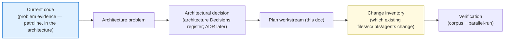
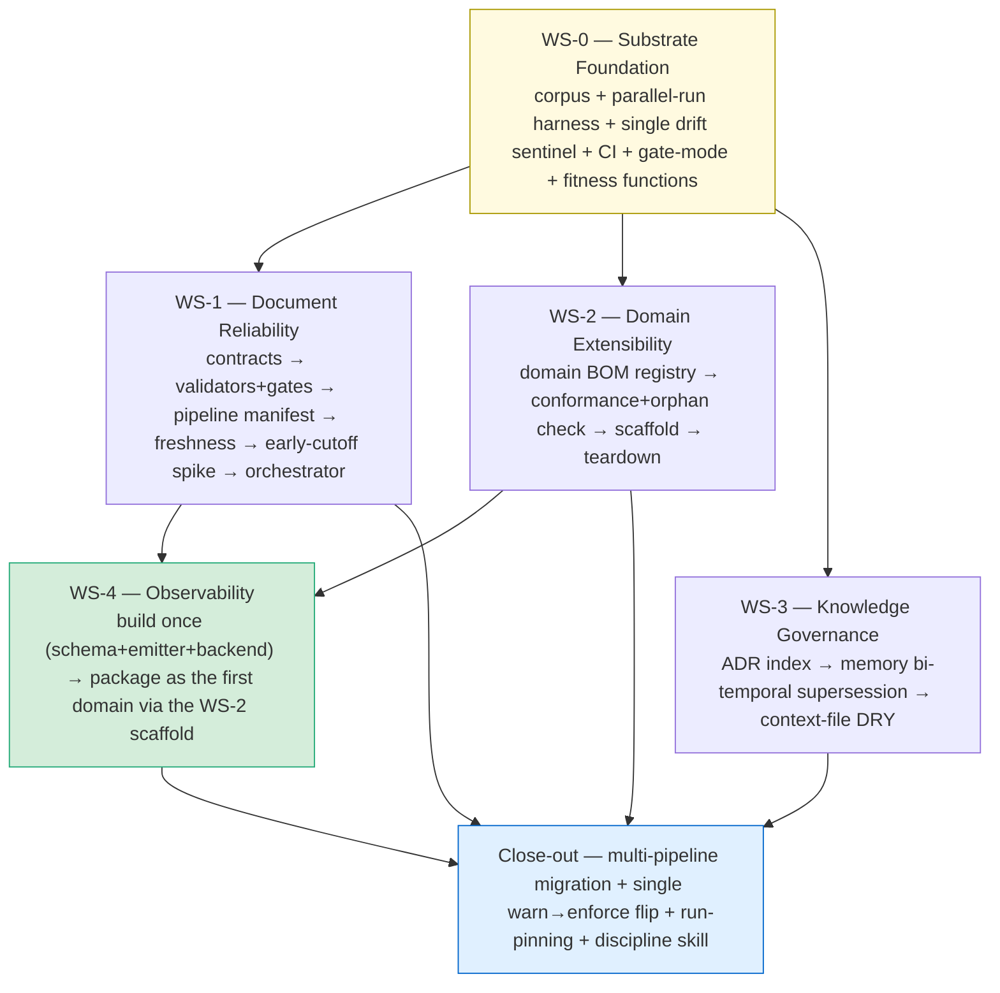

# The Governed Pipeline — Implementation & Migration Plan

> The single plan that builds the architecture in [`governed-pipeline-architecture.md`](governed-pipeline-architecture.md), **outside** the feature pipeline, in dependency order, validated against historical runs and parallel-run diffing rather than live pipeline executions. Structured as **workstreams** under one shared sequencing view (not several competing plans). Every workstream item traces to an architectural decision and names the **existing code** it changes.

**Consolidation note.** This is the single plan. It supersedes and merges the two earlier plans (the reliability "implementation-plan" and the "domain-extensibility-plan") into one document with five workstreams (WS-0 the shared substrate, plus WS-1..WS-4 mirroring the architecture's levels) and a cross-cutting close-out, resolving their overlaps: the substrate is built once (WS-0), observability is built once and then *packaged* as a domain (WS-4), and the warn→enforce flip happens once across all gate families.

**Scope of edits right now.** Per the current freeze, the only durable artifacts being written are the architecture document and this plan. Decisions are captured in-document (the architecture's Decisions register); ADR files, validator scripts, canonical edits, and fitness-function scripts described below are *future build actions this plan schedules* — not changes made now.

---

## 1. How this plan relates to the architecture

**The role split.** The architecture is the **what/why** — technology-agnostic *except where a technology choice is itself architecturally significant* (hard to reverse, structural — e.g. "append-only event log as system of record"); this plan is the **how/where/when, vendor-specific** (it names the concrete products — GreptimeDB, the RFC-8785 lib — that realize those decisions). The architecture sets boundaries and architecturally-significant decisions; this plan researches and chooses technologies *within* those boundaries, names the concrete products/libraries, and enumerates the existing code that changes.

**The traceability spine (brownfield).** This is a refactor of an existing system, so the same code appears twice: as *problem evidence* in the architecture, and as *change target* here.

Every workstream deliverable below names its **change target** (existing path) where one exists, or marks **new**.

**Technology boundaries bind this plan.** Every technology this plan names must satisfy the architecture's technology boundaries (the TB-set: ephemeral single-container env; git as system-of-record; no mandatory external runtime dependency; deterministic gates; canonical single-source; file-path handoff; single dispatcher (no agent-spawns-agent); Python validators; text-first formats; credential indirection; OTel-shaped self-hosted observability, with artifact lineage served by the in-git freshness graph rather than an ingested lineage backend — D-OBS-2). A choice that violates a boundary is out-of-bounds *before* it is researched. WS-0 builds **fitness functions** that enforce the boundaries in CI.

**Decision homing.** Every architectural decision has exactly one plan home. This plan **adopts by reference** the architecture's what/why decisions and **owns** the how/vendor implementation decisions — it does **not** restate their rationale (that lives in the architecture, and in ADRs once the freeze lifts).

| Class | Decisions | Plan home |
|---|---|---|
| **Adopted by reference** (architectural what/why) | D1–D4, D6, D7, D8, D9, D10, D11, D12, D14, D16-core, D-DOM-1..4, D-KN-1..4, D-TB-1, D-PF-1, D-OBS-1, D-OBS-2, D-RG-1, D-DR-1, D-TOOL-1, D-IL-1, D-HO-1 (D5 is the *rejected* auto-re-derive option — not implemented) | the workstream that builds each (mapped per-workstream below) |
| **Owned** (implementation how / vendor / mechanics) | D13 (backend product choice), D15 (Strangler-Fig), D17 (durability mechanics), D18 (Dockerfile-install), plus the D9/D16 implementation riders | WS-1, WS-4, close-out |

**Decision → workstream map:** D1–D4/D6/D7/D14/D16/D-RG-1 → WS-1; D-DOM-1..4/D-TOOL-1 → WS-2; D-KN-1..4 → WS-3; D9/D10/D13/D17/D18/D-OBS-1/D-OBS-2/D-DR-1 → WS-4; D-TB-1/D-PF-1 → WS-0 fitness functions; D8/D11/D12/D-IL-1/D-HO-1 → close-out.

**Technology choices — the observability backend is now decided; others remain open.** The backend (D13) was decided **2026-05-30 via the `technology-evaluation` workflow: GreptimeDB** (a near-tie with Jaeger, resolved on "keep the door open to metrics/logs"); the draft decision record is at `.claude/workflows/technology-evaluation.RERUN-OUTPUT.md`, ADR pending freeze-lift. The architecture states the role agnostically (self-hostable single-container OTel backend with a durable local store); the plan names GreptimeDB as the realization, with its watch-items (young/single-vendor; HTTP-only trace ingest — fine for our HTTP POST export; verify durable-local persistence at build) carried below. Other owned choices (e.g. the RFC-8785 lib) stay concrete but revisable.

---

## 2. How we work — disciplines

| Principle | In this implementation |
|---|---|
| **Outside the pipeline** | The feature pipeline is the artifact under repair; using it to build its own hardening invites self-referential fragility (architecture §29). We implement directly. |
| **Canonical-first** | Every validator reads from `.claude/canonical/*.yaml` via `canonical.py`; zero hardcoded constants (CANON-1 stays green). |
| **Warn-then-enforce** | Every gate ships `warn` (logs, doesn't block); flips to `enforce` only after the corpus + parallel-run + one real run pass clean. |
| **Strangler Fig + parallel-run** | The manifest-driven loop runs *beside* the prose orchestrator; diff decisions, cut over per pipeline — never big-bang. |
| **Never-stale invariant** | Freshness fallbacks degrade *savings*, never *correctness*. |
| **Reversible commits** | One deliverable per commit; no `git add -A`. |
| **Validate without the live pipeline** | Historical-run corpus + parallel-run diffing + smoke tests + `auditing-*` are the backbone. |

---

## 3. The validation backbone

Two evidence sources, both avoiding live pipeline runs:

1. **Historical-run regression corpus.** The 14 past runs under `working/feature/<slug>/` carry *labeled* findings in their audit JSONs. Replay broken + corrected versions of past artifacts through each new validator; assert it **catches** the mechanical findings the expensive auditor caught and **passes** on the corrected version. Proves validators at script cost; becomes the CI regression guard.
2. **Parallel-run diffing** (orchestrator migration, WS-1). Run the prose orchestrator and the manifest loop on the same replay; diff their stage + gate decisions; cut over only on match.

Plus, for extensibility (WS-2), the **conformance check run against the live repo** is its own backbone: it must reproduce the known ragged-bundle gaps and report **zero orphans** (gitnexus is gone — this is the regression guard that would have caught it).

---

## 4. Research findings that shaped this plan

Recency-filtered; same provenance caveat as the architecture's Appendix D — gathered via web-research agents; verify links/dates before an ADR cites them.

**Thread A — early-cutoff for non-deterministic artifacts → EMERGING.** Build-system early-cutoff (Salsa, Bazel) works only because outputs are deterministically hashable; LLM prose breaks that. The move is "depend on declared structured boundaries and hash those, not the prose": declared sub-artifact edges + RFC 8785 structured-field hashing (deterministic, true early cutoff; cost: extract fields + maintain the edge graph); LLM-as-judge materiality is high-recall/low-precision (use only to *suppress* a confident-immaterial invalidation, never as sole authority); embedding/semantic-diff is too fuzzy to gate on. Safe fallback (WS-1 freshness): whole-descendant invalidation — correctness guaranteed, savings forfeited.

**Thread B — full OTel export → SETTLED path, self-hostable backend.** The OTLP wire path (`:4318/v1/traces`) is settled; GenAI semconv is still experimental (stable in shape since ~v1.37). Bridge JSONL → OTLP **without an SDK** via a small exporter script that POSTs to the backend's OTLP/HTTP endpoint (no Collector needed — GreptimeDB ingests OTLP/HTTP natively). Self-hostable backend: **GreptimeDB** — single-container, Apache-2.0, Rust, ingests all three OTel signals (traces/metrics/logs) over OTLP/HTTP. **Chosen 2026-05-30** via the `technology-evaluation` workflow (re-run wf_2c8af13e-e0e), superseding the earlier Phoenix lead; picked over a near-tied Jaeger on the "keep the door open to metrics/logs" question. ADR pending freeze-lift.

**Thread C — manifest-driven orchestration → SETTLED, but HYBRID for agents.** Express *static* topology as data and schema-validate it before run. The 2026 agent-pipeline consensus is a declared graph skeleton + typed state + **dynamic, state-conditional edges** ("deterministic shell wrapping a probabilistic core") — *not* fully declarative, because router-decided edges can't be captured statically. Migrate via **Strangler Fig + parallel-run**. Multi-pipeline = one registry of isolated entries + a versioned shared module (`auditing-shared`).

**Thread D — technology governance.** Architecture sets **constraints/boundaries** (arc42 §2; TOGAF principles + Architecture Contract); the plan chooses *within* them; the **decision** is an ADR both reference; **fitness functions** (CI) enforce the boundary. A constraint binds via a governed option set, traceability (decision-drivers tie a choice to a named constraint), a compliance gate, and an automated fitness function.

**Thread E — knowledge governance (Part VII).** Decision records: a **generated decision-log index** + status-filtered current view (the navigability fix for a large ADR store). Memory: **bi-temporal validity, invalidate-not-delete**, detect→resolve→prune, anchored to canonical. Context files: DRY (one rule, one level) + path-scoped loading; additive multi-level precedence has "no override," so cross-level conflicts must not be authored.

---

## 5. Workstreams & sequencing

One plan, five workstreams plus a cross-cutting close-out. WS-0 is the shared substrate everything builds on; WS-1..WS-4 mirror the architecture's levels (WS-4 observability is its own workstream because it is built once then packaged as a domain). WS-4 depends on both the observability build and the WS-2 scaffold.

**The value milestone is inside WS-1** (contracts + validators + boundary gates — the ~75% mechanical-findings win), mergeable before the structural work. **The frontier is the WS-1 early-cutoff spike** (gated, with a proven fallback). Workstream items are independently shippable in the dependency order shown.

---

### WS-0 — Substrate Foundation (shared bedrock)

**Goal:** the scaffolding every later workstream builds on. No pipeline behavior change. Built once — both gate families (contract-completeness in WS-1, conformance/orphan in WS-2) register into the *same* drift sentinel.

| Deliverable | Path / action (change target or **new**) |
|---|---|
| Historical corpus + expectations + runner | **new** `auditing-shared/scripts/test_fixtures/pipeline_corpus/`, `corpus_expectations.yaml`, `corpus_regression.py` (the `test_fixtures/` root exists; `pipeline_corpus/` is new) |
| Parallel-run diff skeleton (for WS-1 orchestrator) | **new** `auditing-shared/scripts/parallel_run_diff.py` |
| Warn/enforce gate-mode helper | **new** `gate_mode.py` (emit-but-don't-block in `warn`) |
| Drift-sentinel skeleton | extend the existing drift audit (`audit_canonical_drift.py` family) into the shared sentinel both gate families register into |
| **Technology-boundary fitness functions** | **new** CI checks enforcing the architecture's TB-set (e.g. "no devcontainer service requires docker-compose," "no validator imports a non-Python runtime," "no secret in `.mcp.json` argv/URL") |
| **Routing classifier (canonical)** | **new** a canonical home for the mechanical-vs-semantic *routing* axis — distinct from `severity.yaml` (severity and routing are orthogonal). Either a `routing.yaml` or a `routing_class` field, read by the R7/A10 triage. Closes the §29 gap where routing was wrongly attributed to `severity.yaml`. (Built post-freeze.) |
| CI job | **new** `.github/workflows/pipeline-validators.yml` — runs smoke tests + corpus + sentinel + fitness functions; starts green (`.github/workflows/` exists, one workflow present) |
| Decision record | the architecture's Decisions register is the home now; an `adrs/ADR-00NN` is scheduled for when the freeze lifts (verify next number against `adrs/` — currently highest is ADR-0068) |

**Validation:** corpus runner + CI green; CANON-1 green; fitness functions green against the current repo. **Size:** M · **Risk:** low (additive). **Implements:** the substrate components (architecture §6); R8; D-TB-1 (the boundary fitness functions); D-PF-1 (the platform-foundation bindings the fitness functions enforce — e.g. "no docker-compose" guards the single-container Codespaces binding); and the canonical routing-classifier home (the R7/A10 mechanical-vs-semantic axis — see the routing-classifier deliverable above).

---

### WS-1 — Document Reliability (the within-a-run level)

**Goal:** deterministic gates around the document handoffs, plus freshness, the hybrid orchestrator, and the hardened semantic reviewer gate. **Implements** D1–D4, D6, D7, D14, D16, D-RG-1, R1–R13, R20 (D5 is the *rejected* auto-re-derive option — not implemented).

**WS-1a — Contracts (templates, schemas, structured boundaries).**

| Deliverable | Path / action |
|---|---|
| Acceptance Tests template | **new** `KB-documentation-criteria/references/templates/acceptance-tests-template.md` (v1.0.0) |
| Phase Validators template | **new** `…/templates/phase-validators-template.md` (v1.0.0) |
| Research Plan version field | **edit** existing `…/templates/research-plan-template.md` — add `version:` |
| tasks.json JSON Schema | **new** `KB-task-decomposition/references/tasks.schema.json` (create the `references/` dir — it does not exist yet); register path in canonical |
| Structured-boundary spec | **new** `.claude/canonical/lineage-boundaries.yaml` — per doc type, the hashable structured fields (PRD: FR/NFR IDs + EARS; Blueprint: AC/contract IDs + Layer Scope; Plan: phase list + satisfies-AC). Feeds WS-1 freshness + the spike. |
| Drop misleading conditional | **edit** `test-acceptance-author.md` / `test-phase-validator-author.md` to point at the real templates |

**WS-1b — Validators + producer self-checks + boundary gates (WARN). ★ value milestone.**

| Deliverable | Path / action |
|---|---|
| Four validators (read canonical) | **new** `auditing-shared/scripts/validate_{acceptance_tests,phase_validators,research_plan,tasks_dag}.py` |
| Smoke test per validator | **new** `smoke_test_validate_<name>.py` (mirrors `validate_pipeline_frontmatter.py` + its smoke test) |
| Corpus expectations populated | **edit** `corpus_expectations.yaml` with the mechanical findings these four should catch |
| Producer self-check wiring | **edit** the four authoring agents (`intake-prd-author.md`, `discovery-plan-author.md`, `test-acceptance-author.md`, `test-phase-validator-author.md`): ~2-line "validate before final Write" |
| Boundary-gate wiring (WARN) | **edit** the orchestrator (`recipe-feature-pipeline/SKILL.md`) to invoke the validator at each previously-ungated seam; logs, doesn't block |

**WS-1c — Pipeline manifest + schema-validation + contract-completeness check.**

| Deliverable | Path / action |
|---|---|
| Pipeline manifest | **new** `.claude/canonical/pipelines.yaml` — per pipeline: ordered stages, actor, artifact + contract, gate-per-edge (`mode: warn\|enforce`), **static** edges, lineage edges, tier, cycle cap. Feature pipeline in full; execution / cc-critique / issue-capture stubbed at their tiers. |
| Manifest JSON Schema + validator | **new** `pipelines.schema.json` + `validate_manifest.py` (fail-fast on malformed topology) |
| Contract-completeness check | **new** `validate_manifest_completeness.py` — every gated doc-type has a contract + wired validator; every static edge has a gate. Registers into the WS-0 sentinel. |

**WS-1d — Freshness gate (structured-field digest, whole-descendant invalidation).** Implements D3, D6, D7, D16, R11.

| Deliverable | Path / action |
|---|---|
| Lineage-digest frontmatter | **edit** `shared-conventions.md` + `.claude/canonical/frontmatter-fields.yaml`: `derived_from` carries `<id>@<version> (jcs-sha256:…)` |
| Digest computation | **new** `compute_artifact_digest.py` — canonicalize (RFC 8785) the structured-boundary fields from `lineage-boundaries.yaml`, then hash; whole-file fallback where extraction is unreliable. **Pin the RFC-8785 lib** (`rfc8785` is single-maintainer / v0.1.4 — pin exactly or vendor the reference impl) + add a canonicalization **test vector** to the corpus |
| Freshness validator | **new** `validate_freshness.py` (recorded digest == current digest?) |
| Invalidation | reverse-closure over `pipelines.yaml` lineage edges → mark **all** descendants stale (no early cutoff yet) |
| Reconciler wiring | **edit** `finalize-reconciler.md`: on bump, mark stale set, hard-gate, re-author **upstream-first from clean context** (D7); re-stamp digests; emit `freshness.stale` |
| Synthetic fixture | bump an upstream, assert the correct descendant set is flagged |

**WS-1e — Early-cutoff (FRONTIER — spike-gated).** Implements D4. Builds on WS-1d; WS-1d is the fallback.
- **Spike:** prototype declared sub-artifact edges + section-level structured digests, and LLM-judge-as-suppressor, on the corpus; *measure* over-invalidation reduction vs false-negatives.
- **Decide:** real reduction with zero corpus false-negatives → implement; else **stop, WS-1d stands** (correctness already guaranteed). Record the decision.
- **In-bounds vs TB4 (deterministic gates only):** freshness stays a deterministic gate — the optional LLM judge may *only suppress* an invalidation it is confident is immaterial, the default is always invalidate-on-uncertainty, and every suppression is logged. So the LLM sits *beside* the gate as a suppressor, never *as* the gate; the TB4 boundary holds.
- **Implement (only if decide passes):** `validate_freshness.py` consumes section-level edges; reverse-closure walks the finer graph; the judge-suppressor is opt-in per edge and logged.

**WS-1f — Manifest-driven orchestrator (HYBRID) via Strangler Fig.** Implements D2, D14, D15.

| Deliverable | Path / action |
|---|---|
| Generic manifest loop | **new** coordinator that reads `pipelines.yaml` for stages/edges/gates; runs **beside** the prose orchestrator (facade routes to one or the other) |
| Hybrid boundary | static skeleton + gates from the manifest; **dynamic edges** (reconciliation re-entry, conditional routing) stay typed state-conditional code — do **not** over-declare |
| Parallel-run cutover | run both on the same replay; `parallel_run_diff.py` diffs decisions; cut over only on match |
| Remove static prose | **edit** `recipe-feature-pipeline/SKILL.md` — delete the prose stage/gate table (the current single source of pipeline topology) once parallel-run matches; dynamic routing code remains |

**WS-1g — Reviewer-gate hardening (the semantic gate's reliability).** Implements D-RG-1, R20. The deterministic validators (WS-1b) catch *mechanical* findings; the *semantic* reviewers/auditors (`shared-document-reviewer`, `review-architecture-auditor`, `review-cross-artifact-auditor`) are LLM-as-judge and must be hardened so they are never the unhardened sole authority.

| Deliverable | Path / action |
|---|---|
| Verdict shape | **edit** the reviewer/auditor agents to emit **binary** per-criterion verdicts (pass/fail) with **chain-of-thought before the verdict**, not a single ordinal score — judges are more stable on binary calls |
| Calibrated rubric | **new** `.claude/canonical/reviewer-rubric.yaml` — human-authored per-criterion rubric the reviewers read (canonical-first); the human-gate adjudications accumulate as the ground-truth calibration set |
| Abstain / escalate | **edit** the agents to support an **abstain** verdict that routes to the human (the semantic-escalation class, R20) rather than guessing |
| High-tier diverse panel | for full-tier runs, route the gate to a **diverse cross-provider panel** (majority/any-fail) rather than a single judge; minimal-tier keeps the single judge |
| Judge-stability metric | **edit** the run-event schema (WS-4a) so observability records each gate's **verdict stability** (agreement across re-runs / order-swaps / panel members) as an eval-reliability metric, not just the verdict |

**WS-1 validation:** corpus regression (validators reproduce auditors' mechanical catches, pass on corrected); completeness check fails-first on known gaps then passes once wiring registered; freshness fixture flags exactly the reverse-closure set and a prose-only re-gen does **not** flip the digest; orchestrator parallel-run diff empty across replays; reviewer-gate hardening verified by a judge-stability replay (binary verdicts agree across order-swaps; an abstain routes to the human). **All WS-1 gates ship in `warn` — the flip to `enforce` happens once, in the close-out** (see "Single warn → enforce flip"); WS-1 never enforces on its own. **Size:** WS-1b L (value), WS-1c L, WS-1d L, WS-1f XL, WS-1g M · **Risk:** medium (gates, mitigated by warn + corpus), high (WS-1f, contained by Strangler Fig).

---

### WS-2 — Domain Extensibility (the across-compositions level)

**Goal:** make adding/removing a domain predictable and uniform. **Implements** D-DOM-1..4, R14–R16, R22–R23, D-TOOL-1. Validation backbone: the conformance check run against the live repo.

| Deliverable | Path / action |
|---|---|
| Domain BOM schema | **edit** `.claude/canonical/engineering-domain-layers.yaml` (or sibling `domains.yaml`): each entry carries `kind`, `platform_kb`, `design_kb`, `auditor` (+ `none` rationale), `designer`/`folded_into`, `install_sites`, `version`, `status`. Backfill the 9 layers + the MCP cross-cutting domain. |
| Canonical accessors | **edit** `auditing-shared/scripts/canonical.py`: `auditor_for(slug)`, `design_agent_for(slug)`, `domains()`, `domain_install_sites(slug)` |
| Conformance check | **new** `audit_domain_conformance.py` — every registered domain's declared bundle parts exist on disk (honor `none`/`folded_into`). Registers into the WS-0 sentinel. |
| Orphan check | flag any `KB-*` / `auditing-*` / `design-*` skill, `.mcp.json` server, or `~/.claude` skill/hook **installed but not declared** — scope-aware (project + user) |
| Registry-driven auditor dispatch | **edit** `auditing-cc-configs/scripts/audit_project.py:34-41` — replace the hard-coded `SKILL_PATHS` dict with registry-derived dispatch (parity-test against the old dict before removing it) |
| Add-a-domain scaffold | **new** script/procedure + skeletons that emit the standard bundle (`KB-<slug>-platform`, `KB-<slug>-design`, `auditing-<slug>` or `none` rationale, `design-<slug>` or `folded_into`) **and** the registry entry atomically |
| Teardown reconciliation | **new** script: read `install_sites`, enumerate every part (KBs, auditor, designer, MCP entry, hooks, **user-scope** skills/hooks), remove, drop the registry entry, run the orphan check as the completion gate. Dry-run-first; user-scope deletes need explicit approval (home-dir guardrail). |
| Tool registry + startup health probe (D-TOOL-1) | **extend** the existing canonical tool *vocabulary* (`.claude/canonical/tools.yaml`) into an **operational registry** — add per-agent assignment, role-permission scope, context budget, load+init (incl. serena `activate_project`), and read/write class (the vocabulary stays; the lifecycle fields are new, in `tools.yaml` or a sibling `tool-registry.yaml` if it grows too large) + a startup availability/health probe per agent-context (generalize the `mcp-availability-probe`); tool add/update/remove reuses the teardown reconciliation above; tool-use spans feed observability |
| Domain freshness + auditor-sync (D-DOM-4) | **new** `authoritative_sources` field on the BOM (digest/date) + a periodic `research-and-verify`-driven staleness check (bi-temporal flag) + an auditor-sync check asserting each auditor's rules match its current KB. Runs in the improvement-loop batch (close-out / Part V), not per-run |

**Validation:** conformance check (a) flags domains whose `auditor` is absent without a `none` rationale, (b) reports **zero orphans**, (c) registry-driven dispatch invokes exactly the auditors the old dict did; teardown dry-run reconstructs the gitnexus removal *from a registry entry* and would have enumerated the user-scope `~/.claude/skills/gitnexus-*` + hook (the part the manual removal missed); scaffold→conformance-passes→teardown→clean round-trips on a throwaway domain. **Size:** L · **Risk:** medium (warn first; teardown dry-run-first).

---

### WS-3 — Knowledge Governance (the across-time level) — closes the Part VII gap

**Goal:** govern durable knowledge — decisions, memory, context files — so it stays navigable, fresh, and non-conflicting. **Implements** D-KN-1..4, R17–R19 (Part VII — previously had no plan home).

| Deliverable | Path / action |
|---|---|
| **Decision-log index** | **new** generated `adrs/INDEX.md` (or equivalent) listing every ADR with status, title, tags, links — produced from the folder, with a CI drift check; a **status-filtered "current decisions" view** so the live set stays small. |
| ADR hygiene | **edit**: normalize status casing (`Accepted`/`accepted`); relocate the 2 live-but-`Superseded` ADRs (ADR-0018, ADR-0058) to `superseded/` or demote them in the index; enforce two-way `supersedes`/`superseded_by` links |
| **Memory freshness + conflict check** | **new** check in the WS-0 sentinel: memory entries (agent-memory + auto-memory) carry a written-at field (and, where apt, a validity window); flag entries contradicting current canonical or a superseding ADR (anchor-to-canonical); flag past-validity entries. Lifecycle: **detect → resolve (invalidate-not-delete, keep lineage) → prune** (dedup/decay/consolidate). |
| **Context-file DRY check** | **new** check: no rule duplicated across memory/context levels (additive precedence has no override); as `AGENTS.md`/`CLAUDE.md` nears the ~200-line budget, move conditional rules into path-scoped `.claude/rules/` rather than enlarging the always-on file |

**Validation:** the generated index round-trips against the `adrs/` folder (CI drift check fails if stale); the memory check flags a deliberately-stale entry (e.g. one naming a removed server) and a deliberately-cross-canonical-conflicting entry; the DRY check flags a rule duplicated across two levels. **Size:** M · **Risk:** low–medium (mostly additive checks + index generation; ADR relocation is mechanical). **Note:** memory and `.claude/rules/` are real future change targets — described here, built when the freeze lifts.

---

### WS-4 — Observability (build once, package once)

**Goal:** make runs measurable, then *package* observability as the first domain through the WS-2 scaffold — proving the scaffold on a real case and resolving the prior double-handling. **Implements** D9, D10, D13, D17, D18, D-OBS-1, D-OBS-2, D-DR-1, R13, R21.

**WS-4a — Build the run-event surface.**

| Deliverable | Path / action |
|---|---|
| Event schema | **new** `.claude/canonical/run-events.yaml` — `run.*`, `stage.*`, `gate.result`, `freshness.stale`, `cycle.*`, **`tool.use`** (per-tool span), plus a `judge_stability` field on `gate.result` (WS-1g); OTel-aligned (run-lifecycle vocabulary borrowed from OpenLineage; the lineage *data* is the freshness `derived_from` graph, not emitted to a lineage backend — D-OBS-2) |
| Emitter | **edit/extend** `log_state_transition.py` → `emit_run_event.py` (append to `.claude/runtime/run-<id>.jsonl`) |
| Emit wiring | orchestrator + gates call the emitter at each stage/gate boundary |
| **Two-level capture (D-OBS-1)** | the **coordinator** emits stage-boundary events; the **runtime** captures per-actor / per-tool spans nested under the active stage (trace = run, span = step; actors stay stateless — the runtime instruments them, they do not self-report). Tool-use spans (D-TOOL-1) land here: which agent used which tool, latency, failure |
| **Recovery journal (D-DR-1)** | the same JSONL **doubles as the crash-recovery journal** — *no separate engine*. On restart, completed `stage.complete` / `gate.result` boundaries **replay from the log** rather than re-execute; actors with external side effects carry a **coordinator-derived idempotency key** (`{run}:{stage}`); human approvals are written as **durable** boundary events so an interrupted approval replays to its wait point (R21). Keep credentials/PII out of the plaintext log (TB10); bound it (compact/rotate) |
| Projection | fold JSONL into the existing `pipeline-run-summary-template.md`; commit the run-summary to the deliverable archive (durable human record) |
| OTLP bridge | **Primary:** **new** `export_run_to_otlp.py` (SDK-free POST to `:4318/v1/traces`). *Optional:* OTel Collector `filelog`→`otlp_json` (alpha — prefer the script). Namespace skew (`gen_ai.*` vs OpenInference) is normalized at the backend (add a `genainormalizer` Collector step only if sources mix namespaces). |
| Self-hosted backend + durable store | **GreptimeDB (single container) installed in the Dockerfile** (prebuild-captured, per the shellcheck precedent at `Dockerfile:15` / `postCreate.sh:24-27`), **started opt-in** via `scripts/obs-up.sh` — not docker-compose, not `postStart`. Point GreptimeDB's data directory (`--data-home`, confirm at build) at a **mounted persistent volume** (a *cache* — replayable from the JSONL record, so loss is acceptable). **Validate early** at build: the single binary/container runs without compose, OTLP/HTTP trace ingest works (GreptimeDB trace ingest is HTTP-only — fine for our SDK-free HTTP POST export), and the data dir persists across rebuild. Keep opt-in. |

**WS-4b — Package observability as the first domain (via the WS-2 scaffold).**

| Deliverable | Path / action |
|---|---|
| Registry entry | `observability:` BOM, `kind: cross-cutting-domain`; `designer: folded_into: [design-backend, design-query, design-api, design-cicd, design-iac]` (or a dedicated `design-observability`); record `install_sites` so it is itself teardown-able |
| `KB-observability-platform` | **new** — OpenTelemetry + **GreptimeDB** facts (the chosen backend, 2026-05-30; lift/refactor from architecture Part V + the research; carry the provenance caveat + the GreptimeDB watch-items below). Lineage is the freshness `derived_from` graph, not an OpenLineage backend (D-OBS-2). |
| `KB-observability-design` | **new** — the observability design discipline (what to emit; trace=run/span=step; **artifact provenance via the freshness gate's in-git `derived_from` graph**, projected into the run-summary — not an ingested OpenLineage backend; the durability model; the SDK-free export path) |
| `auditing-observability` | **new** — checks the run-event schema, emitter wiring, GreptimeDB's data dir on a persistent volume, the dashboard port (GreptimeDB default 4000 — confirm at build) at private visibility, the devcontainer install; no compliance/immutability claims |

**Validation:** a replayed run emits a `run-events.yaml`-valid JSONL; the export lands a trace in GreptimeDB; gate pass/fail counts are queryable; **observability passes WS-2 conformance** (full bundle present, registered, no orphan); a routing test loads `KB-observability-design` for an instrumentation prompt. **Size:** WS-4a L, WS-4b M · **Risk:** low–medium (emit never blocks a run; backend optional — JSONL stays the record). **Caveat:** OTel GenAI semconv is experimental — pin `OTEL_SEMCONV_STABILITY_OPT_IN`; add attributes on upgrade, don't rewrite.

---

### Close-out — multi-pipeline migration, single enforce-flip, pinning, discipline skill

**Goal:** bring every pipeline under the manifest/registry, turn the gates on **once** across all families, close version-safety, capture the discipline, and stand up the human-gated improvement loop. **Implements** D8, D11, D12, D-IL-1, D-HO-1, R10, R12, R24.

| Deliverable | Path / action |
|---|---|
| Pipeline + domain registry | execution / cc-critique / issue-capture become full `pipelines.yaml` + domain-BOM entries at their tiers; shared gate logic stays in `auditing-shared` |
| Migrate each pipeline | Strangler Fig + parallel-run per pipeline (one at a time) |
| **Single warn → enforce flip** | flip `mode: enforce` per gate (contract gates *and* conformance/orphan checks) once that gate passed corpus + parallel-run + one clean run — one coordinated flip discipline, not two |
| Backfill the bundle matrix | fill or explicitly rationalize (`auditor: none (rationale)`) every ragged-matrix gap so the matrix is intentional |
| Run-level pinning | pin a run to fixed contract/template versions at start (D8, R12) |
| Discipline skill | **new** `.claude/skills/KB-pipeline-architecture/SKILL.md` + references; description carries the explicit "NOT KB-cc-design" boundary |
| Improvement loop (D-IL-1, R24) — **capstone** | **new** periodic batch over the run-event log: trace-to-eval curation (recurring mechanical finding → new cheap validator; semantic → rubric dimension; failure → corpus golden case), gate-ROI / dead-gate pruning, online+offline evals, failure clustering. **Human-approved promotion only** (no auto-promote, A24); every proposed change validated on the offline corpus. Depends on observability (WS-4) + the corpus (WS-0). |
| Human oversight (D-HO-1) | wire the two durable adjudication classes: run-time semantic-escalation (from triage) and over-time promotion (the loop); approvals are durable boundaries (R21); tiered by blast radius (R10) |
| Finalize ADR(s) | when the freeze lifts, extract the architecture's Decisions register into ADR file(s); record the WS-1e spike decision |

**Validation:** `auditing-skills` passes on the new skill; routing test (pipeline-improvement → `KB-pipeline-architecture`; primitive → `KB-cc-design`); each migrated pipeline parallel-runs clean before enforce; one full real run completes green with all gate families enforcing and pinned; the conformance check is enforcing in CI + SessionStart and a deliberately-introduced orphan fails it. **Size:** XL · **Risk:** medium–high (enforce flip + multi-pipeline blast radius) — contained by per-gate flip + parallel-run + the versioned shared module.

---

## 6. Risks & mitigations

| Risk | Mitigation |
|---|---|
| **Early-cutoff (WS-1e) is a frontier with no settled answer** | Spike-gated with measured accept/reject criteria; WS-1d whole-descendant invalidation is the always-correct fallback — correctness never depends on the spike |
| Validator false-positive halts the live pipeline | Warn-then-enforce; per-gate enforce flip is instantly revertable |
| Orchestrator migration breaks runs (WS-1f) | Strangler Fig (prose path stays until proven) + parallel-run diffing + schema-validated manifest + dynamic routing kept as code |
| OTel GenAI semconv churn (experimental) | JSONL stays the system of record; pin the semconv opt-in; add-not-rewrite; the backend ingests additively |
| GreptimeDB is young (1.0) + single-vendor | Two-way door — the backend is a replayable cache behind the JSONL-of-record; swap = re-point OTLP export + re-stand a container. Re-eval trigger watches release cadence + GenAI-semconv stabilization. HTTP-only trace ingest is fine for our SDK-free HTTP POST. |
| RFC-8785 lib low-maturity (single maintainer, v0.1.4) | Pin exactly or vendor the reference impl; canonicalization test vector in the corpus |
| Multi-pipeline blast radius (close-out) | One change to the shared harness hits all pipelines → strictest test coverage on `auditing-shared`; per-pipeline tier + per-gate flip + parallel-run before each cutover |
| LLM-judge suppressor adds non-determinism to freshness (WS-1e) | Judge may only *suppress* on confident-immaterial; default invalidate-on-uncertainty; every suppression logged |
| Orphan/conformance check false-flags intentional partial bundles | Explicit `none`/`folded_into` markers (D-DOM-2); the check honors them |
| Registry-driven dispatch breaks the existing audit | Parity-test against the old hard-coded dict before removing it |
| Teardown deletes something shared/needed | Dry-run-first + orphan check as completion gate; user-scope deletes need explicit approval |
| Hardcoded rules creep into validators | CANON-1 in CI; review each validator imports from `canonical.py` |
| Self-referential fragility (editing the machinery we run on) | Build outside the pipeline; pin any run we trigger; never enforce a gate the corpus + parallel-run haven't cleared |
| Scope creep into a heavyweight "domain framework" | Keep WS-2 to registry + conformance + scaffold + teardown — no new runtime, no plugin-loader |
| GreptimeDB operational weight in the devcontainer | Single container; optional/local; the pipeline never depends on it (JSONL is the record) |

---

## 7. Codespaces / dev-environment lifecycle impact

The pipeline runs **inside** a GitHub Codespace / devcontainer (single container: Dockerfile + Features, no docker-compose). The `hostRequirements` (`cpus: 4, memory: 8gb, storage: 32gb`) are **minimums**; because 4 cores forces the 4-core tier, the **actual default machine is 4-core / 16 GB / 32 GB** — and it is **resizable up to 64–128 GB at proportional $/hr**. So the single-container + no-compose rule is hard (structural); the RAM footprint is a tunable cost dial. Assessed across the full lifecycle (create → start → rebuild → delete).

### 7.1 Persistence model

| Artifact | Lives in | Stop/start | Rebuild | Delete | Durable? |
|---|---|---|---|---|---|
| Contracts, manifest, registry, validators, **corpus fixtures**, ADR index | git (committed) | ✅ | ✅ | ✅ | ✅ |
| Run-event JSONL (`.claude/runtime/run-*.jsonl`) | gitignored runtime dir | ✅ (survives — **recovery journal**, D-DR-1) | ❌ lost | ❌ lost | ❌ (intentional) |
| GreptimeDB store (local data dir, Parquet-based) | mounted persistent volume | ✅ | ✅ *if on a persistent volume* | ❌ lost | ✅ on a persistent volume (a replayable cache — loss is acceptable) |
| Pinned-run state (R12) | `/workspaces` | ✅ | ❌ lost | ⚠ a run spanning a rebuild loses pin state |

`.gitignore` already declares `.claude/runtime/*` and `.claude/logs/*.jsonl` ephemeral — our run-event log is ephemeral by the project's own standing decision.

**The recovery journal (D-DR-1) and the ephemeral marking do not conflict** — they operate at different lifecycle scopes. The journal serves **in-run crash recovery within one container lifecycle**: a process crash, an interrupted approval, an agent timeout — the log survives `stop/start` and lets the coordinator replay completed boundaries (so the JSONL must persist across a *stop/start*, which the runtime dir does). A **rebuild or delete is a deliberate teardown, not a crash** — there is no run to recover, so losing the journal then is correct. Durability of *history* (not recovery) is the GreptimeDB store's job (persistent volume) and the committed run-summary's job. So: survives stop/start for recovery; lost on rebuild/delete by design; history lives elsewhere.

### 7.2 Durability — simple (no immutability requirement)

We are **not** building an immutable / compliance audit trail (dropped). The raw JSONL is ephemeral working state; GreptimeDB's durable local store (persistent volume) holds queryable history; the run-summary projection is committed to git as the durable human record. No external WORM/object-lock store, no retention lock.

### 7.3 Provisioning — align with the existing pattern

Install persistent tools (validator deps, GreptimeDB) in the **Dockerfile** (prebuild-captured, survives rebuild, per the shellcheck precedent; no OTel Collector needed — GreptimeDB ingests OTLP/HTTP directly); start the observability backend **opt-in** (`scripts/obs-up.sh`), never `postStart`, never docker-compose for a service not always run. WS-2/WS-3 are all `.claude/` config + canonical data — committed to git, durable, no runtime services.

### 7.4 Sizing, ports, secrets

Default 4-core / 16 GB / 32 GB (resizable to 64–128 GB at proportional cost) — keep the backend opt-in to stay on the cheap default; a heavier backend is allowed only if its larger machine is justified and cost-flagged. Forward GreptimeDB's dashboard port (default 4000 — confirm at build) at **private** visibility. The local GreptimeDB store needs no secret; any future remote backend's token goes through **Codespaces Secrets + `${localEnv:...}` indirection** (matching `CONTEXT7_API_KEY` / `EXA_API_KEY` / `TFE_TOKEN`). Never hardcode.

### 7.5 CI ↔ Codespace parity

Validators, corpus regression, the drift sentinel, the conformance/orphan check, and the fitness functions run in **both** the Codespace (agent-time) and CI (GitHub Actions); they must not depend on the backend being up (already true — JSONL is the record). The CI workflow installs the same Python deps the Dockerfile installs. The orphan check reaches **user scope** (`~/.claude/`) read-only and never deletes without explicit approval.

---

## 8. Day-one first step

Build the corpus harness (WS-0) against `execution-pipeline-design-r1` only:
1. Copy its broken + final `acceptance-tests` and `blueprint` artifacts into `pipeline_corpus/`.
2. Read its `cross-artifact-audit-issues*.json` to populate `corpus_expectations.yaml`.
3. Write `corpus_regression.py` (reports "no validators yet" — the green baseline).

This makes the validation backbone real before any validator exists, so WS-1b is graded against evidence from the first commit.

---

## 9. Definition of done

- All nine pipeline doc types have a versioned contract + a wired validator; the contract-completeness check is green in CI.
- The previously-ungated seams are gated and **enforcing**.
- Freshness detects and gates stale handoffs via structured-field digests (never-stale); the WS-1e spike decision is recorded — early-cutoff either shipped with measured savings, or consciously not, with WS-1d standing.
- Every run emits a schema-valid JSONL event log (two-level: coordinator stage events + runtime per-actor/per-tool spans) and exports to a self-hosted backend with a durable local store; the run-summary is committed — the architecture's metrics are now **measured**.
- The run-event log doubles as the crash-recovery journal: a stop/start replays completed boundaries, side-effecting actors carry idempotency keys, and human approvals survive interruption.
- The semantic reviewer gate is hardened: binary verdicts with chain-of-thought, a calibrated human-authored rubric, abstain-to-human, a diverse panel at full tier, and tracked judge stability — never the unhardened sole authority.
- The orchestrator drives static topology from `pipelines.yaml` (hybrid: dynamic routing stays code); the static-topology prose is removed; the manifest is schema-validated.
- Every domain (9 layers + MCP + observability) is declared in the registry with a full bill-of-materials; legitimately-partial bundles are rationalized; auditor dispatch is registry-driven; a scaffold adds and a teardown removes a domain across all sites (project + user scope) with a completion check.
- Durable knowledge is governed: a generated ADR index + current view; memory carries freshness + is checked for conflict/supersession/anchor-to-canonical; context files are DRY with path-scoped loading.
- Technology choices satisfy the architecture's boundaries; the boundary fitness functions are green in CI.
- `KB-pipeline-architecture` is loadable and routes cleanly against `KB-cc-design`; the Decisions register is extracted into ADR file(s) once the freeze lifts.
- The corpus regression + parallel-run diffs + conformance/orphan check + smoke tests + CANON-1 are green in CI. No live pipeline run was required to validate any of it.
