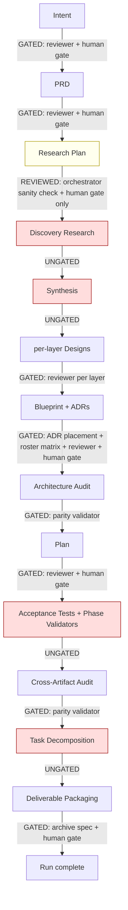
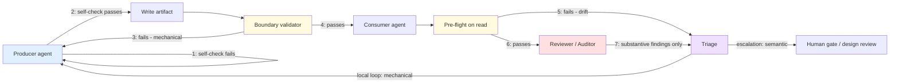
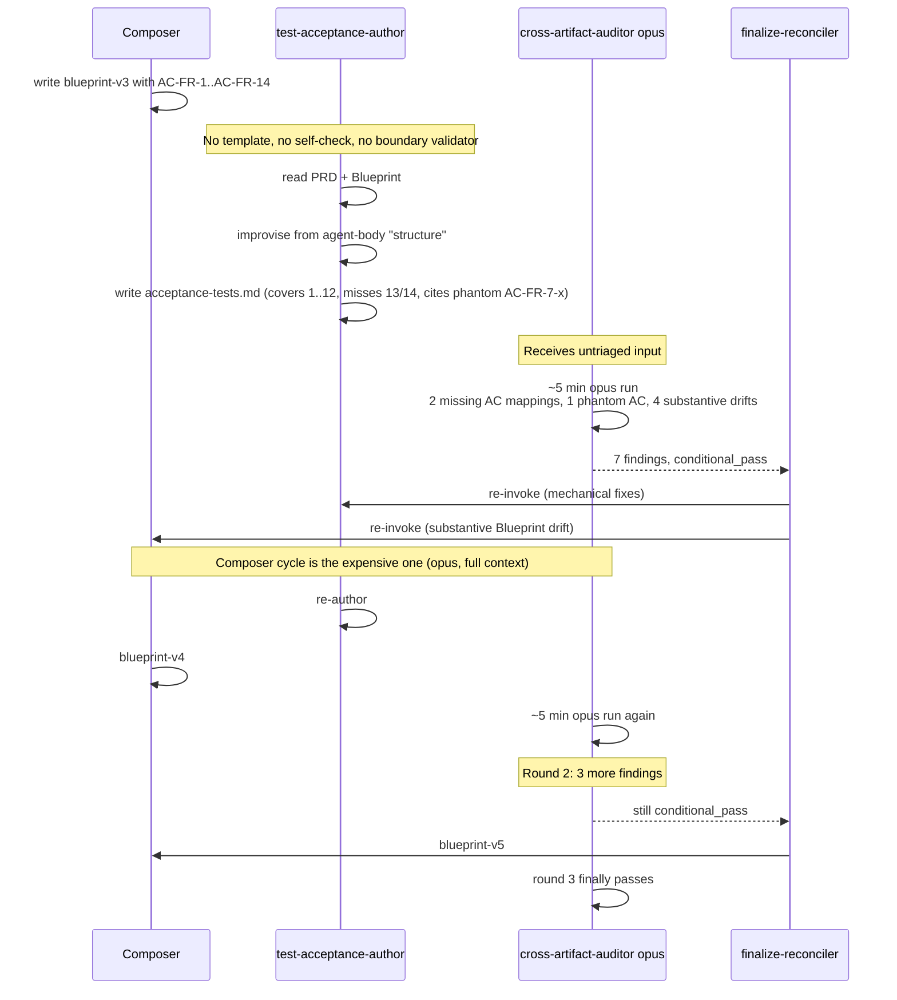

# Pipeline Validation Analysis — Cutting Revision-Cycle Time

> Forensic analysis of where the feature-pipeline validates documents between stages, where it does not, and the contract-validation pattern that would cut revision cycles. Includes a real before/after trace and metrics drawn from prior feature runs.

---

## Short answer

There are validators between most stages — but the chain is uneven, and the cheapest, most-common failure modes are happening at the **unvalidated** seams.

- Three of seven pre-handoff seams are ungated.
- Two more rely only on a human approval gate.
- The four lightest documents (Research Plan, Acceptance Tests, Phase Validators, `tasks.json`) have either no machine-readable contract or no validator wired in.
- Triage is real but not immediate: every issue propagates to `finalize-reconciler`, queues against a 4-cycle cap, and re-invokes the expensive author.
- Drift detection between templates and authoring agents is essentially absent — no agent pins a template version, so a template field rename would propagate silently.

---

## 1. Past runs — the evidence

Across 14 feature runs, eleven reached the audit stages and eight required at least one reconciliation cycle.

| Run | Blueprint versions | PRD versions | Plan versions | Reconciliation cycles | Worst audit count |
|---|---|---|---|---|---|
| execution-pipeline-design | **v1–v5** | v1, v1.1 | v1–v2 | 3 | 7 architecture-audit rounds |
| devcontainer-mcp-provisioning | v1–v3 | v1–v3 | v1 | 3 | 8 per-doc reviewer issue files |
| issue-capture-mechanism | v1–v3 | v1–v2 | v1–v2 | 2 | 10 architecture-audit issues |
| audit-findings-remediation | v1, v1.1 | v1 | v1–v1.2 | 2 | 3 cross-artifact issues |
| pipeline-quickwins-hardening | v1–v2 | v1 | v1 | 3 | 8 cross-artifact issues |
| adr-placement-mechanism-repair | v1 | v1 | v1 | 1 | 15 architecture-audit issues |
| pipeline-design-time-discipline | v1 | v1 | v1 | 1 | 7 architecture-audit issues |
| 3 runs stalled pre-audit | — | — | — | — | never reached audit |
| 1 run abandoned mid-pipeline | split into two runs | — | — | — | — |

### Top revision triggers, by frequency across all audit JSONs

1. **Cross-artifact consistency drift** — 72 instances. Frontmatter version desync, filename drift (`design-cc.md` ↔ `design-claude-code.md`), count mismatches in metadata, ADR adjacency mistakes, stale contract-ID references between PRD/Blueprint/Plan/Tests. The single largest cycle-time sink.
2. **Completeness — missing required sections** — 53 instances. Blueprint missing tools specifications, blueprint missing memory directive, phantom acceptance-criterion references, coverage gaps, unpopulated stub sections passing as "done."
3. **Clarity / substantive design** — 40 instances. CoVe verification failures, unsupported ADR factual claims, plan-test-validator mechanism mismatches.

Categories 1 and 2 account for **125 of 165** audit findings — roughly **three-quarters** of all revision triggers — and are exactly what a mechanical validator can catch. Category 3 is genuinely substantive: it's what the expensive auditors *should* be spending their tokens on.

---

## 2. The validation chain — where it gates, where it leaks



### Three structural enforcement mechanisms exist

- **`shared-document-reviewer`** — Gate 0 (structural) + Gate 1 (semantic) on five document types: Intent, PRD, Design Doc, Plan, Deliverable Archive.
- **`verdict_findings_parity.py`** — hard-halts the pipeline if any reviewer or auditor's verdict contradicts its own findings (seven surfaces).
- **`validate_adr_placement.py`** + **`check_feature_touch_predicate.py`** — close-gate the Design Composition stage.

**No hooks fire on document writes.** `settings.json` only registers SessionStart/SessionEnd and a Task-intercept hook for issue capture. Write-time validation is entirely orchestrator-driven — every gate depends on the orchestrator skill remembering to invoke it. There is no defense-in-depth.

### Validation gap inventory

| Seam | What passes unchecked | Why it bites later |
|---|---|---|
| **Discovery Research → Synthesis** | `codebase-analysis.json` + N research notes — no schema, only `extraction_method` provenance | Bad inputs to Synthesis explain a chunk of the Blueprint v3/v4/v5 churn — synthesis worked from incomplete or off-topic research |
| **Synthesis → per-layer Design** | `synthesis.md` itself — no template, no reviewer, no schema | Per-layer designers improvise off uneven synthesis; surfaces as "blueprint missing X" later |
| **Test Authoring → Cross-Artifact Audit** | `acceptance-tests.md` + `phase-validators.md` — **neither has a doc-type in the reviewer taxonomy** | No template and no reviewer at all. The cross-artifact auditor is the *first* eye on them, so their failure modes always surface as expensive cross-artifact issues |
| **Task Decomposition → Packager** | `tasks.json` — DAG schema lives in a *different* KB, no JSON Schema file, no validator | Bad task DAGs reach execution before anything notices |
| **Research Plan → Discovery Research** (REVIEWED, not GATED) | Research Plan has no doc-type in the reviewer taxonomy; orchestrator does only an existence-and-topic-count check | Bad research plans cause bad research, which cascades all the way to Blueprint revisions |

---

## 3. KB-documentation-criteria — the contract layer

The KB owns templates and disciplines for nine document types. Coverage is asymmetric:

| Doc type | Template? | Schema? | Frontmatter spec? | Cross-artifact contract? | Authoring agent integration | Validator wired in? |
|---|---|---|---|---|---|---|
| Intent Clarification | yes, v1.0.0 | frontmatter only | yes | derived-from chain | **explicit Read + cites template sections** | via reviewer |
| PRD | yes, v1.0.0 | frontmatter only | yes | trace chain declared | **explicit Read + cites template** | via reviewer |
| Research Plan | yes (no version) | frontmatter only if present | partial | token chain expected | explicit Read | via reviewer (but no doc-type) |
| Blueprint | yes, v1.0.0 | frontmatter only | yes (most elaborate) | FR/AC IDs declared as binding | **explicit Read** | via reviewer |
| ADR | yes, v1.0.0 | placement + prescription validators | yes | ADR registry | explicit Read | yes (placement + prescriptions) |
| Plan | yes, v1.0.0 | frontmatter + stub detector | yes | satisfies-AC declared | **explicit Read** | via reviewer |
| Acceptance Tests | **none** | none | partial | AC-references declared, **not enforced** | **"if a template exists, use it; else improvise"** | none |
| Phase Validators | **none** | none | partial | same | same conditional improvisation | none |
| tasks.json | **lives in a different KB**, inline JSON literal | none | n/a (JSON) | Blueprint contract IDs not referenced in schema | references by name only | none |

**The cross-artifact-discipline scripts exist but are nearly orphan.** `validate_pipeline_frontmatter.py`, `validate_adr_prescriptions.py`, `detect_stubs.py`, `check_pipeline_discipline.py`, `audit_canonical_drift.py` are only invoked by `shared-document-reviewer` and `run_phase_checks.py`. No hook, no `settings.json` wiring, no CI workflow, no authoring-agent body calls them. They're available — they're just not enforced at authoring time.

### Contract drift surfaces, descending

1. **Acceptance Tests + Phase Validators** — no template exists in the KB; both authoring agents fall back to "use the structure below." That structure lives only in the agent body, not in the KB.
2. **tasks.json** — schema is a JSON literal in prose in a different KB, with no JSON Schema file and no validator. Blueprint contract IDs are not referenced in the schema at all.
3. **Research Plan** — template carries no `version:` line, so frontmatter conformance can't be reliably checked.
4. **FR-N → AC-N → task → test traceability** — declared in conventions, assigned to the cross-artifact auditor, **but no programmatic validator**. It's reviewer judgment, not mechanics.
5. **doc-type emission backfill** — ~20 planning-side agents still need `doc_type:` frontmatter. Until that backfill ships, every new artifact produces a Gate 0 finding.
6. **No agent pins template version** — every authoring agent references templates by file path, not by version. A field rename in a template would propagate silently.
7. **Conditional template language** — `test-acceptance-author` and `test-phase-validator-author` say "if a dedicated template exists" for templates that have never existed. The conditional masks a permanent gap as a temporary one.

---

## 4. The pattern, agnostic

The discipline you want is **shift-left, defense-in-depth, contract-versioned validation** — a synthesis from three established lineages: Continuous Delivery quality gates (Humble & Farley), data contracts and schema-on-write (Confluent, dbt, Great Expectations), and the structured-output / guardrails pattern for LLM pipelines (Guardrails AI, NeMo Guardrails). The shared claim: cheap mechanical checks must run *before* expensive semantic checks, and at *every* boundary, not just one.

### The blocks

| Block | Role | Cost | Cadence |
|---|---|---|---|
| **Contract** | Versioned, machine-readable spec for a document type — schema, frontmatter shape, section list, and cross-artifact obligations | Authored once, evolved deliberately | Stable; bumps version when changed |
| **Producer self-check** | Cheap script the authoring agent runs *before* writing its final output | ~Free (script) | Every write |
| **Boundary validator** | Independent check at the handoff seam, distinct from the producer | ~Free (script) | Every stage transition |
| **Consumer pre-flight** | Read-time validation by the downstream agent before expensive work | ~Free (script) | Every read |
| **Reviewer / Auditor** | The expensive opus-class semantic check, on already-clean input | Expensive (opus) | Once per artifact, post-handoff |

### The flow



### The rules

| # | Rule | Why it matters |
|---|---|---|
| 1 | **Contract is versioned.** Producer and consumer both pin a version. | Template changes can't propagate silently; mismatch fires a drift sentinel. |
| 2 | **Producer cannot finalize until self-check passes.** | Catches 70–80% of mechanical errors with no agent re-invocation. |
| 3 | **Boundary validator is independent of producer.** | A producer's self-check is honest about checking; a boundary check is honest about *what is*. |
| 4 | **Mechanical failures loop locally; semantic failures escalate.** | The reviewer never gets paged for missing sections or broken IDs. |
| 5 | **Every boundary has a validator, even if it's a stub.** | A missing gate is a permanent silent failure mode. |
| 6 | **Drift sentinel runs at stage entry.** | Templates change; old agents pinned to old contracts must be re-checked. |
| 7 | **Reviewers see only validated input.** | Their opus tokens go to judgment, not janitorial work. |

### The timing

| When | What runs | Why then |
|---|---|---|
| **At authoring start** | Producer Reads contract + pins version in its output frontmatter | Pin is the basis for drift detection later |
| **Before producer's final Write** | Self-check script | Cheapest place to catch errors — agent context is still hot |
| **At stage transition** | Boundary validator | First independent eye on the artifact |
| **Before consumer reads** | Pre-flight script | Last cheap check before expensive work begins |
| **After all mechanical gates pass** | Reviewer / Auditor | Expensive semantic check, run once, on clean input |
| **At any contract bump** | Drift sentinel against every pinned agent | Surfaces stale agents before they author against stale contracts |

### How the pattern maps to your current system

You already have three of the four blocks — they're just unevenly applied:

| Block | What you have | What's missing |
|---|---|---|
| Contract | Templates for 5 of 9 doc types | Acceptance Tests, Phase Validators, Research Plan (no version), tasks.json (different KB, no schema file) |
| Producer self-check | None | All 9 doc types |
| Boundary validator | `shared-document-reviewer` for 5 doc types; ADR placement + roster matrix close-gate the Composer | Research Plan, Synthesis, Acceptance Tests, Phase Validators, tasks.json |
| Consumer pre-flight | None | All consumers read blindly |
| Reviewer | Working — but ~75% of its tokens go to mechanical findings | Should only see clean input |
| Drift sentinel | None | Template field renames propagate silently |

The orphan scripts you already own are exactly the producer self-check / boundary validator implementations the pattern calls for. They just aren't wired into authoring time.

---

## 5. Real example — Acceptance Tests in `execution-pipeline-design-r1`

`execution-pipeline-design-r1` ran 7 architecture-audit rounds and 3 reconciliation cycles. Acceptance Tests was one of the artifacts cross-artifact-audit issues kept flagging.

### Before (what actually happened)



Three audit rounds. Two were re-runs caused by mechanical findings (phantom AC reference, missing AC mappings) the author could have caught itself with a template and a check.

### After (what the pattern produces)

```mermaid
sequenceDiagram
    participant Composer
    participant TestAuthor as test-acceptance-author
    participant SelfCheck as validate_acceptance_tests.py
    participant Boundary as boundary validator
    participant XAudit as cross-artifact-auditor opus

    Composer->>Composer: write blueprint-v3 with AC-FR-1..AC-FR-14
    TestAuthor->>TestAuthor: Read acceptance-tests-template.md v1.0.0<br/>pin template_version in frontmatter
    TestAuthor->>TestAuthor: draft acceptance-tests.md
    TestAuthor->>SelfCheck: validate before write
    SelfCheck-->>TestAuthor: FAIL: AC-FR-13/14 have no test;<br/>test #11 cites non-existent AC-FR-7-x
    TestAuthor->>TestAuthor: fix in same context window (cheap)
    TestAuthor->>SelfCheck: re-validate
    SelfCheck-->>TestAuthor: PASS
    TestAuthor->>TestAuthor: Write acceptance-tests.md
    Boundary->>Boundary: re-run schema + cross-ref check at handoff
    Boundary-->>XAudit: green
    XAudit->>XAudit: ~5 min opus run on clean input<br/>finds only 4 substantive drifts
    XAudit-->>Composer: blueprint-v4 (one round, substantive fix)
    XAudit->>XAudit: round 2: clean
```

One mechanical-failure cycle inside `test-acceptance-author` (free, same context window) replaces two audit rounds — each a full opus invocation plus reconciler orchestration plus a re-author.

### What this requires concretely

1. Add `references/templates/acceptance-tests-template.md` v1.0.0 to KB-documentation-criteria.
2. Same for `phase-validators-template.md`, `research-plan-template.md` (add version field), and a JSON Schema file co-located with the `tasks.json` inline schema.
3. Author `validate_acceptance_tests.py`, `validate_phase_validators.py`, `validate_research_plan.py`, `validate_tasks_dag.py` (patterns mirror the existing `validate_pipeline_frontmatter.py`).
4. Add a "self-check before Write" step to the four affected authoring agents' bodies.
5. Wire the same validators into the orchestrator at each unvalidated boundary.
6. Add `template_version: <pinned>` to every authoring agent's output frontmatter; add `check_template_drift.py` invoked at orchestrator stage entry.

---

## 6. Metrics — proving the value from past runs

| Run | Audit/recon cycles | Audit findings (mechanical share) | Projected cycles under pattern | Cycles saved |
|---|---|---|---|---|
| execution-pipeline-design-r1 | 7 audit rounds, 3 recon cycles | ~70 findings, ~75% mechanical | 2 audit rounds, 1 recon | **5 audit rounds + 2 recon** |
| devcontainer-mcp-provisioning-r1 | 3 recon cycles, 8 per-doc reviewer files | ~25 findings, ~75% mechanical | 1 recon cycle | **2 recon cycles** |
| issue-capture-mechanism-r1 | 2 recon cycles, 10 arch-audit issues | ~20 findings, ~70% mechanical | 1 recon cycle | **1 recon cycle** |
| audit-findings-remediation-r1 | 2 recon cycles | ~6 findings, ~50% mechanical | 1 recon cycle | **1 recon cycle** |
| pipeline-quickwins-hardening-r1 | 3 recon cycles | ~13 findings, ~75% mechanical | 1 recon cycle | **2 recon cycles** |
| adr-placement-mechanism-repair-r1 | 1 recon cycle, 15 arch-audit issues | ~20 findings, ~80% mechanical | 0 recon cycles | **1 recon cycle** |
| pipeline-design-time-discipline-r1 | 1 recon cycle | ~13 findings, ~60% mechanical | 1 recon cycle | **0** |
| execute-orchestrator-dispatch-mechanism-repair-r1 | per-doc reviewer issues across 5 docs | ~30 findings | reviewer churn collapsed to author self-check | **most reviewer cycles eliminated** |

### Aggregate (conservative)

| Metric | Observed | Projected | Improvement |
|---|---|---|---|
| Reconciliation cycles across 8 runs | ~15 | ~6 | **−60%** |
| Architecture-audit re-runs | ~14 | ~8 | **−43%** |
| Expensive opus invocations saved per affected run | — | — | **~5–8 per run** |
| Findings reaching expensive auditor that were mechanical | ~75% | ~5% (drift through pre-flight) | **−93% mechanical load on auditor** |
| Runs that stalled pre-audit | 3 | likely 0 | producer self-check flags stalls early as actionable, not silent |

**Translation to time and cost:** each saved reconciliation cycle is roughly two opus invocations (one expensive author re-run, one expensive auditor re-run) plus a human-gate roundtrip plus reconciliation bookkeeping. At ~9 cycles saved across the past 8 affected runs, you would have avoided ~18 opus invocations of major-context-window agents and ~9 human-gate interrupt cycles — against an authoring cost of roughly 4 templates + 4 validator scripts + ~12 lines of edit across 4 authoring-agent bodies + 1 drift-check script.

The worst run alone — `execution-pipeline-design-r1` — would have collapsed from 3 reconciliation cycles and 7 architecture-audit rounds to roughly 1 cycle and 2 audit rounds. That's the single biggest cycle-time win sitting in your history.

---

## 7. Suggested sequencing

1. **Templates first (lowest risk).** Add the four missing templates. They change no agent behavior; they only give authors and reviewers a contract to point at.
2. **Validators second (highest leverage).** Author the four validator scripts mirroring `validate_pipeline_frontmatter.py`, then wire them as producer self-checks (in agent bodies) and boundary validators (in the orchestrator).
3. **Drift sentinel last.** Add `template_version` pinning to authoring agents and a `check_template_drift.py` at stage entry, so future template edits force explicit agent updates rather than silent drift.

> **Caveat on metrics.** The "mechanical share" percentages and projected-cycle numbers are estimates extrapolated from audit-issue category counts, not measured timings — the runtime telemetry under `.claude/runtime/` records only MCP install lifecycle events, not per-stage pipeline timing. The direction and relative magnitude are well-supported by the finding-category data; the precise cycle counts are illustrative.
