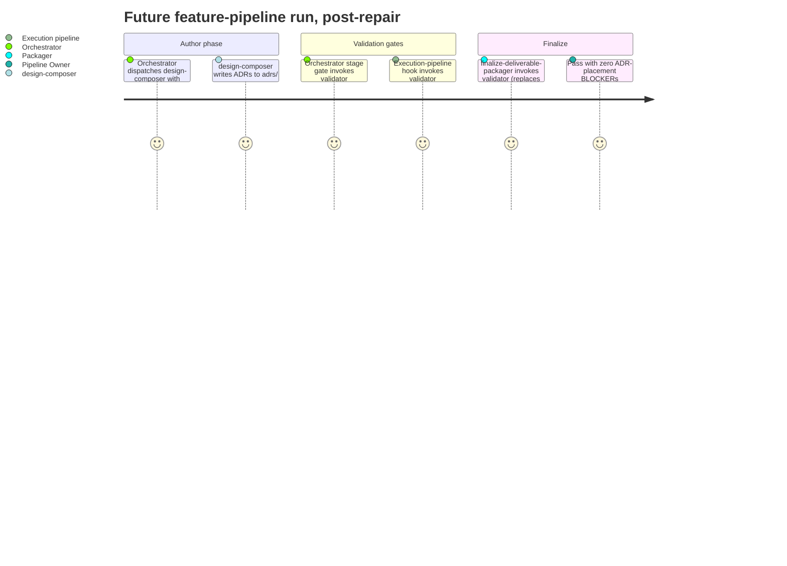
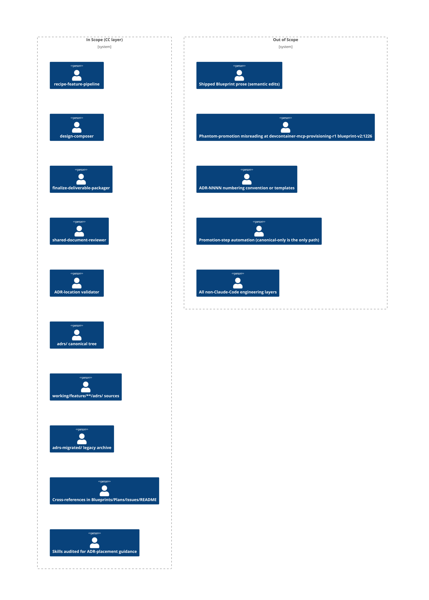

# PRD: Repair the ADR Placement Mechanism Per ADR-0036

## Contents

Section completion checklist — each box must be checked (including `N/A — out of scope` rows) before this document leaves draft. The reviewer's Gate 0 check uses this list as the structural-presence anchor.

- [x] Overview
- [x] Stakeholders
- [x] User Stories
- [x] Functional Requirements
- [x] Non-Functional Requirements
- [x] Product Policy Decisions
- [x] Success Criteria
- [x] Technical Considerations
- [x] Rollout Plan
- [x] Undetermined Items
- [x] Appendix

## Overview

### One-line Summary

Comprehensively repair the ADR placement mechanism so the canonical-only convention codified by ADR-0036 is structurally enforced across the repository — by migrating every off-canonical ADR into `adrs/`, sweeping every cross-reference to the consolidated location, wiring a validator into three enforcement surfaces, and auditing every skill that could otherwise re-introduce the feature-scoped placement behavior.

### Background

ADR-0036 (accepted 2026-05-22) codified single-location ADR placement at canonical-root `adrs/`. The four operator files that should have been aligned with that decision (`finalize-deliverable-packager.md`, `shared-document-reviewer.md`, `recipe-feature-pipeline/SKILL.md`, `design-composer.md`) were not. As a result, `design-composer` continued to write feature-scoped ADRs, and `finalize-deliverable-packager` continued to enforce a retired dual-location BLOCKER. The empirical failure mode (PKG-BLOCKER-001 in `devcontainer-mcp-provisioning-r1` Gate-6) confirmed the alignment gap; the counter-demonstration (Gate-7 ratification of `execute-orchestrator-dispatch-mechanism-repair-r1`) confirmed the user-facing inconsistency.

The originally-scoped repair (v1.1.0 of the Intent Clarification — "four surgical edits + grandfather") was overridden at the Intent Confirmation Gate by a binding user directive that materially expanded scope from MINOR to FULL: "we need to migrate and ensure all references, paths and links all reference the new consolidated location. also the feature pipeline and execution pipeline need to be updated to ensure it adheres, enforcement gates and validates the correct location and references to ADRs. we also need to ensure all of our SKILLs are updated if required to prevent re-introducing the issue." A subsequent gate decision further selected interpretation (a) for the `adrs-migrated/` legacy archive — it shall be consolidated into canonical `adrs/` as Phase 2d.

The on-disk reality (verified by the orchestrator) is materially larger than the proposal's "12 ADRs to migrate" framing: 12 byte-identical duplicates (trivial dedupe), 3 divergent duplicates needing semantic resolution (ADR-0024, ADR-0044, ADR-0045), 5 truly feature-scoped ADRs needing relocation (ADR-0046–0050), 47 files in `adrs-migrated/` to consolidate, and an unknown but bounded set of in-repository cross-references to update path-only.

### Layer Scope

Declare which engineering layers this feature touches. The same 9-layer taxonomy is used by the PRD and the Blueprint — see `../layer-taxonomy.md` for full descriptions.

Product-surface concerns live in Stakeholders, User Stories, Non-Functional Requirements, and Product Policy Decisions — NOT in Layer Scope.

- [x] **Claude Code / Project Filesystem** — operator files (`.claude/agents/finalize-deliverable-packager.md`, `.claude/agents/shared-document-reviewer.md`, `.claude/agents/design-composer.md`), orchestrator skill (`.claude/skills/recipe-feature-pipeline/SKILL.md`), new validator (`.claude/skills/auditing-shared/scripts/`), skill audit + remediation across `.claude/skills/**/*.md`, canonical ADR tree (`adrs/`, plus `adrs/superseded/` for divergent-body archival), feature-scoped ADR sources (`working/feature/**/adrs/`), legacy archive (`adrs-migrated/` consolidation), shipped Blueprint and Plan cross-references (`working/feature/**/blueprint-v*.md`, `working/feature/**/plan-v*.md`), Issues files (`Issues/**/*.md`), and the README.
- [ ] **Frontend** — N/A — out of scope.
- [ ] **Backend** — N/A — out of scope.
- [ ] **API** — N/A — out of scope.
- [ ] **Query / Data Access** — N/A — out of scope.
- [ ] **Database** — N/A — out of scope.
- [ ] **CI/CD (GitHub Actions)** — N/A — out of scope.
- [ ] **Infrastructure as Code** — N/A — out of scope.
- [ ] **Dev Environment (Codespaces / Devcontainer)** — N/A — out of scope.

**Deviation flag for downstream reviewers:** scope class is FULL but layer count is one. The single layer's breadth (validator script, repo-wide cross-reference sweep, multi-surface enforcement integration, skill audit and remediation, four-sub-phase migration including legacy-archive consolidation) is substantially larger than the v1.1.0 prediction. Architecture Auditor and Plan author should treat the breadth-within-layer as the deviation signal, not the layer count.

## Stakeholders

### Stakeholder Inventory

| Stakeholder | Description | Primary Layer(s) | Relationship | Volume / Importance |
|-------------|-------------|------------------|--------------|---------------------|
| Owner (joshua.selfe@gmail.com) | Pipeline maintainer who issued the binding scope-expansion directive; cares that canonical-only placement is structurally enforced (not merely declarative) and that no skill can re-introduce the feature-scoped behavior. | Claude Code / Project Filesystem | Decider / final gate | 1 (sole owner) |
| `shared-document-reviewer` | Runs Gates 0/1 on every authored document per ADR-0017; cares that this Intent Clarification, this PRD, the Blueprint, and the Plan pass review; cares that its own operator-file BLOCKER prose is internally consistent post-edit. | Claude Code / Project Filesystem | Reviewer (gating) | Per-document |
| `review-architecture-auditor` | Audits Blueprint substantively; cares that migration disposition, validator integration, and skill-audit remediation are internally consistent with ADR-0036 and that the three enforcement surfaces are non-redundant and non-contradictory. | Claude Code / Project Filesystem | Reviewer (gating) | Per-Blueprint |
| `review-cross-artifact-auditor` | Cross-artifact consistency check after Plan + Tests authored; cares that the multi-phase scope stays internally coherent. | Claude Code / Project Filesystem | Reviewer (gating) | Per-Plan |
| `finalize-deliverable-packager` | PKG-BLOCKER-001 is replaced by a validator-backed canonical-only check; behavior changes from "BLOCKER on dual-location" to "BLOCKER on any non-canonical location." | Claude Code / Project Filesystem | Affected agent | Per-feature run |
| Future feature-pipeline runs | Inherit canonical-only placement as the structurally-enforced default; no Gate-7 opt-in required; validator blocks attempted feature-scoped writes before they ship. | Claude Code / Project Filesystem | Downstream consumer | All future runs |
| `devcontainer-mcp-provisioning-r1` Gate-6 deferral chain | The "defer to pipeline-fix follow-up feature" disposition recorded against PKG-BLOCKER-001 closes when this feature ships. | Claude Code / Project Filesystem | Informed (closes deferral) | 1 historical feature |
| Author of `frontend-design-knowledge-r1` (informed) | Divergent-body decision for ADR-0024 affects this originating feature; informed of the canonical-body selection rationale and the archival of the rejected body. | Claude Code / Project Filesystem | Informed | 1 feature |
| Author of `issue-capture-mechanism-r1` (informed) | Divergent-body decisions for ADR-0044 / ADR-0045, plus FR-8c relocation of ADR-0046–0050 from that feature folder, affect this originating feature; informed of the canonical-body selections, relocations, and redirect-note format. | Claude Code / Project Filesystem | Informed | 1 feature |

### Primary Users

The Owner is the primary decider for trade-off resolution. The four reviewer sub-agents (`shared-document-reviewer`, `review-architecture-auditor`, `review-cross-artifact-auditor`, `finalize-deliverable-packager`) are the primary "operational users" whose runtime behavior changes; their changed behavior is the user-observable proof that the repair landed. Future feature-pipeline runs are the indirect-but-critical population whose default behavior is shifted by the validator and the operator-file edits.

## User Stories

Per the PRD authoring discipline, only groups whose experience changes meaningfully are listed.

### Pipeline Owner (Claude Code / Project Filesystem)

```
As the pipeline owner
I want canonical-only ADR placement to be structurally enforced at three independent surfaces
So that no future pipeline run, agent edit, or skill drift can re-introduce feature-scoped ADRs without an enforcement gate blocking it
```

**Acceptance Criteria:**

- [ ] AC-US-1-a (CC): When the orchestrator runs a fresh feature-pipeline pass after this feature ships and no `output_adrs_dir` override is supplied, the system shall write any authored ADRs only to canonical-root `adrs/`.
- [ ] AC-US-1-b (CC): When a test fixture or contrived agent edit attempts to place an `ADR-*.md` file outside canonical `adrs/` (and outside the allowlist), the system shall block at one or more of the three enforcement surfaces (orchestrator stage gate, execution-pipeline hook, packager).

### Reviewer Sub-agents (Claude Code / Project Filesystem)

```
As shared-document-reviewer (and the other reviewer sub-agents)
I want the operator-file prose to express a single internally-consistent ADR-placement convention
So that I do not flag canonical-only placements as violations and do not pass dual-location placements as acceptable
```

**Acceptance Criteria:**

- [ ] AC-US-2-a (CC): When `shared-document-reviewer` reviews a Blueprint whose ADRs are placed at canonical root only, the system shall not flag canonical-only placement as a violation.
- [ ] AC-US-2-b (CC): When the four touched operator files (`finalize-deliverable-packager.md`, `shared-document-reviewer.md`, `recipe-feature-pipeline/SKILL.md`, `design-composer.md`) are read after this feature ships, the system shall present a single internally-consistent ADR-placement convention across all four (no file contradicts ADR-0036; no file contradicts another).

### Finalize Deliverable Packager (Claude Code / Project Filesystem)

```
As finalize-deliverable-packager
I want my ADR-placement check to call the canonical-only validator
So that PKG-BLOCKER-001 is replaced by a check that BLOCKERs on any non-canonical location rather than only the now-impossible dual-location case
```

**Acceptance Criteria:**

- [ ] AC-US-3-a (CC): When `finalize-deliverable-packager` runs on a feature whose ADRs are authored only to canonical-root `adrs/`, the system shall not raise PKG-BLOCKER-001 or any equivalent dual-location BLOCKER.
- [ ] AC-US-3-b (CC): When `finalize-deliverable-packager` runs on a feature whose ADRs include any file outside canonical `adrs/` (and outside the allowlist), the system shall raise a BLOCKER via the FR-10 validator.

### Future Feature-Pipeline Runs (Claude Code / Project Filesystem)

```
As a future feature-pipeline run
I want the canonical-only default to be the only path the operator files and skills describe
So that no contributor, agent prompt, or skill prose can permit feature-scoped placement to re-enter without overriding an explicit default and tripping the validator
```

**Acceptance Criteria:**

- [ ] AC-US-4-a (CC): When a future feature pipeline begins after this feature ships, the system shall pass canonical-root `adrs/` as the `output_adrs_dir` default to `design-composer` without requiring caller override.
- [ ] AC-US-4-b (CC): When a future contributor or agent reads any skill in the audit scope (`KB-documentation-criteria`, `auditing-*` family, `recipe-feature-pipeline`, synthesize-class skills, `KB-review-disciplines`), the system shall present canonical-only ADR placement as the only documented path.

### Use Cases

1. **A fresh feature-pipeline run authors ADRs.** The orchestrator invokes `design-composer` with the canonical-root default; ADRs land at `adrs/`; the packager's validator-backed check passes; no BLOCKER raised. (Stakeholder: Future feature-pipeline runs.)
2. **A contrived negative-path test attempts a feature-scoped write.** A test fixture writes an ADR to `working/feature/<slug>/adrs/`; an enforcement-gate surface (exact stage decided during Design — see AC-FR-10-b) invokes the validator; non-zero exit; stage blocks. (Stakeholder: Pipeline Owner.)
3. **The deferral chain on `devcontainer-mcp-provisioning-r1` closes.** Gate-6 PKG-BLOCKER-001 was deferred to this feature; once the validator and operator edits ship, the deferral is closeable. (Stakeholder: `devcontainer-mcp-provisioning-r1` Gate-6 deferral chain.)
4. **A skill is re-read post-audit.** A contributor opens `recipe-feature-pipeline/SKILL.md`; the parameter declaration cites ADR-0036 and documents canonical-root as the default. (Stakeholder: Future feature-pipeline runs.)

### User Journey Diagram



### Scope Boundary Diagram



## Functional Requirements

Every FR is tagged with the stakeholder it serves and the layer where its acceptance is observed. All FRs in this PRD are Layer: **Claude Code / Project Filesystem** (CC). Per the Intent Clarification's binding decomposition, FRs are P1 (Must Have) — this is a repair feature with no P2/P3 splits.

### Must Have (P1 - MVP)

- [ ] **FR-1 — Delete retired dual-location BLOCKER prose in packager** — Stakeholder: `finalize-deliverable-packager`, Reviewer sub-agents — Layer: CC
  The `.claude/agents/finalize-deliverable-packager.md` file shall no longer contain the retired dual-location BLOCKER check at lines 56–63 (or its equivalent post-edit location). The packager's ADR-placement check shall be replaced by a call to the FR-10 validator.
  - AC-FR-1-a (CC): When `.claude/agents/finalize-deliverable-packager.md` is read after this feature ships, the system shall not contain the retired dual-location BLOCKER prose text (the text currently at lines 56–63).
  - AC-FR-1-b (CC): When `finalize-deliverable-packager` runs on a feature whose ADRs were authored only to canonical root `adrs/`, the system shall not raise PKG-BLOCKER-001 or any equivalent dual-location BLOCKER, and the replacement canonical-only check (per FR-10) shall pass.

- [ ] **FR-2 — Delete contradictory dual-location BLOCKER prose in reviewer** — Stakeholder: `shared-document-reviewer`, Pipeline Owner — Layer: CC
  The `.claude/agents/shared-document-reviewer.md` file shall no longer contain the contradictory dual-location check at line 349. The only ADR-placement statement shall be the post-ADR-0036 statement at lines 470–472 (or equivalent post-edit location).
  - AC-FR-2-a (CC): When `.claude/agents/shared-document-reviewer.md` is read after this feature ships, the system shall not contain the contradictory dual-location BLOCKER check at line 349 (or its equivalent location).
  - AC-FR-2-b (CC): When `shared-document-reviewer` reviews a Blueprint that references ADRs at canonical root only, the system shall not flag the canonical-only placement as a violation.

- [ ] **FR-3 — Orchestrator `output_adrs_dir` default resolves to canonical root** — Stakeholder: Future feature-pipeline runs, Pipeline Owner — Layer: CC
  The `.claude/skills/recipe-feature-pipeline/SKILL.md` (the orchestrator) shall resolve `output_adrs_dir` to canonical-root `adrs/` (not a feature-scoped path) when invoking `design-composer`. The parameter declaration is at SKILL.md:273; the actual default-resolution edit form is determined by Discovery + Design Composition.
  - AC-FR-3-a (CC): When the orchestrator invokes `design-composer` without an explicit caller-supplied `output_adrs_dir` override, the system shall pass canonical-root `adrs/` (relative to repo root), not a feature-scoped path such as `working/feature/<slug>/adrs/`.
  - AC-FR-3-b (CC): When the orchestrator forwards an explicit caller-supplied `output_adrs_dir` to `design-composer`, the orchestrator shall pass that value unmodified (the orchestrator's responsibility is pass-through-fidelity; the design-composer-side override-honoring behavior is covered by AC-FR-5-b).

- [ ] **FR-4 — Design-composer parameter description carries canonical default + ADR-0036 reference** — Stakeholder: Future feature-pipeline runs, Pipeline Owner — Layer: CC
  The `.claude/agents/design-composer.md` file at lines 48, 129, 187 shall describe the `output_adrs_dir` parameter with canonical-root as the default and shall cite ADR-0036 explicitly; the description shall document the test-only override mechanism.
  - AC-FR-4-a (CC): When `.claude/agents/design-composer.md` is read after this feature ships, the `output_adrs_dir` parameter description shall cite ADR-0036 explicitly and shall state that canonical-root `adrs/` is the default.
  - AC-FR-4-b (CC): The system shall document, in `design-composer.md`, the test-only override mechanism for `output_adrs_dir` (the override surface — env var, CLI flag, test-fixture-only — is decided by Discovery + Design and recorded in the Blueprint).

- [ ] **FR-5 — `output_adrs_dir` remains a parameter with documented test-only override** — Stakeholder: Pipeline Owner — Layer: CC
  Per the Q1 resolution, `output_adrs_dir` shall not be eliminated; it shall remain a parameter whose default is canonical-root, with the override surface documented in `design-composer.md`.
  - AC-FR-5-a (CC): The system shall retain `output_adrs_dir` as a parameter on `design-composer` (it shall not be eliminated).
  - AC-FR-5-b (CC): Where a caller passes `output_adrs_dir` explicitly, the system shall honor the passed value rather than the default.

- [ ] **FR-6 — Blueprint documents migration disposition** — Stakeholder: Pipeline Owner, `review-architecture-auditor` — Layer: CC
  The Blueprint authored as part of this feature shall enumerate every ADR currently outside canonical `adrs/`, classify each (duplicate-identical / duplicate-divergent / feature-scoped-only / legacy-archive-final / legacy-archive-pre-naming / legacy-archive-pre-template), and document the migration disposition per FR-8. (Note: this 6-category taxonomy supersedes the Intent Clarification's earlier 4-category framing, per the OI-2 gate resolution that mandates a 3-way split of the legacy-archive bucket. Discovery and Blueprint authors must use the 6-category taxonomy, not re-derive the 4-category version.)
  - AC-FR-6-a (CC): The Blueprint authored in this feature shall contain a section enumerating every ADR currently outside canonical `adrs/`, classified into one of the categories listed above per the Phase 0 Discovery output.
  - AC-FR-6-b (CC): The Blueprint shall document the migration disposition per FR-8 (dedupe / semantic-reconcile / `git mv` / consolidate-with-suffix / delete-with-Git-history-preservation) for each classified ADR.

- [ ] **FR-7 — SUPERSEDED** — Stakeholder: N/A — Layer: CC
  The v1.1.0 FR-7 ("no new validator, no promotion machinery") is superseded by FR-10. The v2.0.0 user directive explicitly mandates enforcement gates and validation. This slot is retained for traceability with the Intent Clarification's numbered FR list; no behavior is required.
  - AC-FR-7-a (CC): No acceptance criteria — slot reserved for traceability with the Intent Clarification's FR-7 supersession.

- [ ] **FR-8 — Migration of duplicated, divergent, feature-scoped, and legacy-archive ADRs** — Stakeholder: Pipeline Owner, Authors of `frontend-design-knowledge-r1` and `issue-capture-mechanism-r1` (informed) — Layer: CC
  Four sub-scopes covering all off-canonical ADR sites identified by Phase 0 Discovery.

  - **FR-8a — Dedupe (12 byte-identical duplicates).** The 12 byte-identical duplicates (ADR-0026, 0028, 0029, 0030, 0031, 0037, 0038, 0039, 0040, 0041, 0042, 0043) shall be deduplicated by verifying byte-equality between the canonical and feature-scoped copies, then deleting the feature-scoped copy.
    - AC-FR-8a-1 (CC): When this feature ships, the 12 byte-identical duplicate ADRs shall exist at canonical `adrs/` only; the feature-scoped copies shall have been deleted.
    - AC-FR-8a-2 (CC): Where a duplicate is deduplicated under FR-8a, the system shall log the byte-equality verification step in the Plan's per-task execution result (audit trail).

  - **FR-8b — Semantic reconciliation (3 divergent cases).** ADR-0024, ADR-0044, and ADR-0045 shall be reconciled: Discovery + Design Composition propose a canonical body per case; the rejected body shall be archived (default location: `adrs/superseded/<id>-feature-scoped-body.md` with a provenance footer; subject to Open Item #1 override at downstream gates).
    - AC-FR-8b-1 (CC): When this feature ships, ADR-0024, ADR-0044, and ADR-0045 shall exist at canonical `adrs/` only; the rejected body shall be archived (default location: `adrs/superseded/<id>-feature-scoped-body.md`).
    - AC-FR-8b-2 (CC): When the archived rejected body is read, the system shall present a provenance footer identifying the originating feature folder and the canonical-body decision rationale.

  - **FR-8c — Relocation (5 truly feature-scoped ADRs).** ADR-0046, 0047, 0048, 0049, 0050 (all from `working/feature/issue-capture-mechanism-r1/adrs/`) shall be relocated via `git mv` to canonical `adrs/`, with redirect notes left in the originating feature folder (format per Open Item #5).
    - AC-FR-8c-1 (CC): When this feature ships, ADR-0046 through ADR-0050 shall exist at canonical `adrs/` only; the feature-scoped originals shall have been relocated via `git mv` (preserving Git history).
    - AC-FR-8c-2 (CC): Where an ADR is relocated under FR-8c, the originating feature folder shall contain a redirect note (format per Open Item #5).

  - **FR-8d — Consolidate `adrs-migrated/` legacy archive (47 files).** The `adrs-migrated/` directory shall be consolidated into canonical `adrs/` per the gate-overridden interpretation (a): final variants move to canonical with `-superseded` suffix; `-pre-naming-convention` and `-pre-template-migration` variants are deleted (Git history preserves them). Discovery enumerates the collision-resolution strategy (likely no collisions because canonical `adrs/` currently lacks ADRs 0001–0010, the archive's primary content).
    - AC-FR-8d-1 (CC): When this feature ships, the `adrs-migrated/` directory shall be empty (or removed); every final-variant file shall exist at canonical `adrs/` with the appropriate suffix; every `-pre-naming-convention` and `-pre-template-migration` variant shall have been deleted (preserved in Git history only).
    - AC-FR-8d-2 (CC): If the collision-resolution enumeration produced by Phase 0 Discovery finds a canonical-vs-archive name collision, then the system shall record the resolution decision in the Blueprint and apply it consistently across affected files.
    - AC-FR-8d-3 (CC): When the FR-10 validator scans the post-feature repository, the system shall not allowlist `adrs-migrated/` (the directory no longer exists after FR-8d completes; the allowlist is unnecessary).

- [ ] **FR-9 — Cross-reference sweep** — Stakeholder: Pipeline Owner, future readers of shipped Blueprints/Plans/Issues/README — Layer: CC
  Every reference to a relocated or deduplicated ADR (by path) in the repository shall be updated to point to canonical `adrs/`. Scope: shipped Blueprints (`working/feature/*/blueprint-v*.md`), Plans (`working/feature/*/plan-v*.md`), agent files (`.claude/agents/*.md`), skill files (`.claude/skills/**/*.md`), Issues files (`Issues/**/*.md`), and the README. Path-only edits; no semantic rewrites.
  - AC-FR-9-a (CC): When this feature ships, no in-repository reference shall point to a relocated or deduplicated ADR at its former (feature-scoped or `adrs-migrated/`) path. A grep for the known former paths shall return zero matches (excluding the redirect notes themselves and the audit trail).
  - AC-FR-9-b (CC): The cross-reference sweep shall be path-only; shipped Blueprint prose (semantic content) shall not be edited beyond the path replacement. A diff review of shipped Blueprints after the sweep shall show only path-token changes.
  - AC-FR-9-c (CC): The Phase 0 Discovery output shall include a cross-reference inventory enumerating every reference site by file and line; the Phase 3 sweep shall update every entry in the inventory.

- [ ] **FR-10 — ADR-location validator and three-surface enforcement** — Stakeholder: Pipeline Owner, future feature-pipeline runs, `finalize-deliverable-packager` — Layer: CC
  The system shall provide a validator (default surface: Python script under `.claude/skills/auditing-shared/scripts/`; alternatives per Open Item #3) that fails on any `ADR-*.md` file found outside canonical `adrs/`. The validator shall be wired into three independent enforcement surfaces: (a) the feature pipeline orchestrator at a stage gate; (b) the execution pipeline (relevant specialist or hook — exact surface decided by Discovery); (c) `finalize-deliverable-packager` (replacing the deleted dual-location BLOCKER with a canonical-only check that calls the validator). Allowlist policy: after FR-8d completes there is no `adrs-migrated/` to allowlist; the validator's default policy is "any `ADR-*.md` outside `adrs/` fails," and any allowlist entries (if Discovery surfaces a need) are explicitly enumerated in the Blueprint.
  - AC-FR-10-a (CC): The system shall provide a validator script that, when invoked, scans the repository for `ADR-*.md` files and returns non-zero exit status if any are found outside canonical `adrs/`.
  - AC-FR-10-b (CC): When the feature pipeline orchestrator reaches its stage gate (exact stage decided during Design), the system shall invoke the validator and shall block stage progression on non-zero exit.
  - AC-FR-10-c (CC): When the execution pipeline reaches its relevant specialist or hook (exact surface decided during Design), the system shall invoke the validator and shall block progression on non-zero exit.
  - AC-FR-10-d (CC): When `finalize-deliverable-packager` runs, the system shall invoke the validator in place of the deleted dual-location BLOCKER and shall raise a BLOCKER on non-zero exit.
  - AC-FR-10-e (CC): Where a test fixture deliberately writes an `ADR-*.md` file to a feature-scoped path (negative-path test), the validator shall return non-zero and the corresponding gate(s) shall block.
  - AC-FR-10-f (CC): When the validator's allowlist (if any) is defined, the system shall enumerate every allowlist entry explicitly in the Blueprint with a justification.

- [ ] **FR-11 — Skill audit and remediation** — Stakeholder: Pipeline Owner, future feature-pipeline runs — Layer: CC
  Every skill that documents or enables ADR authoring/placement (`KB-documentation-criteria`, `auditing-*` family, `recipe-feature-pipeline`, synthesize-class skills, `KB-review-disciplines`) shall be reviewed; any prose or template that could permit feature-scoped ADR placement shall be updated. The audit shall be documented in the Blueprint and tracked as Phase 5 tasks.
  - AC-FR-11-a (CC): When this feature ships, the audit log (in the Blueprint) shall enumerate every skill reviewed and the disposition of each (no change required / updated, with a one-line note per skill).
  - AC-FR-11-b (CC): Where a skill contains prose or a template that could permit feature-scoped ADR placement (e.g., an `output_adrs_dir` template default, a "place ADRs here" instruction in the feature folder), the system shall update the skill so canonical-only is the only path the skill describes.
  - AC-FR-11-c (CC): The Blueprint shall record the skill audit findings and the remediation summary in a dedicated subsection.

### Cross-Layer / Operational ACs

These ACs verify integrated end-to-end behavior across multiple FRs.

- [ ] AC-OP-1 (CC): When a fresh feature-pipeline run completes after this feature ships and does not pass an explicit `output_adrs_dir` override, the system shall write any authored ADRs only to canonical-root `adrs/` and the packager shall PASS (zero ADR-placement BLOCKERs). Satisfies FR-1, FR-3, FR-4, FR-10 in composition.
- [ ] AC-OP-2 (CC): When the four operator files touched in Phase 1 (`finalize-deliverable-packager.md`, `shared-document-reviewer.md`, `recipe-feature-pipeline/SKILL.md`, `design-composer.md`) are read after this feature ships, the system shall present a single internally-consistent ADR-placement convention across all four (no file contradicts ADR-0036, no file contradicts another). Satisfies FR-1, FR-2, FR-3, FR-4 in composition.
- [ ] AC-OP-3 (CC): When the FR-10 validator is invoked on the post-feature repository state, the system shall return zero exit status (no ADR-placement violations remain after the migration completes). Satisfies FR-8a–d, FR-10 in composition.
- [ ] AC-OP-4 (CC): When a deliberate negative-path test writes an ADR to a feature-scoped path after this feature ships, all three enforcement surfaces (orchestrator stage gate, execution-pipeline hook, packager) shall block. Satisfies FR-10 in composition.
- [ ] AC-OP-5 (CC): When the cross-reference sweep completes (Phase 3) and the Phase 0 inventory is re-run against the post-feature repository, the system shall report zero remaining references to former (pre-migration) ADR paths, excluding redirect notes (FR-8c) and audit-trail files. Satisfies FR-8 and FR-9 in composition.

### Should Have (P2)

None. The Intent Clarification's binding decomposition enumerates FR-1 through FR-11 as Must Have; no FR is deferred to P2 in this release.

### Could Have (P3)

None.

### Won't Have (this release)

- **Semantic rewrites of shipped Blueprint prose.** Only path-only edits are in scope per Q5 revision. (See Out-of-Scope below.)
- **Amending the phantom-promotion misreading at `working/feature/devcontainer-mcp-provisioning-r1/blueprint-v2.md:1226`.** It is a semantic misreading, not a path reference; out of scope.
- **Authoring new ADR templates or changing the ADR-NNNN numbering convention.** ADR-0019 (naming) remains canonical; this feature does not touch it.
- **Introducing a promotion-step automation.** Canonical-only is the only path; the validator enforces it; no copy/promote step exists or is added.
- **Any changes outside the Claude Code / Project Filesystem layer.**

## Non-Functional Requirements

NFRs derived from the binding scope. Each NFR carries at least one EARS AC.

### Reliability

- [ ] **NFR-1 — Migration is atomic per ADR ID and rollback-documented** — Stakeholder: Pipeline Owner — Layer: CC
  Each migrated ADR (FR-8a, FR-8b, FR-8c, FR-8d) shall be moved or reconciled as an atomic unit (one ADR per Plan task, per ADR-0019's monotonic ID model). The Blueprint shall document the rollback path for each sub-phase (FR-8a: restore from Git; FR-8b: restore divergent body from Git or `adrs/superseded/` archive; FR-8c: `git mv` reverse; FR-8d: restore from Git history).
  - AC-NFR-1-a (CC): When the Plan is authored, the system shall produce one Plan task per ADR migrated (or per logical group with explicit rationale; e.g., "12 byte-identical ADRs as one task with per-ADR sub-verification"), and each task shall be independently reversible via Git.
  - AC-NFR-1-b (CC): When the Blueprint is composed, the system shall include a rollback subsection for each FR-8 sub-phase documenting the reverse procedure.

- [ ] **NFR-2 — Validator latency** — Stakeholder: Future feature-pipeline runs, `finalize-deliverable-packager` — Layer: CC
  The FR-10 validator shall complete a full repository scan in under 5 seconds on a typical Codespace (so its three-surface integration does not measurably slow pipeline runs). Rationale: the validator runs at three gates per pipeline pass and once per packager invocation; cumulative latency should remain imperceptible to a contributor running the pipeline locally.
  - AC-NFR-2-a (CC): When the validator is invoked on the post-feature repository (canonical `adrs/` with the migrated content plus expected file counts in the dozens-to-low-hundreds range), the system shall complete in under 5 seconds on a typical Codespace.

### Maintainability

- [ ] **NFR-3 — Cross-reference sweep has zero false-negatives** — Stakeholder: Pipeline Owner, future readers — Layer: CC
  The Phase 0 cross-reference inventory shall use a grep pattern set that captures every reference form in the repo (including `adrs/ADR-NNNN`, `ADR-NNNN`, `[ADR-NNNN](path)`, `see ADR-NNNN`, `<../adrs/ADR-NNNN.md>`, `ADR NNNN` with a space, frontmatter `supersedes:` fields, and any others surfaced by Discovery). Completeness of the pattern set is Open Item #4; this NFR captures the testable invariant.
  - AC-NFR-3-a (CC): When the Phase 0 inventory is built, the system shall document the grep pattern set used and shall enumerate every edge case considered.
  - AC-NFR-3-b (CC): When the Phase 6 verification re-runs the inventory's pattern set against the post-sweep repository, the system shall return zero matches for former ADR paths (excluding redirect notes and audit-trail files).

- [ ] **NFR-4 — Skill audit findings are remediable** — Stakeholder: Pipeline Owner, future feature-pipeline runs — Layer: CC
  Each skill-audit finding (FR-11) shall carry either "no change required" with a one-line rationale or "update required" with a concrete recommended fix (the fix itself is authored as a Phase 5 task). No finding shall be left as "needs investigation" or "TBD" in the Blueprint.
  - AC-NFR-4-a (CC): When the Blueprint is composed, every skill enumerated in the audit table shall carry a disposition (no-change-with-rationale, or update-with-recommended-fix).
  - AC-NFR-4-b (CC): If a skill audit produces a finding that cannot be classified as no-change or update-with-fix, then the Blueprint shall surface it as an Open Item and the Plan shall not include a Phase 5 task for it until the Open Item is resolved.

### Auditability

- [ ] **NFR-5 — All migrations preserve Git history via `git mv`** — Stakeholder: Pipeline Owner, Architecture Auditor — Layer: CC
  Every file relocation under FR-8 (dedupe deletions excepted; for dedupe, the canonical version's history is already authoritative) shall use `git mv` so `git log --follow` traces the file's history across the move. Deletions under FR-8a and FR-8d shall be ordinary `git rm` (Git history preserves the deleted content).
  - AC-NFR-5-a (CC): When the Plan is authored, the system shall specify `git mv` (not copy-and-delete) as the relocation mechanism for FR-8b archival and FR-8c relocations.
  - AC-NFR-5-b (CC): When this feature ships, `git log --follow adrs/ADR-0046.md` (and similarly for the other FR-8c relocations) shall trace back to the original feature-scoped path.

- [ ] **NFR-6 — Three-surface enforcement is non-redundant and non-contradictory** — Stakeholder: `review-architecture-auditor`, Pipeline Owner — Layer: CC
  The three enforcement surfaces (orchestrator stage gate, execution-pipeline hook, packager) shall each have a documented purpose distinct from the others (e.g., orchestrator gate catches author-time violations before any artifact is committed; execution-pipeline hook catches runtime violations during a feature's execution; packager catches finalize-time violations as the last line of defense). The three shall not contradict each other (all three call the same validator with the same allowlist policy).
  - AC-NFR-6-a (CC): When the Blueprint is composed, the system shall document the three enforcement surfaces with a per-surface purpose statement and shall demonstrate that all three invoke the validator with identical allowlist policy.
  - AC-NFR-6-b (CC): When the Architecture Audit reviews the Blueprint, the system shall confirm that the three surfaces are non-redundant (each catches a distinct failure window) and non-contradictory.

### Safety / Convention Compliance

- [ ] **NFR-7 — No `--no-verify` git commands** — Stakeholder: Pipeline Owner — Layer: CC
  The Plan and any execution artifacts authored downstream shall not invoke `git` with `--no-verify` (which would bypass pre-commit hooks). If a future Discovery finding identifies a legitimate need to bypass a hook, the orchestrator shall surface to user for explicit authorization.
  - AC-NFR-7-a (CC): When the Plan is authored, the system shall not contain any `git commit --no-verify` or equivalent hook-bypass invocation.
  - AC-NFR-7-b (CC): If Discovery surfaces a need to bypass a pre-commit hook, then the system shall escalate to user via the orchestrator's `AskUserQuestion` rather than silently embedding `--no-verify` in a Plan task.

- [ ] **NFR-8 — Validator dependency posture** — Stakeholder: Future feature-pipeline runs — Layer: CC
  The FR-10 validator shall not introduce dependencies outside the existing `.claude/skills/auditing-shared/` module structure (defensive default; subject to Open Item #3's revision of the validator's exact surface). If Discovery finds the validator requires a new dependency (e.g., a third-party library), the Blueprint shall justify the addition explicitly.
  - AC-NFR-8-a (CC): When the validator is authored, the system shall use only the Python standard library and any dependencies already present in `auditing-shared/`, unless the Blueprint explicitly justifies a new dependency.

## Product Policy Decisions

Cross-cutting product-level decisions ratified during Intent Clarification or surfaced as binding gate overrides. Each policy is a deliberate commitment that constrains downstream Design.

| Policy Area | Decision | Rationale | Affected Layers |
|-------------|----------|-----------|-----------------|
| ADR placement convention | Canonical-only at repo-root `adrs/`. Single-location per ADR-0036. | Codified by ADR-0036; structurally enforced by this feature's validator. | Claude Code |
| `output_adrs_dir` parameter discipline | Keep as parameter; canonical-root is the hard-coded default; test-only override surface documented in `design-composer.md`. | Per Q1 binding resolution. Eliminating the parameter entirely would break testability; eliminating the documented override would make tests harder to author. | Claude Code |
| `adrs-migrated/` legacy archive | Consolidate into canonical `adrs/` (interpretation (a) selected at Intent Confirmation Gate). Final variants get `-superseded` suffix; pre-naming-convention and pre-template-migration variants are deleted (Git history preserves them). | Binding gate decision 2026-05-24T18:55Z. The "consolidated location" directive treats the legacy archive as part of the consolidation scope. | Claude Code |
| Shipped Blueprint editability | Path-only edits allowed; semantic edits remain out of scope. | Per Q5 revision. Path-only sweep is needed so cross-references resolve; semantic edits to shipped artifacts would violate supersession discipline (per ADR-0005). | Claude Code |
| Divergent-body archival format | Default: `adrs/superseded/<id>-feature-scoped-body.md` with provenance footer. Alternatives carried as Open Item #1 for downstream gate review. | Preserves both the canonical and rejected bodies; provenance footer keeps the originating-feature context auditable. | Claude Code |
| Validator implementation surface | Default: Python script under `.claude/skills/auditing-shared/scripts/`. Alternatives (shell script, module, hook-only) carried as Open Item #3. | Default minimizes dependency footprint and reuses existing `auditing-shared/` conventions. | Claude Code |
| Three-surface enforcement | Orchestrator stage gate + execution-pipeline hook + packager. All three call the same validator with the same allowlist policy. | Per FR-10. Single surface is insufficient (the original failure mode was a single declarative source-of-truth that the operator files contradicted). Three independent surfaces provide defense in depth. | Claude Code |
| Convention deviation for git operations | No `--no-verify` invocations in Plan or execution artifacts unless user explicitly authorizes. | Project convention. The packager and reviewer gates exist for a reason; bypassing them silently re-introduces the class of failure this feature exists to repair. | Claude Code |

## Success Criteria

### Quantitative Metrics

| Metric | Stakeholder | Target | Measurement Method | Timeframe |
|--------|-------------|--------|--------------------|-----------|
| ADR-placement BLOCKERs raised by packager on a clean-canonical feature run | Pipeline Owner | Zero | Run a fresh feature-pipeline pass post-feature; inspect packager output | Phase 6 verification |
| ADR-placement BLOCKERs raised on a negative-path test (feature-scoped write) | Pipeline Owner | Three (one per enforcement surface) | Run contrived negative-path test; observe all three surfaces block | Phase 6 verification |
| Cross-references to former feature-scoped ADR paths remaining after sweep | Pipeline Owner | Zero (excluding redirect notes and audit trail) | Run Phase 0 inventory's grep pattern set against post-sweep repository | Phase 6 verification |
| Files in `adrs-migrated/` after Phase 2d completes | Pipeline Owner | Zero | `ls adrs-migrated/` or check directory existence | Phase 6 verification |
| Skill-audit findings classified as "no-change" or "update-with-fix" | Pipeline Owner | 100% of skills in audit scope | Inspect Blueprint's skill-audit subsection | Blueprint composition |
| Validator scan latency on post-feature repository | Future pipeline runs | < 5 seconds | Time the validator script | Phase 6 verification |

### Qualitative Metrics

1. **Reading the four touched operator files in sequence reveals a single internally-consistent convention** — Pipeline Owner. The reviewer sub-agents should not encounter contradictory ADR-placement guidance.
2. **A contributor reading any audited skill cannot find a place where feature-scoped ADR placement is permitted** — Future feature-pipeline runs. Canonical-only is the only documented path.
3. **The `devcontainer-mcp-provisioning-r1` Gate-6 PKG-BLOCKER-001 deferral is closeable** — `devcontainer-mcp-provisioning-r1` Gate-6 deferral chain. The deferred disposition is satisfied when this feature ships.
4. **Architecture Audit verdict on Blueprint confirms three-surface enforcement is non-redundant and non-contradictory** — `review-architecture-auditor`. NFR-6 is testable via the audit's substantive review.

### Developer Experience Metrics

1. **No measurable slowdown for contributors running the pipeline locally** — validator at three surfaces should remain imperceptible (NFR-2).
2. **No `--no-verify` invocations introduced** — convention compliance preserved (NFR-7).

## Technical Considerations

The PRD names what's true about the environment; the Blueprint names what to build. This section is descriptive, not prescriptive.

### Dependencies

- **Existing systems we depend on**:
  - ADR-0036 (single-location ADR placement) — the spec amendment this feature aligns the operators with.
  - ADR-0019 (ADR-NNNN naming) — the monotonic ID convention this feature preserves.
  - ADR-0005 (supersession discipline) — relevant to divergent-body archival under FR-8b.
  - ADR-0017 (reviewer invocation points) — relevant to AC-US-2 expectations.
  - The orchestrator (`.claude/skills/recipe-feature-pipeline/SKILL.md`), the four operator files, and the auditing-shared module structure.
- **External services we depend on**: None. CC-only layer scope; no external services in scope.
- **Upstream features that must ship first**: None. This feature's prerequisites (ADR-0036, on-disk reality verified by orchestrator) are satisfied.
- **Downstream consumers affected by this change**:
  - All future feature-pipeline runs (validator gates + canonical-only default).
  - `devcontainer-mcp-provisioning-r1` Gate-6 deferral chain (closes).
  - Authors of `frontend-design-knowledge-r1` and `issue-capture-mechanism-r1` (informed of divergent-body and relocation decisions).

### Constraints

- **Technical constraints**:
  - Layer scope is CC-only; no other layer's machinery may be touched.
  - All file relocations under FR-8b/c shall use `git mv` to preserve history (NFR-5).
  - Validator must not introduce dependencies outside the existing `auditing-shared/` module structure unless explicitly justified (NFR-8).
  - No `--no-verify` git commands in Plan or execution artifacts without explicit user authorization (NFR-7).
  - Cross-reference sweep is path-only; semantic edits to shipped artifacts remain out of scope (Q5 revision).
- **Resource constraints**: Multi-day feature (FULL scope class); 7 phases. Plan author should not collapse phases.
- **Time constraints**: The `devcontainer-mcp-provisioning-r1` Gate-6 deferral closes when this feature completes; no hard deadline beyond that.
- **Regulatory / contractual constraints**: None.

### Assumptions

- [ ] **Assumption A1 — Canonical `adrs/` is authoritative for the 36 currently-present files.** Validation: Discovery Phase 0 verifies no canonical-side surprises (e.g., a canonical-side ADR that itself diverges from what the originating feature thought it had merged). Owner: `discovery-codebase-researcher`. By: Phase 0 completion.
- [ ] **Assumption A2 — The 12 byte-identical duplicates remain byte-identical at edit time.** Validation: Phase 2a per-task verification re-runs the byte-equality check immediately before the delete. Owner: Plan executor. By: Phase 2a completion.
- [ ] **Assumption A3 — Discovery's grep pattern set captures every cross-reference form.** Validation: Phase 0 enumerates edge cases (frontmatter, prose, MDX, code fences, etc.); Phase 6 re-runs the pattern set on the post-sweep repository to confirm zero matches. Owner: `discovery-codebase-researcher` + Plan executor. By: Phase 6 verification. (Surfaces as Open Item #4.)
- [ ] **Assumption A4 — The three enforcement surfaces have clear, distinct integration points.** Validation: Design Composition identifies the precise integration points; Architecture Audit confirms non-redundancy. Owner: `design-composer` + `review-architecture-auditor`. By: Blueprint approval.
- [ ] **Assumption A5 — Skill audit scope (5 named skill families) is complete.** Validation: Phase 0 Discovery checks whether any additional skill mentions ADR placement; surfaces any additions to the audit scope. Owner: `discovery-codebase-researcher`. By: Phase 0 completion.
- [ ] **Assumption A6 — `adrs-migrated/` consolidation produces no canonical-vs-archive collisions.** Validation: Phase 0 enumerates the names in both directories; Phase 2d resolves any collisions per the strategy documented in the Blueprint. Owner: `discovery-codebase-researcher` + Plan executor. By: Phase 2d completion.

### Risks and Mitigation

| Risk | Stakeholder Affected | Impact | Probability | Mitigation |
|------|----------------------|--------|-------------|------------|
| Hidden cross-reference form not caught by Phase 0 grep patterns (Assumption A3 fails) | Future readers, Pipeline Owner | Medium (a stale path reference survives the sweep) | Medium | Phase 6 verification re-runs the pattern set; if non-zero matches surface, sweep iterates. NFR-3 captures the invariant. Open Item #4 surfaces the completeness question for downstream gates. |
| Divergent-body reconciliation (FR-8b) picks the wrong canonical body | Authors of `frontend-design-knowledge-r1`, `issue-capture-mechanism-r1`; future readers of ADR-0024/0044/0045 | High (the wrong canonical decision misleads downstream Design) | Low (Architecture Audit reviews the proposed canonical body per case) | Design Composition proposes the canonical body with rationale; Architecture Auditor verifies; informed-stakeholder notification surfaces the decision; rejected body archived to `adrs/superseded/` for retrievability. |
| Canonical-vs-archive collision during `adrs-migrated/` consolidation (FR-8d) | Pipeline Owner | Medium (a file overwrite or rename ambiguity) | Low (Discovery confirms canonical `adrs/` lacks ADRs 0001–0010, the archive's primary content) | Phase 0 enumerates the collision strategy; Blueprint documents per-collision resolution; Plan executes per the documented strategy. |
| Validator integration surface mismatch (Open Item #3) — Discovery proposes a surface the orchestrator or packager cannot integrate with | Pipeline Owner | High (validator does not actually gate at one of the three surfaces) | Low | Discovery + Design Composition validate the integration surface with the operator-file structure before the Blueprint is composed; Architecture Audit confirms. |
| `--no-verify` slips into Plan or execution artifact | Pipeline Owner | High (re-introduces the class of failure this feature repairs) | Low (NFR-7 explicit AC; reviewers catch it) | NFR-7 ACs; reviewer Gate 1 flags any `--no-verify` in authored artifacts; escalation to user is the only sanctioned path. |
| Skill audit misses a skill in scope (Assumption A5 fails) | Future feature-pipeline runs | Medium (a skill could re-introduce feature-scoped placement) | Low (5 named skill families + Phase 0 sweep) | Phase 0 Discovery confirms scope; Architecture Audit verifies completeness of the audit table in the Blueprint. |
| Three-surface enforcement turns out to be redundant rather than defensive | Pipeline Owner | Low (extra latency, not a correctness issue) | Medium | NFR-6 ACs; Architecture Audit's non-redundancy check; if Audit finds true redundancy, the Blueprint may collapse a surface with explicit rationale. |
| Validator's allowlist policy changes (need for `adrs-migrated/` allowlist re-emerges if FR-8d incomplete) | Future feature-pipeline runs | Medium | Low (FR-8d AC-FR-8d-1 requires empty `adrs-migrated/`) | FR-10 AC-FR-10-f requires explicit allowlist enumeration in the Blueprint; AC-FR-8d-3 confirms no allowlist needed post-Phase-2d. |

## Rollout Plan

### Phase Scope Outline

Per the Intent Clarification's binding decomposition. Detailed Plan is produced by the Plan stage. High-level outline:

- **Phase 0 — Discovery + Setup.** Enumerate all ADRs at all locations (canonical `adrs/`, every `working/feature/*/adrs/`, `adrs-migrated/`). Classify each into one of the six categories. Produce migration map (the source-of-truth input for Phase 2). Sweep all cross-references; produce reference inventory (the source-of-truth input for Phase 3). Validate Assumption A3 and A5.
- **Phase 1 — Operator file repairs (FR-1 through FR-5).** Apply the four surgical edits to `finalize-deliverable-packager.md`, `shared-document-reviewer.md`, `recipe-feature-pipeline/SKILL.md`, `design-composer.md`. Each as an independent Plan task.
- **Phase 2 — Migration (FR-8).** Four sub-phases:
  - **Phase 2a — Dedupe identicals (FR-8a, 12 ADRs).** Per-ADR byte-equality verification + delete.
  - **Phase 2b — Reconcile divergent (FR-8b, 3 ADRs).** Design Composition proposes canonical body; archive rejected body to `adrs/superseded/`.
  - **Phase 2c — Relocate feature-scoped (FR-8c, 5 ADRs).** `git mv` to canonical; leave redirect notes.
  - **Phase 2d — Consolidate `adrs-migrated/` (FR-8d, 47 files).** Final variants move with `-superseded` suffix; non-final variants deleted.
- **Phase 3 — Cross-reference sweep (FR-9).** Path-only updates per the Phase 0 reference inventory across Blueprints, Plans, agent files, skill files, Issues files, README.
- **Phase 4 — Validator + enforcement gates (FR-10).** Author the validator (default: Python script under `auditing-shared/scripts/`); wire into orchestrator stage gate, execution-pipeline hook, packager.
- **Phase 5 — Skill audit + remediation (FR-11).** Review every named skill; update any prose or template that could permit feature-scoped placement.
- **Phase 6 — Verification.** Fresh pipeline run produces canonical-only ADRs; negative-path test confirms three-surface blocking; cross-reference sanity grep returns zero matches; validator latency < 5s.

### Launch audience progression

- **Internal-only.** This is a pipeline-internal feature; no external user audience. Progression is: Plan approval → Phase 0 Discovery → Phases 1–6 execution → final verification → close.

### Communication plan

- **Informed stakeholders** (authors of `frontend-design-knowledge-r1` and `issue-capture-mechanism-r1`) are notified of divergent-body decisions and FR-8c relocations when Design Composition concludes (the canonical-body decisions are reviewable at the Architecture Audit pass).
- **`devcontainer-mcp-provisioning-r1` Gate-6 deferral chain** is closed by linking this feature's completion to the deferred PKG-BLOCKER-001 in the original feature's audit trail.

### Migration path (for existing pipeline state)

- All existing feature-scoped ADRs and the `adrs-migrated/` archive are migrated during Phases 2a–2d. There is no contributor-facing migration step; the migration is fully repo-internal.
- Cross-references in shipped artifacts are updated path-only in Phase 3. Shipped Blueprint prose (semantic content) is not touched; supersession discipline (ADR-0005) is preserved.

### Kill criteria

Per the IC-ratified scope-class expansion, this feature is FULL-scope and the work is decomposed across 7 phases. No mid-run kill criterion is ratified in the Intent Clarification (the v1.1.0 → v2.0.0 expansion was itself a scope-change event, not a kill; there is no second-level kill criterion that would change scope class again mid-run). If Discovery surfaces a finding that would expand scope further (e.g., a 10th layer becomes implicated, or a new ADR family is discovered outside the current scope), the orchestrator surfaces to user via the standard scope-amendment escalation; this is not a kill criterion within the meaning of [[feedback-kill-criterion-as-fr-not-section]].

## Undetermined Items

The five Open Items inherited from the Intent Clarification. Open Item #2 was gate-resolved (consolidate `adrs-migrated/`) and is not carried here. The OI-2 resolution (interpretation (a) — consolidate `adrs-migrated/` per the verbatim user directive at Intent Confirmation Gate 2026-05-24T18:55Z) is codified as the `adrs-migrated/` legacy archive policy row in Product Policy Decisions and operationalized as FR-8d with sub-ACs AC-FR-8d-1/2/3.

- [ ] **OI-1 — Divergent-body archival format (FR-8b)**: Default is `adrs/superseded/<id>-feature-scoped-body.md` with a provenance footer identifying the originating feature folder and the canonical-body decision rationale. Alternatives: (a) inline-supersession (rejected body appended to canonical body in a `## Superseded variant` section); (b) deletion with Git-history-only preservation; (c) `working/feature/<originating-slug>/adrs/superseded/` archival (closer to originating feature). Owner: Design Composition (proposal) + Blueprint Approval Gate (ratification). Needed by: Blueprint composition.
- [ ] **OI-3 — Validator implementation surface (FR-10)**: Default is a Python script under `.claude/skills/auditing-shared/scripts/` with a CLI interface invoked by orchestrator, execution-pipeline hook, and packager. Alternatives: shell script (lower dependency); embedded as a Python module in `auditing-shared`; integrated as a hook rather than a standalone script. Owner: Discovery + Design Composition. Needed by: Phase 4 design.
- [ ] **OI-4 — Cross-reference inventory completeness (FR-9 / NFR-3)**: Default is Phase 0 Discovery uses a known set of grep patterns (`adrs/ADR-NNNN`, `ADR-NNNN`, `[ADR-NNNN](path)`, `see ADR-NNNN`, etc.). Open: confirmation the pattern set captures every reference form (e.g., `<../adrs/ADR-NNNN.md>`? `ADR NNNN` with a space? frontmatter `supersedes:` fields?). Owner: Discovery + Phase 6 verification. Needed by: Phase 0 completion (for completeness criteria) and Phase 6 verification (for empirical confirmation).
- [ ] **OI-5 — Redirect-note format for relocated ADRs (FR-8c)**: Default is a one-line markdown file in the originating feature folder (`working/feature/<slug>/adrs/ADR-NNNN.md`) containing `# Moved\n\nThis ADR was relocated to canonical [adrs/ADR-NNNN.md](../../../adrs/ADR-NNNN.md) on 2026-05-24 per feature 'adr-placement-mechanism-repair-r1'.`. Alternatives: (a) delete the originating file entirely (no redirect); (b) `.tombstone` file in a non-`.md` extension to bypass any validator allowlist concern; (c) symlink (filesystem-level redirect). Owner: Design Composition (proposal) + Blueprint Approval Gate. Needed by: Phase 2c design.

## Appendix

### References

- Intent Clarification v2.0.1 (predecessor): `working/feature/adr-placement-mechanism-repair-r1/intent-clarification.md`.
- Authoritative prior context: `Issues/adr-placement-rootcause/proposal.md` (status `adopted`, `adopted_by_feature_slug: adr-placement-mechanism-repair-r1`).
- Companion analysis: `Issues/adr-placement-rootcause/analysis.md`.
- Load-bearing ADR: ADR-0036 (single-location ADR placement, accepted 2026-05-22).
- Related ADRs: ADR-0019 (naming convention), ADR-0005 (supersession discipline), ADR-0017 (reviewer invocation points).
- Empirical failure mode: `devcontainer-mcp-provisioning-r1` Gate-6 PKG-BLOCKER-001.
- Counter-demonstration: `execute-orchestrator-dispatch-mechanism-repair-r1` Gate-7 ratification.

### Glossary

- **Canonical `adrs/`**: the repo-root directory `adrs/` that is the single canonical location for ADRs per ADR-0036.
- **Feature-scoped ADR placement**: the retired pattern of authoring ADRs under `working/feature/<slug>/adrs/`. This feature migrates every such ADR to canonical and structurally enforces that no future ADR is written feature-scoped.
- **`adrs-migrated/`**: a 47-file legacy archive at the repo root containing pre-naming-convention, pre-template-migration, and final-variant ADRs (0001–0010). Consolidated into canonical `adrs/` in Phase 2d.
- **Three-surface enforcement**: the FR-10 pattern of wiring the ADR-location validator into the orchestrator stage gate, the execution-pipeline hook, and the packager — three independent enforcement points that all invoke the same validator.
- **PKG-BLOCKER-001**: the packager-side BLOCKER identifier for the retired dual-location check; this feature deletes the prose and replaces the check with a validator-backed canonical-only check.
- **Divergent-body case**: an ADR (0024, 0044, or 0045) whose canonical-side and feature-scoped-side bodies differ in non-trivial ways and require semantic reconciliation rather than byte-equality dedupe.
