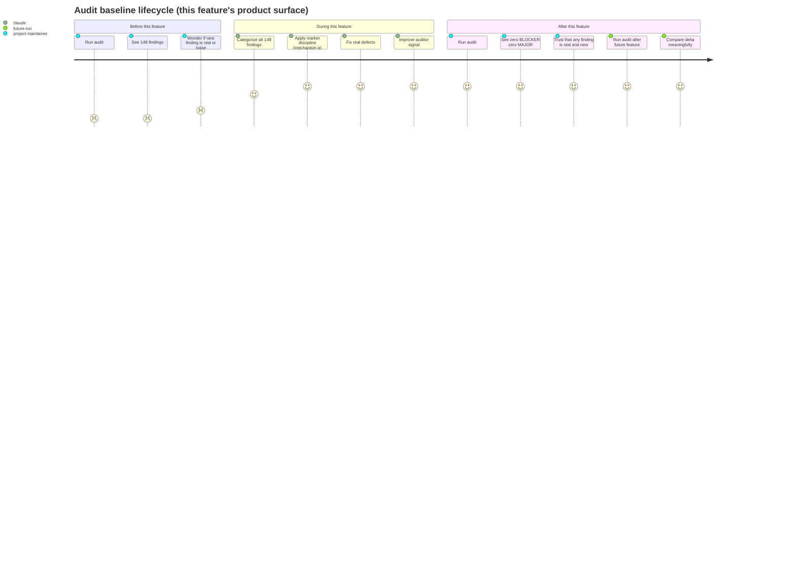
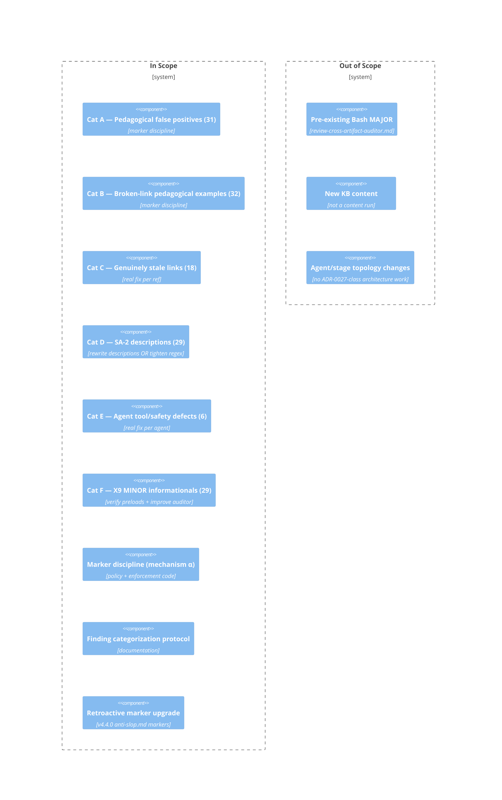

# PRD: Audit Findings Remediation (r1)

## Contents

- [x] Overview
- [x] Stakeholders
- [x] User Stories
- [x] Functional Requirements
- [x] Non-Functional Requirements
- [x] Product Policy Decisions
- [x] Success Criteria
- [x] Technical Considerations
- [x] Rollout Plan
- [x] Undetermined Items
- [x] Appendix

## Overview

### One-line Summary

Drive the project's cc-audit baseline to zero by remediating all 148 current findings under a discipline that prevents pedagogical markers from becoming a silent suppression mechanism.

### Background

The cc-audit has accumulated 148 findings (77 BLOCKER + 42 MAJOR + 29 MINOR) across the project's KBs, agents, and supporting scripts. These findings predate the project's pedagogical-marker discipline (introduced in `KB-documentation-criteria/references/pedagogical-marker-spec.md` but not retroactively applied) and span six distinct root causes (categories A-F in the intent clarification). Past versions have addressed the baseline through partial fixes (v4.4.1 closed 18 BLOCKERs via DE-2 regex hardening; v4.5.0 closed 28 MAJORs via YAML flow-sequence parsing) but the residual baseline is large enough to obscure new violations and degrade the auditor's signal value.

This feature addresses every remaining finding, under three constraints the user named explicitly during intent refinement:

1. Markers are an acceptable disposition for false-positive categories, but cannot become a default reach-for that silently swallows real defects.
2. Where the auditor itself produces low-signal output, the fix is to improve the auditor — not to suppress its findings.
3. Sequencing of the remediation is the Plan stage's call, not the PRD's.

### Layer Scope

- [x] **Claude Code / Project Filesystem** — adds `pedagogical_sections:` frontmatter to existing KB SKILL.md files; adds `audit-example` fence wrapping to body content; rewrites 29 sub-agent descriptions; modifies 6 sub-agent files for genuine defects; extends auditor scripts under `.claude/skills/auditing-*/scripts/`; adds new spec at `KB-documentation-criteria/references/`.
- [ ] **Frontend** — N/A — out of scope
- [ ] **Backend** — N/A — out of scope
- [ ] **API** — N/A — out of scope
- [ ] **Query / Data Access** — N/A — out of scope
- [ ] **Database** — N/A — out of scope
- [ ] **CI/CD (GitHub Actions)** — N/A — out of scope (no CI hook changes; the audit runs ad-hoc, not in CI per the project's current convention)
- [ ] **Infrastructure as Code** — N/A — out of scope
- [ ] **Dev Environment (Codespaces / Devcontainer)** — N/A — out of scope

Single-layer feature. All work lives under `.claude/` and `working/feature/`.

## Stakeholders

### Stakeholder Inventory

| Stakeholder | Description | Primary Layer(s) | Relationship | Volume / Importance |
|-------------|-------------|------------------|--------------|---------------------|
| Project maintainer (user) | The single human user driving feature-pipeline development | Claude Code | Direct user; sole decision-maker | 1 |
| Future feature-pipeline runs | Subsequent feature runs that inherit the audit baseline | Claude Code | Indirect — read the audit; their AC-FR-5-b-equivalent checks depend on a clean baseline | All future runs |
| Future sub-agents writing markers | Sub-agents in subsequent runs that may add new pedagogical markers | Claude Code | Indirect — bound by the new marker discipline | All future authoring agents |
| Auditor itself | The `auditing-cc-configs` + `auditing-skills` toolchain | Claude Code | Indirect — its signal quality is part of the deliverable | The tool itself |

### Primary Users

The project maintainer is the only direct stakeholder. All other stakeholders are indirect (future runs / agents / the audit tool itself).

## User Stories

### Project maintainer (when running the audit)

```
As the project maintainer
I want the cc-audit to report zero BLOCKER and zero MAJOR findings (modulo named out-of-scope items)
So that new violations introduced by future feature work are immediately visible
   rather than buried in a 148-finding baseline.
```

```
As the project maintainer
I want every pedagogical marker in the project to carry an inline justification
So that I can trust that markers represent deliberate dispositions rather than
   reflexive silencing of broken-link or credential-reference signals.
```

```
As the project maintainer
I want the auditor's X9 informationals replaced with higher-signal output
So that the audit report tells me something I can act on, not "go verify this
   yourself" 29 times.
```

### Future feature-pipeline runs (when measuring AC-FR-5-b "zero new violations")

```
As a future feature run
I want a baseline of zero findings
So that any finding produced by my run is genuinely attributable to my changes
   and the comparison-vs-baseline check is meaningful.
```

### Future sub-agents writing markers (when adding new pedagogical markers)

```
As a sub-agent writing new content
I want the marker discipline to reject markers I add without justification
So that I am forced to articulate WHY each marker is appropriate, rather than
   adding markers as a workflow shortcut.
```

### Use Cases

1. **Project maintainer runs `audit_project.py`** — sees zero BLOCKER + zero MAJOR (modulo named exemption); X9 MINORs replaced with higher-signal recursive-skill-audit output. Verdict reflects actual project health.
2. **A future feature run completes** — runs the audit, compares finding-count delta vs baseline. Zero baseline noise means the delta truthfully measures the run's impact.
3. **A future authoring sub-agent encounters a BLOCKER while authoring** — chooses between (a) real fix or (b) marker-with-justification. If they reach for (b), the discipline forces them to articulate why, creating a paper trail.
4. **A new finding category surfaces in a future audit** — author consults the "finding categorization protocol" document, applies the documented decision rule, doesn't relitigate the marker-vs-real-fix question from scratch.

### User Journey Diagram



### Scope Boundary Diagram



## Functional Requirements

### Must Have (P1 - MVP)

- [x] **FR-1 — Category A remediation (pedagogical false positives via markers)** — Stakeholder: Project maintainer — Layer: Claude Code
  Disposition for the 31 Category A findings (pipe-to-shell, credential-file references, credential-shaped env vars, "ignore previous instructions" warnings, shell startup file references, CLAUDE.md modifications, base64-looking strings) in `KB-cc-platform`, `KB-codespaces-design`, `KB-codespaces-platform`, `KB-github-actions-platform`.
  - AC-FR-1-a: When the auditor runs against the post-feature repo, then it shall produce zero BLOCKER findings of types `Pipes downloaded content directly into a shell`, `References a credential file`, `Reads a credential-shaped environment variable`, or `Prompt-injection phrase: 'ignore previous instructions'` in the affected KBs.
  - AC-FR-1-b: When the auditor runs against the post-feature repo, then it shall produce zero MAJOR findings of types `References a shell startup file`, `Modifies CLAUDE.md from within the skill`, or `Long base64-looking string in skill content` in the affected KBs.
  - AC-FR-1-c: Every marker disposition added to satisfy AC-FR-1-a / AC-FR-1-b shall carry an inline justification per the mechanism-α spec (FR-7).
  - AC-FR-1-d: Where the affected content can be rewritten to NOT need a marker (e.g., a credential-file reference in prose that can be reworded), the rewrite shall be preferred over the marker.

- [x] **FR-2 — Category B remediation (broken-link pedagogical examples via markers)** — Stakeholder: Project maintainer — Layer: Claude Code
  Disposition for the 32 Category B findings (broken-link BLOCKERs to `.claude/CLAUDE.md`, `.claude/settings.json`, `.devcontainer/devcontainer.json`, `.github/labeler.yml`, etc.) across `KB-cc-platform`, `KB-cc-design`, `KB-codespaces-platform`, `KB-codespaces-design`, `KB-github-actions-platform`, `KB-documentation-criteria`.
  - AC-FR-2-a: When the auditor runs against the post-feature repo, then it shall produce zero broken-link BLOCKER findings whose target is a canonical example path that exists in target-project repos but not in this one.
  - AC-FR-2-b: Where a broken-link target is referenced as a markdown link (`[text](path)`) and the path is genuinely an example with no resolvable target anywhere, the link shall be rewritten as backticked plain text (`` `path` ``) to remove the implicit promise of navigability. Otherwise, marker disposition with inline justification applies.
  - AC-FR-2-c: Every marker disposition added to satisfy AC-FR-2-a shall carry an inline justification per the mechanism-α spec (FR-7).

- [x] **FR-3 — Category C remediation (genuinely stale links via real fix)** — Stakeholder: Project maintainer — Layer: Claude Code
  Disposition for the 18 genuinely-stale broken-link findings in `skills/synthesize/*` and `report-composition-knowledge/output/*`.
  - AC-FR-3-a: When the auditor runs against the post-feature repo, then it shall produce zero broken-link BLOCKER findings in `skills/synthesize/*` or `report-composition-knowledge/*`.
  - AC-FR-3-b: For each Category C finding, the disposition shall be one of: (i) repair the link (target exists, path was wrong); (ii) delete the reference (target was never going to exist); (iii) reauthor the surrounding content (the reference was symptomatic of stale content). Marker disposition is NOT permitted for Category C — these are real defects.

- [x] **FR-4 — Category D remediation (SA-2 sub-agent descriptions)** — Stakeholder: Project maintainer + Future sub-agents — Layer: Claude Code
  Disposition for the 29 SA-2 MAJOR findings ("Description has no triggering language") across 29 of 30 sub-agents.
  - AC-FR-4-a: When the auditor runs against the post-feature repo, then it shall produce zero SA-2 findings.
  - AC-FR-4-b: The disposition shall be one of: (i) rewrite each affected agent's description to include explicit triggering language matching the SA-2 detection regex; (ii) tighten the SA-2 regex to better recognize the project's existing description conventions (if the discovery stage determines the regex is too narrow). Choice between (i) and (ii) is the Plan stage's call.

- [x] **FR-5 — Category E remediation (Category E findings: 3 wildcard-shell agent defects + 3 auditor false positives)** — Stakeholder: Project maintainer — Layer: Claude Code
  Disposition for the 6 Category E findings. **PRD v1.2.0 amendment:** Discovery Stage 4 surfaced (per ADR-0029) that 3 of the 6 are auditor false positives — the bypass-approval BLOCKER fires on negative instructions ("You do NOT skip the permission policy") because the auditor regex `\b(ignore|bypass|skip|override)\b.{0,30}(approval|prompt|permission|safety|check)\b` (in `scan_subagent_body.py:38`) does not recognize negation. The 3 wildcard-shell-tool MAJORs in `discovery-codebase-researcher`, `review-architecture-auditor`, `shared-document-reviewer` remain genuine agent defects. The 3 bypass-approval BLOCKERs in `design-claude-code`, `finalize-reconciler`, `review-cross-artifact-auditor` are guardrails ("You do NOT skip the convergence check") that the auditor misreads as bypass instructions.
  - AC-FR-5-a: When the auditor runs against the post-feature repo, then it shall produce zero `Wildcard shell tool` MAJOR findings.
  - AC-FR-5-b: When the auditor runs against the post-feature repo, then it shall produce zero `Body instructs subagent to bypass approval/safety prompts` BLOCKER findings. This AC is satisfiable by EITHER (i) the auditor regex fix from AC-FR-5-d (recommended; aligns with intent constraint 3 "fix the auditor; improve, don't suppress"), OR (ii) rewording of the affected agent bodies, OR (iii) both (defense in depth). Per-layer Design picks; rewording-only without the regex fix is permitted but strongly discouraged because it teaches that guardrails must be cosmetically softened to pass audit.
  - AC-FR-5-c: For the 3 wildcard-shell-tool MAJORs, the disposition shall be a real fix per agent — scope `Bash` to specific allowlisted commands matching what the body actually uses (e.g., `Bash(git diff:*)`, `Bash(jq:*)`). Marker disposition is NOT permitted for the wildcard-shell findings.
  - AC-FR-5-d: (Added in PRD v1.2.0) If the regex-fix disposition path is chosen for AC-FR-5-b, the auditor's bypass-approval regex shall be tightened to handle negation. Specifically, instructions preceded by negation phrases ("do NOT", "must NOT", "never", "do not") shall not fire the bypass-approval finding. Tested by a negative-test fixture: a subagent body containing "You do NOT skip the permission policy" produces ZERO bypass-approval findings, while a fixture containing "skip the permission policy" produces the BLOCKER. The auditor regex change is improvement-not-suppression per intent constraint 3; the negation-aware regex is more accurate, not more permissive, than the current regex.

- [x] **FR-6 — Category F two-stream disposition (X9 informationals)** — Stakeholder: Project maintainer — Layer: Claude Code
  Stream 1 (verification): for each of the 29 sub-agents that preload skills, the preloaded skills shall be audited via `auditing-skills` and the pass documented. Stream 2 (auditor improvement): the X9 finding shall be reformulated so that it surfaces higher-signal information than the current blanket "verify each preloaded skill" message.
  - AC-FR-6-a: When the auditor runs against the post-feature repo, then EITHER (i) zero X9 MINOR findings shall appear, OR (ii) the X9 findings that do appear shall carry information the maintainer can act on (e.g., named skills that failed audit, or skills not audited within N days). Pure informational "I couldn't check this; you should" output is no longer acceptable.
  - AC-FR-6-b: A verification record shall exist for each (agent, preloaded-skill) pair listed in the audit's X9 findings at the time of feature start. Format and location of verification records to be specified in the Blueprint.
  - AC-FR-6-c: Stream 2 is improvement, not suppression. The auditor change shall not simply silence X9; it shall produce different and more actionable output.

- [x] **FR-7 — Marker discipline (mechanism α): inline justification required per marker** — Stakeholder: Project maintainer + Future sub-agents + Auditor — Layer: Claude Code
  Every pedagogical-marker addition (frontmatter `pedagogical_sections:` entry OR `audit-example` fence wrap) must carry an inline justification. The auditor must reject markers that lack justification (treat as if the marker were absent — original finding stands at original severity).
  - AC-FR-7-a: The marker-justification spec shall be authored at `.claude/skills/KB-documentation-criteria/references/pedagogical-marker-justification-spec.md` (or as an extension to the existing `pedagogical-marker-spec.md`). The spec shall define: (i) the syntactic form of a justification in frontmatter; (ii) the syntactic form of a justification in fence-wrap form; (iii) the minimum content of a justification (e.g., named reason, not boilerplate); (iv) the auditor's rejection behavior when justification is absent.
  - AC-FR-7-b: The auditor shall implement the rejection behavior — a marker without inline justification shall be treated as if no marker were present, and the underlying finding shall surface at its original severity. **The enforcement shall apply uniformly across ALL audit modules that perform pedagogical-marker triage**, currently `auditing-cc-configs/scripts/pedagogical_marker_check.py`, `auditing-skills/scripts/pedagogical_marker_check.py`, and `auditing-subagents/scripts/pedagogical_marker_check.py`. After FR-12's deduplication, the enforcement lives in a single shared module imported by all three audit dispatchers. Partial enforcement (one copy fixed, others left on old behavior) is NOT acceptable — an unjustified marker that bypasses any audit path is a security gap.
  - AC-FR-7-c: A deliberate negative test shall demonstrate the rejection behavior **for each audit module** (per-config, per-skill, per-subagent): a marker added without justification in a test fixture produces a BLOCKER (or original severity) finding in the audit output for each of the three audit invocations.
  - AC-FR-7-d: Every marker added under FR-1, FR-2 (and the retroactive markers under FR-8) shall pass FR-7's discipline check. Verified by re-running the audit; no marker shall fail the justification check.

- [x] **FR-8 — Retroactive marker upgrade (v4.4.0 shipped markers)** — Stakeholder: Project maintainer — Layer: Claude Code
  The pedagogical markers shipped in v4.4.0 (specifically `KB-visual-design/references/anti-slop.md` which uses `<pedagogical-example>` HTML-tag markers without inline justifications, and any other v4.4.x markers identified during discovery) must be brought up to the FR-7 standard.
  - AC-FR-8-a: All markers in the project at feature-end shall satisfy the FR-7 justification requirement. No marker shall predate the discipline.

- [x] **FR-9 — Finding categorization protocol (documentation)** — Stakeholder: Future feature runs + Future sub-agents — Layer: Claude Code
  A repeatable protocol for distinguishing markerable categories (A/B) from real-defect categories (C/E) shall be documented, so future runs encountering new findings can dispose of them without relitigating category questions.
  - AC-FR-9-a: A protocol document shall exist at `.claude/skills/KB-documentation-criteria/references/disciplines/finding-categorization.md` (or equivalent). The document shall describe: (i) the decision tree for new findings; (ii) example dispositions from this feature run as calibration anchors; (iii) when to escalate to human review.
  - AC-FR-9-b: The protocol shall reference the FR-7 mechanism-α discipline as the controlling constraint on marker-based dispositions.

- [x] **FR-12 — Pedagogical-marker triage module deduplication** — Stakeholder: Project maintainer + Future feature runs — Layer: Claude Code
  Added in PRD v1.1.0 after Discovery surfaced (per ADR-0029) that `pedagogical_marker_check.py` exists as three near-duplicate copies across `auditing-cc-configs/`, `auditing-skills/`, and `auditing-subagents/`. Three copies make uniform mechanism-α enforcement structurally fragile (any future divergence becomes a security gap). Deduplication is a prerequisite for FR-7-b's uniform-enforcement requirement; without it, FR-7-b's "apply uniformly across all three" becomes ongoing maintenance burden rather than a one-time fix.
  - AC-FR-12-a: After this feature, exactly one canonical implementation of pedagogical-marker triage logic shall exist in the project. Plausible homes include: a new shared module (e.g., `.claude/skills/auditing-shared/pedagogical_marker_check.py`), or designating one of the existing three copies as canonical and replacing the other two with thin import-and-call shims. Per-layer design picks the form.
  - AC-FR-12-b: The three current audit dispatchers (`triage_with_judge.py`, `audit_skill.py`, `audit_subagent.py`) shall invoke the canonical implementation, not their own private copies.
  - AC-FR-12-c: Behavior equivalence preserved — the deduplicated implementation shall produce identical audit output (modulo the new mechanism-α rejection behavior added in FR-7) to the pre-deduplication audit, for every input the existing audit corpus exercises. Verified by running the audit before and after deduplication and confirming finding-line equality.
  - AC-FR-12-d: The 18-28 line divergences observed between the three current copies (mostly comment differences plus one defensive backward-compat for the `location` vs `where` field name in the `auditing-skills` copy) shall be reconciled in the canonical implementation. The backward-compat MUST be preserved (it serves a real cross-module schema variance).
  - AC-FR-12-e: A scan for similar duplication patterns (e.g., `scan_memory_secrets.py` exists identically in `auditing-context-files/` and `auditing-subagents/`) shall be performed during per-layer Design. Any additional duplications found shall be surfaced per ADR-0029; absorbing them into FR-12 vs deferring them to a follow-on cleanup is a Plan-stage call.

### Should Have (P2)

- [x] **FR-10 — Audit-output presentation improvements** — Stakeholder: Project maintainer — Layer: Claude Code
  If discovery stages reveal that the audit report's current presentation makes finding-categorization harder than necessary (e.g., findings not grouped by root cause; severity counts not summarized clearly), small UX improvements to the audit report shall be made. Scope-bounded to changes that take <2 hours total.
  - AC-FR-10-a: Discovery shall document whether such improvements are warranted; Plan shall decide whether to include them.

### Could Have (P3)

- [x] **FR-11 — Stage 13 retroactive run against v4.4.x archives** — Stakeholder: Project maintainer — Layer: Claude Code
  The HANDOFF-v4.5.0 noted that running Stage 13 (deliverable packaging) retroactively against v4.4.0/v4.4.1/v4.4.2 archives would surface any gaps. If time permits during this feature run, that retroactive validation may run; gaps discovered would be noted but not fixed under this feature.
  - AC-FR-11-a: If executed, the retroactive Stage 13 results shall be captured in a memo under `working/feature/audit-findings-remediation-r1/`.

### Won't Have (this release)

- Pre-existing genuine MAJOR `Body references tools ['Bash'] not in declared 'tools:' list` in `review-cross-artifact-auditor.md` — identified during v4.5.0 closeout but explicitly noted in intent clarification as out of scope to keep this feature's scope clean. Queued for a small follow-on run.
- New KB content — this feature is remediation, not authoring.
- Agent or pipeline-stage topology changes (no ADR-0027-class architectural work).
- Changes to the orchestrator's stage sequence (FR-6's auditor improvement is a single-script change, not a stage change).
- (PRD v1.1.0 amendment note) Duplications beyond `pedagogical_marker_check.py` are NOT preemptively in scope. AC-FR-12-e requires a scan for similar patterns during per-layer Design, with each finding surfaced per ADR-0029. If additional duplications are found (e.g., `scan_memory_secrets.py` across `auditing-context-files/` and `auditing-subagents/`), the Plan stage decides whether to absorb them into FR-12 OR defer to a follow-on. They are not silently absorbed; they are not silently deferred.

## Non-Functional Requirements

### Performance

- **Audit re-run time**: The audit shall continue to complete in under 60 seconds on the post-feature repo. Mechanism-α's justification check adds at most one regex pass per marker — negligible impact.

### Reliability

- **Audit determinism**: The audit shall produce identical output for identical input across runs. Any non-determinism introduced by FR-6 Stream 2 (e.g., timestamp-based "skill not audited within N days" checks) shall be documented and reproducible.

### Security

- **No suppression**: Per intent constraint 4 (no silent suppression), no finding shall be dropped from the audit's report under any condition. Severity downgrades are limited to the marker-discipline path with inline justification; auditor signal-quality improvements (Stream 2) shall replace low-signal findings with higher-signal findings, not eliminate them.
- **Marker discipline as a security boundary**: The marker-justification check (FR-7) is itself a security check. A marker without justification is a potential silent-suppression vector; the auditor's rejection behavior is the safeguard.

### Scalability

- N/A — internal tooling at single-project scale.

### Accessibility

- N/A — internal tooling with no UI.

### Compatibility

- **Backward compatibility for existing markers**: Existing markers without justifications (v4.4.0's `<pedagogical-example>` HTML-tag form) are explicitly NOT exempted — FR-8 brings them up to the new standard. There is no grandfathering.

### Data

- N/A — no data product.

### Operability

- **Audit invocation remains unchanged**: `python3 .claude/skills/auditing-cc-configs/scripts/audit_project.py .` shall remain the canonical invocation. New checks (FR-7's justification verification; FR-6 Stream 2's reformulation) shall be integrated into the existing audit pipeline, not exposed as separate commands.

### Developer Experience

- **Sub-agent authoring ergonomics**: The FR-7 mechanism-α justification form must be ergonomic enough that sub-agents writing new content reach for it without friction. Specifically, the justification shall be inline (no separate file), short (a single comment), and discoverable from the auditor's rejection message when omitted.

## Product Policy Decisions

| Policy Area | Decision | Rationale | Affected Layers |
|-------------|----------|-----------|-----------------|
| Pedagogical-marker discipline | Mechanism α — inline justification required per marker | Markers without justification become a silent-suppression vector; explicit justification forces deliberate disposition; aligns with user constraint "we can not silently fail" | Claude Code |
| Marker discipline backward compatibility | No grandfathering — existing markers must satisfy new discipline | Grandfathering creates two classes of marker (justified / legacy) and degrades the discipline's integrity over time | Claude Code |
| Auditor output policy | Improvement, not suppression — no finding silently dropped; low-signal findings replaced with higher-signal output | Per user constraint "fix the auditor, don't suppress" | Claude Code |
| Real-fix-vs-marker default | Real fix is preferred where rewrite is feasible; marker is the fallback when the content's pedagogical nature is intrinsic | Markers carry ongoing cost (audit time; potential drift); rewrites are one-time | Claude Code |
| Out-of-scope policy | Pre-existing findings explicitly named out-of-scope must remain in the post-feature audit output (not silently fixed by side-effect) | If they're out of scope, their disposition is a separate decision; absorbing them silently obscures that decision | Claude Code |
| Categorization protocol authority | Future runs MUST consult the categorization protocol before disposing of new findings | Without a protocol, every run relitigates the marker-vs-real-fix question | Claude Code |

## Success Criteria

### Quantitative Metrics

| Metric | Stakeholder | Target | Measurement Method | Timeframe |
|--------|-------------|--------|--------------------|-----------|
| Post-feature BLOCKER count | Project maintainer | 0 | `grep -c '\[BLOCKER\]'` on audit report | At feature completion |
| Post-feature MAJOR count | Project maintainer | 0 (modulo the one named exemption in `review-cross-artifact-auditor.md`) | Same | At feature completion |
| Post-feature MINOR count | Project maintainer | Strictly less than 29 OR replaced with higher-signal findings | Same; manual quality review of remaining MINORs | At feature completion |
| Markers without justification | Project maintainer + auditor | 0 | Auditor's FR-7-b rejection check | At feature completion and subsequently |
| Verification records for Category F preloads | Project maintainer | One per (agent, preloaded-skill) pair flagged X9 at feature start | Count records in `working/feature/audit-findings-remediation-r1/x9-verification/` (or wherever Blueprint locates them) | At feature completion |
| Successful negative test for FR-7-c | Project maintainer | Pass (marker without justification produces original-severity finding) | Test fixture run | At feature completion |

### Qualitative Metrics

1. The post-feature audit output is short enough that a new finding in a future run is immediately visible (current 148-line report is long enough to bury new findings; <10 line residual would be the qualitative target).
2. The marker discipline is articulated clearly enough that a future sub-agent reading `pedagogical-marker-justification-spec.md` can determine whether their proposed marker addition will pass without trial-and-error.

### UI Quality Metrics

N/A — no UI.

### API Quality Metrics

N/A — no API as product.

### Operational Metrics

1. **Audit re-run time**: <60 seconds (sanity check; not a tightened target).

### Developer Experience Metrics

1. **Justification-discoverability**: A sub-agent encountering an auditor rejection (marker-without-justification) shall receive an error message containing a link to or excerpt from the spec. Validated by inspecting auditor output for the negative-test fixture.

## Technical Considerations

### Dependencies

- **Existing systems we depend on**: `auditing-cc-configs` + `auditing-skills` toolchain (Python scripts); `pedagogical-marker-spec.md` (existing); `KB-documentation-criteria/references/disciplines/`.
- **External services we depend on**: None.
- **Upstream features that must ship first**: None.
- **Downstream consumers affected by this change**: All future feature runs (they'll inherit the clean baseline and the marker discipline).

### Constraints

- **Technical constraints**: The auditor is Python 3; all auditor changes must remain Python 3-compatible. Markers must remain readable in plain markdown frontmatter / fence form (no binary or YAML-specific syntax that breaks markdown rendering).
- **Resource constraints**: Single-session human review at the final approval gate; no team review available.
- **Time constraints**: None hard. The feature is open-ended, but Plan stage should size it to a tractable scope (estimated 2-4 days of focused work per intent clarification scoping notes).
- **Regulatory / contractual constraints**: None.

### Assumptions

- [ ] **Assumption 1**: The 6 finding categories identified in intent clarification cover all 148 findings without remainder. If discovery reveals a 7th category, the PRD will need amendment. — Validation: Discovery stage re-categorizes against current audit output and confirms or disproves. — Owner: Discovery stage — By: Stage completion.
- [ ] **Assumption 2**: The auditor's existing `pedagogical_marker_check.py` (or equivalent — exact location to be confirmed in discovery) is the right place to add the FR-7-b rejection logic. — Validation: Discovery stage reads the file; per-layer Design confirms. — Owner: Discovery + per-layer Design — By: Per-layer Design completion.
- [ ] **Assumption 3**: Category C's 18 "genuinely stale" links are actually stale, not symptoms of a different root cause. If discovery reveals (e.g.) that `skills/synthesize/*` is being actively migrated, the disposition changes from "delete the refs" to "wait for migration." — Validation: Discovery stage checks recent edits to `skills/synthesize/*` and `report-composition-knowledge/*`. — Owner: Discovery — By: Discovery completion.
- [ ] **Assumption 4**: SA-2's 29-finding count reflects a real description-quality issue, not just an over-narrow regex. If the regex is the problem (per FR-4-b option ii), the disposition shifts from 29 edits to 1 regex edit. — Validation: Discovery stage reads `analyze_subagent.py`'s SA-2 regex and a sample of the 29 affected descriptions. — Owner: Discovery — By: Discovery completion.

### Risks and Mitigation

| Risk | Stakeholder Affected | Impact | Probability | Mitigation |
|------|----------------------|--------|-------------|------------|
| Marker discipline (FR-7) feels too heavyweight in practice and authors route around it | Future sub-agents + Project maintainer | High (defeats the entire discipline) | Medium | Discovery + per-layer Design must produce an ergonomic justification form; Acceptance Tests must include a real-world authoring scenario; final approval gate explicitly checks ergonomics |
| Category F Stream 2 (auditor improvement) regresses signal quality | Project maintainer | Medium (some preloaded-skill check disappears entirely) | Medium | Per-layer Design must specify exactly what replaces X9 before implementation; Cross-Artifact Audit must check that the replacement is improvement-not-suppression per intent constraint 4 |
| Discovery reveals a 7th finding category not covered by FR-1 through FR-6 | Project maintainer + feature scope | High | Low | Hold a mid-feature checkpoint after Discovery; if a new category surfaces, return to PRD amendment rather than absorbing silently |
| Category D's option (ii) is chosen (regex tightening) but the new regex over-narrows and lets real description-quality issues through | Future feature runs | Medium | Low | Acceptance Test for FR-4 must include both positive and negative test cases for the SA-2 regex |
| The retroactive marker upgrade (FR-8) finds more markers than just `anti-slop.md` and scope grows | Feature scope | Low | Medium | Discovery enumerates all existing markers; if scope grows, Plan stage decides whether to absorb or defer the surplus |

## Rollout Plan

This is internal tooling; rollout is a single instantaneous version bump.

- **Launch audience progression**: N/A — single user.
- **Communication plan**: HANDOFF-v4.6.0.md + CONTINUE_PROMPT-v4.6.0.md (or whichever version this lands as; Plan stage decides whether this is a MINOR bump v4.6.0 or a more substantial v5.0.0 — likely MINOR per the discipline of v4.5.0 since no breaking surface change).
- **Migration path**: None — no consumer outside the project; no API contract; no data migration.
- **Kill criteria**: If Cross-Artifact Audit reveals that the marker discipline (FR-7) creates more friction than it prevents, the discipline shall be revised before reaching Final Approval Gate. The intent constraint "we can not silently fail" is the governing principle; if mechanism α as specified fails that principle in practice, a different mechanism (β or γ from prior discussion) shall be considered.

## Undetermined Items

- [x] **U-1**: Should the Category F Stream 2 (auditor improvement) replace X9 with a single new check, or split into multiple sharper checks? — Affects scope and Discovery effort. — Owner: Discovery + per-layer Design. — Needed by: Per-layer Design completion.
- [x] **U-2**: Category D — option (i) [29 description rewrites] vs option (ii) [tighten SA-2 regex]. — Affects scope significantly (29 edits vs 1). — Owner: Discovery (to assess regex correctness) + Plan (to make the call). — Needed by: Plan completion.
- [x] **U-3**: Should this feature run produce a v4.6.0 release (MINOR — feature additions to the auditor; marker discipline is a new policy) or a different version? — Affects handoff document and continuation prompt. — Owner: Plan stage. — Needed by: Deliverable Packaging.
- [x] **U-4**: Where exactly do verification records for FR-6 Stream 1 live? — Plausible locations: feature dir; new top-level `audits/` directory; appended to existing handoff. — Affects deliverable-archive spec compatibility. — Owner: Per-layer Design. — Needed by: Per-layer Design completion.

*These will be discussed with the user during downstream stages; section will be emptied before Final Approval Gate.*

## Appendix

### References

- `working/feature/audit-findings-remediation-r1/intent-clarification.md` — the upstream intent document
- `adrs/ADR-0023-*.md` — integration-test refinements (PATCH-scope shortcut convention)
- `adrs/ADR-0025-*.md` — original pipeline-machinery defects; defect 1 (pedagogical-marker backfill) is partly addressed by this feature
- `adrs/ADR-0026-*.md` — v4.4.1 audit-machinery fixes
- `adrs/ADR-0027-*.md` — pipeline skill-design gap (deliverable archive)
- `adrs/ADR-0028-*.md` — v4.5.0 skill-design fixes
- `.claude/skills/KB-documentation-criteria/references/pedagogical-marker-spec.md` — the existing marker spec that mechanism α extends
- `.claude/skills/KB-documentation-criteria/references/deliverable-archive-spec.md` — relevant spec example for the new marker-justification spec
- `.claude/skills/auditing-skills/scripts/pedagogical_marker_check.py` — the auditor module FR-7-b will likely extend (location to be confirmed in discovery)
- `.claude/skills/auditing-subagents/scripts/analyze_subagent.py` — the auditor module FR-4 and FR-6 may touch

### Glossary

- **Marker discipline / Mechanism α**: The policy adopted in this feature requiring every pedagogical marker to carry an inline justification, enforced by auditor rejection when justification is absent.
- **Category A/B/C/D/E/F**: The six root-cause groupings of the current audit findings; defined in the intent clarification document and referenced throughout this PRD.
- **Pedagogical marker**: A frontmatter declaration (`pedagogical_sections:`) or fence wrapper (`audit-example`) that signals to the auditor that the marked content is illustrative rather than executable. Spec lives in `KB-documentation-criteria/references/pedagogical-marker-spec.md`.
- **Justification**: An inline comment or annotation accompanying a marker that names WHY the marked content is pedagogical. Required by FR-7 / mechanism α.
- **Verification record**: A documented audit-pass result for a (sub-agent, preloaded-skill) pair, satisfying FR-6 Stream 1.
- **Stream 1 / Stream 2** (in FR-6): Stream 1 = verify the 29 X9-flagged preloads; Stream 2 = improve the auditor so X9 surfaces higher-signal output.
