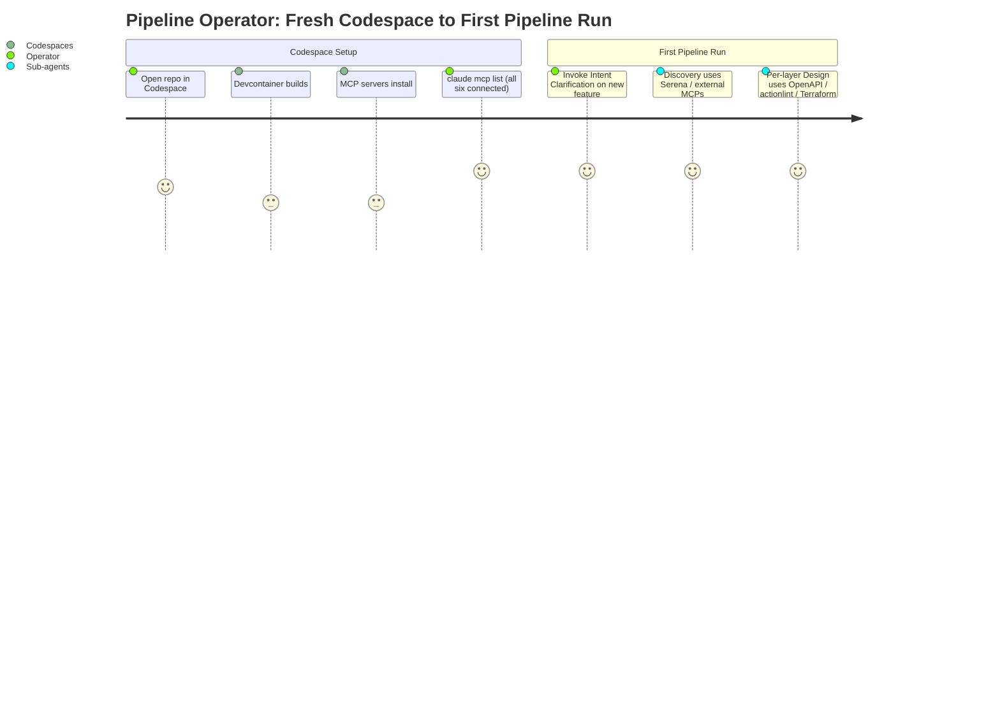
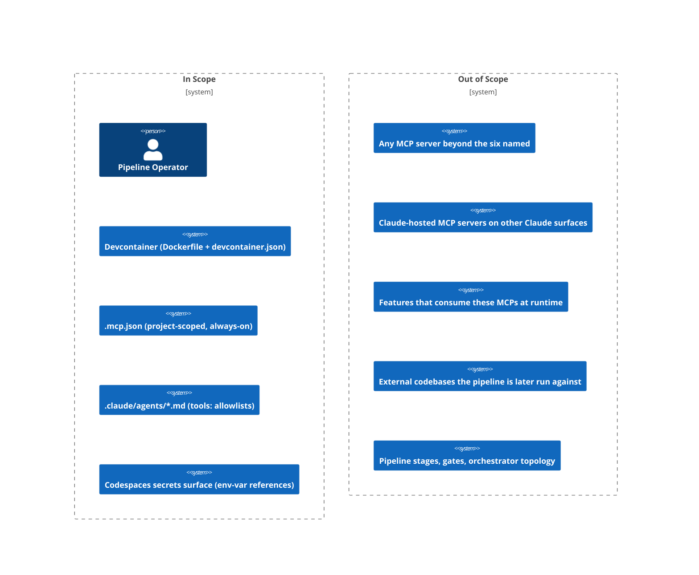

# PRD: Devcontainer MCP Server Provisioning

## Contents

Section completion checklist — each box must be checked (including `N/A — out of scope` rows) before this document leaves draft. The reviewer's Gate 0 check uses this list as the structural-presence anchor.

- [x] Overview
- [x] Stakeholders
- [x] User Stories
- [x] Functional Requirements
- [x] Non-Functional Requirements
- [x] Product Policy Decisions
- [x] Success Criteria
- [x] Technical Considerations
- [x] Rollout Plan
- [x] Undetermined Items
- [x] Appendix

## Overview

### One-line Summary

Provision six named MCP servers (Serena, mcp-openapi-schema, actionlint-mcp, HashiCorp Terraform MCP, Context7, Exa) into this project's devcontainer so they are installed, registered always-on via a project-scoped `.mcp.json`, wired into the relevant sub-agents' `tools:` allowlists, and verified working at acceptance time.

### Background

The feature-pipeline depends on a set of MCP capabilities — codebase traversal, OpenAPI schema reading, GitHub Actions linting, Terraform reasoning, library documentation lookup, and web research — that today are not provisioned into the devcontainer in any reproducible way. A freshly built Codespace cannot run discovery- or design-stage sub-agents end-to-end without manually installing and registering these servers. The Intent Clarification (see `intent-clarification.md`) confirmed (Q1–Q5) that this feature runs as a FULL 13-stage pipeline pass and that "ready to be used" includes wiring the new MCP tools into consuming sub-agents' `tools:` allowlists, not just registering them. Credentials are supplied via Codespaces secrets; the required keys are already available, so every server must be verified working at acceptance — not merely declared.

The PRD names *what* the provisioning must guarantee and *whose* experience it serves. It does not pre-decide installation mechanism, transport per server, version pinning, or specific tool-to-agent mappings — those are design questions, surfaced in Undetermined Items with forward pointers.

### Layer Scope

Declare which layers this feature touches. Sections under Design, Security, Test Boundaries, and Verification corresponding to unchecked layers may be marked `N/A — out of scope` without further elaboration.

- [x] **Claude Code / Project Filesystem** — `.mcp.json`, `.claude/agents/*.md` `tools:` allowlists, MCP configuration conventions
- [ ] **Frontend** — UI components, client state, routing, styling
- [ ] **Backend** — services, domain logic, background jobs, schedulers
- [ ] **API** — HTTP/GraphQL/RPC endpoints, contracts, versioning
- [ ] **Query / Data Access** — ORM models, repositories, query layer, caching
- [ ] **Database** — schema, migrations, indexes, constraints, seed data
- [ ] **CI/CD (GitHub Actions)** — workflows, jobs, reusable actions, environments, secrets
- [ ] **Infrastructure as Code** — Terraform/Pulumi/CDK/CloudFormation modules, state, providers
- [x] **Dev Environment (Codespaces / Devcontainer)** — `.devcontainer/Dockerfile` and/or `devcontainer.json`, lifecycle scripts, prebuild contents, Codespaces secrets surface

**Out-of-scope layers (Frontend, Backend, API, Query / Data Access, Database, CI/CD, Infrastructure as Code) rationale:**

- *Frontend / Backend / API / Query / Database:* this project's deliverable is markdown and configuration. There is no user-facing application code, service, endpoint, ORM, or schema for this feature to touch.
- *CI/CD (GitHub Actions):* the Intent Clarification did not request a CI smoke-test workflow; acceptance is gated by `claude mcp list` and per-server probe at devcontainer post-build, not by a GitHub Actions job. CI/CD remains explicitly out of scope. If the user later wants a CI guard, that is a separate feature.
- *Infrastructure as Code:* no cloud infrastructure is provisioned by this feature. The Terraform MCP server reasons about Terraform; it does not create or apply state.

## Stakeholders

### Stakeholder Inventory

Per the carry-forward note from `intent-review-issues.json` (I-DR-004), this section treats consuming sub-agents as a surface-area consideration handled under Technical Considerations, not as a stakeholder. The stakeholders below are real human or human-tooled roles.

| Stakeholder | Description | Primary Layer(s) | Relationship | Volume / Importance |
| --- | --- | --- | --- | --- |
| Pipeline operator / maintainer | The user(s) who run the feature-pipeline against a target codebase and own the pipeline's reliability. | Claude Code, Dev Environment | Primary user | Small team; high importance — they feel every failure |
| Devcontainer / Codespaces user | Anyone who opens this repo in a Codespace or local devcontainer — includes the pipeline operator but also one-off contributors evaluating the pipeline. | Dev Environment | Direct user | Bounded by the project's contributor count; medium importance |
| Sub-agent author (human) | The human who authors or modifies `.claude/agents/*.md` files and is responsible for keeping the `tools:` allowlists correct. | Claude Code | Maintainer of surface area | Single team; high importance — they own the wiring this feature changes |
| Security reviewer | The role responsible for checking that credentials stay out of git, that the `.mcp.json` does not introduce toxic capability combinations, and that no MCP server is wired into an agent that should not have it. | Claude Code, Dev Environment | Reviewer / gate | One person or rotating role; high importance — they hold a veto |

### Primary Users

The **pipeline operator / maintainer** is the primary user for this release. When trade-offs arise between (a) one-time setup complexity and (b) per-run reliability, prefer reliability — the operator runs the pipeline often; they configure the Codespace rarely.

## User Stories

Stories are grouped by stakeholder. Empty groups (other stakeholders not authoring stories in this release) are deliberately omitted.

### Pipeline Operator / Maintainer

#### US-1: Operator can rebuild a Codespace and find all six MCP servers ready

**As a** pipeline operator, **I want** a freshly built Codespace to come up with all six MCP servers installed, registered, and connected **so that** I can invoke any pipeline stage without manually configuring MCP first.

**Acceptance Criteria (EARS):**

- [ ] AC-FR-1-a: When the Codespace finishes its build and lifecycle setup, the system shall have every one of the six named MCP servers (Serena, mcp-openapi-schema, actionlint-mcp, HashiCorp Terraform MCP, Context7, Exa) listed by `claude mcp list` as *connected*.
- [ ] AC-FR-1-b: When the operator runs the agreed per-server probe (one trivial, side-effect-free call defined per server in the Blueprint), the system shall return a successful response from every one of the six servers.
- [ ] AC-FR-1-c: If any of the six servers is missing, not registered, or not responding at probe time, then the system shall surface a clear failure naming the specific server and the layer of failure (install / registration / transport / auth).

#### US-2: Operator's sub-agents already carry the new MCP tools

**As a** pipeline operator, **I want** the sub-agents that should use the new MCP capabilities to already have those tools in their `tools:` allowlists **so that** I do not have to hand-edit agent files to make discovery and design stages work.

**Acceptance Criteria (EARS):**

- [ ] AC-FR-2-a: When the operator inspects each affected `.claude/agents/*.md` after this feature ships, the system shall show the appropriate MCP tool entries present in the `tools:` allowlist for every agent identified by the tool-to-agent mapping (mapping itself is decided at Design — see UI-1 in Undetermined Items).
- [ ] AC-FR-2-b: When the operator runs a stage whose sub-agent was wired to a new MCP capability, the system shall make the corresponding tool callable from inside that sub-agent (i.e., not "permission denied by allowlist").

### Devcontainer / Codespaces User

#### US-3: Rebuild remains deterministic and reasonably fast

**As a** devcontainer user, **I want** the rebuild that provisions these six servers to be deterministic and to stay within a tolerable time budget **so that** my onboarding or rebuild does not become a 20-minute coffee break.

**Acceptance Criteria (EARS):**

- [ ] AC-NFR-1-a: When a Codespace is built from a clean cache, the system shall complete devcontainer build + lifecycle setup (including all MCP install steps) within the Performance target defined in NFR-1 below.
- [ ] AC-NFR-1-b: When the Codespace is rebuilt from a warm cache (no source changes), the system shall reuse cached layers and shall not re-download or re-compile MCP server binaries.

### Sub-agent Author

#### US-4: Tool-to-agent wiring is discoverable and auditable

**As a** sub-agent author, **I want** the mapping of MCP tools to sub-agents to be expressed plainly in the `.claude/agents/*.md` files **so that** I can audit and amend the wiring without spelunking through `.mcp.json` or external docs.

**Acceptance Criteria (EARS):**

- [ ] AC-FR-3-a: The system shall record the active tool-to-agent mapping as the union of (a) the registered tools in `.mcp.json` and (b) the `tools:` allowlist field in each `.claude/agents/*.md` file; both shall be present in the repo and human-readable.
- [ ] AC-FR-3-b: When the sub-agent author adds or removes an MCP tool from an allowlist, the system shall require no other change for the modified allowlist to take effect at the next pipeline run.

### Security Reviewer

#### US-5: Credentials never leak into git; MCP capability combinations are auditable

**As a** security reviewer, **I want** every credential to flow exclusively via Codespaces secrets and **I want** the `.mcp.json` to be auditable for capability combinations **so that** I can sign off without finding tokens in history or unexpected privileged servers wired into unprivileged agents.

**Acceptance Criteria (EARS):**

- [ ] AC-NFR-2-a: The system shall not contain any secret value (e.g., `EXA_API_KEY`, `CONTEXT7_API_KEY`, `TFE_TOKEN`) in any committed file in this repository, including `.mcp.json`, `devcontainer.json`, the Dockerfile, lifecycle scripts, and `.claude/agents/*.md`.
- [ ] AC-NFR-2-b: Where a secret is required by a registered MCP server, the system shall reference it by environment-variable name only; the value shall be sourced at runtime from the Codespaces secrets surface.
- [ ] AC-NFR-2-c: When the `auditing-mcp` skill is run against the resulting `.mcp.json`, the system shall produce no BLOCKER findings. (See NFR-3 and Undetermined Items UI-6 for whether this also gates Gate 6.)

### Use Cases

1. **Fresh Codespace, first run of pipeline.** *Pipeline operator.* Opens repo in Codespace → devcontainer builds → MCP servers come up → operator runs Intent Clarification on a new feature → discovery-codebase-researcher uses Serena → design-api uses mcp-openapi-schema → design-cicd uses actionlint-mcp → design-iac uses HashiCorp Terraform MCP → discovery-external-researcher uses Context7 and Exa.
2. **Rebuild after Dockerfile edit.** *Pipeline operator.* Edits unrelated Dockerfile line → rebuilds container → still finds all six MCP servers connected and authenticated.
3. **Sub-agent author audits wiring.** *Sub-agent author.* Opens `.claude/agents/discovery-codebase-researcher.md` → sees `tools:` allowlist now lists the Serena tools by name → understands which capabilities are reachable from that agent.
4. **Security review of new `.mcp.json`.** *Security reviewer.* Inspects `.mcp.json` → confirms no inline secrets, only env-var references → runs `auditing-mcp` skill → confirms no BLOCKER findings.

### User Journey Diagram

### Scope Boundary Diagram

## Functional Requirements

Each requirement is tagged with the **stakeholder** it serves and the **layer** where its acceptance is observed. All acceptance criteria use EARS form.

### Must Have (P1 — MVP)

- [ ] **FR-1: Six named MCP servers shall be installed and registered always-on in the devcontainer** — Stakeholder: Pipeline operator — Layer: Dev Environment, Claude Code
  - The six servers are: Serena, `hannesj/mcp-openapi-schema`, `hongkongkiwi/actionlint-mcp`, HashiCorp Terraform MCP, Context7, Exa. "Always-on" means project-scoped `.mcp.json` registration loaded every Claude Code session, not user-scoped or layer-conditional.
  - AC-FR-1-a, AC-FR-1-b, AC-FR-1-c (see US-1).

- [ ] **FR-2: Affected sub-agents shall have the new MCP tools in their `tools:` allowlists** — Stakeholder: Pipeline operator, Sub-agent author — Layer: Claude Code
  - "Wiring" is part of acceptance per Q3 in the Intent Clarification — registration alone is insufficient.
  - The specific tool-to-agent mapping is deferred to Design (see UI-1). The PRD requires that whatever mapping the Blueprint decides is actually written into the agent files.
  - AC-FR-2-a, AC-FR-2-b (see US-2).

- [ ] **FR-3: The active tool-to-agent wiring shall be expressed in human-readable files in the repo** — Stakeholder: Sub-agent author — Layer: Claude Code
  - No "magic" wiring at runtime that is not visible by reading `.mcp.json` plus the agent files.
  - AC-FR-3-a, AC-FR-3-b (see US-4).

- [ ] **FR-4: Each registered MCP server shall be verifiable by a per-server probe at acceptance time** — Stakeholder: Pipeline operator, Security reviewer — Layer: Dev Environment, Claude Code
  - Per Q5 keys are available, so verification is not "registration succeeded" but "server responded to a real call."
  - The specific probe call per server is defined at Design (Blueprint) time; the PRD requires *that* a probe exists per server and produces a pass/fail signal at acceptance.
  - AC-FR-4-a: When the operator runs the defined per-server probe against each of the six registered servers, the system shall return a successful, non-error response from every server.
  - AC-FR-4-b: If a probe call fails for any of the six servers, then the system shall surface the failing server name, the probe input, and the response/error so the operator can diagnose without re-running.

- [ ] **FR-5: Credentials shall flow via Codespaces secrets only, with no secret values committed** — Stakeholder: Security reviewer — Layer: Dev Environment, Claude Code
  - Covered by NFR-2 (see below). FR-5 exists because credential flow is a functional behavior of the provisioning, not only a quality attribute.
  - AC-FR-5-a: When any MCP server in `.mcp.json` requires a credential, the system shall reference that credential only by environment-variable name; the value shall be supplied at runtime by the Codespaces secrets surface.
  - AC-FR-5-b: If a required credential's environment variable is unset at server start, then the system shall fail the affected server's probe with a clearly named "missing credential" failure, not a silent skip.

### Should Have (P2)

- [ ] **FR-6: The provisioning shall fit a reasonable rebuild-time and context-budget envelope** — Stakeholder: Devcontainer user, Pipeline operator — Layer: Dev Environment, Claude Code
  - Covered by NFR-1 (rebuild time) and NFR-4 (context budget). Flagged P2 because failing the envelope degrades experience but does not block correctness.
  - AC-NFR-1-a, AC-NFR-1-b (rebuild); AC-NFR-4-a (context budget).

### Could Have (P3)

- (none in this release.)

### Won't Have (this release)

- **FR-7 (deferred): A CI smoke-test that asserts `claude mcp list` shows all six servers connected.** (Reason: CI/CD layer is out of scope this release per Layer Scope; per I-DR-005 reclassification from P3-Could-Have to Won't-Have to remove contradiction with Layer Scope. If automated drift detection is later wanted, it becomes its own feature.)
- Any seventh MCP server beyond the six named in the Intent Clarification. (Reason: Q-derived scope; deliberately closed.)
- Removal or replacement of Claude-hosted MCP servers available on other Claude surfaces. (Reason: separate surface; the Intent Clarification explicitly preserved them.)
- Changes to pipeline stages, the six human gates, or the orchestrator topology. (Reason: orthogonal to provisioning.)
- Feature work that *consumes* these MCPs (i.e., a pipeline run against a target codebase using the new servers). (Reason: provisioning ships capability; consumption is a separate feature run.)
- Modifications to the external codebases the pipeline will later be run against. (Reason: out-of-repo scope.)

## Non-Functional Requirements

NFRs are organized by quality attribute. Unscoped attributes are marked `N/A — out of scope`.

### NFR-1: Performance

- **Codespace cold-start (clean-cache build)**: when a Codespace is built from cold (no Docker layer cache), the system shall complete devcontainer build + `onCreate`/`postCreate` lifecycle (including all MCP server install + registration) within **~10 minutes** on the project's declared `hostRequirements` (4 vCPU, 8 GB RAM). Round number; rationale: the existing baseline `onCreateCommand` plus Node LTS install already consumes several minutes, and the operator has expressed a "tolerable rebuild" preference rather than a hard latency target.
- **Codespace rebuild (warm-cache)**: when rebuilt without source changes affecting MCP install layers, the system shall complete the rebuild in **under ~2 minutes**, reusing image layers and any lifecycle-cached artifacts. Rationale: warm-cache rebuilds are common during iteration; the only work should be re-running lifecycle hooks if any.
- **MCP server startup (per session)**: when Claude Code starts a session in a built container, the system shall surface all six servers in `claude mcp list` within **~30 seconds** of session start. Rationale: longer would feel like the pipeline "hangs at start." This is a soft target; the design may adjust based on the chosen transports.
- **AC-NFR-1-a, AC-NFR-1-b** (see US-3).

### NFR-2: Reliability

- **Per-server availability at acceptance**: every one of the six servers shall pass its per-server probe (FR-4) at acceptance time. Less than 100% pass-rate at acceptance is a release blocker.
- **Idempotent rebuild**: rebuilding the devcontainer from the same source shall produce a functionally identical MCP surface — same six servers, same connect status, same probe outcomes. No "works the second time" failure modes.
- **AC-NFR-2-x** (see US-5 ACs; reliability and security overlap here because credential failure presents as a reliability failure to the operator).

### NFR-3: Security

- **Authentication / Authorization**: every MCP server's authentication mechanism shall be either (a) no-auth (where the server itself requires none) or (b) a credential read at runtime from a Codespaces secret referenced by environment-variable name. No third path.
- **Distinction (per I-DR-003 carry-forward)**: Q5 of the Intent Clarification confirmed that the *API keys* (`EXA_API_KEY`, `CONTEXT7_API_KEY`, `TFE_TOKEN`) are available via Codespaces secrets. The *transport-level authentication mechanism* for Exa (HTTP header vs. URL query parameter vs. stdio with env-var) is a separate question and is **not yet resolved** — it appears in Undetermined Items (UI-3). NFR-3 commits to "credentials flow via Codespaces secrets, env-var referenced only"; UI-3 commits Design to picking the specific transport-level auth shape before `.mcp.json` is finalized.
- **Data classification touched**: none beyond the API keys themselves. No PII, PHI, or financial data is handled by this provisioning step.
- **Audit & traceability**: every change to `.mcp.json` and to `.claude/agents/*.md` `tools:` allowlists shall be visible in git history. (Trivially satisfied by storing them in the repo — the NFR exists to forbid runtime mutation.)
- **Compliance commitments**: no formal external compliance commitment applies. Internal: the `auditing-mcp` skill shall produce no BLOCKER findings against the resulting `.mcp.json` (per Q-derived acceptance language in the Intent's Success Posture). Whether `auditing-mcp` is itself a formal Gate 6 acceptance gate is in Undetermined Items (UI-6).
- **Supply chain / contributor trust**: per-server install sources shall be limited to the canonical upstream (e.g., the project's published GitHub release or registry artifact). Forks are not used unless an ADR records the reason. Version pinning is deferred to Design (UI-5).
- **AC-NFR-2-a, AC-NFR-2-b, AC-NFR-2-c** (see US-5).

### NFR-4: Scalability

- **Context-budget impact of six always-on servers**: when ~30 sub-agents each load Claude Code with six always-on MCP servers registered, the system shall keep cumulative per-agent context overhead within a tolerable envelope. The Intent Clarification's Open Items flagged this for PRD assessment. The PRD's position: the impact is **acceptable in v1.0.0 of this feature** *conditional on Design measuring it and surfacing the per-agent token count in the Blueprint*. If Design measures and the overhead is intolerable, mitigation (e.g., conditional activation per agent) is opened as a re-scope. See UI-7.
- **AC-NFR-4-a**: When the Blueprint is composed, the system shall include a measured or estimated per-agent context overhead figure for the six-server always-on configuration, and a stated threshold above which mitigation is required.

### NFR-5: Compatibility

- **Claude Code compatibility**: the `.mcp.json` and the agent `tools:` allowlist syntax shall be compatible with the Claude Code version installed by the existing `ghcr.io/anthropics/devcontainer-features/claude-code:1` feature in `devcontainer.json`. (Trivially satisfied by using only published `.mcp.json` and agent-file fields; called out so any deviation is surfaced.)
- **Host OS compatibility**: the devcontainer image is the existing `mcr.microsoft.com/devcontainers/python:1-3.11-bookworm` base. Any install mechanism chosen at Design (UI-2) shall run on that base image as-is, OR the Blueprint shall record the base-image change and its rationale.

### NFR-6: Accessibility

- *N/A — out of scope.* No UI surface is changed by this feature.

### NFR-7: Data

- *N/A — out of scope.* No user data is processed, stored, or transferred by this feature beyond the API-key flow already covered under NFR-3.

### NFR-8: Operability

- **Observability commitment**: when the operator runs `claude mcp list`, the system shall make per-server connect status visible. No additional dashboards or metrics are required.
- **On-call burden**: there is no on-call. The pipeline is operator-run.
- **Failure surface**: when an MCP server fails at session start, the system shall surface the failure in `claude mcp list` output and (for credentialed servers) in the per-server probe defined under FR-4.

### NFR-9: Developer Experience

- **Time to first productive pipeline run on a fresh Codespace**: when a new operator (or a returning operator on a fresh Codespace) opens this repo, the system shall make a pipeline run executable end-to-end without manual MCP setup. (Implied by FR-1 + FR-2.)
- **Agent-driven workflow support**: per Q3, "ready to be used" includes wiring. Sub-agents that should call new MCP tools shall be able to call them at the next pipeline run with no manual intervention.

## Product Policy Decisions

This section captures cross-cutting product-level decisions surfaced by the Intent Clarification that constrain Design.

| Policy Area | Decision | Rationale | Affected Layers |
| --- | --- | --- | --- |
| MCP activation model | All six servers registered **always-on** at project scope (`.mcp.json`) | Q4 user answer: "All six always-on." Tiered/conditional activation explicitly rejected. | Claude Code, Dev Environment |
| Credential surface | **Codespaces secrets only**; env-var references only in committed files | Q5 user answer: keys available via Codespaces secrets. No alternative credential surface authorized. | Dev Environment, Claude Code |
| Tool wiring policy | Wire the new MCP tools into the relevant sub-agents' `tools:` allowlists at provisioning time | Q3 user answer: "Wire the MCP tools into the relevant sub-agents." Register-only rejected. | Claude Code |
| Scope class | **FULL** 13-stage pipeline pass | Q2 user answer: "FULL — all 13 stages." MINOR and intent-doc-only postures rejected. | (orchestration; not a layer) |
| Pipeline topology | No changes to pipeline stages, gates, or orchestrator topology | Intent Clarification Scope Posture: explicit out-of-scope. | (orchestration; not a layer) |
| Server surface | Only the six named servers — no expansion in this feature | Intent Clarification Scope Posture: closed list. | Claude Code |
| Coexistence with Claude-hosted MCPs | The Claude-hosted MCPs available on other Claude surfaces remain untouched | Intent Clarification Scope Posture: explicit out-of-scope; this is a different surface. | Claude Code |
| `auditing-mcp` outcome | The resulting `.mcp.json` shall produce no BLOCKER findings from the `auditing-mcp` skill | Intent Clarification Success Posture. (Whether this is also a formal Gate 6 criterion is open — see UI-6.) | Claude Code |

## Success Criteria

### Quantitative Metrics

| Metric | Stakeholder | Target | Measurement Method | Timeframe |
| --- | --- | --- | --- | --- |
| Servers connected at fresh-build acceptance | Pipeline operator | 6 / 6 | `claude mcp list` in the built container | At Gate 6 (Deliverable Packaging) and at every subsequent Codespace rebuild |
| Per-server probe pass-rate at acceptance | Pipeline operator, Security reviewer | 100% (6 / 6) | Documented per-server probe defined in Blueprint | At Gate 6 |
| Secret values committed to git | Security reviewer | 0 | `git grep` against the patterns of the three known env-var names plus shape-detection for the credential classes | Pre-merge; on every PR touching this surface |
| `auditing-mcp` BLOCKER findings | Security reviewer | 0 | `auditing-mcp` skill run against the resulting `.mcp.json` | At Gate 6 |
| Clean-cache devcontainer build time | Devcontainer user | ≤ ~10 minutes (per NFR-1) | Wall-clock from "Rebuild Container" to `onCreate` exit on a 4 vCPU / 8 GB host | Spot-checked at Gate 6 |

### Qualitative Metrics

1. **Operator confidence at first run on a fresh Codespace.** Pipeline operator. After Gate 6, the operator can open a new Codespace, run `claude mcp list`, see six connected servers, and start the next pipeline run without consulting documentation about manual install.
2. **Sub-agent author auditability.** Sub-agent author. After Gate 6, an author can read `.mcp.json` plus one or more `.claude/agents/*.md` files and reconstruct which agent calls which MCP without external context.

### Developer Experience Metrics

1. **Time from `Rebuild Container` to first usable pipeline run**: target ≤ ~12 minutes on cold cache (NFR-1's ~10 minutes for build + small operator-side warmup).
2. **Codespace cold-start time**: tracked at NFR-1.

### Operational Metrics, UI Quality Metrics, API Quality Metrics

- *N/A — out of scope.* No release pipeline, UI, or external API is affected by this feature.

## Technical Considerations

The PRD names what is true about the environment; Design decides how to build to it.

### Dependencies

- **Existing systems we depend on**:
  - `.devcontainer/Dockerfile` (Python 3.11 + ripgrep / jq / bat / tree / less + the Yarn-list workaround). The provisioning extends this image or its lifecycle.
  - `.devcontainer/devcontainer.json` (declares `ghcr.io/anthropics/devcontainer-features/claude-code:1`, `node:1` LTS, GitHub CLI, common-utils). Claude Code is the consumer of `.mcp.json`.
  - `.claude/agents/*.md` files (the existing sub-agent definitions). Specific agents to wire are deferred to Design (UI-1). Likely candidates based on the Intent Clarification's preliminary read: `discovery-codebase-researcher` (Serena), `design-api` (mcp-openapi-schema), `design-cicd` (actionlint-mcp), `design-iac` (HashiCorp Terraform MCP), `discovery-external-researcher` (Context7, Exa).
  - GitHub Codespaces secrets surface (for `EXA_API_KEY`, `CONTEXT7_API_KEY`, `TFE_TOKEN`).
- **External services we depend on**:
  - The upstream distributions of the six MCP servers (their release surfaces — GitHub releases, npm registry, Go modules, or container registries; specific source per server is decided at Design / UI-2).
  - Exa (hosted) and Context7 (hosted) endpoints during runtime calls; these are SaaS and have their own availability characteristics outside the scope of this PRD.
- **Upstream features that must ship first**: none.
- **Downstream consumers affected by this change**:
  - The sub-agents named above; their behavior changes only in that the new tools become available in their allowlists.
  - The `auditing-mcp` skill, which will subsequently be applied against the new `.mcp.json`.
  - **Note (per I-DR-004 carry-forward):** the sub-agents listed are *surface area* — they are consumers of the provisioned capability. They are not stakeholders in the PRD sense; the human sub-agent author is the stakeholder.

### Constraints

- **Technical constraints**:
  - The base image is `mcr.microsoft.com/devcontainers/python:1-3.11-bookworm`. The container has Python 3.11 and (via features) Node LTS, but does **not** have a Go toolchain or Docker-in-Docker. This constrains the install path for the HashiCorp Terraform MCP server (see UI-2).
  - `ghcr.io/anthropics/devcontainer-features/claude-code:1` is the Claude Code provider; the `.mcp.json` and agent allowlist syntax must conform to that version.
  - `hostRequirements` are 4 vCPU / 8 GB / 32 GB storage. The provisioning must fit.
- **Resource constraints**:
  - Single-operator project; no on-call rotation.
  - Codespace budgets apply; the provisioning should not bloat the image gratuitously.
- **Time constraints**:
  - No hard deadline. The feature is on the FULL 13-stage pipeline path.
- **Regulatory / contractual constraints**:
  - None.

### Assumptions

- [ ] **A-1**: The Codespaces secrets `EXA_API_KEY`, `CONTEXT7_API_KEY`, and `TFE_TOKEN` are populated and current — Validation: confirmed in Intent Clarification Q5 — Owner: pipeline operator — By: before Gate 6 acceptance.
- [ ] **A-2**: All six MCP servers have a published, currently maintained upstream — Validation: Discovery Research per-server check — Owner: discovery-external-researcher — By: Discovery Research stage.
- [ ] **A-3**: The `auditing-mcp` skill exists and can be run against `.mcp.json` in this repo — Validation: read the skill at Discovery — Owner: discovery-codebase-researcher — By: Discovery Research stage.
- [ ] **A-4**: The Claude Code version installed by `claude-code:1` supports project-scoped `.mcp.json` and supports the `tools:` field in agent files in the form the project already uses elsewhere — Validation: verified during Discovery — Owner: discovery-codebase-researcher — By: Discovery Research stage.

### Risks and Mitigation

| Risk | Stakeholder Affected | Impact | Probability | Mitigation |
| --- | --- | --- | --- | --- |
| Terraform MCP install path requires Go or Docker, neither of which is in the base image | Pipeline operator, Devcontainer user | Medium (forces a base-image change or a bigger Dockerfile) | Medium | Surfaced as UI-2; Discovery Research must produce an install path that works against the current base image, or the Blueprint records the base-image change |
| Exa transport-level auth is misconfigured (header vs. query param) and the probe fails at acceptance | Pipeline operator, Security reviewer | Medium (release blocker if unresolved) | Medium | Surfaced as UI-3; Discovery Research / Design must confirm before `.mcp.json` is finalized |
| Six always-on servers exceed an acceptable per-agent context overhead across ~30 sub-agents | Pipeline operator | Medium | Medium-low | Surfaced under NFR-4 and UI-7; Design must measure and surface |
| A sub-agent gets an MCP tool in its allowlist that it should not have (privileged transitively) | Security reviewer | Medium | Low | The tool-to-agent mapping is reviewed at Design Composition and audited at Gate 4; `auditing-mcp` provides an automated check |
| Codespaces rebuild time exceeds the Performance target due to the chosen install mechanism | Devcontainer user | Low (annoyance, not blocker) | Medium | Surfaced under NFR-1 and UI-2; Design measures before finalizing |
| Serena's symbol-level value is low on this markdown-heavy repo (the I-DR-002 caveat) | Pipeline operator | Low (not a defect; just a fit question) | Confirmed-real (this repo is markdown-heavy) | Decision deferred to UI-8: confirm Serena is still warranted on this repo, or scope its use to downstream feature-codebase runs |

## Rollout Plan

This feature has no end-user audience and no public release surface. "Rollout" is a single transition: before the feature, Codespaces lack the six MCP servers; after the feature, they have them.

- **Launch audience progression**: not applicable. The deliverable is in-repo configuration and lifecycle scripts; it ships on merge to `main` and is picked up on the next Codespace build.
- **Communication plan**: a brief operator-facing note in the project's release/changelog stream describing what now ships in the devcontainer and where to put the three Codespaces secrets if not already set. No external announcement.
- **Migration path**: anyone on a long-running Codespace prior to merge must rebuild the container to pick up the changes. This is a one-time, low-cost action; no data migration involved.
- **Kill criteria**:
  - If the per-server probe fails for any server at Gate 6 and the failure cannot be resolved in-feature, the orchestrator halts at Gate 6 and the user decides whether to descope (e.g., drop Exa) or extend the feature.
  - If `auditing-mcp` produces a BLOCKER finding that cannot be resolved by Design changes, the orchestrator halts at Gate 6.
  - If clean-cache rebuild time exceeds 2× the NFR-1 target (~20 minutes) with no plausible reduction, the operator may descope to a lighter install mechanism — surfaced as a re-scope, not a silent abandonment.

## Undetermined Items

Each item carries the forward pointer for where it should resolve. These items propagate to the rationale brief.

- [ ] **UI-1: Tool-to-agent mapping.** Which specific MCP tools land in which `.claude/agents/*.md` `tools:` allowlists. Likely candidates listed under Technical Considerations / Dependencies. — Owner: design-claude-code (per-layer Designer for Claude Code) — Needed by: Design Composition (Gate 4).
- [ ] **UI-2: Install mechanism and Terraform MCP install path.** Image-build (Dockerfile-baked) vs. lifecycle hooks (`onCreate`/`postCreate`); and specifically how to install the HashiCorp Terraform MCP server given the base image has neither a Go toolchain nor Docker-in-Docker (options: install a Go toolchain at build time, use a published binary if available, use a containerized variant via a different mechanism, or change the base image). — Owner: design-codespaces — Needed by: Design Composition.
- [ ] **UI-3: Exa transport and authentication shape.** Remote HTTP vs. local stdio; and if remote HTTP, request header vs. URL query parameter for `EXA_API_KEY`. (Note per I-DR-003: this is a *transport-level* question; the *key availability* question is closed by Q5.) — Owner: discovery-external-researcher + design-codespaces — Needed by: Design Composition.
- [ ] **UI-4: Context7 transport.** Remote HTTP vs. local stdio. — Owner: discovery-external-researcher + design-codespaces — Needed by: Design Composition.
- [ ] **UI-5: Version-pinning policy.** Whether each server's binary/package version is pinned to a specific release, pinned to a major, or left floating; same question for the runtimes (Node version range, any Go toolchain version). — Owner: design-codespaces + design-claude-code — Needed by: Design Composition.
- [ ] **UI-6: `auditing-mcp` formal gate status.** The Intent Clarification's Success Posture says `auditing-mcp` shall produce no BLOCKER findings; the Intent's Open Items asked whether this should be a *formal* acceptance criterion. The PRD encodes the "no BLOCKER" outcome under NFR-3 / AC-NFR-2-c, but the question of whether `auditing-mcp` is wired into Gate 6 as a hard gate (vs. a strongly recommended check) remains open. — Owner: pipeline operator + design-composer — Needed by: Plan Authoring (so the relevant phase validator is correct).
- [ ] **UI-7: Per-agent context overhead.** Whether six always-on servers across ~30 sub-agents is an acceptable token-budget cost. NFR-4 commits Design to measuring and surfacing; this open item asks whether the measurement may also drive a downscoping (e.g., conditional activation for some servers) if the measured cost is too high. — Owner: design-claude-code — Needed by: Design Composition.
- [ ] **UI-8: Serena role on a markdown-heavy repo.** This repo is markdown-heavy; Serena's symbol-level value is realized mainly when the pipeline runs against real feature codebases (carried forward from intent-review I-DR-002 reframing). Decide: is Serena warranted at the project scope here, or should it be scoped only to downstream feature-codebase runs (e.g., via a per-feature `.mcp.json` overlay)? Bound by the Q4 decision ("all six always-on") — Design may not unilaterally drop Serena, but the open item invites the operator to confirm before Gate 4. — Owner: pipeline operator (confirms) + design-claude-code (implements decision) — Needed by: Design Composition.

## Appendix

### References

- `working/feature/devcontainer-mcp-provisioning-r1/intent-clarification.md` — primary input; carries the Q1–Q5 user answers and the Scope Posture / Open Items the PRD honors.
- `working/feature/devcontainer-mcp-provisioning-r1/intent-review-issues.json` — `shared-document-reviewer`'s Intent-stage findings; I-DR-002 through I-DR-004 carry-forwards are reflected in the PRD as noted inline.
- `.devcontainer/Dockerfile`, `.devcontainer/devcontainer.json` — existing devcontainer surface this feature extends.
- `.claude/skills/KB-documentation-criteria/references/templates/prd-template.md` — template this PRD conforms to.
- `.claude/skills/KB-documentation-criteria/references/disciplines/ears-acceptance-criteria.md` — EARS form used for all ACs.
- `.claude/skills/KB-documentation-criteria/references/layer-taxonomy.md` — the 9-layer taxonomy used in Layer Scope.

### Glossary

- **MCP** — Model Context Protocol. The protocol by which Claude Code surfaces external capabilities (codebase traversal, schema reading, linting, etc.) to agents as callable tools.
- **MCP server** — a process or hosted service that implements MCP and exposes one or more tools.
- **`.mcp.json`** — Claude Code's project-scoped MCP configuration file. When committed in the repo, every Claude Code session in that repo loads its registrations.
- **`tools:` allowlist** — the field in a `.claude/agents/<name>.md` file that names the specific tools that agent may call. A tool registered in `.mcp.json` is not callable from an agent until the agent's allowlist permits it.
- **Probe** — a trivial, side-effect-free call defined per MCP server, used at acceptance to verify the server is not just registered but actually responding.
- **`auditing-mcp` skill** — the project's existing skill that inspects an `.mcp.json` for toxic capability combinations and other defects; produces severity-tagged findings of which BLOCKER is the highest.
- **Always-on registration** — `.mcp.json` registration at project scope, loaded every Claude Code session in the repo, as opposed to user-scoped or per-invocation activation.
- **The six servers** — Serena, `hannesj/mcp-openapi-schema`, `hongkongkiwi/actionlint-mcp`, HashiCorp Terraform MCP, Context7, Exa.
