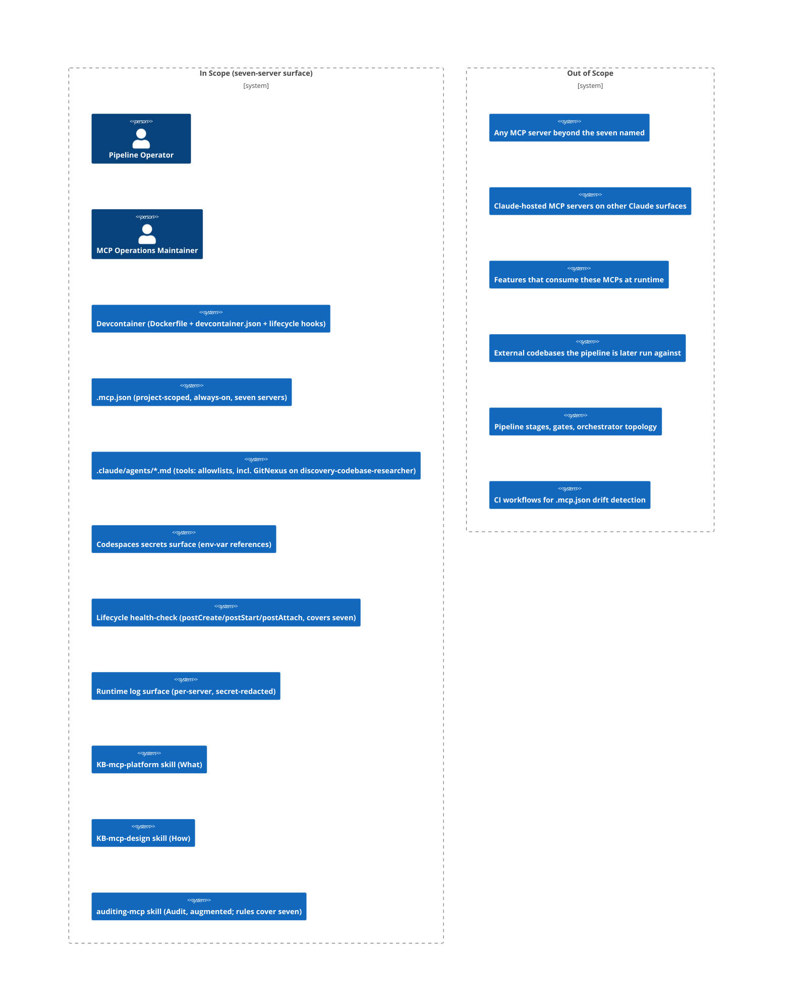

# PRD: Devcontainer MCP Server Provisioning

## Revision History

| Version | Date (UTC) | Author | Summary |
| --- | --- | --- | --- |
| 1.0.0 | 2026-05-23 | intake-prd-author | Initial PRD. Six MCP servers installed, registered always-on, wired into sub-agents, verified by per-server probe at acceptance. Eight Undetermined Items (UI-1 through UI-8) deferred to Discovery / Design. Reviewer verdict: approved_with_conditions (4 prior-context items resolved; 5 recommended findings I-DR-005 through I-DR-009). |
| 2.0.0 | 2026-05-23 | intake-prd-author | Scope expansion triggered at Gate 3 (Research Plan Approval). User identified four gaps in v1: (1) MCP health and readiness at Codespace lifecycle boundaries (postCreate / postStart / postAttach), (2) runtime error handling and operator-facing feedback when an MCP server fails during *usage* (not just provisioning), (3) runtime logging and diagnostic capture sufficient for root-cause without re-running, (4) completion of the project's What/How/Audit KB-skill trifecta for MCP — `auditing-mcp` exists but neither `KB-mcp-platform` (What) nor `KB-mcp-design` (How) does. v2 adds FR-8, FR-9, FR-10, FR-11; extends NFR-2 (Reliability) and NFR-8 (Operability) to cover runtime commitments; reclassifies v1 FR-7 to Won't-Have per I-DR-005; adds UI-9, UI-10, UI-11, UI-12 covering the new design questions; updates Risks table with three new entries; carries forward I-DR-006 through I-DR-009 to Blueprint composition. Layer Scope unchanged. |
| 3.0.0 | 2026-05-23 | intake-prd-author | Scope expansion triggered at the combined Gate 2+3 re-confirmation. User added GitNexus MCP as the seventh named server, citing its role as the canonical code-graph traversal MCP referenced by `KB-codebase-research/SKILL.md` (primary tool for `discovery-codebase-researcher`, with codebase-memory-mcp as ADR-0018 fallback). All "six" / "6" references updated to "seven" / "7" throughout: Overview one-line, Background, FR-1 server enumeration, FR-1 / FR-4 / FR-8 / FR-10 / FR-11 ACs that quantify the server count, Success Criteria "6 / 6" → "7 / 7", Risks, Stakeholder Inventory mentions, Appendix glossary "The six servers" → "The seven servers", Use Cases, Scope Boundary diagram caption. UI-8 (Serena fit) is narrowed: GitNexus now explicitly fills the codebase-traversal slot, so the remaining question for Serena is its symbol-level value on a markdown-heavy repo — no longer "Serena vs no codebase MCP." Three additions wired into existing UI items: UI-1 tool-to-agent mapping extended to call out GitNexus → discovery-codebase-researcher; UI-5 version pinning extended to include GitNexus; and two new UI items added — UI-15 (GitNexus tool-to-agent wiring specifics: primary vs. fallback alongside codebase-memory-mcp) and UI-16 (GitNexus install mechanism and transport). FR-11's W/H/A trifecta is unchanged in shape, but the augmented `auditing-mcp` must now also include rules covering GitNexus. Risks table extended with a GitNexus install/transport-risk entry. NFR-4 context-budget commentary updated for seven always-on servers. Layer Scope unchanged. Stakeholder Inventory unchanged. v1 FRs 2 through 11 carried forward in shape. EARS form preserved for all new/updated ACs. v2 review findings I-DR-010 through I-DR-014 absorbed where simple; remainder carried forward to Blueprint composition (see Appendix References). |

## Contents

Section completion checklist — each box must be checked (including `N/A — out of scope` rows) before this document leaves draft. The reviewer's Gate 0 check uses this list as the structural-presence anchor.

- [x] Overview
- [x] Stakeholders
- [x] User Stories
- [x] Functional Requirements
- [x] Non-Functional Requirements
- [x] Product Policy Decisions
- [x] Success Criteria
- [x] Technical Considerations
- [x] Rollout Plan
- [x] Undetermined Items
- [x] Appendix

## Overview

### One-line Summary

Provision seven named MCP servers (Serena, mcp-openapi-schema, actionlint-mcp, HashiCorp Terraform MCP, Context7, Exa, GitNexus) into this project's devcontainer so they are installed, registered always-on via a project-scoped `.mcp.json`, wired into the relevant sub-agents' `tools:` allowlists, verified working at acceptance time, health-checked and reported at every Codespace lifecycle boundary, observable at runtime for root-cause, and accompanied by the complete What/How/Audit KB-skill trifecta (KB-mcp-platform + KB-mcp-design + augmented auditing-mcp) so operators can maintain MCP operations long after this feature ships.

### Background

The feature-pipeline depends on a set of MCP capabilities — code-graph traversal, symbol-level codebase operations, OpenAPI schema reading, GitHub Actions linting, Terraform reasoning, library documentation lookup, and web research — that today are not provisioned into the devcontainer in any reproducible way. A freshly built Codespace cannot run discovery- or design-stage sub-agents end-to-end without manually installing and registering these servers. The Intent Clarification (see `intent-clarification.md`) confirmed (Q1–Q5) that this feature runs as a FULL 13-stage pipeline pass and that "ready to be used" includes wiring the new MCP tools into consuming sub-agents' `tools:` allowlists, not just registering them. Credentials are supplied via Codespaces secrets; the required keys are already available, so every server must be verified working at acceptance — not merely declared.

PRD v1 captured the install-and-register-and-wire-and-probe scope for six servers. At the Research Plan Approval Gate (Gate 3), the user identified that v1 stopped one layer too early on the operability axis: it ensured the surface comes up correctly *at acceptance*, but it did not commit to (a) detecting when the surface is unhealthy *across the Codespace lifecycle* (postCreate / postStart / postAttach), (b) surfacing usage-time failures clearly to the operator with actionable remediation guidance, (c) capturing enough diagnostic data to root-cause an issue without re-running, or (d) leaving behind the KB-skill maintenance surface (the "What/How/Audit" trifecta the project follows on every other major platform — KB-cc-platform / KB-cc-design / auditing-cc-configs; KB-codespaces-platform / KB-codespaces-design / auditing-codespaces; KB-github-actions-platform / KB-github-actions-design / auditing-github-actions) so future operators can reason about MCP independent of this feature. PRD v2 closed those four gaps.

At the combined Gate 2+3 re-confirmation, the user identified one further gap in the server inventory: the six v2 servers omit the project's canonical code-graph traversal MCP, **GitNexus**. Per `KB-codebase-research/SKILL.md`, GitNexus is the primary tool that `discovery-codebase-researcher` uses for code-graph traversal in the feature-pipeline, with `codebase-memory-mcp` as the documented fallback per ADR-0018. Without GitNexus provisioned in the devcontainer, the codebase-research stage cannot run end-to-end from a fresh Codespace using its primary tool. PRD v3 adds GitNexus as the seventh named server, leaves the v2 commitments (lifecycle health, failure surfacing, runtime log, W/H/A trifecta) intact, and extends FR-1 / FR-4 / FR-8 / FR-10 / FR-11 and their ACs to cover the seven-server surface.

PRD v3 does not re-litigate v1's scope class (FULL), the v2 always-on activation model, the credential surface, or the seven-server closed list (with GitNexus's addition the list is now closed at seven; no further servers in this feature). The PRD names *what* the provisioning must guarantee and *whose* experience it serves. It does not pre-decide installation mechanism, transport per server, version pinning, specific tool-to-agent mappings, the lifecycle hook(s) used for health checks, the log/diagnostic surface, the internal organization of KB-mcp-platform / KB-mcp-design, or the specific GitNexus install path and transport — those are design questions, surfaced in Undetermined Items with forward pointers.

### Layer Scope

Declare which layers this feature touches. Sections under Design, Security, Test Boundaries, and Verification corresponding to unchecked layers may be marked `N/A — out of scope` without further elaboration.

- [x] **Claude Code / Project Filesystem** — `.mcp.json`, `.claude/agents/*.md` `tools:` allowlists, MCP configuration conventions, the `KB-mcp-platform` (What) and `KB-mcp-design` (How) skills, and the augmented `auditing-mcp` (Audit) skill (now also covering GitNexus rules)
- [ ] **Frontend** — UI components, client state, routing, styling
- [ ] **Backend** — services, domain logic, background jobs, schedulers
- [ ] **API** — HTTP/GraphQL/RPC endpoints, contracts, versioning
- [ ] **Query / Data Access** — ORM models, repositories, query layer, caching
- [ ] **Database** — schema, migrations, indexes, constraints, seed data
- [ ] **CI/CD (GitHub Actions)** — workflows, jobs, reusable actions, environments, secrets
- [ ] **Infrastructure as Code** — Terraform/Pulumi/CDK/CloudFormation modules, state, providers
- [x] **Dev Environment (Codespaces / Devcontainer)** — `.devcontainer/Dockerfile` and/or `devcontainer.json`, lifecycle scripts, prebuild contents, Codespaces secrets surface, `postCreate` / `postStart` / `postAttach` lifecycle hooks for MCP health checks, the runtime log surface for diagnostic capture, and (now) the GitNexus install path and runtime presence

**Layer Scope deltas v2 → v3:** No layers activate or deactivate. Adding a seventh server (GitNexus) lands entirely inside the two layers already in scope: GitNexus's install path is a Dev Environment concern; its registration in `.mcp.json` and its tool-to-agent wiring (primary vs. fallback alongside codebase-memory-mcp for `discovery-codebase-researcher`) are Claude Code concerns; its inclusion in the augmented `auditing-mcp` skill is a Claude Code concern.

**Out-of-scope layers (Frontend, Backend, API, Query / Data Access, Database, CI/CD, Infrastructure as Code) rationale:**

- *Frontend / Backend / API / Query / Database:* this project's deliverable is markdown and configuration. There is no user-facing application code, service, endpoint, ORM, or schema for this feature to touch. The runtime logging is captured to local files (or stdout) read by the operator; it does not introduce a backend or API. Adding GitNexus does not change this.
- *CI/CD (GitHub Actions):* the Intent Clarification did not request a CI smoke-test workflow; acceptance is gated by `claude mcp list`, per-server probe, and the lifecycle health-check output at devcontainer post-build, not by a GitHub Actions job. CI/CD remains explicitly out of scope. If the user later wants a CI guard for `.mcp.json` drift or for the KB-mcp trifecta's audit run, that is a separate feature.
- *Infrastructure as Code:* no cloud infrastructure is provisioned by this feature. The Terraform MCP server reasons about Terraform; it does not create or apply state. GitNexus operates against the in-repo source tree; it provisions no cloud resources.

## Stakeholders

### Stakeholder Inventory

Per the carry-forward note from `intent-review-issues.json` (I-DR-004), this section treats consuming sub-agents as a surface-area consideration handled under Technical Considerations, not as a stakeholder. The stakeholders below are real human or human-tooled roles. **No stakeholder changes v2 → v3** — adding GitNexus does not introduce a new role; it adds capability to the surface the same stakeholders already operate.

| Stakeholder | Description | Primary Layer(s) | Relationship | Volume / Importance |
| --- | --- | --- | --- | --- |
| Pipeline operator / maintainer | The user(s) who run the feature-pipeline against a target codebase and own the pipeline's reliability. Also the on-the-ground responder when an MCP server fails mid-run. | Claude Code, Dev Environment | Primary user | Small team; high importance — they feel every failure (across all seven servers) |
| Devcontainer / Codespaces user | Anyone who opens this repo in a Codespace or local devcontainer — includes the pipeline operator but also one-off contributors evaluating the pipeline. | Dev Environment | Direct user | Bounded by the project's contributor count; medium importance |
| Sub-agent author (human) | The human who authors or modifies `.claude/agents/*.md` files and is responsible for keeping the `tools:` allowlists correct — including the GitNexus tool entries on `discovery-codebase-researcher`. | Claude Code | Maintainer of surface area | Single team; high importance — they own the wiring this feature changes |
| Security reviewer | The role responsible for checking that credentials stay out of git, that the `.mcp.json` does not introduce toxic capability combinations (now including any GitNexus capability), and that no MCP server is wired into an agent that should not have it. Also reviews the lifecycle health-check scripts and the runtime log surface for accidental secret leakage. | Claude Code, Dev Environment | Reviewer / gate | One person or rotating role; high importance — they hold a veto |
| MCP operations maintainer | The role responsible for keeping MCP operations healthy after this feature ships — adding/removing/updating servers (including GitNexus), diagnosing failures, and keeping the `.mcp.json` aligned with the active sub-agent surface. In a small team this is the same human as the pipeline operator; the role is distinguished because the maintenance interface (the W/H/A trifecta) is what they read, not the feature PRD. | Claude Code, Dev Environment | Long-tail maintainer | Same headcount as pipeline operator; high importance — they own the surface forever after Gate 6 |

### Primary Users

The **pipeline operator / maintainer** is the primary user for this release. When trade-offs arise between (a) one-time setup complexity and (b) per-run reliability, prefer reliability — the operator runs the pipeline often; they configure the Codespace rarely. The secondary primary user is the **MCP operations maintainer**, whose interface is the W/H/A trifecta (KB-mcp-platform / KB-mcp-design / auditing-mcp); when trade-offs arise between (a) terseness in the trifecta and (b) coverage of the operational concerns named in FR-8 / FR-9 / FR-10 (now covering seven servers including GitNexus), prefer coverage — the maintainer will read these documents when something is broken, which is the worst possible moment to discover a gap.

## User Stories

Stories are grouped by stakeholder. Empty groups (other stakeholders not authoring stories in this release) are deliberately omitted.

### Pipeline Operator / Maintainer

#### US-1: Operator can rebuild a Codespace and find all seven MCP servers ready

**As a** pipeline operator, **I want** a freshly built Codespace to come up with all seven MCP servers installed, registered, and connected **so that** I can invoke any pipeline stage — including codebase-research (which uses GitNexus as primary) — without manually configuring MCP first.

**Acceptance Criteria (EARS):**

- [ ] AC-FR-1-a: When the Codespace finishes its build and lifecycle setup, the system shall have every one of the seven named MCP servers (Serena, mcp-openapi-schema, actionlint-mcp, HashiCorp Terraform MCP, Context7, Exa, GitNexus) listed by `claude mcp list` as *connected*.
- [ ] AC-FR-1-b: When the operator runs the agreed per-server probe (one trivial, side-effect-free call defined per server in the Blueprint), the system shall return a successful response from every one of the seven servers.
- [ ] AC-FR-1-c: If any of the seven servers is missing, not registered, or not responding at probe time, then the system shall surface a clear failure in the probe tool's output (and in `claude mcp list` output where applicable) naming the specific server and the layer of failure (install / registration / transport / auth). *(v2: tightened per I-DR-008 — surfacing channel made explicit. v3: extended in scope to cover GitNexus alongside the prior six.)*

#### US-2: Operator's sub-agents already carry the new MCP tools

**As a** pipeline operator, **I want** the sub-agents that should use the new MCP capabilities — including `discovery-codebase-researcher` with GitNexus as primary and codebase-memory-mcp as fallback — to already have those tools in their `tools:` allowlists **so that** I do not have to hand-edit agent files to make discovery and design stages work.

**Acceptance Criteria (EARS):**

- [ ] AC-FR-2-a: When the operator inspects each affected `.claude/agents/*.md` after this feature ships, the system shall show the appropriate MCP tool entries present in the `tools:` allowlist for every agent identified by the tool-to-agent mapping (mapping itself is decided at Design — see UI-1; the GitNexus → `discovery-codebase-researcher` mapping is further specified at UI-15).
- [ ] AC-FR-2-b: When the operator runs a stage whose sub-agent was wired to a new MCP capability, the system shall make the corresponding tool callable from inside that sub-agent (i.e., not "permission denied by allowlist"). This includes GitNexus tools on `discovery-codebase-researcher`.

#### US-6: Operator gets a clear health verdict at every Codespace lifecycle event

**As a** pipeline operator, **I want** the MCP surface to be health-checked and its status reported at every Codespace lifecycle boundary (container build complete, container start, attach) **so that** I never start a pipeline run unsure whether the MCP surface is actually ready.

**Acceptance Criteria (EARS):**

- [ ] AC-FR-8-a: When the `postCreate` lifecycle phase completes on a fresh Codespace build, the system shall run a defined MCP health check covering all seven servers and shall report each server's status (connected + probe-pass / connected + probe-fail / not-connected / not-installed) to the operator in a single consolidated output.
- [ ] AC-FR-8-b: When the `postStart` lifecycle phase completes (Codespace start or resume from stop), the system shall re-run the MCP health check and report status, since transient-state servers (e.g., remote HTTP endpoints) may have changed availability while the container was stopped.
- [ ] AC-FR-8-c: When the `postAttach` lifecycle phase runs (operator attaches a new shell to a running Codespace), the system shall surface the most recent health-check result (or trigger a fresh check if the prior result is stale beyond a threshold defined at Design — see UI-10) so the operator sees current status without manually invoking the check.
- [ ] AC-FR-8-d: If any of the seven servers is in a failing state at any lifecycle boundary, then the system shall surface the failure with the server name, the failing layer (install / registration / transport / auth / probe), and a remediation hint pointing at the relevant section of `KB-mcp-platform` (see FR-11).
- [ ] AC-FR-8-e: The system shall make the health-check command operator-invokable on demand (independent of the lifecycle phase) so the operator can re-check mid-run after a suspected failure without rebuilding or restarting.

#### US-7: Operator sees actionable failures, not silent breakage, during MCP usage

**As a** pipeline operator, **I want** any MCP server failure that occurs during a pipeline run (not only at provisioning) to be surfaced with a named server, named failure layer, and a remediation pointer **so that** I can act in the moment rather than abandon the run or debug from raw logs.

**Acceptance Criteria (EARS):**

- [ ] AC-FR-9-a: If an MCP server fails to start, fails its handshake, or returns a transport-level error at any time during a pipeline run, then the system shall surface a structured failure record (server name, failure layer, observed error, remediation hint) at the next operator-visible surface (CLI output, stderr, or the Claude Code session log — exact surface decided at Design, see UI-11).
- [ ] AC-FR-9-b: If a tool call to an MCP server returns an error response (server-level, not transport-level), then the system shall include the server name, the tool name, and the error response in the failure record so the operator can distinguish "server is down" from "this call was rejected."
- [ ] AC-FR-9-c: When an MCP server transitions from healthy to unhealthy during a session (i.e., was working, now isn't), the system shall make that transition visible in the runtime log surface (FR-10) with a timestamp and the triggering event, so the operator can correlate the failure with their actions.
- [ ] AC-FR-9-d: The system shall not silently fall back, retry without notice, or hide an MCP failure from the operator. Every failure shall reach a named surface defined at Design. *(This applies equally to the GitNexus → codebase-memory-mcp fallback documented in ADR-0018: any actual fallback shall be operator-visible per AC-FR-9-d, not silent.)*

#### US-8: Operator can root-cause an MCP failure without re-running

**As a** pipeline operator, **I want** sufficient runtime log and diagnostic data captured per MCP server **so that** when something fails I can root-cause it from the captured data and do not have to reproduce the failure to investigate.

**Acceptance Criteria (EARS):**

- [ ] AC-FR-10-a: While any of the seven MCP servers is running in the devcontainer, the system shall capture per-server transport-level events (server-process start, handshake outcome, stdio capture for stdio-transport servers, request/response metadata for HTTP-transport servers) in a documented log location defined at Design (see UI-12).
- [ ] AC-FR-10-b: While the runtime log is being captured, the system shall record structured failure records (server name, failure layer, timestamp, observed error, last successful operation if known) so an operator can read the log post-failure and reconstruct the sequence without re-running.
- [ ] AC-FR-10-c: When the operator runs the documented "tail MCP logs" command, the system shall make the per-server log content readable in a single operator-friendly view (interleaved by timestamp, or split per server — choice decided at Design, see UI-12).
- [ ] AC-FR-10-d: The system shall not capture secret values in the runtime log. Where a server emits a request that includes a credential (header, query param, or env-var-derived field), the system shall redact the credential value in the captured log.

### Devcontainer / Codespaces User

#### US-3: Rebuild remains deterministic and reasonably fast

**As a** devcontainer user, **I want** the rebuild that provisions these seven servers to be deterministic and to stay within a tolerable time budget **so that** my onboarding or rebuild does not become a 20-minute coffee break.

**Acceptance Criteria (EARS):**

- [ ] AC-NFR-1-a: When a Codespace is built from a clean cache, the system shall complete devcontainer build + lifecycle setup (including all MCP install steps for the seven servers and the post-build health check) within the Performance target defined in NFR-1 below.
- [ ] AC-NFR-1-b: When the Codespace is rebuilt from a warm cache (no source changes), the system shall reuse cached layers and shall not re-download or re-compile MCP server binaries.

### Sub-agent Author

#### US-4: Tool-to-agent wiring is discoverable and auditable

**As a** sub-agent author, **I want** the mapping of MCP tools to sub-agents — including the GitNexus → `discovery-codebase-researcher` mapping and the GitNexus / codebase-memory-mcp primary/fallback relationship — to be expressed plainly in the `.claude/agents/*.md` files **so that** I can audit and amend the wiring without spelunking through `.mcp.json` or external docs.

**Acceptance Criteria (EARS):**

- [ ] AC-FR-3-a: The system shall record the active tool-to-agent mapping as the union of (a) the registered tools in `.mcp.json` and (b) the `tools:` allowlist field in each `.claude/agents/*.md` file; both shall be present in the repo and human-readable.
- [ ] AC-FR-3-b: When the sub-agent author adds or removes an MCP tool from an allowlist, the system shall require no other change for the modified allowlist to take effect at the next pipeline run.

### Security Reviewer

#### US-5: Credentials never leak into git; MCP capability combinations are auditable

**As a** security reviewer, **I want** every credential to flow exclusively via Codespaces secrets and **I want** the `.mcp.json` to be auditable for capability combinations (across all seven servers) **so that** I can sign off without finding tokens in history or unexpected privileged servers wired into unprivileged agents.

**Acceptance Criteria (EARS):**

- [ ] AC-NFR-2-a: The system shall not contain any secret value (e.g., `EXA_API_KEY`, `CONTEXT7_API_KEY`, `TFE_TOKEN`, and any credential GitNexus requires per UI-16) in any committed file in this repository, including `.mcp.json`, `devcontainer.json`, the Dockerfile, lifecycle scripts, the lifecycle health-check scripts, the runtime log capture configuration, and `.claude/agents/*.md`.
- [ ] AC-NFR-2-b: Where a secret is required by a registered MCP server, the system shall reference it by environment-variable name only; the value shall be sourced at runtime from the Codespaces secrets surface.
- [ ] AC-NFR-2-c: When the `auditing-mcp` skill is run against the resulting `.mcp.json`, the `auditing-mcp` skill shall report zero BLOCKER findings. *(v2: reworded per I-DR-009 — subject corrected to the auditing skill. v3: skill must include rules for GitNexus per FR-11-c augmentation; see UI-14.)*
- [ ] AC-NFR-2-d: The system shall redact any credential value that appears in the runtime log surface (FR-10) before the log is written to disk. *(See AC-FR-10-d for the runtime counterpart.)*

### MCP Operations Maintainer

#### US-9: Maintainer has a complete What/How/Audit trifecta for MCP operations

**As an** MCP operations maintainer, **I want** the project to carry a `KB-mcp-platform` skill (What — MCP platform facts), a `KB-mcp-design` skill (How — MCP design discipline), and the existing `auditing-mcp` skill augmented to cover operational health (Audit — review against rules, including rules for GitNexus) **so that** I can reason about, evolve, and audit MCP operations the same way I do for every other major platform in this project (Claude Code, Codespaces, GitHub Actions).

**Acceptance Criteria (EARS):**

- [ ] AC-FR-11-a: After this feature ships, the system shall contain a `.claude/skills/KB-mcp-platform/SKILL.md` skill following the same shape as `KB-cc-platform`, `KB-codespaces-platform`, and `KB-github-actions-platform` — covering MCP platform facts (transports, server lifecycle, credential surfaces, log surfaces, lifecycle integration points) at the "What" level. Internal organization (specific reference files, templates, examples) is decided at Design (see UI-13).
- [ ] AC-FR-11-b: After this feature ships, the system shall contain a `.claude/skills/KB-mcp-design/SKILL.md` skill following the same shape as `KB-cc-design`, `KB-codespaces-design`, and `KB-github-actions-design` — covering MCP design discipline (principles, patterns, anti-patterns, when-to-use guidance) at the "How" level. Internal organization is decided at Design (see UI-13).
- [ ] AC-FR-11-c: After this feature ships, the system shall have augmented the existing `auditing-mcp` skill to cover operational health (lifecycle health-check outcomes, runtime log integrity including secret-redaction, error-handling presence) in addition to its current configuration-audit coverage, **and shall include rules covering GitNexus alongside the prior six servers**. The exact augmentations and the specific GitNexus rules are decided at Design (see UI-14), but the augmented skill shall be runnable end-to-end against the post-feature devcontainer with no BLOCKER findings.
- [ ] AC-FR-11-d: When the MCP operations maintainer reads `KB-mcp-platform` and `KB-mcp-design` together, the system shall make the relationship between the two skills explicit (What references How for design choices; How references What for platform facts), matching the cross-reference style used by the other trifectas in this project. Both skills shall name GitNexus as one of the seven servers covered.

### Use Cases

1. **Fresh Codespace, first run of pipeline.** *Pipeline operator.* Opens repo in Codespace → devcontainer builds → MCP servers come up → `postCreate` health check reports seven-of-seven healthy → operator runs Intent Clarification on a new feature → discovery-codebase-researcher uses GitNexus (primary code-graph traversal, per `KB-codebase-research/SKILL.md`) and Serena (symbol-level operations where warranted) → design-api uses mcp-openapi-schema → design-cicd uses actionlint-mcp → design-iac uses HashiCorp Terraform MCP → discovery-external-researcher uses Context7 and Exa.
2. **Rebuild after Dockerfile edit.** *Pipeline operator.* Edits unrelated Dockerfile line → rebuilds container → still finds all seven MCP servers connected and authenticated → post-build health check confirms ready.
3. **Sub-agent author audits wiring.** *Sub-agent author.* Opens `.claude/agents/discovery-codebase-researcher.md` → sees `tools:` allowlist now lists the GitNexus tools (primary) and codebase-memory-mcp tools (fallback per ADR-0018) and the Serena tools by name → understands which capabilities are reachable from that agent.
4. **Security review of new `.mcp.json`.** *Security reviewer.* Inspects `.mcp.json` → confirms no inline secrets (across all seven server entries), only env-var references → runs the augmented `auditing-mcp` skill → confirms no BLOCKER findings (including the new GitNexus rules) → separately inspects the runtime log surface configuration for accidental secret capture.
5. **Mid-run MCP failure.** *Pipeline operator.* Runs a discovery stage; Exa returns transport-level error mid-run → operator sees a structured failure record (`Exa / transport / 401 / check EXA_API_KEY` and a pointer to KB-mcp-platform's troubleshooting section) → operator inspects the runtime log, sees the request/response context (credential redacted), determines the secret was rotated upstream → updates the Codespaces secret → re-runs without rebuilding.
6. **Resume from stopped Codespace.** *Pipeline operator.* Codespace was stopped overnight; operator reopens → `postStart` runs the health check → seven-of-seven report `connected + probe-pass` → operator proceeds with the pipeline run.
7. **(new in v3) GitNexus unavailable; documented fallback exercised.** *Pipeline operator.* During a codebase-research stage, GitNexus returns a transport-level error → per ADR-0018, `discovery-codebase-researcher` falls back to codebase-memory-mcp → per AC-FR-9-d, the fallback is operator-visible (structured failure record naming GitNexus + remediation pointer; not silent) → operator decides whether to repair GitNexus before continuing or proceed on the fallback.
8. **Maintainer adds an eighth MCP six months later.** *MCP operations maintainer.* Reads `KB-mcp-platform` for transport options and credential surfaces (now covering the seven-server precedent including GitNexus), reads `KB-mcp-design` for the project's chosen patterns (always-on vs conditional, tool-to-agent mapping discipline, primary/fallback wiring per ADR-0018), writes a candidate `.mcp.json` change, runs `auditing-mcp` against it, sees no BLOCKER findings, adjusts the lifecycle health-check script to cover the new server, and proceeds.

### User Journey Diagram

```mermaid
journey
    title Pipeline Operator: Fresh Codespace to First Pipeline Run (v3)
    section Codespace Setup
      Open repo in Codespace: 4: Operator
      Devcontainer builds: 3: Codespaces
      MCP servers install (seven): 3: Codespaces
      postCreate health check (seven-of-seven healthy): 5: Codespaces
      claude mcp list (all seven connected): 5: Operator
    section First Pipeline Run
      Invoke Intent Clarification on new feature: 5: Operator
      Discovery uses GitNexus (primary) / Serena / external MCPs: 5: Sub-agents
      Per-layer Design uses OpenAPI / actionlint / Terraform MCPs: 5: Sub-agents
    section Mid-Run Failure
      Exa returns transport error: 2: MCP runtime
      Structured failure surfaces with remediation pointer: 4: Operator
      Operator reads runtime log; secret rotated: 4: Operator
      Operator updates Codespaces secret; re-runs: 5: Operator
```

### Scope Boundary Diagram



## Functional Requirements

Each requirement is tagged with the **stakeholder** it serves and the **layer** where its acceptance is observed. All acceptance criteria use EARS form.

### Must Have (P1 — MVP)

- [ ] **FR-1: Seven named MCP servers shall be installed and registered always-on in the devcontainer** — Stakeholder: Pipeline operator — Layer: Dev Environment, Claude Code
  - The seven servers are: Serena, `hannesj/mcp-openapi-schema`, `hongkongkiwi/actionlint-mcp`, HashiCorp Terraform MCP, Context7, Exa, **GitNexus**. "Always-on" means project-scoped `.mcp.json` registration loaded every Claude Code session, not user-scoped or layer-conditional.
  - GitNexus is the canonical code-graph traversal MCP referenced by `KB-codebase-research/SKILL.md` and is the primary code-graph tool for `discovery-codebase-researcher`, with `codebase-memory-mcp` as the documented fallback per ADR-0018.
  - AC-FR-1-a, AC-FR-1-b, AC-FR-1-c (see US-1).

- [ ] **FR-2: Affected sub-agents shall have the new MCP tools in their `tools:` allowlists** — Stakeholder: Pipeline operator, Sub-agent author — Layer: Claude Code
  - "Wiring" is part of acceptance per Q3 in the Intent Clarification — registration alone is insufficient.
  - The specific tool-to-agent mapping is deferred to Design (see UI-1). For GitNexus specifically, the primary/fallback wiring on `discovery-codebase-researcher` (GitNexus primary; codebase-memory-mcp fallback per ADR-0018) is further specified at UI-15.
  - AC-FR-2-a, AC-FR-2-b (see US-2).

- [ ] **FR-3: The active tool-to-agent wiring shall be expressed in human-readable files in the repo** — Stakeholder: Sub-agent author — Layer: Claude Code
  - Distinct from FR-2 (which requires the allowlist entries are present); FR-3 commits to the readability and no-runtime-mutation properties — see NFR-3 audit & traceability. *(v2: cross-reference added per I-DR-007.)*
  - No "magic" wiring at runtime that is not visible by reading `.mcp.json` plus the agent files. The GitNexus/codebase-memory-mcp primary-vs-fallback relationship must likewise be discoverable from the files (specific representation decided at Design — UI-15).
  - AC-FR-3-a, AC-FR-3-b (see US-4).

- [ ] **FR-4: Each registered MCP server shall be verifiable by a per-server probe at acceptance time** — Stakeholder: Pipeline operator, Security reviewer — Layer: Dev Environment, Claude Code
  - Per Q5 keys are available, so verification is not "registration succeeded" but "server responded to a real call."
  - The specific probe call per server (now including a GitNexus probe) is defined at Design (Blueprint) time; the PRD requires *that* a probe exists per server and produces a pass/fail signal at acceptance.
  - AC-FR-4-a: When the operator runs the defined per-server probe against each of the seven registered servers, the system shall return a successful, non-error response from every server.
  - AC-FR-4-b: If a probe call fails for any of the seven servers, then the system shall surface the failing server name, the probe input, and the response/error so the operator can diagnose without re-running.

- [ ] **FR-5: Credentials shall flow via Codespaces secrets only, with no secret values committed** — Stakeholder: Security reviewer — Layer: Dev Environment, Claude Code
  - Covered by NFR-2 (see below). FR-5 exists because credential flow is a functional behavior of the provisioning, not only a quality attribute.
  - AC-FR-5-a: When any MCP server in `.mcp.json` requires a credential (including any credential GitNexus requires per UI-16), the system shall reference that credential only by environment-variable name; the value shall be supplied at runtime by the Codespaces secrets surface.
  - AC-FR-5-b: If a required credential's environment variable is unset at server start, then the system shall fail the affected server's probe with a clearly named "missing credential" failure, not a silent skip.

- [ ] **FR-8: The MCP surface shall be health-checked at every Codespace lifecycle boundary, with status reported to the operator** — Stakeholder: Pipeline operator — Layer: Dev Environment, Claude Code
  - The Codespace lifecycle exposes three operator-relevant boundaries: `postCreate` (after build, first time), `postStart` (every container start, including resume), and `postAttach` (every operator attach). All three carry the risk that the MCP surface is in a different state from the last time the operator saw it.
  - The health check is the runtime sibling of FR-4's probe. FR-4 is "verified at acceptance time"; FR-8 is "re-verified at every lifecycle event, with status reported." The health check covers all seven servers.
  - The specific lifecycle-hook wiring (which checks run in which phase; whether `postAttach` triggers a fresh check or reads cached state) is decided at Design — see UI-10.
  - AC-FR-8-a, AC-FR-8-b, AC-FR-8-c, AC-FR-8-d, AC-FR-8-e (see US-6).

- [ ] **FR-9: Runtime MCP failures shall be surfaced to the operator with a named server, named failure layer, and remediation pointer — no silent fallback** — Stakeholder: Pipeline operator — Layer: Dev Environment, Claude Code
  - Generalizes AC-FR-1-c (which scoped failure surfacing to *probe time*) to *any time during a pipeline run.* If a server fails mid-run, the operator must see it.
  - The remediation pointer is what makes the failure actionable. It points at a section of `KB-mcp-platform` (FR-11) — meaning FR-11 is a prerequisite for the user-facing remediation experience to be useful. `KB-mcp-platform` must cover all seven servers including GitNexus.
  - **The GitNexus → codebase-memory-mcp fallback documented in ADR-0018 is an in-product fallback, not a silent one. Per AC-FR-9-d, when the fallback is exercised at runtime, that exercise shall be operator-visible (structured failure record naming GitNexus + remediation pointer, even though the pipeline continues on the fallback).**
  - The specific operator-visible surface for the failure record (CLI output, stderr, Claude Code session log) is decided at Design — see UI-11.
  - AC-FR-9-a, AC-FR-9-b, AC-FR-9-c, AC-FR-9-d (see US-7).

- [ ] **FR-10: The system shall capture per-server runtime log and diagnostic data sufficient for root-cause analysis without re-running** — Stakeholder: Pipeline operator — Layer: Dev Environment, Claude Code
  - The intent is operability, not telemetry. There is no metrics dashboard, no remote log sink. The log lives where the operator can read it (file on disk or stdout); the "tail" command is a documented project convention.
  - Credentials present in captured requests/responses shall be redacted. This is both an FR-10 requirement (functional correctness of the log) and an NFR-3 requirement (security).
  - The log covers all seven servers; the per-server-format choice is made at Design (UI-12).
  - AC-FR-10-a, AC-FR-10-b, AC-FR-10-c, AC-FR-10-d (see US-8).

- [ ] **FR-11: The What/How/Audit KB-skill trifecta for MCP shall be completed in this feature** — Stakeholder: MCP operations maintainer, Pipeline operator — Layer: Claude Code
  - The project carries a trifecta for every other major platform: `KB-cc-platform` (What) + `KB-cc-design` (How) + `auditing-cc-configs` (Audit); `KB-codespaces-platform` + `KB-codespaces-design` + `auditing-codespaces`; `KB-github-actions-platform` + `KB-github-actions-design` + `auditing-github-actions`. For MCP, only `auditing-mcp` exists.
  - This feature shall add `KB-mcp-platform` and `KB-mcp-design` following the same shape and cross-reference conventions, and shall augment `auditing-mcp` to cover the operational concerns introduced by FR-8 / FR-9 / FR-10 (lifecycle health, runtime failures, log surface integrity including secret-redaction) **and shall include rules covering GitNexus alongside the prior six servers**.
  - The internal organization of the two new skills (specific reference files, templates, examples) is decided at Design — see UI-13. The specific augmentations to `auditing-mcp` (including GitNexus-specific rules) are decided at Design — see UI-14.
  - AC-FR-11-a, AC-FR-11-b, AC-FR-11-c, AC-FR-11-d (see US-9).

### Should Have (P2)

- [ ] **FR-6: The provisioning shall fit a reasonable rebuild-time and context-budget envelope** — Stakeholder: Devcontainer user, Pipeline operator — Layer: Dev Environment, Claude Code
  - Covered by NFR-1 (rebuild time) and NFR-4 (context budget — now scoped to seven always-on servers). Flagged P2 because failing the envelope degrades experience but does not block correctness.
  - AC-NFR-1-a, AC-NFR-1-b (rebuild); AC-NFR-4-a (context budget).

### Could Have (P3)

- (none in this release.)

### Won't Have (this release)

- **A CI smoke-test that asserts `claude mcp list` shows all seven servers connected.** *(v2: reclassified from v1's FR-7 P3 entry per I-DR-005 — Won't-Have is the correct disposition since CI/CD layer is out of scope. v3: extended scope to seven.)* Reason: CI/CD layer is out of scope this release per Layer Scope. If automated drift detection is later wanted, it becomes its own feature.
- **A CI workflow that runs `auditing-mcp` against `.mcp.json` on every PR.** Reason: same CI/CD-out-of-scope rationale; a separate feature can add this once the W/H/A trifecta has stabilized.
- **A remote log sink, metrics dashboard, or alerting surface for the MCP runtime log.** Reason: this project is operator-run, not on-call-run; FR-10 commits to a local readable log, not a telemetry pipeline. If remote sinks are later wanted, that is a separate feature.
- Any eighth MCP server beyond the seven named in this PRD. (Reason: closed list at seven; further servers are a separate feature.)
- Removal or replacement of Claude-hosted MCP servers available on other Claude surfaces. (Reason: separate surface; the Intent Clarification explicitly preserved them.)
- Changes to pipeline stages, the six human gates, or the orchestrator topology. (Reason: orthogonal to provisioning.)
- Feature work that *consumes* these MCPs (i.e., a pipeline run against a target codebase using the new servers). (Reason: provisioning ships capability; consumption is a separate feature run.)
- Modifications to the external codebases the pipeline will later be run against. (Reason: out-of-repo scope.)

## Non-Functional Requirements

NFRs are organized by quality attribute. Unscoped attributes are marked `N/A — out of scope`.

### NFR-1: Performance

- **Codespace cold-start (clean-cache build)**: when a Codespace is built from cold (no Docker layer cache), the system shall complete devcontainer build + `onCreate`/`postCreate` lifecycle (including all MCP server install + registration for the seven servers + the `postCreate` health check from FR-8) within **~10 minutes** on the project's declared `hostRequirements` (4 vCPU, 8 GB RAM). Round number; rationale: the existing baseline `onCreateCommand` plus Node LTS install already consumes several minutes, and the operator has expressed a "tolerable rebuild" preference rather than a hard latency target. The health check should consume well under a minute (seven probe-equivalents executed once). If GitNexus's install path (per UI-16) proves time-expensive, Design must surface the new measurement against this target.
- **Codespace rebuild (warm-cache)**: when rebuilt without source changes affecting MCP install layers, the system shall complete the rebuild in **under ~2 minutes**, reusing image layers and any lifecycle-cached artifacts. Rationale: warm-cache rebuilds are common during iteration; the only work should be re-running lifecycle hooks if any.
- **MCP server startup (per session)**: when Claude Code starts a session in a built container, the system shall surface all seven servers in `claude mcp list` within **~30 seconds** of session start. Rationale: longer would feel like the pipeline "hangs at start." This is a soft target; the design may adjust based on the chosen transports.
- **Lifecycle health-check overhead**: when `postStart` or `postAttach` runs the MCP health check, the system shall complete the check within **~15 seconds** under normal conditions. Rationale: a check that takes longer than the operator's "did anything happen?" patience window will be skipped or ignored. If a server is genuinely unreachable, the check may take longer per server-timeout; that's expected, but the *successful* path must be fast.
- **Runtime log capture overhead**: when an MCP server is running, the system shall not impose more than negligible (~5% or less of per-call time) overhead from log capture under normal conditions. Rationale: the log is a diagnostic aid; if it slows the pipeline measurably, operators will turn it off and lose its value.
- **AC-NFR-1-a, AC-NFR-1-b** (see US-3).

### NFR-2: Reliability

- **Per-server availability at acceptance**: every one of the seven servers shall pass its per-server probe (FR-4) at acceptance time. Less than 100% pass-rate at acceptance is a release blocker.
- **Idempotent rebuild**: rebuilding the devcontainer from the same source shall produce a functionally identical MCP surface — same seven servers, same connect status, same probe outcomes. No "works the second time" failure modes.
- **Lifecycle health-check accuracy**: the health check (FR-8) shall not produce false-positive "healthy" reports. A "healthy" status implies the server is connected AND a probe equivalent succeeds. Reporting "healthy" when the server cannot in fact answer a tool call is a release blocker. (False-negative "unhealthy" reports — flagging a transient blip — are acceptable; the operator can re-run the check.)
- **Runtime failure visibility**: every mid-run MCP failure (FR-9) shall reach the operator. "Silently swallowed failure" is a release blocker. This includes both transport-level failures and tool-level error responses, and includes the GitNexus → codebase-memory-mcp ADR-0018 fallback (which is in-product, not silent).
- **AC-NFR-2-a, AC-NFR-2-b, AC-NFR-2-c, AC-NFR-2-d** (see US-5).

### NFR-3: Security

- **Authentication / Authorization**: every MCP server's authentication mechanism shall be either (a) no-auth (where the server itself requires none) or (b) a credential read at runtime from a Codespaces secret referenced by environment-variable name. No third path. Applies equally to GitNexus per UI-16.
- **Distinction (per I-DR-003 carry-forward)**: Q5 of the Intent Clarification confirmed that the *API keys* (`EXA_API_KEY`, `CONTEXT7_API_KEY`, `TFE_TOKEN`) are available via Codespaces secrets. The *transport-level authentication mechanism* for Exa (HTTP header vs. URL query parameter vs. stdio with env-var) is a separate question and is **not yet resolved** — it appears in Undetermined Items (UI-3). NFR-3 commits to "credentials flow via Codespaces secrets, env-var referenced only"; UI-3 commits Design to picking the specific transport-level auth shape before `.mcp.json` is finalized. The same distinction applies to GitNexus if it requires a credential — see UI-16.
- **Data classification touched**: none beyond the API keys themselves. No PII, PHI, or financial data is handled by this provisioning step.
- **Audit & traceability**: every change to `.mcp.json`, to `.claude/agents/*.md` `tools:` allowlists, to the lifecycle health-check scripts, and to the W/H/A trifecta skill files shall be visible in git history. (Trivially satisfied by storing them in the repo — the NFR exists to forbid runtime mutation.)
- **Runtime log redaction**: the runtime log capture (FR-10) shall redact every credential value before writing to disk. A credential value appearing in a committed or operator-readable log file is a release blocker.
- **Compliance commitments**: no formal external compliance commitment applies. Internal: the augmented `auditing-mcp` skill shall produce no BLOCKER findings against the resulting `.mcp.json` and against the resulting runtime configuration (lifecycle scripts + log surface), **with rule coverage extending to GitNexus**. Whether the augmented `auditing-mcp` is itself a formal Gate 6 acceptance gate is in Undetermined Items (UI-6).
- **Supply chain / contributor trust**: per-server install sources shall be limited to the canonical upstream (e.g., the project's published GitHub release or registry artifact). Forks are not used unless an ADR records the reason. Version pinning is deferred to Design (UI-5, which v3 extends to include GitNexus).
- **AC-NFR-2-a, AC-NFR-2-b, AC-NFR-2-c, AC-NFR-2-d** (see US-5).

### NFR-4: Scalability

- **Context-budget impact of seven always-on servers**: when ~30 sub-agents each load Claude Code with seven always-on MCP servers registered, the system shall keep cumulative per-agent context overhead within a tolerable envelope. The Intent Clarification's Open Items flagged this for PRD assessment. The PRD's position: the impact is **acceptable in v3.0.0 of this feature** *conditional on Design measuring it (now with seven servers, including GitNexus) and surfacing the per-agent token count in the Blueprint*. If Design measures and the overhead is intolerable, mitigation (e.g., conditional activation per agent) is opened as a re-scope. See UI-7.
- *(v2: AC-NFR-4-a from v1 — which committed the Blueprint to including a measurement — is reframed as a Blueprint-author instruction inside UI-7's Owner/Needed-by note rather than as a runtime AC, per I-DR-006. NFR-4 itself remains the commitment; the Blueprint instruction now lives at UI-7. v3: the instruction is updated to require measurement of the seven-server configuration, not six.)*

### NFR-5: Compatibility

- **Claude Code compatibility**: the `.mcp.json` and the agent `tools:` allowlist syntax shall be compatible with the Claude Code version installed by the existing `ghcr.io/anthropics/devcontainer-features/claude-code:1` feature in `devcontainer.json`. (Trivially satisfied by using only published `.mcp.json` and agent-file fields; called out so any deviation is surfaced.) Adding a seventh server registration does not change the compatibility surface.
- **Host OS compatibility**: the devcontainer image is the existing `mcr.microsoft.com/devcontainers/python:1-3.11-bookworm` base. Any install mechanism chosen at Design (UI-2 for the prior six; UI-16 for GitNexus) shall run on that base image as-is, OR the Blueprint shall record the base-image change and its rationale. The lifecycle health-check (FR-8) and runtime log capture (FR-10) shall likewise run on that base image as-is.
- **Trifecta convention compatibility**: `KB-mcp-platform` and `KB-mcp-design` shall be readable by the same convention used by the existing platform/design skills (frontmatter shape, references/ subdirectory layout, cross-reference style). Verified by inspection against `KB-cc-platform` / `KB-cc-design`, `KB-codespaces-platform` / `KB-codespaces-design`, `KB-github-actions-platform` / `KB-github-actions-design`. Both new skills shall name GitNexus among the seven covered servers.

### NFR-6: Accessibility

- *N/A — out of scope.* No UI surface is changed by this feature.

### NFR-7: Data

- *N/A — out of scope.* No user data is processed, stored, or transferred by this feature beyond the API-key flow already covered under NFR-3 and the runtime log content (which excludes credentials per FR-10 / NFR-3).

### NFR-8: Operability

- **Observability commitment**: when the operator runs `claude mcp list`, the system shall make per-server connect status visible for all seven servers. When the operator inspects the result of the lifecycle health check (FR-8), the system shall make per-server health status visible with a named failure layer for any server in a failing state. When the operator tails the runtime log (FR-10), the system shall make per-server transport events and structured failure records visible in the documented log location.
- **Lifecycle awareness**: the system shall report MCP surface health at every Codespace lifecycle boundary — `postCreate` (after fresh build), `postStart` (every start, including resume), and `postAttach` (every attach). The operator shall not be required to remember to run a check; the lifecycle phase invokes it.
- **Failure feedback discipline**: every MCP failure visible to the operator — whether at health-check time, probe time, or mid-run — shall name the server, the failure layer (install / registration / transport / auth / probe / tool-error), and a remediation pointer (typically into `KB-mcp-platform`). No anonymous failures, no untraceable failures, no silent fallbacks (including the ADR-0018 GitNexus → codebase-memory-mcp fallback, which is operator-visible per AC-FR-9-d).
- **On-call burden**: there is no on-call. The pipeline is operator-run. Runtime log capture (FR-10) is operator-local; there is no remote sink, no alerting.
- **Failure surface**: when an MCP server fails at session start, the system shall surface the failure in `claude mcp list` output, in the lifecycle health-check output (FR-8), in the operator-visible failure surface defined for FR-9, and in the runtime log (FR-10).

### NFR-9: Developer Experience

- **Time to first productive pipeline run on a fresh Codespace**: when a new operator (or a returning operator on a fresh Codespace) opens this repo, the system shall make a pipeline run executable end-to-end without manual MCP setup. (Implied by FR-1 + FR-2 + FR-8.) Includes codebase-research, which depends on GitNexus per `KB-codebase-research/SKILL.md`.
- **Agent-driven workflow support**: per Q3, "ready to be used" includes wiring. Sub-agents that should call new MCP tools shall be able to call them at the next pipeline run with no manual intervention — including `discovery-codebase-researcher` calling GitNexus.
- **Maintainer entry point**: the MCP operations maintainer shall be able to start from `KB-mcp-platform` for "what is MCP and what surfaces exist," move to `KB-mcp-design` for "how this project organizes MCP (including primary/fallback per ADR-0018)," and run `auditing-mcp` for "is the current state OK" — without reading the feature-pipeline PRD or any other long-form document. This is the same entry-point shape as the other three platform trifectas.

## Product Policy Decisions

This section captures cross-cutting product-level decisions surfaced by the Intent Clarification and by the v2 / v3 scope expansions that constrain Design.

| Policy Area | Decision | Rationale | Affected Layers |
| --- | --- | --- | --- |
| MCP activation model | All seven servers registered **always-on** at project scope (`.mcp.json`) | Q4 user answer: "All six always-on" extended at v3 re-confirmation to all seven. Tiered/conditional activation explicitly rejected. | Claude Code, Dev Environment |
| Credential surface | **Codespaces secrets only**; env-var references only in committed files | Q5 user answer: keys available via Codespaces secrets. No alternative credential surface authorized. Applies to any GitNexus credential per UI-16. | Dev Environment, Claude Code |
| Tool wiring policy | Wire the new MCP tools into the relevant sub-agents' `tools:` allowlists at provisioning time, including GitNexus on `discovery-codebase-researcher` | Q3 user answer: "Wire the MCP tools into the relevant sub-agents." Register-only rejected. | Claude Code |
| Scope class | **FULL** 13-stage pipeline pass | Q2 user answer: "FULL — all 13 stages." MINOR and intent-doc-only postures rejected. | (orchestration; not a layer) |
| Pipeline topology | No changes to pipeline stages, gates, or orchestrator topology | Intent Clarification Scope Posture: explicit out-of-scope. | (orchestration; not a layer) |
| Server surface | Only the seven named servers — no expansion in this feature | Intent Clarification Scope Posture: closed list; v3 re-confirmation closed at seven (added GitNexus). | Claude Code |
| Coexistence with Claude-hosted MCPs | The Claude-hosted MCPs available on other Claude surfaces remain untouched | Intent Clarification Scope Posture: explicit out-of-scope; this is a different surface. | Claude Code |
| `auditing-mcp` outcome | The augmented `auditing-mcp` skill (with rules covering all seven servers including GitNexus) shall produce no BLOCKER findings against the resulting `.mcp.json` AND against the resulting runtime configuration | Intent Clarification Success Posture; v2 FR-11 augmentation; v3 GitNexus rule extension. (Whether this is also a formal Gate 6 criterion is open — see UI-6.) | Claude Code |
| Failure surfacing policy | Every MCP failure (provisioning, lifecycle, mid-run) shall be visible to the operator with a named server, named failure layer, and remediation pointer. No silent fallbacks, no anonymous failures. (Includes the ADR-0018 GitNexus → codebase-memory-mcp fallback, which is in-product but operator-visible.) | User feedback at Gate 3: "ensure we have ... failure and error handling across usage and user feedback." Operator-run pipeline cannot tolerate hidden failures. | Dev Environment, Claude Code |
| Runtime log capture policy | Per-server transport events and structured failure records shall be captured locally for all seven servers; credential values shall be redacted. No remote sink, no telemetry pipeline. | User feedback at Gate 3: "providing logging to root cause issues." Operator-run; remote sinks unwarranted. | Dev Environment |
| W/H/A trifecta completion policy | MCP shall carry the same three-skill trifecta the project carries for every other major platform: `KB-mcp-platform` (What), `KB-mcp-design` (How), augmented `auditing-mcp` (Audit) — covering all seven servers including GitNexus. | User feedback at Gate 3: "ensuring we have an audit agent and skill files to maintain our mcps." Trifecta is the project's established maintenance interface. | Claude Code |
| **Code-graph traversal MCP slot (new in v3)** | **GitNexus is the canonical code-graph traversal MCP per `KB-codebase-research/SKILL.md`, with `codebase-memory-mcp` as the documented fallback per ADR-0018. The PRD does not re-decide this policy; it ensures the slot is provisioned.** | **User feedback at Gate 2+3 re-confirmation: GitNexus must be installed as part of this provisioning. The primary/fallback relationship is already settled in `KB-codebase-research/SKILL.md` and ADR-0018; this PRD honors it.** | **Claude Code, Dev Environment** |

## Success Criteria

### Quantitative Metrics

| Metric | Stakeholder | Target | Measurement Method | Timeframe |
| --- | --- | --- | --- | --- |
| Servers connected at fresh-build acceptance | Pipeline operator | 7 / 7 | `claude mcp list` in the built container | At Gate 6 (Deliverable Packaging) and at every subsequent Codespace rebuild |
| Per-server probe pass-rate at acceptance | Pipeline operator, Security reviewer | 100% (7 / 7) | Documented per-server probe defined in Blueprint | At Gate 6 |
| Lifecycle health-check pass-rate at each lifecycle boundary | Pipeline operator | 100% on `postCreate` after fresh build (7 / 7); degraded states acceptable on `postStart`/`postAttach` if remediation pointer is shown | Lifecycle hook stdout / health-check command output | At Gate 6 and every subsequent lifecycle event |
| Secret values committed to git | Security reviewer | 0 | `git grep` against the patterns of the three known env-var names (plus any GitNexus credential name surfaced at UI-16) and shape-detection for the credential classes | Pre-merge; on every PR touching this surface |
| Secret values captured in runtime log | Security reviewer | 0 | Inspection of the runtime log surface (all seven servers) against the same shape-detection patterns | At Gate 6 |
| `auditing-mcp` BLOCKER findings | Security reviewer | 0 | Augmented `auditing-mcp` skill (with GitNexus rules per UI-14) run against the resulting `.mcp.json` AND the runtime configuration | At Gate 6 |
| Clean-cache devcontainer build time | Devcontainer user | ≤ ~10 minutes (per NFR-1) | Wall-clock from "Rebuild Container" to `onCreate`/`postCreate` exit on a 4 vCPU / 8 GB host | Spot-checked at Gate 6 |
| W/H/A trifecta presence | MCP operations maintainer | Both `KB-mcp-platform/SKILL.md` and `KB-mcp-design/SKILL.md` exist; `auditing-mcp` augmented per FR-11-c (including GitNexus rules) | File-system inspection + skill self-check (each SKILL.md loads cleanly per the project's skill-format conventions) | At Gate 6 |

### Qualitative Metrics

1. **Operator confidence at first run on a fresh Codespace.** Pipeline operator. After Gate 6, the operator can open a new Codespace, run `claude mcp list`, see seven connected servers, read the `postCreate` health-check output for confirmation, and start the next pipeline run (including codebase-research that calls GitNexus) without consulting documentation about manual install.
2. **Sub-agent author auditability.** Sub-agent author. After Gate 6, an author can read `.mcp.json` plus one or more `.claude/agents/*.md` files (including `discovery-codebase-researcher.md` with its GitNexus + codebase-memory-mcp + Serena entries) and reconstruct which agent calls which MCP without external context.
3. **Mid-run incident recovery.** Pipeline operator. When an MCP server fails mid-run (including GitNexus, exercising the ADR-0018 fallback to codebase-memory-mcp), the operator can read the structured failure record, follow the remediation pointer into `KB-mcp-platform`, inspect the runtime log if needed, and recover (re-auth, restart server, or escalate) without re-running the pipeline.
4. **Long-tail maintainer onboarding.** MCP operations maintainer. Six months after Gate 6, a maintainer can read `KB-mcp-platform` + `KB-mcp-design` cold, understand the project's MCP shape (seven-server precedent, primary/fallback per ADR-0018), and make a change (add a server, adjust a wiring, augment the health check) with confidence — without reading the v3 PRD or the Blueprint.

### Developer Experience Metrics

1. **Time from `Rebuild Container` to first usable pipeline run**: target ≤ ~12 minutes on cold cache (NFR-1's ~10 minutes for build + small operator-side warmup), with all seven servers up.
2. **Codespace cold-start time**: tracked at NFR-1.
3. **Time from "MCP server fails mid-run" to "operator knows what to try next"**: target ≤ ~30 seconds (operator reads the structured failure record + remediation pointer). The runtime log is for deeper investigation; the first 30 seconds should suffice for the common failure modes named in `KB-mcp-platform` (covering all seven servers including GitNexus).

### Operational Metrics, UI Quality Metrics, API Quality Metrics

- *N/A — out of scope.* No release pipeline, UI, or external API is affected by this feature.

## Technical Considerations

The PRD names what is true about the environment; Design decides how to build to it.

### Dependencies

- **Existing systems we depend on**:
  - `.devcontainer/Dockerfile` (Python 3.11 + ripgrep / jq / bat / tree / less + the Yarn-list workaround). The provisioning extends this image or its lifecycle.
  - `.devcontainer/devcontainer.json` (declares `ghcr.io/anthropics/devcontainer-features/claude-code:1`, `node:1` LTS, GitHub CLI, common-utils). Claude Code is the consumer of `.mcp.json`. The devcontainer's `postCreate` / `postStart` / `postAttach` lifecycle phases are the integration points for FR-8's health check.
  - `.claude/agents/*.md` files (the existing sub-agent definitions). Specific agents to wire are deferred to Design (UI-1; UI-15 for the GitNexus → `discovery-codebase-researcher` specifics). Likely candidates based on the Intent Clarification's preliminary read and the v3 GitNexus addition: `discovery-codebase-researcher` (GitNexus primary + codebase-memory-mcp fallback per ADR-0018 + Serena for symbol-level operations), `design-api` (mcp-openapi-schema), `design-cicd` (actionlint-mcp), `design-iac` (HashiCorp Terraform MCP), `discovery-external-researcher` (Context7, Exa).
  - GitHub Codespaces secrets surface (for `EXA_API_KEY`, `CONTEXT7_API_KEY`, `TFE_TOKEN`, and any GitNexus credential surfaced at UI-16).
  - The existing `auditing-mcp` skill at `.claude/skills/auditing-mcp/` — augmented (not replaced) per FR-11 and extended at v3 to cover GitNexus per UI-14.
  - The existing W/H/A trifecta exemplars (`KB-cc-platform` + `KB-cc-design` + `auditing-cc-configs`; `KB-codespaces-platform` + `KB-codespaces-design` + `auditing-codespaces`; `KB-github-actions-platform` + `KB-github-actions-design` + `auditing-github-actions`) — referenced by FR-11 as the convention `KB-mcp-platform` and `KB-mcp-design` must conform to.
  - **`KB-codebase-research/SKILL.md`** — names GitNexus as the canonical code-graph traversal MCP and codebase-memory-mcp as the fallback; the PRD honors this and does not re-decide it.
  - **ADR-0018** — records the GitNexus / codebase-memory-mcp primary/fallback policy; the PRD references it as a settled decision.
- **External services we depend on**:
  - The upstream distributions of the seven MCP servers (their release surfaces — GitHub releases, npm registry, Go modules, or container registries; specific source per server is decided at Design / UI-2 for the prior six and UI-16 for GitNexus).
  - Exa (hosted) and Context7 (hosted) endpoints during runtime calls; these are SaaS and have their own availability characteristics outside the scope of this PRD. (GitNexus runs locally against the in-repo source tree; no SaaS dependency.)
- **Upstream features that must ship first**: none.
- **Downstream consumers affected by this change**:
  - The sub-agents named above; their behavior changes only in that the new tools become available in their allowlists.
  - The augmented `auditing-mcp` skill, which will subsequently be applied against the new `.mcp.json` and runtime configuration (with GitNexus rules included).
  - The MCP operations maintainer, who will read `KB-mcp-platform` and `KB-mcp-design` long after Gate 6.
  - **Note (per I-DR-004 carry-forward):** the sub-agents listed are *surface area* — they are consumers of the provisioned capability. They are not stakeholders in the PRD sense; the human sub-agent author is the stakeholder.

### Constraints

- **Technical constraints**:
  - The base image is `mcr.microsoft.com/devcontainers/python:1-3.11-bookworm`. The container has Python 3.11 and (via features) Node LTS, but does **not** have a Go toolchain or Docker-in-Docker. This constrains the install path for the HashiCorp Terraform MCP server (see UI-2) and may also constrain GitNexus depending on its distribution shape (see UI-16).
  - `ghcr.io/anthropics/devcontainer-features/claude-code:1` is the Claude Code provider; the `.mcp.json` and agent allowlist syntax must conform to that version.
  - `hostRequirements` are 4 vCPU / 8 GB / 32 GB storage. The provisioning must fit. The lifecycle health-check and runtime log capture must add only marginal overhead on this envelope (see NFR-1). Adding a seventh server (GitNexus) is bounded by the same envelope.
  - The skill-format convention for `KB-mcp-platform` / `KB-mcp-design` must match the existing platform/design skills' shape (YAML frontmatter with `name`, `description`, `pedagogical_sections` where appropriate; `references/` subdirectory layout).
- **Resource constraints**:
  - Single-operator project; no on-call rotation.
  - Codespace budgets apply; the provisioning should not bloat the image gratuitously, including the GitNexus install. The runtime log surface should not consume disk space gratuitously (rotation policy TBD at Design — UI-12).
- **Time constraints**:
  - No hard deadline. The feature is on the FULL 13-stage pipeline path.
- **Regulatory / contractual constraints**:
  - None.

### Assumptions

- [ ] **A-1**: The Codespaces secrets `EXA_API_KEY`, `CONTEXT7_API_KEY`, and `TFE_TOKEN` are populated and current — Validation: confirmed in Intent Clarification Q5 — Owner: pipeline operator — By: before Gate 6 acceptance.
- [ ] **A-2**: All seven MCP servers (including GitNexus) have a published, currently maintained upstream — Validation: Discovery Research per-server check — Owner: discovery-external-researcher — By: Discovery Research stage.
- [ ] **A-3**: The augmented `auditing-mcp` skill can be run against `.mcp.json` AND the runtime configuration in this repo, with rule coverage extended to GitNexus — Validation: read the existing skill at Discovery; plan the augmentation at Design — Owner: discovery-codebase-researcher (existing skill) + design-claude-code (augmentation plan including GitNexus rules) — By: Discovery Research stage / Design Composition.
- [ ] **A-4**: The Claude Code version installed by `claude-code:1` supports project-scoped `.mcp.json` and supports the `tools:` field in agent files in the form the project already uses elsewhere — Validation: verified during Discovery — Owner: discovery-codebase-researcher — By: Discovery Research stage.
- [ ] **A-5**: The devcontainer's `postCreate` / `postStart` / `postAttach` lifecycle hooks can be safely extended without breaking existing `onCreateCommand` behavior — Validation: read the existing `devcontainer.json` and existing lifecycle wiring at Discovery — Owner: discovery-codebase-researcher + design-codespaces — By: Discovery Research stage / Design Composition.
- [ ] **A-6**: The W/H/A trifecta convention is documented sufficiently in the existing exemplar skills (`KB-cc-platform` etc.) for `KB-mcp-platform` and `KB-mcp-design` to follow without inventing a new convention — Validation: inspect the three existing trifectas at Discovery — Owner: discovery-codebase-researcher — By: Discovery Research stage.
- [ ] **A-7 (new in v3)**: GitNexus has a workable install path on the existing base image (or, if not, the Blueprint records a base-image change with rationale and time-budget impact) — Validation: per-server install-path check at Discovery, mirroring the Terraform MCP check that produced UI-2 — Owner: discovery-codebase-researcher + design-codespaces — By: Discovery Research stage / Design Composition.
- [ ] **A-8 (new in v3)**: `KB-codebase-research/SKILL.md` and ADR-0018 accurately describe the GitNexus / codebase-memory-mcp primary/fallback policy as currently practiced — Validation: read both at Discovery and confirm wording matches the intended provisioning — Owner: discovery-codebase-researcher — By: Discovery Research stage. If a discrepancy surfaces, an ADR update may be needed; that is a separate decision not gated by this PRD.

### Risks and Mitigation

| Risk | Stakeholder Affected | Impact | Probability | Mitigation |
| --- | --- | --- | --- | --- |
| Terraform MCP install path requires Go or Docker, neither of which is in the base image | Pipeline operator, Devcontainer user | Medium (forces a base-image change or a bigger Dockerfile) | Medium | Surfaced as UI-2; Discovery Research must produce an install path that works against the current base image, or the Blueprint records the base-image change |
| Exa transport-level auth is misconfigured (header vs. query param) and the probe fails at acceptance | Pipeline operator, Security reviewer | Medium (release blocker if unresolved) | Medium | Surfaced as UI-3; Discovery Research / Design must confirm before `.mcp.json` is finalized |
| Seven always-on servers exceed an acceptable per-agent context overhead across ~30 sub-agents | Pipeline operator | Medium | Medium-low (slightly higher than v2's six-server estimate) | Surfaced under NFR-4 and UI-7; Design must measure the seven-server configuration and surface |
| A sub-agent gets an MCP tool in its allowlist that it should not have (privileged transitively) — now including any GitNexus capability | Security reviewer | Medium | Low | The tool-to-agent mapping is reviewed at Design Composition and audited at Gate 4; augmented `auditing-mcp` (with GitNexus rules per UI-14) provides an automated check |
| Codespaces rebuild time exceeds the Performance target due to the chosen install mechanism (now including GitNexus) | Devcontainer user | Low (annoyance, not blocker) | Medium | Surfaced under NFR-1 and UI-2/UI-16; Design measures before finalizing |
| Serena's symbol-level value is low on this markdown-heavy repo (the I-DR-002 caveat, **now narrowed in v3**) | Pipeline operator | Low (not a defect; just a fit question) | Confirmed-real (this repo is markdown-heavy) | Decision deferred to UI-8 (narrowed in v3): with GitNexus filling the code-graph traversal slot, the question is solely Serena's *symbol-level* value on a markdown-heavy repo — not "Serena vs no codebase MCP." Confirm Serena is still warranted at project scope here, or scope its use to downstream feature-codebase runs. |
| Lifecycle health-check misfires — false-positive "healthy" reports when a server is actually broken | Pipeline operator | High (operator proceeds with the pipeline run on a broken surface; produces silent garbage) | Low-medium | NFR-2 requires "healthy" implies probe-equivalent passes; Design (UI-10) must wire the health check to invoke the same probe FR-4 uses, not a weaker proxy. Augmented `auditing-mcp` (FR-11) audits the health-check script for this anti-pattern (across all seven servers). |
| Runtime log captures a credential value despite redaction logic | Security reviewer | High (credential leak via committed or operator-readable log) | Low | NFR-3 and AC-FR-10-d / AC-NFR-2-d make redaction a release blocker. Design (UI-12) must specify the redaction mechanism explicitly and test it across all seven servers. Success Criteria includes "secret values captured in runtime log: 0" measured at Gate 6. |
| W/H/A trifecta drift — `KB-mcp-platform` and `KB-mcp-design` get out of sync with the actual `.mcp.json` over time | MCP operations maintainer | Medium (the maintenance interface becomes a lie; future operators are misled) | Medium (drift is the default state for any cross-referenced documentation set) | Augmented `auditing-mcp` (FR-11-c, extended at v3 to cover GitNexus) should include checks for trifecta consistency (e.g., every server in `.mcp.json` is named in `KB-mcp-platform`; every pattern in `KB-mcp-design` has a corresponding rule in `auditing-mcp`). Specific checks decided at Design — see UI-14. |
| **GitNexus install path is non-trivial on the base image (e.g., requires a runtime / binary not present) or its transport (stdio vs HTTP) is non-obvious (new in v3)** | **Pipeline operator, Devcontainer user** | **Medium (forces a Dockerfile addition or a base-image change; bears on NFR-1 build-time target)** | **Medium (unknown until Discovery; this risk parallels the Terraform MCP install-path risk)** | **Surfaced as UI-16; Discovery Research must produce a workable install path against the current base image, OR the Blueprint records a base-image change with time-budget impact (per NFR-1 ~10-minute target). The GitNexus-specific upstream distribution shape is identified at Discovery (per A-7).** |
| **GitNexus fallback to codebase-memory-mcp is exercised silently rather than operator-visibly (new in v3)** | **Pipeline operator** | **Medium (operator believes the primary tool is in use when it is not; the failure context is lost)** | **Low-medium (depends on how the fallback is wired at Design)** | **Per AC-FR-9-d, the fallback shall be operator-visible (structured failure record naming GitNexus + remediation pointer). UI-15 commits Design to specifying how the primary/fallback transition is surfaced; augmented `auditing-mcp` (UI-14) should include a rule that the fallback exercise is logged and surfaced.** |

## Rollout Plan

This feature has no end-user audience and no public release surface. "Rollout" is a single transition: before the feature, Codespaces lack the seven MCP servers (including GitNexus) and the W/H/A trifecta for MCP is incomplete; after the feature, they have both, and the MCP surface is health-checked, observable, and surfaces failures clearly.

- **Launch audience progression**: not applicable. The deliverable is in-repo configuration, lifecycle scripts, the runtime log surface, and three skill files; it ships on merge to `main` and is picked up on the next Codespace build.
- **Communication plan**: a brief operator-facing note in the project's release/changelog stream describing (a) what now ships in the devcontainer (seven servers including GitNexus as primary code-graph traversal), (b) where to put the three (plus any GitNexus) Codespaces secrets if not already set, (c) how to read the post-build health-check output, (d) how to tail the runtime log when an MCP server fails mid-run, and (e) a one-paragraph pointer at `KB-mcp-platform` and `KB-mcp-design` as the new maintenance interface. No external announcement.
- **Migration path**: anyone on a long-running Codespace prior to merge must rebuild the container to pick up the changes. This is a one-time, low-cost action; no data migration involved.
- **Kill criteria**:
  - If the per-server probe fails for any of the seven servers at Gate 6 and the failure cannot be resolved in-feature, the orchestrator halts at Gate 6 and the user decides whether to descope (e.g., drop a server) or extend the feature.
  - If the augmented `auditing-mcp` produces a BLOCKER finding that cannot be resolved by Design changes, the orchestrator halts at Gate 6.
  - If clean-cache rebuild time exceeds 2× the NFR-1 target (~20 minutes) with no plausible reduction (including any time cost introduced by GitNexus's install path), the operator may descope to a lighter install mechanism — surfaced as a re-scope, not a silent abandonment.
  - If the lifecycle health-check produces false-positive "healthy" reports that cannot be eliminated by Design changes, the orchestrator halts at Gate 6 — a false-positive health check is worse than no health check.
  - If the runtime log captures a credential value that cannot be eliminated by Design changes, the orchestrator halts at Gate 6 — credential leakage is a release blocker.
  - **(new in v3) If GitNexus cannot be installed on the current base image and no Blueprint-acceptable alternative emerges (base-image change, alternative distribution, fallback-only operation), the orchestrator halts at Gate 6 — provisioning the seven-server surface is the feature.**

## Undetermined Items

Each item carries the forward pointer for where it should resolve. These items propagate to the rationale brief.

- [ ] **UI-1: Tool-to-agent mapping.** Which specific MCP tools land in which `.claude/agents/*.md` `tools:` allowlists. Likely candidates listed under Technical Considerations / Dependencies. **v3: extended to call out the GitNexus → `discovery-codebase-researcher` mapping as the canonical wiring per `KB-codebase-research/SKILL.md`; details of the primary-vs-fallback expression alongside codebase-memory-mcp are at UI-15.** — Owner: design-claude-code (per-layer Designer for Claude Code) — Needed by: Design Composition (Gate 4).
- [ ] **UI-2: Install mechanism and Terraform MCP install path.** Image-build (Dockerfile-baked) vs. lifecycle hooks (`onCreate`/`postCreate`); and specifically how to install the HashiCorp Terraform MCP server given the base image has neither a Go toolchain nor Docker-in-Docker (options: install a Go toolchain at build time, use a published binary if available, use a containerized variant via a different mechanism, or change the base image). — Owner: design-codespaces — Needed by: Design Composition.
- [ ] **UI-3: Exa transport and authentication shape.** Remote HTTP vs. local stdio; and if remote HTTP, request header vs. URL query parameter for `EXA_API_KEY`. (Note per I-DR-003: this is a *transport-level* question; the *key availability* question is closed by Q5.) — Owner: discovery-external-researcher + design-codespaces — Needed by: Design Composition.
- [ ] **UI-4: Context7 transport.** Remote HTTP vs. local stdio. — Owner: discovery-external-researcher + design-codespaces — Needed by: Design Composition.
- [ ] **UI-5: Version-pinning policy.** Whether each server's binary/package version is pinned to a specific release, pinned to a major, or left floating; same question for the runtimes (Node version range, any Go toolchain version). **v3: extended to include GitNexus's version-pinning policy alongside the prior six servers; the same pinning discipline applies (pin / pin-major / float per server, with the choice recorded).** — Owner: design-codespaces + design-claude-code — Needed by: Design Composition.
- [ ] **UI-6: `auditing-mcp` formal gate status.** The Intent Clarification's Success Posture says `auditing-mcp` shall produce no BLOCKER findings; the Intent's Open Items asked whether this should be a *formal* acceptance criterion. The PRD encodes the "no BLOCKER" outcome under NFR-3 / AC-NFR-2-c, but the question of whether the augmented `auditing-mcp` (now with GitNexus rules) is wired into Gate 6 as a hard gate (vs. a strongly recommended check) remains open. — Owner: pipeline operator + design-composer — Needed by: Plan Authoring (so the relevant phase validator is correct).
- [ ] **UI-7: Per-agent context overhead.** Whether seven always-on servers across ~30 sub-agents is an acceptable token-budget cost. NFR-4 commits Design to measuring and surfacing; this open item asks whether the measurement may also drive a downscoping (e.g., conditional activation for some servers) if the measured cost is too high. **(v2 per I-DR-006): the Blueprint shall include a measured or estimated per-agent context overhead figure for the always-on configuration, AND a stated threshold above which mitigation is required — this is the Blueprint-author instruction that replaced v1's AC-NFR-4-a. v3: the measurement target is the seven-server configuration, not six.** — Owner: design-claude-code — Needed by: Design Composition.
- [ ] **UI-8: Serena fit on a markdown-heavy repo (narrowed in v3).** This repo is markdown-heavy; Serena's symbol-level value is realized mainly when the pipeline runs against real feature codebases (carried forward from intent-review I-DR-002 reframing). **v3 narrows the question: with GitNexus explicitly filling the code-graph traversal slot (per `KB-codebase-research/SKILL.md` and ADR-0018), this UI is no longer "Serena vs no codebase MCP." The remaining question is solely Serena's *symbol-level* value on a markdown-heavy repo — i.e., does Serena's symbol-level operation set warrant always-on registration at project scope, or should it be scoped only to downstream feature-codebase runs (e.g., via a per-feature `.mcp.json` overlay)?** Bound by the Q4 decision ("all six always-on"), now seven — Design may not unilaterally drop Serena, but the open item invites the operator to confirm before Gate 4. — Owner: pipeline operator (confirms) + design-claude-code (implements decision) — Needed by: Design Composition.
- [ ] **UI-9: Lifecycle hook strategy.** Which devcontainer lifecycle phase(s) — `postCreate`, `postStart`, `postAttach` — run which health-check variant. Options: a single check script invoked from all three phases with phase-aware behavior; separate scripts per phase; cached health-check result with TTL on `postAttach`. Per FR-8 the check must run at all three boundaries (covering all seven servers), but the exact wiring is a Design choice. — Owner: design-codespaces + design-claude-code — Needed by: Design Composition.
- [ ] **UI-10: Health-check staleness threshold and on-demand invocation.** Per AC-FR-8-c, `postAttach` may read a cached result or trigger a fresh check based on age. What's the staleness threshold? Per AC-FR-8-e, the check is also operator-invokable on demand — what's the command shape (slash command, shell script, both)? — Owner: design-codespaces + design-claude-code — Needed by: Design Composition.
- [ ] **UI-11: Mid-run failure surface.** Per FR-9, every mid-run MCP failure must reach an operator-visible surface (CLI output, stderr, Claude Code session log, structured event file). Which surface, and in what format? Choice affects both visibility-during-the-moment and the relationship with the runtime log (FR-10). Applies to all seven servers, including GitNexus and including the ADR-0018 fallback exercise surfacing (see UI-15). — Owner: design-claude-code — Needed by: Design Composition.
- [ ] **UI-12: Runtime log surface.** Per FR-10, transport events and structured failure records are captured to disk for all seven servers. Specifics: file path (project-local vs. user-home), file format (text / JSONL / per-server-file), rotation policy, "tail" command shape (slash command, shell script, both), redaction mechanism (regex on credential shapes, env-var-name-driven, structural in the MCP client). — Owner: design-codespaces + design-claude-code — Needed by: Design Composition.
- [ ] **UI-13: Internal organization of `KB-mcp-platform` and `KB-mcp-design`.** What `references/` files each carries; whether `KB-mcp-platform` carries an `assets/templates/` directory analogous to `KB-cc-platform`; how the cross-reference between the two skills is expressed. Bound by FR-11 to "the same shape as the existing trifectas." Both skills must name GitNexus among the seven servers covered. — Owner: design-claude-code — Needed by: Design Composition.
- [ ] **UI-14: Specific augmentations to `auditing-mcp` (including GitNexus rules).** Which new checks the augmented `auditing-mcp` carries: lifecycle health-check script audit (no false-positive vector), runtime log redaction audit (no captured-credential vector), trifecta consistency audit (no drift between `.mcp.json` / `KB-mcp-platform` / `KB-mcp-design`), error-handling presence audit (FR-9's surface is actually wired), **and GitNexus-specific rules (e.g., that the primary/fallback wiring per ADR-0018 is correctly expressed; that any GitNexus-specific credential surface follows the env-var-only policy; that GitNexus is named in `KB-mcp-platform` and `KB-mcp-design`)**. The PRD requires the augmentation; the specific check set is a Design choice. — Owner: design-claude-code — Needed by: Design Composition.
- [ ] **UI-15 (new in v3): GitNexus → `discovery-codebase-researcher` wiring specifics (primary vs. fallback expression).** Per `KB-codebase-research/SKILL.md` and ADR-0018, GitNexus is the primary code-graph traversal MCP for `discovery-codebase-researcher`, with codebase-memory-mcp as the fallback. How is the primary/fallback relationship expressed in `.claude/agents/discovery-codebase-researcher.md`? Options: (a) both tools in the `tools:` allowlist with a prose convention naming the preference; (b) a structured field that encodes primary/fallback explicitly if the agent-file schema supports it; (c) the agent's prompt/instructions name the preference and order. Whichever is chosen must also be discoverable by `auditing-mcp` (per UI-14) and must make the fallback's exercise operator-visible (per AC-FR-9-d) when it occurs. — Owner: design-claude-code — Needed by: Design Composition.
- [ ] **UI-16 (new in v3): GitNexus install mechanism, transport, and credential surface.** Specifically how to install GitNexus given the base image's constraints (Python 3.11 + Node LTS, no Go toolchain, no Docker-in-Docker): published binary, npm/pip package, container variant, source build, or other. The transport (stdio vs. HTTP, local vs. hosted) and any credential requirements GitNexus carries (and how that credential — if any — is surfaced via a Codespaces secret). This UI parallels the Terraform MCP UI-2 in shape but is GitNexus-specific. — Owner: discovery-codebase-researcher (existing project usage) + discovery-external-researcher (upstream distribution shape) + design-codespaces (install path) — Needed by: Design Composition.

## Appendix

### References

- `working/feature/devcontainer-mcp-provisioning-r1/intent-clarification.md` — primary input; carries the Q1–Q5 user answers and the Scope Posture / Open Items the PRD honors.
- `working/feature/devcontainer-mcp-provisioning-r1/prd-v1.md` — initial PRD version, superseded by v2.
- `working/feature/devcontainer-mcp-provisioning-r1/prd-v2.md` — prior PRD version, superseded by this one.
- `working/feature/devcontainer-mcp-provisioning-r1/intent-review-issues.json` — `shared-document-reviewer`'s Intent-stage findings; I-DR-002 through I-DR-004 carry-forwards are reflected in the PRD as noted inline.
- `working/feature/devcontainer-mcp-provisioning-r1/prd-v1-review-issues.json` — PRD-stage findings against v1; I-DR-005 absorbed (FR-7 moved to Won't-Have), I-DR-006 absorbed (NFR-4's AC reframed as UI-7 Blueprint-author instruction), I-DR-007 absorbed (FR-3 cross-reference added), I-DR-008 absorbed (AC-FR-1-c surfacing channel tightened), I-DR-009 absorbed (AC-NFR-2-c subject corrected).
- `working/feature/devcontainer-mcp-provisioning-r1/prd-v2-review-issues.json` — PRD-stage findings against v2; I-DR-010 through I-DR-014 absorbed where simple, remainder carried forward to Blueprint composition. (Where v2 findings are pertinent to the v3 GitNexus extension, they are reflected inline at the relevant UI item or AC.)
- `.devcontainer/Dockerfile`, `.devcontainer/devcontainer.json` — existing devcontainer surface this feature extends.
- `.claude/skills/auditing-mcp/SKILL.md` — existing audit skill; FR-11 augments rather than replaces, and v3 extends rule coverage to GitNexus (UI-14).
- `.claude/skills/KB-codebase-research/SKILL.md` — names GitNexus as the canonical code-graph traversal MCP and codebase-memory-mcp as the fallback. The v3 PRD honors this without re-deciding.
- `.claude/skills/KB-cc-platform/SKILL.md` + `.claude/skills/KB-cc-design/SKILL.md` — exemplar trifecta pattern (alongside `auditing-cc-configs`).
- `.claude/skills/KB-codespaces-platform/SKILL.md` + `.claude/skills/KB-codespaces-design/SKILL.md` — exemplar trifecta pattern (alongside `auditing-codespaces`).
- `.claude/skills/KB-github-actions-platform/SKILL.md` + `.claude/skills/KB-github-actions-design/SKILL.md` — exemplar trifecta pattern (alongside `auditing-github-actions`).
- ADR-0018 — records the GitNexus / codebase-memory-mcp primary/fallback policy referenced by FR-1, FR-9, and UI-15.
- `.claude/skills/KB-documentation-criteria/references/templates/prd-template.md` — template this PRD conforms to.
- `.claude/skills/KB-documentation-criteria/references/disciplines/ears-acceptance-criteria.md` — EARS form used for all ACs.
- `.claude/skills/KB-documentation-criteria/references/layer-taxonomy.md` — the 9-layer taxonomy used in Layer Scope.

### Glossary

- **MCP** — Model Context Protocol. The protocol by which Claude Code surfaces external capabilities (codebase traversal, schema reading, linting, etc.) to agents as callable tools.
- **MCP server** — a process or hosted service that implements MCP and exposes one or more tools.
- **`.mcp.json`** — Claude Code's project-scoped MCP configuration file. When committed in the repo, every Claude Code session in that repo loads its registrations.
- **`tools:` allowlist** — the field in a `.claude/agents/<name>.md` file that names the specific tools that agent may call. A tool registered in `.mcp.json` is not callable from an agent until the agent's allowlist permits it.
- **Probe** — a trivial, side-effect-free call defined per MCP server, used at acceptance to verify the server is not just registered but actually responding.
- **Lifecycle health check** — the runtime sibling of the probe. Runs at `postCreate` / `postStart` / `postAttach` (and operator-invokable on demand) to report the current state of the MCP surface across all seven servers.
- **Structured failure record** — the on-failure output shape required by FR-9: server name, failure layer, observed error, remediation pointer. Operator-visible at a defined surface.
- **Runtime log** — the local per-server log capturing transport events and structured failure records for all seven servers, with credential values redacted. Operator-readable; no remote sink.
- **`auditing-mcp` skill** — the project's existing skill that inspects an `.mcp.json` for toxic capability combinations and other defects; produces severity-tagged findings of which BLOCKER is the highest. Augmented in v2 to cover operational health (lifecycle, runtime log, error handling, trifecta consistency). Extended at v3 to cover GitNexus rules.
- **W/H/A trifecta** — the project's three-skill convention for each major platform: a "What" platform-facts skill (`KB-<platform>-platform`), a "How" design-discipline skill (`KB-<platform>-design`), and an "Audit" review skill (`auditing-<platform>`). Existing trifectas: Claude Code, Codespaces, GitHub Actions. This feature completes the trifecta for MCP, covering all seven servers including GitNexus.
- **Always-on registration** — `.mcp.json` registration at project scope, loaded every Claude Code session in the repo, as opposed to user-scoped or per-invocation activation.
- **The seven servers** — Serena, `hannesj/mcp-openapi-schema`, `hongkongkiwi/actionlint-mcp`, HashiCorp Terraform MCP, Context7, Exa, **GitNexus**.
- **GitNexus (new in v3)** — the project's canonical code-graph traversal MCP per `KB-codebase-research/SKILL.md`. Primary tool used by `discovery-codebase-researcher`; ADR-0018 records `codebase-memory-mcp` as the documented fallback when GitNexus is unavailable.
- **Code-graph traversal slot (new in v3)** — the role filled by GitNexus in the project's MCP surface, distinct from Serena's symbol-level operation set. The two are complementary; GitNexus answers "how do these symbols relate across the repo," Serena answers "what operations exist on this specific symbol."
