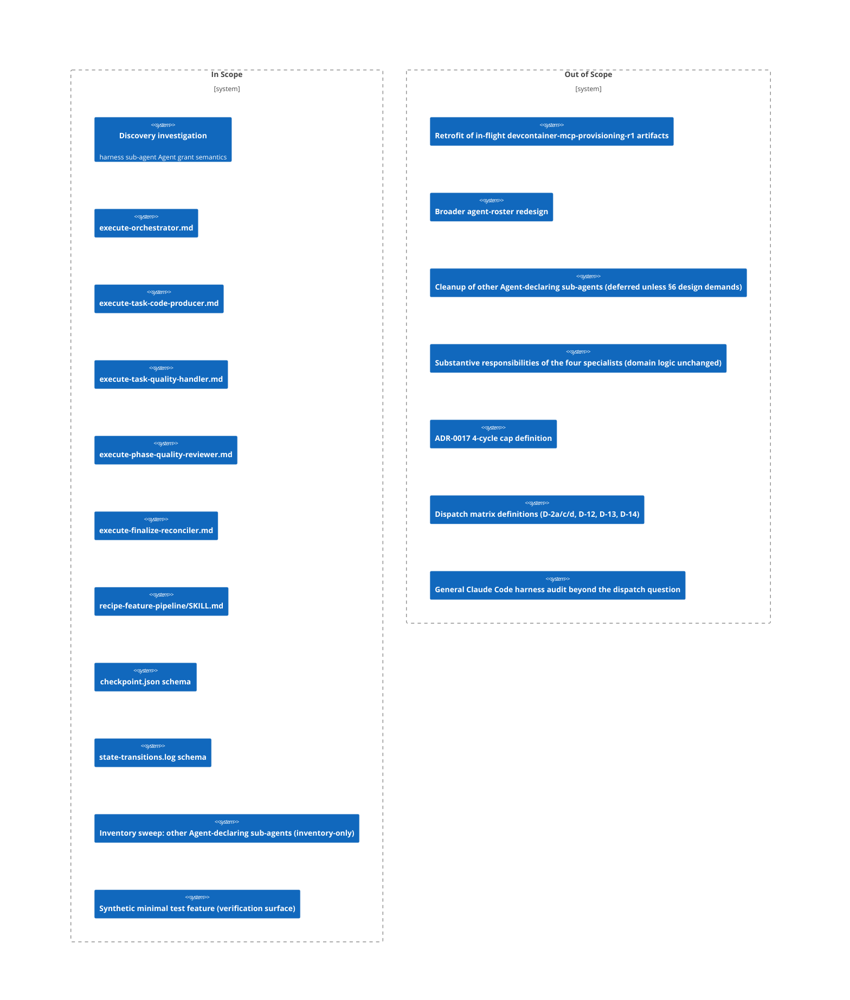

# PRD: execute-orchestrator Dispatch Mechanism Repair (r1)

## Contents

- [x] Overview
- [x] Stakeholders
- [x] User Stories
- [x] Functional Requirements
- [x] Non-Functional Requirements
- [x] Product Policy Decisions
- [x] Success Criteria
- [x] Technical Considerations
- [x] Rollout Plan
- [x] Undetermined Items
- [x] Appendix

## Overview

### One-line Summary

Restore the `execute-orchestrator` sub-agent's runtime dispatch capability — preceded by an in-pipeline investigation of Claude Code harness sub-agent tool-grant semantics — so the execution-side specialist-isolation pattern is exercisable end-to-end.

### Background

`Issues/analysis-execute-orchestrator-dispatch-limitation.md` (the canonical source analysis for this feature) documents a pipeline-wide defect: the `execute-orchestrator` sub-agent's frontmatter declares `tools: [Read, Glob, Grep, Write, Bash(python3:*), Agent, TaskUpdate]`, but at runtime its tool surface contains only `[Read, Write, Bash, Edit]`. `Agent`, `Glob`, `Grep`, and `TaskUpdate` are missing; `Edit` is present despite not being declared; the `Bash(python3:*)` scope restriction is stripped.

The hard consequence: `execute-orchestrator` cannot perform its single core responsibility — dispatching the four execution-side specialists (`execute-task-code-producer`, `execute-task-quality-handler`, `execute-phase-quality-reviewer`, `execute-finalize-reconciler`). The defect was surfaced twice during the `devcontainer-mcp-provisioning-r1` execution-pipeline start on 2026-05-23, and the parent recipe-feature-pipeline orchestrator proceeded via a workaround (direct parent-driven dispatch of the four specialists).

The workaround ships the feature but loses four load-bearing properties documented in analysis §3.2: (a) per-dispatch state-transition logging across distinct sub-agent boundaries; (b) per-task and per-phase cycle-counter enforcement against the ADR-0017 4-cycle cap; (c) dispatch-matrix routing through `execute-finalize-reconciler`; (d) ADR-0033 symmetric D-12 application. These are real audit-trail losses, not architectural cleanliness.

The Intent Clarification (status: ratified, user_token: gate-1-approved-as-is-2026-05-23T20:32:00Z) sequences this feature into two concerns: (1) an in-pipeline investigation determining whether sub-agent `Agent` dispatch is supported by the Claude Code harness at all; (2) a repair applying whichever of the three design options (flatten dispatch hierarchy / retire execute-orchestrator / Bash-script dispatch surface) the investigation outcome dictates. Two kill criteria gate the run: kill-criterion-#1 (investigation reveals one-flag fix → pause-and-rescope into a follow-on feature) and kill-criterion-#2 (investigation reveals harness-level restriction → commit to the FULL repair across all affected files).

This PRD draws directly from the source analysis and the ratified Intent Clarification; it does not re-derive the problem. References below carry the audit trail.

### Layer Scope

Per the Intent Clarification's 9-layer declaration (IC §"Layer Scope") and ratified at Gate 1, this feature touches the Claude Code / Project Filesystem layer only. The defect, the investigation surface, and every affected file live under `.claude/`, `adrs/`, and `working/feature/<slug>/`. The eight other layers are explicitly N/A.

- [x] **Claude Code / Project Filesystem** — sub-agent definitions, the recipe-feature-pipeline orchestrator skill, the checkpoint.json schema, and the state-transitions.log schema all live here. This is the sole activated layer.
- [ ] **Frontend** — N/A — out of scope. No UI surface is affected by the defect or the repair.
- [ ] **Backend** — N/A — out of scope. No backend service is affected.
- [ ] **API** — N/A — out of scope. No API contract is affected.
- [ ] **Query / Data Access** — N/A — out of scope. No data-access layer is affected.
- [ ] **Database** — N/A — out of scope. No schema is affected. The checkpoint.json and state-transitions.log are filesystem-resident pipeline-state artifacts, not database schemas; they belong to the `cc` layer.
- [ ] **CI/CD (GitHub Actions)** — N/A — out of scope. No workflow is affected.
- [ ] **Infrastructure as Code** — N/A — out of scope. No IaC module is affected.
- [ ] **Dev Environment (Codespaces / Devcontainer)** — N/A — out of scope. The devcontainer-mcp-provisioning-r1 run surfaced the defect, but the defect itself is in the dispatch mechanism, not the devcontainer layer.

## Stakeholders

### Stakeholder Inventory

| Stakeholder | Description | Primary Layer(s) | Relationship | Volume / Importance |
|-------------|-------------|------------------|--------------|---------------------|
| Pipeline operator | The user who runs the feature pipeline end-to-end (Josh-S-N2M is the current sole operator); wants execute-orchestrator's designed dispatch behavior restored so specialist-isolation, the audit trail, and cycle-cap enforcement are exercisable. | Claude Code | Direct user of the pipeline | Primary — sole user today |
| Future-feature execution pipelines | Every feature that reaches the execution stage after this repair; depends on the dispatch mechanism working as designed. Silent fallback to the parent-driven workaround in any future run re-incurs the audit-trail losses documented in analysis §3.2. | Claude Code | Downstream consumer of the repaired mechanism | High — every future execution run |
| Auditability / audit-trail consumers | Reviewers and architecture-auditors who read `state-transitions.log` and per-dispatch `checkpoint.json` transitions to verify Contract 5 specialist-isolation discipline, ADR-0017 cycle-cap compliance, and ADR-0033 symmetric D-12 application. | Claude Code | Reviewer | High — integrity of the audit-trail depends on this repair |
| The four execute-* specialist sub-agents | `execute-task-code-producer`, `execute-task-quality-handler`, `execute-phase-quality-reviewer`, `execute-finalize-reconciler`. Their existence is contingent on being dispatchable; their domain responsibilities persist regardless of which §6 option is chosen, but their tool grants and dispatch interfaces may change. | Claude Code | Affected sub-agents | High — directly affected by every §6 option |
| Design-side sub-agents that own ADRs and Blueprint | `design-composer`, per-layer `design-claude-code`, and the `shared-document-reviewer` consume ADRs and the Blueprint authored under the repaired dispatch convention. | Claude Code | Downstream design-time consumer | Medium — affected only at design time, not at runtime |

### Primary Users

The **pipeline operator** is the primary stakeholder for this release: the repair restores the designed dispatch capability they invoke through every feature pipeline run. The four execute-* specialist sub-agents and the audit-trail consumers are co-primary in the sense that their value is gated on the repair, but they do not initiate the work — the operator does.

## User Stories

### Pipeline Operator

```
As a pipeline operator
I want execute-orchestrator's runtime dispatch capability restored (or, if the harness forbids it, the dispatch mechanism redesigned around the harness constraint)
So that every future feature execution exercises the designed specialist-isolation pattern with full audit trail, cycle-cap enforcement, and dispatch-matrix routing.
```

```
As a pipeline operator
I want the dispatch repair to be preceded by an in-pipeline investigation of Claude Code harness sub-agent tool-grant semantics
So that the design choice is grounded in evidence of what the harness actually supports, not in speculation, and so the finding is captured as a project artifact that future Claude Code primitive design work can cite.
```

```
As a pipeline operator
I want the run to terminate cleanly (with a kill-criterion-1-triggered posture and a fresh follow-on feature opened) if the investigation reveals a one-flag fix
So that I am not exposed to a silent mid-run scope shrink from FULL to PATCH that would invalidate downstream artifact assumptions and bypass my gating discipline.
```

### Audit-trail consumer

```
As an audit-trail consumer
I want every per-task and per-phase dispatch to emit its own state-transitions.log entry across a distinct sub-agent context
So that I can read the log and verify Contract 5 specialist-isolation, ADR-0017 cycle-cap compliance, and ADR-0033 symmetric D-12 application without ambiguity introduced by inlined verdicts.
```

### Use Cases

1. **Pipeline operator runs a synthetic minimal test feature against the repaired dispatch mechanism.** The state-transitions.log emits cleanly across distinct sub-agent dispatch boundaries; cycle counters increment at per-task and per-phase boundaries as designed; the dispatch matrix routes through `execute-finalize-reconciler` rather than being applied inline.
2. **Discovery Research reveals sub-agent `Agent` dispatch IS supported by the harness (kill-criterion-#1).** The run terminates cleanly; the finding is captured as a project analysis artifact; a fresh follow-on feature is opened for the one-flag fix. No silent mid-run scope-shrink occurs.
3. **Discovery Research reveals sub-agent `Agent` dispatch IS NOT supported by the harness (kill-criterion-#2).** The per-layer `cc` Design selects among the three §6 options, constrained by the investigation outcome and by the specialist-isolation invariants; the repair is realized across the affected files; the synthetic minimal test feature verifies the new dispatch loop end-to-end.
4. **A future feature execution pipeline runs the repaired dispatch mechanism end-to-end.** Each specialist sub-agent dispatch produces its own state-transitions.log entry; per-task and per-phase cycle counters enforce the ADR-0017 4-cycle cap at the correct boundaries; quality verdicts (APPROVED / NEEDS_REVISION / STUB_DETECTED / BLOCKER per D-2a/c/d) are issued by `execute-task-quality-handler` rather than inlined.

### User Journey Diagram

```mermaid
journey
    title execute-orchestrator dispatch repair — operator journey
    section Investigation
      Approve scope, layer, kill-criteria at Intent Gate: 5: operator
      Discovery Research investigates harness sub-agent Agent grant: 4: operator, discovery agents
      Read investigation finding: 5: operator
    section Decision branch
      Kill-criterion-#1 triggers, run terminates cleanly: 4: operator
      Kill-criterion-#2 triggers, FULL repair proceeds: 4: operator
    section Repair (kill-criterion-#2 path)
      Per-layer cc Design selects §6 option: 4: operator, design agents
      ADR captures chosen option: 5: operator
      Implementation across affected files: 4: operator, plan/execution agents
    section Verification
      Synthetic minimal test feature dispatch loop PASSES: 5: operator
      Optional real-feature re-run as confidence check: 5: operator
```

### Scope Boundary Diagram



## Functional Requirements

ACs are in EARS format per the five canonical patterns (Event-driven `When`, State-driven `While`, Optional `Where`, Unwanted `If-then`, Ubiquitous). All FR ACs are observable at the Claude Code / Project Filesystem layer (`cc`).

### Must Have (P1 - MVP)

- [ ] **FR-1** — In-pipeline Discovery Research investigation of harness sub-agent tool-grant semantics — Stakeholder: pipeline operator, future-feature execution pipelines — Layer: Claude Code

  The pipeline shall perform an in-pipeline Discovery Research investigation as a fan-out topic with KB-gap justification "Claude Code harness sub-agent tool-grant semantics are not documented in our KBs" before committing to any of the three §6 design options. The investigation determines whether sub-agent `Agent` dispatch is supported by the harness at all (per IC Q2 ratified answer).

  - AC-FR-1-a: When the Discovery Planning stage runs for this feature, the system shall emit at least one research topic with `disposition: external-research-topic` and `kb_gap_justification` naming the Claude Code harness sub-agent tool-grant semantics gap.
  - AC-FR-1-b: When the Discovery Research stage completes, the system shall produce a finding-with-evidence artifact that distinguishes harness-level restriction from frontmatter-parsing bug from one-flag-fix, citing the harness documentation reviewed and the probe sub-agent result.
  - AC-FR-1-c: The system shall not advance to per-layer `cc` Design until the investigation finding artifact exists and is referenced by the Synthesis output.

- [ ] **FR-2** — Kill-criterion-#1 pause-and-rescope behavior — Stakeholder: pipeline operator — Layer: Claude Code

  If the investigation reveals that sub-agent `Agent` dispatch IS supported by the harness (i.e., a frontmatter syntax change or harness flag enables it), the run shall terminate cleanly with a `kill-criterion-1-triggered` posture rather than silently shrinking scope from FULL to PATCH mid-run (per IC Q3 ratified answer). The finding is captured as an analysis artifact; a fresh small follow-on feature is opened for the one-flag fix.

  - AC-FR-2-a: If the Discovery Research finding artifact records `dispatch_supported: true`, then the system shall halt the run at the next pipeline gate, emit a `kill-criterion-1-triggered` posture marker to the checkpoint and state-transitions log, and produce an analysis artifact under `Issues/` documenting the finding.
  - AC-FR-2-b: If `kill-criterion-1-triggered` is emitted, then the system shall not advance to per-layer `cc` Design, ADR authorship, Plan authoring, or Execution within the current run.
  - AC-FR-2-c: When `kill-criterion-1-triggered` is emitted, the system shall record a forward pointer to a fresh follow-on feature slug for the one-flag fix in the analysis artifact (the actual creation of the follow-on feature happens outside this run's scope).

- [ ] **FR-3** — Per-layer `cc` Design selects among the three §6 options under explicit constraints — Stakeholder: pipeline operator, the four execute-* specialists — Layer: Claude Code

  Conditional on the investigation outcome being kill-criterion-#2 (`dispatch_supported: false`), the per-layer `cc` Design shall select among the three §6 design options: (a) flatten the dispatch hierarchy so the top-level recipe-feature-pipeline orchestrator directly dispatches the four specialists; (b) retire `execute-orchestrator` and move its state-machine logic into `recipe-feature-pipeline`; (c) use Bash-script dispatch surface where `execute-orchestrator` dispatches scripts that invoke specialists via another mechanism. The selection rationale shall explicitly weigh the workaround-acceptability constraint against the specialist-isolation load-bearing constraint (per IC Q5 ratified answer — the PRD records both as constraints; the design resolves them).

  - AC-FR-3-a: Where the investigation outcome is kill-criterion-#2, the per-layer `cc` Design subsection shall name exactly one chosen option from {flatten-hierarchy, retire-execute-orchestrator, bash-script-dispatch} and shall record the rationale tying the choice to (i) the investigation finding, (ii) the specialist-isolation invariants enumerated in the Constraints section.
  - AC-FR-3-b: Where the investigation outcome is kill-criterion-#2, the per-layer `cc` Design shall preserve the four specialists' substantive domain responsibilities (code production, quality handling, phase quality review, finalize reconciliation) regardless of which option is chosen — only their tool grants, dispatch interfaces, and parent orchestrator may change.
  - AC-FR-3-c: Where the investigation outcome is kill-criterion-#2, the chosen option shall preserve the ADR-0017 4-cycle cap, the dispatch matrix definitions (D-2a/c/d, D-12, D-13, D-14), and the ADR-0033 symmetric D-12 application as load-bearing invariants — the repair shall not redefine them.

- [ ] **FR-4** — Implementation across the affected-files inventory — Stakeholder: pipeline operator, audit-trail consumers — Layer: Claude Code

  Conditional on kill-criterion-#2, the implementation shall realize the chosen §6 option across the affected-files inventory enumerated in source analysis §6 (per the IC's in-scope statement). The PRD enumerates the inventory; the per-layer Design and plan-author decide which option's edits touch which specific files.

  Affected-files inventory (touched-or-may-be-touched surface):

  1. `.claude/skills/recipe-feature-pipeline/SKILL.md`
  2. `.claude/agents/execute-orchestrator.md`
  3. `.claude/agents/execute-task-code-producer.md`
  4. `.claude/agents/execute-task-quality-handler.md`
  5. `.claude/agents/execute-phase-quality-reviewer.md`
  6. `.claude/agents/execute-finalize-reconciler.md`
  7. `checkpoint.json` schema (specifically the `execution_pipeline_state_transitions` and `execution_mode` fields, per the IC frontmatter cross-reference)
  8. `state-transitions.log` schema/format

  - AC-FR-4-a: Where the investigation outcome is kill-criterion-#2, the chosen option's implementation shall result in edits to at most the eight files in the affected-files inventory; any edit to a file outside this inventory shall be surfaced as an open item to the user before being applied.
  - AC-FR-4-b: Where the chosen option modifies the `checkpoint.json` schema (`execution_pipeline_state_transitions` or `execution_mode` fields) or the `state-transitions.log` format, the implementation shall update the canonical schema reference in `recipe-feature-pipeline/SKILL.md` in the same commit set.
  - AC-FR-4-c: The system shall not modify the four specialists' substantive domain responsibilities — code production, quality handling, phase quality review, finalize reconciliation — regardless of which option is implemented (this restates FR-3-b at the implementation layer for cross-artifact traceability).

- [ ] **FR-5** — Inventory sweep of other Agent-declaring sub-agents — Stakeholder: pipeline operator, future-feature execution pipelines — Layer: Claude Code

  The implementation shall produce an inventory artifact enumerating all sub-agents in `.claude/agents/*.md` that declare `Agent` in their `tools:` frontmatter array (per IC Open Item #3 and source analysis §2). The sweep is inventory-only in this run; any required cleanup is deferred to a follow-on feature unless the chosen §6 design demands cleanup for correctness (in which case it is brought back in-scope via an open-item user check).

  - AC-FR-5-a: When the implementation phase completes, the system shall produce an inventory artifact (location: `working/feature/execute-orchestrator-dispatch-mechanism-repair-r1/agent-tool-grant-inventory.md` or equivalent) listing every `.claude/agents/*.md` file with `Agent` in its `tools:` array, the declared tool list, and a note on whether the chosen §6 design impacts that file's dispatch posture.
  - AC-FR-5-b: If the chosen §6 design demands cleanup of one or more Agent-declaring sub-agents for correctness, then the system shall surface those files as an open-item user check before applying the cleanup; the cleanup shall not be applied silently as part of this run.

- [ ] **FR-6** — Verification via a synthetic minimal test feature — Stakeholder: pipeline operator, audit-trail consumers — Layer: Claude Code

  The implementation shall be verified primarily by running a synthetic minimal test feature (1 phase, 1–2 tasks; exact shape decided by plan-author per IC Open Item #5) through the repaired or redesigned dispatch mechanism. A real-feature re-run is welcome as a confidence check but is non-gating (per IC Q6 ratified answer).

  - AC-FR-6-a: When the synthetic minimal test feature runs end-to-end through the (repaired or redesigned) dispatch mechanism, the system shall emit a `state-transitions.log` containing at least one entry per specialist sub-agent dispatch boundary, with each entry attributable to a distinct sub-agent context.
  - AC-FR-6-b: When the synthetic minimal test feature runs end-to-end, the system shall increment per-task and per-phase cycle counters at the boundaries defined by ADR-0017 and ADR-0033 (D-12 symmetric application), and the counters shall be observable in `checkpoint.json`.
  - AC-FR-6-c: If the synthetic minimal test feature's dispatch loop fails (e.g., the dispatch mechanism stalls at the same boundary as the original defect), then the system shall surface this as a `verification-failed` posture and shall not declare the feature complete.

### Should Have (P2)

- [ ] **FR-7** — Real-feature re-run as a confidence check — Stakeholder: pipeline operator — Layer: Claude Code

  After the synthetic minimal test feature passes, the implementation MAY be re-verified by re-running a real feature (or a slice of one) through the dispatch mechanism. This is a confidence check, not a gating verification (per IC Q6 ratified answer); failure of this step does not block feature completion if FR-6 has passed.

  - AC-FR-7-a: Where the operator elects to run a real-feature re-run, the system shall record the re-run outcome in a verification log alongside the synthetic test result; the verification log shall name explicitly which result is gating and which is the confidence check.

### Could Have (P3)

- [ ] **FR-8** — ADR for project-wide convention on sub-agent `Agent` declarations — Stakeholder: future-feature execution pipelines, design-side sub-agents — Layer: Claude Code

  If the investigation outcome (kill-criterion-#2) establishes that sub-agent `Agent` dispatch is harness-restricted, a second ADR MAY be authored capturing a project-wide convention (e.g., "sub-agents in this project MUST NOT declare `Agent` in their `tools:` frontmatter array"). The PRD does not prescribe ADR count — `design-composer` decides per IC Open Item #4.

  - AC-FR-8-a: Where the investigation outcome is kill-criterion-#2 AND `design-composer` determines a project-wide convention is warranted, the system shall produce an ADR documenting the convention with explicit linkage to the investigation finding and to the chosen §6 option.

### Won't Have (this release)

- Retrofit of the in-flight `devcontainer-mcp-provisioning-r1` artifacts (state-transitions.log, checkpoint.json) into any new schema format. Per the IC's "What's NOT in scope" rule and the resolution of IC Open Item #6 in this PRD's Product Policy Decisions section, those artifacts remain as-shipped under the old format and are not migrated.
- Broader agent-roster redesign. The pipeline-gap memory cluster (per-agent design evaluation gap, ADR placement gap, auditing family graduation review) is acknowledged but addressed by separate follow-up features.
- Cleanup of other Agent-declaring sub-agents (beyond the inventory sweep in FR-5). Deferred to a follow-on feature unless the chosen §6 design demands it (in which case FR-5-b triggers a user check, not silent cleanup).
- Modifications to the four specialists' substantive domain responsibilities.
- Changes to ADR-0017's 4-cycle cap or to the dispatch matrix definitions (D-2a/c/d, D-12, D-13, D-14). The repair preserves these as load-bearing invariants.
- A general Claude Code harness audit beyond what is needed to answer the dispatch question.

## Non-Functional Requirements

### Reliability

- **Dispatch-loop stability under the synthetic test:** the repaired or redesigned dispatch mechanism shall run the synthetic minimal test feature end-to-end without stalling at the boundary that the original defect produced (`execute-orchestrator` invoked but unable to dispatch any specialist). Rationale: the synthetic test is the primary verification surface; a stable dispatch loop here is the binary signal that the repair worked.

  - AC-NFR-1-a: When the synthetic minimal test feature is run on the repaired mechanism, the system shall complete all task and phase boundaries without reverting to a parent-driven workaround fallback.
  - AC-NFR-1-b: If the dispatch mechanism cannot complete a task or phase boundary, then the system shall surface the failure explicitly (per FR-6-c) rather than silently falling back to a parent-driven workaround.

### Observability / Audit Trail

- **Per-dispatch state-transition logging:** every specialist dispatch shall emit its own entry to `state-transitions.log`, attributable to a distinct sub-agent context. Rationale: per analysis §3.2, this is one of four load-bearing properties lost under the workaround; restoring it is the audit-trail signal that the repair is effective.

  - AC-NFR-2-a: The system shall emit at least one `state-transitions.log` entry per specialist sub-agent dispatch boundary during execution-phase runs.
  - AC-NFR-2-b: While a specialist dispatch is in progress, the system shall preserve the dispatching sub-agent's identity in the log entry such that an audit-trail consumer can distinguish dispatches issued by `execute-orchestrator` (or its replacement per chosen §6 option) from dispatches issued by the parent recipe-feature-pipeline orchestrator.

- **Per-task and per-phase cycle-counter visibility:** `checkpoint.json` shall record cycle-counter increments at the correct boundaries. Rationale: ADR-0017's 4-cycle cap and ADR-0033's symmetric D-12 application both depend on the counters incrementing at distinct dispatches rather than being collapsed into a single agent context.

  - AC-NFR-3-a: When a task or phase boundary is crossed during an execution-phase run, the system shall increment the corresponding cycle counter in `checkpoint.json` to reflect the new dispatch context.
  - AC-NFR-3-b: If a cycle counter exceeds the ADR-0017 4-cycle cap, then the system shall halt the run and route the finding through `execute-finalize-reconciler` (or its replacement under the chosen §6 option) rather than silently continuing.

### Maintainability

- **Investigation finding preserved as a citable artifact:** the Discovery Research outcome shall be captured as a project artifact (analysis or ADR) such that future Claude Code primitive design work can cite it without re-discovering the answer. Rationale: per IC Success Posture item 2, the project shall not have to re-discover whether sub-agent `Agent` dispatch is supported.

  - AC-NFR-4-a: When the investigation completes, the system shall produce a finding artifact under `Issues/` or `adrs/` with a stable identifier that downstream features and ADRs can cite.

- **Schema reference consistency:** if the chosen §6 option modifies the `checkpoint.json` schema or `state-transitions.log` format, the canonical schema reference in `recipe-feature-pipeline/SKILL.md` shall be updated in the same commit set (per FR-4-b). Rationale: schema drift between the canonical reference and the actual schema is a recurring source of pipeline defects (see the pipeline-gap memory cluster).

  - AC-NFR-5-a: The system shall not allow `checkpoint.json` schema changes or `state-transitions.log` format changes to be merged without a corresponding update to the canonical reference in `recipe-feature-pipeline/SKILL.md`.

### Compatibility

- **Backward compatibility with in-flight artifacts:** the in-flight `devcontainer-mcp-provisioning-r1` artifacts (its `state-transitions.log` and `checkpoint.json`) shall be left as-shipped under the old format per the "no retrofit" out-of-scope rule. Rationale: per IC Open Item #6, retrofitting in-flight artifacts is explicitly out of scope; the workaround-shipped artifacts stay valid for their original audit purpose.

  - AC-NFR-6-a: The system shall not modify the `devcontainer-mcp-provisioning-r1` artifacts as part of this feature's implementation, even if the chosen §6 option introduces a new schema version.
  - AC-NFR-6-b: Where the chosen §6 option introduces a new schema version for `checkpoint.json` or `state-transitions.log`, the system shall mark the new version such that downstream consumers can distinguish old-format from new-format artifacts.

### Performance

- N/A — out of scope. The dispatch mechanism is invoked at human-timescale pipeline operation; there is no latency budget that the user has established for this feature. Per IC Q4 ratified layer scope, performance is not a primary concern.

### Security

- N/A — out of scope. The dispatch mechanism does not touch credentials, PII, or external network surfaces. The investigation reads Claude Code documentation and runs a probe sub-agent inside the harness; no credential exposure surface is created.

### Scalability

- N/A — out of scope. The dispatch mechanism is single-tenant (per-pipeline-operator); no growth assumptions apply.

### Accessibility

- N/A — out of scope. No UI surface.

### Data

- N/A — out of scope as a product concern. The `checkpoint.json` and `state-transitions.log` are pipeline-internal state artifacts, not user-facing data. Schema discipline for those artifacts is captured under Maintainability (NFR-5) and Compatibility (NFR-6), not under Data.

### Operability

- See Observability above (per-dispatch state-transition logging, cycle-counter visibility). The dispatch mechanism's operability surface is its log output and checkpoint state; both are already covered.

### Developer Experience

- **Synthetic test feature as a regression artifact:** the synthetic minimal test feature produced for FR-6 verification SHOULD be archived under `working/test-features/` or equivalent so that future dispatch-mechanism changes can re-run it as a regression check.

  - AC-NFR-7-a: Where the synthetic minimal test feature passes FR-6 verification, the system shall preserve it as an archived test artifact rather than discarding it after the run.

## Product Policy Decisions

| Policy Area | Decision | Rationale | Affected Layers |
|-------------|----------|-----------|-----------------|
| Investigation cadence | In-pipeline Discovery Research, not pre-pipeline preflight (per IC Q2 ratified) | The harness sub-agent tool-grant question genuinely needs documentation review plus a minimal probe sub-agent test; both are research activities the pipeline's Discovery stage is designed for. Gating it behind a pre-feature preflight delays the feature and creates an unscoped side-quest with no audit trail. | Claude Code |
| Kill-criterion-#1 activation | Pause-and-rescope into a follow-on feature; not silent mid-run scope-shrink (per IC Q3 ratified) | Scope-class shrinks from FULL to MINOR/PATCH would invalidate downstream artifact assumptions (per-layer design count, ADR count, plan phase count). Cleaner to terminate this run with a `kill-criterion-1-triggered` posture, capture the finding, and open a fresh feature for the one-flag fix. | Claude Code |
| Workaround vs. specialist-isolation tension | Record BOTH as constraints to be resolved at per-layer `cc` Design; do NOT pre-decide in the PRD (per IC Q5 ratified) | The §6 design options explicitly include "execute-orchestrator gets retired or restructured" (which makes the workaround the long-term pattern) AND "specialist isolation is load-bearing for auditability, cycle-cap enforcement, dispatch matrix, ADR-0033 symmetric D-12 application" (which makes the workaround unacceptable). The investigation outcome and per-layer `cc` Design must resolve the tension. | Claude Code |
| Verification surface | Synthetic minimal test feature is the primary verification; real-feature re-run is welcome but non-gating (per IC Q6 ratified) | The defect is at the harness/dispatch primitive level; a 1-task / 1-phase synthetic feature exercises the same dispatch path as a multi-phase real feature. Real-feature re-runs are expensive and add unrelated failure modes that confound the verification signal. | Claude Code |
| Sweep posture for other Agent-declaring sub-agents | Inventory-only in this run; cleanup deferred unless the chosen §6 design demands it (per IC Open Item #3 ratified) | A broader sweep-and-cleanup would expand scope beyond the dispatch-mechanism repair. The inventory surfaces the affected surface for a future follow-on feature. Cleanup-as-blocker is reserved for the case where the chosen §6 design depends on it. | Claude Code |
| In-flight artifact retrofit | The `devcontainer-mcp-provisioning-r1` `state-transitions.log` and `checkpoint.json` artifacts are left as-shipped under the old format; not migrated; not formally marked legacy (per IC Open Item #6 resolved here) | Per the "no retrofit" out-of-scope rule, retrofitting in-flight artifacts expands scope and introduces churn. Leaving them as-shipped preserves their audit value for the original feature without bleeding into this feature's scope. If a future feature needs them in the new schema, that's that future feature's scope, not this one's. | Claude Code |
| Contributor / agent access | The repair touches sub-agent definitions and the `recipe-feature-pipeline/SKILL.md` orchestrator skill; these are project conventions read by the Claude Code coding agent (the pipeline operator's session). No external contributor access policy changes. | The defect and the repair are entirely internal to the Claude Code primitives surface; no third-party contributor or agent gains access via this feature. | Claude Code |

## Success Criteria

### Quantitative Metrics

| Metric | Stakeholder | Target | Measurement Method | Timeframe |
|--------|-------------|--------|--------------------|-----------|
| Synthetic minimal test feature dispatch loop completion | Pipeline operator, audit-trail consumers | 100% completion through all task and phase boundaries on the repaired mechanism (kill-criterion-#2 path) | Run the synthetic test feature end-to-end; check that `state-transitions.log` emits one entry per specialist dispatch boundary and `checkpoint.json` cycle counters increment at the correct boundaries | At verification (FR-6) |
| State-transitions.log entries per specialist dispatch | Audit-trail consumers | At least one log entry per specialist sub-agent dispatch, distinct from the dispatching parent | Read the log emitted during the synthetic test feature run; count entries grouped by sub-agent identity | At verification (FR-6) |
| Cycle-counter increments at task and phase boundaries | Audit-trail consumers, future-feature execution pipelines | Counters increment at every task and phase boundary as defined by ADR-0017 and ADR-0033 (D-12 symmetric application) | Read `checkpoint.json` after the synthetic test feature run; verify counter values match the expected boundary count | At verification (FR-6) |
| Investigation finding artifact existence | Future Claude Code primitive design work | Exactly one citable artifact under `Issues/` or `adrs/` documenting whether sub-agent `Agent` dispatch is supported | Check the filesystem for the finding artifact at the path recorded in the Discovery Research output | At end of Discovery Research |

### Qualitative Metrics

1. **Operator confidence that future execution pipelines exercise the designed specialist-isolation pattern** — pipeline operator. Measured by: the operator reads the synthetic test feature's `state-transitions.log` and `checkpoint.json` and confirms the audit-trail properties documented in analysis §3.2 are restored.
2. **Auditability of execution-phase runs** — audit-trail consumers. Measured by: an audit-trail consumer reads a future execution-phase run's logs and can attribute every dispatch to a distinct sub-agent context without ambiguity introduced by inlined verdicts.
3. **Project does not re-discover the harness sub-agent dispatch question** — future Claude Code primitive design work. Measured by: future Discovery Research topics in this project area cite the finding artifact rather than re-running the same investigation.

### Operational Metrics

1. **Run termination cleanliness on kill-criterion-#1** — if the investigation triggers kill-criterion-#1, the run shall halt cleanly with the posture marker emitted, no partial implementation applied, and a follow-on feature pointer recorded.
2. **Schema reference consistency** — `recipe-feature-pipeline/SKILL.md`'s canonical schema reference matches the actual `checkpoint.json` and `state-transitions.log` schemas at the end of the run.

### Developer Experience Metrics

1. **Synthetic test feature reusable as a regression artifact** — measured by: the synthetic test feature is archived under a location that future dispatch-mechanism changes can re-run it from.

## Technical Considerations

### Dependencies

- **Claude Code harness sub-agent tool-grant semantics** — external service / runtime. Documentation review is part of the in-pipeline investigation (FR-1). The pipeline depends on whatever the harness actually supports, which is what the investigation determines.
- **Existing execution-side specialist sub-agents** — internal. `execute-task-code-producer.md`, `execute-task-quality-handler.md`, `execute-phase-quality-reviewer.md`, `execute-finalize-reconciler.md` exist and their domain responsibilities are stable; this feature may change their tool grants and dispatch interfaces but not their substantive domain responsibilities (per FR-3-b and FR-4-c).
- **Existing recipe-feature-pipeline orchestrator skill** — internal. `recipe-feature-pipeline/SKILL.md` exists and carries the canonical 12-state machine reference; this feature may modify it depending on the chosen §6 option.
- **Existing ADRs ADR-0017 (4-cycle cap) and ADR-0033 (symmetric D-12 application)** — internal. The repair preserves these as load-bearing invariants and does not redefine them.
- **Source analysis** — internal. `Issues/analysis-execute-orchestrator-dispatch-limitation.md` is the canonical analysis; this feature is the recommended follow-up per analysis §6.

### Constraints

- **Technical constraints:**
  - The chosen §6 option must preserve the four specialists' substantive domain responsibilities (FR-3-b, FR-4-c).
  - The chosen §6 option must preserve the ADR-0017 4-cycle cap and the dispatch matrix definitions (FR-3-c).
  - The chosen §6 option must preserve the ADR-0033 symmetric D-12 application (FR-3-c).
  - The implementation is limited to the eight files in the affected-files inventory (FR-4); any edit outside this inventory requires a user-check open item.

- **Constraint tension preserved (per IC Q5 ratified — not pre-resolved in the PRD):**
  - Constraint A — workaround acceptability: the parent-orchestrator-driven workaround used in `devcontainer-mcp-provisioning-r1` is *acceptable as a shipping vehicle* (the feature was shipped under it). One of the three §6 options (retire `execute-orchestrator` into `recipe-feature-pipeline`) effectively blesses the workaround as the design intent.
  - Constraint B — specialist-isolation load-bearing: per analysis §3.1, specialist isolation is load-bearing for (i) auditability via per-dispatch state-transition logging, (ii) cycle-cap enforcement per ADR-0017 at per-task and per-phase boundaries, (iii) dispatch matrix routing through `execute-finalize-reconciler`, (iv) ADR-0033 symmetric D-12 application. A pattern that collapses these into a single parent context loses all four properties.
  - The per-layer `cc` Design resolves the tension by choosing among the §6 options; this PRD does not pre-decide. The chosen option's rationale (per AC-FR-3-a) must explicitly weigh both constraints.

- **Resource constraints:** the feature operates within the existing pipeline-operator's single-session capacity. No additional infrastructure or team resources are required.

- **Time constraints:** none externally imposed. The feature is event-triggered on operator prioritization per the deferral register cross-reference in source analysis §8.

- **Regulatory / contractual constraints:** none.

### Assumptions

- [ ] The Claude Code harness behavior on sub-agent tool grants is determinable by documentation review plus a minimal probe sub-agent test — Validation: the in-pipeline Discovery Research (FR-1) — Owner: Discovery Research stage — By: end of Discovery Research.
- [ ] The four execute-* specialist sub-agents' substantive domain responsibilities are stable and do not need redesign as part of this repair — Validation: source analysis §6 explicitly excludes redesigning their responsibilities; the per-layer `cc` Design re-validates this assumption — Owner: per-layer `cc` Design — By: end of per-layer `cc` Design.
- [ ] The synthetic minimal test feature can exercise the same dispatch path as a multi-phase real feature (per IC Q6 ratified) — Validation: plan-author defines the synthetic test feature shape and the test execution confirms the assumption — Owner: plan-author and verification execution — By: end of execution phase.
- [ ] The `recipe-feature-pipeline/SKILL.md` orchestrator skill is the correct location for any moved or restructured state-machine logic (assumed by §6 design option (b) — retire `execute-orchestrator` into `recipe-feature-pipeline`) — Validation: per-layer `cc` Design considers this assumption explicitly when evaluating option (b) — Owner: per-layer `cc` Design — By: end of per-layer `cc` Design.

### Risks and Mitigation

| Risk | Stakeholder Affected | Impact | Probability | Mitigation |
|------|----------------------|--------|-------------|------------|
| The investigation is inconclusive (neither confirms nor refutes harness restriction) | Pipeline operator | High — blocks the kill-criterion-#1 vs. #2 branch decision | Medium | Per FR-1-c, the system does not advance to per-layer `cc` Design until the investigation finding artifact exists; if inconclusive, the operator pauses the run and surfaces the ambiguity as an open item before re-running Discovery Research with a refined probe |
| The chosen §6 option breaks one of the load-bearing invariants (ADR-0017 4-cycle cap, dispatch matrix, ADR-0033 D-12) | Audit-trail consumers, future-feature execution pipelines | High | Low — explicitly forbidden by FR-3-c | The per-layer `cc` Design must record the rationale tying the chosen option to the preserved invariants (AC-FR-3-c); the architecture audit pass catches violations |
| The implementation touches files outside the affected-files inventory | Pipeline operator | Medium — scope creep | Medium | Per AC-FR-4-a, any edit outside the inventory is surfaced as an open item to the user before being applied |
| The sweep inventory (FR-5) reveals other Agent-declaring sub-agents that block the chosen §6 design | Pipeline operator, the affected sub-agents | Medium | Medium | Per AC-FR-5-b, cleanup-as-blocker is surfaced as an open-item user check rather than applied silently; the user can choose to bring cleanup in-scope or defer |
| The synthetic minimal test feature verification fails on the repaired mechanism | Pipeline operator, audit-trail consumers | High — verification gate fails | Low — the repair was just designed against the investigation finding | Per AC-FR-6-c, the system surfaces `verification-failed` rather than declaring complete; the per-layer `cc` Design is re-engaged to diagnose |
| Kill-criterion-#1 triggers and the operator misses the pause-and-rescope signal | Pipeline operator | High — scope-shrink confusion | Low | Per FR-2-a, the `kill-criterion-1-triggered` posture marker is emitted to checkpoint and state-transitions log; per FR-2-b, the system halts at the next gate rather than continuing |

## Rollout Plan

This feature operates on a single project's internal Claude Code primitives surface; there is no end-user rollout in the conventional sense.

- **Launch audience progression:** the repaired or redesigned dispatch mechanism is exercised first by the synthetic minimal test feature (FR-6), then optionally by a real-feature re-run as a confidence check (FR-7), then by any future feature pipeline execution. There is no staged rollout to external audiences.

- **Communication plan:** the investigation finding artifact (per FR-1-b and NFR-4-a) and the ADR(s) authored by `design-composer` (per IC Open Item #4 and FR-8) constitute the communication surface. Future Claude Code primitive design work cites these.

- **Migration path:** none for in-flight artifacts (per NFR-6-a and the Product Policy Decisions table). Future features benefit from the repaired mechanism without any explicit migration step.

- **Kill criteria:**
  - **Kill-criterion-#1** (per FR-2): if Discovery Research reveals sub-agent `Agent` dispatch IS supported by the harness, the run terminates cleanly with the `kill-criterion-1-triggered` posture; a fresh follow-on feature is opened for the one-flag fix.
  - **Kill-criterion-#2** (per FR-3 and source analysis §6): if Discovery Research reveals sub-agent `Agent` dispatch IS NOT supported, the run commits to the FULL repair via the chosen §6 option.
  - **Verification failure** (per AC-FR-6-c): if the synthetic minimal test feature dispatch loop fails on the repaired mechanism, the run surfaces `verification-failed` and the per-layer `cc` Design is re-engaged.

## Undetermined Items

Each item below carries forward from the Intent Clarification's seven Open Items. Items that this PRD resolved are marked with the resolution location; items genuinely deferred to downstream stages carry a forward pointer.

- [x] **IC Open Item #1 — Investigation outcome dependency.** Resolved in this PRD: FR-1 (investigation as a fan-out Discovery topic with KB-gap justification) and FR-2 (kill-criterion-#1 pause-and-rescope path) jointly capture the dependency. The PRD is authored against the FULL scope-class (kill-criterion-#2 path) with FR-2 as the explicit alternative-branch behavior.

- [x] **IC Open Item #2 — Constraint tension between workaround-acceptability and specialist-isolation invariants.** Resolved in this PRD's Constraints section as Constraint A and Constraint B; the tension is preserved (not pre-decided). The per-layer `cc` Design resolves it per AC-FR-3-a. Forward pointer: per-layer `cc` Design subsection of the Blueprint.

- [x] **IC Open Item #3 — Sweep of other `Agent`-declaring sub-agents.** Resolved in this PRD: FR-5 ratifies the IC's recommended posture (inventory-only in this run; cleanup deferred unless §6 design demands it via AC-FR-5-b user check). Forward pointer: plan-author decides where in the plan FR-5's inventory artifact is produced.

- [ ] **IC Open Item #4 — ADR count and scope.** Deferred to `design-composer` per IC's framing. FR-8 captures the *option* of a second ADR (project-wide convention on sub-agent `Agent` declarations) conditional on kill-criterion-#2 and `design-composer`'s judgment. Forward pointer: `design-composer` during Design Composition.

- [ ] **IC Open Item #5 — Synthetic-test-feature shape.** Deferred to plan-author per IC's framing. FR-6 names the synthetic minimal test feature as the verification surface; the task count, phase count, and minimal real code work it produces are plan-author decisions. Forward pointer: plan-author.

- [x] **IC Open Item #6 — Schema migration concern for in-flight artifacts.** Resolved in this PRD's Product Policy Decisions table: the in-flight `devcontainer-mcp-provisioning-r1` artifacts are left as-shipped under the old format; not migrated; not formally marked legacy. NFR-6-a and NFR-6-b capture the consequences. The IC's recommendation ("left as-is") is ratified.

- [ ] **IC Open Item #7 — Memory note candidate for the "sub-agent declares Agent in frontmatter but runtime grant strips it" pattern.** Deferred to `design-composer`'s memory-discipline decision per IC's framing. Conditional on kill-criterion-#2, a persistent memory note for future Claude Code primitive design work is warranted. Forward pointer: `design-composer`.

## Appendix

### References

- **Canonical source analysis:** `Issues/analysis-execute-orchestrator-dispatch-limitation.md` (the analysis that proposed this feature; cites the evidence base in §1, affected agents in §2, behavioral consequences in §3, root-cause hypotheses in §4, workaround posture in §5, recommended follow-up framing in §6, scope discipline in §7, cross-references in §8).
- **Ratified Intent Clarification:** `working/feature/execute-orchestrator-dispatch-mechanism-repair-r1/intent-clarification.md` (status: `ratified`; user_token: `gate-1-approved-as-is-2026-05-23T20:32:00Z`; the six clarifying questions and seven open items are the canonical predecessor decisions).
- **Affected agent definitions:** `.claude/agents/execute-orchestrator.md`, `.claude/agents/execute-task-code-producer.md`, `.claude/agents/execute-task-quality-handler.md`, `.claude/agents/execute-phase-quality-reviewer.md`, `.claude/agents/execute-finalize-reconciler.md`.
- **Affected orchestrator skill:** `.claude/skills/recipe-feature-pipeline/SKILL.md`.
- **Affected schema-bearing artifacts (referenced as in-flight examples; not retrofitted):** `working/feature/devcontainer-mcp-provisioning-r1/state-transitions.log`, `working/feature/devcontainer-mcp-provisioning-r1/checkpoint.json`.
- **Related pipeline-defect analyses** (per source analysis §3.3 and §8): `Issues/analysis-adr-placement-rootcause.md`, `Issues/analysis-per-agent-design-evaluation-gap.md`, `Issues/proposal-auditing-family-graduation-review.md`. These share the pattern "design intent expressed at a high level without corresponding mechanism in the runtime/orchestration layer" but are addressed by their own separate follow-up features.

### Glossary

- **execute-orchestrator** — The sub-agent at `.claude/agents/execute-orchestrator.md` whose designed responsibility is to drive the execution-phase state machine and dispatch the four execution-side specialist sub-agents. Per the defect documented in the source analysis, its runtime tool surface does not include `Agent`, preventing it from performing its core dispatch responsibility.

- **execute-* specialists / the four specialists** — The four execution-side specialist sub-agents: `execute-task-code-producer` (authors code per task spec), `execute-task-quality-handler` (issues quality verdicts per D-2a/c/d), `execute-phase-quality-reviewer` (aggregates 5-dimensional phase verdicts), `execute-finalize-reconciler` (classifies findings and re-routes via the dispatch matrix). Their substantive domain responsibilities are out-of-scope for modification in this feature; only their tool grants, dispatch interfaces, and parent orchestrator may change.

- **Specialist isolation** — The design property whereby each of the four specialists runs in its own sub-agent context, dispatched separately by `execute-orchestrator`. Per source analysis §3.1, this isolation is load-bearing for (a) auditability via per-dispatch state-transition logging, (b) cycle-cap enforcement per ADR-0017, (c) dispatch matrix routing through `execute-finalize-reconciler`, (d) ADR-0033 symmetric D-12 application.

- **Dispatch matrix** — The set of routing rules (D-2a/c/d for quality verdicts, D-12 for cycle-cap behavior, D-13 for scope-deviation handling, D-14 for finding-classification routing) that determine how `execute-finalize-reconciler` re-routes findings within the execution phase. The repair preserves the dispatch matrix definitions as load-bearing invariants (per FR-3-c).

- **Contract 5** — The specialist-isolation discipline contract per the project's Blueprint convention; the contract under which each specialist dispatch is its own logged sub-agent invocation.

- **ADR-0017 4-cycle cap** — The architectural decision capping execution-phase iteration at four cycles per task and per phase. The cycle counters live in `checkpoint.json`; they require distinct dispatches to increment correctly. The repair preserves this cap as a load-bearing invariant (per FR-3-c).

- **ADR-0033 symmetric D-12 application** — The architectural decision that the D-12 cycle-cap behavior applies symmetrically at per-task and per-phase boundaries (rather than asymmetrically at only one). The repair preserves this symmetric application as a load-bearing invariant (per FR-3-c).

- **Kill-criterion-#1** — The branch where Discovery Research reveals sub-agent `Agent` dispatch IS supported by the Claude Code harness. The run terminates cleanly via FR-2 with a `kill-criterion-1-triggered` posture; a fresh follow-on feature is opened for the one-flag fix.

- **Kill-criterion-#2** — The branch where Discovery Research reveals sub-agent `Agent` dispatch IS NOT supported (or is restricted in a way that requires architectural redesign). The run commits to the FULL repair via the chosen §6 option per FR-3 and FR-4.

- **The three §6 options** — The three design options enumerated in source analysis §6 for the kill-criterion-#2 path: (a) **flatten the dispatch hierarchy** — top-level recipe-feature-pipeline orchestrator directly dispatches the four specialists; `execute-orchestrator` becomes an advisor / state-machine documentation. (b) **retire `execute-orchestrator`** — move its state-machine logic into `recipe-feature-pipeline`; `execute-orchestrator` is fully retired. (c) **Bash-script dispatch surface** — `execute-orchestrator` stays an agent but dispatches Bash scripts (which it CAN run) rather than sub-agents; the scripts invoke specialists via another mechanism. The per-layer `cc` Design selects exactly one option per AC-FR-3-a.

- **Synthetic minimal test feature** — A 1-phase / 1–2-task test feature whose purpose is to exercise the dispatch loop end-to-end against the repaired mechanism (per FR-6). The exact shape (task count, what minimal code work it produces) is plan-author's decision per IC Open Item #5.

- **`cc` layer** — The Claude Code / Project Filesystem layer in the 9-layer engineering taxonomy. The only layer activated by this feature. Comprises sub-agent definitions under `.claude/agents/`, skills under `.claude/skills/`, ADRs under `adrs/`, and pipeline-internal state artifacts under `working/feature/<slug>/`.
