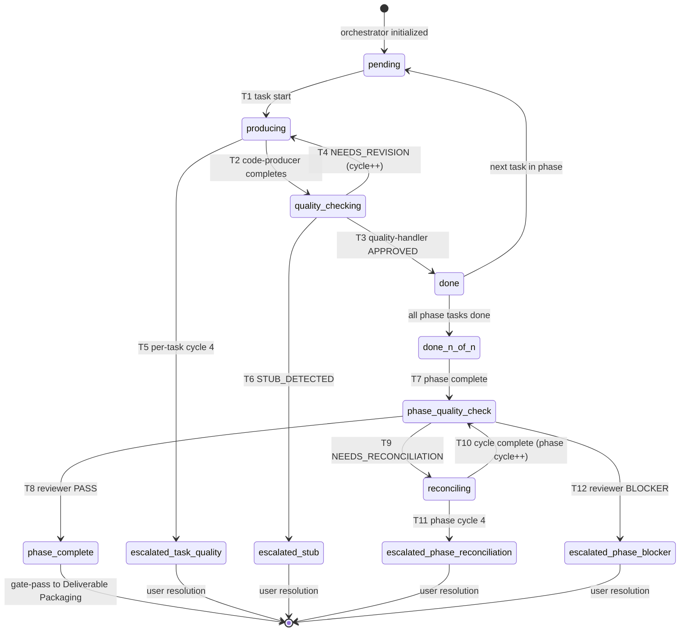

# Blueprint — Execution Pipeline Design (run r1)

## Contents

- [Overview](#overview)
  - [Layer Scope](#layer-scope)
  - [Referenced Specifications](#referenced-specifications)
- [Design Summary (Meta)](#design-summary-meta)
- [Background and Context](#background-and-context)
  - [Prerequisite ADRs](#prerequisite-adrs)
  - [External Resources Used](#external-resources-used)
  - [Agreement Checklist](#agreement-checklist)
  - [Problem to Solve](#problem-to-solve)
  - [Current Challenges](#current-challenges)
  - [Requirements](#requirements)
- [Acceptance Criteria (AC) - EARS Format](#acceptance-criteria-ac---ears-format)
  - [Functional ACs](#functional-acs) — FR-1 through FR-13 (60 ACs)
  - [Cross-Layer / Operational ACs](#cross-layer--operational-acs) — 3 cross-cutting ACs
- [Existing Codebase Analysis](#existing-codebase-analysis)
  - [Implementation Path Mapping](#implementation-path-mapping)
  - [Integration Points](#integration-points-include-even-for-new-implementations)
  - [Code Inspection Evidence](#code-inspection-evidence)
  - [Fact Disposition Table](#fact-disposition-table) — 17-row IN disposition
- [Q-CC-N Arbitration](#q-cc-n-arbitration) — 5 architectural questions resolved
- [Design](#design)
  - [Change Impact Map](#change-impact-map) — 28+ file operations inventoried
  - [Interface Change Matrix](#interface-change-matrix) — 18 inter-component contracts
  - [Architecture Overview](#architecture-overview) — with rendered Mermaid diagram
  - [Data Flow](#data-flow) — 5-stage end-to-end lifecycle
  - [Integration Points List](#integration-points-list)
  - [Main Components](#main-components) — 10 component profiles + cross-reference index
  - [Data Representation Decision](#data-representation-decision-when-introducing-new-structures) — 4 sub-decisions
  - [Contract Definitions](#contract-definitions) — 5 contracts
  - [Data Contract](#data-contract) — per-component
  - [Field Propagation Map](#field-propagation-map-when-fields-cross-boundaries) — task_id, phase_id, finding, cycle_counter, doc_type
  - [State Transitions and Invariants](#state-transitions-and-invariants-when-applicable) — 12 states + 12 transitions + 10 invariants + state diagram
  - [Claude Code / Project Filesystem Design](#claude-code--project-filesystem-design) — embeds cc-design.md + 4-refinement audit trail
  - [Per-layer Design (Frontend/Backend/API/Query/Database/CI-CD/IaC/Codespaces)](#frontend-design) — all N/A
  - [Error Handling](#error-handling)
  - [Logging and Monitoring](#logging-and-monitoring)
- [Implementation Plan](#implementation-plan)
- [Security Considerations](#security-considerations)
- [Test Boundaries](#test-boundaries)
- [Verification Strategy](#verification-strategy)
- [Future Extensibility](#future-extensibility)
- [Alternative Solutions](#alternative-solutions) — 8 rejected alternatives
- [Risks and Mitigation](#risks-and-mitigation) — 8 cross-cutting risks
- [References](#references)
- [Update History](#update-history)
- [ADR Authoring (this run)](#adr-authoring-this-run) — ADR-0032, ADR-0033, ADR-0034 summaries

## Overview

This Blueprint designs the **execution side** of the feature pipeline — the stages that take a completed planning-pipeline output (tasks.json + acceptance tests + phase validators) through to production-quality shipped artifacts. The feature is **single-layer** (Claude Code only); no CI/CD, MCP, Codespaces, Backend, Frontend, Database, or IaC changes are in scope.

The execution architecture introduces 5 new subagents organized around a centralized orchestrator owning a 12-state machine, 3 skill additions (1 install + 2 extractions per ADR-0031 canonical-home discipline), and 7 new scripts under `auditing-shared/` + `auditing-github-actions/` + `auditing-codespaces/`. Three meta-disciplines from prior architectural work extend to execution surface: ADR-0017's 4-cycle reconciliation cap (symmetric across per-task quality loops AND phase-level reconciliation per D-12); ADR-0029's no-silent-scope-changes principle (extended via new ADR-0033 to execution-phase Scope-Deviation surfacing); and ADR-0030's mechanism-α discipline pattern (the model for D-15's mechanical discipline-enforcement at the recipe-skill discipline-5 level).

Three new ADRs are introduced this run: **ADR-0032** (conventions canonicalization + per-doc-type state vocabulary, pairing D-4 + D-18); **ADR-0033** (ADR-0029 execution-phase extension, D-7); optionally **ADR-0034** (PRD v1.1.0 ADR-0017 vs ADR-0021 mis-credit cleanup) which may fold into ADR-0032 as housekeeping.

The cc-design.md authoring also surfaced four material refinements of the synthesis-stage substrate (D-9 role-split, D-3 third-option, D-13 reframing, D-16 platform-vs-application-hooks disambiguation) — each emerged from substrate detail unavailable to synthesis-stage pressure-tests, and is preserved in the Pass-by-pass audit trail for downstream visibility.

### Layer Scope

| Layer | Status | Notes |
|---|---|---|
| **Claude Code / Project Filesystem** | ✓ activated | Pipeline structure, sub-agent definitions, skill organization, templates, validators, scripts |
| Frontend | N/A — out of scope | |
| Backend | N/A — out of scope | |
| API | N/A — out of scope | |
| Query / Data Access | N/A — out of scope | |
| Database | N/A — out of scope | |
| CI/CD (GitHub Actions) | N/A — out of scope | The project's GHA configs are not modified; the GHA *audit pattern* is extracted (Claude Code layer change) |
| Infrastructure as Code | N/A — out of scope | |
| Dev Environment (Codespaces / Devcontainer) | N/A — out of scope | The project's devcontainer is not modified; the Codespaces *audit pattern* is extracted (Claude Code layer change) |

The feature is single-layer because the project's "product" IS the feature pipeline; there are no product-facing layers to integrate with.

### Referenced Specifications

| Document | Path | Role |
|---|---|---|
| Intent Clarification | `intent-clarification.md` v1.0.0 (gate_passed=1) | Captures user-clarified scope; 1 PRD-deferred item |
| PRD | `prd-v1.1.0.md` v1.1.0 (gate_passed=2) | 13 FRs + 60 ACs; 3 discovery-driven amendments per ADR-0005 |
| Research Plan | `research-plan.md` v1.1.0 (gate_passed=3) | 17 INs; 0/6 external research topics consumed (all KB-covered) |
| Codebase Analysis | `codebase-analysis.md` v1.1.1 (reviewer=approved) | 16/17 INs investigated (IN-013 N/A); 18-decision distillation |
| Synthesis | `synthesis.md` v1.1.0 (reviewer=approved) | 18 substantive decisions + 4 mechanical applications |
| Claude Code Design | `cc-design.md` v1.0.0 (reviewer=approved) | 21 decision targets resolved; 4 synthesis-substrate refinements |
| CC Dependencies sidecar | `cc-dependencies.json` v1.0.0 | Machine-readable dependency graph |
| ADRs inherited | adrs/ADR-{0013,0016,0017,0021,0028,0029,0030,0031} | Foundational architectural decisions applied |
| ADRs to be authored | ADR-0032, ADR-0033, optionally ADR-0034 (Batches 3-4) | This run's ADR additions |

## Design Summary (Meta)

```yaml
design_type: feature-pipeline-infrastructure
risk_level: medium-high
complexity_level: high
blast_radius: wide
dependencies:
  internal:
    - planning-pipeline (consumes tasks.json output of finalize-task-decomposer)
    - existing 9 auditing-* skills (auditing-cc-configs, auditing-shared, auditing-skills, auditing-subagents, auditing-cc-configs, etc.)
    - existing 31 planning-side agents (pattern reference; no modifications)
    - recipe-feature-pipeline/SKILL.md (discipline statements being mechanically enforced)
    - KB-cc-design + KB-cc-platform (design discipline + primitive knowledge)
    - shared-conventions.md (extended via ADR-0032; edits happen at Plan + Execution)
    - shared-document-reviewer (doc_type taxonomy extended)
  external: []
  blueprint_decisions_resolved: 21  # all 18 D-* with D-2 split into D-2a-d
  new_adrs: 3  # ADR-0032 (conventions+vocabulary), ADR-0033 (ADR-0029 extension), optionally ADR-0034 (PRD mis-credit cleanup)
  q_layer_n_arbitrated: 5  # Q-CC-1 through Q-CC-5
  synthesis_substrate_refinements: 4  # D-9 role-split, D-3 third-option, D-13 reframing, D-16 disambiguation
  ci_cd_impact: none
  mcp_impact: none
  external_service_impact: none
  database_impact: none
```

**Risk-level rationale**: medium-high reflects that the execution pipeline becomes the substrate for every future feature run — failure modes affect the entire downstream pipeline economy. Mitigated by mechanical defenses (FR-6 validator, discipline-5 check) and the symmetric application of ADR-0017's 4-cycle cap.

**Complexity-level rationale**: high reflects the 21 decision targets, the 4 synthesis-substrate refinements (each surfaced substrate detail unknowable at synthesis time), the orchestrator state machine (12 transitions), and the dispatch taxonomy (6 row mapping).

**Blast-radius rationale**: wide because the artifacts produced (orchestrator, reviewer, reconciler, code-producer, quality-handler agents + 7 scripts) are consumed by every future execution-phase run. Changes propagate to all future features. Mitigated by additive deployment (no existing artifacts removed; agents are new) and by ADR-0032's archive-authoritative spec direction (codifies validated practice).

## Background and Context

### Prerequisite ADRs

These ADRs are inherited; this Blueprint applies them without modification:

| ADR | Title | Role in this feature |
|---|---|---|
| ADR-0013 | Blueprint template canonical | Defines the Blueprint structure this document follows (per design-composer Phase 5) |
| ADR-0016 | Design fan-out fan-in | Defines the fan-out (per-layer designers) + fan-in (design-composer) pattern; single-layer makes fan-out trivial |
| ADR-0017 | Document-reviewer integration | **Canonical home for the 4-cycle reconciliation cap** (note: PRD v1.1.0 informally credits ADR-0021 for this; cleaned up in codebase-analysis.md v1.1.1 in-table caption; closed in ADR-0034 stand-alone, per Blueprint Batch 4 decision; ADR-0032 covers separate housekeeping per its Change 1-5 scope) |
| ADR-0021 | Discovery-phase architecture | Defines the planning-pipeline flow; execution-side is the parallel structure this feature designs |
| ADR-0028 | Skill-design fixes v4.5.0 | Codifies `recipe-feature-pipeline/SKILL.md` discipline 5 ("no pipeline-stage references by number"); mechanically enforced by D-15 |
| ADR-0029 | No-silent-scope-changes principle | The meta-discipline being extended to execution surface via new ADR-0033 |
| ADR-0030 | Mechanism-α pedagogical-marker-justification | The mechanical-defense pattern that D-15's discipline-enforcement applies symmetrically |
| ADR-0031 | Auditing-shared skill module | Canonical-helper-home pattern that auditing-shared scripts + auditing-github-actions extraction follow |

### External Resources Used

| Resource | Source | Adoption disposition (per D-2 sub-decisions) |
|---|---|---|
| `task-executor` (444 lines) | `/mnt/user-data/uploads/task-executor__1_.md` | **Adopted**: APPROVED-status discipline (D-2c), stub-detection pattern (D-2d), selective BLOCKING annotations for safety-critical gates (D-2a). **Rejected**: universal BLOCKING annotations (D-2a), multi-step escalation taxonomy (D-2b) — both over-engineered for execution-side per anchoring-concern analysis in cc-design Pass 2. |
| `quality-fixer` (330 lines) | `/mnt/user-data/uploads/quality-fixer.md` | **Adopted**: APPROVED-status enum + STUB_DETECTED status (D-2c, D-2d). |
| `ai-development-guide` SKILL | `/mnt/user-data/uploads/SKILL__2_.md` (302 lines / 9 sections) | **To be installed** per AC-FR-9-e at `.claude/skills/ai-development-guide/SKILL.md`. Bound by code-producer + quality-handler agents per D-11. |

### Agreement Checklist

#### Scope

In scope for this feature:
- 5 new subagents: `execute-orchestrator`, `execute-phase-quality-reviewer`, `execute-finalize-reconciler`, `execute-task-code-producer`, `execute-task-quality-handler`
- 1 modified subagent: `shared-document-reviewer` (doc_type taxonomy extended per ADR-0032)
- 3 new skills: `ai-development-guide` (install), `auditing-github-actions` (extract from KB-github-actions-platform), `auditing-codespaces` (stub per AC-FR-8-b)
- 7 new scripts: `detect_stubs.py`, `run_phase_checks.py`, `log_state_transition.py`, `validate_pipeline_frontmatter.py`, `check_pipeline_discipline.py` (all in auditing-shared/scripts/); `audit_workflow.py` (relocated to auditing-github-actions/scripts/); `audit_codespaces.py` stub
- 3 new ADRs: ADR-0032, ADR-0033, optionally ADR-0034
- Permission policy additions in `.claude/settings.json` (allow-list extensions for the new script invocation patterns)
- Template additions in `KB-documentation-criteria/references/templates/` for execution-phase artifact pairs (per D-5)

#### Non-Scope (Explicitly not changing)

- CI/CD workflows (`.github/workflows/*.yml`) — unchanged
- MCP server configuration — no new servers introduced
- Codespaces / devcontainer configuration — unchanged
- Product-facing layers (Backend, Frontend, API, Query, Database, IaC) — N/A; project has no such layers
- CLAUDE.md — no changes (per Principle 5: disciplines live in recipe skill or scripts, not CLAUDE.md)
- Plugin packaging — not applicable (per Principle 7)
- Command-to-skill migration — no legacy `.claude/commands/*.md` in scope
- Existing 31 planning-side agents — unmodified
- Existing 9 auditing-* skills (except: auditing-github-actions skill is created; existing scripts are MOVED into it via git mv)
- `recipe-feature-pipeline/SKILL.md` — unchanged (discipline statements are referenced; not re-written)
- ADR-0017 / ADR-0021 informal mis-credit in PRD v1.1.0 narrative — cleaned up via ADR-0034 (stand-alone per Blueprint Batch 4 decision) (not via PRD supersession)

#### Constraints

- Must work with existing `tasks.json` schema (output of planning-side `finalize-task-decomposer`); no schema changes proposed
- Must respect ADR-0017's 4-cycle reconciliation cap; symmetric extension to per-task quality loop per D-12
- Must not silent-fail per ADR-0029 (extended via ADR-0033)
- Must not violate `recipe-feature-pipeline/SKILL.md` discipline 5; D-15 ships mechanical enforcement
- Must not author ADRs from any agent except `design-composer` (per FR-5 of layer-design spec)
- `auditing-github-actions` extraction must preserve git history (git mv, not copy-and-delete)
- `ai-development-guide` skill install must happen BEFORE per-task agents that reference it become functional (Plan-stage sequencing)
- All new scripts must follow canonical-helper-home pattern per ADR-0031 (location: `auditing-shared/scripts/` for cross-cutting; per-skill-scripts for skill-specific)

#### Applicable Standards

- KB-cc-design's 9 principles (lowest-cost primitive, path-gate, enforce vs instruct, isolate when pays-off, one-source-of-truth, permissions-as-safety-net, plugins-for-distribution-not-organization, migrate-commands-to-skills, reasoning-config-intentional)
- KB-cc-platform conventions (primitive syntax + scoping rules)
- KB-documentation-criteria templates + shared-conventions.md (extended via ADR-0032)
- KB-review-disciplines (Gate 0/1 procedure for reviewer pass)
- EARS format for all 60 Functional ACs

#### Quality Assurance Mechanisms

Layered defense at phase-quality gate (FR-3's 7+ activities aggregated by `execute-phase-quality-reviewer` per D-13 dimensional verdict structure):

| Layer | Mechanism | Per |
|---|---|---|
| Code-level (per task) | `ai-development-guide` 4-phase pattern (lint → build → test → final gate); stub detection BLOCKING-first; APPROVED status enum | FR-2, D-2, D-11 |
| Phase-quality aggregation | 3 test layers (unit + integration + E2E) + 3 audit families (cc + GHA + Codespaces) + frontmatter validator + (D-15 option 2) discipline-check | FR-3, D-1, D-3 |
| Reconciliation | finalize-reconciler dispatches per 6-row taxonomy; 4-cycle hard cap; scope-bounded dispatch | FR-4, D-12, D-14 |
| Cross-artifact | reviewer pass on each artifact (Gate 0 + Gate 1); auditing-* family scripts | FR-6, shared-document-reviewer |
| Discipline enforcement | mechanism-α pattern via D-15 worked example (discipline 5 mechanically enforced; broader systematic inventory deferred to follow-on features) | ADR-0030 symmetric, D-15 |
| State transitions | application-level hooks (per FR-5) log every transition to JSONL audit log; observer-only in v1 | FR-5, D-16 |
| Audit-counter delta | feature-start + prior-phase baselines reported per-domain + aggregate; informational default with opt-in gating | FR-12, D-17 |

### Problem to Solve

The planning side of the feature pipeline (Intent Clarification through Task Decomposition) has matured through repeated production runs; named stages, gates, sub-agents, templates, and 4-cycle reconciliation discipline are all in place per ADR-0021 and the recipe-skill discipline statements. The execution side — from "tasks.json has been authored" through "deliverable archive is shipped" — exists only as ad-hoc orchestration improvised on each run. The most recent run (`audit-findings-remediation-r1`) made the cost of this gap visible: ~35 in-repo files modified, six mid-execution auditor extensions logged, multiple ad-hoc artifacts authored without templates or frontmatter schemas, and 16 frontmatter inconsistencies discovered at packaging time requiring manual cleanup.

This feature designs the execution side with the same level of rigor the planning side has.

### Current Challenges

Surfaced during the codebase-analysis stage (per the 17 INs investigated):

1. **No execution-side orchestrator exists** (IN-007 + IN-008): the 31 planning-side agents have distributed orchestration via per-agent prompts; execution needs centralized state machine for non-linear flow.
2. **Audit families inconsistently placed** (IN-002 + IN-006): GHA audit script + action_versions.md misplaced under `KB-github-actions-platform/scripts/` rather than `auditing-github-actions/`; symmetric Codespaces audit doesn't exist.
3. **Discipline 5 ("no pipeline-stage references by number") lacked mechanical enforcement** (IN-004 + just-demonstrated in this feature's own design work): the discipline was statement-only; violations occurred in claude's own codebase-analysis.md + synthesis.md and were caught only via user-prompted scan.
4. **4 archive-practice frontmatter fields not canonicalized** (IN-004): `intent_user_token`, `gate_passed`, `reviewer_verdict`, `approved_at` all used in practice; none in `shared-conventions.md` spec.
5. **`status: complete` vocabulary drift** (IN-004): used by codebase-analysis + synthesis docs but not in canonical 5-state vocabulary.
6. **`doc_type` taxonomy gap** (IN-005): `synthesis`, `codebase-analysis`, and the execution-side artifacts (`per-task-execution-log`, `phase-quality-report`, `quality-reconciliation-log`) not in `shared-document-reviewer`'s known doc_types.
7. **Ad-hoc execution artifacts** (IN-010 prior archive): 9 artifacts from `audit-findings-remediation-r1` (`implementation-notes.md`, `observations.md`, `reconciliation-log-cycle*.md`, `final-audit-report.md`, etc.) had no templates or schemas.

### Requirements

#### Functional Requirements

Thirteen FRs from PRD v1.1.0 (full ACs in Acceptance Criteria section below):

| FR | Title | Layer |
|---|---|---|
| FR-1 | Explicit execution-pipeline stages with named gates and sub-agents | Claude Code |
| FR-2 | Per-task execution-and-quality inner loop | Claude Code |
| FR-3 | Phase-level quality stage | Claude Code |
| FR-4 | Quality-finding depth classifier and dispatch matrix | Claude Code |
| FR-5 | State-transition hooks at every gate boundary | Claude Code |
| FR-6 | Frontmatter validator | Claude Code |
| FR-7 | Execution-phase artifact schemas and templates | Claude Code |
| FR-8 | Three-way auditing split for GitHub Actions and Codespaces | Claude Code |
| FR-9 | `ai-development-guide` skill binding on code-producing sub-agents | Claude Code |
| FR-10 | Execution-side reconciliation budget | Claude Code |
| FR-11 | Canonical state vocabulary | Claude Code |
| FR-12 | Phase-quality-report frontmatter includes audit-counter delta | Claude Code |
| FR-13 | Reconciliation-log entries machine-parseable | Claude Code |

#### Non-Functional Requirements

- **Backward compatibility**: must work with existing `tasks.json` schema; no breaking changes to planning-pipeline outputs
- **Mechanical defense preference**: where statement-only discipline has demonstrated insufficiency (discipline 5 worked example via D-15), mechanical enforcement is preferred (ADR-0030 symmetric application)
- **Symmetric meta-discipline**: extensions to ADR-0017 (4-cycle cap), ADR-0029 (no silent failures), ADR-0030 (mechanism-α pattern) all preserve the parent discipline's logic; no specialized exceptions
- **Audit trail preservation**: synthesis-substrate refinements during cc-design authoring (4 total) are visible in the Pass-by-pass section + cc-dependencies.json; downstream stages can re-apply without re-deriving
- **No silent failures** (ADR-0029 + ADR-0033 extension): every Scope-Deviation must surface in a discoverable artifact location; the execution-side adds per-task-execution-log + phase-quality-report + quality-reconciliation-log entries to the surfacing inventory

## Acceptance Criteria (AC) - EARS Format

Acceptance criteria use EARS format per the convention: `WHEN <trigger>, the <subject> shall <response>` (event-driven); `IF <condition>, THEN the <subject> shall <response>` (unwanted-condition); `WHERE <feature/scope>, the <subject> shall <response>` (optional); bare `shall` clauses (ubiquitous).

All 60 ACs are transferred faithfully from PRD v1.1.0 Section "Functional Requirements" and organized by FR. The cc-design.md Acceptance criteria contribution table maps each AC to the design element that satisfies it; see also the Per-Layer Design subsection (Batch 6).

### Functional ACs

#### FR-1 — Layer: claude-code (Explicit execution-pipeline stages with named gates and sub-agents)

- **AC-FR-1-a**: The execution pipeline shall be defined as an ordered sequence of stages in the Blueprint.
- **AC-FR-1-b**: Each stage shall have a unique name, an owning sub-agent, a named gate, and at least one named artifact that the gate verifies.
- **AC-FR-1-c**: WHEN Task Decomposition completes, the orchestrator shall enter the first execution stage.
- **AC-FR-1-d**: WHEN the terminal execution stage's gate passes, the orchestrator shall transition to Deliverable Packaging.

#### FR-2 — Layer: claude-code (Per-task execution-and-quality inner loop)

- **AC-FR-2-a**: WHEN a task is selected for execution, the orchestrator shall invoke the task-execution sub-agent with the task file and the explicit allowed-file scope per the task's declared Target Files.
- **AC-FR-2-b**: WHEN the task-execution sub-agent returns `completed`, the orchestrator shall invoke the per-task quality sub-agent with the `filesModified` returned by the task-execution sub-agent as the per-task quality scope.
- **AC-FR-2-c**: WHEN the per-task quality sub-agent returns `approved`, the orchestrator shall mark the task complete and advance to the next task.
- **AC-FR-2-d**: WHEN the per-task quality sub-agent returns `stub_detected`, the orchestrator shall route the finding through the dispatch matrix per FR-4 at the depth indicated by the finding (typically Level 1 or 3).
- **AC-FR-2-e**: WHEN the per-task quality sub-agent returns `blocked`, the orchestrator shall route the finding through the dispatch matrix per FR-4 at the depth indicated by the blocking reason (typically Level 4 or higher).
- **AC-FR-2-f**: WHEN the task-execution sub-agent returns `escalation_needed`, the orchestrator shall route through the dispatch matrix at the depth indicated by the escalation type (typically Level 1 through Level 6 depending on the escalation type).

#### FR-3 — Layer: claude-code (Phase-level quality stage)

- **AC-FR-3-a**: WHEN every task in tasks.json has reached the `completed` state, the orchestrator shall enter the phase-level quality stage.
- **AC-FR-3-b**: The phase-level quality stage shall execute, at minimum: all unit tests for every layer activated in the PRD's Layer Scope; all integration tests for every activated layer; all E2E tests for every activated layer (when defined); cc-audit project-wide; GitHub Actions workflow audit; GitHub Codespaces audit (feature-scoped — auditing whatever codespaces configuration the feature touches; a feature that touches no codespaces configuration produces a no-op pass; at this feature's ship time, `auditing-codespaces` may be a stub per FR-8-b in which case the audit emits `{"stub": true, "findings": []}` per Q-CC-4 resolution); the frontmatter validator (FR-6).
- **AC-FR-3-c**: The phase-level quality stage shall produce a phase-quality-report artifact summarizing pass/fail counts per check.
- **AC-FR-3-d**: WHEN any check fails, the failing finding(s) shall be classified by depth per the dispatch matrix (FR-4) before the phase-quality-report is emitted.
- **AC-FR-3-e**: WHEN all checks pass with zero findings (or only named-exempt findings per the project's exemption mechanism per ADR-0030 mechanism α), the phase-level quality gate shall pass and the orchestrator shall transition to Deliverable Packaging.
- **AC-FR-3-f**: WHERE the project's Layer Scope activates a layer for which no test suite exists, the phase-level quality stage shall emit a Level-5 finding ("plan-level gap: layer activated without test infrastructure") rather than silently passing.

#### FR-4 — Layer: claude-code (Quality-finding depth classifier and dispatch matrix)

- **AC-FR-4-a**: The depth classifier shall produce a label in the set {Level 0, Level 1, Level 2, Level 3, Level 4, Level 5, Level 6, Level 7, Level 8}.
- **AC-FR-4-b**: Each level shall have a single defined dispatch target in the matrix, named by sub-agent role.
- **AC-FR-4-c**: The depth semantics shall be: Level 0 = auto-fixable (lint/format/style); Level 1–2 = task-implementation or test bug (re-run task-executor); Level 3 = security/correctness audit finding (mechanism α applies); Level 4 = task-as-written produces wrong output (re-author task in tasks.json); Level 5 = plan-level gap (re-author plan); Level 6 = blueprint-level design flaw (re-author blueprint); Level 7 = PRD-level requirement contradiction (re-author PRD); Level 8 = intent misinterpreted (re-clarify intent).
- **AC-FR-4-d**: WHEN a finding routes to Level 4 or higher, the cascade rules in the Blueprint shall determine which downstream artifacts must be re-derived.
- **AC-FR-4-e**: The Blueprint shall publish the dispatch matrix as a single source of truth referenced (but not re-defined) by execution-stage sub-agents.
- **AC-FR-4-f**: An ADR shall be authored documenting the depth classifier's semantics and the dispatch matrix.

#### FR-5 — Layer: claude-code (State-transition hooks at every gate boundary)

*Disambiguation*: "Hooks" in FR-5 refers to **application-level** orchestrator-invoked actions at state transitions, NOT Claude Code platform hooks (PreToolUse / PostToolUse / SessionStart / etc.). See Q-CC-5 arbitration.

- **AC-FR-5-a**: WHEN any pipeline gate passes, the orchestrator shall fire a state-transition hook (application-level) updating the frontmatter `status` field of every artifact the gate produces, to the next state in the canonical state vocabulary (FR-11).
- **AC-FR-5-b**: WHEN reconciliation (planning-side or execution-side) re-authors an artifact, the orchestrator shall update the prior version's frontmatter `status` to `superseded` and add a `superseded_by:` field naming the new version.
- **AC-FR-5-c**: WHEN the phase-level quality gate passes (or the named-exempt mechanism α exemption is applied), the orchestrator shall update each ratified pipeline artifact's `status` to the final ship state.
- **AC-FR-5-d**: State transitions shall be observable in the deliverable archive after the run — every artifact's `status` shall accurately reflect its lifecycle position at archive time. Additionally, transitions shall be logged to `state-transitions.log` (JSONL append-only) per D-16.
- **AC-FR-5-e**: IF a state-transition hook fails (file write error, missing target artifact, etc.), THEN the gate that triggered it shall be marked failed and the failure shall surface as a Level-1 finding routed through FR-4.

#### FR-6 — Layer: claude-code (Frontmatter validator)

- **AC-FR-6-a**: The frontmatter validator shall be invokable as a script (callable from any sub-agent and from the orchestrator's state-transition hooks). Path: `auditing-shared/scripts/validate_pipeline_frontmatter.py` (disambiguated from existing `auditing-skills/scripts/validate_frontmatter.py` which validates SKILL.md frontmatter per IN-017 resolution).
- **AC-FR-6-b**: The frontmatter validator shall check, at minimum: required fields present per the artifact's doc-type schema; `status` value is in the canonical state vocabulary (FR-11); `status` value is current for the pipeline state (e.g., a ratified artifact is not still in `draft`); superseded artifacts have `superseded_by:` back-link; execution-phase artifacts conform to the schemas defined in FR-7.
- **AC-FR-6-c**: WHEN the frontmatter validator detects a missing required field or invalid value, it shall emit a finding at Level 0 (auto-fixable) or Level 1 (manual correction needed) per the dispatch matrix.
- **AC-FR-6-d**: The frontmatter validator shall run as part of the phase-level quality stage (FR-3) and shall additionally be invokable at every other gate.
- **AC-FR-6-e**: The validator's failure on a planning-side artifact shall route the finding to the planning-side reconciliation flow (governed by ADR-0021); the validator's failure on an execution-side artifact shall route through the execution-side flow (governed by the ADR from FR-10).

#### FR-7 — Layer: claude-code (Execution-phase artifact schemas and templates)

- **AC-FR-7-a**: Each execution-phase artifact named in the Blueprint shall have a template file in `KB-documentation-criteria/references/templates/` with the suffix `-template.md`.
- **AC-FR-7-b**: Each execution-phase artifact's frontmatter schema shall be documented in `KB-documentation-criteria/references/shared-conventions.md` under a new section "Execution-phase artifact frontmatter" (ADR-0032).
- **AC-FR-7-c**: The execution-phase artifact list shall include at minimum the following named artifacts (final enumeration is a Blueprint decision; this list is the irreducible floor): per-task execution log; phase-quality report; quality-reconciliation log (per cycle); frontmatter-validation report; execution-reconciliation log.
- **AC-FR-7-d**: WHERE the design's stage decomposition produces additional artifacts beyond the minimum, those additional artifacts shall also conform to AC-FR-7-a and AC-FR-7-b. (*Note*: this Blueprint introduces additional artifacts beyond the FR-7-c floor — `state-transitions.log`, `pipeline-run-summary.json` — flagged in Open items for cross-artifact-audit verification that FR-7-c floor expansion is editorially correct.)

#### FR-8 — Layer: claude-code (Three-way auditing split for GitHub Actions and Codespaces)

- **AC-FR-8-a**: A new skill `auditing-github-actions` shall exist at `.claude/skills/auditing-github-actions/` with its own `SKILL.md` and any audit scripts moved out of `KB-github-actions-platform/scripts/` (via git mv per IN-002 resolution to preserve history).
- **AC-FR-8-b**: A new skill `auditing-codespaces` shall exist at `.claude/skills/auditing-codespaces/` with its own `SKILL.md`. WHERE `KB-codespaces-platform/scripts/` currently contains audit scripts, those scripts shall be moved to `auditing-codespaces/scripts/`. WHERE no audit scripts currently exist in `KB-codespaces-platform/scripts/`, the new `auditing-codespaces` skill shall ship as a **stub** — SKILL.md only, plus a stub `audit_codespaces.py` that emits `{"stub": true, "findings": []}` per Q-CC-4 resolution.
- **AC-FR-8-c**: Helpers shared between the new auditing skills and any existing `auditing-*` skills shall be placed in `auditing-shared` per ADR-0031.
- **AC-FR-8-d**: WHEN any sub-agent or script references the audit functionality, it shall load the new `auditing-X` skill rather than `KB-X-platform`.
- **AC-FR-8-e**: The `KB-X-platform/SKILL.md` Contents lists shall be updated to remove references to scripts that have moved, and shall point to the new `auditing-X` skill for audit functionality.
- **AC-FR-8-f**: WHERE a caller agent (e.g., `design-cicd`, `design-codespaces`) currently loads `KB-X-platform` and uses its audit functionality, that agent's `skills:` frontmatter shall be updated to additionally (or instead) load the new `auditing-X` skill, per the rationale in the Blueprint.

#### FR-9 — Layer: claude-code (`ai-development-guide` skill binding on code-producing sub-agents)

- **AC-FR-9-a**: The task-execution sub-agent (and any other execution-phase sub-agent that writes or modifies code) shall list `ai-development-guide` in its frontmatter `skills:` field.
- **AC-FR-9-b**: The Blueprint shall document which execution-phase sub-agents qualify as "code-producing" for the purpose of this binding. (*Resolved per D-11*: binding criterion is "authors code OR applies code-level quality gates"; two agents bind — `execute-task-code-producer` and `execute-task-quality-handler`.)
- **AC-FR-9-c**: WHEN the frontmatter validator (FR-6) runs against a code-producing execution-phase sub-agent's definition, it shall fail if `ai-development-guide` is absent from the agent's `skills:` field.
- **AC-FR-9-d**: The `ai-development-guide` skill's purpose (technical decision criteria, anti-pattern detection, debugging techniques, quality-check workflow) shall be cited in the Blueprint as the rationale for FR-9.
- **AC-FR-9-e**: The Plan shall include a task installing `ai-development-guide` skill at `.claude/skills/ai-development-guide/SKILL.md`, sourcing content from the user-uploaded reference at `/mnt/user-data/uploads/SKILL__2_.md`. This task shall execute before any execution-phase sub-agent definitions that bind to the skill, so that FR-9's binding has a real target.

#### FR-10 — Layer: claude-code (Execution-side reconciliation budget)

- **AC-FR-10-a**: An ADR shall be authored defining the execution-side reconciliation budget (numeric cycle cap and escalation policy). (*Resolved*: this Blueprint's design defers to ADR-0017 as canonical home for the 4-cycle cap, symmetric-extended to per-task quality loop per D-12. The ADR-0017 canonical home is acknowledged; ADR-0034 (stand-alone per Blueprint Batch 4 decision) cleans up the PRD v1.1.0 mis-credit.)
- **AC-FR-10-b**: The budget cap shall apply to the quality-reconciliation loop (FR-4) but shall not modify the planning-side budget governed by ADR-0021.
- **AC-FR-10-c**: WHEN the budget is exhausted, the orchestrator shall produce a `budget-exhausted` artifact summarizing the unresolved findings and shall escalate to the project owner with the options to extend the budget, accept the finding(s) as named-exempt (per mechanism α / ADR-0030 if applicable), or abort the run.
- **AC-FR-10-d**: The budget numeric cap shall be a per-feature configurable value with a project-wide default of 4 cycles (specified in ADR-0017 canonical home).

#### FR-11 — Layer: claude-code (Canonical state vocabulary)

- **AC-FR-11-a**: The canonical state vocabulary shall be documented in `shared-conventions.md` as the single source of truth. (*Per ADR-0032 D-18*: per-doc-type vocabulary with 3 base categories — gated 5-state, analysis/log 3-state {draft / complete / superseded}, ADRs 4-state.)
- **AC-FR-11-b**: Every artifact template in `KB-documentation-criteria/references/templates/` shall use a default `status:` value drawn from the canonical vocabulary.
- **AC-FR-11-c**: The frontmatter validator (FR-6) shall flag any artifact whose `status` value is not in the canonical vocabulary FOR THAT DOC-TYPE.
- **AC-FR-11-d**: WHERE prior archives (pre-implementation of this feature) use divergent vocabulary (e.g., `approved` instead of `accepted`), the validator's enforcement shall be scoped to the post-implementation date forward; historical archives shall not be migrated (per the IC's "NOT in scope" declaration).
- **AC-FR-11-e**: An ADR shall be authored that pins the canonical vocabulary and explicitly resolves the current drift. (*Resolved by ADR-0032*: archive-authoritative direction per D-4 — codifies validated archive practice into spec; the `accepted` vs `approved` choice resolves in favor of `accepted` for gated artifacts and `complete` for analysis/log artifacts.)

#### FR-12 — Layer: claude-code (Phase-quality-report frontmatter includes audit-counter delta)

- **AC-FR-12-a**: WHEN the phase-quality-report is authored, its frontmatter shall include `audit_baseline:` (counts at run start) and `audit_final:` (counts at run end) for each platform audit family (cc, GHA, Codespaces, frontmatter validator, discipline). Per D-17 resolution: per-domain breakdown is primary signal; aggregate-total is raw-count; severity-weighted aggregation deferred per Q-CC-3 resolution.
- **AC-FR-12-b**: The deliverable archive shall surface this delta in the packager-report summary.

#### FR-13 — Layer: claude-code (Reconciliation-log entries machine-parseable)

- **AC-FR-13-a**: The quality-reconciliation log template (FR-7) shall define a consistent per-entry structure with explicit field labels (the `.json` half of the pair-pattern per D-5 carries the machine-parseable structure; the `.md` half carries the human-readable narrative).
- **AC-FR-13-b**: A future analytics pass shall be able to extract finding-depth distribution, dispatch-target frequency, and budget-utilization metrics from the reconciliation logs without bespoke parsing per archive.

### Cross-Layer / Operational ACs

This feature is single-layer (Claude Code only); cross-layer ACs are minimal. The following operational ACs apply at the execution-pipeline level:

- **AC-OP-1**: All execution-phase artifacts produced during a run shall be archived to `working/feature/<feature-slug>/` in the standard layout per ADR-0031 archive locations; `state-transitions.log` (JSONL) shall be located at `working/feature/<feature-slug>/state-transitions.log`.
- **AC-OP-2**: The discipline-5 mechanical enforcement (D-15 worked example via `check_pipeline_discipline.py`) shall run at every gate as part of the frontmatter validator's pipeline-level checks per FR-6-d. A finding from `check_pipeline_discipline.py` (e.g., a stage-by-number reference in an artifact) shall route through the dispatch matrix at Level 0 (auto-fixable) by default; Level 1 if context-sensitive.
- **AC-OP-3**: The `pipeline-run-summary.json` artifact (introduced beyond FR-7-c floor; flagged in Open items per AC-FR-7-d) shall be produced at run termination, summarizing per-stage gate outcomes, total reconciliation cycles consumed, total findings dispatched per level, and final ship status.

## Existing Codebase Analysis

Detailed analysis is in `codebase-analysis.md` v1.1.1 (reviewer=approved); this section presents the integration-relevant summary.

### Implementation Path Mapping

| Component | Path | Action |
|---|---|---|
| New execution-side subagents | `.claude/agents/execute-orchestrator.md`, `.claude/agents/execute-phase-quality-reviewer.md`, `.claude/agents/execute-finalize-reconciler.md`, `.claude/agents/execute-task-code-producer.md`, `.claude/agents/execute-task-quality-handler.md` | create |
| Modified subagent | `.claude/agents/shared-document-reviewer.md` | edit (doc_type taxonomy extension per ADR-0032) |
| New skill installs | `.claude/skills/ai-development-guide/`, `.claude/skills/auditing-github-actions/`, `.claude/skills/auditing-codespaces/` | create skills (with SKILL.md + scripts/ + references/ as appropriate) |
| Migrated files (preserve git history) | `KB-github-actions-platform/scripts/audit_workflow.py` → `auditing-github-actions/scripts/audit_workflow.py`; `KB-github-actions-platform/scripts/action_versions.md` → `auditing-github-actions/references/action_versions.md` | git mv |
| New shared scripts | `.claude/skills/auditing-shared/scripts/detect_stubs.py`, `.claude/skills/auditing-shared/scripts/run_phase_checks.py`, `.claude/skills/auditing-shared/scripts/log_state_transition.py`, `.claude/skills/auditing-shared/scripts/validate_pipeline_frontmatter.py`, `.claude/skills/auditing-shared/scripts/check_pipeline_discipline.py` | create |
| Stub script | `.claude/skills/auditing-codespaces/scripts/audit_codespaces.py` | create (stub returns `{"findings": []}`) |
| Permission policy | `.claude/settings.json` | edit (allow-list extensions for the 8 script invocation patterns) |
| Document conventions spec | `.claude/skills/KB-documentation-criteria/references/shared-conventions.md` | edit (add 4 fields + doc_type taxonomy + per-doc-type state vocabulary per ADR-0032) |
| Document templates (execution-phase) | `.claude/skills/KB-documentation-criteria/references/templates/` (4 new templates per D-5: per-task-execution-result, phase-quality-report, quality-reconciliation-log, state-transitions-log entry-schema) | create |
| ADRs (this run) | `adrs/ADR-0032-conventions-canonicalization.md`, `adrs/ADR-0033-adr-0029-execution-extension.md`, optionally `adrs/ADR-0034-prd-mis-credit-cleanup.md` | create |

### Integration Points (Include even for new implementations)

| Type | Direction | Component | Notes |
|---|---|---|---|
| Input | reads from planning side | `tasks.json` (output of `finalize-task-decomposer`) | No schema changes; consumed as-is |
| Input | reads from planning side | `acceptance-tests.md` (output of `test-acceptance-author`) | Consumed by quality-handler |
| Input | reads from planning side | `phase-validators.md` (output of `test-phase-validator-author`) | Consumed by phase-quality-reviewer |
| Output | writes to feature working directory | `per-task-execution-result.{json,md}` (one pair per task) | New artifact type per FR-7 |
| Output | writes to feature working directory | `phase-quality-report.{json,md}` (one pair per phase) | New artifact type per FR-7 |
| Output | writes to feature working directory | `quality-reconciliation-log.{json,md}` (one pair per reconciliation cycle) | New artifact type per FR-7 |
| Output | writes to feature working directory | `state-transitions.log` (JSONL; append-only) | New artifact type per FR-5 + D-16 |
| Output | writes to feature working directory | `pipeline-run-summary.json` (one per feature run) | New artifact type per FR-7 |
| Reference | inherits from CC layer | existing 9 `auditing-*` skills | Pattern reference + dispatch targets via `run_phase_checks.py` |
| Reference | inherits from CC layer | existing 31 planning-side agents in `.claude/agents/` | Pattern reference only; no modifications |
| Reference | inherits from CC layer | `recipe-feature-pipeline/SKILL.md` | Discipline statements being enforced; not modified |
| Reference | inherits from CC layer | `shared-document-reviewer` (existing) | Extended (doc_type taxonomy); not replaced |

### Code Inspection Evidence

Substrate gathered during Discovery Research stage (codebase-analysis.md v1.1.1):

- **31 planning-side agents** at `.claude/agents/` — pattern reference for agent structure; no orchestrator file exists (distributed orchestration via per-agent prompts). Execution-side adopts centralized orchestrator pattern per D-6 (departure from planning-side; non-linear flow justifies the difference).
- **9 existing `auditing-*` skills** (auditing-cc-configs, auditing-skills, auditing-shared, auditing-subagents, etc.) — pattern reference for the auditing-github-actions extraction (FR-8). Symmetric structure adopted.
- **`recipe-feature-pipeline/SKILL.md`** at 414 lines — defines 5 disciplines; enforcement status uneven (discipline 3 mechanical; discipline 4 field-recording; disciplines 1, 2, 5 procedural-only). D-15 ships discipline-5 mechanical enforcement; broader inventory in Open items.
- **`shared-conventions.md`** at 220 lines — defines canonical 5-state vocabulary + frontmatter spec. 4 archive-practice fields (`intent_user_token`, `gate_passed`, `reviewer_verdict`, `approved_at`) used in practice but absent from spec; canonicalized via ADR-0032.
- **ADR-0017** vs **ADR-0021** mis-credit in PRD v1.1.0 narrative — surfaced during Batch E review. ADR-0017 is canonical home for 4-cycle reconciliation cap; PRD prose informally credited ADR-0021. Resolution: ADR-0034 (stand-alone per Blueprint Batch 4 decision; ADR-0032 covers separate housekeeping per its Change 1-5 scope).
- **`audit-findings-remediation-r1` prior archive** at `working/feature/audit-findings-remediation-r1/` — 9 ad-hoc artifacts (`observations.md`, `reconciliation-log-cycle*.md`, `final-audit-report.md`, etc.) without templates or schemas; precedent for what execution-side templates should canonicalize (per FR-7 + D-5 pair pattern).

### Fact Disposition Table

One row per IN from codebase-analysis.md with disposition (preserve / transform / remove / out-of-scope) and rationale:

| IN | Focus area | Disposition | Rationale |
|---|---|---|---|
| IN-001 | ai-development-guide skill status | **preserve** + enhance | Skill not currently installed; install action per AC-FR-9-e at `.claude/skills/ai-development-guide/`. Binding boundary defined by D-11. |
| IN-002 | GHA audit script + action_versions.md misplacement | **transform** | Files currently at `KB-github-actions-platform/scripts/`; canonical location is `auditing-github-actions/`. Per FR-8 + ADR-0031, git mv to preserve history. |
| IN-003 | Uploaded SKILL__2_.md reference | **preserve** as source | Install at `.claude/skills/ai-development-guide/SKILL.md` with frontmatter name normalization. |
| IN-004 | shared-conventions.md drift (4 fields + state vocab + doc_type taxonomy) | **transform** | Canonicalize archive practice per ADR-0032 (D-4 + D-18). Spec edits happen at Plan + Execution; ADR documents the decision. |
| IN-005 | shared-document-reviewer + KB-review-disciplines | **preserve** + enhance | Extend doc_type taxonomy (per D-9 second role); no replacement of the agent. |
| IN-006 | auditing-* family with 8 skills + canonical helper auditing-shared | **preserve** + symmetric addition | Add auditing-github-actions (extract) + auditing-codespaces (stub) following the same structure. |
| IN-007 | 31 planning-side agents inventory | **preserve** + net-add | All 31 unmodified; 5 new execute-* agents added. |
| IN-008 | No orchestrator file (distributed pattern) | **transform** | Execution-side adopts centralized orchestrator per D-6 (departure justified by non-linear execution flow). |
| IN-009 | 6 inherited ADRs (0017, 0021, 0028, 0029, 0030, 0031) | **preserve** all + extend | All 6 inherited. ADR-0017 canonical 4-cycle cap is symmetric-extended to per-task per D-12. ADR-0029 forward-anticipated extension closed via ADR-0033. ADR-0030 mechanism-α pattern is symmetric model for D-15. ADR-0031 canonical-helper-home applied to all 7 new scripts. (ADR-0017 is genuinely inherited though not in PRD v1.1.0 Dependencies — its content drives the symmetric extension; the PRD's omission is part of the same documentary mis-credit pattern corrected by ADR-0034.) |
| IN-010 | audit-findings-remediation-r1 prior archive (9 ad-hoc artifacts) | **out-of-scope** for modification; **preserve** as reference | Archive is sealed; the artifacts inform FR-7 template design. FR-7-c floor editorial expansion (5 → 9-11 artifacts) flagged for cross-artifact audit. |
| IN-011 | deliverable-archive-spec | **preserve**; future-feature extension out of scope | Spec lists 13 FULL-scope artifacts; execution-phase artifacts not yet enumerated. Future feature scope; not addressed here. |
| IN-012 | ADR-0029 forward implications anticipating this feature | **transform** | ADR-0033 closes the anticipated extension by adding execution-phase Scope-Deviation surfacing locations. |
| IN-013 | designer-general-knowledge (no specific finding) | **not_applicable** | Marked N/A in codebase-analysis; no codebase substrate to act on. |
| IN-014 | auditing-cc-configs dispatch table | **preserve**; do not extend | D-3 third option (thin coordinator at auditing-shared) preserves canonical-home discipline; would have been a category error to extend cc-specific dispatch for non-CC audits. |
| IN-015 | KB-documentation-criteria templates directory (6 templates, all consistent structure) | **preserve** + symmetric addition | Add 4 new templates for execution-phase artifact pairs per D-5 + FR-7. Option A default-by-precedent. |
| IN-016 | ai-development-guide 4-phase pattern | **preserve** the pattern; **reframe** its use | The 4-phase pattern is code-level quality (FR-2 design space). Was originally proposed as an FR-3 organizing dimension (D-1 option a); reframed per Pass 3 anchoring-concern resolution as category error. |
| IN-017 | auditing-skills naming collision (validate_frontmatter.py) | **preserve** existing + disambiguate new | Existing `auditing-skills/scripts/validate_frontmatter.py` validates SKILL.md frontmatter. New `auditing-shared/scripts/validate_pipeline_frontmatter.py` validates pipeline-document frontmatter. Names explicitly distinguished. |

**Disposition summary**: 10 INs preserved unchanged-in-substance (with various enhancements/extensions: IN-001, IN-003, IN-005, IN-006, IN-007, IN-009, IN-014, IN-015, IN-016, IN-017); 4 transformed (IN-002, IN-004, IN-008, IN-012); 1 N/A (IN-013); 2 out-of-scope for modification (IN-010 prior archive; IN-011 deliverable-archive-spec future-feature extension). Sum: 17 ✓. No INs removed.

## Q-CC-N Arbitration

Five architectural questions surfaced during cc-design.md authoring (Passes 2-4). Each is arbitrated below with evidence-based rationale per ADR-0009 / claim C-R3-0013 ("Composer arbitrations should cite the substrate that justifies the choice, not abstract principles alone").

### Q-CC-1: Quality-handler model/effort allocation

**Question**: Should `execute-task-quality-handler` use (A) sonnet/medium uniform, (B) opus/high uniform, or (C) hybrid (sonnet default + opus escalation)?

**Decision**: **(A) sonnet/medium uniform**, with operational monitoring.

**Rationale**:
- The verdict-classification work is largely deterministic: lint/test/build outputs map directly to the status enum (APPROVED / NEEDS_REVISION / STUB_DETECTED / BLOCKER). For the majority of cases, no nuanced judgment is required — the test passes or fails.
- Judgment-heavy edge cases (flaky test vs. real regression) are rare per the discipline statements ("`ai-development-guide` 4-phase pattern terminates only when all 4 phases pass cleanly"), bounded by `recipe-feature-pipeline/SKILL.md`'s no-silent-failures discipline.
- Per KB-cc-design Principle 9 ("reasoning-config intentional"), the burden of proof should be on opus, not sonnet. opus/high uniform is over-allocation for the routine majority.
- Hybrid (option C) introduces orchestrator complexity — escalation logic, re-invocation, state tracking for "uncertain" verdicts. The complexity cost is not justified absent operational evidence that sonnet/medium is producing wrong verdicts.
- The conservative choice (sonnet/medium) is reversible cheaply: if early operation surfaces N cases per feature run where verdicts are ambiguous, upgrade to opus/high uniform in a follow-on feature; orchestrator complexity not required.

**Monitoring trigger**: if the first 3 feature runs surface ≥ 2 cases each where the quality-handler returns NEEDS_REVISION but post-hoc review shows APPROVED was correct (false negatives) OR the inverse (false positives leading to stub commits), the follow-on feature upgrades to opus/high uniform. The reconciliation log entries (FR-13 machine-parseable) provide the data substrate for this assessment.

### Q-CC-2: `detect_stubs.py` path-awareness

**Question**: Should `detect_stubs.py` scan (A) all modified files uniformly, (B) path-filter to exclude test files, or (C) path-filter with separate test-file stub patterns?

**Decision**: **(C) path-filter with separate test-file stub patterns**.

**Rationale**:
- Test files in this project's culture DO contain legitimate `pass` placeholders during exploration (observable in existing test files); option A (uniform scan) creates operationally costly false positives.
- But a test file containing only `# TODO: actually test this` IS structurally a stub — semantically a Level-2 finding per FR-4's depth classifier; option B (exclude test files) creates false negatives that violate the no-stub discipline silently.
- Option C is the right semantic answer: different stub patterns for test vs. impl files, both scanned. The implementation cost is small (~20 LOC in `detect_stubs.py` to maintain two pattern sets).
- The false-positive AND false-negative cost of Options A/B is operationally worse than the modest implementation cost of Option C; the discipline-5-failure precedent (claude's own work) demonstrates that silent failures compound when not mechanically caught.

**Pattern sets**:
- **Implementation files** (`*.py`, `*.js`, `*.ts`, `*.sh`, etc., excluding `tests/`, `test_*`, `*_test.*` patterns): `pass\s*$` in non-trivial function bodies, `raise NotImplementedError`, `TODO`, `FIXME`, `// stub`, `# stub`.
- **Test files** (paths matching `tests/`, `test_*`, `*_test.*`, `*.test.*`, `*.spec.*`): `assert True\s*$` as sole assertion, `assert False\s*$`, `# TODO: test`, `// TODO: assert`, completely-empty test function bodies (after docstring), test names containing `_stub` or `_placeholder`.

### Q-CC-3: Severity-weighted audit-counter aggregation

**Question**: Should v1 of the audit-counter delta include severity weighting, or ship with per-domain breakdown only?

**Decision**: **Per-domain breakdown only in v1**; severity-weighted aggregation deferred to follow-on feature.

**Rationale**:
- The aggregate-total field is informational, not gating (per D-17's "informational default" resolution per cc-design Pass 3). The per-domain breakdown IS the operational signal that downstream consumers (phase-quality reviewer, reconciler) use for verdict and dispatch decisions.
- Severity-weighted aggregation has subjective weight-assignment: how many minor findings equal one blocker? The right ratio is project-specific and likely changes over time. Codifying the ratio in v1 risks codifying the wrong ratio.
- Per ADR-0030 mechanism-α's discipline pattern: defer mechanical implementation until operational evidence justifies the cost. v1 has no such evidence yet (no execution-pipeline run has been completed using this design).
- The phase-quality-report template explicitly documents that the aggregate-total field is raw-count (`total_findings`) and the per-domain breakdown is the operational signal (`per_domain_findings: { cc: N, gha: N, codespaces: N, frontmatter: N, discipline: N }`). Downstream consumers can implement local weighting if needed.

**Future-extensibility hook**: ADR-0032 reserves a frontmatter field `audit_severity_breakdown:` (currently empty) for future severity-weighted reporting. The follow-on feature populates the field without breaking schema compatibility.

### Q-CC-4: `auditing-codespaces` stub semantics

**Question**: Should the `auditing-codespaces` stub return (A) `{"stub": true, "findings": []}` explicitly declaring stub status, or (B) `{"findings": []}` indistinguishable from a real clean audit?

**Decision**: **(A) stub declares `{"stub": true, "findings": []}`**.

**Rationale**:
- Per ADR-0029 (no-silent-scope-changes) and ADR-0033 (extension being authored this run), the stub-vs-real distinction IS a Scope-Deviation that must surface in a discoverable artifact location.
- Treating a stub identically to a real audit IS a silent scope change: the run advertises a Codespaces audit it didn't actually perform. Downstream consumers (phase-quality-reviewer for verdict-issuing, audit-counter delta computation) cannot distinguish "audit ran cleanly" from "audit didn't actually run."
- Implementation cost is trivial: one extra boolean field in the JSON output (`"stub": true`). The downstream report template displays the stub indicator (e.g., `"codespaces: stub (no findings; audit not implemented)"` rather than `"codespaces: 0 findings"`).
- Audit-counter delta computation treats stub as "not measured" rather than "measured zero" — preventing the false signal that codespaces audit-count baseline of 0 matches a final of 0 = "no codespaces issues."

**Implementation note**: ADR-0033 explicitly cites this as an example of the no-silent-scope-changes principle applied at the execution surface.

### Q-CC-5: Platform-hooks vs application-hooks (FR-5 terminology)

**Question**: PRD v1.1.0 FR-5 uses "state-transition hooks" terminology which overloads with Claude Code platform hooks. Should the Blueprint (A) keep FR-5 phrasing + add inline disambiguation, or (B) rename throughout and propagate to downstream artifacts?

**Decision**: **(A) keep FR-5 terminology + prominent inline disambiguation**.

**Rationale**:
- PRD v1.1.0 is gate_passed=2; renaming would require PRD supersession per ADR-0005 — high cost for terminology cleanup at this depth.
- The disambiguation is structural (the orchestrator owns application-level state transitions; Claude Code platform hooks fire on tool invocations / session lifecycle events). Once stated, the distinction is hard to confuse.
- The Blueprint section on FR-5 leads with the disambiguation (this Batch 7 will include this in Error Handling + State Transitions and Invariants). The orchestrator subagent prompt repeats the disambiguation at top of agent definition.
- Renaming throughout would diverge from FR-5's literal text in the PRD; downstream artifacts (Plan, Acceptance Tests, Phase Validators) would need to handle the renamed-vs-original references — additional cross-artifact-audit burden with no offsetting benefit.
- Plan-stage readers encountering the term will see the disambiguation at the FR-5 anchor in the Blueprint; the discipline-5 mechanical-enforcement substrate suggests that confusion can be detected and recovered cheaply (cycle into review).

**Disambiguation pattern**: Every place "hook" appears in the Blueprint (and in the cc-design.md component contracts), the first mention in each section is prefixed with "application-level" or "platform-level" explicitly. Section headers use unambiguous phrasing ("State-Transition Logging" rather than "Hook Implementation").

## Design

### Change Impact Map

The 16 CC artifacts this feature introduces or modifies, organized by location and disposition. Single-layer feature; all paths are under `.claude/` or `adrs/`.

| Location | Artifact | Action | Disposition |
|---|---|---|---|
| `.claude/agents/` | `execute-orchestrator.md` | create | New subagent (opus/high); owns 12-state machine; centralized orchestrator per D-6 |
| `.claude/agents/` | `execute-task-code-producer.md` | create | New subagent (sonnet/medium); binds `ai-development-guide` per D-11 |
| `.claude/agents/` | `execute-task-quality-handler.md` | create | New subagent (sonnet/medium per Q-CC-1); binds `ai-development-guide`; emits APPROVED enum per D-2c |
| `.claude/agents/` | `execute-phase-quality-reviewer.md` | create | New subagent (opus/high); aggregates 5 dimensions per D-13 dimensional verdict structure; D-9 first role |
| `.claude/agents/` | `execute-finalize-reconciler.md` | create | New subagent (opus/high); 6-row dispatch matrix per D-14; 4-cycle cap per D-12 |
| `.claude/agents/` | `shared-document-reviewer.md` | edit | Existing subagent; extend doc_type taxonomy per ADR-0032 + D-9 second role |
| `.claude/skills/` | `ai-development-guide/` | create skill | Install per AC-FR-9-e; source from `/mnt/user-data/uploads/SKILL__2_.md` |
| `.claude/skills/` | `auditing-github-actions/` | create skill | Extract per FR-8-a; SKILL.md + relocated scripts |
| `.claude/skills/` | `auditing-codespaces/` | create skill (stub) | Per FR-8-b; SKILL.md + stub script `audit_codespaces.py` |
| `.claude/skills/KB-github-actions-platform/scripts/audit_workflow.py` | (file move) | git mv | Move to `auditing-github-actions/scripts/audit_workflow.py` per FR-8-a (preserves git history) |
| `.claude/skills/KB-github-actions-platform/scripts/action_versions.md` | (file move) | git mv | Move to `auditing-github-actions/references/action_versions.md` per FR-8-a |
| `.claude/skills/KB-github-actions-platform/SKILL.md` | edit | Update Contents list per AC-FR-8-e to point to new skill |
| `.claude/skills/auditing-shared/scripts/detect_stubs.py` | create | New script; centralized stub detection per D-2d + Q-CC-2 (path-aware) |
| `.claude/skills/auditing-shared/scripts/run_phase_checks.py` | create | Thin coordinator per D-3 third option; invokes auditing-* scripts |
| `.claude/skills/auditing-shared/scripts/log_state_transition.py` | create | Application-level hook per FR-5 + D-16; JSONL append |
| `.claude/skills/auditing-shared/scripts/validate_pipeline_frontmatter.py` | create | FR-6 validator; disambiguated from existing `auditing-skills/validate_frontmatter.py` per IN-017 |
| `.claude/skills/auditing-shared/scripts/check_pipeline_discipline.py` | create | D-15 worked example: discipline 5 mechanical enforcement per ADR-0030 pattern |
| `.claude/skills/auditing-codespaces/scripts/audit_codespaces.py` | create (stub) | Per FR-8-b + Q-CC-4 resolution; emits `{"stub": true, "findings": []}` |
| `.claude/skills/KB-documentation-criteria/references/shared-conventions.md` | edit (Plan + Execution) | Per ADR-0032 (5 changes); spec-level edits happen at Plan + Execution time |
| `.claude/skills/KB-documentation-criteria/references/templates/` | create (5 new templates) | Per D-5 pair pattern + FR-7-a: per-task-execution-result, phase-quality-report, quality-reconciliation-log, pipeline-run-summary, state-transitions-log-entry-schema. These 5 templates cover 4 of the 5 AC-FR-7-c floor items (per-task execution log → per-task-execution-result; phase-quality report → phase-quality-report; quality-reconciliation log → quality-reconciliation-log; execution-reconciliation log → pipeline-run-summary as the feature-run-level reconciliation aggregation) plus 1 beyond-floor item (state-transitions-log-entry-schema, the JSONL entry schema per AC-FR-7-d). The 5th floor item — frontmatter-validation report — is satisfied by the JSON-output schema defined inline in `validate_pipeline_frontmatter.py` source (see "AC-FR-7 floor coverage" section below). |
| `.claude/settings.json` | edit | Permission policy: allow-list extensions for the 8 script invocation patterns (the 7 new auditing-shared/auditing-codespaces scripts + relocated audit_workflow.py) |
| `adrs/ADR-0032-conventions-canonicalization.md` | (already created in Batch 3) | ADR | Spec changes for shared-conventions.md |
| `adrs/ADR-0033-adr-0029-execution-extension.md` | (already created in Batch 4) | ADR | Scope-Deviation surfacing extension |
| `adrs/ADR-0034-prd-mis-credit-cleanup.md` | (already created in Batch 4) | ADR | Documentary clarification |

**Total impact**: 5 new agents + 1 modified agent + 3 new skills + 7 new scripts (+ 1 stub) + 2 file moves + 2 modified skill SKILL.md files + 1 spec file (shared-conventions.md) + 5 new templates + 1 settings.json edit + 3 new ADRs = **~29 file operations**. All under `.claude/` or `adrs/`; no product-layer files touched. The 5 templates cover 4 of 5 AC-FR-7-c floor items as pair-pattern templates plus 1 beyond-floor item; the 5th floor item (frontmatter-validation report) is covered by the script-output schema in `validate_pipeline_frontmatter.py` source per AC-FR-7-c "minimum named artifacts" reading (see AC-FR-7 floor coverage section).

### Interface Change Matrix

Single-layer feature; interfaces are between Claude Code primitives (agents, skills, scripts). The matrix below summarizes the inter-component interface contracts introduced or modified.

| Component A | Component B | Interface | Change |
|---|---|---|---|
| `execute-orchestrator` | `execute-task-code-producer` | invocation with task spec + allowed-files scope | New (per AC-FR-2-a) |
| `execute-task-code-producer` | `execute-orchestrator` | return: `{ status: completed | escalation_needed, filesModified: [...], scope_deviations: [...] }` | New return contract |
| `execute-orchestrator` | `execute-task-quality-handler` | invocation with per-task quality scope (filesModified) + acceptance-tests reference | New (per AC-FR-2-b) |
| `execute-task-quality-handler` | `execute-orchestrator` | return: `{ status: APPROVED | NEEDS_REVISION | STUB_DETECTED | BLOCKER, findings: [...] }` | New return contract per D-2c |
| `execute-orchestrator` | `execute-phase-quality-reviewer` | invocation when all tasks complete (AC-FR-3-a) | New |
| `execute-phase-quality-reviewer` | `execute-orchestrator` | return: phase-quality-report (D-13 dimensional verdict structure) | New |
| `execute-phase-quality-reviewer` | `auditing-shared/scripts/run_phase_checks.py` | invocation (thin coordinator) | New (per D-3 third option) |
| `run_phase_checks.py` | `auditing-cc-configs/scripts/audit_cc.py`, `auditing-github-actions/scripts/audit_workflow.py`, `auditing-codespaces/scripts/audit_codespaces.py`, `validate_pipeline_frontmatter.py`, `check_pipeline_discipline.py` | aggregated invocation; JSON aggregation | New |
| `execute-finalize-reconciler` | `execute-orchestrator` | return: reconciliation cycle log + dispatch table | New |
| `execute-finalize-reconciler` | dispatch targets (upstream agents per 6-row taxonomy + D-14) | re-invocation with finding context | New (per D-14) |
| `execute-orchestrator` | `log_state_transition.py` | per-transition invocation (application-level hook per D-16) | New |
| `log_state_transition.py` | `state-transitions.log` (JSONL) | append-only write | New artifact |
| `execute-task-code-producer`, `execute-task-quality-handler` | `ai-development-guide` SKILL | skill binding (frontmatter `skills:` field) per D-11 | New binding (FR-9) |
| `shared-document-reviewer` | `doc_type` field (in artifact frontmatter) | dispatch-key consumption | New consumption pattern (per D-9 second role + ADR-0032) |
| `validate_pipeline_frontmatter.py` | artifact frontmatter (any pipeline artifact) | validation invocation | New invocation pattern (per FR-6) |
| `check_pipeline_discipline.py` | artifact content (any pipeline artifact) | discipline-5 scan + finding emit | New invocation pattern (per D-15) |
| `detect_stubs.py` | modified files from task | stub-detection scan + finding emit | New invocation pattern (per D-2d + Q-CC-2 path-awareness) |
| `auditing-codespaces/scripts/audit_codespaces.py` (stub) | (downstream consumers) | JSON output: `{"stub": true, "findings": []}` | New stub contract per Q-CC-4 |

The matrix is exhaustive at the inter-component-interface level; intra-component-implementation details belong in agent/script definitions (created during Plan + Execution).

### Architecture Overview

The execution pipeline is a centralized-orchestrator architecture: `execute-orchestrator` owns a 12-state machine and invokes the four other subagents in defined sequences. The orchestrator is the single point of state ownership; the other agents are stateless transformations invoked with explicit scope.

```mermaid
flowchart TD
    classDef planning fill:#e1f5ff,stroke:#0288d1,color:#000
    classDef execution fill:#fff4e1,stroke:#f57c00,color:#000
    classDef artifact fill:#f3e5f5,stroke:#7b1fa2,color:#000
    classDef qa fill:#e8f5e9,stroke:#388e3c,color:#000
    classDef terminal fill:#ffebee,stroke:#c62828,color:#000

    subgraph PLANNING [Planning Pipeline]
        TD[tasks.json]:::planning
        AT[acceptance-tests.md]:::planning
        PV[phase-validators.md]:::planning
    end

    TD --> ORCH
    AT -.-> QH
    PV -.-> PQR

    subgraph EXECUTION [Execution Pipeline]
        ORCH[execute-orchestrator<br/>12-state machine]:::execution

        ORCH -- per task --> CP[execute-task-code-producer<br/>sonnet/medium<br/>binds ai-development-guide]:::execution
        CP -- completed + filesModified --> ORCH

        ORCH -- per task, post-CP --> QH[execute-task-quality-handler<br/>sonnet/medium<br/>binds ai-development-guide]:::execution
        QH -- APPROVED / NEEDS_REVISION /<br/>STUB_DETECTED / BLOCKER --> ORCH

        ORCH -- all tasks complete --> PQR[execute-phase-quality-reviewer<br/>opus/high<br/>D-13 dimensional verdict]:::execution
        PQR -- verdict + findings --> ORCH

        ORCH -- findings present --> FR[execute-finalize-reconciler<br/>opus/high<br/>6-row dispatch matrix]:::execution
        FR -- dispatch to upstream agent --> ORCH
        FR -- 4-cycle cap exhausted --> ESC[user escalation<br/>per AC-FR-10-c]:::terminal
    end

    PQR -- invokes --> COORD[run_phase_checks.py<br/>thin coordinator per D-3]:::qa

    subgraph QA [Quality Assurance Layer]
        UT[unit / integration / E2E tests]:::qa
        CCA[auditing-cc-configs / audit_cc.py]:::qa
        GHA[auditing-github-actions / audit_workflow.py]:::qa
        CSA[auditing-codespaces / audit_codespaces.py<br/>stub: returns stub:true]:::qa
        VPF[validate_pipeline_frontmatter.py<br/>FR-6 + ADR-0032 vocab]:::qa
        CPD[check_pipeline_discipline.py<br/>D-15 worked example]:::qa
        DS[detect_stubs.py<br/>D-2d + Q-CC-2 path-aware]:::qa
    end

    COORD --> UT
    COORD --> CCA
    COORD --> GHA
    COORD --> CSA
    COORD --> VPF
    COORD --> CPD
    QH -.-> DS

    subgraph ARTIFACTS [Artifacts Produced]
        PTRES[per-task-execution-result.json+md<br/>pair pattern D-5]:::artifact
        PQREP[phase-quality-report.json+md]:::artifact
        QRLOG[quality-reconciliation-log.json+md]:::artifact
        STL[state-transitions.log<br/>JSONL append-only]:::artifact
        SUMMARY[pipeline-run-summary.json]:::artifact
    end

    CP --> PTRES
    QH --> PTRES
    PQR --> PQREP
    FR --> QRLOG
    ORCH --> STL
    ORCH --> SUMMARY

    ORCH -- application-level<br/>state-transition hook<br/>per Q-CC-5 --> STH[log_state_transition.py]:::qa
    STH --> STL

    ORCH -- gate-pass --> DP[Deliverable Packaging<br/>out of scope]:::terminal
```



### Key architectural properties

1. **Centralized state ownership**: `execute-orchestrator` owns the entire 12-state machine. No other agent transitions pipeline state; they return verdicts/findings that the orchestrator interprets and acts upon. This is a departure from the planning-side 31-agent distributed pattern; justified by execution-side's non-linear flow (reconciliation cycles, per-task loops within a phase, conditional dispatch).

2. **Stateless transformations**: code-producer, quality-handler, phase-quality-reviewer, finalize-reconciler are all invoked with explicit scope and return structured verdicts. No agent persists state across invocations. This makes the orchestrator's state machine the canonical source of truth and simplifies reasoning about run state.

3. **Layered quality defense at phase-quality gate**: `execute-phase-quality-reviewer` aggregates 7+ checks via the thin coordinator `run_phase_checks.py` (per D-3 third option). The layered defense ensures that finding-detection is mechanical (each check runs independently) while finding-aggregation is judgment-bearing (the reviewer's dimensional verdict per D-13).

4. **Dispatch-only reconciliation**: `execute-finalize-reconciler` does not author fixes. It classifies findings per the 6-row dispatch matrix (D-14) and routes back to the upstream authoring agent for the fix. This honors FR-5 of the layer-design spec ("only design-composer authors ADRs") symmetrically applied: only the responsible agent authors its own fixes.

5. **4-cycle cap symmetric**: per D-12, the 4-cycle reconciliation cap applies BOTH at the per-task quality loop (code-producer → quality-handler → code-producer revision loop) AND at the phase-level reconciliation (phase-quality-reviewer → finalize-reconciler → upstream re-author cycle). Symmetry is structurally important: without it, a long per-task loop could exhaust state-machine progress without triggering the cap.

6. **Application-level state-transition logging**: per Q-CC-5 disambiguation, the orchestrator's `log_state_transition.py` invocations are application-level events, NOT Claude Code platform hooks. The JSONL `state-transitions.log` is append-only, audit-trail oriented; replayable.

### Data Flow

End-to-end flow from `tasks.json` (planning-side input) through to `pipeline-run-summary.json` (run termination):

```
1. INITIALIZATION
   - execute-orchestrator reads tasks.json (planning-side output)
   - Orchestrator initializes 12-state machine to state INIT
   - log_state_transition.py emits {timestamp, from: INIT, to: TASK_SELECT, ...}

2. PER-TASK LOOP (for each task in tasks.json)
   a. Orchestrator transitions: TASK_SELECT → CODE_PRODUCER_RUNNING
   b. Invokes execute-task-code-producer with (task_spec, allowed_files_scope)
   c. Code-producer authors/modifies files per ai-development-guide 4-phase pattern
   d. Code-producer returns {status: completed, filesModified: [...]}
   e. Orchestrator transitions: CODE_PRODUCER_RUNNING → QUALITY_HANDLER_RUNNING
   f. Invokes execute-task-quality-handler with (filesModified, acceptance-tests reference)
   g. Quality-handler runs ai-development-guide 4-phase verification + detect_stubs.py (Q-CC-2 path-aware)
   h. Quality-handler returns {status: APPROVED | NEEDS_REVISION | STUB_DETECTED | BLOCKER, findings: [...]}
   i. CONDITIONAL:
      - APPROVED: orchestrator marks task complete, transitions to next task (TASK_SELECT)
      - NEEDS_REVISION/STUB_DETECTED/BLOCKER: orchestrator routes through dispatch matrix (FR-4)
      - If dispatch is task-internal (Level 0/1/2): re-invoke code-producer with revision context
      - 4-cycle cap (per D-12) tracked per-task; cycle 5+ surfaces as escalation
   j. per-task-execution-result.{json,md} written (pair pattern D-5)
   k. Loop back to (a) for next task

3. PHASE-QUALITY GATE (after all tasks reach completed state)
   a. Orchestrator transitions: TASK_LOOP_COMPLETE → PHASE_QUALITY_RUNNING
   b. Invokes execute-phase-quality-reviewer
   c. Reviewer invokes run_phase_checks.py (thin coordinator per D-3)
   d. Coordinator runs in parallel: unit/integration/E2E tests + cc-audit + GHA audit + codespaces audit (stub) + validate_pipeline_frontmatter.py + check_pipeline_discipline.py
   e. Coordinator aggregates results into JSON; passes back to reviewer
   f. Reviewer applies D-13 dimensional verdict structure: {tests, audits, frontmatter, discipline, scope-deviations}
   g. Reviewer emits phase-quality-report.{json,md} with audit-counter delta (FR-12 + Q-CC-3 per-domain breakdown)
   h. CONDITIONAL:
      - All dimensions pass: orchestrator transitions to PRE_DELIVERABLE_PACKAGING
      - Any dimension fails: orchestrator transitions to RECONCILIATION_RUNNING

4. RECONCILIATION (when phase-quality gate fails)
   a. Orchestrator invokes execute-finalize-reconciler with phase-quality-report findings
   b. Reconciler classifies findings per 6-row dispatch matrix (D-14)
   c. Reconciler emits quality-reconciliation-log.{json,md} with per-cycle dispatch table
   d. CONDITIONAL:
      - Findings dispatch to upstream agents (back to code-producer / re-author task / re-author plan / re-author blueprint / re-author PRD / re-clarify intent per FR-4 levels)
      - Cycle increments; orchestrator re-enters appropriate prior state
      - 4-cycle cap exhaustion: orchestrator emits budget-exhausted artifact + escalates to user per AC-FR-10-c

5. RUN TERMINATION
   a. Orchestrator transitions to TERMINATED state (either via gate-pass to Deliverable Packaging OR via user escalation OR via abort)
   b. log_state_transition.py emits final transition event
   c. pipeline-run-summary.json written with: per-stage gate outcomes + total reconciliation cycles + findings dispatched per level + final ship status
   d. If gate-pass: orchestrator hands off to Deliverable Packaging (out of scope)
```

**Side artifacts** produced throughout the flow:
- `state-transitions.log` (JSONL append-only): captures every state transition with timestamp, from-state, to-state, triggering-event, artifact-context. Built incrementally throughout the run.
- `per-task-execution-result.{json,md}` pairs (one per task): pair pattern per D-5 — JSON carries machine-parseable structure (status, filesModified, findings, scope-deviations); MD carries human-readable narrative.
- `phase-quality-report.{json,md}` (one per phase): same pair pattern.
- `quality-reconciliation-log.{json,md}` (one per reconciliation cycle): same pair pattern.

### Integration Points List

The execution pipeline integrates with the planning pipeline at the input boundary and with the deliverable archive at the output boundary. Internal integration points are listed in the Interface Change Matrix above.

**Input integration points** (consume planning-side outputs):

| Component | Consumes | Notes |
|---|---|---|
| `execute-orchestrator` | `working/feature/<slug>/tasks.json` | Output of planning-side `finalize-task-decomposer`. Schema unchanged. |
| `execute-task-quality-handler` | `working/feature/<slug>/acceptance-tests.md` | Output of `test-acceptance-author`. Consulted for per-task acceptance verification. |
| `execute-phase-quality-reviewer` | `working/feature/<slug>/phase-validators.md` | Output of `test-phase-validator-author`. Consulted for phase-quality criteria. |

**Output integration points** (produce execution-side artifacts):

| Component | Produces | Consumer (downstream) |
|---|---|---|
| `execute-task-code-producer` + `execute-task-quality-handler` | `working/feature/<slug>/per-task-execution-result-<task-id>.{json,md}` | Phase-quality-reviewer aggregates these for the phase report |
| `execute-phase-quality-reviewer` | `working/feature/<slug>/phase-quality-report.{json,md}` | finalize-reconciler (if findings present); deliverable packager (at run termination) |
| `execute-finalize-reconciler` | `working/feature/<slug>/quality-reconciliation-log-cycle-<N>.{json,md}` | Future analytics pass per FR-13; orchestrator for cycle tracking |
| `execute-orchestrator` + `log_state_transition.py` | `working/feature/<slug>/state-transitions.log` (JSONL append-only) | Audit trail; deliverable packager; future analytics pass |
| `execute-orchestrator` (at run termination) | `working/feature/<slug>/pipeline-run-summary.json` | Deliverable packager (handoff); cross-feature analytics |

**Cross-cutting integration points** (skills/scripts referenced by multiple agents):

| Resource | Used by | Notes |
|---|---|---|
| `auditing-shared/scripts/detect_stubs.py` | `execute-task-quality-handler` | Per D-2d centralized stub detection + Q-CC-2 path-aware patterns |
| `auditing-shared/scripts/run_phase_checks.py` | `execute-phase-quality-reviewer` | Thin coordinator per D-3 third option |
| `auditing-shared/scripts/log_state_transition.py` | `execute-orchestrator` | Application-level hook per Q-CC-5 disambiguation |
| `auditing-shared/scripts/validate_pipeline_frontmatter.py` | All agents (via `run_phase_checks.py` and at every gate per AC-FR-6-d) | Per FR-6; consumes `doc_type` field per ADR-0032 |
| `auditing-shared/scripts/check_pipeline_discipline.py` | All agents (via `run_phase_checks.py`) | D-15 worked example; mechanism-α pattern per ADR-0030 |
| `ai-development-guide` SKILL | `execute-task-code-producer`, `execute-task-quality-handler` | Per D-11 binding criterion ("authors code OR applies code-level quality gates") |
| `auditing-github-actions/scripts/audit_workflow.py` | `execute-phase-quality-reviewer` (via `run_phase_checks.py`) | Relocated from `KB-github-actions-platform/` per FR-8-a |
| `auditing-codespaces/scripts/audit_codespaces.py` (stub) | `execute-phase-quality-reviewer` (via `run_phase_checks.py`) | Per FR-8-b + Q-CC-4 stub semantics |
| `shared-document-reviewer` (extended) | (Invoked at every artifact's reviewer-pass, including execution-phase artifacts) | Extended doc_type taxonomy per ADR-0032 + D-9 second role |

The integration surface is intentionally narrow at the planning-side boundary (3 inputs, all from existing planning outputs) and the deliverable-packager boundary (5 outputs, all in `working/feature/<slug>/`). The cross-cutting resources are concentrated in `auditing-shared/` per ADR-0031 canonical-helper-home discipline.

### Main Components

Ten components are introduced or modified. Each is profiled below with role, model/effort config (for agents), key contracts, and key dependencies. Detailed agent prompts, skill contents, and script implementations are authored during Plan + Execution stages.

#### Component 1: execute-orchestrator

- **Type**: Subagent (`.claude/agents/execute-orchestrator.md`)
- **Model / effort**: `opus / high` — owns the 12-state machine + dispatch logic; opus warranted for state-machine reasoning per KB-cc-design Principle 9
- **Role**: Centralized owner of the execution-pipeline 12-state machine. Invokes the other 4 execution-side agents in defined sequences. Routes dispatch matrix outputs back to upstream agents.
- **Inputs**: `tasks.json` (planning-side output); state-transition events from invocations.
- **Outputs**: `state-transitions.log` (JSONL), `pipeline-run-summary.json`, transitions to Deliverable Packaging on terminal-gate-pass.
- **Key contracts**: 12-state machine (defined in 5b State Transitions section); dispatch routing per 8-row dispatch matrix (D-14 6-row base + 2 additions) from `execute-finalize-reconciler`; application-level hook invocations to `log_state_transition.py`.
- **Skills bound** (see §Agent Frontmatter Specifications for the authoritative YAML): `KB-cc-platform`, `KB-cc-design`, `recipe-feature-pipeline`, `auditing-shared`, `KB-review-disciplines`. KB-cc-platform/design for primitive knowledge; recipe-feature-pipeline for the discipline statements being enforced; auditing-shared for FR-6 validator + state-transition hook invocation per D-15/D-16; KB-review-disciplines for understanding what phase-quality-reviewer applies.
- **Per cc-design**: D-6 (centralized orchestrator decision), D-8 (multi-agent loop), D-16 (state-transition hook application-level).

#### Component 2: execute-task-code-producer

- **Type**: Subagent (`.claude/agents/execute-task-code-producer.md`)
- **Model / effort**: `sonnet / medium` — bounded transformation (one task, defined acceptance criteria, defined test surface) per KB-cc-design Principle 9
- **Role**: Authors or modifies code per a task spec (from tasks.json). Operates within the task's declared Target Files scope. Applies the `ai-development-guide` 4-phase pattern (lint → build → test → final gate).
- **Inputs**: Task spec (one entry from tasks.json); allowed-files-scope; `ai-development-guide` SKILL content.
- **Outputs**: Modified files; return value `{status: completed | escalation_needed, filesModified: [...], scope_deviations: [...]}` per AC-FR-2-f.
- **Key contracts**: Status enum (`completed`, `escalation_needed`); filesModified list (used by quality-handler as quality scope); scope-deviations surfaced per ADR-0033.
- **Skills bound** (see §Agent Frontmatter Specifications for the authoritative YAML): base set `[ai-development-guide, KB-cc-design]`; task-spec-declared additional skills loaded per-invocation via orchestrator's task spec (not at agent-definition time). `ai-development-guide` per D-11 binding criterion; `KB-cc-design` for design discipline awareness during code authoring.
- **Per cc-design**: D-11 (binding criterion), D-2a (selective BLOCKING annotation discipline adopted), D-2b (single-gate escalation rejected).

#### Component 3: execute-task-quality-handler

- **Type**: Subagent (`.claude/agents/execute-task-quality-handler.md`)
- **Model / effort**: `sonnet / medium` — bounded verdict-classification per Q-CC-1 arbitration; opus escalation deferred to follow-on feature if operational evidence justifies
- **Role**: Per-task quality verdict-issuer. Runs the `ai-development-guide` 4-phase verification + `detect_stubs.py` (Q-CC-2 path-aware patterns). Emits APPROVED enum per D-2c.
- **Inputs**: filesModified list (per-task quality scope); acceptance-tests reference; `ai-development-guide` SKILL content.
- **Outputs**: Return value `{status: APPROVED | NEEDS_REVISION | STUB_DETECTED | BLOCKER, findings: [...]}` per D-2c.
- **Key contracts**: Status enum with 4 values (D-2c); STUB_DETECTED is a distinct status per D-2d; findings carry depth-level classification per FR-4.
- **Skills bound** (see §Agent Frontmatter Specifications for the authoritative YAML): `[ai-development-guide, KB-cc-design, auditing-shared]`. `ai-development-guide` per D-11; `KB-cc-design` for context; `auditing-shared` for the detect_stubs.py invocation pattern and other shared utilities (new convention per §Agent Frontmatter Specifications note 1).
- **Per cc-design**: D-2c (APPROVED status enum), D-2d (stub detection centralized), D-11 (binding criterion), Q-CC-1 (model/effort), Q-CC-2 (stub detection path-awareness).

#### Component 4: execute-phase-quality-reviewer

- **Type**: Subagent (`.claude/agents/execute-phase-quality-reviewer.md`)
- **Model / effort**: `opus / high` — judgment-bearing aggregation across 5 dimensions; opus warranted for dimensional verdict synthesis per KB-cc-design Principle 9
- **Role**: First role of D-9 split. Aggregates phase-quality findings from `run_phase_checks.py` coordinator into D-13 dimensional verdict structure. Surfaces Scope-Deviations per ADR-0033.
- **Inputs**: All per-task-execution-result artifacts from the phase; `phase-validators.md` reference; output of `run_phase_checks.py` (aggregated check results).
- **Outputs**: `phase-quality-report.{json,md}` per FR-7; verdict in 5-dimension structure (tests, audits, frontmatter, discipline, scope-deviations) per D-13; audit-counter delta per FR-12 + Q-CC-3 (per-domain breakdown).
- **Key contracts**: D-13 dimensional verdict (NOT numeric scoring per D-13 reframing); audit-counter delta schema (defined in 5b Contract Definitions).
- **Skills bound** (see §Agent Frontmatter Specifications for the authoritative YAML): `[KB-cc-design, KB-review-disciplines, auditing-shared]`. KB-cc-design for understanding what the audit families check; KB-review-disciplines for scoring rubric per D-13 (dimensional verdict, not numeric); auditing-shared for utility helpers + `run_phase_checks.py` invocation.
- **Per cc-design**: D-9 first role, D-13 (dimensional verdict reframing), D-3 (third-option coordinator), FR-3 substrate.

#### Component 5: execute-finalize-reconciler

- **Type**: Subagent (`.claude/agents/execute-finalize-reconciler.md`)
- **Model / effort**: `opus / high` — dispatch matrix classification + cascade-rule reasoning; opus warranted
- **Role**: Classifies phase-quality findings per the 6-row dispatch matrix (D-14). Routes findings to upstream authoring agents. Tracks 4-cycle cap per D-12 (symmetric ADR-0017). Surfaces budget-exhaustion per AC-FR-10-c.
- **Inputs**: `phase-quality-report` findings; cycle counter from orchestrator.
- **Outputs**: `quality-reconciliation-log-cycle-<N>.{json,md}` per cycle; dispatch table (per-finding routing decision); budget-exhausted artifact if cap reached.
- **Key contracts**: 6-row dispatch matrix (D-14); 4-cycle cap symmetric application (D-12); cascade rules per AC-FR-4-d.
- **Skills bound** (see §Agent Frontmatter Specifications for the authoritative YAML): `[KB-cc-design, KB-review-disciplines, auditing-shared]`. Symmetric with phase-quality-reviewer's skill set; the reconciler reads the same artifacts and applies a complementary discipline (dispatch rather than aggregate). The skill set diverges deliberately from the planning-side `finalize-reconciler` (which has `[KB-review-disciplines, KB-documentation-criteria]`) because the execute-side reconciler operates on the cc-design surface rather than document-structure surfaces — see §Agent Frontmatter Specifications for the full rationale.
- **Per cc-design**: D-14 (dispatch table), D-12 (4-cycle cap symmetric), FR-4 substrate.

#### Component 6: shared-document-reviewer (extended)

- **Type**: Existing subagent (`.claude/agents/shared-document-reviewer.md`); modified in this feature
- **Model / effort**: Unchanged from current (existing config preserved)
- **Role (this feature's change)**: D-9 second role — extended `doc_type` taxonomy to include execution-phase artifact types (per-task-execution-result, phase-quality-report, quality-reconciliation-log, state-transitions-log, pipeline-run-summary) and analysis/log doc types (codebase-analysis, synthesis, layer-design). Uses ADR-0032's `doc_type` field as dispatch key.
- **Inputs**: Artifact frontmatter + content.
- **Outputs**: Gate 0 + Gate 1 verdict (unchanged interface); per-doc-type vocabulary check now dispatched on `doc_type` per ADR-0032.
- **Per cc-design**: D-9 second role, ADR-0032 doc_type taxonomy.

#### Component 7: ai-development-guide (new skill install)

- **Type**: Skill (`.claude/skills/ai-development-guide/SKILL.md` + supporting files)
- **Role**: Provides technical decision criteria, anti-pattern detection, debugging techniques, and quality-check workflow (4-phase pattern) for code-producing agents. Per AC-FR-9-e installed from `/mnt/user-data/uploads/SKILL__2_.md`.
- **Bound by**: `execute-task-code-producer`, `execute-task-quality-handler` per D-11.
- **Per cc-design**: FR-9 substrate, D-11 binding criterion, IN-001 + IN-003 install action.

#### Component 8: auditing-github-actions (new skill extracted)

- **Type**: Skill (`.claude/skills/auditing-github-actions/SKILL.md` + relocated scripts in `scripts/` + references in `references/`)
- **Role**: Houses the GHA workflow audit functionality. Extracted from `KB-github-actions-platform/scripts/` per FR-8 + ADR-0031. Preserves git history via git mv.
- **Contents**: `SKILL.md` describing the audit pattern; `scripts/audit_workflow.py` (relocated from KB-github-actions-platform); `references/action_versions.md` (relocated).
- **Bound by**: Invoked via `run_phase_checks.py` coordinator; not directly bound by agents.
- **Per cc-design**: FR-8-a substrate, IN-002 transform, ADR-0031 canonical-helper-home pattern.

#### Component 9: auditing-codespaces (new skill stub)

- **Type**: Skill (`.claude/skills/auditing-codespaces/SKILL.md` + stub script in `scripts/`)
- **Role**: Stub skill establishing the three-way auditing split for Codespaces per FR-8-b. Preserves the structural pattern (canonical home for future codespaces audit scripts) without authoring actual audit logic.
- **Contents**: `SKILL.md` (per FR-8-b structural placeholder); `scripts/audit_codespaces.py` stub emitting `{"stub": true, "findings": []}` per Q-CC-4 resolution.
- **Bound by**: Invoked via `run_phase_checks.py` coordinator.
- **Per cc-design**: FR-8-b substrate, Q-CC-4 stub semantics, ADR-0033 stub-vs-real surfacing requirement.

#### Component 10: auditing-shared scripts cluster (7 new scripts)

- **Type**: Scripts under existing `auditing-shared/scripts/` (skill exists; scripts are new)
- **Role**: Cross-cutting helpers per ADR-0031 canonical-helper-home discipline. 7 new scripts:
  - `detect_stubs.py` — Q-CC-2 path-aware stub detection; consumed by quality-handler
  - `run_phase_checks.py` — D-3 third-option thin coordinator; invokes auditing-* + validate + check_pipeline_discipline
  - `log_state_transition.py` — D-16 application-level hook; JSONL append
  - `validate_pipeline_frontmatter.py` — FR-6 frontmatter validator; consumes `doc_type` per ADR-0032
  - `check_pipeline_discipline.py` — D-15 worked example; discipline 5 mechanical enforcement
  - (relocated) `audit_workflow.py` — Component 8 owns; listed here for cross-cluster visibility
  - (stub) `audit_codespaces.py` — Component 9 owns; listed here for cross-cluster visibility
- **Bound by**: Various execution-side agents per Interface Change Matrix
- **Per cc-design**: D-3, D-15, D-16, ADR-0031, ADR-0032, ADR-0033.

#### Component cross-reference index

| Component | cc-design.md decisions | PRD FRs satisfied | ADRs related |
|---|---|---|---|
| execute-orchestrator | D-6, D-8, D-16 | FR-1, FR-5 | ADR-0017 (cap), ADR-0029 |
| execute-task-code-producer | D-2a, D-11 | FR-2 (parts), FR-9 | (none new) |
| execute-task-quality-handler | D-2c, D-2d, D-11, Q-CC-1, Q-CC-2 | FR-2 (parts), FR-9 | (none new) |
| execute-phase-quality-reviewer | D-9 first role, D-13, D-3 | FR-3 | ADR-0033 (audit-stage enforcement) |
| execute-finalize-reconciler | D-14, D-12 | FR-4, FR-10 | ADR-0017 (4-cycle cap canonical) |
| shared-document-reviewer (ext) | D-9 second role | FR-6 (consumption) | ADR-0032 (doc_type) |
| ai-development-guide | D-11, FR-9 substrate | FR-9 | (none new) |
| auditing-github-actions | FR-8-a substrate | FR-8 | ADR-0031 |
| auditing-codespaces | FR-8-b substrate, Q-CC-4 | FR-8 | ADR-0033 (stub surfacing) |
| auditing-shared scripts | D-3, D-15, D-16 | FR-6, FR-3, FR-5 | ADR-0031, ADR-0032, ADR-0033 |

#### Agent Frontmatter Specifications

This subsection provides literal YAML frontmatter blocks for the five new execution-phase agents (Components 1–5). These specifications are transcribed from `cc-design.md` (reviewer_verdict=approved) at integration-stage grade so the Plan stage can author the agent definition files (`.claude/agents/execute-*.md`) directly from the Blueprint without having to read the per-layer design. Added in v3 to address audit findings I-AA-301 through I-AA-307.

**Three convention notes apply across all five specifications:**

1. **`auditing-shared` as a Skill binding**: This feature establishes a new convention. The execute-orchestrator, execute-task-quality-handler, execute-phase-quality-reviewer, and execute-finalize-reconciler bind `auditing-shared` in their `skills:` field. Existing planning-side agents do not — they invoke `auditing-shared` scripts via `Bash` only and never load its SKILL.md as context. The new convention loads the SKILL.md as context (so the agent has the conceptual model of the shared utilities) AND retains Bash invocation for script execution. The convention extension is deliberate per cc-design.md.

2. **`TaskCreate` / `TaskUpdate` vocabulary**: cc-design.md uses `Task` as the delegation tool name. Existing planning-side agents universally use `TaskCreate` (for spawning new tasks) and `TaskUpdate` (for state transitions). This Blueprint adopts `TaskCreate` / `TaskUpdate` (matching existing-agent precedent) and treats the `Task` naming in cc-design as a per-layer-design vocabulary that the Blueprint normalizes at integration. Future cc-design.md revisions should adopt the canonical names.

3. **Gate 4 platform-validity verification required for three patterns**: (a) `memory: none` as a directive value — used by code-producer, quality-handler, phase-quality-reviewer per cc-design; no existing agent declares this value. (b) `Edit` as a tool name — used by code-producer per cc-design; no existing agent declares it. (c) Non-KB skill binding (`auditing-shared` in `skills:`) — see note 1. These three are flagged here as Gate 4 open questions (audit finding I-AA-308). If the Claude Code platform rejects any of these, blueprint-v4 or a follow-on amendment is required.

##### Agent: execute-orchestrator

```yaml
---
name: execute-orchestrator
description: Centralized owner of the execution-pipeline 12-state machine. Invokes the four execution-side specialist agents (code-producer, quality-handler, phase-quality-reviewer, execute-finalize-reconciler) in defined sequences. Routes dispatch matrix outputs back to upstream agents. Tracks per-task and phase-level cycle counters against ADR-0017's 4-cycle cap (symmetric application per D-12).
model: opus
effort: high
tools: [Read, Glob, Grep, Write, Bash(python3:*), TaskCreate, TaskUpdate]
skills: [KB-cc-platform, KB-cc-design, recipe-feature-pipeline, auditing-shared, KB-review-disciplines]
memory: project
---
```

**Rationale for divergences from cc-design.md verbatim:**

- `Write` added: cc-design omitted Write but the orchestrator's Blueprint Outputs include `pipeline-run-summary.json` and `state-transitions.log`. Two readings exist: (a) the orchestrator writes these directly (Write needed), (b) a helper script writes them and the orchestrator invokes via Bash (Write not needed). v3 adopts reading (a) defensively; if reading (b) proves correct in Gate 4 validation, Write can be removed in a follow-on revision. Flagged INFO.
- `Bash(python3:*)` restriction added (vs cc-design's unrestricted `Bash`): matches existing-agent convention of restricting Bash to python3 invocation when the agent's Bash usage is script-only.
- `TaskCreate` substitutes for cc-design's `Task` per convention note 2.
- `TaskUpdate` retained per cc-design.

##### Agent: execute-task-code-producer

```yaml
---
name: execute-task-code-producer
description: Authors or modifies code per a single task spec (from tasks.json). Operates within the task's declared Target Files scope. Applies the ai-development-guide 4-phase pattern (lint → build → test → final gate). Returns task-execution-result.json with status (COMPLETED | INCOMPLETE | BLOCKED) and files_modified list per D-2a's selective BLOCKING discipline.
model: sonnet
effort: medium
tools: [Read, Glob, Grep, Write, Edit, Bash]
skills: [ai-development-guide, KB-cc-design]
memory: none
---
```

**Rationale and per-task skill loading:**

- The `skills:` list above is the **base set bound at agent-definition time.** The task-spec-declared additional skills (e.g., `KB-frontend-design`, `KB-backend-design`, language-specific skills) are loaded **per-invocation** via the orchestrator's task spec, not at agent-definition time. This means the agent's frontmatter is static; the per-task skill loading happens through Claude Code's per-invocation skill-augmentation mechanism (Plan stage will detail the mechanism in task spec schema).
- `Edit` tool inclusion is per cc-design; Gate 4 validity verification flagged (I-AA-308).
- `memory: none` is per cc-design (stateless per-task agent; orchestrator carries cross-task state); Gate 4 validity verification flagged (I-AA-308).
- `Bash` unrestricted (no python3 narrowing) because the agent runs build/test/lint commands which span many tools (npm, cargo, pytest, etc.) per the task's language stack.

##### Agent: execute-task-quality-handler

```yaml
---
name: execute-task-quality-handler
description: Per-task quality verdict-issuer. Runs the ai-development-guide 4-phase verification + detect_stubs.py with Q-CC-2 path-aware patterns. Emits APPROVED | NEEDS_REVISION | STUB_DETECTED | BLOCKER status enum per D-2c. STUB_DETECTED is distinct per D-2d (returned before quality checks, prevents silent-success failure mode).
model: sonnet
effort: medium
tools: [Read, Glob, Grep, Bash(python3:*)]
skills: [ai-development-guide, KB-cc-design, auditing-shared]
memory: none
---
```

**Rationale:**

- `Bash(python3:*)` restricted because quality-handler's Bash usage is script-only (detect_stubs.py + acceptance-test runners via python wrappers). If acceptance-tests are non-python (e.g., npm test), the orchestrator runs them and passes results to quality-handler. Validation needed at Gate 4 — if direct test execution by quality-handler is required, Bash restriction needs to be widened.
- `Write` deliberately absent per cc-design — the agent does NOT modify code, only evaluates. Control returns to orchestrator for revisions.
- `memory: none` per cc-design; Gate 4 verification flagged.
- `auditing-shared` in skills per cc-design; convention note 1 applies.
- Model upgrade to opus is reserved per Q-CC-1 for if classification errors prove frequent in operation.

##### Agent: execute-phase-quality-reviewer

```yaml
---
name: execute-phase-quality-reviewer
description: First role of D-9 split. Aggregates phase-quality findings from run_phase_checks.py coordinator into D-13 dimensional verdict structure (tests, audits, frontmatter, discipline, scope-deviations — 5 dimensions per v2). Surfaces Scope-Deviations per ADR-0033. Issues phase-quality-report.{json,md} per FR-7. Includes audit-counter delta per FR-12 + Q-CC-3 (per-domain breakdown).
model: opus
effort: high
tools: [Read, Glob, Grep, Bash(python3:*), Write]
skills: [KB-cc-design, KB-review-disciplines, auditing-shared]
memory: none
---
```

**Rationale:**

- `Write` retained per cc-design — owns phase-quality-report.{json,md} authoring (D-5 pair pattern).
- `Bash(python3:*)` restricted (run_phase_checks.py coordinator + sub-script invocation).
- `Task`/`TaskCreate` deliberately absent — does NOT delegate (per cc-design: "performs aggregation directly").
- `Edit` deliberately absent — does NOT modify upstream artifacts.
- `memory: none` per cc-design; Gate 4 verification flagged.

##### Agent: execute-finalize-reconciler

```yaml
---
name: execute-finalize-reconciler
description: Classifies phase-quality findings per the 8-row dispatch matrix (D-14 6-row base + 2 additions for D-13 5th-dimension scope-deviations). Routes findings to upstream authoring agents (execute-task-code-producer for in-scope code findings; user-escalation for existing-defect-outside-scope). Tracks 4-cycle cap per D-12 (symmetric ADR-0017 application per ADR-0034). Surfaces budget-exhaustion per AC-FR-10-c.
model: opus
effort: high
tools: [Read, Glob, Grep, Write, TaskCreate, TaskUpdate]
skills: [KB-cc-design, KB-review-disciplines, auditing-shared]
memory: project
---
```

**Rationale:**

- `TaskCreate` + `TaskUpdate` substitute for cc-design's `Task` per convention note 2.
- `Write` retained per cc-design — owns quality-reconciliation-log.{json,md} authoring per cycle.
- `memory: project` per cc-design — shares cycle-count state with execute-orchestrator (orchestrator increments; reconciler reads to check against cap).
- Skills divergence from existing planning-side `finalize-reconciler` (which has `[KB-review-disciplines, KB-documentation-criteria]`) is deliberate: the execute-side reconciler operates on the cc-design surface, not on document-structure surfaces, so KB-cc-design replaces KB-documentation-criteria. Both reconcilers retain KB-review-disciplines (verdict-issuance class precedent). The auditing-shared binding is the new convention per note 1.

##### Frontmatter validator coverage

The FR-6 frontmatter validator (`validate_pipeline_frontmatter.py`) is responsible for verifying that authored agent files conform to the canonical pattern. For these five new agents, the validator's checks should include:

- All five required fields present: `model`, `effort`, `tools`, `skills`, `memory`
- `tools:` values from a known whitelist (with the three new patterns — `Task` as synonym for `TaskCreate`, `Edit`, restricted `Bash(python3:*)` — added to the whitelist after Gate 4 validates them)
- `skills:` values reference SKILL.md files that exist on disk (FR-9-e enforces this for `ai-development-guide`; the same check generalizes)
- `memory:` value from known enum (`project` confirmed; `none` pending Gate 4 validation)
- `model:` ∈ {opus, sonnet, haiku}; `effort:` ∈ {low, medium, high, xhigh}

The validator does NOT check that the agent body correctly uses the bound skills — that's a runtime concern, not a frontmatter concern.

##### Plan-stage implications

The Plan author should generate one task per agent-file creation:

- Task: Author `.claude/agents/execute-orchestrator.md` with frontmatter per Blueprint §Agent Frontmatter Specifications + body content per Component 1 description
- Task: Author `.claude/agents/execute-task-code-producer.md` with frontmatter + body per Component 2
- Task: Author `.claude/agents/execute-task-quality-handler.md` with frontmatter + body per Component 3
- Task: Author `.claude/agents/execute-phase-quality-reviewer.md` with frontmatter + body per Component 4
- Task: Author `.claude/agents/execute-finalize-reconciler.md` with frontmatter + body per Component 5

Per AC-FR-9-e sequencing constraint: the `ai-development-guide` SKILL.md install task MUST precede the code-producer + quality-handler agent-authoring tasks (they bind to it). Similarly, the `auditing-shared` SKILL.md must exist before any of the four agents binding to it can become functional — but `auditing-shared` is pre-existing (per ADR-0031 v4.6.0), so no new install task is needed; the dependency is documented in the Plan but is not gating.

### Data Representation Decision (When Introducing New Structures)

This feature introduces several new persistence/representation choices that warrant explicit documentation.

#### Decision 1: Pair-pattern (`.json` + `.md`) for execution-phase artifacts (per D-5)

Three execution-phase artifact types use the pair pattern:
- `per-task-execution-result.{json,md}`
- `phase-quality-report.{json,md}`
- `quality-reconciliation-log-cycle-<N>.{json,md}`

**Rationale**: machine-parseable structure AND human-readable narrative are both load-bearing. The JSON half carries structured data for: downstream agent consumption (reviewer consumes per-task results; reconciler consumes phase-quality findings), validator checks (FR-6 frontmatter validator parses JSON fields), and future analytics passes (FR-13 machine-parseable). The MD half carries the same content as narrative for: human review during reviewer-pass + reconciliation + Gate 4 (Blueprint Approval) + Gate 6 (Final Approval); cross-feature knowledge transfer; debugging when an automation downstream consumer fails.

**Alternative considered**: JSON-only with a markdown render-helper. Rejected because (a) the MD narrative is not a pure render of JSON — it includes context-bearing prose (why a finding was dispatched the way it was; what the reviewer's judgment was); (b) the render-helper would need its own template + maintenance burden equivalent to authoring the MD directly.

**Alternative considered**: MD-only with embedded JSON code blocks. Rejected because parser brittleness — JSON inside MD is harder for downstream validators to reliably extract.

**Schema discipline**: the two halves MUST be consistent. The `validate_pipeline_frontmatter.py` validator gains a paired-artifact check at FR-7 implementation time: every `<name>.json` must have a sibling `<name>.md` and vice versa; the JSON's `summary:` field must match the MD's first prose paragraph (approximately; not exact match required).

#### Decision 2: JSONL for `state-transitions.log` (per D-16)

The `state-transitions.log` artifact is one append-only JSONL file per feature run. Each transition is one JSON object on one line.

**Rationale**: append-only is the natural pattern for an audit log — orchestrator writes one line per transition; no re-write of prior entries; lock-free concurrent safety (only the orchestrator writes; no contention). JSON-per-line allows downstream consumers (audit-counter delta computation; future analytics passes) to stream-parse without loading entire file. The file grows incrementally throughout the run; tail-readable for debugging.

**Alternative considered**: SQLite database. Rejected as over-engineering for an append-only audit log with no query workload during the run; the JSONL choice trades query convenience for radical simplicity in the write path. If future features need query capability, a separate read-path tool can ingest the JSONL into SQLite for analytics — additive, not replacing.

**Alternative considered**: a single JSON file rewritten on each transition. Rejected because rewriting a growing file has worst-case quadratic I/O cost across a feature run; the append-only pattern is O(1) per transition.

**Schema discipline**: defined in Contract Definitions below ("State-transition payload"). The validator (FR-6) checks every JSONL line parses as valid JSON conforming to the payload schema.

#### Decision 3: `pipeline-run-summary.json` (no MD pair)

Single JSON artifact at run termination; no MD pair.

**Rationale**: this artifact is summary-of-summaries — it aggregates per-stage gate outcomes, total reconciliation cycles, findings dispatched per level, final ship status. Each row is already-summarized; an MD narrative would add no information beyond what JSON conveys. The deliverable archive surfaces the JSON content via the packager-report.json summary per AC-FR-12-b; that's where human-readable display lives.

**Alternative considered**: a `pipeline-run-summary.{json,md}` pair like other execution-phase artifacts. Rejected because the artifact is structurally simple (key-value summary, no rich narrative); the pair pattern's value is in the prose-content of the MD half, which this artifact wouldn't have.

#### Decision 4: Frontmatter `doc_type` enum as universal dispatch key (per ADR-0032)

Every artifact in the pipeline (planning + execution) carries a `doc_type` field in its frontmatter. The enum is defined in ADR-0032.

**Rationale**: `doc_type` is the canonical dispatch key for type-specific validation (per-doc-type vocabulary + per-doc-type required fields + per-doc-type traceability rules). Encoding the type in frontmatter makes it cheap for tools and authors to look up; alternative (inferring from filename or path) is brittle.

**Implementation note**: the existing artifact templates need updates to set `doc_type` in their default frontmatter. This is in scope for the FR-7 implementation tasks.

### Contract Definitions

Five contracts define the structured boundaries between components. Each is the canonical reference; downstream agent prompts and script implementations conform.

#### Contract 1: Quality-handler status enum (per D-2c)

The `execute-task-quality-handler` returns a verdict with one of four status values:

```yaml
status: APPROVED | NEEDS_REVISION | STUB_DETECTED | BLOCKER

# APPROVED        — task passes; orchestrator advances
# NEEDS_REVISION  — task fails recoverable check; orchestrator increments cycle counter and re-invokes code-producer
# STUB_DETECTED   — implementation contains stub patterns (per Q-CC-2 path-aware detection); orchestrator transitions to escalated_stub state per D-2d
# BLOCKER         — task fails non-recoverable check (e.g., violates safety-critical constraint); orchestrator escalates
```

**Distinction from FR-4 depth-classifier**: status is the verdict shape; FR-4's 9-level depth classifier (Level 0-8) classifies the resulting finding's dispatch target. A single quality-handler verdict can carry findings that classify at multiple levels.

**Stub detection special case (per D-2d)**: stub findings are returned with `status: STUB_DETECTED` and the findings list contains the stub-pattern matches from `detect_stubs.py`. The orchestrator does NOT dispatch stubs through the reconciler (per D-14 dispatch taxonomy "stub: n/a"); it escalates directly.

#### Contract 2: Phase-quality verdict schema (D-13 dimensional verdict)

The `execute-phase-quality-reviewer` emits a dimensional verdict (NOT numeric scoring per D-13 reframing):

```json
{
  "verdict": "PASS | NEEDS_RECONCILIATION | BLOCKER",
  "per_dimension_status": {
    "tests": "PASS | NEEDS_RECONCILIATION | BLOCKER",
    "audits": "PASS | NEEDS_RECONCILIATION | BLOCKER",
    "validator": "PASS | NEEDS_RECONCILIATION | BLOCKER",
    "discipline": "PASS | NEEDS_RECONCILIATION | BLOCKER",
    "scope_deviations": "PASS | NEEDS_RECONCILIATION | BLOCKER"
  },
  "findings": [
    {
      "domain": "tests | audits | validator | discipline | scope_deviations",
      "severity": "blocker | major | minor | info",
      "source_activity": "unit | integration | e2e | cc-audit | gha-audit | codespaces-audit | frontmatter-validator | discipline-check | scope-deviation-scan",
      "file_path": "<path>",
      "message": "<finding description>",
      "dispatch_hint": "<upstream stage suggestion for finalize-reconciler>",
      "depth_level": "0 | 1 | 2 | 3 | 4 | 5 | 6 | 7 | 8"
    }
  ]
}
```

**Rollup rule**: blocking finding in any dimension → overall `BLOCKER`; revisable finding in any dimension → overall `NEEDS_RECONCILIATION`; all clean → overall `PASS`.

**Dimensions**:
- **tests**: unit + integration + E2E results
- **audits**: cc-audit + gha-audit + codespaces-audit (stub) results
- **validator**: frontmatter validator results
- **discipline**: discipline-5 check results (per D-15 mechanism-α pattern)
- **scope_deviations**: ADR-0033 Scope-Deviation surfacing aggregation (added during Blueprint authoring to D-13's original 4-dimensional structure)

**Note on scope_deviations dimension addition**: D-13's original framing had 4 dimensions (tests, audits, validator, discipline). Blueprint authoring identified that scope-deviations need their own dimension to surface independently of finding-domain — the principle (no silent absorption per ADR-0029 + ADR-0033) requires a discoverable surfacing location independent of whether the deviation also has audit/test/validator implications. Adding scope_deviations as a fifth dimension closes the loop without breaking the per-dimension status pattern.

#### Contract 3: Audit-counter delta schema (D-17 + Q-CC-3 per-domain breakdown)

The `phase-quality-report` carries an audit-counter delta in its frontmatter and detailed body:

```json
{
  "audit_counter_delta": {
    "baseline_type": "feature_start | prior_phase",
    "primary_baseline": "feature_start",
    "feature_start": {
      "per_domain": {
        "tests": "N1→N2",
        "audits": "N3→N4",
        "validator": "N5→N6",
        "discipline": "N7→N8",
        "scope_deviations": "N9→N10"
      },
      "aggregate": "N11→N12"
    },
    "prior_phase": {
      "per_domain": { "tests": "...", "audits": "...", ... },
      "aggregate": "..."
    },
    "gating": "informational | gating",
    "gating_rule": null,
    "audit_severity_breakdown": null
  }
}
```

**Fields**:
- `baseline_type`: indicates which baseline the delta is computed against. Default `feature_start`; opt-in `prior_phase` for cross-phase comparisons.
- `primary_baseline`: which baseline drives gating decisions (when `gating: gating`).
- `per_domain`: per-domain counter changes (the primary signal per Q-CC-3 resolution).
- `aggregate`: raw aggregate count (informational; severity-weighted aggregation deferred per Q-CC-3 to follow-on feature).
- `gating`: default `informational` (delta is reported but doesn't gate); `gating` opt-in via intent-clarification feature config to elevate to a gating signal.
- `gating_rule`: populated only when `gating: gating`. Example rule: `"FAIL if audits_aggregate delta > 0"`.
- `audit_severity_breakdown`: reserved for future severity-weighted aggregation per Q-CC-3 forward-extensibility hook. Currently always `null`.

#### Contract 4: Dispatch taxonomy (8 rows: D-14 6-row base + 2 additions — stub per D-2d, scope_deviations per ADR-0033)

The `execute-finalize-reconciler` walks this taxonomy to classify findings and route to upstream agents:

| Finding domain | source_activity | Dispatch target | Revision context payload |
|---|---|---|---|
| **tests** | unit / integration / e2e | `execute-task-code-producer` (for the task whose surface failed) | failing tests + expected behavior + original task spec |
| **audits** | cc-audit | code-producer (if file in current task scope) OR escalate-to-user (if existing-defect outside scope) | audit finding + file context |
| **audits** | gha-audit | code-producer (if `.github/` files in scope) OR escalate-to-user | audit finding |
| **audits** | codespaces-audit | code-producer (if `devcontainer/` files in scope) OR escalate-to-user | audit finding |
| **validator** | frontmatter-validator | the agent that authored the malformed artifact (code-producer / phase-quality-reviewer / etc.) | validator output + artifact path |
| **discipline** | discipline-check (per D-15 worked example) | the agent that committed the violation | discipline finding + artifact path |
| **stub** | (directly returned by quality-handler) | n/a (no reconciler involvement in v1; STUB_DETECTED escalates directly per D-2d) | n/a |
| **scope_deviations** (ADR-0033 addition) | scope-deviation-scan | the agent whose deviation was unsurfaced (resolved per procedure below) | deviation context + scope-deviation finding |

**Scope-deviations dispatch-target resolution procedure** (added in v2 per I-AA-005): For `scope_deviations` findings, the reconciler resolves the dispatch target by walking the surfacing-location chain. The artifact where the deviation should have surfaced names the responsible agent in its authoring frontmatter (`generated_by` field); that agent is the dispatch target. When the surfacing-location chain is ambiguous (e.g., a deviation could have surfaced in either `per-task-execution-result` OR `phase-quality-report`), the reconciler dispatches to the most-upstream agent in the chain — code-producer before quality-handler; quality-handler before phase-quality-reviewer; phase-quality-reviewer before finalize-reconciler. Fallback: if no responsible agent can be deterministically identified from the surfacing-chain trace, the reconciler escalates to user per AC-FR-10-c with the full chain trace included in the escalation payload. This procedure replaces the dynamic-target language with a deterministic walk.

**Scope-bounded dispatch (D-14 edge case discipline)**: when an audit finding is on a file NOT in the current task's scope (existing defect surfaced by broader-scope audit), the reconciler does NOT auto-dispatch a fix. It surfaces to user as `existing_defect_outside_scope`. Auto-dispatching would expand execution work to fix legacy issues — out of scope per FR-4's discipline-bounded reconciliation. The user can then choose: (a) extend scope via PRD amendment, (b) accept as named-exempt per ADR-0030 mechanism α, (c) reject.

**Multi-findings-on-one-artifact consolidation**: the reconciler groups findings by `(target_agent, target_artifact)` tuples; single re-invocation with all findings in revision context. Avoids redundant re-execution.

**Hard cap (per D-12)**: 4 reconciliation cycles per phase. Counter increments on each dispatch round; cycle 4 is terminal — `finalize-reconciler` returns `RECONCILIATION_EXHAUSTED` and orchestrator escalates to user per AC-FR-10-c.

#### Contract 5: State-transition payload (per D-16 + Q-CC-5)

The `log_state_transition.py` script accepts JSON via stdin:

```json
{
  "timestamp": "<ISO-8601-UTC>",
  "transition_name": "<symbolic-name-from-12-row-table>",
  "from_state": "<state-name>",
  "to_state": "<state-name>",
  "trigger": "<what-caused-the-transition>",
  "task_id": "<task-id-if-applicable, else null>",
  "phase_id": "<phase-id-if-applicable, else null>",
  "cycle_counter": "<integer-cycle-count-if-applicable, else null>",
  "artifact_paths_affected": ["<path>", ...],
  "invoking_agent": "execute-orchestrator",
  "context": {
    "verdict": "<if from quality-handler or phase-quality-reviewer>",
    "finding_count": "<integer-if-applicable>",
    "additional_notes": "<free-form>"
  }
}
```

The script appends one line (this JSON object) to `working/feature/<slug>/state-transitions.log`. Per D-16, the hook is observer-only in v1 — hook failure does NOT block the transition. AC-FR-5-e is reconciled by treating hook-failure as a Level-1 finding routed through dispatch matrix (the failure surfaces; the transition proceeds).

### Data Contract

Per-component data contracts in this design are consolidated under the **Contract Definitions** section above (5 contracts spanning all inter-component boundaries) rather than enumerated per-component. The consolidation is intentional: each contract is the canonical inter-component boundary; reproducing the same contracts under each component's profile would duplicate without adding information.

Per-component data flows are covered by the **Field Propagation Map** below (task_id, phase_id, finding, cycle_counter, doc_type traces across component boundaries) and by the **Main Components** section above (each component's profile includes "Inputs" and "Outputs" fields).

If a future revision requires per-component contract enumeration (e.g., a new component is added with bespoke data contracts not subsumed by the 5 cross-cutting contracts), a "Per-component data contracts" subsection can be added here under this header without disrupting the rest of the document structure.

### Field Propagation Map (When Fields Cross Boundaries)

Several field identifiers flow across multiple component boundaries. The map below traces key fields through the execution lifecycle.

#### `task_id` propagation

| Source | Carried by | Consumer |
|---|---|---|
| `tasks.json` (planning-side) | Read by `execute-orchestrator` | Identifies task being executed |
| `execute-orchestrator` invocation | Task spec parameter | `execute-task-code-producer` |
| `execute-task-code-producer` return | `task_id` field in result | `execute-orchestrator` |
| `execute-orchestrator` | Carried into next invocation | `execute-task-quality-handler` |
| `execute-task-quality-handler` return | `task_id` field in verdict | `execute-orchestrator` |
| `per-task-execution-result.{json,md}` | `task_id` in frontmatter + body | `execute-phase-quality-reviewer` (when aggregating) |
| `state-transitions.log` | `task_id` field in transition events (where applicable) | Audit trail |
| `phase-quality-report.{json,md}` | `task_id` in findings entries (when finding traces to a task) | `execute-finalize-reconciler` for dispatch routing |
| `quality-reconciliation-log.{json,md}` | `task_id` in dispatched-findings entries | Re-invocation context to code-producer (closes the loop) |

#### `phase_id` propagation

| Source | Carried by | Consumer |
|---|---|---|
| `execute-orchestrator` (initialized at phase start) | Internal state | All execution-phase agents (passed in invocation) |
| `execute-phase-quality-reviewer` invocation | `phase_id` parameter | Phase-quality verdict scope |
| `phase-quality-report.{json,md}` | `phase_id` in frontmatter | Downstream consumers; cross-phase analytics |
| `state-transitions.log` | `phase_id` field (where applicable) | Audit trail |
| `quality-reconciliation-log.{json,md}` | `phase_id` (links cycle to phase) | Cycle counter scope (cap is per-phase per D-12) |
| `pipeline-run-summary.json` | Per-phase entries | Run-termination aggregation |

#### `finding` object propagation

| Source | Carried by | Consumer |
|---|---|---|
| `execute-task-quality-handler` verdict | `findings: [...]` array (per-task scope) | `execute-orchestrator` |
| `execute-task-quality-handler` verdict | Carried into `per-task-execution-result.{json,md}` | `execute-phase-quality-reviewer` aggregation |
| `run_phase_checks.py` aggregated output | `findings: [...]` per check | `execute-phase-quality-reviewer` |
| `execute-phase-quality-reviewer` verdict | `findings: [...]` in dimensional verdict schema | `execute-orchestrator` → `execute-finalize-reconciler` |
| `execute-finalize-reconciler` dispatch | Per-finding dispatch decision | Upstream agent (code-producer / etc.) re-invocation context |
| `quality-reconciliation-log.{json,md}` | Findings paired with dispatch targets | Audit trail; future analytics per FR-13 |

**Finding object schema** (canonical; all carriers conform):
```json
{
  "finding_id": "<uuid-or-deterministic-hash>",
  "domain": "tests | audits | validator | discipline | scope_deviations",
  "severity": "blocker | major | minor | info",
  "source_activity": "<activity-name>",
  "file_path": "<path>",
  "line_number": "<integer-if-applicable>",
  "message": "<description>",
  "depth_level": "0|1|2|3|4|5|6|7|8",
  "dispatch_hint": "<upstream-stage-name>",
  "task_id": "<task-id-if-applicable>",
  "phase_id": "<phase-id-if-applicable>",
  "first_observed_cycle": "<integer>",
  "current_status": "open | dispatched | resolved | exempted"
}
```

#### `cycle_counter` propagation

The 4-cycle cap (per ADR-0017, symmetric per D-12) tracks cycles at TWO levels:

1. **Per-task quality cycle** (code-producer → quality-handler → code-producer revision loop)
2. **Phase reconciliation cycle** (phase-quality-reviewer → finalize-reconciler → upstream re-author → re-review loop)

Both counters are owned by `execute-orchestrator`:

| Counter | Increment trigger | Reset trigger | Cap |
|---|---|---|---|
| Per-task quality cycle | quality-handler returns NEEDS_REVISION | Task selection (new task starts at cycle 0) | 4 |
| Phase reconciliation cycle | finalize-reconciler dispatches | Phase start (new phase starts at cycle 0) | 4 |

Both counters carry through `state-transitions.log` events for audit trail. When either cap is reached (cycle 4), the orchestrator transitions to the appropriate escalated state per the 12-row transition table.

#### `doc_type` propagation (per ADR-0032)

Every artifact produced carries `doc_type` in its frontmatter; this field is consumed by:
- `validate_pipeline_frontmatter.py` (FR-6) — dispatches type-specific vocabulary + required-fields checks
- `shared-document-reviewer` (extended per D-9 second role) — dispatches type-specific reviewer rules
- Future tools that analyze pipeline artifacts (e.g., FR-13 analytics)

The `doc_type` is canonical at authoring time; it does NOT change through the artifact's lifecycle. (Status changes via state-transition hooks; `doc_type` is immutable.)

### State Transitions and Invariants (When Applicable)

The `execute-orchestrator` owns a 12-state machine governing the execution pipeline. The states and transitions are derived from cc-design.md D-16 substrate.

#### States (12 total)

| State | Meaning | Owning agent activity |
|---|---|---|
| `pending` | Task selected but not yet started | (no activity; transition target) |
| `producing` | Code-producer is authoring/modifying files for a task | `execute-task-code-producer` |
| `quality_checking` | Quality-handler is issuing verdict on a task | `execute-task-quality-handler` |
| `done` | Single task complete (per-task quality APPROVED) | (no activity; transition target) |
| `escalated_task_quality` | Per-task 4-cycle cap reached; user escalation | (no activity; user resolution) |
| `escalated_stub` | STUB_DETECTED; direct escalation (no reconciler) | (no activity; user resolution) |
| `done_n_of_n` | All tasks in the phase complete | (no activity; transition target) |
| `phase_quality_check` | Phase-quality-reviewer is aggregating + issuing verdict | `execute-phase-quality-reviewer` |
| `reconciling` | Finalize-reconciler is dispatching findings + cycle in progress | `execute-finalize-reconciler` |
| `phase_complete` | Phase-quality PASS; ready for next phase OR Deliverable Packaging | (no activity; transition target) |
| `escalated_phase_reconciliation` | Phase 4-cycle cap reached; user escalation | (no activity; user resolution) |
| `escalated_phase_blocker` | BLOCKER verdict from phase-quality-reviewer; direct escalation | (no activity; user resolution) |

Plus implicit boundary states `INIT` (orchestrator startup) and `TERMINATED` (final).

#### Transitions (12 total per cc-design.md D-16)

| # | Transition | from_state | to_state | trigger |
|---|---|---|---|---|
| 1 | Task start | `pending` | `producing` | orchestrator selects task from tasks.json |
| 2 | Code-producer completes | `producing` | `quality_checking` | code-producer returns `completed` |
| 3 | Quality-handler approves | `quality_checking` | `done` | quality-handler returns `APPROVED` |
| 4 | Quality-handler needs revision | `quality_checking` | `producing` | quality-handler returns `NEEDS_REVISION` (per-task cycle counter incremented) |
| 5 | Per-task cap reached | `producing` | `escalated_task_quality` | per-task cycle 4 `NEEDS_REVISION` |
| 6 | Stub detected | `quality_checking` | `escalated_stub` | quality-handler returns `STUB_DETECTED` |
| 7 | Phase complete | `done_n_of_n` | `phase_quality_check` | all phase tasks reached `done` state |
| 8 | Phase-quality pass | `phase_quality_check` | `phase_complete` | reviewer verdict `PASS` |
| 9 | Phase-quality needs reconciliation | `phase_quality_check` | `reconciling` | reviewer verdict `NEEDS_RECONCILIATION` |
| 10 | Reconciliation cycle complete | `reconciling` | `phase_quality_check` | reconciler dispatches; re-execution + re-review (phase cycle counter incremented) |
| 11 | Phase reconciliation exhausted | `reconciling` | `escalated_phase_reconciliation` | phase cycle 4 reconciliation |
| 12 | Phase-quality blocker | `phase_quality_check` | `escalated_phase_blocker` | reviewer verdict `BLOCKER` |

#### State machine diagram



#### Invariants

The state machine enforces these invariants (checked by orchestrator's transition logic):

1. **Single state at any time per phase**: the orchestrator is in exactly one state per phase scope. Multiple phases in flight is not supported in v1 (sequential phases only).
2. **Per-task quality counter scoped to task**: the per-task cycle counter increments only on T4 (NEEDS_REVISION); resets on T1 (new task start). Carrying across tasks would conflate independent loops.
3. **Phase reconciliation counter scoped to phase**: the phase cycle counter increments only on T10 (reconciliation cycle complete); resets on T7 (new phase enters phase_quality_check). Per D-12 symmetric application.
4. **No skip-states**: every transition matches an entry in the 12-row table. Transitions not in the table are invalid; the orchestrator emits a Level-1 finding and halts rather than executing an undefined transition.
5. **Application-level hook fires on EVERY transition** (per D-16 + Q-CC-5): `log_state_transition.py` invoked at each transition point. Hook failure does NOT block the transition (per D-16 observer-only); instead, the failure surfaces as a Level-1 finding (per AC-FR-5-e).
6. **Escalated states are terminal for the phase**: `escalated_task_quality`, `escalated_stub`, `escalated_phase_reconciliation`, `escalated_phase_blocker` are absorbing states from the phase's perspective. The orchestrator hands off to user resolution; the phase does not progress until the user provides a resolution path (PRD amendment / named-exempt / abort per AC-FR-10-c).
7. **`doc_type` is immutable per artifact**: an artifact's `doc_type` is set at authoring time and does not change through state transitions. Status changes; doc_type does not.
8. **`status` field updates at every gate-pass per FR-5** (AC-FR-5-a/b/c/d): the orchestrator's transition logic invokes the state-transition hook which updates artifact frontmatter `status` to the next state in the appropriate per-doc-type vocabulary (per ADR-0032).
9. **No silent transitions**: every transition is logged to `state-transitions.log`. Per ADR-0029 + ADR-0033, unlogged transitions are Scope-Deviations and surface as findings.
10. **Cycle counter equivalence**: at any moment, the orchestrator's in-memory cycle counter MUST equal the count of corresponding T4/T10 entries in `state-transitions.log`. The validator (FR-6) checks this invariant at every gate; mismatch indicates lost transitions and surfaces as a BLOCKER finding.

### Claude Code / Project Filesystem Design

This Blueprint subsection presents the headline architectural shape for the Claude Code layer; **full detail is canonical in `cc-design.md` v1.0.0** (876 lines, reviewer=approved). The cc-design.md document covers: 21 decision targets (D-1 through D-18 with D-2 split into D-2a-d), 5-pass deliberation sequence, agent-by-agent specs with model/effort/tools/skills/memory configurations, script catalog, permission policy proposal, MCP/Plugin/Command-to-skill non-applicability rationales, and a 5-question Q-CC-N list (all arbitrated in this Blueprint's Q-CC-N Arbitration section).

This subsection embeds the integration-relevant summary plus the **synthesis substrate refinements audit trail** (4 refinements that emerged during cc-design.md authoring; preserved for downstream visibility).

#### Synthesis substrate refinements (audit trail)

During cc-design.md authoring (Passes 1-5), four material refinements of the synthesis-stage substrate emerged from substrate detail unavailable at synthesis-stage pressure-test time. Preserved for downstream stages so they can re-apply without re-deriving:

| Refinement | Original synthesis framing | Refined cc-design framing | Substrate that drove the refinement |
|---|---|---|---|
| **D-9 role split** | Single "extended shared-document-reviewer" role | Split into TWO distinct roles: (a) phase-quality aggregator [new `execute-phase-quality-reviewer` agent]; (b) extended shared-document-reviewer for doc_type taxonomy [existing agent modified]. Synthesis "modes" framing refined as agent-level separation. | Substrate revealed the two roles are different reasoning shapes — aggregation across N inputs vs. single-artifact review. Conflating them would over-load shared-document-reviewer beyond its design center. |
| **D-3 third-option refinement** | Two options: (a) extend auditing-cc-configs dispatch table, (b) author new auditing-execution-pipeline skill | Third option emerged: thin coordinator script at `auditing-shared/scripts/run_phase_checks.py` — preserves canonical-helper-home discipline per ADR-0031 without category-error of extending CC-specific dispatch for non-CC audits | Substrate revealed that auditing-cc-configs is scoped to CC-config audits; extending it for GHA + Codespaces + frontmatter + discipline checks would muddle the canonical homes. Third option preserves discipline. |
| **D-13 reframing (numeric scoring → dimensional verdict)** | Numeric scoring rubric (e.g., 0-100 per dimension; threshold for PASS/FAIL) | Dimensional verdict structure: per-dimension `PASS / NEEDS_RECONCILIATION / BLOCKER` with rollup rule (blocker in any dimension → overall BLOCKER) | Substrate revealed that numeric scoring invites threshold-bikeshedding without operational benefit; dimensional categorization captures the operational signal (which dimension failed) more directly. |
| **D-16 disambiguation (platform-hooks vs application-hooks)** | "State-transition hooks" terminology (ambiguous with Claude Code platform hooks) | Application-level hooks (orchestrator-invoked script at procedural transition points); platform-hooks rejected as wrong architectural shape | Substrate revealed that platform hooks fire on tool invocations (high false-positive rate for state transitions); application-level hooks fit the procedural-transition semantics. Q-CC-5 surfaces this disambiguation explicitly. |

These four refinements are documented at full detail in cc-design.md's Pass-by-pass resolution audit trail (lines 679+). The cc-dependencies.json sidecar's `synthesis_substrate_refinements` field also catalogs them.

#### Conventions Touched (snapshot)

`shared-conventions.md` edits (per ADR-0032) affect the following sections of the spec; full delta in ADR-0032 Decision section:

| Section in `shared-conventions.md` | Change |
|---|---|
| Frontmatter format | Add `feature_slug` and `derived_from` to universal required; add `doc_type` as new universal required field |
| Per-document-type frontmatter fields | Add gate_passed/approved_at/reviewer_verdict to gated artifacts; add revised/revision_reason as optional companions; formalize User-token chain pattern as new section |
| Status vocabulary | Replace single 5-state vocab with three per-doc-type-categorized vocabularies (gated 5-state, analysis/log 3-state, ADR 4-state) |
| (new section) Execution-phase artifact frontmatter | Field schemas for 5 execution-phase artifact types |

The actual file edits are Plan + Execution work; this Blueprint documents the spec changes via ADR-0032.

#### CLAUDE.md Updates

**None** per cc-design.md Pass 5 D-15 resolution. The discipline-5 mechanical enforcement (D-15 worked example) lives in `check_pipeline_discipline.py` (script-based) and `recipe-feature-pipeline/SKILL.md` (statement-based, unchanged). Per KB-cc-design Principle 5 (one-source-of-truth) + Principle 7 (disciplines live in recipe skill or scripts, not CLAUDE.md), no CLAUDE.md edits are warranted.

#### Slash Commands

**None in scope**. Per cc-design.md, no slash command-to-skill migrations are applicable (no legacy `.claude/commands/*.md` exist in scope). The execution pipeline is orchestrator-driven, not user-command-driven.

#### Hooks

**Application-level hooks only** per Q-CC-5 disambiguation (NOT Claude Code platform hooks).

The `execute-orchestrator` invokes `auditing-shared/scripts/log_state_transition.py` at each procedural transition point (12 transitions per the State Transitions table above). Hook is observer-only in v1 per D-16; hook failure does NOT block the transition but surfaces as Level-1 finding per AC-FR-5-e.

Platform-hook surface (PreToolUse / PostToolUse / SessionStart / Stop / etc.) is NOT modified by this feature.

#### Skills

**Three skill additions + one existing-skill extension**:

| Skill | Action | Path | Rationale |
|---|---|---|---|
| `ai-development-guide` | New install (sourced from uploaded SKILL__2_.md per AC-FR-9-e) | `.claude/skills/ai-development-guide/SKILL.md` + references/ as needed | FR-9 binding requirement; D-11 binding criterion |
| `auditing-github-actions` | New skill extracted via git mv (preserves history) | `.claude/skills/auditing-github-actions/SKILL.md` + scripts/audit_workflow.py + references/action_versions.md | FR-8-a + ADR-0031 canonical-helper-home; IN-002 transform |
| `auditing-codespaces` | New skill stub | `.claude/skills/auditing-codespaces/SKILL.md` + scripts/audit_codespaces.py (stub) | FR-8-b + Q-CC-4 stub semantics |
| `auditing-shared` | Extended (skill exists; scripts are new) | Add 5 scripts: detect_stubs, run_phase_checks, log_state_transition, validate_pipeline_frontmatter, check_pipeline_discipline | D-3, D-15, D-16, FR-6, ADR-0031, ADR-0032 |

No existing skills are removed. `KB-github-actions-platform/SKILL.md` is edited per AC-FR-8-e to point to the new `auditing-github-actions` skill for audit functionality.

#### Sub-Agents

**Five new agents + one extended existing agent** (per Components 1-6 in Main Components section above; full inventory at Change Impact Map).

The reasoning configurations follow KB-cc-design Principle 9 (reasoning-config intentional): opus/high for state-machine reasoning (orchestrator) and judgment-bearing aggregation (phase-quality-reviewer, finalize-reconciler); sonnet/medium for bounded transformations (code-producer, quality-handler).

#### MCP Servers

**None added or modified** per cc-design.md MCP server policy section. The execution pipeline operates entirely within Claude Code's native primitives; no external MCP integrations are required for v1.

Future analytics passes (FR-13) might benefit from a database MCP for querying reconciliation-log archives across features; out of scope for this feature.

#### File Naming & Layout Conventions Introduced

Execution-phase artifact layout under `working/feature/<feature-slug>/`:

```
working/feature/<feature-slug>/
├── (existing planning-side artifacts: tasks.json, acceptance-tests.md, phase-validators.md, etc.)
├── per-task-execution-result-<task-id>.json
├── per-task-execution-result-<task-id>.md
├── phase-quality-report-phase-<N>.json
├── phase-quality-report-phase-<N>.md
├── quality-reconciliation-log-phase-<N>-cycle-<M>.json
├── quality-reconciliation-log-phase-<N>-cycle-<M>.md
├── state-transitions.log
└── pipeline-run-summary.json
```

Naming conventions:
- Per-task artifacts include `<task-id>` for uniqueness
- Phase-level artifacts include `phase-<N>` (integer)
- Reconciliation artifacts include `phase-<N>-cycle-<M>` (both integers)
- Pair-pattern artifacts (per D-5) MUST have matching basename (`<basename>.json` + `<basename>.md`)
- `state-transitions.log` (JSONL) is singleton per feature run
- `pipeline-run-summary.json` is singleton per feature run

The convention is registered in `shared-conventions.md` per ADR-0032 Change 5 ("Execution-phase artifact frontmatter section").

#### Project Filesystem Error State Design

Filesystem-level error states the execution pipeline must handle:

| Error category | Detection | Handling |
|---|---|---|
| Missing input file (e.g., `tasks.json` not found at orchestrator start) | Orchestrator reads at INIT; FileNotFoundError | Orchestrator halts; emits init-failure to stderr; user is alerted (Claude Code platform's standard error path) |
| Missing per-task artifact when expected (e.g., reviewer expects per-task-execution-result that wasn't produced) | Reviewer's input scan | Reviewer emits a Level-1 finding routed to code-producer for the orphaned task |
| Filesystem write failure (state-transitions.log append fails) | Hook script returns non-zero | Hook is observer-only per D-16; failure surfaces as Level-1 finding per AC-FR-5-e; transition itself proceeds |
| Pair-pattern half missing (e.g., `phase-quality-report.json` present but `.md` missing) | Validator (`validate_pipeline_frontmatter.py` paired-artifact check at FR-7 impl) | Validator emits Level-1 finding; dispatch to authoring agent |
| Append-only log corruption (mid-line JSON parse failure in state-transitions.log) | Future analytics tool; not during run | Future analytics pass surfaces; not v1 concern |
| Orphaned artifact (filesystem contains an artifact that no live state-transition references) | Pipeline-run-summary.json's final-check scan at run termination | Orphan listed in pipeline-run-summary.json; surfaced as Scope-Deviation per ADR-0033 |
| State-transitions.log + in-memory counter mismatch (invariant #10 violation) | Validator (FR-6) at every gate | Validator emits BLOCKER finding; pipeline halts pending user resolution |

### Frontend Design

**N/A — not in scope per Layer Scope.** No frontend layer in this project.

#### UI Error State Design

N/A.

#### Client State Design

N/A.

#### UI Action - API Contract Mapping

N/A.

#### Routing & Code-Splitting

N/A.

#### Accessibility & i18n

N/A.

### Backend Design

**N/A — not in scope per Layer Scope.** No backend layer in this project.

#### Service / Module Layout

N/A.

#### Domain Model

N/A.

#### Background Work

N/A.

#### External Service Calls

N/A.

### API Design

**N/A — not in scope per Layer Scope.** No API layer in this project.

#### Endpoint Catalog

N/A.

#### Request / Response Schemas

N/A.

#### Versioning & Deprecation

N/A.

#### Pagination, Filtering, Sorting

N/A.

#### Rate Limiting & Quotas

N/A.

### Query & Data Access Design

**N/A — not in scope per Layer Scope.** No persistent data layer in this project (the JSONL state-transitions.log and JSON artifacts are file-based audit logs, not a queryable data store).

#### Access Pattern Inventory

N/A.

#### Query Plan / Index Coverage

N/A.

#### Caching Strategy

N/A.

#### Transaction Boundaries

N/A.

#### N+1 & Hot-Path Audit

N/A.

### Database Schema & Migration Design

**N/A — not in scope per Layer Scope.** No database layer in this project.

#### Schema Changes

N/A.

#### New / Modified Columns

N/A.

#### Indexes

N/A.

#### Migration Strategy

N/A.

#### Constraints & Referential Integrity

N/A.

#### Seed / Reference Data

N/A.

### CI/CD Design (GitHub Actions)

**N/A — not in scope per Layer Scope.** The project's GHA workflows are NOT modified.

**Important note**: FR-8 extracts the GHA *audit pattern* (currently in `KB-github-actions-platform/scripts/audit_workflow.py`) into the new `auditing-github-actions` skill. This is a **Claude Code layer** change (skill structure), NOT a CI/CD layer change. The actual workflow files in `.github/workflows/` are untouched.

#### Workflow Inventory

N/A — no workflow changes.

#### Job Graph

N/A.

#### Reusable Actions / Composite Actions

N/A.

#### Secrets, Variables & Environments

N/A.

#### Permissions

N/A.

#### Caching & Artifacts

N/A.

#### Environments & Promotion

N/A.

#### Failure & Rollback

N/A.

### Infrastructure as Code Design

**N/A — not in scope per Layer Scope.** No IaC layer in this project.

#### IaC Tooling Context

N/A.

#### Module / Stack Changes

N/A.

#### Resources Created / Modified / Destroyed

N/A.

#### Provider Versions & Drift

N/A.

#### Plan & Apply Workflow

N/A.

#### Secrets in IaC

N/A.

#### Cost & Quota Awareness

N/A.

### Dev Environment (Codespaces) Design

**N/A — not in scope per Layer Scope.** The project's devcontainer configuration is NOT modified.

**Important note**: FR-8 creates a stub `auditing-codespaces` skill (per AC-FR-8-b + Q-CC-4) extracting the Codespaces *audit pattern* placeholder. This is a **Claude Code layer** change (skill structure), NOT a Dev Environment layer change. The actual `.devcontainer/` configuration is untouched. The stub script returns `{"stub": true, "findings": []}` per Q-CC-4 resolution, surfacing the stub-vs-real distinction per ADR-0033.

#### Devcontainer Configuration

N/A — no devcontainer changes.

#### Base Image & Features

N/A.

#### Lifecycle Scripts

N/A.

#### Forwarded Ports & Services

N/A.

#### Prebuilds

N/A.

#### VS Code Configuration

N/A.

#### Parity with CI & Production

N/A.

#### Secrets in Codespaces

N/A.

### Error Handling

The execution pipeline has multiple error surfaces; this section documents the cross-cutting strategy. Per-component error states are detailed in their component profiles (Main Components section) and in Project Filesystem Error State Design (above).

#### Error categories and handling strategy

| Category | Detection point | Handling | Surfaces in |
|---|---|---|---|
| **Subagent invocation failure** (subagent crashes, times out, returns malformed result) | Orchestrator wraps invocations in try/except equivalents | Orchestrator retries once with same input; on second failure, emits Level-1 finding routed through dispatch matrix | `state-transitions.log`, `per-task-execution-result.json` (status: `escalation_needed`) |
| **Script execution failure** (auditing-shared scripts crash with non-zero exit) | Coordinator (`run_phase_checks.py`) captures script return codes | Coordinator aggregates script failures into a synthetic "infrastructure" finding domain; phase-quality-reviewer's verdict treats this as Level-1 (script bug) by default | `phase-quality-report.json` (synthetic infrastructure finding) |
| **Hook failure** (`log_state_transition.py` write fails) | Orchestrator captures hook return code | Per D-16 observer-only: failure does NOT block transition; failure surfaces as Level-1 finding per AC-FR-5-e | `state-transitions.log` (hook-failure entry), `phase-quality-report.json` (Level-1 finding) |
| **Hard-cap exhaustion** (per-task cycle 4 OR phase cycle 4) | Orchestrator's cycle counter; reconciler returns `RECONCILIATION_EXHAUSTED` | Orchestrator transitions to appropriate `escalated_*` state; emits `budget-exhausted` artifact per AC-FR-10-c; user resolution required (PRD amendment / named-exempt per ADR-0030 / abort) | Escalation state in `state-transitions.log`; budget-exhausted artifact; `pipeline-run-summary.json` final status |
| **Validation failure** (frontmatter validator emits findings at any gate) | `validate_pipeline_frontmatter.py` at gate invocations | Findings route through dispatch matrix at Level 0 (auto-fixable) or Level 1 (manual correction); dispatch target is the agent that authored the malformed artifact per D-14 | `phase-quality-report.json` (validator dimension); dispatched re-invocations |
| **Discipline violation** (D-15 worked example: discipline-5 stage-by-number reference detected) | `check_pipeline_discipline.py` scan | Findings route through dispatch matrix at Level 0 (auto-fixable) by default; Level 1 if context-sensitive | `phase-quality-report.json` (discipline dimension); dispatched re-invocations |
| **Scope-deviation surfaced** (per ADR-0033 surfacing requirement) | Scope-deviation-scan dimension of phase-quality-reviewer | Findings route via dispatch matrix to the agent whose deviation was unsurfaced (Level varies by deviation nature) | `phase-quality-report.json` (scope_deviations dimension); `per-task-execution-result.md` Scope-deviation findings section |
| **State machine invariant violation** (e.g., undefined transition attempted; cycle counter / log mismatch) | Orchestrator's transition logic; validator's invariant-10 check | Orchestrator halts; emits BLOCKER finding (Level 2 task-implementation or Level 5 plan-gap depending on violation); user resolution required | `state-transitions.log`, `phase-quality-report.json` BLOCKER verdict |
| **Stub detection** (per D-2d + Q-CC-2) | `detect_stubs.py` invoked by quality-handler | Quality-handler returns `STUB_DETECTED`; orchestrator transitions to `escalated_stub` (T6 in state machine); no reconciler involvement per D-14 stub row | `per-task-execution-result.json` (status: STUB_DETECTED); escalation state |

#### Error-handling invariants

1. **No silent error absorption**: per ADR-0029 (no-silent-scope-changes) + ADR-0033 (execution extension), every error surfaces in a discoverable artifact location. The Scope-Deviation surfacing tables in ADR-0033 are the canonical map.
2. **Observer-only hooks do not block**: per D-16, application-level hook failures (state-transition log writes) do NOT block the substantive transition. Failure surfaces as finding; transition proceeds.
3. **Retry budget is implicit, not explicit**: subagent invocation has one retry; cycle-cap (4 cycles) is the explicit budget for reconciliation. No multi-step retry escalations.
4. **Escalation is user-resolvable**: all `escalated_*` states require user input to progress. The orchestrator does NOT auto-recover from escalations (per ADR-0029 principle: no silent absorption).
5. **Cascade from execution to upstream is dispatch-routed**: an execution-side error that requires upstream re-authoring (Level 4+) dispatches through the 8-row dispatch matrix (D-14 6-row base + 2 additions per Contract 4); no direct cross-pipeline invocations.

### Logging and Monitoring

#### Logging artifacts

The execution pipeline produces structured logs at multiple granularities:

| Artifact | Granularity | Content | Audience |
|---|---|---|---|
| `state-transitions.log` (JSONL) | Per-transition (12 transitions × N occurrences over a feature run) | timestamp + transition payload per Contract 5 | Audit trail; future analytics (FR-13) |
| `per-task-execution-result.{json,md}` | Per task | task_id + status + filesModified + findings + scope-deviations | Phase-quality-reviewer; reconciler dispatch context; deliverable archive |
| `phase-quality-report.{json,md}` | Per phase-quality gate | Dimensional verdict + findings + audit-counter delta | Reconciler input; deliverable archive; FR-13 analytics |
| `quality-reconciliation-log-cycle-<N>.{json,md}` | Per reconciliation cycle | Per-cycle dispatch records + dispatched-findings + cycle outcome (CONVERGED / RECONCILIATION_EXHAUSTED) | Audit trail; cross-feature reconciliation pattern analytics |
| `pipeline-run-summary.json` | Per feature run | Per-stage gate outcomes + total reconciliation cycles + findings dispatched per level + final ship status | Deliverable archive; cross-feature dashboard (future) |

#### Monitoring (within v1 scope)

The "monitoring" surface for an internal pipeline is mostly *post-hoc inspection of the deliverable archive*; no real-time alerting layer is in scope. The deliverable archive's packager-report.json surfaces the key signals per AC-FR-12-b:
- Audit-counter delta (FR-12)
- Reconciliation cycles consumed (per phase)
- Findings dispatched per level
- Final ship status

#### Future monitoring extensions (out of scope, mentioned in Future Extensibility)

- Cross-feature analytics pass aggregating `quality-reconciliation-log` archives (per FR-13)
- Per-feature-run dashboard surfacing state-transitions.log progression
- Real-time alerting on hard-cap exhaustion or BLOCKER verdicts (would integrate with an external monitoring system; not Claude Code internal)

## Implementation Plan

This Blueprint provides the **high-level phase decomposition** for the Plan-authoring stage to expand into detailed tasks. The detailed Plan (`plan-v1.md` with task DAG, per-task acceptance criteria, dependencies, and L1/L2/L3 verification) is authored by `plan-author` during the Plan Authoring stage. This section sketches the substrate.

### Implementation Approach

**Additive deployment**: this feature is purely additive at the Claude Code primitive level. No existing agents or skills are removed; the one existing modification (`shared-document-reviewer` doc_type taxonomy extension per ADR-0032 + D-9) is backward-compatible (existing artifacts continue to work; new doc_types add to the vocabulary without removing old).

**Spec-then-implementation**: the three ADRs (0032, 0033, 0034) document spec-level decisions. The actual implementation work follows the spec: `shared-conventions.md` v1 → v2 edits + new fields → templates + agent prompts + scripts. The implementation feature run (a follow-on feature) consumes this Blueprint to author detailed plan-v1.md tasks.

**Skill-install-before-binding sequencing**: `ai-development-guide` skill MUST be installed at `.claude/skills/ai-development-guide/SKILL.md` before any execution-phase agent definition that binds to it becomes functional (per AC-FR-9-e). The Plan stage sequences the install task before agent-authoring tasks that include `ai-development-guide` in their `skills:` frontmatter.

### Technical Dependencies and Implementation Order

#### Required Implementation Order

The following ordering constraints apply during Plan + Execution. Plan-stage tasks must respect these as DAG edges.

1. **ADR ratification** (Architecture Audit pass at Gate 4): ADR-0032, ADR-0033, ADR-0034 must reach `status: accepted` before any spec-level edits or implementation work begins. Architecture Audit is the gate.

2. **shared-conventions.md v1 → v2 edits** (per ADR-0032 5 changes): MUST land before:
   - Frontmatter validator (`validate_pipeline_frontmatter.py`) — validator consumes the new vocabulary + required fields
   - Any new template files using the new `doc_type` field or per-doc-type vocabulary
   - `shared-document-reviewer` modifications (extends doc_type taxonomy; depends on spec being canonical)

3. **`auditing-shared` script authoring**: 5 scripts can be authored in parallel after shared-conventions.md v2 lands. Specifically:
   - `validate_pipeline_frontmatter.py` (depends on shared-conventions.md v2)
   - `check_pipeline_discipline.py` (depends on recipe-feature-pipeline/SKILL.md disciplines, unchanged from v1)
   - `log_state_transition.py` (depends on Contract 5 state-transition payload schema)
   - `detect_stubs.py` (depends on Q-CC-2 path-aware patterns)
   - `run_phase_checks.py` (thin coordinator; depends on the other 4 scripts existing as invocation targets, plus auditing-cc-configs + auditing-github-actions + auditing-codespaces)

4. **`auditing-github-actions` extraction** (git mv of audit_workflow.py + action_versions.md): can happen in parallel with auditing-shared scripts. MUST precede:
   - `KB-github-actions-platform/SKILL.md` Contents update (AC-FR-8-e)
   - `run_phase_checks.py` invocation references to auditing-github-actions

5. **`auditing-codespaces` stub creation**: can happen in parallel with auditing-shared scripts. SKILL.md + stub script.

6. **`ai-development-guide` skill install** (per AC-FR-9-e): can happen in parallel with auditing-shared. MUST precede:
   - `execute-task-code-producer` agent definition (binds the skill)
   - `execute-task-quality-handler` agent definition (binds the skill)

7. **Templates** (5 new templates per D-5 pair pattern + FR-7-a — covering 4 of 5 AC-FR-7-c floor items as pair-pattern templates plus 1 beyond-floor item; the 5th floor item is covered by script-output schema in `validate_pipeline_frontmatter.py` source per Path B disposition): can happen in parallel with skill+script work. MUST land before:
   - Agent definitions that reference templates (e.g., `execute-task-code-producer` references per-task-execution-result template)

8. **Sub-agent definitions** (5 new + 1 modified): depend on skills + scripts being in place. The five new agents can be authored in parallel once their substrate is ready. `shared-document-reviewer` modification can happen in parallel.

9. **Permission policy edits** (`.claude/settings.json` allow-list extensions): MUST happen alongside script creation (so the new scripts can actually be invoked during testing). One-shot edit covering all 7+ scripts.

10. **End-to-end testing**: requires all above. Tests in Test Boundaries section below.

#### Cross-Layer Sequencing Notes

Single-layer feature; no cross-layer sequencing. The above ordering is intra-Claude-Code only.

### Migration Strategy

**Spec migration** (shared-conventions.md v1 → v2): the spec is updated in-place via git supersession per ADR-0005. The validator's enforcement is scoped to post-implementation date forward (per AC-FR-11-d); historical archives are NOT migrated (per IC declaration).

**Artifact migration**: NOT in scope. Existing pipeline artifacts under the prior spec stay as authored. The discipline-5 mechanical enforcement (D-15) does not retroactively scan archived artifacts; it scans new artifacts produced after this feature ships.

**`doc_type` field backfill**: per AC-FR-11-d's scoping rule, historical artifacts are not required to add `doc_type`. The validator will tolerate missing `doc_type` on artifacts whose `generated:` timestamp predates the feature's deployment date.

### Feature Flags & Rollout

**N/A**. The execution pipeline is internal infrastructure; there is no user-facing rollout. The next pipeline run after this feature ships consumes the new design; rollout is binary.

If unexpected issues arise during the first pipeline run using the new design, ADR-0030 mechanism α provides the escape hatch (named-exempt findings); rollback is preserved through git history.

## Security Considerations

### Cross-Cutting

The execution pipeline is internal Claude Code infrastructure; security surface is limited to filesystem operations and script invocations within the project sandbox. Specific considerations:

#### Permission policy (`.claude/settings.json` allow-list)

The 7 new scripts + 1 stub + 1 relocated script (8 total invocation patterns) require permission policy additions. Per KB-cc-design Principle 6 (permissions-as-safety-net), the allow-list is narrow:

- Script invocations match exact pattern `auditing-shared/scripts/<script-name>.py` (no shell glob expansion that could match unintended scripts)
- Scripts execute within project working directory only; no arbitrary path access
- Hook scripts (`log_state_transition.py`) receive payload via stdin (not via command-line args that could be injected)

#### Stdin / payload handling

`log_state_transition.py` accepts JSON via stdin. The orchestrator constructs the payload in-memory and pipes; no untrusted user input is passed through. The script validates JSON structure before append; malformed payloads are rejected (transition still proceeds; failure surfaces as Level-1 finding per AC-FR-5-e).

#### Filesystem write surface

The execution pipeline writes to `working/feature/<feature-slug>/` only. Subagents have explicit `Write` tool permission scoped to this directory. The orchestrator does NOT have `Write` (per cc-design.md orchestrator profile: tools include `[Read, Glob, Grep, Bash, Task, TaskUpdate]`, NOT `Write`). State-transition hook writes go through the script, which is permitted via the allow-list.

#### No external service calls

The pipeline is fully offline. No MCP servers added (per cc-design.md), no API calls, no remote dependencies. The auditing scripts execute locally against project files.

#### Stub script trust boundary

`auditing-codespaces/scripts/audit_codespaces.py` is a stub (per FR-8-b + Q-CC-4). It is permitted via the same allow-list pattern; it returns `{"stub": true, "findings": []}` deterministically. A future feature that authors the real audit script will pass through the same allow-list pattern (no new permission needed).

### Frontend

N/A — no frontend layer.

### Backend / API

N/A — no backend/API layers.

### Query / Database

N/A — no database layer.

### CI/CD

N/A — CI/CD workflows not modified.

### IaC

N/A — no IaC layer.

### Codespaces

N/A — devcontainer not modified.

## Test Boundaries

### Mock Boundary Decisions

| Component | Test layer | Mock vs Real | Rationale |
|---|---|---|---|
| `execute-orchestrator` state machine | Unit | Real state-machine logic; mocked subagent returns | State-machine correctness is testable independently of subagent behavior; mocking subagent returns lets tests exercise state transitions deterministically |
| Subagent invocation flow | Integration | Real subagents; mocked tasks.json input | The full orchestrator → subagent → orchestrator cycle is the integration unit; tasks.json input is the controllable variable |
| `run_phase_checks.py` coordinator | Integration | Real auditing-* scripts; mocked target files | Coordinator's aggregation logic is testable; the auditing scripts themselves have their own unit tests |
| `detect_stubs.py` | Unit | Real pattern matching; fixture files | Pattern set per Q-CC-2 (impl + test files) is tested against fixture files with known stub patterns and known clean patterns |
| `validate_pipeline_frontmatter.py` | Unit | Real validation logic; fixture frontmatter blocks | Per-doc-type vocabulary lookup + required-field checks; fixtures cover the 20 doc_type values |
| `check_pipeline_discipline.py` | Unit | Real scan logic; fixture artifacts | Discipline-5 pattern (stage-by-number references) tested against fixtures with known violations and known clean text |
| `log_state_transition.py` | Unit | Real append + JSONL serialization; temp file | Output file is a temp file per test; JSONL line written and read back for assertion |
| End-to-end pipeline run | E2E | All real; controlled tasks.json fixture | A full feature run from tasks.json through pipeline-run-summary.json; assertions on per-stage outcomes |

### Data Layer Testing Strategy

N/A — no data layer.

### Per-Layer Test Strategy

#### Claude Code layer

**Unit tests** (each script + state-machine logic):
- 5 new scripts: each has unit tests for primary logic paths + edge cases
- Orchestrator state-machine: tests cover all 12 transitions + invariant violations
- Estimated count: ~30-40 unit tests total

**Integration tests** (multi-component flows):
- Per-task loop (code-producer → quality-handler → orchestrator): assertions on status enum values + cycle counter behavior + dispatch matrix routing
- Phase-quality gate (orchestrator → phase-quality-reviewer → run_phase_checks coordinator → reviewer aggregation): assertions on dimensional verdict structure + audit-counter delta computation
- Reconciliation cycle (phase-quality-reviewer → finalize-reconciler → dispatched re-invocations): assertions on cycle counter + dispatch routing + cap exhaustion
- Estimated count: ~10-15 integration tests

**E2E tests** (full pipeline runs):
- Happy path: clean tasks.json → all gates pass → pipeline-run-summary.json with `final_status: SHIPPED`
- Reconciliation path: tasks.json with intentional issue → reconciliation cycle 1-3 → eventual convergence → SHIPPED
- Hard-cap path: tasks.json with persistent issue → cycle 4 exhaustion → escalation state → user-resolution required
- Stub-detection path: code-producer commits stub → STUB_DETECTED → escalation state
- Estimated count: 4-6 E2E tests

### Integration Verification Points

Per FR-3-b, the phase-level quality stage exercises ALL of:
- All unit tests for activated layers (Claude Code only)
- All integration tests for activated layers
- All E2E tests (when defined)
- cc-audit project-wide
- GHA workflow audit (now via `auditing-github-actions`)
- Codespaces audit (stub per FR-8-b returning `{"stub": true, "findings": []}`)
- Frontmatter validator (`validate_pipeline_frontmatter.py`)
- Discipline-5 check (`check_pipeline_discipline.py`)

These are the integration verification points; the phase-quality-reviewer aggregates results into the dimensional verdict.

## Verification Strategy

### Correctness Proof Method

**Traceability matrix**: every FR has at least one AC; every AC has at least one Plan task (authored at Plan stage); every Plan task has either an Acceptance Test or a Phase Validator. The cross-artifact-audit stage (existing planning-side discipline) verifies these chains are complete.

For this Blueprint specifically:
- 13 FRs from PRD v1.1.0 → 60 ACs in this Blueprint (Acceptance Criteria section)
- 60 ACs → mapped to design elements via cc-design.md's Acceptance criteria contribution table (referenced at the end of each FR's AC list)
- 60 ACs → satisfied by Plan tasks (authored at Plan stage)
- Plan tasks → covered by Acceptance Tests (authored after Plan stage) and Phase Validators (authored alongside Plan)

**Cross-artifact-audit at the execution-side**: per ADR-0033 audit-stage enforcement extension, `execute-phase-quality-reviewer` scans per-task-execution-result artifacts for unsurfaced deviations; `execute-finalize-reconciler` scans phase-quality-report for the same. Symmetric with planning-side Architecture Audit + Cross-Artifact Audit pattern.

### Early Verification Point

**Architecture Audit (Gate 4)**: the next stage after this Blueprint. `review-architecture-auditor` reviews:
- Internal consistency (the Blueprint's claims align with cc-design.md substrate; ADRs are coherent)
- Completeness (every FR's ACs are present; every AC has design-element coverage; no orphan ADRs)
- Rule compliance (KB-documentation-criteria + shared-conventions.md adherence; KB-cc-design principles applied)
- Clarity (the Blueprint is readable; the substrate is traceable)

Gate 4 is the early verification point before plan-stage commits. Any issues surface here for revision (with reconciliation cycles per ADR-0017 cap if needed). If Gate 4 passes, Plan Authoring proceeds.

### Output Comparison (When Replacing or Modifying Existing Behavior)

**N/A** — this is net-new design. There is no prior execution-pipeline behavior to compare against. The audit-findings-remediation-r1 prior archive's ad-hoc execution is the *substrate that motivated the feature*, not a behavior to compare against; it was explicitly ad-hoc and lacks the structured artifacts this design introduces.

For the `shared-document-reviewer` modification (per D-9 second role): backward-compatibility is verified by unit tests that exercise the reviewer against existing-doc_type artifacts; new doc_types extend the dispatch table without altering pre-existing dispatch logic.

### Operational Verification (When Pipeline / Infra / Migration in Scope)

**The first feature run using the new execution pipeline is the operational verification.** That feature run will produce the execution-phase artifacts the design specifies (per-task-execution-result + phase-quality-report + quality-reconciliation-log + state-transitions.log + pipeline-run-summary.json) and exercise the full state machine.

Pre-conditions for declaring the design operationally verified:
1. First feature run completes (either ships normally or escalates with documented reason)
2. All 12 state transitions observed at least once across the run (the state-transitions.log is replayable)
3. No invariant violations (validator's invariant-10 check passes at every gate)
4. ADR-0033 Scope-Deviation surfacing observed in practice (i.e., when a deviation arises, it surfaces at the expected location)
5. Audit-counter delta is populated and meaningful (per FR-12 + Q-CC-3 per-domain breakdown)

If operational issues arise (e.g., the dimensional verdict structure proves inadequate; the 4-cycle cap is wrong for execution-side; the dispatch taxonomy needs additional rows), the design is revised per ADR-0005 supersession discipline. The substrate refinement audit trail (the 4 refinements surfaced during cc-design.md authoring) is the precedent: substrate detail unavailable at design time may emerge at operation time; the design adapts.

## Future Extensibility

Items deferred from this feature for follow-on consideration. Each is anchored to substrate that emerged during this feature run.

### D-15 systematic discipline enforcement roadmap

This feature ships discipline-5 (no pipeline-stage-by-number references) mechanical enforcement as the worked example per the mechanism-α pattern (ADR-0030). The broader systematic enforcement inventory is deferred:

| Discipline | Current enforcement | Future feature consideration |
|---|---|---|
| Discipline 1 (no stage advance without gate pass) | Procedural (orchestrator enforces) | Could ship a `validate_gate_pass.py` that mechanically scans for state advances without preceding gate-pass events in state-transitions.log |
| Discipline 2 (no ADRs from non-design-composer) | Procedural (per FR-5 statement) | Could ship a `validate_adr_authorship.py` that scans `adrs/` directory for ADRs whose `generated_by:` field is not `design-composer` |
| Discipline 3 (4-cycle reconciliation cap) | Mechanical (orchestrator counter + validator invariant-10) | ✓ already covered |
| Discipline 4 (no silent GitNexus fallback) | Field-recording (no mechanical scan) | Could ship a `scan_silent_fallbacks.py` that scans agent prompts and script outputs for unsurfaced fallback patterns |
| Discipline 5 (no stage-by-number references) | Mechanical (`check_pipeline_discipline.py`) | ✓ shipped this feature as worked example |

The D-15 broader inventory + per-discipline mechanical scripts are out of scope for this feature; flagged in cc-design.md Open items + synthesis.md OBS-EXEC log entry #5.

### Q-CC-N deferred items

| Q-CC | Resolution shipped | Deferred consideration |
|---|---|---|
| Q-CC-1 | sonnet/medium uniform | Monitoring trigger: ≥2 ambiguous verdicts per feature run in first 3 runs → upgrade to opus/high uniform in follow-on feature |
| Q-CC-2 | Path-aware patterns with separate test-file vs impl-file pattern sets | If patterns produce operational false-positive/negative rate >5%, refine pattern sets in follow-on feature |
| Q-CC-3 | Per-domain breakdown only (informational aggregate) | Severity-weighted aggregation reserved via frontmatter field `audit_severity_breakdown:` (currently always null); populate in follow-on feature if operational evidence justifies |
| Q-CC-4 | Stub declares `{"stub": true, "findings": []}` | When real `auditing-codespaces` audit script is authored, the same JSON contract is preserved (`stub: false` then); no schema change |
| Q-CC-5 | Keep FR-5 terminology + inline disambiguation | If Plan-stage readers report frequent confusion, follow-on feature could ship a renaming with PRD supersession |

### ADR-0033 scope-deviation-scan mechanical enforcement

ADR-0033 articulates the audit-stage enforcement requirement (execute-phase-quality-reviewer scans inputs for unsurfaced deviations; execute-finalize-reconciler scans phase-quality-report for the same). V1 ships the requirement statement in agent prompts; mechanical enforcement via a candidate `scan_unsurfaced_deviations.py` script is deferred to follow-on feature. The mechanism-α pattern (ADR-0030) is the model.

### Cross-feature analytics pass (FR-13)

FR-13 specifies that quality-reconciliation log entries are machine-parseable so future analytics can extract cross-feature patterns. The actual analytics tool is deferred:

- Aggregate `quality-reconciliation-log` archives across features
- Extract finding-depth distribution, dispatch-target frequency, budget-utilization metrics
- Surface in a cross-feature dashboard

Deferred because no operational evidence yet exists to motivate specific analytics queries; will emerge after several feature runs ship under this design.

### Real-time alerting integration

The current monitoring surface is post-hoc inspection of the deliverable archive. Real-time alerting (on hard-cap exhaustion or BLOCKER verdicts) would integrate with an external monitoring system; out of scope for this feature. Could be ship in a follow-on feature with explicit external-service-integration design.

### `shared-conventions.md` errata mechanism (alternative to supersession)

ADR-0034 introduced the "ADR-as-corrective-reference for documentary mis-attribution" pattern as a one-off. If the pattern recurs (more than 1-2 future cases), a more systematic mechanism could be considered: a per-artifact `errata:` frontmatter field listing post-acceptance corrections without supersession. Reserved for future consideration; not designed now.

### Template additions per FR-7-d

This Blueprint introduces 5 execution-phase artifact templates covering 4 of 5 AC-FR-7-c floor items (per-task-execution-result for "per-task execution log"; phase-quality-report for "phase-quality report"; quality-reconciliation-log for "quality-reconciliation log per cycle"; pipeline-run-summary for "execution-reconciliation log" — the feature-run-level reconciliation aggregation) plus 1 beyond-floor item (state-transitions-log-entry-schema, the JSONL entry schema per AC-FR-7-d). The 5th floor item ("frontmatter-validation report") is satisfied by the script-output schema defined inline in `validate_pipeline_frontmatter.py` source; this reading of AC-FR-7-a's "named in the Blueprint" applies a substantive interpretation — the frontmatter-validation report is named as a script JSON output rather than a separate pair-pattern artifact, and the script's source is its canonical schema location. This disposition is explicitly surfaced (see Path-B rationale in Update History below and the AC-FR-7 floor coverage subsection) per ADR-0029 + ADR-0033 no-silent-absorption discipline. Per AC-FR-7-d, additional artifacts produced by future design evolution must conform to AC-FR-7-a + AC-FR-7-b. The template pattern (D-5 pair pattern; doc_type per ADR-0032) is extensible.

### AC-FR-7 floor coverage (added in v2 per I-AA-001 Path B)

The PRD AC-FR-7-c enumerates a 5-item floor; the Blueprint addresses each as follows:

| PRD floor item | Blueprint disposition | Rationale |
|---|---|---|
| per-task execution log | Templated as `per-task-execution-result-template.md` (pair pattern per D-5; `.json` + `.md` halves) | Direct map; pair pattern fits per-task semantics |
| phase-quality report | Templated as `phase-quality-report-template.md` (pair pattern; D-13 dimensional verdict structure) | Direct map; pair pattern fits per-phase semantics |
| quality-reconciliation log (per cycle) | Templated as `quality-reconciliation-log-template.md` (pair pattern; one per reconciliation cycle) | Direct map; D-12 cycle structure preserved |
| frontmatter-validation report | Covered by JSON-output schema defined inline in `validate_pipeline_frontmatter.py` source | Not a pair-pattern artifact; script source is canonical schema location. AC-FR-7-a's "named in the Blueprint" intent is satisfied — the Blueprint names this as a script output, not a separate templated artifact. Validator's JSON output schema serves the same purpose as a template would (defining the expected shape) without duplicating the schema across template + script source. |
| execution-reconciliation log | Templated as `pipeline-run-summary-template.md` (per feature run; aggregates reconciliation activity across cycles) | The PRD's "execution-reconciliation log" is the feature-run-level reconciliation summary; pipeline-run-summary serves this role. Per-cycle quality-reconciliation logs (above) are the granular per-cycle artifacts; pipeline-run-summary is the run-level aggregation. The "execution-reconciliation" framing in the PRD reflects the architectural distinction between per-cycle quality reconciliation (FR-4) and run-level reconciliation totals (FR-10). |

**Beyond floor (per AC-FR-7-d permission)**: 1 additional artifact (state-transitions-log-entry-schema) for the JSONL state-transitions log introduced by FR-5 + D-16. State-transitions log is a JSONL file with one entry per state transition; the entry-schema template defines the per-entry shape. The file-level frontmatter is the log's metadata header (first line).

**Compliance**: per AC-FR-7-a, every Blueprint-named execution-phase artifact has either (a) a template file in `KB-documentation-criteria/references/templates/` (4 of 5 floor items + 1 beyond floor = 5 templates), or (b) an equivalent canonical schema location (the script source for frontmatter-validation report = 1 of 5 floor items). AC-FR-7-b (frontmatter schemas documented in `shared-conventions.md` "Execution-phase artifact frontmatter" section per ADR-0032 Change 5) applies to all 5 templated artifacts; the script-output schema for frontmatter-validation report is documented in the script's own docstring/header, not in `shared-conventions.md` (since shared-conventions covers document frontmatter, not script outputs).

### Opus-handler escalation hybrid (Q-CC-1 alternative path)

If Q-CC-1's monitoring trigger fires (Option C hybrid considered then rejected), the hybrid path remains available: orchestrator detects ambiguous quality-handler verdicts and re-invokes under opus/high. Implementation cost is modest (orchestrator state-machine extension); deferred until operational evidence justifies.

## Alternative Solutions

Eight design alternatives were considered and rejected during the design process. Each is preserved with the substrate that drove rejection, so future revisions can revisit the decision if operational evidence shifts.

### Alternative 1: Distributed orchestration (D-6 rejected)

**Considered**: replicate the planning-side's 31-agent distributed-orchestration pattern at execution surface. No centralized orchestrator; each agent transitions state via its own prompts.

**Rejected because**: execution-side has non-linear flow (reconciliation cycles, per-task loops within a phase, conditional dispatch via 8-row dispatch matrix (D-14 6-row base + 2 additions)). Distributed orchestration would require each agent to track cycle counters and maintain state-machine consistency across invocations — high coordination cost. Centralized orchestrator (D-6) consolidates state ownership and makes invariants checkable. Departure from planning-side is justified by structural difference in flow shape.

### Alternative 2: Extending `auditing-cc-configs` dispatch table (D-3 option a rejected)

**Considered**: add rows to `auditing-cc-configs/SKILL.md` dispatch table for the new audit families (frontmatter validator, discipline-5 check) + GHA + Codespaces audits.

**Rejected because**: `auditing-cc-configs` is scoped to CC-config audits; extending it for non-CC audits (GHA, Codespaces, frontmatter, discipline) would muddle the canonical-helper-home discipline per ADR-0031. The third option (thin coordinator `run_phase_checks.py` at `auditing-shared/scripts/` per D-3 refinement) preserves discipline by placing cross-cutting coordination in the canonical shared location.

### Alternative 3: Numeric scoring for phase-quality verdict (D-13 original rejected)

**Considered**: phase-quality-reviewer assigns a 0-100 numeric score across dimensions; threshold (e.g., 80) determines PASS/FAIL.

**Rejected because**: numeric scoring invites threshold-bikeshedding (why 80? why not 75 or 85?) without offering operational benefit. The actual signal is *which dimension failed and why*; numeric scores hide that information. Dimensional verdict (D-13 reframing) preserves the operational signal directly; rollup rule (blocker in any dimension → overall BLOCKER) is unambiguous.

### Alternative 4: Claude Code platform hooks for state transitions (D-16 rejected)

**Considered**: use Claude Code platform hook surface (PreToolUse / PostToolUse / SessionStart / Stop / etc.) to fire on each state transition.

**Rejected because**: platform hooks fire on tool invocations; the state transitions FR-5 cares about happen in the orchestrator's procedural logic *between* tool calls. Encoding application-level transitions as platform hooks would require either (a) instrumenting every tool call as a transition (high false-positive rate), or (b) using a sentinel tool call to signal transitions (hacky; not what platform hooks are for). Application-level hook (D-16 + Q-CC-5 disambiguation) is the right architectural shape.

### Alternative 5: Single role for D-9 (unified shared-document-reviewer extension)

**Considered**: extend `shared-document-reviewer` agent to ALSO do phase-quality aggregation (D-9 unified-role framing from synthesis).

**Rejected because**: the two roles are different reasoning shapes — aggregation across N inputs (phase-quality-reviewer's work) vs. single-artifact review (shared-document-reviewer's work). Conflating them would over-load shared-document-reviewer beyond its design center. D-9 role split (cc-design Pass 1) separates the agents; shared-document-reviewer gains only the doc_type taxonomy extension.

### Alternative 6: Multi-step escalation taxonomy in quality-handler (D-2b rejected)

**Considered**: quality-handler returns a multi-step escalation tree (e.g., `NEEDS_REVISION → ESCALATE_LEVEL_1 → ESCALATE_LEVEL_2 → BLOCKER`) for routing decisions.

**Rejected because**: over-engineered for execution-side. The 4-value enum (APPROVED / NEEDS_REVISION / STUB_DETECTED / BLOCKER per D-2c) captures the operational signal; the dispatch matrix (D-14) handles routing semantics separately. Multi-step taxonomy would duplicate the dispatch-matrix's work inside the quality-handler.

### Alternative 7: Universal BLOCKING annotations in code-producer (D-2a rejected)

**Considered**: code-producer prompt uses BLOCKING-style annotations on every procedural step (per the `task-executor` upload reference pattern).

**Rejected because**: anchoring concern surfaced in cc-design Pass 2 — universal BLOCKING annotations would over-rigidify code-producer's procedure for routine tasks. Selective BLOCKING (per D-2a refinement) applies BLOCKING annotations only for safety-critical checkpoints (verify files exist before declaring complete; verify ACs have authored tests). Routine procedure steps use prose-style matching the planning-side agent pattern.

### Alternative 8: Fold ADR-0034 into ADR-0032 (rejected per Blueprint Batch 4 decision)

**Considered**: add a fifth Change category to ADR-0032 for the PRD v1.1.0 narrative housekeeping (ADR-0017 vs ADR-0021 mis-credit cleanup).

**Rejected because**: ADR-0032's three Change categories (frontmatter fields, vocabulary, doc_type) are joint dispatch-key concerns; the PRD mis-credit is conceptually distinct documentary attribution. Separating honors the "one decision per ADR" discipline. ADR-0034 stands alone at ~106 lines; ADR-0032 stays focused at 219 lines on conventions.

## Risks and Mitigation

Cross-cutting risks for this feature; per-risk mitigation strategies. Each risk is anchored to the substrate that surfaces it.

### Risk 1: Orchestrator complexity (12-state machine + cycle counters + dispatch routing)

**Risk**: First centralized orchestrator at execution surface; 12-state machine is the most complex state machine in the project. Bug in transition logic or cycle counter management could cause silent state corruption.

**Severity**: medium-high. State corruption would manifest as incorrect cycle counts (under-counting → cap-evasion; over-counting → premature escalation) or undefined transitions (orchestrator halt).

**Mitigation**:
- Invariant #10 (cycle counter equivalence with state-transitions.log): validator (FR-6) checks at every gate; mismatch surfaces as BLOCKER
- Unit tests cover all 12 transitions + invariant violations (per Test Boundaries)
- Application-level hook (D-16) logs every transition to JSONL audit log; replayable for debugging
- First feature run using this design IS operational verification per Verification Strategy

### Risk 2: Hook-fire timing (application-level hook observer-only in v1)

**Risk**: Hook is observer-only per D-16; hook failure does NOT block the transition (per AC-FR-5-e it surfaces as Level-1 finding). If hooks fail at a high rate, the state-transitions.log becomes lossy without halting the run; downstream consumers (audit-counter delta, future analytics) operate on incomplete data.

**Severity**: medium. Lossy logs degrade audit trail; do not corrupt pipeline behavior.

**Mitigation**:
- Hook script (`log_state_transition.py`) is small (one append per call); failure modes limited (disk full; permission error)
- Validator (FR-6) invariant-10 catches the equivalence mismatch at every gate; mismatch surfaces as BLOCKER finding
- Failed hook surfaces as Level-1 finding per AC-FR-5-e; user resolution required for repeated failures
- Future feature could promote hook to required (block-on-failure) if observer-only proves inadequate

### Risk 3: Audit-counter delta computation accuracy (per FR-12 + Q-CC-3)

**Risk**: Audit-counter delta computation depends on accurate baselines (feature_start, prior_phase). Mistakes (e.g., baseline computed from wrong git commit; per-domain counts mis-tagged) produce misleading deltas.

**Severity**: medium. Delta is informational by default (not gating); misleading delta degrades signal value but does not gate behavior incorrectly.

**Mitigation**:
- Per-domain breakdown is primary signal (per Q-CC-3 resolution); aggregate is informational only
- Computation logic in `execute-phase-quality-reviewer` is testable in isolation (Test Boundaries)
- Gating opt-in (per Contract 3 `gating: informational | gating`) — when gating is enabled via intent-clarification feature config, the rule must be explicit (`gating_rule:`)
- Future Q-CC-3 deferred severity-weighted aggregation reserves frontmatter field; can land without breaking schema

### Risk 4: `ai-development-guide` install sequencing

**Risk**: Per AC-FR-9-e, `ai-development-guide` skill must install before agents binding to it. If Plan-stage tasks misorder (e.g., agent-authoring task runs before skill-install task), the binding has no real target and the agent's `skills:` reference fails at runtime.

**Severity**: high (would block first execution run); recoverable via Plan revision.

**Mitigation**:
- Implementation Plan section's Required Implementation Order explicitly sequences skill-install before agent-authoring
- Plan-stage DAG enforces ordering as dependencies
- Frontmatter validator (FR-6) at Gate 5 (Plan Approval) checks `ai-development-guide` skill exists before agent definitions that reference it (per AC-FR-9-c symmetric application)
- If discovered post-Plan, recovery is small: revise Plan, re-derive task DAG

### Risk 5: ADR-0032 acceptance delays at Architecture Audit (Gate 4)

**Risk**: ADR-0032 makes substantial spec changes (5 Change categories); Architecture Audit may flag issues requiring revision. Delays cascade: shared-conventions.md edits depend on ADR-0032; frontmatter validator (FR-6) depends on shared-conventions.md.

**Severity**: medium. Recoverable via reconciliation cycle (per ADR-0017 4-cycle cap); if cap exhausted, user escalation per AC-FR-10-c.

**Mitigation**:
- The 5 Change categories are clearly separable; if one is contentious, ADR-0032 can supersede partially (revise just the contentious category)
- Validation evidence section in ADR-0032 is explicit; reviewer can verify against this Blueprint's substrate
- Alternative 2 in ADR-0032 (fold ADR-0034 into ADR-0032) is pre-considered as recovery path; collapses if needed

### Risk 6: Mechanism α boundary (D-15 worked example over- vs under-application)

**Risk**: D-15 ships discipline-5 mechanical enforcement as worked example via `check_pipeline_discipline.py`. The mechanism-α pattern (ADR-0030) governs when to extend mechanical enforcement to additional disciplines. Over-application → over-engineering (mechanical checks for things that don't recur). Under-application → silent absorption of discipline violations (the failure mode D-15 was meant to prevent).

**Severity**: low (operational; emerges over time). Mitigated by symmetric application of ADR-0030 pattern.

**Mitigation**:
- D-15 ships discipline-5 only; disciplines 1, 2, 4 explicitly deferred (per Future Extensibility roadmap)
- Future Extensibility section enumerates triggers (operational evidence) for promoting deferred disciplines to mechanical
- Mechanism α (per ADR-0030) provides the boundary discipline — exemptions surface explicitly rather than being silently absorbed

### Risk 7: Scope-Deviation surfacing v1 gap (ADR-0033 articulates requirement; mechanical enforcement deferred)

**Risk**: ADR-0033 specifies execute-phase-quality-reviewer + execute-finalize-reconciler must scan upstream artifacts for unsurfaced deviations (symmetric with Architecture Audit + Cross-Artifact Audit pattern). V1 ships the requirement in agent prompts; mechanical script (`scan_unsurfaced_deviations.py`) deferred. Agent prompts alone may miss deviations.

**Severity**: medium. Same failure mode discipline-5 demonstrated (silent absorption); ADR-0029 principle violation.

**Mitigation**:
- Agent prompt language is explicit per ADR-0033 audit-stage enforcement extension
- Surfacing locations are canonical per ADR-0033 8-row table
- First operational verification (first feature run) tests whether agent prompts alone suffice; if not, follow-on feature ships the mechanical scan script
- Mechanism α pattern (ADR-0030) governs the upgrade decision

### Risk 8: Q-CC-1 monitoring threshold (false positive/negative trigger)

**Risk**: Q-CC-1 ships sonnet/medium uniform with monitoring trigger (≥2 ambiguous verdicts per feature run in first 3 runs → upgrade to opus). The trigger threshold may be too tight (over-trigger) or too loose (under-trigger).

**Severity**: low. The upgrade itself is cheap (model/effort change in agent definition); no downstream artifact changes.

**Mitigation**:
- Threshold is documented in Q-CC-1 arbitration + Future Extensibility section; revisable based on first 3 runs' evidence
- Reconciliation log entries (FR-13 machine-parseable) provide data substrate for assessment
- Hybrid option (orchestrator escalates uncertain verdicts to opus re-invocation) remains available as deferred alternative path

## References

Consolidated references for this Blueprint. The frontmatter `derived_from` field is the canonical list of upstream artifacts; this section adds external + supplementary references.

### Pipeline artifacts in this feature run

| Artifact | Path | Status at time of Blueprint authoring |
|---|---|---|
| Intent Clarification | `working/feature/execution-pipeline-design-r1/intent-clarification.md` | v1.0.0 accepted, gate_passed=1 |
| PRD | `working/feature/execution-pipeline-design-r1/prd-v1.1.0.md` | v1.1.0 accepted, gate_passed=2 |
| Research Plan | `working/feature/execution-pipeline-design-r1/research-plan.md` | v1.1.0 accepted, gate_passed=3 |
| Codebase Analysis | `working/feature/execution-pipeline-design-r1/codebase-analysis.md` | v1.1.1 complete, reviewer=approved |
| Synthesis | `working/feature/execution-pipeline-design-r1/synthesis.md` | v1.1.0 draft, reviewer=approved |
| Claude Code Design | `working/feature/execution-pipeline-design-r1/cc-design.md` | v1.0.0 draft, reviewer=approved |
| Claude Code Dependencies (sidecar) | `working/feature/execution-pipeline-design-r1/cc-dependencies.json` | v1.0.0 |
| **This Blueprint** | `working/feature/execution-pipeline-design-r1/blueprint-v1.md` | v1.0.0 draft (this document) |

### ADRs authored or referenced

#### Authored in this feature run (this Blueprint)
- `adrs/ADR-0032-conventions-canonicalization.md` — proposed (this run); pairs D-4 + D-18; subsumes IN-005
- `adrs/ADR-0033-adr-0029-execution-extension.md` — proposed (this run); pairs D-7; closes ADR-0029 forward implications
- `adrs/ADR-0034-prd-mis-credit-cleanup.md` — proposed (this run); no synthesis pairing; documentary clarification

#### Inherited (referenced as substrate)
- ADR-0005 — append-only supersession discipline
- ADR-0013 — Blueprint template canonical
- ADR-0016 — design fan-out fan-in
- ADR-0017 — document-reviewer integration (canonical home for 4-cycle reconciliation cap per ADR-0034 cleanup)
- ADR-0019 — naming convention
- ADR-0021 — discovery-phase architecture
- ADR-0028 — skill-design fixes v4.5.0 (recipe-feature-pipeline discipline 5 substrate)
- ADR-0029 — no-silent-scope-changes principle
- ADR-0030 — mechanism-α pedagogical-marker-justification (mechanical-defense pattern model)
- ADR-0031 — auditing-shared skill module (canonical-helper-home pattern)

### Knowledge Base skills referenced

- `KB-cc-design/SKILL.md` + `references/principles.md` + `references/patterns-and-anti-patterns.md` — 9 design principles applied throughout
- `KB-cc-platform/SKILL.md` — primitive syntax + scoping rules
- `KB-documentation-criteria/SKILL.md` + `references/shared-conventions.md` + `references/templates/blueprint-template.md` — document conventions + Blueprint template
- `KB-review-disciplines/SKILL.md` — Gate 0/1 procedure for reviewer pass
- `recipe-feature-pipeline/SKILL.md` — 5 disciplines being mechanically enforced (D-15) and procedurally enforced (others)

### External resources (uploaded references)

- `/mnt/user-data/uploads/task-executor__1_.md` (444 lines) — execution-side agent reference; partial adoption per D-2 sub-decisions
- `/mnt/user-data/uploads/quality-fixer.md` (330 lines) — quality verdict reference; APPROVED-status + stub-detection patterns adopted
- `/mnt/user-data/uploads/SKILL__2_.md` (302 lines) — `ai-development-guide` skill source; installed per AC-FR-9-e

### EARS format reference

Acceptance criteria use the EARS (Easy Approach to Requirements Syntax) format. The format conventions are documented in PRD v1.1.0 Functional Requirements section preamble and applied to all 60 ACs in this Blueprint.

### Prior archive (substrate, not modified)

- `working/feature/audit-findings-remediation-r1/` — prior archive showing the ad-hoc execution surface this feature designs the replacement for. 9 ad-hoc artifacts (`observations.md`, `reconciliation-log-cycle*.md`, etc.) precedent the FR-7-c floor; cc-dependencies.json precedent for sidecar pattern. Referenced but not modified.

## Update History

This document follows ADR-0005 append-only supersession discipline. Initial version:

| Version | Date | Author | Change |
|---|---|---|---|
| 1.0.0 | 2026-05-22 | claude (acting as design-composer) | Initial Blueprint authoring across 8 substantive batches + scaffold init. 60 ACs transferred from PRD v1.1.0. 5 Q-CC-N items arbitrated. 3 ADRs authored (ADR-0032, ADR-0033, ADR-0034). cc-design.md condensed into Claude Code / Project Filesystem Design subsection. 4 synthesis-substrate refinements preserved in audit trail. |
| 2.0.0 | 2026-05-22 | claude (acting as design-composer; claude.ai simulation re-author cycle) | Architecture Audit cycle 1 returned conditional_pass (0 BLOCKER, 2 MAJOR, 5 MINOR, 3 INFO). All 7 substantive findings addressed: I-AA-001 (Path B resolution — see rationale below); I-AA-002 (ADR-0034 Context + Decision rewritten — see ADR-0034 in-place edit); I-AA-003 (IN-009 "5 inherited ADRs" → "6 inherited ADRs"); I-AA-004 (Fact Disposition Table summary recount: 10 preserved + 4 transformed + 1 N/A + 2 out-of-scope); I-AA-005 (Contract 4 scope_deviations dispatch resolution procedure added); I-AA-006 (stale "OR" framing replaced with "closed in ADR-0034"); I-AA-007 (Contract 4 header "6-row matrix" → "8 rows: D-14 6-row base + 2 additions"). 3 INFO findings (I-AA-008, I-AA-009, I-AA-010) deferred per reconciliation log. Predecessor blueprint-v1.md marked superseded. |
| 3.0.0 | 2026-05-22 | claude (acting as design-composer; claude.ai simulation re-author cycle 2) | Architecture Audit cycle 3 returned conditional_pass (0 BLOCKER, 4 MAJOR, 3 MINOR, 3 INFO). Cycle 3 was triggered by user (Josh) catching a gap that cycles 1+2 audits had missed: cycles 1+2 did not perform the canonical-agent-frontmatter-pattern check. Cycle 3's verdict explicitly retracts cycle 2's `pass` verdict (which was premature given the missed findings). All 7 substantive findings addressed: I-AA-301 (Agent Frontmatter Specifications subsection added with literal YAML blocks for all 5 new agents); I-AA-302 (Skills bound prose entries updated to match cc-design.md specifications); I-AA-303 (per-agent tools lists added); I-AA-304 (per-agent memory directives added); I-AA-305 (TaskCreate/TaskUpdate adopted over cc-design's Task naming); I-AA-306 (Edit tool flagged for Gate 4 validation); I-AA-307 (auditing-shared skill binding documented as new convention). 3 INFO findings (I-AA-308, I-AA-309, I-AA-310) deferred or surfaced per reconciliation log. Predecessor blueprint-v2.md marked superseded. **Audit-procedure deficiency acknowledgment** (per I-AA-310): the cycle-3 audit was opened formally because cycles 1+2 missed the canonical-agent-frontmatter-pattern check. This is a gap in the audit procedure spec (not currently in KB-review-disciplines or equivalent). A follow-on feature can add the check to the canonical audit-procedure inventory. For this Blueprint family, the cycle-3 catch + cycle-2 retraction discipline preserves the no-silent-defect-absorption principle (ADR-0029 + ADR-0033) symmetrically applied. |

**I-AA-001 Path B rationale** (design-composer judgment call, surfaced per the reconciler's "When in doubt: escalate" discipline applied symmetrically — composer making a substantive call surfaces it explicitly rather than absorbing): The audit identified that 4 documents (Change Impact Map, line 1987 AC traceability, ADR-0032 Change 5, ADR-0033 Context) disagreed on whether the Blueprint ships 5 or 7 execution-phase artifact templates, with the Change Impact Map missing 2 of 5 AC-FR-7-c floor items. The reconciler offered two resolution paths: Path A (treat the 2 missing floor items as genuinely new templated artifacts; add 2 more templates) or Path B (document explicit dispositions — frontmatter-validation report = script-output schema, execution-reconciliation log = pipeline-run-summary equivalence). Path B selected. Rationale: (1) "frontmatter-validation report" is semantically a script output, not a pair-pattern process artifact; templating it would duplicate schema between template and script source. The script's source is the canonical schema location; AC-FR-7-a's "named in the Blueprint" criterion is satisfied via the script-output schema rather than a separate template file. (2) "execution-reconciliation log" maps naturally to pipeline-run-summary (the per-feature-run reconciliation aggregation); per-cycle quality-reconciliation logs cover the granular per-cycle activity and pipeline-run-summary covers the run-level totals. The PRD's two-term framing reflects the architectural distinction between per-cycle (FR-4) and run-level (FR-10) reconciliation. (3) The substantive interpretation of AC-FR-7-a is explicitly surfaced per ADR-0029 + ADR-0033 — the AC-FR-7 floor coverage section above documents the 5 floor items + 1 beyond-floor item with explicit disposition per item; the Architecture Audit re-pass on this v2 can verify the disposition. (4) Path B preserves the original 5-template count from v1's Change Impact Map (no template-set bloat) while correcting the floor-coverage story.

**Note on ADR statuses**: ADR-0032 and ADR-0033 remain `status: proposed` (no edits required under Path B; their enumerations remain valid). ADR-0034 remains `status: proposed` but Context + Decision sections were revised in-place per I-AA-002 — acceptable because the `proposed → accepted` transition has not yet occurred (per ADR-0032's per-doc-type ADR vocabulary).

Future amendments will append new rows here; the prior version is preserved per ADR-0005 (file at `blueprint-v1.md` is `status: superseded` with `superseded_by: blueprint-v2.md`; the substantive content of v1 is unchanged per append-only discipline).

## ADR Authoring (this run)

This section lists the ADRs authored during this Blueprint's Design Composition stage. Full ADRs are at `adrs/`; each subsection below cross-references its full file with a decision summary.

Three ADRs authored this run: ADR-0032 (conventions canonicalization), ADR-0033 (ADR-0029 execution extension), ADR-0034 (PRD v1.1.0 narrative housekeeping). Combined: ~456 lines across 3 files. All `status: proposed` at Blueprint completion; advance to `status: accepted` at Architecture Audit (Gate 4) pass.

### ADR-A (ADR-0032): Convention canonicalization + per-doc-type state vocabulary

**Full ADR**: `adrs/ADR-0032-conventions-canonicalization.md`

**Pairing**: Synthesis decisions D-4 (4 archive-practice fields canonicalization) + D-18 (per-doc-type state vocabulary); subsumes IN-005 `doc_type` taxonomy gap as joint dispatch key.

**Decision summary** (5 coordinated changes to `shared-conventions.md`):

1. **Universal frontmatter fields**: promote `feature_slug` and `derived_from` to universal required; add `gate_passed`, `approved_at`, `reviewer_verdict` as required for gated artifacts; add `revised`, `revision_reason` as optional companions.
2. **User-token chain pattern**: formalize the chained-token discipline (each gated stage carries prior stage's confirmation token plus its own).
3. **Per-doc-type state vocabulary**: replace single 5-state vocab with three category vocabularies — gated 5-state (`draft → proposed → accepted → superseded OR rejected`), analysis/log 3-state (`draft → complete OR superseded`), ADR 4-state (`proposed → accepted OR superseded OR rejected`, no `draft`).
4. **`doc_type` field**: add as required universal field with 20-value enum covering all pipeline-stage outputs plus 5 execution-phase artifact types.
5. **Execution-phase artifact frontmatter section**: new section documenting field schemas for the FR-7-c floor artifacts + 2 introduced beyond floor.

**Direction**: archive-authoritative (codify validated practice into spec, rather than retrofit practice to legacy spec); consistent with ADR-0005 append-only supersession applied at spec level.

**Implementation path**: this ADR documents the decision; the `shared-conventions.md` v1 → v2 edits, template-default-frontmatter updates, and `shared-document-reviewer.md` agent updates are Plan-and-Execution-stage tasks (executed by `execute-task-code-producer` in a follow-on feature run). FR-6 (frontmatter validator) implements the validation per the per-doc-type schemas defined here.

**Open coupling**: ADR-0034 (PRD v1.1.0 ADR-0017/0021 mis-credit cleanup) may fold into this ADR-0032 as a fifth change category, or stand alone — decision deferred to Batch 4 authoring per cc-design Open items.

### ADR-B (ADR-0033): ADR-0029 execution-phase extension

**Full ADR**: `adrs/ADR-0033-adr-0029-execution-extension.md`

**Pairing**: Synthesis decision D-7 ("ADR-0029 extension to execution-phase Scope-Deviation surfacing"); closes ADR-0029's Forward Implications anticipated extension.

**Decision summary**: Extend ADR-0029's per-stage Scope-Deviation surfacing table with execution-phase rows for the 5 new execution-phase artifact types (`per-task-execution-result`, `phase-quality-report`, `quality-reconciliation-log`, `state-transitions.log`, `pipeline-run-summary`). The principle (no silent absorption) is unchanged; only the surfacing locations gain new entries.

**Key extensions**:

1. **Per-task execution**: deviations surface in `per-task-execution-result.md` Scope-deviation findings section
2. **Phase-level quality**: deviations surface in `phase-quality-report.md` Scope-deviation findings section
3. **Reconciliation**: cycle-cap exhaustion (per ADR-0017 4-cycle cap, symmetric per D-12) IS a deviation requiring user escalation per AC-FR-10-c
4. **Stub-vs-real audit distinction (Q-CC-4 worked example)**: `auditing-codespaces` stub returns `{"stub": true, "findings": []}` rather than `{"findings": []}`; the distinction surfaces per this ADR
5. **Discipline-5 mechanical findings (D-15 worked example)**: pipeline-stage-by-number references surface via `check_pipeline_discipline.py` and route through dispatch matrix
6. **State-transition failures (AC-FR-5-e)**: failed transitions surface as Level-1 findings rather than silent skip
7. **Execution-side audit-stage enforcement**: `execute-phase-quality-reviewer` + `execute-finalize-reconciler` gain symmetric upstream-deviation-scan responsibility, mirroring planning-side Architecture Audit + Cross-Artifact Audit pattern

**Implementation path**: this ADR documents the requirement; the execution-phase artifact templates (created per FR-7 implementation tasks) include the Scope-Deviation section. A follow-on feature may ship `scan_unsurfaced_deviations.py` for mechanical enforcement of the upstream-scan responsibility — out of scope for this feature.

### ADR-C (ADR-0034): PRD v1.1.0 narrative housekeeping — ADR-0017 canonical home for 4-cycle cap

**Full ADR**: `adrs/ADR-0034-prd-mis-credit-cleanup.md`

**Pairing**: No direct synthesis-stage decision pairing (the mis-credit was surfaced earlier, at codebase-analysis IN-009 review; synthesis operated on corrected attribution). End-of-pipeline housekeeping rather than synthesis-decision pairing.

**Decision summary**:

- **ADR-0017 is the canonical home for the 4-cycle reconciliation cap.** ADR-0021 inherits and applies the cap in the planning-phase architecture context; ADR-0017 defines it.
- **No PRD v1.1.0 edit performed.** The mis-credit is documentary-narrative, not normative-content; per ADR-0005 append-only, supersession is reserved for substantive content changes.
- **Corrective sources** for future readers: this ADR-0034 (primary) + `codebase-analysis.md` v1.1.1 IN-009 review (where correction was first surfaced and applied in-table).
- **Future Blueprint, Plan, Tests references**: cite ADR-0017 as canonical home; ADR-0021 references acceptable for planning-phase architecture context.

**Novel pattern**: ADR-as-corrective-reference for documentary mis-attribution without artifact supersession. The ADR's "Risk of over-application" section explicitly bounds this pattern: acceptable for documentary corrections; NOT a general escape from supersession discipline (normative-content corrections STILL require supersession per ADR-0005).

**Implementation path**: no further work for this feature run. PRD v1.1.0 prose remains as-authored; the canonical attribution is documented here.
