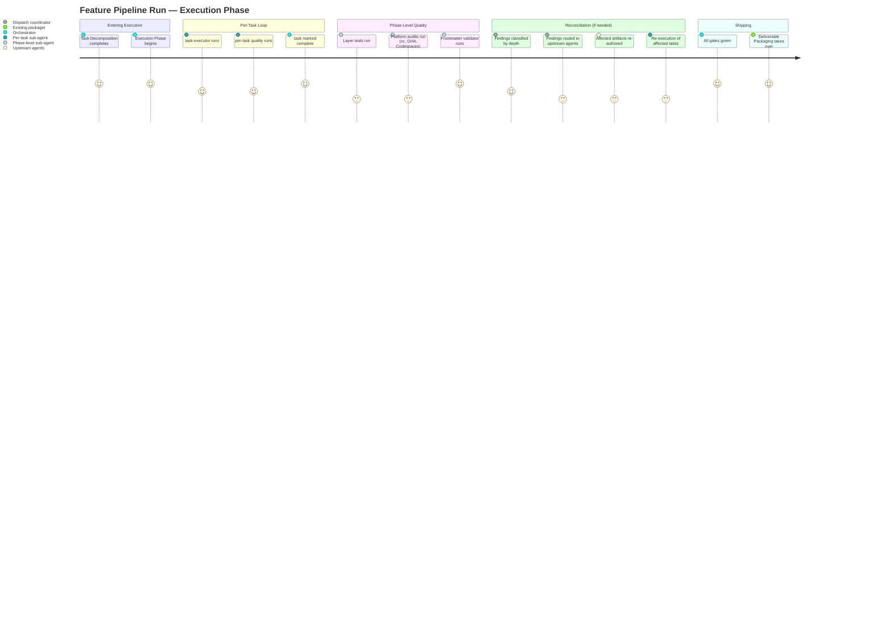
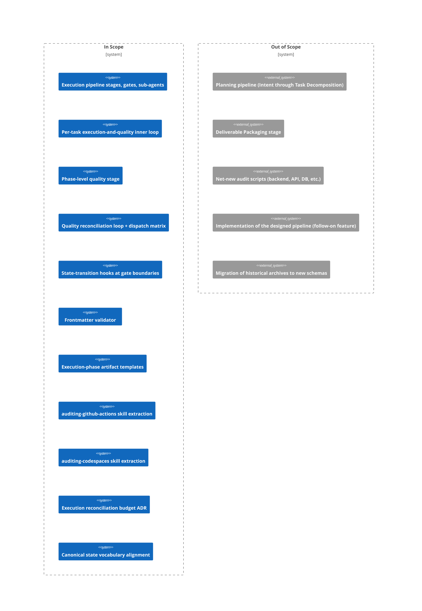

# PRD: Execution Pipeline Design (r1)

## Contents

- [x] Overview
- [x] Stakeholders
- [x] User Stories
- [x] Functional Requirements
- [x] Non-Functional Requirements
- [x] Product Policy Decisions
- [x] Success Criteria
- [x] Technical Considerations
- [x] Rollout Plan
- [x] Undetermined Items
- [x] Appendix

## Overview

### One-line Summary

Formalize the execution side of the feature pipeline as named stages with explicit gates, an automated document-lifecycle, and a depth-classified quality-reconciliation loop that routes findings back to the responsible upstream authoring agent.

### Background

The planning side of the feature pipeline (Intent Clarification through Task Decomposition) has matured through repeated production runs and is governed by templates, gates, sub-agents, and reconciliation discipline (ADR-0021). The execution side — everything from "tasks.json has been authored" through "deliverable archive is shipped" — exists only as ad-hoc orchestration improvised on each run. The most recent run (`audit-findings-remediation-r1`) made the cost of this gap visible: ~35 in-repo files modified, six mid-execution auditor extensions logged, multiple ad-hoc artifacts authored (`implementation-notes.md`, `observations.md`, `reconciliation-log-cycle*.md`, `final-audit-report.md`, `acceptance-matrix.md`, `cross-artifact-audit-final.md`) without templates or frontmatter schemas, and 16 frontmatter inconsistencies discovered at packaging time requiring manual cleanup.

This feature designs the execution side with the same level of rigor the planning side has: named stages, named gates, named sub-agents, defined artifacts with templates, a quality stage that covers tests for all activated layers and the project's three platform-audit families (cc, GitHub Actions, GitHub Codespaces), and a reconciliation loop that classifies quality findings by depth and dispatches them back to the right upstream agent. As prerequisites the same design also (a) automates document-status transitions at gate boundaries to eliminate the manual-frontmatter-cleanup pain, (b) introduces a frontmatter validator that catches lifecycle drift at every gate, and (c) extracts the audit functionality currently embedded in `KB-github-actions-platform` and `KB-codespaces-platform` into peer `auditing-X` skills, mirroring the existing cc-style three-way split per ADR-0031.

### Layer Scope

- [x] **Claude Code / Project Filesystem** — pipeline structure, sub-agent definitions, skill organization, templates, validators
- [ ] **Frontend** — `N/A — out of scope`
- [ ] **Backend** — `N/A — out of scope`
- [ ] **API** — `N/A — out of scope`
- [ ] **Query / Data Access** — `N/A — out of scope`
- [ ] **Database** — `N/A — out of scope`
- [ ] **CI/CD (GitHub Actions)** — `N/A — out of scope` (the *project's* GHA configs are not modified; the GHA *audit pattern* is extracted, which is a Claude Code layer change)
- [ ] **Infrastructure as Code** — `N/A — out of scope`
- [ ] **Dev Environment (Codespaces / Devcontainer)** — `N/A — out of scope` (the *project's* devcontainer is not modified; the Codespaces *audit pattern* is extracted, which is a Claude Code layer change)

This feature is single-layer: it modifies and extends the project's Claude Code configuration (skills, sub-agents, templates, ADRs). It does not modify product-facing layers because there are no product-facing layers — this project's "product" is the feature pipeline itself.

## Stakeholders

### Stakeholder Inventory

| Stakeholder | Description | Primary Layer(s) | Relationship | Volume / Importance |
|-------------|-------------|------------------|--------------|---------------------|
| Project owner | The human running feature pipelines; reads, approves, and intervenes at gates | Claude Code | Direct user / decision-maker | 1; primary |
| Future feature-pipeline runs | Any future invocation of the pipeline; consumes the execution-pipeline design directly | Claude Code | Indirect consumer | ongoing; primary beneficiary |
| Execution-stage sub-agents (to be designed) | The sub-agents this PRD's Blueprint will define (per-task executor, per-task quality, phase-level quality, frontmatter validator, dispatch coordinator) | Claude Code | Internal implementer | ~5 new agents; primary implementer |
| Existing auditing skills (`auditing-cc-configs`, `auditing-skills`, `auditing-subagents`, `auditing-context-files`, `auditing-shared`) | Existing audit infrastructure that the new auditing-X skills extend | Claude Code | Sibling collaborator | 5 existing; pattern source |
| Existing planning-stage sub-agents | The upstream agents (intake-intent-clarifier, intake-prd-author, design-composer, plan-author, task-decomposer, finalize-reconciler, etc.) whose work the execution pipeline consumes and reconciles back to | Claude Code | Upstream producer / reconciliation target | ~12 existing; integration point |
| Document-lifecycle reviewers (`shared-document-reviewer` family) | Existing reviewer infrastructure that the new frontmatter validator sits beside | Claude Code | Sibling collaborator | 1 existing reviewer; pattern source |

### Primary Users

The **project owner** and **future feature-pipeline runs** are the primary users. The project owner approves gates, reviews artifacts, and intervenes when reconciliation escalates. Future runs consume the designed pipeline as their orchestration script. Trade-offs are resolved in favor of (a) reducing manual project-owner intervention at gate boundaries (eliminating the frontmatter-cleanup tax) and (b) making future runs predictable and traceable end-to-end.

## User Stories

### Project Owner

```
As the project owner
I want every gate in the execution side of the pipeline to be explicit and named
So that I always know what stage a run is in and what the next gate's pass criteria are
```

```
As the project owner
I want frontmatter status fields to be updated automatically when a gate passes
So that I don't have to manually patch frontmatter at packaging time to reflect what already happened
```

```
As the project owner
I want quality findings to route back to the right upstream artifact automatically
So that I don't have to manually decide whether a failed E2E test means re-authoring a task, the plan, or the PRD
```

```
As the project owner
I want a bounded reconciliation budget for the execution loop
So that runaway re-authoring loops escalate to me for decision rather than burning resources silently
```

### Future Feature-Pipeline Run (as a stakeholder whose behavior this design constrains)

```
As a future pipeline run
I want every execution-phase artifact I produce to have a template and a frontmatter schema
So that I can author them without inventing conventions ad-hoc and without producing inconsistent archives
```

```
As a future pipeline run
I want each of my code-producing sub-agents to load ai-development-guide
So that the technical-decision criteria, anti-pattern detection, and quality-check workflow are uniformly applied across my execution stages
```

### Execution-Stage Sub-Agent (the agents the Blueprint will design)

```
As an execution-stage sub-agent
I want the depth-classifier and dispatch matrix to be specified at Blueprint time and referenced (not redefined) by me
So that re-entry decisions are consistent across all execution-stage sub-agents
```

### Use Cases

1. **Run-from-scratch execution.** Project owner runs a feature pipeline; after Task Decomposition completes, the execution pipeline takes over with no improvisation, executing tasks, running quality, reconciling findings, and packaging.
2. **Quality finds a plan-level gap.** During phase-level quality, an E2E test reveals that the plan is missing a task; the depth-classifier marks it Level 5; the dispatch matrix routes back to `plan-author`; `plan-vN+1.md` is authored; tasks.json regenerates; affected tasks re-execute; quality re-runs.
3. **Frontmatter validator catches drift mid-run.** At the gate after per-task execution completes, the frontmatter validator notices a stale `status: draft` on a now-ratified artifact; the finding routes as Level 0 (auto-fixable); the state-transition hook fires; the validator passes on retry.
4. **Reconciliation budget exhausted.** Phase-level quality keeps surfacing the same Level 6 finding across multiple cycles; the budget cap is hit; orchestrator escalates to the project owner with the unresolved findings and the option to extend the budget, accept the finding as named-exempt, or abort.
5. **Audit-pattern extraction.** A future per-layer designer for GitHub Actions loads `KB-github-actions-platform` (what) + `KB-github-actions-design` (how) + `auditing-github-actions` (audit) as three peer skills, mirroring the existing cc pattern.

### User Journey Diagram



### Scope Boundary Diagram



## Functional Requirements

Acceptance criteria use EARS format: `WHEN <trigger>, the <subject> shall <response>` (event-driven); `IF <condition>, THEN the <subject> shall <response>` (unwanted-condition); `WHERE <feature/scope>, the <subject> shall <response>` (optional); bare `shall` clauses (ubiquitous).

### Must Have (P1 — MVP)

- [ ] **FR-1: Explicit execution-pipeline stages with named gates and sub-agents** — Stakeholder: Project owner, Future pipeline runs — Layer: Claude Code

  The execution pipeline shall consist of explicit stages between Task Decomposition (the prior stage, out of scope to modify) and Deliverable Packaging (the terminal stage, out of scope to modify). Each stage shall have a named gate, a named owning sub-agent, and at least one named produced artifact.

  *Note on scope:* the stage count, exact stage names, and gate placement (including any user-approval gate between phase-level quality and Deliverable Packaging) are Blueprint decisions. The PRD requires only that the structure be explicit and that each stage meet AC-FR-1-b.

  - AC-FR-1-a: The execution pipeline shall be defined as an ordered sequence of stages in the Blueprint.
  - AC-FR-1-b: Each stage shall have a unique name, an owning sub-agent, a named gate, and at least one named artifact that the gate verifies.
  - AC-FR-1-c: WHEN Task Decomposition completes, the orchestrator shall enter the first execution stage.
  - AC-FR-1-d: WHEN the terminal execution stage's gate passes, the orchestrator shall transition to Deliverable Packaging.

- [ ] **FR-2: Per-task execution-and-quality inner loop** — Stakeholder: Project owner, Future pipeline runs — Layer: Claude Code

  For each task in tasks.json, the orchestrator shall invoke a task-execution sub-agent, then a per-task quality sub-agent. Per-task quality scope is the diff produced by the task-execution sub-agent for that task.

  - AC-FR-2-a: WHEN a task is selected for execution, the orchestrator shall invoke the task-execution sub-agent with the task file and the explicit allowed-file scope per the task's declared Target Files.
  - AC-FR-2-b: WHEN the task-execution sub-agent returns `completed`, the orchestrator shall invoke the per-task quality sub-agent with the `filesModified` returned by the task-execution sub-agent as the per-task quality scope.
  - AC-FR-2-c: WHEN the per-task quality sub-agent returns `approved`, the orchestrator shall mark the task complete and advance to the next task.
  - AC-FR-2-d: WHEN the per-task quality sub-agent returns `stub_detected`, the orchestrator shall route the finding through the dispatch matrix per FR-4 at the depth indicated by the finding (typically Level 1 or 3).
  - AC-FR-2-e: WHEN the per-task quality sub-agent returns `blocked`, the orchestrator shall route the finding through the dispatch matrix per FR-4 at the depth indicated by the blocking reason (typically Level 4 or higher).
  - AC-FR-2-f: WHEN the task-execution sub-agent returns `escalation_needed`, the orchestrator shall route through the dispatch matrix at the depth indicated by the escalation type (typically Level 1 through Level 6 depending on the escalation type).

- [ ] **FR-3: Phase-level quality stage** — Stakeholder: Project owner, Future pipeline runs — Layer: Claude Code

  After all tasks complete, a phase-level quality stage shall execute layer-test suites, the three platform audits (cc, GHA, Codespaces), and the frontmatter validator. Findings flow through the dispatch matrix.

  - AC-FR-3-a: WHEN every task in tasks.json has reached the `completed` state, the orchestrator shall enter the phase-level quality stage.
  - AC-FR-3-b: The phase-level quality stage shall execute, at minimum: all unit tests for every layer activated in the PRD's Layer Scope; all integration tests for every activated layer; all E2E tests for every activated layer (when defined); cc-audit project-wide; GitHub Actions workflow audit; GitHub Codespaces audit (feature-scoped — auditing whatever codespaces configuration the feature touches; a feature that touches no codespaces configuration produces a no-op pass; at this feature's ship time, `auditing-codespaces` may be a stub per FR-8-b in which case the audit is a no-op pass placeholder); the frontmatter validator (FR-6).
  - AC-FR-3-c: The phase-level quality stage shall produce a phase-quality-report artifact summarizing pass/fail counts per check.
  - AC-FR-3-d: WHEN any check fails, the failing finding(s) shall be classified by depth per the dispatch matrix (FR-4) before the phase-quality-report is emitted.
  - AC-FR-3-e: WHEN all checks pass with zero findings (or only named-exempt findings per the project's exemption mechanism per ADR-0030 mechanism α), the phase-level quality gate shall pass and the orchestrator shall transition to Deliverable Packaging.
  - AC-FR-3-f: WHERE the project's Layer Scope activates a layer for which no test suite exists, the phase-level quality stage shall emit a Level-5 finding ("plan-level gap: layer activated without test infrastructure") rather than silently passing.

- [ ] **FR-4: Quality-finding depth classifier and dispatch matrix** — Stakeholder: Project owner, Execution-stage sub-agents — Layer: Claude Code

  Every quality finding shall be classified into one of nine depth levels (Level 0 through Level 8) corresponding to the upstream artifact that must be re-authored or re-executed to address the finding. The dispatch matrix maps each level to a re-entry agent.

  - AC-FR-4-a: The depth classifier shall produce a label in the set {Level 0, Level 1, Level 2, Level 3, Level 4, Level 5, Level 6, Level 7, Level 8}.
  - AC-FR-4-b: Each level shall have a single defined dispatch target in the matrix, named by sub-agent role.
  - AC-FR-4-c: The depth semantics shall be: Level 0 = auto-fixable (lint/format/style); Level 1–2 = task-implementation or test bug (re-run task-executor); Level 3 = security/correctness audit finding (mechanism α applies); Level 4 = task-as-written produces wrong output (re-author task in tasks.json); Level 5 = plan-level gap (re-author plan); Level 6 = blueprint-level design flaw (re-author blueprint); Level 7 = PRD-level requirement contradiction (re-author PRD); Level 8 = intent misinterpreted (re-clarify intent).
  - AC-FR-4-d: WHEN a finding routes to Level 4 or higher, the cascade rules in the Blueprint shall determine which downstream artifacts must be re-derived.
  - AC-FR-4-e: The Blueprint shall publish the dispatch matrix as a single source of truth referenced (but not re-defined) by execution-stage sub-agents.
  - AC-FR-4-f: An ADR shall be authored documenting the depth classifier's semantics and the dispatch matrix.

- [ ] **FR-5: State-transition hooks at every gate boundary** — Stakeholder: Project owner — Layer: Claude Code

  When any pipeline gate passes — planning-side or execution-side — the orchestrator shall update the frontmatter `status` field of the artifact(s) the gate produces.

  - AC-FR-5-a: WHEN any pipeline gate passes, the orchestrator shall fire a state-transition hook updating the frontmatter `status` field of every artifact the gate produces, to the next state in the canonical state vocabulary (FR-11).
  - AC-FR-5-b: WHEN reconciliation (planning-side or execution-side) re-authors an artifact, the orchestrator shall update the prior version's frontmatter `status` to `superseded` and add a `superseded_by:` field naming the new version.
  - AC-FR-5-c: WHEN the phase-level quality gate passes (or the named-exempt mechanism α exemption is applied), the orchestrator shall update each ratified pipeline artifact's `status` to the final ship state.
  - AC-FR-5-d: State transitions shall be observable in the deliverable archive after the run — every artifact's `status` shall accurately reflect its lifecycle position at archive time.
  - AC-FR-5-e: IF a state-transition hook fails (file write error, missing target artifact, etc.), THEN the gate that triggered it shall be marked failed and the failure shall surface as a Level-1 finding routed through FR-4.

- [ ] **FR-6: Frontmatter validator** — Stakeholder: Project owner, Future pipeline runs — Layer: Claude Code

  A frontmatter validator shall exist as a callable script and shall run at every gate. Findings flow through the dispatch matrix.

  - AC-FR-6-a: The frontmatter validator shall be invokable as a script (callable from any sub-agent and from the orchestrator's state-transition hooks).
  - AC-FR-6-b: The frontmatter validator shall check, at minimum: required fields present per the artifact's doc-type schema; `status` value is in the canonical state vocabulary (FR-11); `status` value is current for the pipeline state (e.g., a ratified artifact is not still in `draft`); superseded artifacts have `superseded_by:` back-link; execution-phase artifacts conform to the schemas defined in FR-7.
  - AC-FR-6-c: WHEN the frontmatter validator detects a missing required field or invalid value, it shall emit a finding at Level 0 (auto-fixable) or Level 1 (manual correction needed) per the dispatch matrix.
  - AC-FR-6-d: The frontmatter validator shall run as part of the phase-level quality stage (FR-3) and shall additionally be invokable at every other gate.
  - AC-FR-6-e: The validator's failure on a planning-side artifact shall route the finding to the planning-side reconciliation flow (governed by ADR-0021); the validator's failure on an execution-side artifact shall route through the execution-side flow (governed by the ADR from FR-10).

- [ ] **FR-7: Execution-phase artifact schemas and templates** — Stakeholder: Future pipeline runs — Layer: Claude Code

  Every execution-phase artifact shall have a template in `KB-documentation-criteria/references/templates/` and a frontmatter schema documented in `shared-conventions.md`.

  - AC-FR-7-a: Each execution-phase artifact named in the Blueprint shall have a template file in `KB-documentation-criteria/references/templates/` with the suffix `-template.md`.
  - AC-FR-7-b: Each execution-phase artifact's frontmatter schema shall be documented in `KB-documentation-criteria/references/shared-conventions.md` under a new section "Execution-phase artifact frontmatter."
  - AC-FR-7-c: The execution-phase artifact list shall include at minimum the following named artifacts (final enumeration is a Blueprint decision; this list is the irreducible floor): per-task execution log; phase-quality report; quality-reconciliation log (per cycle); frontmatter-validation report; execution-reconciliation log.
  - AC-FR-7-d: WHERE the design's stage decomposition produces additional artifacts beyond the minimum, those additional artifacts shall also conform to AC-FR-7-a and AC-FR-7-b.

- [ ] **FR-8: Three-way auditing split for GitHub Actions and Codespaces** — Stakeholder: Audit-subsystem maintainers, Future pipeline runs — Layer: Claude Code

  The `KB-X-platform` / `KB-X-design` / `auditing-X` three-way split (established for Claude Code in the existing skill structure and referenced in ADR-0031) shall be applied to GitHub Actions and Codespaces by extracting the existing audit functionality into peer `auditing-X` skills.

  - AC-FR-8-a: A new skill `auditing-github-actions` shall exist at `.claude/skills/auditing-github-actions/` with its own `SKILL.md` and any audit scripts moved out of `KB-github-actions-platform/scripts/`.
  - AC-FR-8-b: A new skill `auditing-codespaces` shall exist at `.claude/skills/auditing-codespaces/` with its own `SKILL.md`. WHERE `KB-codespaces-platform/scripts/` currently contains audit scripts, those scripts shall be moved to `auditing-codespaces/scripts/`. WHERE no audit scripts currently exist in `KB-codespaces-platform/scripts/` (per the pre-implementation pre-scan), the new `auditing-codespaces` skill shall ship as a **stub** — SKILL.md only, no audit scripts. The stub preserves the 3-way-split structural pattern (ADR-0031) so future codespaces audit scripts have a canonical home; authoring the actual audit scripts is explicitly out of scope per the Won't-Have carve-out below.
  - AC-FR-8-c: Helpers shared between the new auditing skills and any existing `auditing-*` skills shall be placed in `auditing-shared` per ADR-0031.
  - AC-FR-8-d: WHEN any sub-agent or script references the audit functionality, it shall load the new `auditing-X` skill rather than `KB-X-platform`.
  - AC-FR-8-e: The `KB-X-platform/SKILL.md` Contents lists shall be updated to remove references to scripts that have moved, and shall point to the new `auditing-X` skill for audit functionality.
  - AC-FR-8-f: WHERE a caller agent (e.g., `design-cicd`, `design-codespaces`) currently loads `KB-X-platform` and uses its audit functionality, that agent's `skills:` frontmatter shall be updated to additionally (or instead) load the new `auditing-X` skill, per the rationale in the Blueprint.

- [ ] **FR-9: `ai-development-guide` skill binding on code-producing sub-agents** — Stakeholder: Project owner, Future pipeline runs — Layer: Claude Code

  Every execution-phase sub-agent that produces or modifies code shall load the `ai-development-guide` skill. The skill itself shall be installed in the project (`.claude/skills/ai-development-guide/`) as part of this feature's Plan; the user-uploaded reference (`/mnt/user-data/uploads/SKILL__2_.md`) shall be the source content.

  - AC-FR-9-a: The task-execution sub-agent (and any other execution-phase sub-agent that writes or modifies code) shall list `ai-development-guide` in its frontmatter `skills:` field.
  - AC-FR-9-b: The Blueprint shall document which execution-phase sub-agents qualify as "code-producing" for the purpose of this binding.
  - AC-FR-9-c: WHEN the frontmatter validator (FR-6) runs against a code-producing execution-phase sub-agent's definition, it shall fail if `ai-development-guide` is absent from the agent's `skills:` field.
  - AC-FR-9-d: The `ai-development-guide` skill's purpose (technical decision criteria, anti-pattern detection, debugging techniques, quality-check workflow) shall be cited in the Blueprint as the rationale for FR-9.
  - AC-FR-9-e: The Plan shall include a task installing `ai-development-guide` skill at `.claude/skills/ai-development-guide/SKILL.md`, sourcing content from the user-uploaded reference at `/mnt/user-data/uploads/SKILL__2_.md`. This task shall execute before any execution-phase sub-agent definitions that bind to the skill, so that FR-9's binding has a real target.

- [ ] **FR-10: Execution-side reconciliation budget** — Stakeholder: Project owner — Layer: Claude Code

  The execution-side reconciliation loop (FR-4) shall have a budget defined by an ADR, distinct from the planning-side budget defined in ADR-0021. WHEN the budget is exhausted, the orchestrator shall escalate to the user.

  - AC-FR-10-a: An ADR shall be authored defining the execution-side reconciliation budget (numeric cycle cap and escalation policy).
  - AC-FR-10-b: The budget cap shall apply to the quality-reconciliation loop (FR-4) but shall not modify the planning-side budget governed by ADR-0021.
  - AC-FR-10-c: WHEN the budget is exhausted, the orchestrator shall produce a `budget-exhausted` artifact summarizing the unresolved findings and shall escalate to the project owner with the options to extend the budget, accept the finding(s) as named-exempt (per mechanism α / ADR-0030 if applicable), or abort the run.
  - AC-FR-10-d: The budget numeric cap shall be a per-feature configurable value with a project-wide default specified in the authoring ADR.

- [ ] **FR-11: Canonical state vocabulary** — Stakeholder: Project owner, Future pipeline runs — Layer: Claude Code

  The frontmatter `status` field shall use a single canonical vocabulary documented in one location (`shared-conventions.md`). The vocabulary shall be consistent between the spec, the templates, and the validator.

  - AC-FR-11-a: The canonical state vocabulary shall be documented in `shared-conventions.md` as the single source of truth.
  - AC-FR-11-b: Every artifact template in `KB-documentation-criteria/references/templates/` shall use a default `status:` value drawn from the canonical vocabulary.
  - AC-FR-11-c: The frontmatter validator (FR-6) shall flag any artifact whose `status` value is not in the canonical vocabulary.
  - AC-FR-11-d: WHERE prior archives (pre-implementation of this feature) use divergent vocabulary (e.g., `approved` instead of `accepted`), the validator's enforcement shall be scoped to the post-implementation date forward; historical archives shall not be migrated (per the IC's "NOT in scope" declaration).
  - AC-FR-11-e: An ADR shall be authored that pins the canonical vocabulary and explicitly resolves the current drift (the choice between continuing `accepted` per `shared-conventions.md` or codifying `approved` per existing archive practice).

### Should Have (P2)

- [ ] **FR-12: Phase-quality-report frontmatter includes audit-counter delta** — Stakeholder: Project owner — Layer: Claude Code

  The phase-quality-report artifact shall include in its frontmatter a delta between the run's starting audit counts and ending audit counts, to make the run's quality impact directly visible without re-running audits.

  - AC-FR-12-a: WHEN the phase-quality-report is authored, its frontmatter shall include `audit_baseline:` (counts at run start) and `audit_final:` (counts at run end) for each platform audit family (cc, GHA, Codespaces, frontmatter validator).
  - AC-FR-12-b: The deliverable archive shall surface this delta in the packager-report summary.

### Could Have (P3)

- [ ] **FR-13: Reconciliation-log entries machine-parseable** — Stakeholder: Future pipeline runs — Layer: Claude Code

  Quality-reconciliation log entries shall use a structured format (markdown with consistent headers and machine-extractable fields) so that downstream tooling can aggregate cross-feature reconciliation patterns over time.

  - AC-FR-13-a: The quality-reconciliation log template (FR-7) shall define a consistent per-entry structure with explicit field labels.
  - AC-FR-13-b: A future analytics pass shall be able to extract finding-depth distribution, dispatch-target frequency, and budget-utilization metrics from the reconciliation logs without bespoke parsing per archive.

### Won't Have (this release)

- **Implementation of the designed pipeline.** This feature ships the design artifacts (PRD, Blueprint, per-layer Designs, Plan, Acceptance Tests, Phase Validators) and the artifact templates the design specifies. Building the actual sub-agents, scripts, and orchestrator logic is a follow-on feature.
- **Authoring net-new audit scripts.** The pipeline can call audits the project hasn't authored yet; those will surface as findings during real execution and become future feature opportunities. **Narrow exception (per FR-8-b):** authoring a stub `auditing-codespaces/SKILL.md` (no audit scripts; preserves the 3-way-split structural pattern only) is permitted to give future codespaces audit scripts a canonical home. Actual codespaces audit script authoring remains out of scope.
- **Migration of historical archives.** Archives produced under the prior improvised model (e.g., `audit-findings-remediation-r1`) stand as authored.
- **Changes to the planning pipeline.** Intent through Task Decomposition stays as-is. This feature builds on top.
- **Changes to ADR-0021.** The planning-side reconciliation budget is untouched; the execution-side gets its own ADR (FR-10).

## Non-Functional Requirements

### Performance

- **Frontmatter validator runtime**: The validator shall complete in under 2 seconds for a typical feature archive (≤50 artifacts including ADRs). This is a soft target validated at implementation time.
- **State-transition hook overhead**: Each hook firing shall add no more than 100ms of orchestrator overhead. The hook is a frontmatter rewrite, not a full re-audit.
- **Phase-level quality stage runtime**: No PRD-level target. Phase-level quality is bounded by the slowest underlying check (typically the full test suite); a target is a Blueprint-time concern, not a PRD commitment.

### Reliability

- **State-transition atomicity**: The state-transition hook (FR-5) shall either complete successfully (frontmatter updated, gate marked passed) or fail visibly (gate marked failed, finding emitted). Partial state changes that leave artifacts in inconsistent status shall not occur.
- **Reconciliation loop termination**: The execution-side reconciliation loop shall terminate within the budget defined by FR-10, either by reaching all-green or by escalating to the user. Infinite loops are prevented by hard cap.
- **Dispatch matrix completeness**: For every possible quality-finding type, the dispatch matrix shall have a defined depth. No finding shall be unrouteable.

### Security

`N/A — out of scope.` This feature designs internal pipeline tooling. There is no external surface, no user-data handling, no authentication boundary. The contributor/agent access policy (which agents are allowed to write code) is documented under Product Policy Decisions.

### Scalability

- **Per-feature artifact count**: The design shall not assume an upper bound on the number of artifacts in a feature archive, but the frontmatter validator's performance commitment scales linearly with artifact count.
- **Per-feature task count**: The per-task inner loop shall not assume an upper bound on the number of tasks in tasks.json.

### Accessibility

`N/A — out of scope.` Pipeline tooling has no UI surface beyond the project owner's terminal/IDE, governed by general developer-tooling conventions.

### Compatibility

- **Backward compatibility with the planning side**: All planning-side sub-agents, gates, ADRs, and conventions shall continue to function unchanged. The execution-side design extends the pipeline; it does not replace any part of the planning side.
- **Backward compatibility with existing archives**: Historical archives (predating this feature's implementation) shall remain readable and shall not be required to migrate to new schemas (per FR-11-d).

### Data

`N/A — out of scope.` This feature does not introduce data storage, retention, or residency concerns.

### Operability

- **Observability commitment**: Every gate pass, every reconciliation cycle, every state transition shall be observable from the deliverable archive after the run. The project owner shall be able to reconstruct a run's full history from the archive without external logs.
- **On-call burden**: `N/A` — the pipeline runs in interactive sessions with the project owner present; there is no on-call.

### Developer Experience

- **Time to first successful execution run**: After implementation of the designed pipeline (a separate feature), the project owner shall be able to run a feature pipeline end-to-end without manual frontmatter cleanup at packaging time. This is the headline DX outcome.
- **Manual intervention budget per run**: Project owner manual interventions shall be limited to gate approvals and reconciliation-budget escalations. No "fix the frontmatter at the end" or "audit the document state by hand" steps shall remain.
- **Agent-driven workflow support**: All execution-stage sub-agents shall be invokable both via the orchestrator and ad-hoc (for debugging) per the existing project agent conventions.

## Product Policy Decisions

| Policy Area | Decision | Rationale | Affected Layers |
|-------------|----------|-----------|-----------------|
| Contributor / agent access | Execution-stage sub-agents may write, edit, and delete files only within the scope declared in the task file's Target Files (per the task-executor reference template's File Scope Constraint). Any file outside that scope requires escalation. | Bounds the blast radius of agentic code changes; preserves the predictability of the per-task loop. | Claude Code |
| Reconciliation escalation | When the execution-side budget is exhausted (per FR-10), the orchestrator escalates to the project owner with three options: extend the budget; accept the finding as named-exempt (per mechanism α / ADR-0030); abort the run. | Bounds runaway loops; preserves project-owner agency at the boundary of what the pipeline can resolve autonomously. | Claude Code |
| Mechanism α applicability to execution-side findings | The pedagogical-marker / inline-justification mechanism (ADR-0030) shall apply to execution-side audit findings the same way it applies to planning-side ones: a finding may be marked named-exempt with an inline justification subject to the same validation rules. | Consistent exemption discipline across planning and execution; no two-tier exemption regime. | Claude Code |
| Historical archive policy | Pre-implementation archives are not migrated. The validator's enforcement scopes to the post-implementation date forward. | Avoids unbounded migration work; respects the "no scope creep" principle. | Claude Code |
| Canonical state vocabulary | The ADR per FR-11-e pins exactly one vocabulary; templates, the validator, and the spec are aligned to it. The choice between `accepted` (current spec) and `approved` (current archive practice) is an open item resolved during PRD reconciliation or Blueprint authoring; this PRD does not pre-commit. | Spec/practice drift was the root cause of the manual cleanup pain; pinning a single vocabulary is the structural fix. | Claude Code |

## Success Criteria

### Quantitative Metrics

| Metric | Stakeholder | Target | Measurement Method | Timeframe |
|--------|-------------|--------|--------------------|-----------|
| Pipeline artifacts shipped for this feature | Project owner | All artifacts per the project's FULL-scope deliverable-archive spec are produced and pass audit | Project audit (`audit_project.py` + manual deliverable-archive validator) at packaging time | This feature's deliverable packaging |
| BLOCKER findings against shipped artifacts | Project owner | 0 | `audit_project.py` against the shipped archive | At feature shipping |
| MAJOR findings against shipped artifacts | Project owner | ≤1 (named-exempt) | Same | At feature shipping |
| Frontmatter inconsistencies in the shipped archive | Project owner | 0 (after the frontmatter validator runs against the shipped archive) | Frontmatter validator run | At feature shipping |
| Manual frontmatter patches required at packaging time | Project owner | 0 | Diff between pre-packaging frontmatter state and post-packaging frontmatter state | At packaging |

### Qualitative Metrics

1. The project owner reports that the next feature pipeline run (the follow-on implementation feature, plus any subsequent runs) does not require manual frontmatter cleanup at packaging time.
2. The project owner reports that quality findings during the next run are routed automatically (or with minimal intervention) to the right upstream agent rather than requiring manual triage.
3. The Blueprint's stage decomposition, dispatch matrix, and reconciliation-budget specification are detailed enough that a follow-on implementation feature can be authored from them without re-opening this PRD.

### UI Quality Metrics

`N/A — out of scope` (no UI surface).

### API Quality Metrics

`N/A — out of scope` (no API surface).

### Operational Metrics

`N/A — out of scope` (pipeline is interactive, no production operational metrics).

### Developer Experience Metrics

1. Time spent on manual frontmatter cleanup during deliverable packaging of any future pipeline run: target 0 minutes (down from the ~15-20 minutes that surfaced in the prior run).
2. Time spent on manual quality-finding triage (deciding which upstream agent to re-invoke) during any future pipeline run: target ≤5 minutes per finding for novel cases, 0 minutes for cases the dispatch matrix already covers.

## Technical Considerations

### Dependencies

- **Existing systems we depend on**:
  - The planning pipeline (Intent through Task Decomposition) and all its sub-agents, templates, and conventions.
  - The existing audit infrastructure: `auditing-shared`, `auditing-cc-configs`, `auditing-skills`, `auditing-subagents`, `auditing-context-files`.
  - `KB-documentation-criteria` and its templates, particularly `shared-conventions.md` (which this feature extends).
  - `KB-github-actions-platform` and `KB-codespaces-platform` (whose audit functionality this feature extracts).
  - ADR-0021 (planning-reconciliation budget — referenced but not modified), ADR-0029 (deviation surfacing — applies to execution as well), ADR-0030 (mechanism α — applies to execution-side findings), ADR-0031 (auditing-shared canonical home — the pattern this feature extends to GHA and Codespaces).
  - The `ai-development-guide` skill (binding constraint per FR-9).
  - The user-uploaded reference templates (`task-executor`, `quality-fixer`) — used as inspiration / reference points for the Blueprint, not adopted verbatim.
- **External services we depend on**: None.
- **Upstream features that must ship first**: None.
- **Downstream consumers affected by this change**:
  - All future feature pipeline runs (primary downstream consumer).
  - The follow-on implementation feature that builds the sub-agents and scripts the Blueprint will specify.

### Constraints

- **Technical constraints**: The execution pipeline must be runnable in the existing Claude Code / project-filesystem environment. Sub-agents are markdown files with YAML frontmatter under `.claude/agents/`. Skills are markdown files with YAML frontmatter under `.claude/skills/`. No new infrastructure (no databases, no external services, no compiled binaries) shall be introduced by this design.
- **Resource constraints**: Authoring is done by Claude acting as each sub-agent role; no team-capacity constraints apply.
- **Time constraints**: None.
- **Regulatory / contractual constraints**: None.

### Assumptions

- [ ] **A-1**: The `ai-development-guide` skill content (the user-uploaded reference at `/mnt/user-data/uploads/SKILL__2_.md`) is suitable for installation as a project skill. Validation: read the uploaded reference during the Discovery / Research stage and confirm its structure matches the project's skill conventions (frontmatter shape, SKILL.md primary file). Owner: discovery-codebase-researcher. By: before Synthesis. **Pre-implementation pre-scan note:** the `ai-development-guide` skill is NOT currently installed in `.claude/skills/`; FR-9-e (added in this version) authorizes a Plan task to install it from the uploaded reference.
- [ ] **A-2**: The existing `KB-github-actions-platform` has audit scripts (e.g., `audit_workflow.py`) that the new `auditing-github-actions` skill will inherit. Validation: directory inspection. Owner: discovery-codebase-researcher. By: before Synthesis.
- [ ] **A-3**: `KB-codespaces-platform` ships its audit scripts (if any). **Pre-implementation pre-scan note:** `KB-codespaces-platform/scripts/` does not currently exist; FR-8-b (clarified in this version) authorizes the stub-skill path. Validation: directory inspection (already performed, confirming the stub path). Owner: discovery-codebase-researcher. By: before Synthesis.
- [ ] **A-4**: The `shared-conventions.md` document accepts an additional section for execution-phase artifact frontmatter without restructuring the existing planning-side guidance. Validation: read the current `shared-conventions.md`. Owner: design-cc. By: per-layer Design.
- [ ] **A-5**: The existing `shared-document-reviewer` sub-agent can be referenced by the new frontmatter validator (FR-6) for shared utilities, or the validator can be implemented as a standalone callable script that mirrors the reviewer's conventions. Validation: read the reviewer's current structure. Owner: design-cc. By: per-layer Design.

### Risks and Mitigation

| Risk | Stakeholder Affected | Impact | Probability | Mitigation |
|------|----------------------|--------|-------------|------------|
| Dispatch matrix mis-classifies a finding's depth, routing to wrong upstream agent | Project owner, Future runs | Medium | Medium | Blueprint specifies the classifier with explicit examples per level; reconciliation budget caps cascade; mechanism α offers escape hatch for stuck findings |
| State-transition hook silently fails, leaving status fields stale | Project owner | High | Low | FR-5-e requires hooks to fail visibly; frontmatter validator (FR-6) catches drift at every gate as a secondary defense |
| Three-way split for GHA/Codespaces breaks existing callers | Project owner | Medium | Medium | FR-8-d/e/f require caller updates as part of the same change; Plan sequences the extraction before the new callers |
| Execution-side reconciliation budget consistently exhausts (loop too tight) | Project owner | Medium | Low | FR-10-d allows per-feature configurability; ADR sets a sensible default; project owner can adjust based on observed cycles |
| `ai-development-guide` skill content changes downstream and breaks binding sub-agents | Project owner | Low | Low | FR-9 binds by name; skill content changes are within the project's normal change discipline |
| Frontmatter validator scope-creeps into structural document review | Project owner | Medium | Medium | FR-6-b enumerates the validator's checks explicitly; structural review remains the `shared-document-reviewer`'s domain |
| Templates for execution-phase artifacts (FR-7) miss a category and force ad-hoc invention again | Future runs | Medium | Medium | FR-7-c names an irreducible floor; Blueprint enumerates the full set; first follow-on run validates completeness empirically |

## Rollout Plan

This feature ships design artifacts only. There is no end-user rollout. The rollout plan covers the transition from "design shipped" to "design in use":

- **Launch audience progression**: N/A (no user-facing release). The design is shipped to the deliverable archive; the follow-on implementation feature consumes it.
- **Communication plan**: The design's existence is communicated by its presence in the archive. The follow-on implementation feature's PRD will derive from this PRD.
- **Migration path**: Per FR-11-d and the IC's "NOT in scope," historical archives are not migrated. New runs after the follow-on implementation feature ships will use the new design.
- **Kill criteria**: This design ships if the audit passes at Gate 4 (Cross-Artifact Audit). If reconciliation cannot converge within the planning-side budget (ADR-0021), the project owner is escalated and may choose to descope, defer, or rework.

## Undetermined Items

All PRD-level undetermined items were resolved at authoring time by being inline-deferred to downstream stages within the relevant FR bodies. No `[ ]` items remain. The Blueprint author and ADR author should attend to the following deferred decisions, each surfaced in its FR:

- Per-task quality scope (diff-only vs include cross-task smoke regression) — deferred by FR-2 (the PRD commits to diff scope via AC-FR-2-b; any additional smoke-regression scope is a Blueprint extension).
- Phase-level test scope (full repo vs activated-layer-only) — deferred by FR-3-b ("all" tests for activated layers; the scoping rule for "all" is a Blueprint decision).
- Reconciliation budget numeric cap and per-feature default — deferred by FR-10-a (ADR to be authored) and FR-10-d (per-feature configurable).
- User-approval gate placement between phase-level quality and Deliverable Packaging — deferred by FR-1's "Note on scope" (gate placement is a Blueprint decision).
- Full enumeration of execution-phase artifact templates beyond the FR-7-c floor — deferred by AC-FR-7-d.
- Canonical state vocabulary choice (`accepted` vs `approved`) — deferred by FR-11-e (ADR to be authored).

## Appendix

### References

- `working/feature/execution-pipeline-design-r1/intent-clarification.md` (IC, ratified at Gate 1 with token `IC-CONFIRM-execution-pipeline-design-r1-20260522T024500Z`)
- `working/feature/audit-findings-remediation-r1/` (prior feature whose execution surfaced the manual-cleanup pain that motivates FR-5, FR-6, FR-11)
- `.claude/skills/KB-documentation-criteria/references/shared-conventions.md` (extended by FR-7-b, FR-11)
- `.claude/skills/KB-documentation-criteria/references/deliverable-archive-spec.md` (referenced for current planning-side artifact specifications)
- `.claude/skills/ai-development-guide/SKILL.md` (binding per FR-9; validation A-1)
- `adrs/ADR-0021-discovery-phase-architecture.md` (planning-side budget; referenced but not modified)
- `adrs/ADR-0029-no-silent-scope-changes-principle.md` (applies to execution-side surfacing)
- `adrs/ADR-0030-mechanism-alpha-pedagogical-marker-justification.md` (named-exempt mechanism, applies to execution-side findings per Product Policy Decisions)
- `adrs/ADR-0031-auditing-shared-skill-module.md` (pattern this feature extends to GHA and Codespaces per FR-8)
- User-uploaded reference templates: `task-executor` (per-task execution), `quality-fixer` (per-task quality). Used as Blueprint inspiration, not adopted verbatim.

### Glossary

- **Execution pipeline**: The stages of the feature pipeline between Task Decomposition (the last planning stage, out of scope to modify) and Deliverable Packaging (the existing terminal stage, out of scope to modify).
- **Per-task execution-and-quality loop**: The inner loop of the execution pipeline; runs once per task in tasks.json.
- **Phase-level quality stage**: The outer-pass quality stage that runs once after all per-task loops complete; covers full layer tests and platform audits.
- **Finding-depth classifier**: A function that maps a quality finding to a depth label in {Level 0 … Level 8}.
- **Dispatch matrix**: A lookup table mapping each depth label to a re-entry agent.
- **Quality-reconciliation loop**: The outer loop that processes Level 4+ findings by dispatching them back to upstream authoring agents and re-deriving downstream artifacts.
- **State-transition hook**: An orchestrator-fired step at every gate boundary that updates the `status` frontmatter field of every artifact the gate produces.
- **Frontmatter validator**: A new sub-agent / callable script that checks frontmatter conformance to per-doc-type schemas, status currency, and supersession back-links at every gate.
- **Canonical state vocabulary**: The single source of truth set of allowed `status` values, used consistently across spec, templates, and validator (FR-11).
- **`auditing-X` skill**: A skill following the cc-style three-way split pattern (KB-platform = what, KB-design = how, auditing-X = audit), per ADR-0031.
- **`ai-development-guide` skill**: The project skill containing technical decision criteria, anti-pattern detection, debugging techniques, and a quality-check workflow. Binding on code-producing execution-phase sub-agents per FR-9.
- **Named-exempt finding** (per ADR-0030): A finding the orchestrator may accept without resolving, subject to inline-justification validation rules. Applies to both planning-side and execution-side findings per Product Policy Decisions.
- **Reconciliation budget**: A bounded cycle cap on the reconciliation loop. Planning-side budget is defined in ADR-0021; execution-side budget is defined in a new ADR per FR-10.
