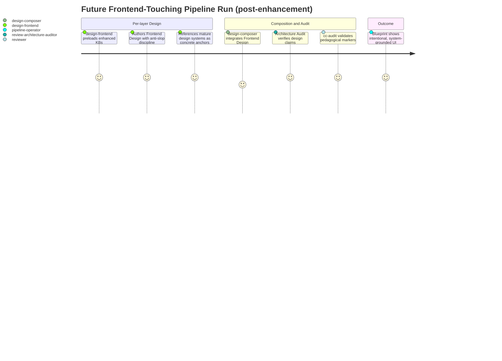
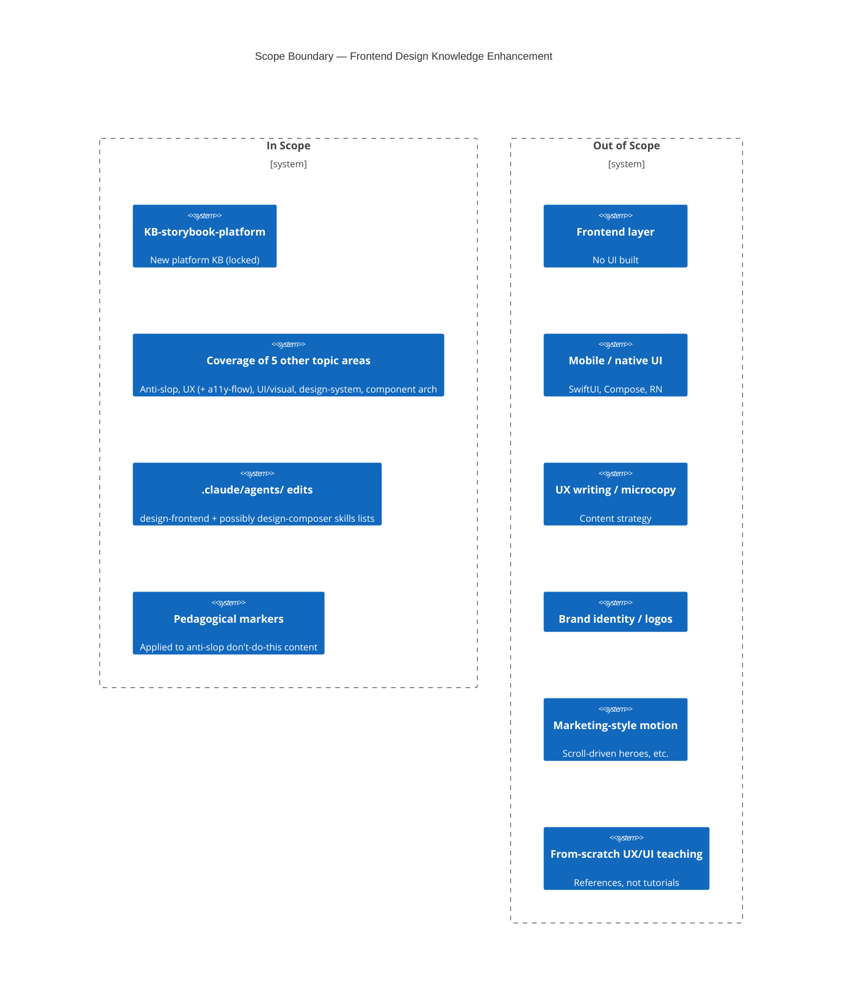

# PRD: Frontend Design Knowledge Enhancement — Round 1

## Contents

- [x] Overview
- [x] Stakeholders
- [x] User Stories
- [x] Functional Requirements
- [x] Non-Functional Requirements
- [x] Product Policy Decisions
- [x] Success Criteria
- [x] Technical Considerations
- [x] Rollout Plan
- [x] Undetermined Items
- [x] Appendix

## Overview

### One-line Summary

Enhance the project's frontend design knowledge so future Frontend-touching pipeline runs produce intentional, system-grounded UI design rather than generic AI-default aesthetics.

### Background

The existing `KB-frontend-design` covers backend-of-the-frontend material: state separation, colocation, accessibility baseline, performance budgets, error boundaries, typing, framework grain. The visual, interaction, system-architecture, and tooling layers are absent. Future Frontend-touching features that come through `recipe-feature-pipeline` therefore lack preload-time guidance on anti-slop aesthetic discipline, UX design (information architecture, journeys, heuristics, cognitive load, accessibility-as-flow), UI / visual design (type scales, color, spacing, motion, hierarchy, density), design system architecture (tokens, theming, semver), component architecture (atomic, compound, headless, polymorphic, slot, ref-forwarding, prop-API), and Storybook (CSF3, args/argTypes, play functions, decorators, addons, composition, visual regression).

This run is also integration test #2 for the v4.3.1 pipeline — the first real, non-synthetic execution after the `/healthz` simulation that drove ADR-0023. Any pipeline-machinery defects surfaced here are expected to be captured in a sibling ADR alongside whatever ADR the per-layer Design stage produces.

### Layer Scope

Declare which engineering layers this feature touches. The same 9-layer taxonomy is used by the PRD and the Blueprint — see `../layer-taxonomy.md` for full descriptions.

- [x] **Claude Code / Project Filesystem** — CLAUDE.md, slash commands, hooks, skills, MCP configuration, project conventions
- [ ] **Frontend** — UI components, client state, routing, styling
- [ ] **Backend** — services, domain logic, background jobs, schedulers
- [ ] **API** — HTTP/GraphQL/RPC endpoints, contracts, versioning
- [ ] **Query / Data Access** — ORM models, repositories, query layer, caching
- [ ] **Database** — schema, migrations, indexes, constraints, seed data
- [ ] **CI/CD (GitHub Actions)** — workflows, jobs, reusable actions, environments, secrets
- [ ] **Infrastructure as Code** — Terraform/Pulumi/CDK/CloudFormation modules, state, providers
- [ ] **Dev Environment (Codespaces / Devcontainer)** — devcontainer.json, prebuilds, ports, lifecycle scripts

**Note on Frontend being out of scope.** Despite the feature being *about* frontend, the Frontend layer is NOT checked because this run authors knowledge content (`.claude/skills/`) and edits sub-agent definitions (`.claude/agents/`). It does not build UI components, modify client state, or change rendering. Per `layer-taxonomy.md`'s "Claude Code / Project Filesystem vs everything else" boundary case, introducing or modifying `.claude/skills/` and `.claude/agents/` counts as Claude Code / Project Filesystem only.

## Stakeholders

### Stakeholder Inventory

| Stakeholder | Description | Primary Layer(s) | Relationship | Volume / Importance |
|-------------|-------------|------------------|--------------|---------------------|
| `design-frontend` sub-agent | The per-layer Designer that produces the Frontend Design subsection of any Blueprint when a feature touches the Frontend layer | Claude Code / Project Filesystem | Direct consumer of the new KBs via `skills:` preload | Activated on every Frontend-touching feature |
| `design-composer` sub-agent | The fan-in agent that integrates per-layer designs into the Blueprint | Claude Code / Project Filesystem | Indirect consumer; needs cross-layer integration vocabulary | Activated on every multi-layer feature |
| `plan-author` sub-agent | Produces the implementation plan from the Blueprint | Claude Code / Project Filesystem | Consumes Frontend tasks; needs shared vocabulary for UI quality | Activated on every feature |
| `shared-document-reviewer` + `review-architecture-auditor` | Review pipeline-produced artifacts at Gate 0/1 and Architecture Audit | Claude Code / Project Filesystem | Reviewer; consumes the new KBs for evaluation criteria | 5+ invocations per pipeline run |
| Pipeline operator (human) | Runs `recipe-feature-pipeline` against features; reviews Blueprints at the Blueprint Approval Gate | Claude Code / Project Filesystem | The human reading the Blueprint and judging whether it shows intentional design | 1 per pipeline run |
| Project maintainers (human contributors) | Maintain and extend the pipeline over time; consume the precedent set by this run | Claude Code / Project Filesystem | Maintainer | Small team |

### Primary Users

The primary stakeholder is `design-frontend` — the per-layer Designer that loads these KBs at the per-layer Design stage of any future Frontend-touching feature. Trade-off priorities are calibrated to maximize the quality of `design-frontend`'s authored output. The pipeline operator (human) is the secondary primary — they review the Blueprint and feel the quality directly.

## User Stories

Stories are grouped by stakeholder. Sub-agent stories are written in the persona-shape because the sub-agent is the entity whose preload-time experience these KBs serve.

### `design-frontend` sub-agent

**As** the per-layer Designer for the Frontend layer, **I want** preload-time access to anti-slop, UX, UI, design-system, component-architecture, and Storybook knowledge **so that** the Frontend Design subsection I produce reflects intentional, system-grounded thinking rather than defaulting to generic AI-UI aesthetics.

Acceptance Criteria:

- [ ] **AC-US-1-a:** When `design-frontend` is invoked for a Frontend-touching feature, the system shall provide preload-time access to anti-slop aesthetic discipline, UX (including accessibility-as-flow), UI / visual design, design system architecture, component architecture, and Storybook knowledge.
- [ ] **AC-US-1-b:** Where the new design-side knowledge requires concrete anchors, the system shall reference mature design systems (e.g., IBM Carbon, Radix UI, Material Design 3, Apple HIG, Brad Frost atomic design) rather than inline framework code.
- [ ] **AC-US-1-c:** When `design-frontend` reads the new SKILL.md(s), the system shall be able to identify the KB's purpose, scope, and which reference files apply to which design decisions from SKILL.md alone (without requiring deep reads of every reference file).

### `design-composer` sub-agent

**As** the Design Composer fanning in per-layer designs, **I want** shared vocabulary about token systems, component architecture, and Storybook commitments **so that** I can integrate Frontend design decisions with API contracts and Backend models without misinterpretation.

Acceptance Criteria:

- [ ] **AC-US-2-a:** When `design-composer` integrates a Frontend Design subsection that references the new KBs' vocabulary, the composer shall recognize the terminology (token tiers, atomic-design layers, headless / compound / polymorphic / slot patterns, CSF3 stories) without requiring additional KB preloads beyond its existing `skills:` list — or, equivalently, the new KBs shall be added to `design-composer`'s preload list where cross-layer integration is non-trivial.

### Pipeline operator (human)

**As** the human running `recipe-feature-pipeline` against a Frontend-touching feature, **I want** the Blueprint's Frontend Design subsection to show intentional, calibrated design choices **so that** I can ship features whose UI doesn't read as AI-default slop.

Acceptance Criteria:

- [ ] **AC-US-3-a:** When the pipeline operator reviews a Blueprint produced after this enhancement, the Blueprint's Frontend Design subsection shall include explicit positions on token-system architecture, component architecture, and Storybook commitments — not generic "use Tailwind and shadcn" placeholder language.

### Use Cases

1. **Future Frontend-touching feature comes through the pipeline.** A user requests a feature that touches the Frontend layer (e.g., "add a settings dashboard with billing, security, and notification panels"). The pipeline runs; at the per-layer Design stage, `design-frontend` preloads the enhanced KBs and produces a Frontend Design subsection that grounds component composition in atomic-design terminology, token decisions in semantic-tier rationale, and Storybook coverage in CSF3 story commitments.
2. **Pipeline operator audits the Blueprint.** The human reviews the produced Blueprint at the Blueprint Approval Gate. The Frontend Design subsection reads as a senior frontend engineer's design memo, not as a checklist of generic best practices. They approve or push back on specific design positions.
3. **Architecture Audit checks Frontend design claims.** The `review-architecture-auditor` performs CoVe checks on the Frontend design — e.g., verifies that the token-tier choices the Designer claims are referenced (Carbon, Material, etc.) actually have the cited tier structure.

### User Journey Diagram

### Scope Boundary Diagram

## Functional Requirements

### Must Have (P1 — MVP)

- [ ] **FR-1: Cover the six topic areas in new KB content** — Stakeholder: `design-frontend`, `design-composer` — Layer: Claude Code / Project Filesystem

  The new KB content shall provide preload-time guidance on anti-slop aesthetic discipline, UX design (including accessibility-as-flow), UI / visual design, design system architecture, component architecture, and Storybook. The structural shape (single expanded KB vs. multiple sibling KBs) is the per-layer Design stage's decision; the *coverage* is required.

  - **AC-FR-1-a:** Where `design-frontend` is invoked for a Frontend-touching feature, the system shall provide preload-time guidance on anti-slop aesthetic discipline.
  - **AC-FR-1-b:** Where `design-frontend` is invoked, the system shall provide preload-time guidance on UX design including accessibility-as-flow (cognitive load on assistive-technology users, keyboard task completion, error-recovery paths for screen-reader users).
  - **AC-FR-1-c:** Where `design-frontend` is invoked, the system shall provide preload-time guidance on UI / visual design covering type scales, color systems, spacing, iconography, motion, hierarchy, density, and responsive design.
  - **AC-FR-1-d:** Where `design-frontend` is invoked, the system shall provide preload-time guidance on design system architecture covering token tiers (primitive → semantic → component), theming, and semver for design systems.
  - **AC-FR-1-e:** Where `design-frontend` is invoked, the system shall provide preload-time guidance on component architecture covering atomic design, compound components, headless components, controlled/uncontrolled, polymorphic, slot patterns, ref forwarding, and prop API design.
  - **AC-FR-1-f:** Where `design-frontend` is invoked, the system shall provide preload-time guidance on Storybook including CSF3, args / argTypes, play functions, decorators, MDX docs, addons, composition, and visual regression via Chromatic / test-runner.

- [ ] **FR-2: Authoring discipline — prose-first design KBs; code-allowed platform KB** — Stakeholder: pipeline operator, project maintainers — Layer: Claude Code / Project Filesystem

  Per the user-set policy at the Intent Confirmation Gate (driven by the concern that code in a knowledge base ages poorly and tempts readers to treat snippets as authoritative), the new content follows a split discipline.

  - **AC-FR-2-a:** The system shall author the new design-side KB content primarily as prose with mature-design-system references as the primary concrete anchors.
  - **AC-FR-2-b:** Where the new design-side KB content includes inline code blocks, the system shall include them only when no external mature-design-system reference serves the same purpose more clearly.
  - **AC-FR-2-c:** Where the new content is in `KB-storybook-platform`, the system shall use code blocks for content where syntax IS the knowledge — matching the existing platform-KB precedent set by `KB-cc-platform`, `KB-github-actions-platform`, and `KB-codespaces-platform`.

- [ ] **FR-3: KB-storybook-platform created as new platform-knowledge KB** — Stakeholder: `design-frontend`, `design-composer` — Layer: Claude Code / Project Filesystem

  Per the user-set policy at the Intent Confirmation Gate, Storybook is its own platform KB rather than folded into a design-layer KB.

  - **AC-FR-3-a:** The system shall include a new KB named `KB-storybook-platform` in `.claude/skills/`, structured per the existing platform-KB pattern (SKILL.md with `references/` directory) and naming convention (ADR-0019).
  - **AC-FR-3-b:** When `design-frontend` is invoked for a Frontend-touching feature where Storybook is in scope, the system shall preload `KB-storybook-platform` per the `skills:` frontmatter of `design-frontend.md`.

- [ ] **FR-4: Sub-agent `skills:` lists updated to preload the new KBs** — Stakeholder: `design-frontend`, `design-composer` — Layer: Claude Code / Project Filesystem

  - **AC-FR-4-a:** The system shall update `design-frontend.md`'s `skills:` frontmatter to include the new KBs (the specific list depends on the per-layer Design stage's A-vs-B structural decision, but the update itself is required).
  - **AC-FR-4-b:** Where the new KBs' content is non-trivial for cross-layer integration (e.g., design-system token decisions that ripple into API or Backend), the system shall update `design-composer.md`'s `skills:` frontmatter to include the relevant new KBs.
  - **AC-FR-4-c:** When `design-frontend` or `design-composer` preloads the new KBs, the orchestrator shall not surface preload errors — specifically, the new KBs shall not carry `disable-model-invocation: true` frontmatter (the bug class fixed for the synth-* KBs in the prior session).

- [ ] **FR-5: Pedagogical markers applied to anti-slop content** — Stakeholder: `shared-document-reviewer`, future audit runs — Layer: Claude Code / Project Filesystem

  Anti-slop content includes "don't do this" examples (generic shadcn-everywhere, Inter-on-purple-gradient, etc.) that read as exactly the patterns the auditor's regex checks flag. Per `auditing-cc-configs/references/pedagogical-marker-spec.md`, such content requires pedagogical markers so the audit Step 4 verification correctly disposes of them as benign.

  - **AC-FR-5-a:** Where the new KB content includes anti-slop "don't do this" examples or quoted slop-pattern text, the system shall carry pedagogical markers per `pedagogical-marker-spec.md`.
  - **AC-FR-5-b:** When `cc-audit` is run after the new content is authored, the audit shall surface no BLOCKER-class findings against the new content (post Step 4 verification).

- [ ] **FR-6: Voice / depth bar matches KB-cc-platform** — Stakeholder: pipeline operator — Layer: Claude Code / Project Filesystem

  The bar is senior-engineer-handbook depth: brief foundations callouts where needed, deep on opinionated takes. Not pedagogical from-scratch teaching of fundamentals.

  - **AC-FR-6-a:** The system shall author the new KB content at a voice and depth comparable to `KB-cc-platform`'s senior-engineer-handbook style.
  - **AC-FR-6-b:** Where foundations need to be referenced (Nielsen's heuristics, atomic-design tiers, design-token specifics), the system shall cite or briefly note them, not teach them from scratch.

### Should Have (P2)

- [ ] **FR-7: ADR documenting the structural choice taken** — Stakeholder: project maintainers — Layer: Claude Code / Project Filesystem
  - **AC-FR-7-a:** When the per-layer Design stage completes, the system shall produce a new ADR (next-available number, ADR-0024 at minimum) documenting whichever structural choice (Option A or Option B) was taken, with rationale and consequences. Per FR-5 of Blueprint v4.3.1, this ADR is authored by `design-composer`, not the per-layer Designer.

### Could Have (P3)

- [ ] **FR-8: Sibling ADR documenting any pipeline-machinery defects surfaced during this run** — Stakeholder: project maintainers — Layer: Claude Code / Project Filesystem
  - **AC-FR-8-a:** Where this pipeline run (viewed as integration test #2) surfaces any v4.3.1 machinery defects, the system shall produce a sibling ADR alongside the structural ADR, mirroring the pattern of ADR-0023 after the `/healthz` simulation.

### Won't Have (this release)

- **Frontend layer modifications.** This run authors knowledge content only.
- **Mobile / native UI knowledge.** SwiftUI, Jetpack Compose, React Native excluded.
- **React-framework-specific knowledge beyond illustrative examples.** No deep dives on React Server Components, concurrent mode, etc.
- **UX writing / microcopy / content strategy.**
- **Brand identity, logo systems.**
- **Marketing-style motion design.** Scroll-driven heroes, parallax, decorative-only animation territory.
- **From-scratch teaching of UX/UI fundamentals.** Cited or briefly noted; not taught.
- **High-code-density design-side KBs.** Per FR-2 authoring discipline.

## Non-Functional Requirements

### Performance

N/A — knowledge content has no runtime latency dimension.

### Reliability

- **NFR-1: Preload integrity.**
  - **AC-NFR-1-a:** When any sub-agent preloads the new KBs, the preload shall succeed (no silent blocking like the `disable-model-invocation: true` defect class).
  - **AC-NFR-1-b:** When the new KB SKILL.md files are loaded, the frontmatter shall be valid per the project's existing skill-frontmatter schema (validated by the existing `auditing-skills` checks).

### Security

- **NFR-2: cc-audit cleanliness.**
  - **AC-NFR-2-a:** When `cc-audit` is run against the project state after this run completes, the audit shall surface no new BLOCKER-class findings against the authored content (post Step 4 verification).
  - **AC-NFR-2-b:** Where the new content contains examples of bad-practice or slop aesthetics (which may regex-match patterns auditor checks flag), the system shall apply pedagogical markers per `pedagogical-marker-spec.md` so Step 4 verification correctly disposes of them.

### Maintainability

- **NFR-3: Project convention conformance.**
  - **AC-NFR-3-a:** The new KBs shall follow the existing naming convention (`KB-` prefix per ADR-0019) and structural pattern (SKILL.md as entry point, `references/` directory for deep content).
  - **AC-NFR-3-b:** When a Claude reads a new KB's SKILL.md, the SKILL.md shall be self-contained — the reader shall be able to determine the KB's purpose, scope, and which reference files apply without requiring reads of the reference files themselves.

### Accessibility (when Frontend in scope)

N/A — Frontend layer out of scope. The new KBs *teach* accessibility-as-flow as a UX concern (per FR-1-b), but the feature itself does not produce UI to make accessible.

### Developer Experience

- **NFR-4: Preload-time discoverability.**
  - **AC-NFR-4-a:** Where a project maintainer wants to understand what frontend knowledge the pipeline provides, the new KBs shall be discoverable via `.claude/skills/` directory listing using the existing `KB-` naming convention.
  - **AC-NFR-4-b:** When `design-frontend.md`'s `skills:` frontmatter is read, the listed KBs shall match the actual set of frontend-relevant KBs in `.claude/skills/`.

### Compatibility

- **NFR-5: Append-only supersession (ADR-0005).**
  - **AC-NFR-5-a:** Where prior versions of `KB-frontend-design` content are restructured or absorbed, the system shall preserve the predecessor file(s) per ADR-0005.
  - **AC-NFR-5-b:** Where the per-layer Design stage elects structural changes substantial enough (e.g., Option B's KB-count growth of 17 → 22), the system shall produce v4.4.0 of the project artifact bundle rather than v4.3.2.

## Product Policy Decisions

| Policy Area | Decision | Rationale | Affected Layers |
|-------------|----------|-----------|-----------------|
| Code in KBs | Design-side KBs are prose-first with mature-design-system references as primary concrete anchors; inline code is rare. Platform-side KB (`KB-storybook-platform`) allows code where syntax IS the knowledge. | User-set at the Intent Confirmation Gate: concern that code in a knowledge base ages poorly and tempts readers to treat snippets as authoritative. Mature-design-system references are more durable and more concrete. The existing project precedent supports this split (design KBs and platform KBs both use code, but design-side KBs use it at lower density). | Claude Code / Project Filesystem |
| Storybook KB shape | Storybook is a new platform-knowledge KB (`KB-storybook-platform`), the project's fourth, joining `KB-cc-platform`, `KB-github-actions-platform`, and `KB-codespaces-platform`. | User-set at the Intent Confirmation Gate: alignment with the project's pattern (specific tool with a definite platform surface → its own platform KB). | Claude Code / Project Filesystem |
| Frontend knowledge scope boundaries | Six topic areas + accessibility-as-flow merged into UX. Mobile/native UI, UX writing, brand identity, marketing-style motion, and from-scratch fundamentals teaching all explicitly out. | User-set at Intent Clarification. Anchors against silent scope expansion during downstream stages. | Claude Code / Project Filesystem |
| Audience and voice | Senior-engineer-handbook depth, mixed-foundations style: brief foundations callouts where needed, deep on opinionated takes. The bar is `KB-cc-platform`. | User-set at Intent Clarification. The KBs are read by sub-agents at preload time, not by novices learning the field; depth-over-pedagogy serves preload-time decision-making best. | Claude Code / Project Filesystem |

## Success Criteria

### Quantitative Metrics

| Metric | Stakeholder | Target | Measurement Method | Timeframe |
|--------|-------------|--------|--------------------|-----------|
| New KBs created | Project maintainers | 1 platform KB (`KB-storybook-platform`) plus 0–4 design KBs (per Option A vs B decision) | Directory listing of `.claude/skills/KB-*` post-execution | End of execution phase |
| cc-audit BLOCKER-class findings on new content | `shared-document-reviewer`, audit runs | 0 (post Step 4 verification) | `python3 .claude/skills/auditing-cc-configs/scripts/audit_project.py . --report ...` | End of execution phase |
| KB-count growth | Project maintainers | 17 → 18 minimum (Option A); 17 → 22 maximum (Option B). Growth flagged at Blueprint Approval Gate. | Directory listing comparison | End of execution phase |

### Qualitative Metrics

1. A pipeline operator reviewing a Blueprint produced *after* this enhancement, for a Frontend-touching feature, can identify the Frontend Design subsection as showing intentional, system-grounded design choices — not as a checklist of generic frontend best practices.
2. The new KB voice is indistinguishable from `KB-cc-platform`'s in a blind read by a project maintainer.

### Developer Experience Metrics

1. A Claude reading a new SKILL.md for the first time can determine the KB's purpose and scope without reading any reference files (validated at PRD Approval Gate and at shared-document-reviewer's Gate 1).

## Technical Considerations

### Dependencies

- **Existing project artifacts:**
  - `KB-frontend-design/` (preserved per ADR-0005; may be expanded under Option A or kept-and-trimmed under Option B)
  - Existing platform-KB precedent: `KB-cc-platform`, `KB-github-actions-platform`, `KB-codespaces-platform`
  - `auditing-cc-configs/references/pedagogical-marker-spec.md`
  - `recipe-feature-pipeline/SKILL.md`
- **Governing ADRs:**
  - ADR-0005 (append-only supersession)
  - ADR-0019 (naming convention)
  - ADR-0020 (KB structure)
  - ADR-0021 (discovery phase architecture)
  - ADR-0022 (sub-agent reasoning configuration)
  - ADR-0023 (discipline refinements from `/healthz` integration test)
- **External knowledge that Discovery is expected to surface:** IBM Carbon (token tier layout); Radix UI / React Aria (headless and compound contracts); Material Design 3 (motion choreography, type, color); Apple HIG (spatial affordance); Brad Frost atomic design (taxonomy); Linear / Stripe / Vercel (anti-slop calibration); CSF3 / Storybook 9 (story format, addons, composition).

### Constraints

- **Append-only supersession.** Prior `KB-frontend-design` content not edited in place; preserved or restructured into new files.
- **No sub-agent file authors ADRs except `design-composer`** (FR-5 of Blueprint v4.3.1). The structural ADR (ADR-0024+) is authored at the Design Composition stage.
- **No silent scope expansion.** Any expansion beyond what this PRD's Layer Scope, FRs, and Won't Haves permit must be surfaced to the user as a structural change.
- **Pedagogical markers required** on anti-slop "don't do this" content per `pedagogical-marker-spec.md`.
- **No high-code-density design-side KBs** per FR-2.

### Assumptions

- [ ] **A-1:** `design-frontend` will be invoked by future Frontend-touching features. Validation: pipeline topology invariant per Blueprint v4.3.1. Owner: pipeline architecture. By: standing.
- [ ] **A-2:** External research will be needed for most of the six topic areas (community knowledge, not codebase-local). Validation: Discovery Planning stage's output (the research plan's disposition distribution). Owner: `discovery-plan-author`. By: Discovery Planning stage.
- [ ] **A-3:** The existing `pedagogical-marker-spec.md` is sufficient for the new content's "don't do this" patterns. Validation: cc-audit pass with Step 4 review at execution-phase end. Owner: execution-phase auditor pass. By: end of execution.
- [ ] **A-4:** The project's senior-engineer-handbook voice bar (`KB-cc-platform`) is a learnable target. Validation: shared-document-reviewer's Gate 1 check against AC-FR-6-a. Owner: review chain. By: Design Composition stage.

### Risks and Mitigation

| Risk | Stakeholder Affected | Impact | Probability | Mitigation |
|------|----------------------|--------|-------------|------------|
| Per-layer Design stage elects Option B, growing KB count 17 → 22 — same magnitude as the v4.3 expansion (15 → 17) that the user flagged | Project maintainers | Medium | Medium | Surface KB-count growth at the Blueprint Approval Gate; user can intervene. Documented in `intent-clarification.md` v1.1.1 Scope Posture / undecided. |
| External research surfaces conflicting community guidance (e.g., utility-first vs. token-only design-system camps) | `design-frontend`, `design-composer` | Medium | High | Synthesis stage (`synth-critic`, `synth-framer`) reconciles per the synthesize skill's contract; option enumeration produces an honest decision-substrate. |
| New KB voice drifts from `KB-cc-platform`'s bar | Pipeline operator | Medium | Medium | shared-document-reviewer Gate 1 check against AC-FR-6-a; explicit FR-6 with two ACs. |
| `pedagogical-marker-spec.md` proves insufficient for design-language anti-pattern content | Audit runs | Low | Low | Surface as Undetermined Item (below); execution-phase audit pass will reveal gaps; remediation via spec extension or content rephrasing. |
| Pipeline-machinery defects surface during this run (this is integration test #2) | Project maintainers | Medium | Medium | Per FR-8, a sibling ADR is produced alongside the structural ADR — same pattern as ADR-0023 after `/healthz`. |

## Rollout Plan

- **Launch audience:** Internal-only — this is project infrastructure, not a customer-facing feature. The "rollout" is the v4.3.2 or v4.4.0 zip rebuild that ships these KBs and agent edits.
- **Communication plan:** Updated `HANDOFF-v4.3.2.md` (or `HANDOFF-v4.4.0.md`) summarizing what was authored; updated `CONTINUE_PROMPT` for the next session.
- **Migration path:** Existing `KB-frontend-design` content preserved per ADR-0005. Under Option A, the existing content stays in place and is augmented with new reference files. Under Option B, the existing content is kept-as-is or trimmed, and new sibling KBs are added.
- **Kill criteria:**
  - If Discovery surfaces that the six topic areas conflict with the existing `KB-frontend-design` in ways that can't be reconciled, scope back via user re-engagement at the Discovery-Plan or Design re-author cycle.
  - If cc-audit consistently surfaces issues that can't be resolved with pedagogical markers and within the prose-first authoring discipline, halt and reconsider FR-2's discipline before continuing.

## Undetermined Items

- [ ] **U-1:** Option A vs Option B for the five non-Storybook content areas. Description: A expands `KB-frontend-design` (KB count 17 → 18); B splits into four sibling design KBs (KB count 17 → 22). Owner: per-layer Design stage (`design-claude-code`). Needed by: end of Design Composition.
- [ ] **U-2:** Anti-slop placement within the chosen structure (own reference file vs cross-cutting markers across multiple files). Owner: per-layer Design stage. Needed by: end of Design Composition.
- [ ] **U-3:** Whether `design-frontend` gains sibling sub-agents (e.g., a hypothetical `design-frontend-visual`) or remains a single per-layer Designer with an expanded `skills:` preload list. Owner: per-layer Design stage. Needed by: end of Design Composition.
- [ ] **U-4:** Curation depth — which specific Nielsen heuristics, atomic-design tiers, design-token specifics, mature-design-system references, and Storybook addons get cited in the authored content. Owner: Synthesis stage + per-layer Design stage. Needed by: end of execution phase.
- [ ] **U-5:** Whether `pedagogical-marker-spec.md` needs new marker types for design-language anti-pattern content. Owner: execution-phase audit pass. Needed by: end of execution phase.
- [ ] **U-6:** Semver impact: v4.3.2 (knowledge-content addition, semver patch) or v4.4.0 (per ADR-0005 — if the per-layer Design stage elects Option B with the 17 → 22 KB-count growth, that is arguably a minor bump). Owner: Design Composition stage's ADR-0024 author (`design-composer`). Needed by: zip rebuild phase.

## Appendix

### References

- `working/feature/frontend-design-knowledge-r1/intent-clarification.md` v1.1.1 (user_token: `confirmed-2026-05-20T22-30-00Z`)
- `handoff/blueprint-v4.3.1.md` — current canonical Blueprint
- `adrs/ADR-0005`, `ADR-0019`, `ADR-0020`, `ADR-0021`, `ADR-0022`, `ADR-0023`
- `.claude/skills/KB-frontend-design/` — existing KB (preserved)
- `.claude/skills/KB-cc-platform/` — voice / depth reference
- `.claude/skills/auditing-cc-configs/references/pedagogical-marker-spec.md`
- `.claude/skills/recipe-feature-pipeline/SKILL.md` — orchestrator contract

### Glossary

- **Anti-slop**: Aesthetic discipline against generic AI-default UI aesthetics (Inter-everywhere, default-rounded-shadcn, purple-gradient-on-white, etc.). Defined in scope for this PRD.
- **KB**: Knowledge Base — a `.claude/skills/KB-<name>/` directory containing `SKILL.md` and `references/` per ADR-0020.
- **Platform KB**: A KB documenting a specific tool/runtime. Current set: `KB-cc-platform`, `KB-github-actions-platform`, `KB-codespaces-platform`. New: `KB-storybook-platform`.
- **Design KB**: A KB documenting design discipline for a layer. Current set covers the 9 engineering layers (one design KB per layer); this run may add 0–4 sibling KBs depending on Option A vs B.
- **EARS**: Easy Approach to Requirements Syntax — canonical AC format per ADR-0015. Five patterns: When / While / Where / If-then / Ubiquitous.
- **Accessibility-as-flow**: Accessibility considered as a UX flow concern (cognitive load on AT users, keyboard task completion, error-recovery for screen-reader paths) — distinct from accessibility-as-baseline (WCAG conformance, contrast, semantic HTML) already covered by the existing `KB-frontend-design`.
- **Pedagogical marker**: A marker per `pedagogical-marker-spec.md` applied to content that intentionally describes bad-practice or unsafe patterns for instructional purposes, so the audit's Step 4 verification correctly disposes of them as benign.
- **Integration test #2**: This pipeline run, viewed as the second end-to-end exercise of v4.3.1 (after the `/healthz` synthetic simulation that drove ADR-0023). Any pipeline-machinery defects surfaced here are captured in a sibling ADR per FR-8.
