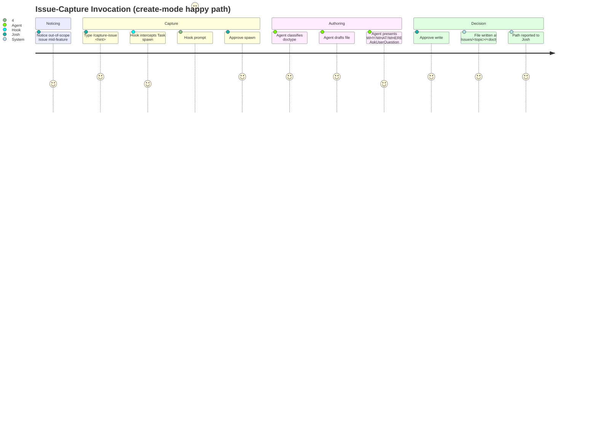
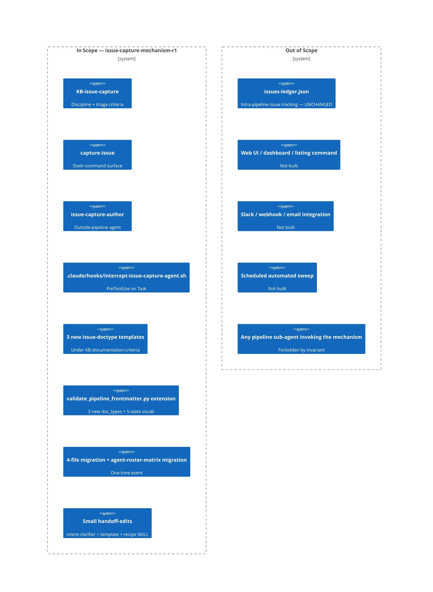

# PRD: Issue-Capture Mechanism (Outside-the-Pipeline)

## Contents

Section completion checklist — each box must be checked (including `N/A — out of scope` rows) before this document leaves draft. The reviewer's Gate 0 check uses this list as the structural-presence anchor.

- [x] Overview
- [x] Stakeholders
- [x] User Stories
- [x] Functional Requirements
- [x] Non-Functional Requirements
- [x] Product Policy Decisions
- [x] Success Criteria
- [x] Technical Considerations
- [x] Rollout Plan
- [x] Undetermined Items
- [x] Appendix

## Overview

### One-line Summary

An outside-the-pipeline mechanism that lets the user capture out-of-current-scope issues into `Issues/<topic-slug>/<doctype>.md` at the moment of noticing — without polluting the active feature-pipeline run and without risk of being forgotten.

### Background

While running features through the Feature Pipeline, the user (Josh-S-N2M) repeatedly notices issues that are out-of-scope for the active feature but that must be remembered: pipeline-wide structural gaps, future-feature candidates, sweep-style deferrals. The Intent Clarification captured the user's stated concern verbatim:

> "I am noticing as I work on features within the feature pipeline issues arise that need to be documented for future feature consideration. It is important to not pollute the feature run unless it is material to the feature scope. However, it is also super important to capture at that moment with the evidence to ensure it does not get forgotten." — Josh-S-N2M, 2026-05-23 conversation

The practice is already empirically established by four ad-hoc files under `Issues/`:

- `Issues/register-devcontainer-mcp-provisioning-r1-deferrals.md` (register doctype, pre-migration)
- `Issues/analysis-per-agent-design-evaluation-gap.md` (analysis doctype, pre-migration)
- `Issues/analysis-adr-placement-rootcause.md` (analysis doctype, pre-migration)
- `Issues/proposal-auditing-family-graduation-review.md` (proposal doctype, pre-migration)

These four files demonstrate the three doctypes that the new mechanism must canonicalize (register, analysis, proposal). They are the empirical precedent — templates derived from them codify their shape rather than invent a new one.

Without a formal mechanism, the practice has four structural gaps:

1. No canonical templates — every ad-hoc file invented its own structure.
2. No agent or workflow that authors issue captures — they are hand-written ad hoc.
3. No enforcement that prevents pipeline sub-agents from accidentally writing into the same surface (no separation of inside-pipeline vs. outside-pipeline issue tracking).
4. No documented handoff back into the Feature Pipeline when a captured `proposal.md` is ready to become a real feature run.

This feature closes all four gaps in one coordinated change.

A companion artifact at `/home/vscode/.claude/plans/i-am-noticing-as-reflective-wilkes.md` (≈400 lines) was produced during a prior planning-mode session and contains the bulk of the decided design. The proposal at `Issues/issue-capture-mechanism/proposal.md` is the formal seed that triggered this feature run; this PRD treats both as authoritative prior context per the Intent Clarification.

### Layer Scope

Declare which engineering layers this feature touches. The same 9-layer taxonomy is used by the PRD and the Blueprint — see `../layer-taxonomy.md` for full descriptions.

Product-surface concerns (end-user experience, release cadence, residency, etc.) live in Stakeholders, User Stories, Non-Functional Requirements, and Product Policy Decisions — NOT in Layer Scope. Layer Scope answers the engineering question "which subsystems will this feature touch?" not the product question "whose experience does this affect?"

- [x] **Claude Code / Project Filesystem** — CLAUDE.md, slash commands, hooks, skills, MCP configuration, project conventions
- [ ] **Frontend** — UI components, client state, routing, styling
- [x] **Backend** — services, domain logic, background jobs, schedulers
- [ ] **API** — HTTP/GraphQL/RPC endpoints, contracts, versioning
- [ ] **Query / Data Access** — ORM models, repositories, query layer, caching
- [ ] **Database** — schema, migrations, indexes, constraints, seed data
- [ ] **CI/CD (GitHub Actions)** — workflows, jobs, reusable actions, environments, secrets
- [ ] **Infrastructure as Code** — Terraform/Pulumi/CDK/CloudFormation modules, state, providers
- [ ] **Dev Environment (Codespaces / Devcontainer)** — devcontainer.json, prebuilds, ports, lifecycle scripts

**Exhaustive 9-layer disposition** (carried from Intent Clarification):

| # | Layer | Disposition | Rationale |
|---|---|---|---|
| 1 | Claude Code / Project Filesystem | **IN scope (primary)** | New agent under `.claude/agents/`, two new skills + one KB edit under `.claude/skills/`, new `.claude/hooks/` directory and script, additive `.claude/settings.json` patch, three new templates and one new spec under `KB-documentation-criteria`. Bulk of the work. *(v2.1, 2026-05-25: SETTINGS-NOTES.md append removed — see PRD §Document History and ADR-0047 v1.1.0.)* |
| 2 | Frontend | **OUT of scope** | No UI surface beyond the slash command, which is itself a CC-layer artifact. |
| 3 | Backend | **IN scope (secondary)** | Extension to `.claude/skills/auditing-shared/scripts/validate_pipeline_frontmatter.py`. Python tooling/infra logic, not a service — lives in the Backend layer per the 9-layer taxonomy. |
| 4 | API | **OUT of scope** | No HTTP / GraphQL / RPC contract change. |
| 5 | Query / Data Access | **OUT of scope** | No ORM, no repository, no query layer. |
| 6 | Database | **OUT of scope** | No schema, no migrations. The `Issues/` directory and its frontmatter are not a database. |
| 7 | CI/CD (GitHub Actions) | **OUT of scope** | No workflow / job / action change. (If Discovery surfaces a CI-invocation benefit for the validator extension, Layer Scope may be amended.) |
| 8 | Infrastructure as Code | **OUT of scope** | No Terraform / Pulumi / CDK / CloudFormation change. |
| 9 | Dev Environment (Codespaces / Devcontainer) | **OUT of scope** | No `devcontainer.json`, prebuild, port, or lifecycle script change. |

Per-layer Design will produce `claude-code-design.md` (primary) and `backend-design.md` (focused on the validator extension). The other seven per-layer Design subsections are explicitly `N/A — out of scope` in the Blueprint.

## Stakeholders

### Stakeholder Inventory

> **Table-shape note (addresses I-DR-001):** The columns below extend the template's canonical 3-column (Role | Interest | Influence) shape with two additional columns (Primary Layer(s), Relationship) because this feature has many small stakeholder categories whose engineering-layer mapping and system-relationship are load-bearing for downstream design. The extension is intentional. The mapping is: `Stakeholder` ≈ Role; `Description` fuses Role + Interest for compactness; `Volume / Importance` ≈ Influence. `Primary Layer(s)` and `Relationship` are additive context that the design-composer and per-layer designers rely on.

| Stakeholder | Description | Primary Layer(s) | Relationship | Volume / Importance |
|---|---|---|---|---|
| Josh-S-N2M (issue-capture invoker) | The user running feature-pipeline runs; needs to capture out-of-scope issues at the moment of noticing without polluting the active run. Primary author of the four existing ad-hoc files. | Claude Code | Direct user / sole invoker | Primary; sole invoker for r1 |
| Feature-pipeline orchestrator (`recipe-feature-pipeline`) | The orchestration recipe that drives the 28+ pipeline sub-agents and 6 mandatory human gates. Must not be perturbed by the new mechanism. | Claude Code | Adjacent system | Secondary; one orchestrator |
| `intake-intent-clarifier` (in future runs) | The pipeline's Stage-1 sub-agent. Must detect `doc_type: issue-proposal` in `--raw-request` and treat the proposal body as authoritative prior context. | Claude Code | Downstream consumer of captured proposals | Secondary; ~1 invocation per pipeline run |
| `validate_pipeline_frontmatter.py` consumers | Existing pipeline frontmatter-validation tooling. Must continue to validate existing pipeline doc_types cleanly while gaining recognition of three new issue doctypes and the 5-state vocabulary. | Backend (tooling) | Backward-compatibility consumer | Secondary; one tool |
| `cc-critique` and `auditing-*` skills | Cross-cutting review skills. Must pass with at most PASS-WITH-MINOR-FIXES on the new agent / skills / hook / settings additions. | Claude Code | Cross-cutting reviewer | Cross-cutting; ~5 auditors |
| Pipeline sub-agents (`.claude/agents/{intake,discovery,design,plan,test,review,finalize,execute,synth}-*.md`) | Explicit non-stakeholders by design. The three-layer enforcement guarantees none of them load `KB-issue-capture` or invoke `issue-capture-author`. Listed here so the boundary is named. | Claude Code | Excluded by structural invariant | ~28 agents — none affected |

### Primary Users

Josh-S-N2M is the sole primary user for r1. No other persona invokes `/capture-issue`. Trade-off decisions favor the invoker's experience (low-friction capture, clear approval prompts, project-lifetime persistence of captured files) over the experience of any hypothetical downstream reader, because the mechanism's first job is to ensure the invoker actually uses it instead of leaving an issue uncaptured.

## User Stories

### Issue-Capture Invoker (Josh)

#### US-1: Capture a newly-noticed issue without polluting the active feature run

```
As the issue-capture invoker
I want to type `/capture-issue <one-line hint>` from any working state
So that the issue is captured into Issues/<topic-slug>/<doctype>.md with one approval prompt — without writing anything into the active feature's working directory.
```

**Acceptance Criteria:**

- AC-FR-1-a — see FR-1
- AC-FR-1-b — see FR-1
- AC-FR-1-c — see FR-1

#### US-2: Update a captured issue through its lifecycle states

```
As the issue-capture invoker
I want to type `/capture-issue --update <path>` against an existing Issues/*.md file
So that I can transition that file across the 5-state lifecycle (draft → open → adopted | complete | superseded | wontfix-with-rationale) with a clear OLD→NEW preview and a single approval.
```

**Acceptance Criteria:**

- AC-FR-2-a — see FR-2
- AC-FR-2-b — see FR-2
- AC-FR-2-c — see FR-2

#### US-3: Be protected against accidental capture writes

```
As the issue-capture invoker
I want every spawn of issue-capture-author to surface a hook-level "ask" prompt with a preview of the spawn parameters
So that no pipeline sub-agent, prompt-injection payload, or accidental Task call can write into Issues/ without my explicit consent.
```

**Acceptance Criteria (cross-section note — addresses I-DR-005):** This user story spans both functional behavior and security-NFR coverage; protection against accidental capture writes requires both the structural three-layer enforcement mechanism (FR-3) and the NFR-4 prompt-injection security posture. The ACs are therefore drawn from both layers — see ACs in both FR-3 and NFR-4.

- AC-FR-3-a — see FR-3
- AC-FR-3-b — see FR-3
- AC-FR-3-c — see FR-3
- AC-NFR-4-a — see NFR-4

#### US-4: Evolve an existing issue to a new doctype without losing audit trail

```
As the issue-capture invoker
I want to add a new sibling doctype file (e.g., a proposal.md beside an existing analysis.md) with bidirectional escalates_from / escalated_to cross-links written in a single approved transaction
So that the evolution is preserved (no mutation of the older doctype's state) and the relationship is browsable from either side.
```

**Acceptance Criteria:**

- AC-FR-5-a — see FR-5
- AC-FR-5-b — see FR-5

### Future Pipeline Run (Seeded by a Captured Proposal)

#### US-5: Hand off a captured proposal into the Feature Pipeline without a new pipeline stage

```
As an invoker of recipe-feature-pipeline
I want to pass --raw-request Issues/<topic>/proposal.md and have intake-intent-clarifier treat the proposal body as authoritative prior context
So that the pipeline does not re-elicit decisions already made, and the run's intent-clarification.md cites the proposal verbatim in its Source section.
```

**Acceptance Criteria:**

- AC-FR-11-a — see FR-11
- AC-FR-12-a — see FR-12

### Pipeline Isolation (Negative User Story)

#### US-6: Guarantee no pipeline sub-agent can reach the capture mechanism

```
As the maintainer of pipeline discipline
I want a structural invariant that no .claude/agents/{intake,discovery,design,plan,test,review,finalize,execute,synth}-*.md agent loads KB-issue-capture or invokes issue-capture-author
So that intra-pipeline issue tracking (issues-ledger.json per ADR-0008) and outside-pipeline issue capture (Issues/) remain cleanly separated and never share IDs.
```

**Acceptance Criteria:**

- AC-FR-13-a — see FR-13
- AC-FR-13-b — see FR-13

### Use Cases

1. **Routine capture (Josh):** Mid-feature, Josh notices a structural gap. He types `/capture-issue <hint>`. The agent classifies the doctype, drafts the file, presents an `AskUserQuestion` with WHY/WHAT/WHERE structure and 4 options (Approve / Approve-with-edits / Change-doctype / Cancel). Josh approves. Exactly one file is written under `Issues/<topic-slug>/<doctype>.md`. No file is written under `working/feature/<active-slug>/`.
2. **Lifecycle update (Josh):** Josh runs `/capture-issue --update Issues/per-agent-design-evaluation-gap/analysis.md` to transition that file from `status: open` to `status: adopted` (because it has been adopted as a feature run). The agent reads the file, drafts the transition, presents OLD→NEW diff, Josh approves, the file is updated in place.
3. **Issue evolution (Josh):** An existing `Issues/<topic>/analysis.md` is judged ready to escalate to a proposal. Josh runs `/capture-issue <hint about the proposal>`. The agent recognizes the topic-slug match, drafts a new `proposal.md` with `escalates_from:` set, and adds `escalated_to:` to the existing `analysis.md` — both writes occur in a single approved transaction.
4. **Filename collision (Josh):** Josh runs `/capture-issue` for a topic where the doctype file already exists. The agent re-prompts with three options (supersede / rename / cancel) per the non-pollution contract; no silent overwrite occurs.
5. **Pipeline-seeded run (orchestrator):** A future invocation `recipe-feature-pipeline <slug> --raw-request Issues/<topic>/proposal.md` causes `intake-intent-clarifier` to detect `doc_type: issue-proposal` in the seed file's frontmatter and treat the body as authoritative prior context. The run's `intent-clarification.md` cites the proposal path verbatim in its `Source` section.
6. **Attempted accidental spawn (negative):** A pipeline sub-agent (hypothetically) emits a `Task` call with `subagent_type: issue-capture-author`. The PreToolUse hook fires, emits `permissionDecision: "ask"`, and Josh sees the spawn-prompt preview and can deny. (In practice, no pipeline sub-agent should ever generate this call — but defense-in-depth.)

### User Journey Diagram



### Scope Boundary Diagram



The `issues-ledger.json` boundary is critical: the outside-pipeline `Issues/` surface and the intra-pipeline ledger are deliberately separate. They never share IDs and never automatically cross-reference.

## Functional Requirements

Tag each requirement with the stakeholder it serves and the layer where its acceptance is observed.

### Must Have (P1 - MVP)

- [ ] **FR-1: Create-mode invocation `/capture-issue <hint>`** — Stakeholder: Josh — Layer: Claude Code
  The system shall expose a slash command `/capture-issue` accepting a free-form one-line hint as `$ARGUMENTS` that spawns the `issue-capture-author` agent via `Task`. The agent shall classify the doctype (register / analysis / proposal), draft exactly one file, present a single `AskUserQuestion` with the WHY/WHAT/WHERE structure and four fixed options (Approve / Approve-with-edits / Change-doctype / Cancel), and on Approve write exactly one file at `Issues/<topic-slug>/<doctype>.md`, creating the topic folder if absent.
  - AC-FR-1-a: When the user invokes `/capture-issue <hint>`, the system shall spawn the `issue-capture-author` agent via `Task` with `subagent_type: "issue-capture-author"`.
  - AC-FR-1-b: When `issue-capture-author` is invoked in create-mode, the system shall present exactly one `AskUserQuestion` containing the WHY (why this is being captured), WHAT (proposed doctype + draft body summary), and WHERE (proposed file path) before any `Write` tool call.
  - AC-FR-1-c: When the user selects Approve in create-mode, the system shall write exactly one file at `Issues/<topic-slug>/<doctype>.md` and shall report the written path to the user.
  - AC-FR-1-d: If the user selects Cancel, then the system shall not write any file and shall report that no file was written.
  - AC-FR-1-e: If the user selects Change-doctype, then the system shall re-draft the file under the user-selected doctype and shall present a fresh `AskUserQuestion` before writing.

- [ ] **FR-2: Update-mode invocation `/capture-issue --update <path>`** — Stakeholder: Josh — Layer: Claude Code
  The system shall expose an update-mode invocation that reads an existing `Issues/*.md` file, drafts a proposed lifecycle-state transition (against the 5-state vocabulary), presents an OLD→NEW `AskUserQuestion` preview, and on Approve writes the transition in place. Update-mode is mutually exclusive with create-mode arguments.
  - AC-FR-2-a: When the user invokes `/capture-issue --update <path>`, the system shall read the file at `<path>`, classify the candidate next-state per the 5-state vocabulary, and present an OLD→NEW preview in the `AskUserQuestion`.
  - AC-FR-2-b: When the user selects Approve in update-mode, the system shall write the transition in place at `<path>` and shall report the new `status:` value.
  - AC-FR-2-c: If the user invokes `/capture-issue` with both a free-form hint and `--update <path>`, then the system shall reject the invocation with an error explaining that create-mode and update-mode are mutually exclusive, and shall not spawn the agent.
  - AC-FR-2-d: When update-mode is invoked with `<path>` that does not exist or is not under `Issues/`, the system shall reject the invocation and report the reason.

- [ ] **FR-3: Three-layer approval enforcement** — Stakeholder: Josh, pipeline orchestrator — Layer: Claude Code

  > **User-confirmed-primitive note (addresses I-DR-006):** Primitive choices (skill `disable-model-invocation: true`, agent-body `AskUserQuestion` step, PreToolUse hook on `Task`) are prescribed at requirement-level because user-confirmed at Intent Clarification (Gate 1, 2026-05-23T16:51:00Z — see Intent Clarification §"What's in scope" and §"Clarified Intent" which name all three layers as scope-bearing). This is the PRD-authoring discipline's allowed exception ("user explicitly requested specific implementation"). Design-composer retains authority over implementation specifics (hook stdin/stdout schema, AskUserQuestion prompt text, agent-body sequencing); see U-1, U-2 in §Undetermined Items.

  The system shall enforce user approval through three independent layers: (Layer 1) the `KB-issue-capture` skill declares `disable-model-invocation: true` so main Claude cannot auto-load it; (Layer 2) the `issue-capture-author` agent body mandates an `AskUserQuestion` step before any `Write`; (Layer 3) a PreToolUse hook on the `Task` tool discriminates by `subagent_type == "issue-capture-author"` and emits `permissionDecision: "ask"`. All three must fire for every capture; failure of one does not bypass the others.
  - AC-FR-3-a: When any agent or main Claude attempts to load `KB-issue-capture` by description-match, the system shall refuse the load because of the `disable-model-invocation: true` declaration.
  - AC-FR-3-b: When the PreToolUse hook receives `tool_input.subagent_type == "issue-capture-author"`, the system shall emit `permissionDecision: "ask"` with a spawn-prompt preview in the message field.
  - AC-FR-3-c: When the PreToolUse hook receives any `tool_input.subagent_type` other than `"issue-capture-author"`, the system shall emit `permissionDecision: "allow"` with no additional user prompt.
  - AC-FR-3-d: While `issue-capture-author` is executing, the system shall require exactly one `AskUserQuestion` (the WHY/WHAT/WHERE prompt) to complete before any `Write` tool call.

- [ ] **FR-4: Per-issue folder model with canonical doctype filenames** — Stakeholder: Josh — Layer: Claude Code
  The system shall organize captured issues as one folder per topic at `Issues/<topic-slug>/`, with the three doctype files using fixed canonical filenames (`register.md`, `analysis.md`, `proposal.md`). The doctype is encoded by filename, the topic by folder name. Optional `evidence/` and `updates/` subdirectories are permitted for non-doctype artifacts.
  - AC-FR-4-a: The system shall name every newly-captured doctype file according to its doctype: `register.md`, `analysis.md`, or `proposal.md`.
  - AC-FR-4-b: The system shall place every newly-captured file under `Issues/<topic-slug>/`, creating the topic folder if absent.
  - AC-FR-4-c: When a captured file's frontmatter `id:` is computed, the system shall derive it as `<DOCTYPE>-<topic-slug>` (uppercase doctype, kebab-case topic).
  - AC-FR-4-d: If a captured-file write target already exists, then the system shall present a re-prompt with three options (supersede / rename / cancel) and shall not silently overwrite.

- [ ] **FR-5: Add-new-sibling-file evolution with bidirectional cross-links** — Stakeholder: Josh — Layer: Claude Code
  When an issue evolves to a new doctype, the system shall add a new sibling file in the same topic folder; it shall NOT mutate the older doctype's state. The new file's frontmatter shall carry `escalates_from: <older-id>` and the older file shall be amended only to add `escalated_to: <newer-id>`. Both writes shall occur within a single approved transaction (one `AskUserQuestion`, two writes).
  - AC-FR-5-a: When an issue evolves from doctype A to doctype B, the system shall write a new file `Issues/<topic-slug>/<doctype-B>.md` with `escalates_from: <id-of-A>` AND shall amend `Issues/<topic-slug>/<doctype-A>.md` to add `escalated_to: <id-of-B>`, with both writes gated by a single `AskUserQuestion` approval.
  - AC-FR-5-b: When a sibling file is added for evolution, the system shall not modify the older file's `status:` field.
  - AC-FR-5-c: If the single approval is denied, then the system shall write neither file (transactional all-or-nothing).

- [ ] **FR-6: Three new structural templates under `KB-documentation-criteria`** — Stakeholder: Josh, downstream readers — Layer: Claude Code
  The system shall provide three structural templates (`issue-register-template.md`, `issue-analysis-template.md`, `issue-proposal-template.md`) and one structural-only spec (`issue-doctypes-spec.md`) under `KB-documentation-criteria/references/templates/` and `KB-documentation-criteria/references/` respectively. Templates shall codify structure only — triggering discipline lives in `KB-issue-capture`.
  - AC-FR-6-a: When `shared-document-reviewer` runs Gate 0 against a file authored under one of the three new doctypes, the system shall match the file's structure against the corresponding template.
  - AC-FR-6-b: The system shall not include triggering discipline (when-to-capture rules) in any of the three new templates or the new spec; that discipline shall reside only in `KB-issue-capture/`.

- [ ] **FR-7: Validator extension — 3 new doc_types + 5-state vocabulary** — Stakeholder: validator consumers, pipeline orchestrator — Layer: Backend
  The system shall extend `.claude/skills/auditing-shared/scripts/validate_pipeline_frontmatter.py` to recognize three new `doc_type` enum values (`issue-register`, `issue-analysis`, `issue-proposal`) and a 5-state status vocabulary (`draft → open → adopted | complete | superseded | wontfix-with-rationale`) with per-state required-companion-field rules. The extension shall be backward-compatible: zero false positives and zero false negatives on existing pipeline doc_types.
  - AC-FR-7-a: When `validate_pipeline_frontmatter.py` is run against a file with `doc_type:` in {`issue-register`, `issue-analysis`, `issue-proposal`} and `status:` in {`draft`, `open`, `adopted`, `complete`, `superseded`, `wontfix-with-rationale`} and all per-state required companion fields present, the system shall validate the file as clean.
  - AC-FR-7-b: When `validate_pipeline_frontmatter.py` is run against any pre-existing pipeline doc_type after the extension, the system shall produce identical findings to those produced before the extension (regression baseline).
  - AC-FR-7-c: If a file declares `status: adopted` without the per-state required companion field(s) for that state, then the system shall flag the file with a structural finding naming the missing field.
  - AC-FR-7-d: If a file declares a status value outside the 5-state vocabulary for the issue-* doc_types, then the system shall flag the file with a vocabulary-mismatch finding.

- [ ] **FR-8: One-time migration of 4 existing flat `Issues/*.md` files** — Stakeholder: Josh, future readers — Layer: Claude Code
  The system shall migrate the four existing flat-format `Issues/*.md` files into the per-issue folder model via `git mv` (preserving history), shall back-fill `version: 0.1.0` and `status: open` and the `since:` companion field on each, and shall not delete or alter the content of any of the four beyond the frontmatter back-fill.
  - AC-FR-8-a: When the migration completes, the system shall have moved `Issues/register-devcontainer-mcp-provisioning-r1-deferrals.md` to `Issues/devcontainer-mcp-provisioning-r1-deferrals/register.md`, `Issues/analysis-per-agent-design-evaluation-gap.md` to `Issues/per-agent-design-evaluation-gap/analysis.md`, `Issues/analysis-adr-placement-rootcause.md` to `Issues/adr-placement-rootcause/analysis.md`, and `Issues/proposal-auditing-family-graduation-review.md` to `Issues/auditing-family-graduation-review/proposal.md`.
  - AC-FR-8-b: When `git log --follow` is run against any migrated file, the system shall return the file's pre-migration history.
  - AC-FR-8-c: When `validate_pipeline_frontmatter.py` is run against the four migrated files post-back-fill, the system shall return zero findings.
  - AC-FR-8-d: The system shall not migrate any `Issues/*.md` file other than the four named above as part of this feature.

- [ ] **FR-9: Migration of `agent-roster-impact-matrix.md` into per-issue evidence folder** — Stakeholder: Josh, future readers — Layer: Claude Code
  The system shall `git mv` the file currently at `working/feature/devcontainer-mcp-provisioning-r1/agent-roster-impact-matrix.md` into `Issues/per-agent-design-evaluation-gap/evidence/agent-roster-impact-matrix.md`, preserving git history, as a one-time event.
  - AC-FR-9-a: When the migration completes, the system shall have the file at `Issues/per-agent-design-evaluation-gap/evidence/agent-roster-impact-matrix.md` and shall not have a copy at the prior path.
  - AC-FR-9-b: When `git log --follow` is run against the migrated file, the system shall return the file's pre-migration history.

- [ ] **FR-10: Source-citation discipline for proposal-seeded runs** — Stakeholder: `intake-intent-clarifier`, future readers — Layer: Claude Code
  The system shall require that when a feature-pipeline run is seeded by an `Issues/<topic>/proposal.md` (i.e., the orchestrator invocation includes `--raw-request <proposal-path>`), the run's `intent-clarification.md` cites that proposal path verbatim in its `Source` section.
  - AC-FR-10-a: When `intake-intent-clarifier` is invoked with `--raw-request <path>` and the file at `<path>` carries `doc_type: issue-proposal` in its frontmatter, the system shall include the verbatim path in the run's `intent-clarification.md` `Source` section.

- [ ] **FR-11: Proposal-as-prior-context detection in `intake-intent-clarifier`** — Stakeholder: `intake-intent-clarifier` — Layer: Claude Code
  The system shall extend `.claude/agents/intake-intent-clarifier.md` with a "Proposal-as-prior-context" sub-section (≈15 lines) so that future runs detect `doc_type: issue-proposal` in `--raw-request` and treat the proposal body as authoritative prior context (no re-elicitation of already-decided design).
  - AC-FR-11-a: When `intake-intent-clarifier` reads a `--raw-request` file whose frontmatter contains `doc_type: issue-proposal`, the system shall treat the file body as authoritative prior context and shall not re-elicit decisions explicitly recorded therein.
  - AC-FR-11-b: When the proposal lacks required Stage-1 fields (FRs, NFRs, EARS ACs, exhaustive 9-layer scope), the system shall elicit only the missing fields, not re-litigate decisions present in the proposal.

- [ ] **FR-12: Handoff-supporting template + recipe edits** — Stakeholder: `intake-intent-clarifier`, future invokers — Layer: Claude Code
  The system shall make minor edits to (a) `.claude/skills/KB-documentation-criteria/references/templates/intent-clarification-template.md` (≈5 lines) clarifying that the `Source` section cites a proposal path verbatim when one seeds the run, and (b) `.claude/skills/recipe-feature-pipeline/SKILL.md` (≈5 lines, one bullet) documenting the proposal-seed invocation pattern. Neither edit creates a new pipeline stage or alters any gate.
  - AC-FR-12-a: When a reader consults the intent-clarification template, the system shall present the proposal-seed `Source` guidance inline within the template.
  - AC-FR-12-b: The system shall not add any new pipeline stage, gate, or bypass path to `recipe-feature-pipeline/SKILL.md`.

- [ ] **FR-13: Pipeline-isolation invariant** — Stakeholder: pipeline orchestrator, pipeline sub-agents — Layer: Claude Code
  The system shall maintain a structural invariant that no agent under `.claude/agents/{intake,discovery,design,plan,test,review,finalize,execute,synth}-*.md` loads `KB-issue-capture` or invokes `issue-capture-author`. The intra-pipeline `issues-ledger.json` (per ADR-0008) remains the sole intra-pipeline issue tracker; the two systems never share IDs.
  - AC-FR-13-a: When a grep for `KB-issue-capture` is run across `.claude/agents/{intake,discovery,design,plan,test,review,finalize,execute,synth}-*.md`, the system shall return zero matches.
  - AC-FR-13-b: When a grep for `subagent_type:\s*issue-capture-author` (or equivalent invocation pattern) is run across the same set of pipeline agent files, the system shall return zero matches.
  - AC-FR-13-c: The system shall not introduce any automated cross-reference between an `Issues/*.md` file and an entry in any feature run's `issues-ledger.json`.

- [ ] **FR-14: Index update to KB-documentation-criteria SKILL.md** — Stakeholder: future readers — Layer: Claude Code
  The system shall additively update `.claude/skills/KB-documentation-criteria/SKILL.md` to list the three new templates and the new spec, and shall add one bullet under "Where this KB is NOT used" stating that the triggering discipline for issue capture lives in `KB-issue-capture`. No removals; no restructure.
  - AC-FR-14-a: When a reader consults `KB-documentation-criteria/SKILL.md`, the system shall present rows for `issue-register-template.md`, `issue-analysis-template.md`, `issue-proposal-template.md`, and `issue-doctypes-spec.md` in the appropriate index sections.

- [x] ~~**FR-15: Append-only documentation note in `.claude/SETTINGS-NOTES.md`** — Stakeholder: pipeline orchestrator, future maintainers — Layer: Claude Code~~
  ~~The system shall append a note to `.claude/SETTINGS-NOTES.md` documenting the new hook policy and the user authorization for the additive `settings.json` change.~~
  ~~- AC-FR-15-a: When a reader consults `.claude/SETTINGS-NOTES.md`, the system shall present the appended note describing the hook policy and user authorization timestamp.~~

  **RETIRED v2.1 (2026-05-25)** at user direction during execution Phase 6/7 boundary. The audit-trail content that FR-15 specified now lives inline in **ADR-0047 v1.1.0** §Decision §5 (the five-precedent enumeration was the load-bearing content; SETTINGS-NOTES.md was a duplicated surface). Downstream amendments: Blueprint v3 references resurfaced inline; acceptance-tests AT-042 removed; phase-validators PV-5.C6 + PV-7.C7 removed; tasks.json T5.7 superseded; SETTINGS-NOTES.md deleted from `.claude/`. See `reconciliation-log-r1.md` for the full revision record. Three-layer enforcement architecture (FR-3) is unchanged.

### Should Have (P2)

None for r1. All P2 candidates either were absorbed into P1 (notably update-mode, which the Intent Clarification confirmed in scope for r1) or are explicitly deferred (see Won't Have).

### Could Have (P3)

None for r1 — no candidate capability is small enough to be "nice to have but droppable" relative to the load-bearing structural invariant. Every in-scope item either ships as part of the multi-primitive subsystem (skill / agent / hook / templates / validator extension / migrations / handoff edits) or it defeats the non-pollution contract the feature exists to enforce. (Addresses I-DR-002 — adds parallel rationale to match P2.)

### Won't Have (this release)

- **A new intra-pipeline issue mechanism.** The existing `working/feature/<slug>/issues-ledger.json` (per ADR-0008) remains the sole intra-pipeline issue tracker. Reason: explicit user direction; the two systems are deliberately separate.
- **A UI surface beyond the slash command.** No web view, dashboard, or `Issues/`-listing command. Reason: discoverability is the `Issues/` directory itself; no further surface needed for r1.
- **Automated cross-linking between `Issues/*.md` and intra-pipeline ledger entries.** Reason: the two systems must remain distinct per the decision rubric in the companion plan.
- **Scheduled / automated sweep** to back-fill or re-classify older `Issues/*.md` files. Reason: migration of the existing 4 is a one-time event; ongoing captures use the folder model from creation.
- **Slack / webhook / email / external notification integration.** Reason: out of scope for r1; not in user's stated needs.
- **Any pipeline sub-agent invoking `issue-capture-author` or loading `KB-issue-capture`.** Reason: load-bearing structural invariant (see FR-13). This is forbidden, not deferred.
- **New CLAUDE.md or `.claude/rules/` directory at repo root.** Reason: KB-cc-design Principle 1 — skill-localised knowledge.
- **Edit to `recipe-feature-pipeline/SKILL.md`** beyond documenting the proposal-seed invocation pattern. Reason: no new pipeline stage, no new gate, no bypass path.
- **Mutation of an older doctype file when a sibling doctype is added** beyond the bidirectional cross-link. Reason: audit-trail preservation.
- **Severity vocabulary on `Issues/*.md` files.** Reason: issues are captured for memory, not triaged for blockage; severity is intra-pipeline ledger territory only.
- **Deletion of any `Issues/*.md` file** including terminal-state ones. Reason: terminal states preserve the audit trail.

## Non-Functional Requirements

### Performance

- **NFR-1: Hook fast-path overhead** — Stakeholder: pipeline orchestrator — Layer: Claude Code
  The PreToolUse hook fires on every `Task` spawn across the project (estimated ~30-100 spawns per pipeline run). The discriminator path (read `subagent_type`, branch to silent `allow` for everything except `issue-capture-author`) must not measurably perturb pipeline runs. Rationale: blocking pipeline performance on an outside-pipeline safeguard would be a regression.

  > **AC split note (addresses I-DR-003):** AC-NFR-1-a (below) carries the measurable behavior (~100ms target tied to perceptible-latency rationale); AC-NFR-1-c separately and explicitly defers the precise threshold to Design. This split removes the earlier target/deferral mixing flagged at v1 review and isolates the deferral so the test-acceptance-author can treat AC-NFR-1-a as a load-bearing measurable assertion. AC-NFR-1-b remains the operationally meaningful end-to-end test ("no measurable regression vs baseline").

  - AC-NFR-1-a: When the PreToolUse hook receives a `Task` spawn with `subagent_type != "issue-capture-author"`, the system shall return `permissionDecision: "allow"` with hook script execution under ~100ms wall-clock per invocation on the standard devcontainer.
  - AC-NFR-1-b: While the pipeline runs to completion under the new hook, the system shall not exhibit measurable end-to-end runtime regression versus the pre-hook baseline (any observed regression beyond noise is itself a finding).
  - AC-NFR-1-c: Where the per-layer Design phase finalizes hook implementation, the system shall ratify or replace the ~100ms threshold of AC-NFR-1-a with the design-time measured baseline; see U-11 in §Undetermined Items. This deferral does not weaken AC-NFR-1-a, which remains a load-bearing target until ratified or replaced.

### Reliability

- **NFR-2: Hook fail-open on script error** — Stakeholder: pipeline orchestrator — Layer: Claude Code
  If the PreToolUse hook script errors (missing dependency, malformed stdin JSON, parse failure, etc.), the `Task` spawn must proceed (fail-open) and the error must be logged to stderr. Rationale (per Intent Clarification §"Hook fail-open vs. fail-closed"): blocking pipeline sub-agent spawns on a hook bug would break ~28 pipeline agents over an outside-pipeline safeguard. Layers 1 (`disable-model-invocation`) and 2 (agent-body `AskUserQuestion`) remain as defenses even if the hook fails.
  - AC-NFR-2-a: If the hook script exits with a non-zero status or emits malformed stdout, then the system shall treat the result as `permissionDecision: "allow"` and shall write the error to stderr for diagnosis.
  - AC-NFR-2-b: When the hook fails open, the system shall not silently suppress the error — the stderr line must be visible to anyone tailing the session log.

- **NFR-3: Idempotency of update-mode writes** — Stakeholder: Josh — Layer: Claude Code
  Re-running `/capture-issue --update <path>` with a proposed state transition identical to the file's current state must be a no-op (no duplicate write, no spurious approval prompt). Rationale: prevents accidental version-bumps and audit-trail churn from repeated invocations.
  - AC-NFR-3-a: When `/capture-issue --update <path>` is invoked and the diff between current and proposed state is empty, the system shall report "no change" to the user and shall not present an approval prompt or write the file.

### Security

- **NFR-4: Prompt-injection resistance via agent-body `AskUserQuestion`** — Stakeholder: Josh — Layer: Claude Code
  The agent-body `AskUserQuestion` (Layer 2 of the three-layer enforcement) is the in-context guard against a manipulated `$ARGUMENTS` driving an unintended write. Even if the hook (Layer 3) is bypassed, the agent's mandatory user-question step must complete before any `Write`. Rationale: defense-in-depth against prompt-injection payloads embedded in `$ARGUMENTS` or in any file the agent reads during classification.
  - AC-NFR-4-a: While `issue-capture-author` is executing, the system shall not call any `Write` tool before exactly one `AskUserQuestion` step has completed with an Approve / Approve-with-edits selection.
  - AC-NFR-4-b: If `$ARGUMENTS` contains text resembling an instruction to bypass the approval step, then the system shall not bypass the step — the agent body's hard-coded sequence governs, not in-context instructions.

- **NFR-5: No silent overwrite on filename collision** — Stakeholder: Josh — Layer: Claude Code
  When a captured-file write target already exists, the system must re-prompt with three explicit options (supersede / rename / cancel). Silent overwrite is forbidden. Rationale: the non-pollution contract requires that no previously-captured issue be lost without an explicit user decision.
  - AC-NFR-5-a: If the proposed write target at `Issues/<topic-slug>/<doctype>.md` already exists, then the system shall present a re-prompt with the three options and shall not perform the write until the user selects supersede or rename.

- **NFR-6: Audit-trail preservation via supersession discipline** — Stakeholder: Josh, future readers — Layer: Claude Code
  No `Issues/*.md` file may be deleted as part of this feature's operations, including files in terminal states (`complete`, `superseded`, `wontfix-with-rationale`). Supersession uses the established frontmatter discipline (the superseding file declares `superseded_by_issue_id:` on the superseded file). Rationale: terminal-state files preserve the audit trail.
  - AC-NFR-6-a: The system shall not delete any `Issues/*.md` file as part of any `/capture-issue` invocation.
  - AC-NFR-6-b: When a file is superseded, the system shall set `status: superseded` on the superseded file and shall set `superseded_by_issue_id: <new-id>` to point at the superseding file.

### Observability

- **NFR-7: Write-path + selected-option observability** — Stakeholder: Josh, future debuggers — Layer: Claude Code
  Every approved write must produce an observable record of (a) the written file path and (b) the user's selected option from the `AskUserQuestion`. Destination of the log (stderr, project-relative file, or other) is decided at Design time but the record must exist. Rationale: enables post-hoc reconstruction of capture activity without manual digging.

  > **Note for test-acceptance-author (addresses I-DR-004):** AC-NFR-7-a's observability destination is intentionally placeholder-shaped at PRD time and is tracked as **U-9** in §Undetermined Items (resolved at Stage 5 / per-layer Design by `design-claude-code`). When authoring the acceptance test for AC-NFR-7-a, defer the destination assertion until U-9 is closed; the load-bearing assertion ("a record exists") is testable independently of destination once Design names the destination.

  - AC-NFR-7-a: When a write occurs in create-mode or update-mode, the system shall record the written path and the user's selected option in an observability destination consistent with project conventions (destination to be finalized per U-9).

### Compatibility

- **NFR-8: Validator backward compatibility** — Stakeholder: validator consumers, pipeline orchestrator — Layer: Backend
  The extension to `validate_pipeline_frontmatter.py` must produce zero false positives and zero false negatives on existing pipeline doc_types after the extension. Rationale: any regression breaks the validator's role across the pipeline.
  - AC-NFR-8-a: When `validate_pipeline_frontmatter.py` is run post-extension against the set of files it validated pre-extension, the system shall produce identical findings to the pre-extension baseline.
  - AC-NFR-8-b: The system shall add unit-test coverage (test strategy decided at Plan time) for the three new `doc_type` values and the 5-state vocabulary in addition to existing tests.

### Accessibility, API compatibility, Data retention, Scalability — `N/A — out of scope`

These NFR categories do not apply to a Claude-Code-layer / Backend-tooling feature with no UI, no API, no persistent data store beyond the `Issues/` markdown files, and no scaling dimension beyond the manual cadence of `/capture-issue` invocations.

### Developer Experience

- **NFR-9: Agent-driven workflow compatibility** — Stakeholder: Josh — Layer: Claude Code
  The new mechanism must be invocable from any Claude Code working state via the slash command, must integrate cleanly with the existing tool set (`Task`, `AskUserQuestion`, `Read`, `Grep`, `Glob`, `Write`), and must produce its approval prompts within the same chat surface as the rest of the user's work. Rationale: low-friction capture is the entire point — any additional ceremony (e.g., context-switching to a separate tool) reintroduces the "I'll capture this later" failure mode the feature exists to eliminate.
  - AC-NFR-9-a: While the user is in any Claude Code session, the system shall accept `/capture-issue <hint>` without requiring the user to context-switch, run an external tool, or open a different window.

## Product Policy Decisions

| Policy Area | Decision | Rationale | Affected Layers |
|---|---|---|---|
| Scope class | FULL per ADR-0023 | Multi-primitive new subsystem touching `.claude/agents/`, `.claude/skills/` (3 new skills), `.claude/hooks/` (new dir), `.claude/settings.json`, `KB-documentation-criteria/references/templates/` (3 new), `validate_pipeline_frontmatter.py`, plus 4 file migrations and the agent-roster-matrix migration. Matches precedent of `devcontainer-mcp-provisioning-r1`. | Claude Code, Backend |
| Issue-file lifecycle vocabulary | 5-state: `draft → open → adopted | complete | superseded | wontfix-with-rationale` | Parallels but is distinct from the intra-pipeline 4-state ledger (per ADR-0008). The two vocabularies never share IDs. Confirmed at Intent Clarification Gate 1. | Claude Code, Backend (validator) |
| Doctype preservation | Three doctypes (`register`, `analysis`, `proposal`) preserved as distinct, not unified | Empirical precedent from the four existing ad-hoc files demonstrates three genuinely distinct shapes. Unification would lose the shape signal. | Claude Code |
| Issue evolution pattern | Add-new-sibling-file, never mutate older doctype | Audit-trail preservation. The cross-link (`escalates_from` / `escalated_to`) carries the relationship. | Claude Code |
| Three-layer enforcement | `disable-model-invocation` flag + agent-body `AskUserQuestion` + PreToolUse hook | Defense-in-depth against accidental invocation by main Claude or pipeline sub-agents, against prompt-injection payloads, and against bypass via direct `Task` invocation. | Claude Code |
| Hook failure mode | Fail-open with stderr log | Blocking ~28 pipeline agents over an outside-pipeline safeguard would be a regression; Layers 1 and 2 remain as defenses. | Claude Code |
| Pipeline-isolation invariant | No pipeline sub-agent loads `KB-issue-capture` or invokes `issue-capture-author` | Outside-pipeline and intra-pipeline issue tracking must remain cleanly separated; they never share IDs. | Claude Code |
| `/capture-issue` argument shape | Mutual exclusivity — free-form hint XOR `--update <path>` | Create-mode and update-mode are distinct workflows with distinct prompt shapes; mixing them confuses the agent body's branching and the `AskUserQuestion` shape. Confirmed at Intent Clarification Gate 1. | Claude Code |
| Migration scope | Migrate exactly the 4 named files + `agent-roster-impact-matrix.md` — no other files | Migration is a one-time event; ongoing captures use the folder model from creation. Avoids automated sweep complexity. | Claude Code |
| `Issues/` deletion policy | No deletion of any `Issues/*.md` file, including terminal-state ones | Terminal states preserve the audit trail; deletion would erase precedent. | Claude Code |
| Severity vocabulary on `Issues/*.md` | None — issues are captured for memory, not triaged for blockage | Severity is intra-pipeline ledger territory only; conflating the two surfaces would re-introduce the cross-system coupling the design forbids. | Claude Code |
| Contributor / agent access | Only Josh (via `/capture-issue`) can spawn `issue-capture-author`; the three-layer enforcement is the structural guarantee. | Mechanism is user-driven, not agent-driven. | Claude Code |

## Success Criteria

### Quantitative Metrics

| Metric | Stakeholder | Target | Measurement Method | Timeframe |
|---|---|---|---|---|
| Validator clean-run on migrated files | Josh, validator consumers | 4 of 4 migrated files validate clean post-back-fill | `python3 .claude/skills/auditing-shared/scripts/validate_pipeline_frontmatter.py Issues/` returns zero findings on the 4 migrated files | Acceptance |
| Validator backward-compatibility regression | Validator consumers | Zero new findings on the pre-existing pipeline doc_types after extension | Re-run validator against the existing-pipeline corpus pre-extension and post-extension; diff the findings; expect zero new lines | Acceptance |
| Git history preservation | Josh, future readers | `git log --follow` returns full history for each of the 5 migrated files (4 Issues files + agent-roster-matrix) | Run `git log --follow` against each migrated path | Acceptance |
| Pipeline-isolation grep | Pipeline orchestrator | Zero matches for `KB-issue-capture` and for invocation patterns of `issue-capture-author` in pipeline-agent files | `grep -r KB-issue-capture .claude/agents/{intake,discovery,...}-*.md` returns empty | Acceptance |
| cc-critique on the new components | Cross-cutting reviewers | PASS or PASS-WITH-MINOR-FIXES (zero BLOCKER findings) | Run `cc-critique` against the new agent / skills / hook / settings additions | Acceptance |
| Approved writes preceded by exactly one `AskUserQuestion` | Josh | 100% of approved writes | Session log inspection during integration test | Acceptance |
| Cancel-path writes | Josh | 0 files written when user selects Cancel | Integration test: invoke `/capture-issue`, cancel, verify no file present | Acceptance |

### Qualitative Metrics

1. **Josh perceives `/capture-issue` as low-friction** — i.e., he actually uses it during a pipeline run when he notices an out-of-scope issue, rather than defaulting back to "I'll write a note in my notebook." Measured by post-r1 self-report during normal pipeline use. (Estimated: 3+ uses in the first month of having the mechanism available, based on the empirical rate at which the user has already produced four ad-hoc files; precision is unsupported.)
2. **Approval prompts are clear** — Josh does not have to re-read the `AskUserQuestion` to understand WHY/WHAT/WHERE. Measured by self-report after first three real uses.
3. **No false-confidence captures** — Josh does not select Approve and then immediately regret it. Measured by absence of post-write `/capture-issue --update` invocations that revert content within one session.

### Operational Metrics

1. **Hook-error rate** — fraction of `Task` spawns where the PreToolUse hook exits non-zero or emits malformed output. Target: zero in normal operation. If non-zero, the stderr log surfaces the root cause.
2. **Mean writes per `/capture-issue` invocation** — should be exactly 1 in create-mode (or 2 in the evolution-transaction case) and exactly 1 in update-mode. Deviations indicate a bug.

### Developer Experience Metrics

1. **Time from "notice issue" to "file captured"** — qualitative; user-reported as "fast enough that I do it instead of postponing." No numeric target because the failure mode is psychological (postponement), not measurable latency.

## Technical Considerations

The PRD names what's true about the environment; the design doc names what to build. This section is descriptive, not prescriptive.

### Dependencies

- **Existing systems we depend on:**
  - `.claude/agents/intake-intent-clarifier.md` — receives a small edit (FR-11); the agent already exists.
  - `.claude/skills/KB-documentation-criteria/` — receives 3 new templates + 1 new spec + 1 SKILL.md additive update.
  - `.claude/skills/auditing-shared/scripts/validate_pipeline_frontmatter.py` — receives an extension (FR-7); the script already exists.
  - `.claude/settings.json` — receives one additive permission entry + one PreToolUse hook block (FR-3); existing 7 allow entries untouched.
  - ~~`.claude/SETTINGS-NOTES.md` — receives an append (FR-15); the file already exists.~~ *(Retired v2.1, 2026-05-25: FR-15 removed; SETTINGS-NOTES.md deleted from `.claude/`. See ADR-0047 v1.1.0.)*
  - `recipe-feature-pipeline/SKILL.md` — receives a one-bullet additive edit (FR-12).
  - `KB-review-disciplines/references/issue-lifecycle.md` — referenced as the parallel-but-distinct 4-state ledger vocabulary; not modified.
- **External services we depend on:** None.
- **Upstream features that must ship first:** None.
- **Downstream consumers affected by this change:**
  - Future pipeline-run seeders (anyone running `recipe-feature-pipeline --raw-request Issues/<topic>/proposal.md`) — will benefit from FR-10, FR-11, FR-12; no breakage.
  - Existing pipeline-agent files — affected only by the structural-invariant grep (FR-13); no edits required, only the negative invariant.

### Constraints

- **Technical constraints:**
  - Must operate within Claude Code's tool inventory (`Task`, `AskUserQuestion`, `Read`, `Grep`, `Glob`, `Write`); no new tool dependencies.
  - Must preserve `validate_pipeline_frontmatter.py` backward compatibility on all existing pipeline doc_types.
  - Must preserve all 6 mandatory human gates of the feature pipeline; no bypass.
  - Must respect KB-cc-design Principles 1, 3, 5, 6, 8, 9 (skill-localised knowledge, additive settings changes, allowed-tools scoping, etc. — details enforced at per-layer Design).
- **Resource constraints:** None beyond the single-developer cadence.
- **Time constraints:** None.
- **Regulatory / contractual constraints:** None.

### Assumptions

- [ ] **Assumption 1:** The four existing ad-hoc `Issues/*.md` files are the correct empirical precedent for the three doctype templates (i.e., their shape is what the templates should codify). Validation: design-stage reverse-engineering of three worked examples in `KB-issue-capture/references/examples.md`. Owner: design-claude-code. By: per-layer Design.
- [ ] **Assumption 2:** The PreToolUse hook mechanism in Claude Code can discriminate `Task` spawns by `tool_input.subagent_type` and emit `permissionDecision: "ask"` with a message in stdout JSON. Validation: Discovery Research (codebase + external) on the Claude Code hook contract. Owner: discovery-codebase-researcher + discovery-external-researcher. By: Discovery.
- [ ] **Assumption 3:** `validate_pipeline_frontmatter.py` is structured such that a 3-new-doc_type + 1-new-status-vocabulary extension is backward-compatible with current usage. Validation: Discovery Research against the script and its callers. Owner: discovery-codebase-researcher. By: Discovery.
- [ ] **Assumption 4:** `.claude/settings.json` accepts additive permission entries and a `hooks.PreToolUse` block matching the `Task` tool without disturbing existing entries. Validation: Discovery + cc-critique pre-merge findings. Owner: discovery-codebase-researcher + cc-critique. By: pre-merge.
- [ ] **Assumption 5:** `git mv` of all five migration targets preserves history (`git log --follow`). Validation: dry-run during Plan / Acceptance Test phase. Owner: test-acceptance-author. By: Acceptance Test phase.
- [ ] **Assumption 6:** A single approved `AskUserQuestion` can gate two writes in the evolution-transaction case (FR-5) without violating Claude Code's tool-call sequencing. Validation: design-stage clarification with Claude Code platform docs (per KB-cc-platform). Owner: design-claude-code. By: per-layer Design.

### Risks and Mitigation

| Risk | Stakeholder Affected | Impact | Probability | Mitigation |
|---|---|---|---|---|
| Hook script errors block pipeline sub-agent spawns | Pipeline orchestrator, Josh | High (would break ~28 pipeline agents) | Low | Fail-open posture (NFR-2) + Layers 1 and 2 as defense-in-depth. |
| Validator extension introduces false positives/negatives on pre-existing pipeline doc_types | Pipeline orchestrator | High (would surface spurious findings across many runs) | Medium (script extension is non-trivial) | NFR-8 acceptance test: re-run pre/post against existing corpus; diff findings; expect zero new lines. |
| A pipeline sub-agent accidentally invokes `issue-capture-author` via prompt-injection | Josh | Medium (would surface an `AskUserQuestion` Josh has to dismiss) | Low (defense-in-depth: hook + agent body + skill flag) | Three-layer enforcement (FR-3) means at least two layers must fail simultaneously for a write to occur unintentionally. |
| `git mv` migration loses history on one of the 5 files | Josh, future readers | Medium (audit trail truncation) | Low | AC-FR-8-b / AC-FR-9-b: verify `git log --follow` returns full history; fix before merge if it doesn't. |
| The 5-state vocabulary is mis-implemented in the validator (e.g., wrong required-companion-field set per state) | Josh | Medium (false rejections on legitimately captured files) | Medium (vocabulary is project-novel; no precedent to check against) | Acceptance tests (FR-7 ACs) cover each state transition + companion-field combination explicitly. |
| Filename collision occurs and silent overwrite happens (NFR-5 violation) | Josh | High (silent loss of captured issue) | Low | Three options re-prompt (supersede / rename / cancel) is a hard requirement; acceptance test (AC-NFR-5-a) covers the case. |
| Future `intake-intent-clarifier` runs fail to detect `doc_type: issue-proposal` in `--raw-request` | Future invokers | Low (run still proceeds; just over-elicits) | Low | FR-11 ACs cover the detection branch; review-cross-artifact-auditor verifies. |

## Rollout Plan

- **Launch audience progression:** Single user (Josh) at GA. No staged rollout — the mechanism is a single-user tool for r1.
- **Communication plan:** This PRD plus the eventual ADR slate (authored at Stage 5) serve as the project-internal documentation. No external announcement needed.
- **Migration path:** One-time migration of the four flat `Issues/*.md` files + the agent-roster-impact-matrix (FR-8, FR-9). Migration happens as part of the implementation phase; no ongoing migration discipline.
- **Kill criteria:** If post-merge testing reveals that the hook regression measurably perturbs pipeline runs (NFR-1 violation), or that the validator extension introduces false positives on existing pipeline doc_types (NFR-8 violation), the relevant component is reverted while the rest of the feature remains. The mechanism is composed of separable pieces (skill, agent, hook, validator extension, templates, migrations); any single piece can be reverted independently.

## Undetermined Items

The following items remain open for Discovery, per-layer Design, Plan, or Test phases to resolve. Each carries a forward pointer.

- [ ] **U-1: Hook script stdin/stdout schema and exit-code protocol.** Owner: design-claude-code (Stage 5). Needed by: per-layer Design output. Surface via Discovery if Claude Code's hook contract is not fully documented.
- [ ] **U-2: Exact `AskUserQuestion` prompt template text** (WHY/WHAT/WHERE shape, plus the filename-collision re-prompt and the update-mode OLD→NEW diff rendering). Owner: design-claude-code (Stage 5). Lands in `KB-issue-capture/references/approval-prompt-rubric.md`.
- [ ] **U-3: Three worked examples** for `KB-issue-capture/references/examples.md`, reverse-engineered from the four existing migrated files (which file demonstrates which doctype). Owner: design-claude-code (Stage 5).
- [ ] **U-4: Frontmatter field set per 5-state companion-fields** — which fields are mandatory vs. optional per state (`draft`, `open`, `adopted`, `complete`, `superseded`, `wontfix-with-rationale`) and the validator's enforcement strictness. Owner: design-claude-code + design-backend (Stage 5).
- [ ] **U-5: Pre-merge `auditing-hooks` / `auditing-skills` / `auditing-subagents` / `auditing-settings` findings.** Likely categories: missing exit-code documentation, allowed-tools scoping, description routing, additive-change phrasing. Owner: phase-quality-reviewer + cc-critique pass. Needed by: pre-merge.
- [ ] **U-6: Validator enforcement of `proposes_future_feature:` slug** — is its presence/format enforced or advisory? Owner: design-backend (Stage 5).
- [ ] **U-7: Hook test strategy** — unit test (`bash` harness) vs. shellcheck vs. golden-file dry-run vs. integration test via `Task` invocation. Owner: test-acceptance-author + plan-author. Needed by: Plan-authoring / Acceptance Test phase.
- [ ] **U-8: Update-mode idempotency mechanism** — exactly how the agent computes the empty-diff condition (frontmatter equality? content hash? structural compare?). Owner: design-claude-code (Stage 5). Needed by: per-layer Design output.
- [ ] **U-9: Observability log destination** for write-path + selected-option (stderr vs. project-relative file vs. other). Owner: design-claude-code (Stage 5). Cross-reference: AC-NFR-7-a's destination assertion is intentionally placeholder-shaped pending closure of this item; test-acceptance-author should defer destination-specific test wording until U-9 is closed (see NFR-7 inline note for I-DR-004).
- [ ] **U-10: ADR slate authorship.** Seven ADR-worthy decisions are pending per the Intent Clarification: per-issue folder model; three-doctypes-preserved; add-new-file evolution pattern; three-layer enforcement; prior-context handoff design; structural-vs-discipline KB split; 5-state vocabulary distinct from intra-pipeline 4-state. Owner: design-composer (Stage 5). Per FR-5 of the pipeline, only design-composer authors ADRs.
- [ ] **U-11: Hook latency threshold finalization.** AC-NFR-1-a's ~100ms target is the PRD-time approximation tied to perceptible-latency rationale; the precise threshold is ratified or replaced at per-layer Design once the hook's exact runtime (bash vs. python vs. other) is decided. Owner: design-claude-code (Stage 5). Cross-reference: AC-NFR-1-c carries the explicit deferral.

## Appendix

### References

- **Intent Clarification:** `working/feature/issue-capture-mechanism-r1/intent-clarification.md` (status: approved at Gate 1 2026-05-23T16:51:00Z)
- **Predecessor PRD:** `working/feature/issue-capture-mechanism-r1/prd-v1.md` (status: superseded by this v1.1.0; reviewer verdict PASS_WITH_RECOMMENDATIONS — 6 recommended findings absorbed here, see frontmatter `change_summary`)
- **v1 Review issues:** `working/feature/issue-capture-mechanism-r1/prd-v1-review-issues.json`
- **Source proposal:** `Issues/issue-capture-mechanism/proposal.md` (`doc_type: issue-proposal`, `proposes_future_feature: issue-capture-mechanism-r1`)
- **Companion plan (decided design, ~400 lines):** `/home/vscode/.claude/plans/i-am-noticing-as-reflective-wilkes.md`
- **Pipeline issue-tracking precedent:** ADR-0008 (intra-pipeline `issues-ledger.json` discipline)
- **Scope-class taxonomy:** ADR-0023 (FULL / MINOR / PATCH)
- **EARS-format AC discipline:** `KB-documentation-criteria/references/disciplines/ears-acceptance-criteria.md`
- **9-layer taxonomy:** `KB-documentation-criteria/references/layer-taxonomy.md`
- **Intra-pipeline 4-state issue-lifecycle vocabulary:** `KB-review-disciplines/references/issue-lifecycle.md` (referenced as the *parallel-but-distinct* vocabulary the new 5-state lives alongside)
- **Empirical precedent — existing ad-hoc `Issues/*.md` files (pre-migration):**
  - `Issues/register-devcontainer-mcp-provisioning-r1-deferrals.md`
  - `Issues/analysis-per-agent-design-evaluation-gap.md`
  - `Issues/analysis-adr-placement-rootcause.md`
  - `Issues/proposal-auditing-family-graduation-review.md`

### Glossary

- **Issue (in this PRD's sense):** A captured out-of-current-scope concern recorded as a markdown file under `Issues/<topic-slug>/<doctype>.md`. Distinct from "issue" in the intra-pipeline `issues-ledger.json` sense.
- **Doctype:** One of three structural shapes a captured issue takes — `register` (sweep summary), `analysis` (root-cause analysis), `proposal` (future-feature candidate). Encoded by the filename within a topic folder.
- **Topic slug:** The kebab-case folder name under `Issues/` that identifies the issue's subject. All doctype files for one issue share one topic slug as their folder.
- **5-state lifecycle:** The status vocabulary for `Issues/*.md` files: `draft → open → adopted | complete | superseded | wontfix-with-rationale`. Parallels but is distinct from the intra-pipeline 4-state ledger.
- **Three-layer enforcement:** The defense-in-depth approval mechanism: (1) `disable-model-invocation: true` on `KB-issue-capture`, (2) mandatory `AskUserQuestion` in the `issue-capture-author` agent body, (3) PreToolUse hook on `Task` discriminating by `subagent_type`.
- **Pipeline-isolation invariant:** The structural guarantee that no pipeline sub-agent loads `KB-issue-capture` or invokes `issue-capture-author`. The two issue-tracking systems (`Issues/` and `issues-ledger.json`) remain cleanly separated and never share IDs.
- **Add-new-sibling-file evolution:** The discipline that when an issue evolves to a new doctype, a new sibling file is added (with `escalates_from:`) and the older file is amended only to add `escalated_to:`. The older file's `status:` is not mutated by the evolution.
- **Proposal-as-prior-context:** The pattern in which `intake-intent-clarifier` reads a `--raw-request` file whose frontmatter contains `doc_type: issue-proposal` and treats the file body as authoritative prior context, eliciting only what the proposal lacks.
