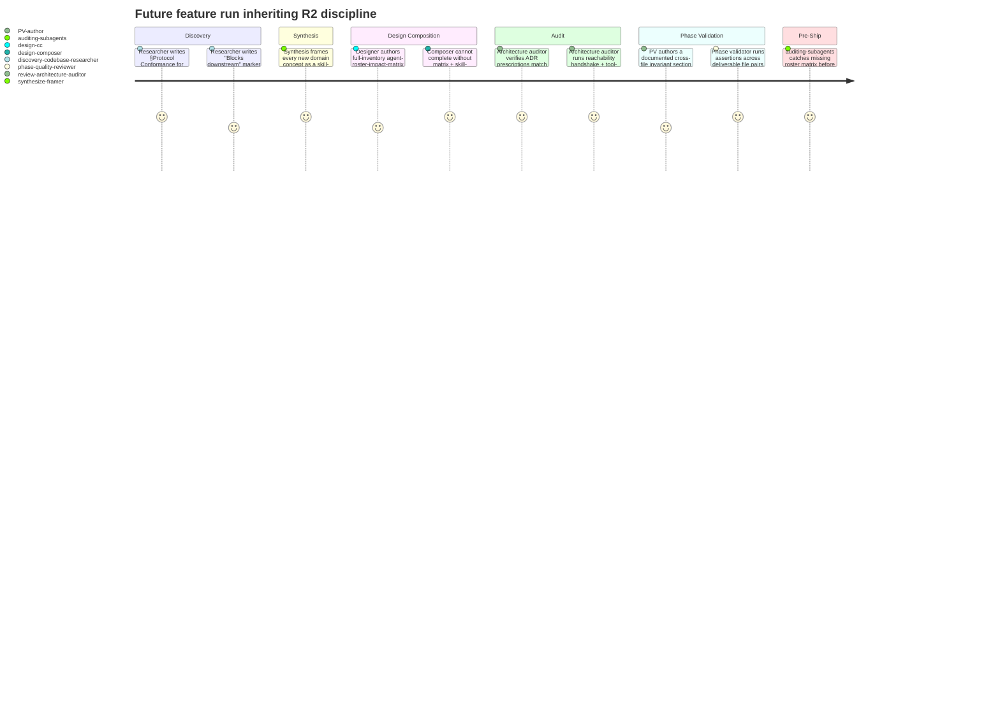
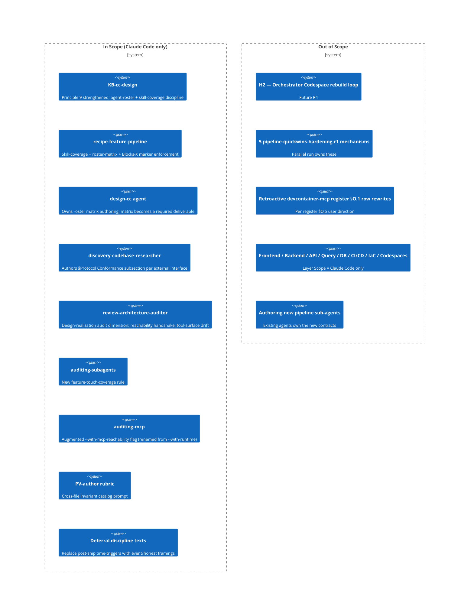

# PRD: Cross-Artifact + Design-Time Discipline (R2)

## Contents

Section completion checklist — each box must be checked (including `N/A — out of scope` rows) before this document leaves draft. The reviewer's Gate 0 check uses this list as the structural-presence anchor.

- [x] Overview
- [x] Stakeholders
- [x] User Stories
- [x] Functional Requirements
- [x] Non-Functional Requirements
- [x] Product Policy Decisions
- [x] Success Criteria
- [x] Technical Considerations
- [x] Rollout Plan
- [x] Contingency Split (R2a/R2b watch-item)
- [x] Undetermined Items
- [x] Appendix

## Overview

### One-line Summary

Make the feature pipeline verify *relationships across artifacts and stages* — not just per-artifact internal correctness — by shipping 11 mechanisms that turn the recurrence risk behind the MCP shipment incident into a structural prevention.

### Background

Two recent failures share a structural shape. In one, Phase 1 of `issue-capture-mechanism-r1` produced a structural spec whose §7 ID-derivation rule contradicted its three sibling templates and five empirical precedents; PV-1 passed cleanly because no validator compared the spec to the templates. In the other, `devcontainer-mcp-provisioning-r1` shipped a configuration where five of seven MCP servers were broken because no auditor compared ADR-0041's prescribed invocations against the eventual `.mcp.json` and `postCreate.sh` files. The first defect was caught by human post-phase review; the second shipped and required forensic recovery.

A separate but converging analysis (`Issues/per-agent-design-evaluation-gap/analysis.md`) traced the same `devcontainer-mcp-provisioning-r1` run and found a parallel structural defect on the design-time side: the pipeline iterated the *changed* agent surface (8 of 36 agents got the new MCP tools) without ever enumerating the full inventory to confirm the other 28 should not change. The gap was caught at Gate 4 by the user. A retroactive sweep happened to confirm the supply-driven set, but no pipeline mechanism would have surfaced a wrong answer if the set had been incomplete.

The unifying thesis, in the user's words from the brief: *"the pipeline must verify relationships across artifacts, not just per-artifact correctness — cancels the structural defect-class behind r1's shipment and the recurrence risk every agent-surface feature inherits."* This feature ships the mechanisms that make that thesis structural rather than aspirational.

A third converging input is the `devcontainer-mcp-provisioning-r1-deferrals/register.md` §O observation: that register contains five rows whose "post-ship / N days post-ship" triggers have no firing mechanism in this project. The user named the pattern at Gate 4 v3 and chose to ship that prior feature unchanged, recording the going-forward posture in the register. This feature lifts that posture into the relevant discipline texts so future features inherit it by default.

### Layer Scope

Declare which layers this feature touches. Sections under Design, Security, Test Boundaries, and Verification corresponding to unchecked layers may be marked `N/A — out of scope` without further elaboration.

- [x] **Claude Code / Project Filesystem** — KB-cc-design, recipe-feature-pipeline skill, design-cc agent, discovery-codebase-researcher agent, review-architecture-auditor agent, auditing-subagents and auditing-mcp skills, PV-author rubric, and discipline texts that govern deferral phrasing
- [ ] **Frontend** — N/A — out of scope (per user direction in brief)
- [ ] **Backend** — N/A — out of scope (per user direction in brief)
- [ ] **API** — N/A — out of scope (per user direction in brief)
- [ ] **Query / Data Access** — N/A — out of scope (per user direction in brief)
- [ ] **Database** — N/A — out of scope (per user direction in brief)
- [ ] **CI/CD (GitHub Actions)** — N/A — out of scope (per user direction; the parallel `pipeline-quickwins-hardening-r1` run owns CI workflow changes)
- [ ] **Infrastructure as Code** — N/A — out of scope (per user direction in brief)
- [ ] **Dev Environment (Codespaces / Devcontainer)** — N/A — out of scope (per user direction; H2 — the orchestrator-driven Codespace rebuild loop — is explicitly deferred to a future R4)

**Scope class:** FULL. Validated against the KB-documentation-criteria scope-class rubric: 11 mechanisms across discovery, synthesis, design, audit, validator authoring, and discipline-text editing; multi-stage reach; structural change to the pipeline's verification model; a watch-item flagged by the user for contingency split. This exceeds the MINOR envelope (~1–2 days, single bounded mechanism) by every dimension.

## Stakeholders

### Stakeholder Inventory

| Stakeholder | Description | Primary Layer(s) | Relationship | Volume / Importance |
|-------------|-------------|------------------|--------------|---------------------|
| Pipeline maintainer | The user — owns the pipeline's correctness contract and authored the R2 brief synthesizing the three source issues | Claude Code | Direct user / primary decision-maker | 1 (the user) — highest weight; the thesis is theirs |
| Future feature authors | Anyone who runs the pipeline against a future feature that touches the agent surface, introduces a new domain concept, or relies on cross-artifact prescription-vs-implementation guarantees | Claude Code | Downstream consumer of the new discipline | All future feature runs |
| Future reviewers | `review-architecture-auditor`, phase-quality reviewers, audit skills (`auditing-subagents`, `auditing-mcp`, `auditing-skills`) — inherit new check dimensions and assertions | Claude Code | Inherits new contract | All five named review surfaces |
| Future synthesis and design composer | `synthesize-*` agents and `design-composer` — inherit the skill-coverage decision frame and the cross-file invariant catalog rubric | Claude Code | Inherits new contract | All future runs |
| Future PV authors | Inherit the cross-file invariant authoring requirement at PV authoring time | Claude Code | Inherits new contract | All future runs |

### Primary Users

The pipeline maintainer is the primary user. Trade-off decisions between mechanism completeness and authoring burden are arbitrated in their favor.

## User Stories

### Pipeline maintainer

```
As the pipeline maintainer,
I want the pipeline to refuse to ship a feature whose ADR prescriptions diverge from the eventual implementation files
So that the MCP-shipment-class defect cannot recur silently behind a green gate.
```

```
As the pipeline maintainer,
I want every feature that touches the agent surface to produce an explicit, full-inventory roster impact matrix before Design Composition can complete
So that the "28 untouched agents evaluated by absence" failure mode is structurally impossible.
```

```
As the pipeline maintainer,
I want every new domain concept a feature introduces to be paired with an explicit skill-coverage decision at Synthesis or Design
So that the W/H/A trifecta question (named existing skill, propose a new one with justification, or record "no skill warranted") fires by default and not only when I push at a gate.
```

```
As the pipeline maintainer,
I want time-based "post-ship / N days post-ship" deferral triggers replaced with event-triggered or honest-acceptance framings in the relevant discipline texts
So that future deferral registers don't accumulate annotations that never fire.
```

### Future feature authors (downstream)

```
As a future feature author whose feature touches the agent surface,
I want a clear definition of what counts as "touching the agent surface" and a template/scaffold for the agent-roster-impact-matrix
So that the new mandatory artifact is mechanically authorable, not an open interpretive question per-run.
```

```
As a future feature author introducing a new domain concept,
I want the skill-coverage decision frame to be a known pipeline step with a named owner stage
So that I learn what's expected at Synthesis or Design instead of being surprised at a downstream gate.
```

### Future reviewers (downstream)

```
As `review-architecture-auditor`,
I want a documented design-realization audit dimension with a defined input shape (whatever the OI-4-deferred shape turns out to be)
So that the audit pass is machine- or mechanically-checkable, not subjective.
```

```
As a phase-quality reviewer,
I want each phase validator to declare the cross-file relationships its deliverables share, with one assertion per relationship
So that the PV-1-class spec-vs-templates divergence is structurally surfaced rather than left to human review.
```

### Use Cases

1. **A future feature touches `.claude/agents/intake-prd-author.md`** to add a new MCP tool to its allowlist. The pipeline refuses to advance past Design Composition until `agent-roster-impact-matrix.md` exists, contains one row per current `.claude/agents/*.md` file, and each row carries a per-dimension evaluation (tools / skills / model / effort / prompt body) with an evidence cell. Stakeholder: future feature author + pipeline maintainer.

2. **A future feature introduces a new domain concept ("rate-limit budgeting")** at Synthesis. The skill-coverage decision frame fires and requires the synthesis output to either (a) name an existing skill that covers it, (b) propose a new skill with W/H/A trifecta, or (c) record "no skill warranted" with rationale. Stakeholder: future synthesis agent + future feature author.

3. **A future ADR prescribes** a specific argv string for an MCP server. At pre-deliverable audit, `review-architecture-auditor` compares the prescription against the eventual `.mcp.json` entry and surfaces any mismatch as a blocking finding. Stakeholder: future reviewer + pipeline maintainer.

4. **A new MCP server's upstream tool list changes** between two runs. The augmented `--with-mcp-reachability` audit (renamed from `--with-runtime`) detects the drift and surfaces it as a blocking finding. Stakeholder: future reviewer + pipeline maintainer.

5. **A future deferral register** is being authored. The discipline text (KB-cc-design + PV-author rubric + deferral / open-items conventions) prevents the author from writing "post-ship / N days post-ship" trigger language without an event-trigger, an honest-acceptance framing, or concrete machinery. Stakeholder: future feature author + pipeline maintainer.

### User Journey Diagram



### Scope Boundary Diagram



## Functional Requirements

Tag each requirement with the **stakeholder** it serves and the **layer** where its acceptance is observed. All requirements below are at the Claude Code layer (the only in-scope layer). Each requirement maps to one of the 11 named mechanisms in the brief; the mechanism code (H1, H3, etc.) is cross-referenced for traceability.

### Must Have (P1 - MVP)

- [ ] **FR-1 (H3) — Design-realization audit dimension on `review-architecture-auditor`** — Stakeholder: future reviewer + pipeline maintainer — Layer: Claude Code
  When an ADR in a feature run prescribes a concrete file path, argv string, environment variable, sentinel location, or other implementation-shaped artifact, `review-architecture-auditor` shall compare the prescription against the eventual file the feature ships and surface any divergence as a blocking finding. The mechanism by which prescriptions are extracted (machine-checkable companion file vs. NLP-style parse of ADR prose) is deferred to Synthesis/Design (see OI-A1 in Undetermined Items; mirrors IC OI-4).
  - AC-FR-1-a: When an ADR in the run's `adrs/` set prescribes a concrete implementation detail and the eventual file diverges from that prescription, then `review-architecture-auditor` shall emit a `BLOCKER`-severity finding naming the ADR ID, the prescription, the diverging file, and the diff.
  - AC-FR-1-b: When `review-architecture-auditor` runs and the feature's ADR set contains zero prescriptions of the kind defined by the OI-A1 resolution, the auditor shall complete without raising a design-realization finding (i.e., the new dimension shall be a no-op when there is nothing to compare).
  - AC-FR-1-c: The system shall document, in `review-architecture-auditor`'s contract, the mechanism by which prescriptions are extracted, so that downstream authors can produce ADRs that the auditor can mechanically inspect.

- [ ] **FR-2 (H6) — §Protocol Conformance subsection requirement in `discovery-codebase-researcher` output** — Stakeholder: future reviewer + future feature author — Layer: Claude Code
  For each external interface (MCP server, external service, CLI, third-party library API) that the feature's Layer Scope or codebase analysis identifies as in-scope, `discovery-codebase-researcher` shall produce a §Protocol Conformance subsection that enumerates the protocol/contract dimensions the feature relies on and the discovery-time evidence that each dimension holds.
  - AC-FR-2-a: When the codebase-analysis-report enumerates one or more external interfaces in scope, then `discovery-codebase-researcher` shall include one §Protocol Conformance subsection per such interface in its output, and each subsection shall name the contract dimensions covered.
  - AC-FR-2-b: If no external interfaces are in scope, then `discovery-codebase-researcher` shall record `§Protocol Conformance — N/A (no external interfaces in scope)` rather than omitting the subsection silently.

- [ ] **FR-3 (H9) — PV-tier cross-file consistency invariant catalog** — Stakeholder: future reviewer + future PV author — Layer: Claude Code
  When a phase validator is authored, the PV-author rubric shall prompt the author to enumerate every cross-file relationship the phase's deliverables share, and the resulting phase validator shall contain one assertion per such relationship. Whether these invariants are authored denormalized (a per-PV section in each phase validator) or normalized (a centralized `cross-file-invariants.md` referenced by each PV) is deferred to Synthesis/Design (see OI-A2; mirrors IC OI-3).
  - AC-FR-3-a: When PV-author authors a phase validator for a phase that ships two or more deliverable files, then the resulting phase validator shall contain a Cross-File Invariants section with one assertion per declared cross-file relationship.
  - AC-FR-3-b: When PV-author authors a phase validator for a phase that ships exactly one deliverable file, then the Cross-File Invariants section shall record `N/A — single-deliverable phase` rather than omit silently.
  - AC-FR-3-c: When the cross-file invariant assertion fails at phase-validation time, the system shall emit a finding whose severity is at minimum the severity of the most severe per-file assertion that the validator would have raised — i.e., the cross-file assertion shall not be downgraded relative to per-file checks.

- [ ] **FR-4 (H1) — Rename `--with-runtime` to `--with-mcp-reachability` and add live handshake** — Stakeholder: future reviewer + pipeline maintainer — Layer: Claude Code
  The existing `--with-runtime` audit flag on the `auditing-mcp` skill's runner shall be renamed to `--with-mcp-reachability`. When the renamed flag is set, the runner shall perform a live handshake (initialize / list-tools / shutdown, or the equivalent transport-level call) against every MCP server entry in `.mcp.json` and surface any unreachable server as a finding.
  - AC-FR-4-a: When the auditing-mcp runner is invoked with `--with-mcp-reachability`, the system shall attempt a live handshake against each MCP server entry in `.mcp.json` and shall record the per-server result (`reachable` / `unreachable` / `transport-error`) in its output.
  - AC-FR-4-b: If any MCP server entry in `.mcp.json` is unreachable when the runner is invoked with `--with-mcp-reachability`, then the runner shall emit a `BLOCKER`-severity finding identifying the server, the configured invocation, and the transport-level failure.
  - AC-FR-4-c: When the auditing-mcp runner is invoked WITHOUT `--with-mcp-reachability`, the system shall NOT perform a live handshake (preserving the existing static-audit behavior under the old flag's absence).
  - AC-FR-4-d: The system shall reject invocations using the legacy `--with-runtime` flag name with a clear error message referencing the renamed flag, so that stale invocations fail loudly rather than silently no-oping.

- [ ] **FR-5 (H8) — Live tool-surface drift detection** — Stakeholder: future reviewer + pipeline maintainer — Layer: Claude Code
  When `--with-mcp-reachability` is set and the handshake against a server succeeds, the runner shall compare the server's live `list-tools` response against a recorded baseline of the server's tool surface. Drift (added tools, removed tools, signature changes) shall be surfaced. The drift-detection algorithm shall be tuned to keep the false-positive rate below the NFR-4 threshold so the audit surface is not spammed by spurious churn.
  - AC-FR-5-a: When the live `list-tools` response from an MCP server differs from the recorded baseline by any tool addition or removal, the system shall emit a finding identifying the server, the diff (added/removed tools), and the severity (BLOCKER for removal of a tool currently allowlisted to any agent; MAJOR for additions; MAJOR for signature changes on currently-allowlisted tools).
  - AC-FR-5-b: While no baseline exists for an MCP server (first encounter), the system shall record the live `list-tools` response as the baseline and emit an `INFO`-severity diagnostic rather than a finding.
  - AC-FR-5-c: If a server's live `list-tools` response is unparseable or the call errors, then the system shall emit a `MAJOR`-severity finding identifying the server and the error, and shall NOT silently treat the missing response as "no drift."

- [ ] **FR-6 (B1) — Mandatory `agent-roster-impact-matrix.md` artifact when a feature touches the agent surface** — Stakeholder: future feature author + pipeline maintainer — Layer: Claude Code
  When a feature's diff (proposed or in-progress) touches the agent surface, `design-cc` shall produce a full-inventory `agent-roster-impact-matrix.md` artifact, and Design Composition shall be blocked from completing until the artifact exists, contains one row per current `.claude/agents/*.md` file, and each row carries a per-dimension evaluation (tools / skills / model / effort / prompt body) with an evidence cell.

  **Trigger condition (resolving IC OI-6):** A feature is deemed to "touch the agent surface" if any of the following hold during the feature run:
  1. The feature's diff modifies, creates, or removes any file under `.claude/agents/*.md`.
  2. The feature's diff modifies `.mcp.json` in a way that adds, removes, or changes the tool surface of any MCP server already allowlisted to one or more agents.
  3. The feature's diff creates a new skill (`.claude/skills/<name>/SKILL.md`) that the feature's design indicates one or more existing agents will load.
  4. The feature's design or PRD declares a new domain concept whose skill-coverage decision (FR-7 below) names an existing agent as a downstream consumer.

  Triggers 2–4 are deliberately broad — the analysis (`per-agent-design-evaluation-gap` §2) treats the gap as a four-dimension pattern, not a tools-only pattern.

  **Per-agent-evidence cell granularity (resolving IC OI-5; default per this PRD):** Each cell shall carry a **structural value plus a short positive-evidence string** (e.g., `no-change — no responsibility intersect with feature scope (verified against agent prompt body and tools list)`). A bare `no change` without an evidence string is insufficient. Design Composition MAY revise this default with rationale in the Blueprint.

  - AC-FR-6-a: When a feature's diff satisfies any of the four trigger conditions above, the system shall require `design-cc` to author `working/feature/<slug>/agent-roster-impact-matrix.md` before Design Composition can mark its stage complete.
  - AC-FR-6-b: When `agent-roster-impact-matrix.md` is authored, the system shall require its row count to equal the count of files matching `.claude/agents/*.md` at the time of authoring, and require each row to carry one cell per dimension (tools / skills / model / effort / prompt body), and each cell to contain a value plus a positive-evidence string.
  - AC-FR-6-c: If the row count diverges from the `.claude/agents/*.md` file count, then Design Composition shall be blocked and the divergence shall be surfaced as a `BLOCKER`-severity finding.
  - AC-FR-6-d: If any cell contains a bare `no change` (or equivalent) without a positive-evidence string, then `design-cc` shall be required to revise that cell before Design Composition can mark its stage complete.

- [ ] **FR-7 (B3) — Skill-coverage check at Synthesis / Design for new domain concepts** — Stakeholder: future synthesis agent + future feature author — Layer: Claude Code
  When a feature introduces one or more new domain concepts (identified at Synthesis or in the Blueprint as concepts not previously named in the project's KB / skill inventory), the synthesis or design composition stage shall produce a skill-coverage decision for each such concept. The decision shall be one of: (a) name the existing skill that covers it, (b) propose a new skill with W/H/A trifecta justification (Why this skill exists / How agents use it / Anti-patterns to avoid), or (c) record "no skill warranted" with explicit rationale.
  - AC-FR-7-a: When the feature's synthesis or Blueprint enumerates one or more new domain concepts, then the synthesis or design composition output shall include a Skill-Coverage Decisions section with one decision row per concept.
  - AC-FR-7-b: If a Skill-Coverage decision row is missing the required justification (an existing-skill name; or a W/H/A trifecta for a proposed skill; or a rationale for "no skill warranted"), then the design composition stage shall be blocked until the row is filled.
  - AC-FR-7-c: When the decision proposes a new skill, then the W/H/A trifecta shall name the skill's purpose (Why), at least one downstream agent or stage that loads it (How), and at least one anti-pattern the skill prevents (Anti-patterns).

- [ ] **FR-8 (B2) — Strengthen KB-cc-design Principle 9 from defensive to active** — Stakeholder: future feature author + future reviewer — Layer: Claude Code
  The wording of KB-cc-design Principle 9 shall be updated from a defensive framing ("don't change `model:` / `effort:` / `skills:` lightly") to an active framing that requires designers, for each agent on the touched surface, to record the consideration performed even when the outcome is no change.
  - AC-FR-8-a: When KB-cc-design Principle 9 is consulted by `design-cc` during a feature that touches the agent surface, then the principle's text shall require recording per-agent consideration as a positive evidence string, not merely asserting "no change."
  - AC-FR-8-b: The system shall keep the new wording consistent with FR-6's per-agent-evidence-cell discipline, so that designers reading Principle 9 and authoring the roster matrix do not encounter contradictory guidance.

- [ ] **FR-9 (B4) — Enforce "Blocks downstream" markers from Discovery as stage-transition gates** — Stakeholder: future reviewer + future feature author — Layer: Claude Code
  When the discovery research stage produces an output containing a marker of the form `Blocks <stage>` (e.g., `Blocks design-cc-completion`), the orchestrator shall refuse to advance past the named stage until the marker is closed (resolved with rationale, deferred with explicit OI-N, or marked false-positive with rationale).
  - AC-FR-9-a: When discovery research output contains one or more `Blocks <stage>` markers, the orchestrator shall enumerate them and shall NOT mark the named stage complete until each marker has been transitioned to `resolved`, `deferred-with-OI`, or `false-positive`.
  - AC-FR-9-b: If the orchestrator detects an unresolved `Blocks <stage>` marker at a stage-transition checkpoint, then it shall emit a `BLOCKER`-severity finding and halt advance.
  - AC-FR-9-c: The system shall record the transition rationale (resolved / deferred / false-positive) in the run's state-transitions log so that downstream stages can read the closure.

- [ ] **FR-10 (B5) — `auditing-subagents` feature-touch-coverage rule** — Stakeholder: future reviewer + pipeline maintainer — Layer: Claude Code
  The `auditing-subagents` skill shall include a new audit rule that, when a feature's working directory indicates the feature touched the agent surface (per FR-6's trigger conditions), verifies the presence of `agent-roster-impact-matrix.md` and that its row count equals the current `.claude/agents/*.md` file count. The rule fires at pre-deliverable-packaging time as a backstop to FR-6's design-time block.

  **Reverse-check decision (resolving IC OI-7):** Whether `auditing-skills` gets a parallel reverse-check (when a new skill is authored, audit whether existing agents' `skills:` arrays should include it) is **carried as an Open Question for the Blueprint** rather than folded into B5's scope. Rationale: B5's primary purpose is roster-matrix-presence enforcement; bolting a skills reverse-check onto the same rule conflates two different audit dimensions. The Blueprint can either author it as a separate sibling rule under `auditing-skills`, or defer it as an additive change.

  - AC-FR-10-a: When `auditing-subagents` runs at pre-deliverable-packaging time on a feature whose working directory indicates the agent surface was touched, the system shall verify the presence of `agent-roster-impact-matrix.md` in the working directory and emit a `BLOCKER`-severity finding if the file is missing.
  - AC-FR-10-b: When the roster matrix is present, the system shall verify that its row count equals the current count of `.claude/agents/*.md` files at audit time and emit a `BLOCKER`-severity finding on mismatch.
  - AC-FR-10-c: When `auditing-subagents` runs on a feature whose working directory indicates the agent surface was NOT touched, the system shall NOT require the roster matrix and shall NOT emit a finding for its absence.

- [ ] **FR-11 (§O posture) — Replace "post-ship" time-based deferral triggers with event-triggered or honest-acceptance framings in discipline texts** — Stakeholder: future feature author + pipeline maintainer — Layer: Claude Code
  The relevant discipline texts (KB-cc-design, the deferral / open-items conventions used by `intake-prd-author` and `design-composer`, the PV-author rubric, and any other discipline text that governs deferral phrasing) shall be updated so that future deferral registers replace "post-ship / N days post-ship / first weeks post-ship / post-ship felt-utility review" trigger language with one of three options: (i) an event-trigger tied to an observable event already in the system; (ii) an honest-acceptance framing ("we accept this cost; the entry is additive and cheap; no tracking"); or (iii) concrete machinery proposed as its own feature.

  **This FR shall NOT retroactively edit** the existing `devcontainer-mcp-provisioning-r1-deferrals/register.md` §O.1 rows (E-3, A-3, D-5, I-1). Per the register's own §O.5, the user already directed "no changes to the feature scope" for that prior feature. R2 establishes the going-forward posture in the discipline texts; it does not edit the existing register entries.

  - AC-FR-11-a: When a future feature author consults the deferral / open-items convention text after this feature ships, the system shall present the three permitted framings (event-trigger / honest-acceptance / concrete-machinery) and shall not present "post-ship" / time-based triggers as an example of acceptable framing.
  - AC-FR-11-b: When the PV-author rubric is consulted after this feature ships, the system shall include a check that the phase validator's deferral-related findings (if any) use one of the three permitted framings.
  - AC-FR-11-c: The system shall preserve the existing `devcontainer-mcp-provisioning-r1-deferrals/register.md` §O.1 rows verbatim (no retroactive edits) and shall record this preservation as deliberate, per the register's §O.5.

### Should Have (P2)

(none for this feature — the 11 mechanisms are the brief's committed set; deferring any of them to P2 would defeat the unifying thesis.)

### Could Have (P3)

(none for this feature.)

### Won't Have (this release)

- **H2 — Orchestrator-driven Codespace rebuild loop.** Brief excludes verbatim ("high cost, orthogonal, postmortem's own roadmap defers it. Treat as future R4 if felt-need emerges").
- **Retroactive rewriting of `devcontainer-mcp-provisioning-r1-deferrals/register.md` §O.1 rows** (E-3, A-3, D-5, I-1). Per register §O.5 user direction; FR-11 establishes the going-forward posture only.
- **The five `pipeline-quickwins-hardening-r1` mechanisms** (verdict-vs-findings consistency, single-agent-fallback ban for FULL features, `.mcp.json` ↔ install-taxonomy parity rule, GitNexus install smoke test, CI `claude mcp list` smoke test). Ship in the parallel quick-wins run; R2 is the deferred follow-on the proposal explicitly carves out.
- **Any non-Claude-Code layer.** Per brief: "Layer Scope = Claude Code only." All 8 other layers explicitly out of scope.
- **Authoring new pipeline sub-agents** for any of the mechanisms. Per `per-agent-design-evaluation-gap` §6.3: "a new sub-agent dedicated to agent-roster review" is explicitly non-recommended. Existing agents own the new contracts.
- **Splitting the Claude Code layer into sub-layers.** Also per `per-agent-design-evaluation-gap` §6.3 non-recommendation.
- **Pure issue-management hygiene** (closing the source Issues' status fields). Out-of-band to the pipeline run.

## Non-Functional Requirements

### Performance

- **NFR-1 (auditor performance budget — design-realization audit, FR-1)** — `review-architecture-auditor`'s new design-realization audit pass shall complete within **5000 ms** for a feature run with up to 20 ADR prescriptions to compare against eventual files. Rationale: 5000 ms is the auditor performance budget propagated from prior PRDs (NFR-2 in the `devcontainer-mcp-provisioning-r1` PRD-v3); this PRD preserves that budget so the auditor's total wall-clock at Gate 5 does not regress.
  - AC-NFR-1-a: When `review-architecture-auditor` runs its design-realization pass on a feature with up to 20 ADR prescriptions, the system shall complete the pass within 5000 ms wall-clock.

- **NFR-2 (reachability check timeout — FR-4)** — Each per-server live handshake under `--with-mcp-reachability` shall complete within **3000 ms** per server (or fail the server with a `transport-error` result). Rationale: with 6–8 servers in `.mcp.json` and a 3000 ms per-server cap, the total reachability pass stays under 24 s even in the worst case, which keeps the augmented audit's added wall-clock within the budget operators currently tolerate.
  - AC-NFR-2-a: When the auditing-mcp runner attempts a live handshake against an MCP server under `--with-mcp-reachability`, the system shall enforce a 3000 ms timeout per server and record a `transport-error` result on timeout.

- **NFR-3 (drift detection wall-clock — FR-5)** — Tool-surface drift detection (the `list-tools` comparison against the recorded baseline) shall complete within **500 ms per server** after the handshake succeeds, so total drift-detection wall-clock for 6–8 servers stays under 4 s. Rationale: drift detection is a string-diff over a small JSON document; >500 ms suggests a parsing or I/O regression.
  - AC-NFR-3-a: When the runner compares a server's live `list-tools` response against the recorded baseline, the system shall complete the comparison within 500 ms per server.

### Reliability

- **NFR-4 (drift-detection false-positive rate — FR-5)** — The drift-detection algorithm shall achieve a false-positive rate of **less than 5% across a representative run of 50 consecutive audits** against a stable MCP server set. Rationale: tool-list drift findings spam the audit surface if false-positive rate is high; the user explicitly flagged this concern in the brief authoring context. The 5% target gives a margin for normal upstream cosmetic changes (description rewordings, parameter-doc updates) while still catching genuine signature changes. Drift-detection comparisons SHALL normalize whitespace and ignore description-text-only changes by default; signature changes and tool add/remove events are never normalized away.
  - AC-NFR-4-a: When the drift-detection algorithm is exercised against a stable baseline across 50 consecutive audits, the system shall record fewer than 3 false-positive findings (5% of 50 = 2.5 → ceiling 3).

- **NFR-5 (auditor idempotency — FR-1, FR-5)** — Re-running `review-architecture-auditor` against an unchanged feature run shall produce byte-identical findings JSON. Rationale: cross-artifact comparisons that yield non-deterministic outputs make iteration loops worse, not better.
  - AC-NFR-5-a: When `review-architecture-auditor` is run twice against the same feature run with identical inputs, the system shall produce findings JSON whose contents are byte-identical.

### Security

- **NFR-6 (no credential leakage in audit output)** — Findings JSON emitted by the augmented `review-architecture-auditor` and `auditing-mcp` runners shall not include credential-shaped strings (PATs, bearer tokens, etc.) even when the live handshake exposes them in error messages. Rationale: audit output is committed to working-directory state; credential leakage there is an exposure path.
  - AC-NFR-6-a: When the runner emits a finding whose underlying transport-level error contains a credential-shaped string, the system shall redact the credential before serializing the finding.

### Scalability

- **NFR-7 (matrix scaling — FR-6)** — The roster-matrix authoring discipline shall remain mechanically authorable up to **at least 100 agents** (current inventory ~36; headroom for growth). Rationale: the matrix is one row per agent; the burden is roughly linear; at 100 agents the matrix is ~500 cells, still authorable per-feature without infrastructure.
  - AC-NFR-7-a: When the `.claude/agents/*.md` inventory reaches 100, the roster-matrix discipline shall remain operable without structural redesign.

### Operability

- **NFR-8 (clear failure messages)** — Every blocking finding emitted by FR-1, FR-4, FR-5, FR-6, FR-9, FR-10 shall name (i) the rule that fired, (ii) the file or artifact that triggered it, (iii) the specific divergence or missing element, and (iv) the concrete next action to close. Rationale: silent failures and vague messages are the recurrence mode behind the MCP shipment; the user named this in the brief authoring context as the EARS-discipline calibration point.
  - AC-NFR-8-a: When any of FR-1, FR-4, FR-5, FR-6, FR-9, FR-10 emits a blocking finding, the system shall include in the finding a `rule`, `target`, `divergence`, and `next_action` field, each populated with concrete content (not a placeholder).

### Developer Experience (Claude Code)

- **NFR-9 (agent-driven workflow support)** — All new authoring affordances (roster-matrix scaffold; §Protocol Conformance scaffold; cross-file invariant prompt; Skill-Coverage Decisions section template) shall be reachable from the existing agent workflow — i.e., the affordance is either a section in a known template, a known skill the agent already loads, or a discipline-text section the agent already consults. No new sub-agent shall be introduced (per Won't-Have above).
  - AC-NFR-9-a: When a future feature author runs the pipeline after this feature ships, the system shall make every new affordance discoverable from the agent's existing skill / template / discipline-text inventory without requiring the author to learn a new sub-agent contract.

## Product Policy Decisions

This section captures cross-cutting product-level decisions that ripple across artifacts. Each policy here is a deliberate commitment, distinct from implementation choice.

| Policy Area | Decision | Rationale | Affected Layers |
|-------------|----------|-----------|-----------------|
| Agent surface "touch" definition (FR-6 trigger) | Four explicit conditions: agent file diff, `.mcp.json` tool-surface diff, new skill loaded by existing agents, or new-domain-concept skill-coverage decision naming an agent | The analysis (`per-agent-design-evaluation-gap` §2) frames the gap as a four-dimension pattern; a narrow tools-only trigger would replay the same defect on the skills / model / effort dimensions | Claude Code |
| Per-agent-evidence-cell granularity (FR-6 cell discipline) | Structural value PLUS positive-evidence string (bare `no change` insufficient); Blueprint may revise with rationale | Resolves IC OI-5. The defensive-vs-active distinction is the load-bearing one (B2 thesis); bare-value cells re-create the passive posture | Claude Code |
| `auditing-skills` reverse-check (IC OI-7) | Carried as Blueprint Open Question, NOT folded into B5's scope | Conflating roster-matrix-presence enforcement with skills-array reverse-checks blurs two distinct audit dimensions; Blueprint can author it as a sibling rule under `auditing-skills` or defer cleanly | Claude Code |
| Single feature vs R2a/R2b split | Single feature for v1; Design Composition surfaces a split recommendation to the user if and only if the open-item count exceeds the contingency-split threshold (see Contingency Split section below) | Resolves IC OI-1. The brief's verbatim direction is "surface to me at the PRD or Design Composition gate if the open-item count threatens the cap" — single is the default, split is a contingency | Claude Code |
| H3 prescription-extraction mechanism (IC OI-4) | Defer to Synthesis / Design Composition | The IC explicitly preserves this tension (machine-checkable companion file vs. NLP-style parse); pre-deciding via PRD prose would short-circuit the Design stage's mandate | Claude Code |
| H9 invariant authoring shape (IC OI-3) | Defer to Synthesis / Design Composition | Same tension-preservation discipline as above; the denormalized-vs-normalized tradeoff is a design-stage call | Claude Code |
| Retroactive register edits | Forbidden for this feature (FR-11 explicit) | Per `devcontainer-mcp-provisioning-r1-deferrals/register.md` §O.5 user direction at Gate 4 v3: "no changes to the feature scope. Blueprint v3 keeps the '90 days post-ship' phrasing in OI-6 and the Risks-table cold-cache row verbatim." | Claude Code |
| New sub-agent prohibition | No new pipeline sub-agents for any of the 11 mechanisms | Per `per-agent-design-evaluation-gap` §6.3 non-recommendation; existing agents own the new contracts; preserves the orchestrator topology brought up in the brief's out-of-scope list | Claude Code |

## Success Criteria

### Quantitative Metrics

| Metric | Stakeholder | Target | Measurement Method | Timeframe |
|--------|-------------|--------|--------------------|-----------|
| Recurrence of the design-realization-gap defect class | Pipeline maintainer | Zero across the next N feature runs that touch any ADR-prescribed artifact (N ≥ 3, to give the signal time to materialize) | Each run's `review-architecture-auditor` output; presence/absence of `BLOCKER` findings matched to subsequent shipment incidents | Across the next ~3 feature runs post-ship |
| Presence of `agent-roster-impact-matrix.md` on every agent-surface-touching feature | Pipeline maintainer | 100% (every such feature has the artifact at Design Composition close) | `auditing-subagents` audit run; FR-10 fires on miss | Every applicable run |
| Skill-coverage decisions recorded per new domain concept | Pipeline maintainer | 100% of new domain concepts have a recorded decision (existing skill / proposed new / no-skill rationale) | Synthesis or Blueprint output inspection; FR-7 fires on miss | Every applicable run |
| "Post-ship / N days post-ship" trigger language in new artifacts | Pipeline maintainer | Zero occurrences in artifacts authored after this feature ships | Grep across new feature runs' working directories | Every run post-ship |
| Drift-detection false-positive rate | Pipeline maintainer | < 5% across a representative 50-audit sample (NFR-4) | Run drift-detection against a stable MCP server set 50 times; count false positives | First operational use |

### Qualitative Metrics

1. **Pipeline maintainer's confidence delta** — the user can answer "did the pipeline rule out the MCP-class shipment incident this run?" with evidence (the auditor output) rather than inference. (Stakeholder: pipeline maintainer.)
2. **Future feature author's onboarding shape** — a new contributor can discover the new affordances (matrix scaffold, skill-coverage frame, §Protocol Conformance scaffold) from the agent workflow they already use, without needing the user to point at the discipline text. (Stakeholder: future feature author.)

### Developer Experience Metrics (Claude Code in scope)

1. **Authoring burden per feature** — for a feature that touches the agent surface and introduces one new domain concept, the new artifacts (roster matrix + skill-coverage decisions) shall be authorable within the run's existing time envelope without requiring a new stage. (Stakeholder: future feature author.)
2. **Number of orchestrator-recognized stage-transition gates added** — exactly 2 (FR-6 design composition block; FR-9 Blocks-X enforcement). No other new stage-transition gates are introduced; the existing topology is preserved. (Stakeholder: pipeline maintainer.)

## Technical Considerations

### Dependencies

- **Existing systems we depend on:**
  - `review-architecture-auditor` — must accept a new audit dimension without restructure (FR-1, FR-4, FR-5)
  - `auditing-mcp` skill and its runner — must accept the renamed flag and the live handshake (FR-4, FR-5)
  - `auditing-subagents` skill — must accept a new audit rule (FR-10)
  - `design-cc` agent — must author the new mandatory artifact (FR-6)
  - `discovery-codebase-researcher` agent — must produce the new §Protocol Conformance subsection (FR-2)
  - `synthesize-*` agents and `design-composer` — must produce the Skill-Coverage Decisions section (FR-7)
  - KB-cc-design — must absorb the strengthened Principle 9 (FR-8) and reference the new agent-surface-touch definition (FR-6)
  - PV-author rubric — must absorb the cross-file invariant prompt (FR-3)
  - recipe-feature-pipeline skill — must reference the new affordances
  - orchestrator state-transitions logging — must accept Blocks-X marker transitions (FR-9)

- **External services we depend on:** None new. The live MCP handshake (FR-4) and tool-surface drift detection (FR-5) consume the existing MCP transport surface against the existing six (per `.mcp.json` as of 2026-05-24, post the `mcp-openapi-schema` removal).

- **Upstream features that must ship first:**
  - `pipeline-quickwins-hardening-r1` should ship first or in parallel — it owns the five quick-wins this feature deliberately does not duplicate, and at least one of those (the `.mcp.json` ↔ install-taxonomy parity rule) is the narrow precursor to FR-1's broader design-realization audit dimension.

- **Downstream consumers affected by this change:** Every future feature run inherits the new disciplines. There is no opt-out; per the brief, the unifying thesis is structural and applies pipeline-wide.

### Constraints

- **Technical constraints:** Claude Code layer only. No CI/CD, IaC, Codespaces, or any product-surface layer touched. No new sub-agents authored. No retroactive edits to the `devcontainer-mcp-provisioning-r1-deferrals/register.md` §O.1 rows.
- **Resource constraints:** The 11 mechanisms must be authorable within the 4-cycle reconciliation cap. The Contingency Split mechanism (below) is the explicit safety valve.
- **Regulatory / contractual constraints:** None.

### Assumptions

Each assumption should name how it will be validated, by whom, and by when.

- [ ] **A-1 — `review-architecture-auditor`'s current contract can absorb a new dimension without restructure.** Validation: Discovery-stage codebase analysis confirms the auditor's input/output schema allows additive dimensions. Owner: `discovery-codebase-researcher`. By: Discovery completion.
- [ ] **A-2 — The MCP transport supports a reachability handshake distinguishable from a static config-parse.** Validation: Discovery confirms `claude mcp ping` (or equivalent JSON-RPC call) exists in the pinned Claude Code Feature version, OR Discovery confirms a fallback direct-JSON-RPC path is feasible. Owner: `discovery-codebase-researcher`. By: Discovery completion.
- [ ] **A-3 — The drift-detection false-positive rate target (< 5%) is achievable with reasonable normalization.** Validation: Discovery evaluates the cardinality of cosmetic vs. signature changes across two recent baseline pairs (per server). Owner: `discovery-codebase-researcher` + `design-composer`. By: Design Composition completion.
- [ ] **A-4 — Existing `.claude/agents/*.md` inventory is enumerable mechanically (i.e., `ls .claude/agents/*.md | wc -l` is the ground truth, no glob exclusions in scope).** Validation: trivial — grep / glob confirms. Owner: `design-cc`. By: Design Composition.
- [ ] **A-5 — The "Blocks downstream" marker syntax in discovery output is parseable mechanically.** Validation: Discovery surveys existing marker usage across recent runs to confirm a stable grammar; if absent, Design proposes the grammar. Owner: `discovery-codebase-researcher`. By: Discovery completion.

### Risks and Mitigation

| Risk | Stakeholder Affected | Impact | Probability | Mitigation |
|------|----------------------|--------|-------------|------------|
| Open-item count exceeds the 4-cycle reconciliation cap mid-synthesis, forcing a re-engagement loop | Pipeline maintainer | High | Medium | Contingency Split section below: Design Composition surfaces the split (R2a/R2b) to the user at the named threshold rather than running the cycles down |
| Drift-detection false-positive rate exceeds the < 5% target and spams the audit surface | Future reviewer | Medium | Medium | NFR-4 defines the threshold; Design tunes normalization rules; if the target isn't achievable at Design, the FR-5 contract is revisited at Gate 5 |
| Authoring-burden creep: roster matrix + skill-coverage + §Protocol Conformance + cross-file invariants combine to make every future agent-surface-touching feature meaningfully slower | Future feature author | Medium | Medium | NFR-9 requires affordances reachable from existing workflow; Design provides scaffolds; if measured burden is intolerable, the FR-6 cell-granularity (currently positive-evidence-required) is the first dial to relax |
| The `Blocks downstream` marker grammar in discovery output is heterogeneous across recent runs, making FR-9 enforcement brittle | Future reviewer | Medium | Low–Medium | A-5 validates the grammar at Discovery; if heterogeneous, Design proposes a canonical grammar and migrates existing markers as part of the FR-9 rollout |
| H3 prescription-extraction mechanism (OI-A1) cannot be settled at Synthesis/Design without further user input, blocking FR-1's contract | Pipeline maintainer + future reviewer | Medium | Medium | Design Composition surfaces the OI to the user at the Design Composition Gate; FR-1's testability hinges on the OI's resolution |
| Renaming `--with-runtime` to `--with-mcp-reachability` breaks an existing invocation that this feature did not enumerate | Pipeline maintainer | Low | Low | FR-4-d explicitly requires the rename to fail loudly (not silently no-op) on the legacy flag name; Discovery enumerates current call sites at audit-skill or recipe level |
| Retroactive editing of register §O.1 rows accidentally happens (e.g., a designer "tidies up" the prior register) | Pipeline maintainer | Low | Low | FR-11-c explicitly forbids retroactive edits; the AC is testable by grep against the register's verbatim §O.1 content |

## Rollout Plan

This feature ships discipline + audit-machinery changes inside the pipeline itself. There is no end-user audience to stage; rollout is the pipeline-internal sequencing.

- **Launch audience progression:** Internal-only. The first feature run that touches the agent surface AFTER this feature ships is the natural validation point. No external beta or GA.
- **Communication plan:** The feature's deliverable archive includes a one-page "What changed for future feature authors" summary referencing the 11 mechanisms by FR number. The recipe-feature-pipeline skill is updated to reference the new affordances so the orchestrator surfaces them at the natural stage.
- **Migration path:** For features already in flight when this ships, the existing contract applies; the new disciplines apply to features whose Intent Clarification stage starts after this feature's deliverable packaging.
- **Kill criteria:**
  - If, after the next agent-surface-touching feature ships, the roster matrix discipline (FR-6) demonstrably increases authoring time by >2× without preventing any detectable defect, then the FR-6 cell-granularity default (currently positive-evidence-required) is revisited.
  - If the drift-detection false-positive rate (NFR-4) exceeds 5% in operational use across 3 consecutive runs, FR-5's drift-detection contract is revisited.
  - If the H3 prescription-extraction mechanism (OI-A1) cannot be settled within the run's reconciliation cap, the feature is split per the Contingency Split section.

  Note: All kill criteria above use event-triggered framings (the next feature's ship; 3 consecutive runs) rather than calendar-based "N days post-ship" triggers, per FR-11's posture.

## Contingency Split (R2a/R2b watch-item)

The user's brief names a potential R2a/R2b split as the contingency if synthesis explodes the open-item count past the 4-cycle reconciliation cap. This PRD records the split membership and a mechanically-applicable threshold so that `design-composer` does not have to invent the rubric at the Design Composition Gate.

### Candidate split membership

- **R2a — design-time discipline:** FR-6 (B1, roster matrix), FR-7 (B3, skill-coverage), FR-8 (B2, KB-cc-design Principle 9), FR-9 (B4, Blocks-X enforcement), FR-10 (B5, auditing-subagents rule), FR-1 (H3, design-realization audit dimension — design-time half).
- **R2b — gate/validator hardening:** FR-2 (H6, §Protocol Conformance), FR-3 (H9, PV-tier cross-file invariants), FR-4 (H1, reachability rename), FR-5 (H8, tool-surface drift), FR-11 (§O posture in discipline texts).

This is the brief's natural split, mechanism-by-mechanism. The R2a set targets the design-time discipline gap (the `per-agent-design-evaluation-gap` thesis); the R2b set targets the gate/validator hardening gap (the `cross-artifact-divergence-detection-gap` thesis). FR-1 (H3) is the genuinely cross-cutting mechanism — it lives in `review-architecture-auditor` (an audit surface) but its semantics are most naturally tied to design-time prescription extraction; this PRD places it in R2a, but Design Composition MAY relocate to R2b with rationale.

### Split-recommendation threshold

`design-composer` shall recommend the split to the user at the Design Composition Gate **if and only if** any of the following hold at the close of the design composition stage:

1. The cumulative count of open items (across IC OI carry-forwards, this PRD's `OI-A*`, and Blueprint-stage Open Questions raised by per-layer designers) exceeds **12** at any point during synthesis or design composition. Rationale: the IC carries 8 OIs forward; this PRD adds 2 (OI-A1, OI-A2) and 1 conditional (OI-A3 for the `auditing-skills` reverse-check); a Blueprint that adds more than 1 new OI per FR (i.e., > 11 new items) pushes the total past the empirical 4-cycle cap and warrants the split.
2. Any single FR's design produces >3 distinct sub-decisions that cannot be resolved without further user input. Rationale: more than 3 sub-decisions on one FR is a sign that the FR is genuinely two FRs trying to share a contract.
3. The Design Composition reviewer (Gate 0/1) returns `needs_revision` twice in a row on the same set of FRs without convergence. Rationale: this is the structural recurrence-of-divergence signal that prompted the watch-item in the first place.

The threshold of 12 is calibrated as follows: the 4-cycle reconciliation cap, empirically across recent feature runs, terminates around 12–15 active open items; choosing 12 gives a margin and surfaces the question before the cap is hit. `design-composer` SHOULD apply this threshold mechanically (i.e., count the OIs; check the trigger; surface or don't surface) without requiring orchestrator-level adjudication.

### What happens on a split recommendation

If `design-composer` recommends the split, the user decides at the Design Composition Gate whether to:
1. Approve the split — R2a ships first; R2b is queued as a follow-on feature run with its own Intent Clarification (truncated, since this PRD's content is the basis); or
2. Reject the split — the run continues as a single feature; the cap is allowed to be exceeded with explicit user acknowledgement; or
3. Re-scope — drop one or more FRs from the current run (the Won't-Have set absorbs them).

## Undetermined Items

Items deferred from the Intent Clarification's Open Items list and items newly surfaced by this PRD. Each item has an owner stage and a forward pointer.

- [ ] **OI-A1 (mirrors IC OI-4) — H3 prescription-extraction mechanism.** Whether `review-architecture-auditor`'s design-realization audit (FR-1) extracts prescriptions from ADR prose via NLP-style parsing, or requires ADRs to ship an `adr_prescriptions.yaml` companion file. **Owner:** Synthesis / Design Composition. **Needed by:** Design Composition completion. **Note:** FR-1's testability hinges on this resolution; the AC-FR-1-c requirement (auditor documents the mechanism) is the closing artifact.
- [ ] **OI-A2 (mirrors IC OI-3) — H9 cross-file invariant authoring shape.** Whether the PV-tier cross-file invariants (FR-3) are authored denormalized (per-PV section) or normalized (centralized `cross-file-invariants.md` referenced by each PV). **Owner:** Synthesis / Design Composition. **Needed by:** Design Composition completion.
- [ ] **OI-A3 (mirrors IC OI-7) — `auditing-skills` reverse-check.** Whether `auditing-skills` gets a reverse-check parallel to FR-10's B5 rule (when a new skill is authored, audit whether existing agents' `skills:` arrays should include it). This PRD's Product Policy Decisions records the choice to carry it as a Blueprint Open Question rather than fold into FR-10's scope. **Owner:** Design Composition (Blueprint phase). **Needed by:** Blueprint completion.
- [ ] **OI-A4 (mirrors IC OI-8) — Watch-item: 4-cycle reconciliation cap.** The PRD records the Contingency Split threshold above; `design-composer` applies it mechanically at the Design Composition Gate. **Owner:** `design-composer` at the Design Composition Gate. **Needed by:** Design Composition Gate. **Not blocking.**
- [ ] **OI-A5 — Blocks-X marker grammar.** Whether the existing `Blocks <stage>` marker syntax across recent discovery outputs is heterogeneous enough to require a canonical grammar before FR-9 can fire. **Owner:** `discovery-codebase-researcher` (validation) + `design-composer` (grammar proposal if needed). **Needed by:** Design Composition completion. **Note:** A-5 in the Assumptions table is the validation hook.

## Appendix

### References

- `working/feature/pipeline-cross-artifact-discipline-r1/intent-clarification.md` — the approved IC this PRD derives from
- `Issues/cross-artifact-divergence-detection-gap/analysis.md` — source for H1, H3, H6, H8, H9
- `Issues/cross-artifact-divergence-detection-gap/proposal.md` — sibling proposal carving out the five quick-wins (which this feature explicitly does NOT duplicate)
- `Issues/per-agent-design-evaluation-gap/analysis.md` — source for B1, B2, B3, B4, B5
- `Issues/devcontainer-mcp-provisioning-r1-deferrals/register.md` — source for the §O posture (specifically §O.3 going-forward framings and §O.5 user direction on no retroactive edits)
- `Issues/cross-artifact-divergence-detection-gap/evidence/mcp-postmortem-2026-05-24/03-hardening-recommendations.md` — original H1–H8 hardening catalog
- `working/feature/devcontainer-mcp-provisioning-r1/agent-roster-impact-matrix.md` — the retroactive Track-A2 matrix that proved the per-agent-design-evaluation-gap was a real failure mode caught only by user out-of-band intervention
- `adrs/ADR-0041-install-mechanism-hybrid.md` — the ADR whose prescription drift the MCP postmortem traced (provides the canonical example of the design-realization gap FR-1 closes)
- `adrs/ADR-0040-serena-narrowed-always-on.md` — the ADR whose "Known Unknowns" row (§E-1 in the register) exemplifies the gap FR-6 closes
- `.claude/skills/KB-cc-design/references/principles.md` — Principle 9 (target of FR-8)
- `.claude/skills/KB-documentation-criteria/references/templates/prd-template.md` — the canonical PRD template this document conforms to
- `.claude/skills/KB-documentation-criteria/references/disciplines/ears-acceptance-criteria.md` — EARS discipline applied to every AC
- `.claude/skills/KB-documentation-criteria/references/layer-taxonomy.md` — the 9-layer taxonomy used by Layer Scope

### Glossary

- **Agent surface** — the union of `.claude/agents/*.md` files plus the `.mcp.json` tool surface they consume plus the skills they load. A feature "touches the agent surface" per FR-6's four-condition trigger.
- **Cross-artifact verification** — verification that two or more shipped artifacts agree on a shared claim (e.g., an ADR prescription and the file that implements it). Contrasted with per-artifact internal-consistency verification.
- **Design-realization audit** — the new audit dimension on `review-architecture-auditor` (FR-1) that performs cross-artifact verification between ADRs and their implementations.
- **Demand-driven (vs. supply-driven) design** — design that iterates the full inventory of an affected surface (every agent, every skill) and records per-item evaluation, vs. design that iterates the changed subset and treats unchanged items by absence. The `per-agent-design-evaluation-gap` analysis is a critique of supply-driven design at the agent surface.
- **Prescription** — an ADR's concrete naming of a file path, argv string, environment variable, sentinel location, or other implementation-shaped artifact. FR-1's design-realization audit compares prescriptions to eventual implementations.
- **§Protocol Conformance** — the new required subsection in `discovery-codebase-researcher` output (FR-2) enumerating contract dimensions of external interfaces in scope.
- **Skill-coverage decision** — the new decision frame (FR-7) at Synthesis or Design Composition for each new domain concept the feature introduces: name an existing skill, propose a new one with W/H/A trifecta, or record "no skill warranted."
- **W/H/A trifecta** — Why (the skill's purpose), How (which agents or stages load it), Anti-patterns (what the skill prevents). The standard justification shape for a proposed new skill.
- **Blocks-X marker** — a phrase of the form `Blocks <stage>` (e.g., `Blocks design-cc-completion`) that a discovery researcher writes to signal a question whose answer is required before the named stage can complete. FR-9 makes these markers actual gates.
- **§O posture** — the posture observation in `devcontainer-mcp-provisioning-r1-deferrals/register.md` §O that "post-ship / N days post-ship" deferral triggers have no firing mechanism in this project. FR-11 lifts the posture into discipline texts.
- **R2a / R2b** — the contingency split membership for this feature: R2a (design-time discipline: FR-6, FR-7, FR-8, FR-9, FR-10, FR-1) and R2b (gate/validator hardening: FR-2, FR-3, FR-4, FR-5, FR-11). See Contingency Split section.

---

*End of PRD. Awaiting `shared-document-reviewer` Gate 0 / Gate 1 review and the PRD Approval Gate.*
