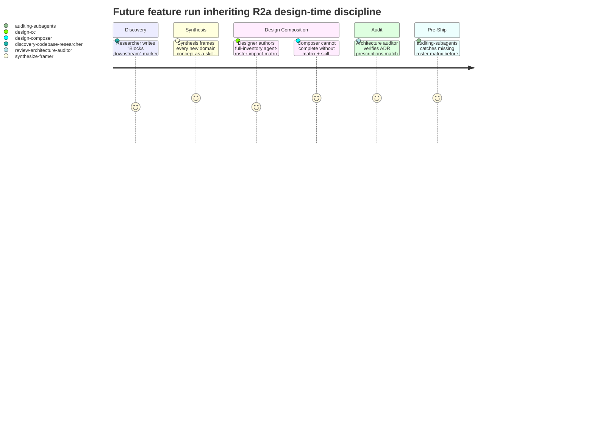
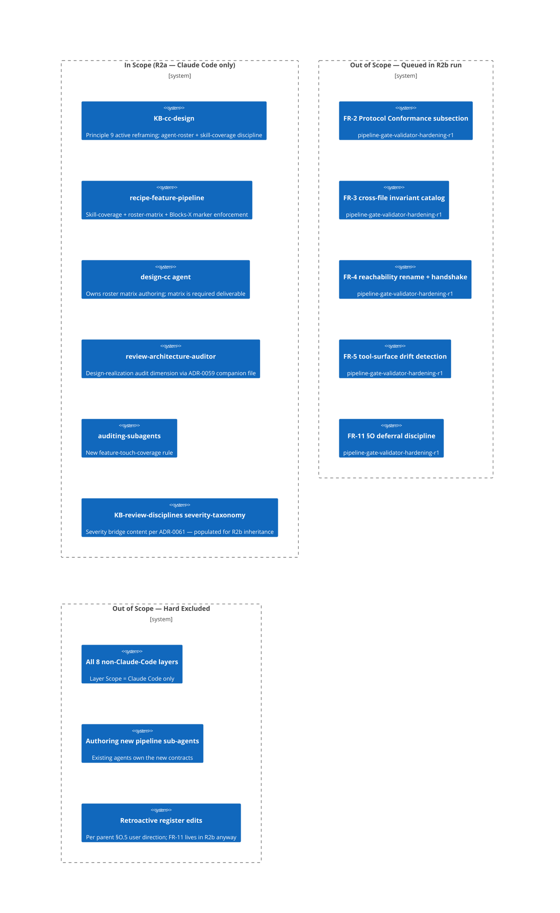

# PRD: Pipeline Design-Time Discipline (R2a)

## Contents

Section completion checklist — each box must be checked (including `N/A — out of scope` rows) before this document leaves draft. The reviewer's Gate 0 check uses this list as the structural-presence anchor.

- [x] Overview
- [x] Stakeholders
- [x] User Stories
- [x] Functional Requirements
- [x] Non-Functional Requirements
- [x] Product Policy Decisions
- [x] Success Criteria
- [x] Technical Considerations
- [x] Rollout Plan
- [x] Undetermined Items
- [x] Appendix
- [x] Changelog

## Overview

### One-line Summary

Ship the design-time-discipline half of the parent R2 split — six mechanisms (FR-1, FR-6, FR-7, FR-8, FR-9, FR-10) that move per-agent design evaluation and ADR design-realization audit from aspiration to structural prevention, inheriting ADR-0059 / ADR-0061 / ADR-0063 from the terminated parent run.

### Background

Two recent failures share a structural shape. In one, Phase 1 of `issue-capture-mechanism-r1` produced a structural spec whose §7 ID-derivation rule contradicted its three sibling templates and five empirical precedents; PV-1 passed cleanly because no validator compared the spec to the templates. In the other, `devcontainer-mcp-provisioning-r1` shipped a configuration where five of seven MCP servers were broken because no auditor compared ADR-0041's prescribed invocations against the eventual `.mcp.json` and `postCreate.sh` files. The first defect was caught by human post-phase review; the second shipped and required forensic recovery.

A separate but converging analysis (`Issues/per-agent-design-evaluation-gap/analysis.md`) traced the same `devcontainer-mcp-provisioning-r1` run and found a parallel structural defect on the design-time side: the pipeline iterated the *changed* agent surface (8 of 36 agents got the new MCP tools) without ever enumerating the full inventory to confirm the other 28 should not change. The gap was caught at Gate 4 by the user. A retroactive sweep happened to confirm the supply-driven set, but no pipeline mechanism would have surfaced a wrong answer if the set had been incomplete.

The unifying thesis, in the user's words from the parent brief: *"the pipeline must verify relationships across artifacts, not just per-artifact correctness — cancels the structural defect-class behind r1's shipment and the recurrence risk every agent-surface feature inherits."* This run ships the design-time mechanisms that make that thesis structural rather than aspirational.

**R2a / R2b split context.** This run is the design-time-discipline half of the parent `pipeline-cross-artifact-discipline-r1`, which was split at Gate 4 (Blueprint Approval) by user decision when the open-item count threatened the cross-artifact-audit's 4-cycle reconciliation cap. The companion gate/validator-hardening half (FR-2, FR-3, FR-4, FR-5, FR-11) is queued as `pipeline-gate-validator-hardening-r1`. See `SPLIT-RECORD.md` in the parent run's directory for the lineage and inheritability table. The five ADRs accepted in the parent run (ADR-0059, ADR-0060, ADR-0061, ADR-0062, ADR-0063) remain valid commitments; this run inherits the three relevant to its FR subset (ADR-0059, ADR-0061, ADR-0063) and reserves ADR numbers 0064-0069 for any new decisions it surfaces.

### Layer Scope

Declare which layers this feature touches. Sections under Design, Security, Test Boundaries, and Verification corresponding to unchecked layers may be marked `N/A — out of scope` without further elaboration.

- [x] **Claude Code / Project Filesystem** — KB-cc-design, recipe-feature-pipeline skill, design-cc agent, review-architecture-auditor agent, auditing-subagents skill, PV-author rubric, and KB-review-disciplines (severity-taxonomy bridge content)
- [ ] **Frontend** — N/A — out of scope (per parent brief direction)
- [ ] **Backend** — N/A — out of scope (per parent brief direction)
- [ ] **API** — N/A — out of scope (per parent brief direction)
- [ ] **Query / Data Access** — N/A — out of scope (per parent brief direction)
- [ ] **Database** — N/A — out of scope (per parent brief direction)
- [ ] **CI/CD (GitHub Actions)** — N/A — out of scope (per parent brief direction)
- [ ] **Infrastructure as Code** — N/A — out of scope (per parent brief direction)
- [ ] **Dev Environment (Codespaces / Devcontainer)** — N/A — out of scope (per parent brief direction)

**Scope class:** MINOR. Validated against the KB-documentation-criteria scope-class rubric: 6 bounded mechanisms (down from the parent's 11), three already-accepted inherited ADRs resolve the prior PRD's load-bearing OIs (OI-A1, OI-A5, the severity bridge), single layer (Claude Code only), inherited PRD scaffolding from parent prd-v2 means most of the design work is scoping rather than re-deriving. This is materially smaller than the parent FULL envelope but still exceeds the "single bounded mechanism" floor; MINOR is the correct classification.

## Stakeholders

### Stakeholder Inventory

| Stakeholder | Description | Primary Layer(s) | Relationship | Volume / Importance |
|-------------|-------------|------------------|--------------|---------------------|
| Pipeline maintainer | The user — owns the pipeline's correctness contract and authored the R2 brief; ratified the R2a/R2b split at Gate 4 of the parent run | Claude Code | Direct user / primary decision-maker | 1 (the user) — highest weight |
| Future feature authors | Anyone who runs the pipeline against a future feature that touches the agent surface, introduces a new domain concept, or relies on ADR-prescribed implementation guarantees | Claude Code | Downstream consumer of the new discipline | All future feature runs |
| Future reviewers | `review-architecture-auditor`, phase-quality reviewers, audit skills (`auditing-subagents`) — inherit new check dimensions and assertions | Claude Code | Inherits new contract | All affected review surfaces |
| Future synthesis and design composer | `synthesize-*` agents and `design-composer` — inherit the skill-coverage decision frame | Claude Code | Inherits new contract | All future runs |
| Queued R2b run | `pipeline-gate-validator-hardening-r1` — inherits the populated severity-taxonomy bridge and the FR-6 matrix-contract artifacts produced here | Claude Code | Downstream sibling run | One follow-on run |

### Primary Users

The pipeline maintainer is the primary user. Trade-off decisions between mechanism completeness and authoring burden are arbitrated in their favor.

## User Stories

The domain-specific personas below (pipeline maintainer / future feature authors / future reviewers) deliberately replace the canonical end-user / API-consumer / SRE buckets because this feature's Layer Scope is Claude Code only — there is no end-user surface, no API consumer surface, and no SRE / runtime-operator surface in scope. Every story's actor is a pipeline role, not a product role.

### Pipeline maintainer

```
As the pipeline maintainer,
I want the pipeline to refuse to ship a feature whose ADR prescriptions diverge from the eventual implementation files
So that the MCP-shipment-class defect cannot recur silently behind a green gate.
```

```
As the pipeline maintainer,
I want every feature that touches the agent surface to produce an explicit, full-inventory roster impact matrix before Design Composition can complete
So that the "28 untouched agents evaluated by absence" failure mode is structurally impossible.
```

```
As the pipeline maintainer,
I want every new domain concept a feature introduces to be paired with an explicit skill-coverage decision at Synthesis or Design
So that the W/H/A trifecta question (named existing skill, propose a new one with justification, or record "no skill warranted") fires by default and not only when I push at a gate.
```

### Future feature authors (downstream)

```
As a future feature author whose feature touches the agent surface,
I want a clear definition of what counts as "touching the agent surface" and a template/scaffold for the agent-roster-impact-matrix
So that the new mandatory artifact is mechanically authorable, not an open interpretive question per-run.
```

```
As a future feature author introducing a new domain concept,
I want the skill-coverage decision frame to be a known pipeline step with a named owner stage
So that I learn what's expected at Synthesis or Design instead of being surprised at a downstream gate.
```

### Future reviewers (downstream)

```
As `review-architecture-auditor`,
I want a documented design-realization audit dimension whose input shape is the inherited ADR-0059 `.prescriptions.yaml` companion file
So that the audit pass is machine-checkable, not subjective.
```

```
As `auditing-subagents`,
I want a rule that fires at pre-deliverable packaging when the agent-roster impact matrix is missing on a feature that touched the agent surface
So that the matrix discipline has a backstop after Design Composition's design-time block.
```

### Use Cases

1. **A future feature touches `.claude/agents/intake-prd-author.md`** to add a new MCP tool to its allowlist. The pipeline refuses to advance past Design Composition until `agent-roster-impact-matrix.md` exists, contains one row per current `.claude/agents/*.md` file, and each row carries a per-dimension evaluation (tools / skills / model / effort / prompt body) with an evidence cell.

2. **A future feature introduces a new domain concept ("rate-limit budgeting")** at Synthesis. The skill-coverage decision frame fires and requires the synthesis output to either (a) name an existing skill that covers it, (b) propose a new skill with W/H/A trifecta, or (c) record "no skill warranted" with rationale.

3. **A future ADR ships an `.prescriptions.yaml` companion file** (per inherited ADR-0059). At pre-deliverable audit, `review-architecture-auditor` compares the prescribed implementation against the eventual file and surfaces any mismatch as a blocking finding.

4. **A future discovery output contains a `Blocks <stage>` marker** using the canonical grammar set by inherited ADR-0063. The orchestrator refuses to advance past the named stage until the marker is closed (resolved / deferred / false-positive).

5. **A future feature ships an agent-surface-touching diff without authoring the roster matrix.** `auditing-subagents` (FR-10 rule) catches the missing matrix at pre-deliverable-packaging time and emits a `BLOCKER`-severity finding.

### User Journey Diagram



### Scope Boundary Diagram



## Functional Requirements

Tag each requirement with the **stakeholder** it serves and the **layer** where its acceptance is observed. All requirements below are at the Claude Code layer (the only in-scope layer). The mechanism code (H3, B1, etc.) and parent FR number is preserved for traceability against the parent's prd-v2 and the SPLIT-RECORD.

FR numbering matches the parent's prd-v2 (FR-1, FR-6, FR-7, FR-8, FR-9, FR-10) for traceability; gaps in numbering (FR-2..FR-5, FR-11) correspond to R2b-assigned mechanisms.

### Must Have (P1 - MVP)

- [ ] **FR-1 (H3) — Design-realization audit dimension on `review-architecture-auditor`** — Stakeholder: future reviewer + pipeline maintainer — Layer: Claude Code
  When an ADR in a feature run prescribes a concrete file path, argv string, environment variable, sentinel location, or other implementation-shaped artifact via an `.prescriptions.yaml` companion file (per inherited [ADR-0059](../../../adrs/ADR-0059-adr-prescriptions-companion-file.md)), `review-architecture-auditor` shall compare the prescription against the eventual file the feature ships and surface any divergence as a blocking finding. The prescription-extraction mechanism is the companion file (resolved by ADR-0059); the parent PRD's OI-A1 is closed.
  - AC-FR-1-a: When an ADR in the run's `adrs/` set has an accompanying `.prescriptions.yaml` and the eventual file diverges from a prescription, then `review-architecture-auditor` shall emit a `BLOCKER`-severity finding naming the ADR ID, the prescription, the diverging file, and the diff. (Severity vocabulary per inherited [ADR-0061](../../../adrs/ADR-0061-severity-vocabulary-bridge-table.md).)
  - AC-FR-1-b: When `review-architecture-auditor` runs and the feature's ADR set contains zero `.prescriptions.yaml` companions, the auditor shall complete without raising a design-realization finding (the new dimension shall be a no-op when there is nothing to compare).
  - AC-FR-1-c: When `review-architecture-auditor` is invoked, the system shall require the auditor's contract document to name the companion-file prescription-extraction mechanism (per ADR-0059) so that downstream authors can produce ADRs the auditor can mechanically inspect.

- [ ] **FR-6 (B1) — Mandatory `agent-roster-impact-matrix.md` artifact when a feature touches the agent surface** — Stakeholder: future feature author + pipeline maintainer — Layer: Claude Code
  When a feature's diff (proposed or in-progress) touches the agent surface, `design-cc` shall produce a full-inventory `agent-roster-impact-matrix.md` artifact, and Design Composition shall be blocked from completing until the artifact exists, contains one row per current `.claude/agents/*.md` file, and each row carries a per-dimension evaluation (tools / skills / model / effort / prompt body) with an evidence cell.

  **Trigger condition:** A feature is deemed to "touch the agent surface" if any of the following hold during the feature run:
  1. The feature's diff modifies, creates, or removes any file under `.claude/agents/*.md`.
  2. The feature's diff modifies `.mcp.json` in a way that adds, removes, or changes the tool surface of any MCP server already allowlisted to one or more agents.
  3. The feature's diff creates a new skill (`.claude/skills/<name>/SKILL.md`) that the feature's design indicates one or more existing agents will load.
  4. The feature's design or PRD declares a new domain concept whose skill-coverage decision (FR-7 below) names an existing agent as a downstream consumer.

  Triggers 2–4 are deliberately broad — the analysis (`per-agent-design-evaluation-gap` §2) treats the gap as a four-dimension pattern.

  **Per-agent-evidence cell granularity (default per this PRD):** Each cell shall carry a **structural value plus a short positive-evidence string** (e.g., `no-change — no responsibility intersect with feature scope (verified against agent prompt body and tools list)`). A bare `no change` without an evidence string is insufficient. Design Composition MAY revise this default with rationale in the Blueprint.

  **Dimension count phrasing (resolving IC OI-9):** Five dimensions explicit — tools, skills, model, effort, prompt body. The parent's "four-with-prompt-body folded in" phrasing is normalized to five-explicit here. Rationale: explicit enumeration is easier to grep and produces less interpretive variance than a folded count.

  - AC-FR-6-a: When a feature's diff satisfies any of the four trigger conditions above, the system shall require `design-cc` to author `working/feature/<slug>/agent-roster-impact-matrix.md` before Design Composition can mark its stage complete.
  - AC-FR-6-b: When `agent-roster-impact-matrix.md` is authored, the system shall require its row count to equal the count of files matching `.claude/agents/*.md` at the time of authoring, and require each row to carry one cell per dimension (tools / skills / model / effort / prompt body), and each cell to contain a value plus a positive-evidence string.
  - AC-FR-6-c: If the row count diverges from the `.claude/agents/*.md` file count, then Design Composition shall be blocked and the divergence shall be surfaced as a `BLOCKER`-severity finding.
  - AC-FR-6-d: If any cell contains a bare `no change` (or equivalent) without a positive-evidence string, then `design-cc` shall be required to revise that cell before Design Composition can mark its stage complete.

- [ ] **FR-7 (B3) — Skill-coverage check at Synthesis / Design for new domain concepts** — Stakeholder: future synthesis agent + future feature author — Layer: Claude Code
  When a feature introduces one or more new domain concepts (identified at Synthesis or in the Blueprint as concepts not previously named in the project's KB / skill inventory), the synthesis or design composition stage shall produce a skill-coverage decision for each such concept. The decision shall be one of: (a) name the existing skill that covers it, (b) propose a new skill with W/H/A trifecta justification (Why this skill exists / How agents use it / Anti-patterns to avoid), or (c) record "no skill warranted" with explicit rationale. Per inherited parent synthesis decision D-8 (substance heuristic), the check enforces substance over form — a decision row is satisfactory iff its justification cell can be read as actually answering the W/H/A questions, not merely populating the cells.
  - AC-FR-7-a: When the feature's synthesis or Blueprint enumerates one or more new domain concepts, then the synthesis or design composition output shall include a Skill-Coverage Decisions section with one decision row per concept.
  - AC-FR-7-b: If a Skill-Coverage decision row is missing the required justification (an existing-skill name; or a W/H/A trifecta for a proposed skill; or a rationale for "no skill warranted"), then the design composition stage shall be blocked until the row is filled.
  - AC-FR-7-c: When the decision proposes a new skill, then the W/H/A trifecta shall name the skill's purpose (Why), at least one downstream agent or stage that loads it (How), and at least one anti-pattern the skill prevents (Anti-patterns).

- [ ] **FR-8 (B2) — Strengthen KB-cc-design Principle 9 from defensive to active** — Stakeholder: future feature author + future reviewer — Layer: Claude Code
  The wording of KB-cc-design Principle 9 shall be updated from a defensive framing ("don't change `model:` / `effort:` / `skills:` lightly") to an active framing that requires designers, for each agent on the touched surface, to record the consideration performed even when the outcome is no change.
  - AC-FR-8-a: When KB-cc-design Principle 9 is consulted by `design-cc` during a feature that touches the agent surface, then the principle's text shall require recording per-agent consideration as a positive evidence string, not merely asserting "no change."
  - AC-FR-8-b: When `design-cc` consults Principle 9 AND begins authoring the FR-6 roster matrix in the same feature run, then the system shall require the wording of Principle 9 and the FR-6 cell-discipline text to be cross-referenced (each citing the other by name) so that designers do not encounter contradictory guidance.

- [ ] **FR-9 (B4) — Enforce "Blocks downstream" markers from Discovery as stage-transition gates** — Stakeholder: future reviewer + future feature author — Layer: Claude Code
  When the discovery research stage produces an output containing a marker of the form `Blocks <stage>` (per the canonical grammar in inherited [ADR-0063](../../../adrs/ADR-0063-blocks-x-marker-grammar.md)), the orchestrator shall refuse to advance past the named stage until the marker is closed (resolved with rationale, deferred with explicit OI-N, or marked false-positive with rationale). The marker grammar is resolved by ADR-0063; the parent PRD's OI-A5 is closed.
  - AC-FR-9-a: When discovery research output contains one or more `Blocks <stage>` markers (per the ADR-0063 grammar), the orchestrator shall enumerate them and shall NOT mark the named stage complete until each marker has been transitioned to `resolved`, `deferred-with-OI`, or `false-positive`.
  - AC-FR-9-b: If the orchestrator detects an unresolved `Blocks <stage>` marker at a stage-transition checkpoint, then it shall emit a `BLOCKER`-severity finding and halt advance.
  - AC-FR-9-c: The system shall record the transition rationale (resolved / deferred / false-positive) in the run's state-transitions log so that downstream stages can read the closure.

- [ ] **FR-10 (B5) — `auditing-subagents` feature-touch-coverage rule** — Stakeholder: future reviewer + pipeline maintainer — Layer: Claude Code
  The `auditing-subagents` skill shall include a new audit rule that, when a feature's working directory indicates the feature touched the agent surface (per FR-6's trigger conditions), verifies the presence of `agent-roster-impact-matrix.md` and that its row count equals the current `.claude/agents/*.md` file count. The rule fires at pre-deliverable-packaging time as a backstop to FR-6's design-time block.

  **Reverse-check posture (carried from parent OI-A3, mirrored from IC OI-7):** Whether `auditing-skills` gets a parallel reverse-check (when a new skill is authored, audit whether existing agents' `skills:` arrays should include it) is **carried as an Open Question for this run's Blueprint** rather than folded into the FR-10 scope. Rationale: FR-10's primary purpose is roster-matrix-presence enforcement; bolting a skills reverse-check onto the same rule conflates two distinct audit dimensions.

  - AC-FR-10-a: When `auditing-subagents` runs at pre-deliverable-packaging time on a feature whose working directory indicates the agent surface was touched, the system shall verify the presence of `agent-roster-impact-matrix.md` in the working directory and emit a `BLOCKER`-severity finding if the file is missing.
  - AC-FR-10-b: When the roster matrix is present, the system shall verify that its row count equals the current count of `.claude/agents/*.md` files at audit time and emit a `BLOCKER`-severity finding on mismatch.
  - AC-FR-10-c: When `auditing-subagents` runs on a feature whose working directory indicates the agent surface was NOT touched, the system shall NOT require the roster matrix and shall NOT emit a finding for its absence.

### Should Have (P2)

(none for this run — the 6 mechanisms are the brief's committed set for R2a; deferring any would defeat the half-of-split contract.)

### Could Have (P3)

(none for this run.)

### Won't Have (this release)

- **FR-2 (H6) Protocol Conformance subsection, FR-3 (H9) cross-file invariant catalog, FR-4 (H1) reachability rename, FR-5 (H8) tool-surface drift, FR-11 (§O) deferral discipline** — explicitly assigned to the queued `pipeline-gate-validator-hardening-r1` run per SPLIT-RECORD. This run does not duplicate or pre-empt their work.
- **Re-authoring the inherited ADRs (0059, 0061, 0063)** — accepted in the parent run; this run cites them.
- **Authoring new pipeline sub-agents** for any of the mechanisms — per `per-agent-design-evaluation-gap` §6.3 non-recommendation; existing agents own the new contracts.
- **Retroactive register edits to the parent's `devcontainer-mcp-provisioning-r1-deferrals` register §O rows** — those belong to R2b's FR-11; this run does not touch them.
- **Any non-Claude-Code layer.** All 8 other layers explicitly out of scope.
- **Cross-run state-transition coordination with the queued R2b run.** The R2b run is a separate pipeline invocation; this run does not gate on it.

## Non-Functional Requirements

The NFRs below are inherited near-verbatim from the parent prd-v2 — only the NFRs that bear on R2a's FR subset are retained. The parent's NFR-2/3/4/5/6 (scoped to FR-4/5's reachability handshake and drift detection) move to the queued R2b run.

### Performance

- **NFR-1 (auditor performance budget — design-realization audit, FR-1)** — `review-architecture-auditor`'s new design-realization audit pass shall complete within **5000 ms** for a feature run with up to 20 ADR prescriptions to compare against eventual files. Rationale: 5000 ms is the auditor performance budget propagated from prior PRDs (NFR-2 in the `devcontainer-mcp-provisioning-r1` PRD-v3); this PRD preserves that budget so the auditor's total wall-clock at Gate 5 does not regress. (Inherited verbatim from parent prd-v2 NFR-1.)
  - AC-NFR-1-a: When `review-architecture-auditor` runs its design-realization pass on a feature with up to 20 ADR prescriptions, the system shall complete the pass within 5000 ms wall-clock.

### Scalability

- **NFR-7 (matrix authoring-time budget — FR-6)** — The roster-matrix authoring discipline shall remain mechanically authorable such that **matrix authoring time per feature stays under 30 minutes wall-clock at a 100-agent inventory** (current inventory ~37 verified at IC time; headroom for growth). Rationale: the matrix is one row per agent; the burden is roughly linear. At 100 agents the matrix is ~500 cells; a 30-minute budget gives ~3.6 seconds per cell which is consistent with the positive-evidence-string discipline. If this budget is exceeded in operational use, the FR-6 cell-granularity (currently positive-evidence-required) is the first dial to relax. (Inherited verbatim from parent prd-v2 NFR-7.)
  - AC-NFR-7-a: When `design-cc` authors `agent-roster-impact-matrix.md` against a 100-agent inventory in operational use, the system shall measure authoring wall-clock (matrix file's first-write to last-write timestamps in the run state log) and the elapsed time shall remain under 30 minutes.

### Operability

- **NFR-8 (clear failure messages)** — Every blocking finding emitted by FR-1, FR-6, FR-9, FR-10 shall name (i) the rule that fired, (ii) the file or artifact that triggered it, (iii) the specific divergence or missing element, and (iv) the concrete next action to close. Rationale: silent failures and vague messages are the recurrence mode behind the MCP shipment; the user named this in the parent brief authoring context as the EARS-discipline calibration point. (Inherited from parent prd-v2 NFR-8, with the FR list narrowed to R2a's mechanisms.)
  - AC-NFR-8-a: When any of FR-1, FR-6, FR-9, FR-10 emits a blocking finding, the system shall include in the finding a `rule`, `target`, `divergence`, and `next_action` field, each populated with concrete content (not a placeholder).

### Developer Experience (Claude Code)

- **NFR-9 (agent-driven workflow support — grep-checkable affordance referencing)** — All new authoring affordances (roster-matrix scaffold; Skill-Coverage Decisions section template) shall be referenced from at least one skill or template that is named in the consuming agent's frontmatter `skills:` list (or, for affordances delivered as discipline-text sections, from a KB skill the agent already loads). No new sub-agent shall be introduced. This predicate is grep-checkable: for each new affordance, there must exist at least one skill path in some `.claude/agents/<consuming-agent>.md` frontmatter `skills:` array whose `SKILL.md` (or referenced `references/*.md`) contains the affordance. (Inherited from parent prd-v2 NFR-9, with the affordance list narrowed to R2a's deliverables — §Protocol Conformance scaffold and cross-file invariant prompt move to R2b.)
  - AC-NFR-9-a: When this feature ships, the system shall ensure that for each new affordance (roster-matrix scaffold; Skill-Coverage Decisions section template), at least one skill or template referenced from the consuming agent's frontmatter `skills:` list contains the affordance — verifiable by grepping the consuming agent's `skills:` entries and confirming the affordance appears in one of the referenced files.

## Product Policy Decisions

This section captures cross-cutting product-level decisions that ripple across artifacts. Each policy here is a deliberate commitment, distinct from implementation choice. Rows are inherited from parent prd-v2 where they bear on R2a's FRs; rows scoped to R2b-only mechanisms are dropped.

| Policy Area | Decision | Rationale | Affected Layers |
|-------------|----------|-----------|-----------------|
| Agent surface "touch" definition (FR-6 trigger) | Four explicit conditions: agent file diff, `.mcp.json` tool-surface diff, new skill loaded by existing agents, or new-domain-concept skill-coverage decision naming an agent | The analysis (`per-agent-design-evaluation-gap` §2) frames the gap as a four-dimension pattern; a narrow tools-only trigger would replay the same defect on the skills / model / effort dimensions | Claude Code |
| Per-agent-evidence-cell granularity (FR-6 cell discipline) | Structural value PLUS positive-evidence string (bare `no change` insufficient); Blueprint may revise with rationale | The defensive-vs-active distinction is the load-bearing one (B2 thesis); bare-value cells re-create the passive posture | Claude Code |
| FR-6 dimension count phrasing (resolving IC OI-9) | Five dimensions explicit (tools, skills, model, effort, prompt body); parent's "four-with-prompt-body folded in" normalized to five-explicit | Explicit enumeration is grep-friendlier and reduces interpretive variance across runs | Claude Code |
| `auditing-skills` reverse-check | Carried as Blueprint Open Question, NOT folded into FR-10's scope | Conflating roster-matrix-presence enforcement with skills-array reverse-checks blurs two distinct audit dimensions | Claude Code |
| FR-1 prescription-extraction mechanism | Resolved by inherited ADR-0059 (companion `.prescriptions.yaml` file). No PRD-level open item; closure recorded in Inheritance Manifest | The parent's PRD OI-A1 carried this; ADR-0059 closed it. Re-opening would be redundant | Claude Code |
| FR-9 Blocks-X marker grammar | Resolved by inherited ADR-0063 (canonical grammar). No PRD-level open item; closure recorded in Inheritance Manifest | The parent's PRD OI-A5 carried this; ADR-0063 closed it | Claude Code |
| FR-7 substance vs mandate | Substance-over-mandate per inherited parent synthesis D-8 — decision rows are satisfactory iff their justification actually answers W/H/A, not merely populates cells | Cell-stuffing is the failure mode B3 is designed to prevent; mandating substance vs. form is the lever | Claude Code |
| New sub-agent prohibition | No new pipeline sub-agents for any of the 6 mechanisms | Per `per-agent-design-evaluation-gap` §6.3 non-recommendation; existing agents own the new contracts; preserves orchestrator topology | Claude Code |
| Eat-own-dogfood discipline | This run produces its own `agent-roster-impact-matrix.md` AND explicit FR-7 skill-coverage decisions for the 6 new domain concepts it introduces | The run both establishes and exercises the FR-6/FR-7 contracts; producing the artifacts validates the contracts on a real run before they're imposed on future authors | Claude Code |

## Success Criteria

### Quantitative Metrics

| Metric | Stakeholder | Target | Measurement Method | Timeframe |
|--------|-------------|--------|--------------------|-----------|
| Recurrence of the design-realization-gap defect class | Pipeline maintainer | Zero across the next N feature runs that touch any ADR-prescribed artifact (N ≥ 3) | Each run's `review-architecture-auditor` output; presence/absence of `BLOCKER` findings matched to subsequent shipment incidents | Across the next ~3 feature runs post-ship |
| Presence of `agent-roster-impact-matrix.md` on every agent-surface-touching feature | Pipeline maintainer | 100% (every such feature has the artifact at Design Composition close) | `auditing-subagents` audit run; FR-10 fires on miss | Every applicable run |
| Skill-coverage decisions recorded per new domain concept | Pipeline maintainer | 100% of new domain concepts have a recorded decision (existing skill / proposed new / no-skill rationale) | Synthesis or Blueprint output inspection; FR-7 fires on miss | Every applicable run |
| Eat-own-dogfood compliance for this run | Pipeline maintainer | This run produces its own roster matrix and a skill-coverage decision for each of the 6 new domain concepts | Inspection of `working/feature/pipeline-design-time-discipline-r1/` at deliverable packaging | This run's own deliverable archive |
| R2b unblocking via severity-taxonomy bridge | Pipeline maintainer + R2b | Bridge table content authored at `KB-review-disciplines/references/severity-taxonomy.md` and cited by ADR-0061 before this run's deliverable archive seals | Inspection of the bridge file; cross-link from ADR-0061 | This run's deliverable packaging |

### Qualitative Metrics

1. **Pipeline maintainer's confidence delta** — the user can answer "did the pipeline rule out the design-time-discipline-gap incidents this run?" with evidence (the auditor output + the matrix + the skill-coverage decisions) rather than inference.
2. **Future feature author's onboarding shape** — a new contributor can discover the new affordances (matrix scaffold, skill-coverage frame, canonical Blocks-X grammar) from the agent workflow they already use.

### Developer Experience Metrics (Claude Code in scope)

1. **Authoring burden per feature** — for a feature that touches the agent surface and introduces one new domain concept, the new artifacts (roster matrix + skill-coverage decisions) shall be authorable within the run's existing time envelope without requiring a new stage.
2. **Number of orchestrator-recognized stage-transition gates added** — exactly 2 (FR-6 design composition block; FR-9 Blocks-X enforcement). No other new stage-transition gates are introduced; the existing topology is preserved.

## Technical Considerations

### Dependencies

- **Existing systems we depend on:**
  - `review-architecture-auditor` — must accept a new audit dimension without restructure (FR-1)
  - `auditing-subagents` skill — must accept a new audit rule (FR-10)
  - `design-cc` agent — must author the new mandatory artifact (FR-6)
  - `synthesize-*` agents and `design-composer` — must produce the Skill-Coverage Decisions section (FR-7)
  - KB-cc-design — must absorb the strengthened Principle 9 (FR-8) and reference the new agent-surface-touch definition (FR-6)
  - `recipe-feature-pipeline` skill — must reference the new affordances
  - orchestrator state-transitions logging — must accept Blocks-X marker transitions (FR-9)
  - `KB-review-disciplines/references/severity-taxonomy.md` — receives the severity-vocabulary bridge content (closing parent D-10 via inherited ADR-0061)

- **Inherited ADRs:**
  - [ADR-0059](../../../adrs/ADR-0059-adr-prescriptions-companion-file.md) — Companion-file `.prescriptions.yaml` schema; closes FR-1 prescription-extraction question (parent PRD OI-A1).
  - [ADR-0061](../../../adrs/ADR-0061-severity-vocabulary-bridge-table.md) — Severity-vocabulary bridge table host; cross-cutting with R2b (FR-1, FR-9, FR-10 here; FR-4, FR-5 in R2b).
  - [ADR-0063](../../../adrs/ADR-0063-blocks-x-marker-grammar.md) — Blocks-X marker grammar canonicalization; closes FR-9 grammar question (parent PRD OI-A5).

- **Upstream features that must ship first:** None. ADRs 0059/0061/0063 are already accepted in the parent run.

- **Downstream consumers affected by this change:** Every future feature run inherits the new disciplines. The queued `pipeline-gate-validator-hardening-r1` run consumes this run's populated severity-taxonomy bridge and exercises the FR-6 matrix contract.

### Constraints

- **Technical constraints:** Claude Code layer only. No new sub-agents. No retroactive edits to the parent's deferrals register.
- **Resource constraints:** The 6 mechanisms must be authorable within the 4-cycle reconciliation cap (comfortably, given the parent's 11-mechanism cap-threat motivated the split).
- **Regulatory / contractual constraints:** None.

### Assumptions

- [ ] **A-1 — `review-architecture-auditor`'s current contract can absorb a new dimension without restructure.** Validation: Discovery-stage codebase analysis confirms the auditor's input/output schema allows additive dimensions. Owner: `discovery-codebase-researcher`. By: Discovery completion. (Inherited from parent.)
- [ ] **A-4 — Existing `.claude/agents/*.md` inventory is enumerable mechanically.** Validation: trivial — glob confirms. Owner: `design-cc`. By: Design Composition. Currently 37 agents at IC time. (Inherited from parent.)
- [ ] **A-5 (resolved by ADR-0063) — Blocks-X marker grammar is canonicalized.** The parent A-5's validation hook is replaced by the inherited ADR-0063 grammar; no further validation needed.
- [ ] **A-R2a-1 — Eat-own-dogfood deliverables are producible within this run's time envelope.** Validation: this run authors its own roster matrix (37 rows × 5 dimensions = 185 cells; ~3 minutes per NFR-7 extrapolation) and 6 skill-coverage decisions. Owner: `design-cc` + `design-composer`. By: Design Composition.

### Risks and Mitigation

| Risk | Stakeholder Affected | Impact | Probability | Mitigation |
|------|----------------------|--------|-------------|------------|
| Authoring-burden creep: roster matrix + skill-coverage combine to make every future agent-surface-touching feature meaningfully slower | Future feature author | Medium | Medium | NFR-9 requires affordances reachable from existing workflow; NFR-7's 30-minute-at-100-agents authoring-time budget is the explicit ceiling; if measured burden exceeds the budget, the FR-6 cell-granularity is the first dial to relax |
| FR-6 trigger conditions 3 and 4 require interpretive judgment and produce uneven enforcement across runs | Future feature author + future reviewer | Medium | Medium | OI-R2a-1 commissions a mechanical evaluator for trigger conditions 3 and 4 at Design Composition; until resolved, runs may rely on author judgment + reviewer second-pass |
| Eat-own-dogfood discipline reveals an unforeseen FR-6/FR-7 contract weakness on this very run, forcing in-run contract revision | Pipeline maintainer | Medium | Low–Medium | This is by design — applying the contract to its own definer is the validation event. Revision in-run is acceptable; a Blueprint OI captures any contract amendment with rationale |
| Severity-taxonomy bridge authoring at `KB-review-disciplines/references/severity-taxonomy.md` collides with concurrent edits if R2b begins before this run completes | Pipeline maintainer + R2b | Low | Low | SPLIT-RECORD's "R2a-runs-first" ordering recommendation; R2b kickoff is gated on this run's deliverable archive |

## Rollout Plan

This feature ships discipline + audit-machinery changes inside the pipeline itself. There is no end-user audience to stage; rollout is the pipeline-internal sequencing.

- **Launch audience progression:** Internal-only. The first feature run that touches the agent surface AFTER this run ships is the natural validation point. No external beta or GA.
- **Communication plan:** The feature's deliverable archive includes a one-page "What changed for future feature authors" summary referencing the 6 mechanisms by FR number. The `recipe-feature-pipeline` skill is updated to reference the new affordances so the orchestrator surfaces them at the natural stage. The deliverable archive also publishes the populated severity-taxonomy bridge for R2b inheritance.
- **Migration path:** For features already in flight when this run ships, the existing contract applies; the new disciplines apply to features whose Intent Clarification stage starts after this run's deliverable packaging.
- **Kill criteria:**
  - If, after the next agent-surface-touching feature ships, the roster matrix discipline (FR-6) demonstrably increases authoring time beyond NFR-7's 30-minute budget without preventing any detectable defect, then the FR-6 cell-granularity default (currently positive-evidence-required) is revisited.
  - If the eat-own-dogfood deliverable for this run reveals a contract weakness that this run cannot close within its 4-cycle reconciliation cap, the affected FR is re-scoped (with rationale captured as a Blueprint OI) rather than the run terminated.

  Note: All kill criteria use event-triggered framings rather than calendar-based "N days post-ship" triggers (anticipating the FR-11 §O posture that the queued R2b run will codify).

## Undetermined Items

Items deferred from the Intent Clarification's Open Items list and items newly surfaced by this PRD. Each item has an owner stage and a forward pointer. The parent's OI-A1 (FR-1 extraction mechanism) and OI-A5 (Blocks-X grammar) are closed by inherited ADR-0059 and ADR-0063 respectively and do not appear here.

- [ ] **OI-R2a-1 (mirrors parent OI-A6) — Mechanical evaluator for FR-6 trigger conditions 3 and 4.** Trigger 3 ("new skill that the feature's design indicates one or more existing agents will load") and trigger 4 ("new domain concept whose skill-coverage decision names an existing agent as a downstream consumer") both require an interpretive read of design / skill-coverage text rather than a pure file-diff check. Whether the trigger evaluation is performed by a deterministic predicate over the Blueprint's Skill-Coverage Decisions table (preferred) or remains a designer-judgment call with a reviewer second-pass needs to be settled so that the trigger fires consistently across runs. **Owner:** Design Composition. **Needed by:** Design Composition completion.

- [ ] **OI-R2a-2 (mirrors parent OI-A3, mirrors IC OI-7) — `auditing-skills` reverse-check.** Whether `auditing-skills` gets a reverse-check parallel to FR-10's rule (when a new skill is authored, audit whether existing agents' `skills:` arrays should include it). Carried as Blueprint Open Question rather than folded into FR-10's scope. **Owner:** Design Composition (Blueprint phase). **Needed by:** Blueprint completion.

- [ ] **OI-R2a-3 (from IC OI-7) — FR-9 marker-parser realization location.** Whether the FR-9 Blocks-X grammar's parser/regex implementation lives in the `review-architecture-auditor` agent prompt, in a shared parsing helper under `.claude/skills/`, or in the auditing rule itself. ADR-0063 sets the grammar; the realization location is a Design-time call. **Owner:** Design Composition. **Needed by:** Design Composition completion.

- [ ] **OI-R2a-4 (from IC OI-8) — FR-7 artifact location.** Whether FR-7's skill-coverage decision check produces a standalone artifact (e.g., `skill-coverage-decisions.md`) or appends as a section to existing synthesis/design documents (with synthesis surfacing candidates and design recording the trifecta resolution). Per the inherited D-8 substance heuristic, the location is secondary to the substance; this OI resolves the file-layout question. **Owner:** Design Composition. **Needed by:** Design Composition completion.

- [ ] **OI-R2a-5 (from IC OI-8 / parent FR-10 carry-forward) — Realization of the FR-10 audit rule.** Whether the FR-10 `auditing-subagents` rule is added as a new rule entry or extends an existing rule's predicate. **Owner:** Design Composition. **Needed by:** Design Composition completion.

- [ ] **OI-R2a-6 (from IC OI-8) — Sequencing of the severity-taxonomy bridge authoring vs. FR-1/9/10 sections that consume it.** Plan-stage sequencing decision. **Owner:** Plan authoring. **Needed by:** Plan completion.

### Cross-Run Context (forward reference)

The queued `pipeline-gate-validator-hardening-r1` run (R2b) ships FR-2, FR-3, FR-4, FR-5, FR-11 and inherits this run's populated severity-taxonomy bridge content + the FR-6 matrix-contract this run establishes (which R2b will exercise on its own agent-touching diff). R2b is **not a blocking dependency** from this run's direction — this run completes its 13-stage pipeline without gating on R2b. The SPLIT-RECORD captures the lineage for archeological reading.

## Appendix

### Inheritance Manifest

This subsection names each inherited artifact and what each parent-resolved decision means for R2a.

| Inherited artifact | Source | R2a meaning |
|---|---|---|
| Parent prd-v2.md (FR-1, FR-6, FR-7, FR-8, FR-9, FR-10 sections + ACs) | `working/feature/pipeline-cross-artifact-discipline-r1/prd-v2.md` | Inherited near-verbatim as this PRD's FRs. R2a-only adaptations: citations to ADR-0059/0063 (which close prior OIs), removal of R2b-only cross-references, dimension-count phrasing normalized to five-explicit per IC OI-9 |
| Parent prd-v2.md NFR-1, NFR-7, NFR-8, NFR-9 | Parent prd-v2 | Inherited near-verbatim; NFR-8's FR list narrowed to R2a's mechanisms; NFR-9's affordance list narrowed to R2a's deliverables |
| ADR-0059 (companion `.prescriptions.yaml` schema) | `adrs/ADR-0059-adr-prescriptions-companion-file.md` | Closes parent OI-A1 (FR-1 prescription-extraction mechanism). FR-1's contract now points at the companion file rather than naming an open OI |
| ADR-0061 (severity vocabulary bridge table) | `adrs/ADR-0061-severity-vocabulary-bridge-table.md` | Cross-cutting between R2a (FR-1, FR-9, FR-10) and R2b (FR-4, FR-5). This run authors the bridge content at `KB-review-disciplines/references/severity-taxonomy.md` per SPLIT-RECORD's R2a-runs-first ordering |
| ADR-0063 (Blocks-X marker grammar) | `adrs/ADR-0063-blocks-x-marker-grammar.md` | Closes parent OI-A5 (Blocks-X grammar). FR-9's contract now points at the canonical grammar |
| Parent synthesis decisions D-1, D-3, D-4, D-5, D-8 | `working/feature/pipeline-cross-artifact-discipline-r1/synthesis.md` | Inherited as resolved synthesis decisions. D-1 → ADR-0059 (companion file). D-4 → ADR-0063 (Blocks-X grammar). D-3 → OI-R2a-2 (reverse-check carried as Blueprint OQ). D-5 → OI-R2a-1 (trigger 3/4 mechanical evaluator). D-8 → FR-7 substance heuristic |
| Parent codebase-analysis.json + report.md | Parent run | Full inheritance per SPLIT-RECORD; this run's Discovery layers on only what FR-1/6/7/8/9/10 specifically need |
| Stakeholder Inventory, Primary Users, Layer Scope = Claude Code only | Parent prd-v2 | Inherited verbatim with minor extension (R2b queued run added as a downstream stakeholder) |

### Eat-Own-Dogfood Deliverables

The IC names two artifacts this run produces to exercise its own contracts; these are recorded here as PRD-level deliverable commitments (their concrete file paths land in the Plan and Task Decomposition stages):

1. **This run's `agent-roster-impact-matrix.md`** — produced under `working/feature/pipeline-design-time-discipline-r1/` exercising the FR-6 contract on this run's own agent-touching diff (the FR-10 audit rule modifies `.claude/agents/` consumers and `.claude/skills/auditing-subagents/`; FR-1/6/7/8 modify `.claude/agents/review-architecture-auditor.md`, `design-cc.md`, `design-composer.md`, `synthesize-*.md`; FR-8 modifies KB-cc-design Principle 9 text which is loaded by `design-cc`). Trigger conditions 1 and 4 fire.
2. **Six FR-7 skill-coverage decisions** — one for each new domain concept this run introduces: (a) design-realization audit; (b) agent-roster impact matrix; (c) skill-coverage decision check; (d) Principle 9 active reframing; (e) Blocks-X marker grammar; (f) agent-roster matrix-missing audit rule. Per the inherited D-8 substance heuristic, each decision's justification cell must actually answer the W/H/A questions.

### References

- `working/feature/pipeline-design-time-discipline-r1/intent-clarification.md` — the approved IC this PRD derives from
- `working/feature/pipeline-cross-artifact-discipline-r1/prd-v2.md` — the parent prd-v2 scaffold this PRD slims down from
- `working/feature/pipeline-cross-artifact-discipline-r1/SPLIT-RECORD.md` — the authoritative split lineage and inheritability table
- `working/feature/pipeline-cross-artifact-discipline-r1/synthesis.md` — parent synthesis (decisions D-1, D-3, D-4, D-5, D-8 inherited)
- `working/feature/pipeline-cross-artifact-discipline-r1/codebase-analysis-report.md` — parent codebase analysis (full inheritance)
- [ADR-0059](../../../adrs/ADR-0059-adr-prescriptions-companion-file.md) — Companion-file `.prescriptions.yaml` schema (inherited; closes FR-1 extraction mechanism)
- [ADR-0061](../../../adrs/ADR-0061-severity-vocabulary-bridge-table.md) — Severity-vocabulary bridge table host (inherited; cross-cutting with R2b)
- [ADR-0063](../../../adrs/ADR-0063-blocks-x-marker-grammar.md) — Blocks-X marker grammar canonicalization (inherited; closes FR-9 grammar)
- `Issues/per-agent-design-evaluation-gap/analysis.md` — source for B1 (FR-6), B2 (FR-8), B3 (FR-7), B4 (FR-9), B5 (FR-10)
- `Issues/cross-artifact-divergence-detection-gap/analysis.md` — source for H3 (FR-1)
- `.claude/skills/KB-cc-design/references/principles.md` — Principle 9 (target of FR-8)
- `.claude/skills/KB-documentation-criteria/references/templates/prd-template.md` — the canonical PRD template this document conforms to
- `.claude/skills/KB-documentation-criteria/references/disciplines/ears-acceptance-criteria.md` — EARS discipline applied to every AC
- `.claude/skills/KB-documentation-criteria/references/layer-taxonomy.md` — the 9-layer taxonomy used by Layer Scope

### Glossary

- **Agent surface** — the union of `.claude/agents/*.md` files plus the `.mcp.json` tool surface they consume plus the skills they load. A feature "touches the agent surface" per FR-6's four-condition trigger.
- **Cross-artifact verification** — verification that two or more shipped artifacts agree on a shared claim (e.g., an ADR prescription and the file that implements it).
- **Design-realization audit** — the new audit dimension on `review-architecture-auditor` (FR-1) that performs cross-artifact verification between ADRs and their implementations via the `.prescriptions.yaml` companion file per ADR-0059.
- **Demand-driven (vs. supply-driven) design** — design that iterates the full inventory of an affected surface (every agent, every skill) and records per-item evaluation, vs. design that iterates the changed subset and treats unchanged items by absence. The `per-agent-design-evaluation-gap` analysis is a critique of supply-driven design at the agent surface.
- **Prescription** — an ADR's concrete naming of a file path, argv string, environment variable, sentinel location, or other implementation-shaped artifact, captured in a companion `.prescriptions.yaml` per ADR-0059.
- **Skill-coverage decision** — the decision frame (FR-7) at Synthesis or Design Composition for each new domain concept the feature introduces: name an existing skill, propose a new one with W/H/A trifecta, or record "no skill warranted."
- **W/H/A trifecta** — Why (the skill's purpose), How (which agents or stages load it), Anti-patterns (what the skill prevents). The standard justification shape for a proposed new skill.
- **Blocks-X marker** — a phrase of the form `Blocks <stage>` (per inherited ADR-0063's canonical grammar) that a discovery researcher writes to signal a question whose answer is required before the named stage can complete. FR-9 makes these markers actual gates.
- **Eat-own-dogfood** — the discipline of applying a contract to the very run that establishes it. This run produces its own `agent-roster-impact-matrix.md` (FR-6) and its own skill-coverage decisions for the 6 new concepts it introduces (FR-7).
- **R2a / R2b** — the parent run's R2a/R2b split. This run is R2a (design-time discipline: FR-1, FR-6, FR-7, FR-8, FR-9, FR-10). The queued R2b run is `pipeline-gate-validator-hardening-r1` (FR-2, FR-3, FR-4, FR-5, FR-11).

## Changelog

- **v1.0.0 (2026-05-26)** — Initial PRD draft for the R2a follow-up run, derived from the approved Intent Clarification and inherited near-verbatim from parent prd-v2 (FR-1, FR-6, FR-7, FR-8, FR-9, FR-10 sections + ACs; NFR-1, NFR-7, NFR-8, NFR-9; Stakeholder Inventory; Layer Scope = Claude Code only; Glossary). R2a-specific changes vs the parent scaffold:
  - Frontmatter: new `id` (`PRD-pipeline-design-time-discipline-r1`), `version: 1.0.0`, `scope_class: MINOR`, `predecessor: working/feature/pipeline-cross-artifact-discipline-r1/prd-v2.md`, `parent_run`, `related_run` (R2b queued), `inherited_adrs: [ADR-0059, ADR-0061, ADR-0063]`, `adr_range_reserved: 0064-0069`.
  - FR set narrowed from 11 to 6: FR-2, FR-3, FR-4, FR-5, FR-11 removed cleanly with no dangling cross-references (all moved to queued R2b).
  - NFRs narrowed: NFR-2 (reachability timeout), NFR-3 (drift wall-clock), NFR-4 (drift FP rate), NFR-5 (auditor idempotency for drift), NFR-6 (credential redaction) removed — all scoped to R2b-only FRs.
  - Parent PRD OI-A1 closed by inherited ADR-0059 citation in FR-1; AC-FR-1-c rewritten to reference the closure rather than name the open OI.
  - Parent PRD OI-A5 closed by inherited ADR-0063 citation in FR-9.
  - Parent FR-10 reverse-check posture (parent OI-A3) carried forward as OI-R2a-2 in this run.
  - Contingency Split section removed (the split has happened; this is one of the two halves).
  - IC OI-9 (FR-6 dimension count phrasing) resolved in Product Policy Decisions: five dimensions explicit (tools, skills, model, effort, prompt body).
  - Inheritance Manifest subsection added in Appendix naming each inherited artifact and decision.
  - Eat-Own-Dogfood Deliverables subsection added in Appendix recording PRD-level deliverable commitments (this run's own roster matrix + 6 skill-coverage decisions).
  - Cross-Run Context forward reference to R2b added under Undetermined Items.
  - Risks table narrowed to rows that bear on R2a's FR subset; one new row added for the eat-own-dogfood discipline risk.
  - Background extended with a paragraph explaining R2a is the design-time-discipline half of the parent's split.
  - R2a-specific OIs surfaced: OI-R2a-1..OI-R2a-6 (mechanical evaluator carry-forward; reverse-check carry-forward; marker-parser realization location; FR-7 artifact location; FR-10 rule realization; bridge-table sequencing).

---

*End of PRD. Awaiting `shared-document-reviewer` Gate 0 / Gate 1 review and the PRD Approval Gate.*
