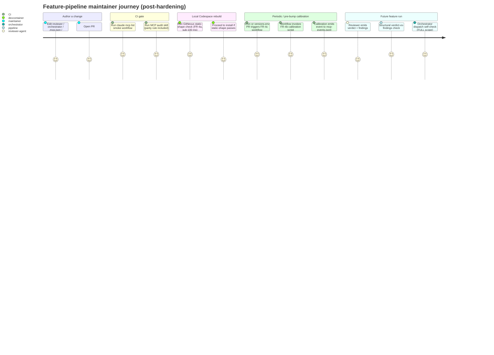
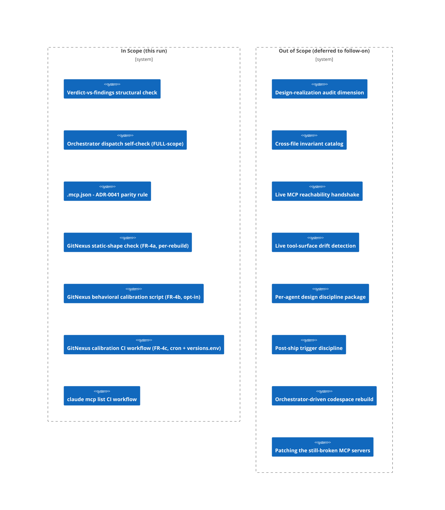

# PRD: Pipeline Quick-Wins Hardening (Round 1)

## Contents

Section completion checklist — each box must be checked (including `N/A — out of scope` rows) before this document leaves draft. The reviewer's Gate 0 check uses this list as the structural-presence anchor.

- [x] Overview
- [x] Stakeholders
- [x] User Stories
- [x] Functional Requirements
- [x] Non-Functional Requirements
- [x] Product Policy Decisions
- [x] Success Criteria
- [x] Technical Considerations
- [x] Rollout Plan
- [x] Undetermined Items
- [x] Appendix

## Overview

### One-line Summary

Close the five mechanically bounded MCP-incident exposures — reviewer verdict-vs-findings consistency, orchestrator single-agent-fallback dispatch refusal, an ADR-0041-to-`.mcp.json` parity audit rule, a GitNexus pin-tag drift detector (split into a per-rebuild static-shape check and a separately-scheduled behavioral calibration), and a CI `claude mcp list` smoke workflow — without expanding into the systemic remediation work deferred to a follow-on run.

### Background

A recent shipment of MCP server configuration shipped with five of seven servers broken in production. The postmortem (captured in the seed issue-proposal `Issues/cross-artifact-divergence-detection-gap/proposal.md`) traced the failure to a structural gap: each pipeline gate inspected its own artifact in isolation and never compared an ADR's prescription against the file that actually shipped. The full systemic remediation — a new design-realization audit dimension, a cross-file invariant catalog, live MCP reachability probes, tool-surface drift detection, per-agent design discipline, post-ship trigger discipline, and an orchestrator-driven codespace rebuild loop — is large and is deliberately deferred to a separate, later feature run.

This run is the carve-out: five low-cost, locally scoped, mechanically bounded changes that together close roughly a third of the catalogued incident defects and the single highest-risk deferral from the prior devcontainer-MCP feature's register. Each change addresses one named failure mode and is exercisable end-to-end without depending on any of the other four. The deferral-register rows H-4 (GitNexus install smoke) and B-1 (CI `claude mcp list` smoke) are closed by this feature.

In v0.3.0, FR-4 (the GitNexus pin-tag drift detector) is internally subdivided into three sub-mechanisms (FR-4a static-shape per-rebuild, FR-4b behavioral calibration script, FR-4c CI wiring of the calibration) to reflect the user-direction insight that per-rebuild and behavioral are different questions on different cadences. The feature still ships five mechanisms; FR-4's internal structure is more honest about cadence but the bounded scope (and the MINOR scope class) is unchanged.

### Layer Scope

Declare which layers this feature touches. Sections under Design, Security, Test Boundaries, and Verification corresponding to unchecked layers may be marked `N/A — out of scope` without further elaboration.

- [x] **Claude Code / Project Filesystem** — CLAUDE.md, slash commands, hooks, skills, MCP configuration, project conventions
- [ ] **Frontend** — UI components, client state, routing, styling
- [ ] **Backend** — services, domain logic, background jobs, schedulers
- [ ] **API** — HTTP/GraphQL/RPC endpoints, contracts, versioning
- [ ] **Query / Data Access** — ORM models, repositories, query layer, caching
- [ ] **Database** — schema, migrations, indexes, constraints, seed data
- [x] **CI/CD (GitHub Actions)** — workflows, jobs, reusable actions, environments, secrets
- [ ] **Infrastructure as Code** — Terraform/Pulumi/CDK/CloudFormation modules, state, providers
- [x] **Dev Environment (Codespaces / Devcontainer)** — devcontainer.json, prebuilds, ports, lifecycle scripts

The Claude Code layer is checked because four of the five mechanisms live in the project's agent and audit machinery: the reviewer output-shape validator extends an existing reviewer's discipline, the orchestrator's dispatch self-check lives in the orchestrator agent or an adjacent hook, the new MCP audit rule lives in the `auditing-mcp` skill, and the deferral-register update touches an `Issues/` artifact. The CI/CD layer is checked because the fifth mechanism is a brand-new GitHub Actions workflow. The Codespaces / Devcontainer layer is checked because the GitNexus install smoke wires into the existing devcontainer post-create flow (`.devcontainer/postCreate.sh`).

The Intent Clarification enumerated two layers (Claude Code and CI/CD) and grouped the GitNexus install smoke test under Claude Code. Under the canonical 9-layer taxonomy, a devcontainer post-create script is unambiguously Codespaces / Devcontainer rather than Claude Code; this PRD reclassifies that single mechanism accordingly. The five mechanisms themselves and the eight Won't-Have exclusions are unchanged from the Intent Clarification — only the layer label on FR-4 has shifted. The remaining six layers are out of scope and their Design subsections will be marked `N/A — out of scope` at Blueprint time.

## Stakeholders

### Stakeholder Inventory

| Stakeholder | Description | Primary Layer(s) | Relationship | Volume / Importance |
|-------------|-------------|------------------|--------------|---------------------|
| Feature-pipeline maintainers | The user and any future maintainer who runs the pipeline. They own the audit machinery and feel the cost when a regression like the MCP incident reaches production. | Claude Code, CI/CD, Codespaces | Direct owner; primary user of every mechanism | Small team / high importance — this run's primary audience |
| Downstream pipeline users (future feature runs and their sub-agents) | Any future feature run whose reviewers and orchestrator will be gated by the new checks. They care that the checks are deterministic, produce diagnostics that name the offending file and rule, and do not gratuitously block legitimate work. | Claude Code | Indirect user; gated by the new checks | All future runs / load-bearing |
| Codespace users | Any contributor who rebuilds the devcontainer. They feel the install smoke test's pass/fail directly during environment setup. | Codespaces | Direct user of one mechanism | All contributors / moderate importance |
| Reviewer sub-agents (`shared-document-reviewer`, `review-architecture-auditor`, `review-cross-artifact-auditor`) | The agents whose output shapes are validated. They care that the verdict-vs-findings contract is unambiguous so they are not rejected for cosmetic format mismatches. | Claude Code | Subject of one mechanism | Three named agents / load-bearing for review pipeline |
| MCP audit skill maintainer | Whoever extends the `auditing-mcp` skill rule catalog (OP-1..OP-10 today, plus the new rule from this feature). | Claude Code | Direct owner of one mechanism | Same person as feature-pipeline maintainers / co-located |

### Primary Users

The **feature-pipeline maintainers** are the primary stakeholder. Every mechanism in this run reduces the maintainer's exposure to the failure mode that caused the MCP incident — a reviewer returning approved with blocking findings, an orchestrator silently falling back to single-agent dispatch, an ADR drifting from its realized artifact, a Codespace install silently producing a half-working environment, or a `.mcp.json` change breaking server connectivity past PR review. When trade-offs arise between strictness (more aggressive blocking) and ergonomics (fewer false positives), the maintainer's preference for closing the named incident pattern over avoiding rare false positives is the tiebreaker.

The **downstream pipeline users** are the secondary stakeholder. They will encounter the new checks at every future run. Their experience determines whether the mechanisms stay valuable or become noise that gets disabled.

## User Stories

### Feature-pipeline Maintainer

#### US-1: Block approved-with-blockers verdicts before they propagate

**As a** feature-pipeline maintainer, **I want** any reviewer that returns an "approved" verdict alongside a blocking finding to be automatically rejected by a structural check **so that** a reviewer cannot let a broken artifact through the pipeline by returning a verdict that contradicts its own findings.

**Acceptance Criteria:**

- [ ] AC-FR-1-a: When a reviewer sub-agent emits a verdict+findings pair, the system shall apply a structural verdict-vs-findings consistency check against that output before the verdict is consumed by the orchestrator.
- [ ] AC-FR-1-b: If the reviewer's output declares an approving verdict and the findings list contains any finding whose severity is in the configured blocking-severity set, then the system shall reject the reviewer output and surface a diagnostic naming the reviewer, the verdict, and the specific offending findings.
- [ ] AC-FR-1-c: When the reviewer's output declares an approving verdict and the findings list contains no findings whose severity is in the blocking-severity set, the system shall pass the output through unchanged.

#### US-2: Refuse FULL-scope dispatch with single-agent fallback configured

**As a** feature-pipeline maintainer, **I want** the orchestrator's dispatch step to refuse to enter the loop if any stage is configured for single-agent fallback while the feature's scope class is FULL **so that** a FULL-scope feature cannot silently lose the per-layer fan-out that its risk class requires.

**Acceptance Criteria:**

- [ ] AC-FR-2-a: When the orchestrator begins dispatch for a feature whose scope class is FULL, the system shall perform a self-check that enumerates every stage's per-stage agent configuration.
- [ ] AC-FR-2-b: If the scope class is FULL and any enumerated stage is configured for single-agent fallback, then the system shall refuse to enter the dispatch loop and surface a diagnostic naming the offending stage and the configuration that triggered the refusal.
- [ ] AC-FR-2-c: Where the scope class is MINOR or PATCH, the system shall permit single-agent fallback configurations without raising a dispatch-refusal.

#### US-3: Detect ADR-0041-to-`.mcp.json` drift as a blocking audit finding

**As a** feature-pipeline maintainer, **I want** the MCP audit skill to compare each server entry in `.mcp.json` against the invocation form prescribed in ADR-0041 **so that** an MCP server cannot ship with an invocation that differs from its ADR-of-record without that drift being a blocking finding.

**Acceptance Criteria:**

- [ ] AC-FR-3-a: When the MCP audit skill is invoked against the repository, the system shall iterate every server entry in `.mcp.json` and, for each entry, locate the corresponding invocation prescription in ADR-0041.
- [ ] AC-FR-3-b: If the live `.mcp.json` entry does not match the ADR-0041-prescribed invocation form under the comparison algorithm chosen at Design, then the system shall emit a blocking finding that names the server, the live form, the prescribed form, and the diff dimension (argv, env-var indirection, sentinel path).
- [ ] AC-FR-3-c: If ADR-0041 contains no prescription for a server present in `.mcp.json` (or vice-versa), then the system shall emit a blocking finding naming the unmatched server and the side on which the prescription is missing.

#### US-4: Catch GitNexus pin-tag drift — static-shape on every rebuild, behavioral on a separate cadence

**As a** Codespace user (and as a maintainer who owns the pin), **I want** two complementary GitNexus drift checks — a sub-100 ms static-shape check on every devcontainer rebuild that catches the cheap mistakes (env var unset, tag unpinned, artifact path renamed), plus a heavier behavioral calibration check that actually runs the install with `GITNEXUS_SKIP_OPTIONAL_GRAMMARS=1` and verifies the env var is honored, but only on a separate cadence (CI cron and on changes to `versions.env`) **so that** per-rebuild cost stays within ADR-0041's 7-12 minute codespace budget while the behavioral question — has upstream actually honored the env var in the new tag? — is still asked on a cadence that catches drift before it ships, and the answer is observable in `mcp-events.jsonl` rather than buried in a maintainer-only script that nobody runs.

The per-rebuild check answers a static-shape question: did someone delete the env-var line, fat-finger the pin, or rename the artifact path the post-create flow depends on? The periodic / pre-bump check answers a behavioral question: has upstream's honoring of `GITNEXUS_SKIP_OPTIONAL_GRAMMARS=1` actually held in the new tag? Forcing both into the per-rebuild path conflates the two and adds cost for no behavioral signal on most rebuilds.

**Acceptance Criteria:**

Per-rebuild static-shape check (FR-4a):

- [ ] AC-FR-4a-a: When the devcontainer's post-create flow runs, the system shall execute a static-shape check before the GitNexus install step that verifies `GITNEXUS_SKIP_OPTIONAL_GRAMMARS=1` is exported in the build environment.
- [ ] AC-FR-4a-b: When the devcontainer's post-create flow runs, the system shall verify that the GitNexus tag referenced by the install step is a pinned value (not a floating ref such as `main` or `latest`) and that the expected artifact paths can be predicted from the pinned tag.
- [ ] AC-FR-4a-c: If any static-shape assertion fails, then the system shall halt the post-create flow with a non-zero exit and emit a diagnostic naming the specific assertion that failed and the remedial action (re-export, re-pin, or update expected artifact path).
- [ ] AC-FR-4a-d: When all static-shape assertions hold, the system shall proceed to the existing GitNexus install step unchanged, having added no measurable latency beyond the static-shape check's sub-100 ms budget.

Opt-in behavioral calibration script (FR-4b):

- [ ] AC-FR-4b-a: When a maintainer invokes the FR-4b calibration script (or CI invokes it per FR-4c), the system shall perform a full scratch GitNexus install with `GITNEXUS_SKIP_OPTIONAL_GRAMMARS=1` set, capture stderr, and assert that the env-var was honored (i.e., the C++ toolchain path was not exercised).
- [ ] AC-FR-4b-b: If the calibration determines that the env-var contract no longer holds at the pinned tag, then the script shall exit non-zero and emit a diagnostic naming the pinned tag, the broken contract, and the action the maintainer should take (re-pin or open a fix upstream).
- [ ] AC-FR-4b-c: When the calibration runs (regardless of pass or fail), the system shall emit one event to `.claude/runtime/mcp-events.jsonl` per ADR-0037 that records the calibration outcome, the pinned tag, and the timestamp, so the calibration's pass/fail history is observable on the same event surface other MCP-related signals already use.
- [ ] AC-FR-4b-d: The calibration script shall be self-contained and runnable by a maintainer outside CI without modifying the running devcontainer (i.e., it shall use a scratch / temporary install location).

CI wiring of the behavioral check (FR-4c):

- [ ] AC-FR-4c-a: When the FR-4c GitHub Actions workflow is triggered by its weekly cron, the system shall invoke the FR-4b calibration script and surface the script's exit code as the workflow job's status.
- [ ] AC-FR-4c-b: When a pull request modifies `.devcontainer/versions.env` (or whichever file holds the pinned GitNexus tag, resolved at Design), the system shall trigger the FR-4c workflow on that PR and surface the script's exit code as the workflow job's status, so a tag bump cannot merge without the behavioral calibration having been re-run on the new tag.
- [ ] AC-FR-4c-c: When the FR-4c workflow runs and the calibration script exits non-zero, the system shall fail the workflow job and surface the calibration's diagnostic in the job summary.
- [ ] AC-FR-4c-d: Where the FR-4c workflow is triggered by any other path-change set (e.g., a routine PR that does not touch `versions.env`), the system shall not run the behavioral calibration. The behavioral cost is reserved for cron and tag-bump triggers.

#### US-5: Catch `.mcp.json` connectivity regressions at PR time

**As a** feature-pipeline maintainer reviewing a PR that changes `.mcp.json`, the devcontainer, or any audit skill, **I want** CI to run `claude mcp list` against the configured `.mcp.json` and fail the job on any non-connected server **so that** I cannot merge a change that silently breaks MCP server connectivity.

**Acceptance Criteria:**

- [ ] AC-FR-5-a: When a pull request modifies any file in the configured path-trigger set (resolved at Design), the system shall run a new GitHub Actions workflow that invokes `claude mcp list` against the PR's `.mcp.json`.
- [ ] AC-FR-5-b: If any server in the `claude mcp list` output is reported as non-connected, then the system shall fail the workflow job with a non-zero exit and surface the offending server names in the job's summary.
- [ ] AC-FR-5-c: When every server in the `claude mcp list` output is reported as connected, the system shall pass the workflow job.

### Downstream Pipeline User (future feature runs and their sub-agents)

#### US-6: Diagnostics that are actionable without re-running the pipeline

**As a** downstream pipeline user (a future feature's sub-agent or its operator), **I want** every diagnostic emitted by the new mechanisms to name the offending file, rule, and remedial action **so that** I can act on the finding without rerunning the whole pipeline or grepping the codebase for context.

**Acceptance Criteria:**

- [ ] AC-FR-6-a: When any of the five mechanisms emits a blocking diagnostic, the system shall include in the diagnostic at minimum: the mechanism name, the offending artifact path, the rule or contract violated, and a one-line remedial-action hint.

### Use Cases

1. A reviewer (any of `shared-document-reviewer`, `review-architecture-auditor`, `review-cross-artifact-auditor`) emits a verdict+findings pair; the verdict-vs-findings check intercepts an approved-with-blockers shape and rejects it before the orchestrator advances. **Stakeholder:** feature-pipeline maintainer; **mechanism:** US-1.
2. A feature with scope class FULL is run; the orchestrator's dispatch self-check enumerates each stage and refuses to enter the loop because one stage is configured for single-agent fallback. **Stakeholder:** feature-pipeline maintainer; **mechanism:** US-2.
3. The MCP audit skill runs against the current repository; the new rule surfaces a server whose `.mcp.json` invocation no longer matches its ADR-0041 prescription. **Stakeholder:** feature-pipeline maintainer; **mechanism:** US-3.
4. A contributor rebuilds the devcontainer; the post-create flow runs the sub-100 ms FR-4a static-shape check, finds that someone deleted the `GITNEXUS_SKIP_OPTIONAL_GRAMMARS=1` export from the env file, and halts the build with a clear "env var missing" diagnostic — no install attempted, no minutes wasted. Separately, a scheduled CI run of FR-4c invokes the FR-4b calibration script on the unchanged pinned tag, the script confirms upstream still honors the env var, emits one pass event to `mcp-events.jsonl`, and the workflow job is green. A week later a maintainer bumps the pin in `versions.env`; the same FR-4c workflow re-runs FR-4b on the new tag, detects that upstream no longer honors the env var at the new tag, fails the workflow job, and surfaces the diagnostic in the PR summary — preventing the bump from merging. **Stakeholder:** Codespace user, feature-pipeline maintainer; **mechanism:** US-4 (FR-4a/FR-4b/FR-4c).
5. A PR changes `.mcp.json`; the new CI workflow runs `claude mcp list`, finds one server non-connected, and fails the job before merge. **Stakeholder:** feature-pipeline maintainer (as PR reviewer); **mechanism:** US-5.

### User Journey Diagram

### Scope Boundary Diagram

## Functional Requirements

Each requirement is tagged with its stakeholder and the layer(s) at which its acceptance is observed.

### Must Have (P1 - MVP)

- [ ] **FR-1: Verdict-vs-findings consistency check** — Stakeholder: feature-pipeline maintainer, reviewer sub-agents — Layer: Claude Code
  A structural check shall intercept the verdict+findings output of *every* reviewer-shaped sub-agent (any agent whose contract emits a verdict plus a findings list — illustratively `shared-document-reviewer`, `review-architecture-auditor`, `review-cross-artifact-auditor`, and `execute-phase-quality-reviewer`, but the scope is the inventory the Discovery codebase research returns, not a hard-coded named list) before the verdict reaches the orchestrator. The check shall reject any output that declares an approving verdict while carrying a finding in the configured blocking-severity set. The blocking-severity set and the in-agent-vs-out-of-agent execution site are decided at Design (see Undetermined Items U-1).
  - AC-FR-1-a: *(see US-1)* When a reviewer sub-agent emits a verdict+findings pair, the system shall apply the structural verdict-vs-findings consistency check against that output before the verdict is consumed by the orchestrator.
  - AC-FR-1-b: *(see US-1)* If the reviewer's output declares an approving verdict and the findings list contains any finding whose severity is in the configured blocking-severity set, then the system shall reject the reviewer output and surface a diagnostic naming the reviewer, the verdict, and the specific offending findings.
  - AC-FR-1-c: *(see US-1)* When the reviewer's output declares an approving verdict and the findings list contains no findings whose severity is in the blocking-severity set, the system shall pass the output through unchanged.

- [ ] **FR-2: Orchestrator dispatch self-check refuses FULL-scope + single-agent-fallback** — Stakeholder: feature-pipeline maintainer — Layer: Claude Code
  The feature-pipeline orchestrator's dispatch step shall perform a self-check that enumerates each stage's per-stage agent configuration and refuses to enter the dispatch loop when the feature's scope class is FULL and any stage is configured for single-agent fallback. MINOR and PATCH scopes permit the fallback. The location of the self-check (hook, orchestrator agent's own logic, or separate gate script) and the algorithm for identifying single-agent-fallback configuration are decided at Design (see Undetermined Items U-2).
  - AC-FR-2-a: *(see US-2)* When the orchestrator begins dispatch for a feature whose scope class is FULL, the system shall perform a self-check that enumerates every stage's per-stage agent configuration.
  - AC-FR-2-b: *(see US-2)* If the scope class is FULL and any enumerated stage is configured for single-agent fallback, then the system shall refuse to enter the dispatch loop and surface a diagnostic naming the offending stage and the configuration that triggered the refusal.
  - AC-FR-2-c: *(see US-2)* Where the scope class is MINOR or PATCH, the system shall permit single-agent fallback configurations without raising a dispatch-refusal.

- [ ] **FR-3: `.mcp.json`-to-ADR-0041 parity audit rule** — Stakeholder: feature-pipeline maintainer, MCP audit skill maintainer — Layer: Claude Code
  The `auditing-mcp` skill shall gain a new rule that, for each server entry in `.mcp.json`, fetches the invocation form prescribed in ADR-0041 and verifies they match across argv strings, env-var indirection, and sentinel paths. Mismatch is a blocking finding. The exact comparison algorithm (exact string vs canonicalized form, normalization rules for env-var indirection) is decided at Design (see Undetermined Items U-3).
  - AC-FR-3-a: *(see US-3)* When the MCP audit skill is invoked against the repository, the system shall iterate every server entry in `.mcp.json` and, for each entry, locate the corresponding invocation prescription in ADR-0041.
  - AC-FR-3-b: *(see US-3)* If the live `.mcp.json` entry does not match the ADR-0041-prescribed invocation form under the comparison algorithm chosen at Design, then the system shall emit a blocking finding that names the server, the live form, the prescribed form, and the diff dimension (argv, env-var indirection, sentinel path).
  - AC-FR-3-c: *(see US-3)* If ADR-0041 contains no prescription for a server present in `.mcp.json` (or vice-versa), then the system shall emit a blocking finding naming the unmatched server and the side on which the prescription is missing.

- [ ] **FR-4: GitNexus pin-tag drift detection — split across per-rebuild static-shape check, opt-in behavioral calibration script, and CI wiring of the calibration** — Stakeholder: Codespace user, feature-pipeline maintainer — Layers: Codespaces / Devcontainer (FR-4a, FR-4b) + CI/CD (FR-4c)

  GitNexus pin-tag drift takes two structurally different forms and they are asked on different cadences. The per-rebuild question is static-shape: did someone delete the env-var export, leave the tag floating instead of pinned, or rename the artifact path the install step depends on? The periodic / pre-bump question is behavioral: has upstream's honoring of `GITNEXUS_SKIP_OPTIONAL_GRAMMARS=1` actually held in the (pinned or newly-bumped) tag? Forcing both into per-rebuild conflates them — the per-rebuild path then pays the behavioral cost (a full scratch install) on every rebuild, against ADR-0041's already 7-12 minute codespace-creation budget, for a signal that mostly does not change between rebuilds. The structurally honest fix is to keep them separate and ask each on the cadence it earns. The behavioral check must also be observable and triggered by CI, not left as a maintainer-only opt-in, or it will quietly stop running.

  FR-4 therefore decomposes into three sub-mechanisms:

  - **FR-4a — per-rebuild static-shape check (Codespaces layer).** A check shall run in the devcontainer post-create flow, before the GitNexus install step, that verifies (i) `GITNEXUS_SKIP_OPTIONAL_GRAMMARS=1` is exported, (ii) the GitNexus tag is pinned to a concrete value rather than a floating ref, and (iii) the expected artifact paths can be predicted from the pinned tag. The check shall not run any install. It shall complete in sub-100 ms. On failure it halts post-create with a diagnostic naming the specific assertion. The exit-code contract and the precise on-failure diagnostic text remain at Design (formerly U-4-a; resolved as a Design contract).

  - **FR-4b — opt-in behavioral calibration script (Codespaces layer).** A separate maintainer-invocable script shall perform a full scratch install of the pinned GitNexus tag with `GITNEXUS_SKIP_OPTIONAL_GRAMMARS=1` set, capture stderr, and assert that the env-var was honored (i.e., the C++ toolchain path was not exercised). The script shall not be invoked from the per-rebuild post-create flow. It shall emit one event to `.claude/runtime/mcp-events.jsonl` per ADR-0037 per run (event shape resolved at Design; expected to be an additive extension to the existing event-surface schema, see U-9). The script shall be self-contained — runnable by a maintainer outside CI without modifying the running devcontainer (scratch / temporary install location).

  - **FR-4c — CI wiring of the behavioral check (CI/CD layer).** A new GitHub Actions workflow shall invoke the FR-4b script on a weekly cron schedule and on any pull request that modifies the file holding the pinned GitNexus tag (`.devcontainer/versions.env` or whichever file resolves at Design). The workflow shall surface the script's exit code as the job status. The workflow shall not run on routine PRs that do not touch the tag-pinning file — the behavioral cost is reserved for cron and tag-bump triggers. This wiring defeats the maintainer-only-script-nobody-invokes trap.

  Closes deferral row H-4. Per-rebuild cost budget for FR-4a is sub-100 ms (NFR-3); CI workflow cost budget for FR-4c shares NFR-4 with FR-5.

  - AC-FR-4a-a: *(see US-4)* When the devcontainer's post-create flow runs, the system shall execute a static-shape check before the GitNexus install step that verifies `GITNEXUS_SKIP_OPTIONAL_GRAMMARS=1` is exported in the build environment.
  - AC-FR-4a-b: *(see US-4)* When the devcontainer's post-create flow runs, the system shall verify that the GitNexus tag referenced by the install step is a pinned value (not a floating ref such as `main` or `latest`) and that the expected artifact paths can be predicted from the pinned tag.
  - AC-FR-4a-c: *(see US-4)* If any static-shape assertion fails, then the system shall halt the post-create flow with a non-zero exit and emit a diagnostic naming the specific assertion that failed and the remedial action (re-export, re-pin, or update expected artifact path).
  - AC-FR-4a-d: *(see US-4)* When all static-shape assertions hold, the system shall proceed to the existing GitNexus install step unchanged, having added no measurable latency beyond the static-shape check's sub-100 ms budget.
  - AC-FR-4b-a: *(see US-4)* When a maintainer invokes the FR-4b calibration script (or CI invokes it per FR-4c), the system shall perform a full scratch GitNexus install with `GITNEXUS_SKIP_OPTIONAL_GRAMMARS=1` set, capture stderr, and assert that the env-var was honored (i.e., the C++ toolchain path was not exercised).
  - AC-FR-4b-b: *(see US-4)* If the calibration determines that the env-var contract no longer holds at the pinned tag, then the script shall exit non-zero and emit a diagnostic naming the pinned tag, the broken contract, and the action the maintainer should take (re-pin or open a fix upstream).
  - AC-FR-4b-c: *(see US-4)* When the calibration runs (regardless of pass or fail), the system shall emit one event to `.claude/runtime/mcp-events.jsonl` per ADR-0037 that records the calibration outcome, the pinned tag, and the timestamp.
  - AC-FR-4b-d: *(see US-4)* The calibration script shall be self-contained and runnable by a maintainer outside CI without modifying the running devcontainer (i.e., it shall use a scratch / temporary install location).
  - AC-FR-4c-a: *(see US-4)* When the FR-4c GitHub Actions workflow is triggered by its weekly cron, the system shall invoke the FR-4b calibration script and surface the script's exit code as the workflow job's status.
  - AC-FR-4c-b: *(see US-4)* When a pull request modifies `.devcontainer/versions.env` (or whichever file holds the pinned GitNexus tag, resolved at Design), the system shall trigger the FR-4c workflow on that PR and surface the script's exit code as the workflow job's status.
  - AC-FR-4c-c: *(see US-4)* When the FR-4c workflow runs and the calibration script exits non-zero, the system shall fail the workflow job and surface the calibration's diagnostic in the job summary.
  - AC-FR-4c-d: *(see US-4)* Where the FR-4c workflow is triggered by any other path-change set, the system shall not run the behavioral calibration; the behavioral cost is reserved for cron and tag-bump triggers.

- [ ] **FR-5: CI workflow for `claude mcp list` connectivity smoke** — Stakeholder: feature-pipeline maintainer — Layer: CI/CD
  A new GitHub Actions workflow shall run `claude mcp list` against the configured `.mcp.json` and fail the job on any non-connected server. The workflow is triggered on PRs touching `.mcp.json`, the devcontainer, or any audit skill. The exact path-trigger set and execution environment (clean container vs PR devcontainer image) are decided at Design (see Undetermined Items U-5). Closes deferral row B-1.
  - AC-FR-5-a: *(see US-5)* When a pull request modifies any file in the configured path-trigger set (resolved at Design), the system shall run a new GitHub Actions workflow that invokes `claude mcp list` against the PR's `.mcp.json`.
  - AC-FR-5-b: *(see US-5)* If any server in the `claude mcp list` output is reported as non-connected, then the system shall fail the workflow job with a non-zero exit and surface the offending server names in the job's summary.
  - AC-FR-5-c: *(see US-5)* When every server in the `claude mcp list` output is reported as connected, the system shall pass the workflow job.

- [ ] **FR-6: Actionable diagnostics for every new mechanism** — Stakeholder: downstream pipeline user — Layer: Claude Code, CI/CD, Codespaces (cross-cutting across FR-1, FR-2, FR-3, FR-4a/4b/4c, FR-5)
  Every blocking diagnostic emitted by any of the five mechanisms — counting FR-4's three sub-mechanisms (FR-4a, FR-4b, FR-4c) as a single mechanism for this requirement's purposes — shall name the mechanism, the offending artifact path, the rule or contract violated, and a one-line remedial-action hint, so that the diagnostic is actionable without re-running the pipeline.
  - AC-FR-6-a: *(see US-6)* When any of the five mechanisms (FR-1, FR-2, FR-3, the FR-4 family, FR-5) emits a blocking diagnostic, the system shall include in the diagnostic at minimum: the mechanism name (or sub-mechanism label, e.g., `FR-4a`), the offending artifact path, the rule or contract violated, and a one-line remedial-action hint.

- [ ] **FR-7: Update deferral register to mark H-4 and B-1 adopted** — Stakeholder: feature-pipeline maintainer — Layer: Claude Code
  The deferral register at `Issues/devcontainer-mcp-provisioning-r1-deferrals/register.md` shall be updated to mark rows H-4 (GitNexus install smoke) and B-1 (CI `claude mcp list` smoke) as adopted by this feature, with the adopting feature slug recorded. Whether this update lives in this feature's deliverable archive or as a separate housekeeping commit is decided at Design (see Undetermined Items U-7).
  - AC-FR-7-a: When this feature reaches the deliverable-archive step, the system shall ensure that `Issues/devcontainer-mcp-provisioning-r1-deferrals/register.md` records rows H-4 and B-1 as adopted-by `pipeline-quickwins-hardening-r1`.

### Should Have (P2)

*(none — the five mechanisms are all P1, by the explicit carve-out)*

### Could Have (P3)

*(none — the explicit carve-out posture makes anything beyond the five Must-Have mechanisms a follow-on feature, not a Could-Have in this run)*

### Won't Have (this release)

The following are deliberately excluded; each belongs to a separate, later feature run:

- **Design-realization audit dimension for the architecture-audit reviewer** — the broader form of FR-3 (audit every ADR-prescribed artifact, not just `.mcp.json`).
- **Discovery-research protocol-conformance subsection requirement.**
- **Phase-validator-tier cross-file consistency invariant catalog.**
- **Live MCP reachability handshake (`--with-mcp-reachability` audit flag).**
- **Live tool-surface drift detection.**
- **Per-agent design discipline package**: mandatory agent-roster impact matrix, strengthened preserve-invariant principle, skill-coverage check at design time, real gating on "blocks downstream" markers, feature-touch-coverage audit rule.
- **Post-ship trigger discipline rework** (the deferral register's section O observation).
- **Orchestrator-driven codespace rebuild loop.**
- **Further patches to the still-broken MCP server files** — the postmortem is explicit: do not patch them until the audit hardening lands, because patches would clear the same paper gates the original bugs cleared.

## Non-Functional Requirements

### Performance

- **NFR-1: Verdict-vs-findings check overhead.** The check shall add negligible latency to the reviewer-output handoff (target: well under one second per invocation on the maintainer's laptop hardware). Rationale: the check is a small structural validation over a typically-small JSON payload; any measurable latency would suggest the wrong implementation site.
  - AC-NFR-1-a: When the verdict-vs-findings check runs on a typical reviewer output, the system shall complete the check within a small number of seconds.

- **NFR-2: Orchestrator dispatch self-check overhead.** The self-check shall add negligible latency to dispatch. Rationale: dispatch is already a critical path; an inspection step that is itself slow would penalize every run.
  - AC-NFR-2-a: When the orchestrator dispatch self-check runs at the start of a feature run, the system shall complete within a small number of seconds.

- **NFR-3: GitNexus drift-check overhead — split per cadence.** The per-rebuild static-shape check (FR-4a) shall complete in sub-100 ms and shall perform no network access at all (it inspects environment variables and locally-resolvable paths only). The opt-in behavioral calibration script (FR-4b) is permitted to take whatever the scratch install requires — its cost budget lives with FR-4c's CI workflow under NFR-4, not under the per-rebuild budget here. Rationale: per-rebuild cost compounds against ADR-0041's 7-12 minute codespace budget on every rebuild; behavioral cost is only paid on cron and tag-bump triggers, where minutes-scale runtime is acceptable.
  - AC-NFR-3-a: When the FR-4a static-shape check runs during devcontainer post-create, the system shall complete in sub-100 ms and shall not require any network access.
  - AC-NFR-3-b: When the FR-4b calibration script runs (invoked by a maintainer or by FR-4c CI), the system shall not be measured against the per-rebuild budget; its runtime budget is the CI workflow budget in NFR-4.

- **NFR-4: CI workflow runtime (covers both the FR-5 connectivity smoke and the FR-4c behavioral calibration workflow).** Each of the two CI workflows added by this feature shall complete in well under five minutes on the configured runner, including any container startup it requires. The five-minute budget applies per-workflow; the workflows are independent and do not share a combined budget. Rationale: per-PR CI runtime is a maintainer cost; long workflows cause skipping or merge pressure. The FR-4c workflow's cost is bounded by the FR-4b script's scratch-install runtime, which Design must keep within this budget — if a full GitNexus install on the runner cannot complete in well under five minutes, Design must choose a narrower behavioral assertion that can.
  - AC-NFR-4-a: When the FR-5 CI smoke workflow runs against a PR, the system shall complete within five minutes including runner startup.
  - AC-NFR-4-b: When the FR-4c CI calibration workflow runs (cron or on-change-to-`versions.env`), the system shall complete within five minutes including runner startup and the FR-4b scratch install.

- **MCP audit rule overhead** (sub-second per server entry) is in scope but not separately gated — it inherits the existing MCP audit skill's performance posture.

- **End-user latency, API latency, throughput, build/deploy time, codespace boot time, query/data freshness**: N/A — out of scope.

### Reliability

- **NFR-5: Deterministic checks.** Each of the five mechanisms shall be deterministic given the same input — i.e., the same `.mcp.json`, same reviewer output, same `claude mcp list` output, same GitNexus pinned tag. Rationale: flaky checks are worse than no checks; they train maintainers to retry until green.
  - AC-NFR-5-a: When any of the five mechanisms is invoked twice in succession on the same input, the system shall produce the same verdict and the same diagnostic both times.

- **NFR-6: Fail-closed on internal errors.** If a check itself errors (e.g., cannot parse `.mcp.json`, cannot reach ADR-0041, FR-4a static-shape script crashes, FR-4b calibration script aborts before reaching its assertion), the system shall fail closed — the check fails with a diagnostic naming the internal error, not pass silently. Rationale: an audit gate that silently passes on internal failures is the same failure mode the MCP incident exposed.
  - AC-NFR-6-a: If any of the five mechanisms encounters an internal error during execution, then the system shall emit a failing diagnostic naming the error and shall not return a passing result.

- **Availability, MTTR, rollback time, DR targets, data durability**: N/A — none of the mechanisms is a service. The mechanisms are batch checks invoked at well-defined points in the pipeline lifecycle.

### Security

- **NFR-7: No new credential surface.** No mechanism shall require new credentials or expand the credential surface of the existing pipeline. The CI workflow runs `claude mcp list` against the PR's `.mcp.json` using only the credentials the existing MCP servers already require (via env-var indirection per ADR-0041). Rationale: adding credential surface to fix a config drift is a regression of its own.
  - AC-NFR-7-a: The system shall not introduce any new secret, token, or credential as a precondition for any of the five mechanisms.

- **NFR-8: No credentials in diagnostics.** The diagnostics emitted by any mechanism shall not include credential values. Where the diff dimension is env-var indirection, the diagnostic shall name the env-var key, not its value. Rationale: diagnostics surface in CI logs and reviewer outputs that are widely readable.
  - AC-NFR-8-a: The system shall ensure that no diagnostic emitted by any of the five mechanisms contains the value of any environment variable identified as a credential carrier.

- **Compliance, data classification, audit-traceability beyond the FR-6 actionable-diagnostic requirement**: N/A — this feature does not touch user data or compliance surfaces.

### Scalability

- N/A — none of the mechanisms operates on user-scale or tenant-scale data. The MCP audit rule iterates the entries in `.mcp.json` (presently six), the verdict-vs-findings check inspects one reviewer output at a time, the dispatch self-check enumerates the configured stages (a small fixed count), the FR-4a static-shape check executes once per devcontainer build, the FR-4b calibration script runs once per FR-4c trigger event (weekly cron or `versions.env` PR), and the FR-5 CI workflow runs once per qualifying PR.

### Accessibility

- N/A — no Frontend in scope.

### Compatibility

- **NFR-9: Backward compatibility for existing reviewer outputs.** The verdict-vs-findings check shall not reject any reviewer output whose verdict is one of the existing accepted values when paired with a findings list that the prior pipeline would have accepted. Rationale: this is a hardening pass, not a contract break; existing reviewers must continue to function unchanged where they already comply.
  - AC-NFR-9-a: When the verdict-vs-findings check is applied to any reviewer output that the prior pipeline accepted as conformant, the system shall accept that output.

- **NFR-10: Backward compatibility for existing `.mcp.json` entries that match ADR-0041.** The new audit rule shall produce no finding against any server entry that already matches ADR-0041's prescription under the comparison algorithm chosen at Design.
  - AC-NFR-10-a: When the new audit rule is applied to a `.mcp.json` entry whose invocation form already matches ADR-0041, the system shall produce no finding for that entry.

### Data

- N/A — no user data, no persistence change.

### Operability

- **NFR-11: Self-contained execution.** Each mechanism shall be exercisable end-to-end without depending on the other four being in place. Rationale: the carve-out posture requires that any single mechanism could be reverted without breaking the others, and that any single mechanism can be demonstrated to catch its named failure mode in isolation.
  - AC-NFR-11-a: When any single mechanism is enabled in isolation against a workspace where the other four are disabled, the system shall produce the mechanism's expected behavior for the named failure mode.

- **NFR-12: Observability via the diagnostic stream.** The diagnostics emitted by each mechanism (per FR-6) are the operational observability surface. No new dashboards, metrics, or alerts are required. Rationale: these are pipeline-time and build-time checks; their natural output is the run's log and the artifact under review.

- **NFR-13: Compatibility with — and additive extension of — the existing MCP event surface.** The mechanisms that interact with MCP servers (FR-3, the FR-4 family, FR-5) shall not perturb the existing `.claude/runtime/mcp-events.jsonl` event surface beyond appending events those mechanisms inherently produce, and shall write only event types defined in the event-surface spec per ADR-0037. FR-4b introduces a new calibration-outcome event type (`calibration_result` or similar — exact name and shape resolved at Design). Because this is a new event type, it is an additive extension to ADR-0037's event-surface schema; Design (Codespaces and/or design-composer) shall handle that extension either by amending ADR-0037 or by issuing a small new ADR that records the additive extension, so that the FR-4b event is a documented member of the event-surface schema rather than an undocumented appendage. Rationale: the MCP event surface is consumed by other tooling; silent additions create the same documentation-vs-realization drift this feature is meant to prevent. See U-9 for the open shape question.
  - AC-NFR-13-a: When FR-3, the FR-4 family, or FR-5 runs against a workspace with the existing MCP event surface enabled, the system shall not write to `.claude/runtime/mcp-events.jsonl` any event of a type not defined in the event-surface spec (as amended or extended by Design for FR-4b's calibration-outcome event).
  - AC-NFR-13-b: When FR-4b emits a calibration-outcome event, the system shall write exactly one such event per calibration run, conforming to the event-type definition resolved at Design.

### Developer Experience

- **NFR-14: Codespace boot is not slowed beyond the FR-4a static-shape check's sub-100 ms cost.** Only FR-4a runs in the post-create path; FR-4b is opt-in / CI-driven and does not run on per-rebuild. The per-rebuild cost ceiling is the sub-100 ms named in NFR-3. Rationale: Codespace boot time is a sensitive maintainer cost; this PRD explicitly disclaims any other per-rebuild devcontainer-layer additions and keeps the behavioral cost on a separate cadence.

- **NFR-15: Agent-driven workflow remains accessible.** Where the mechanisms involve Claude Code constructs (the audit skill rule, the reviewer-output-shape contract, the orchestrator self-check), the existing slash command / skill / hook surfaces shall remain usable by sub-agents without ceremonial re-authorization. Rationale: the existing MCP allowlist precedents per ADR-0040 already cover the relevant sub-agents; this feature does not change them.

## Product Policy Decisions

| Policy Area | Decision | Rationale | Affected Layers |
|-------------|----------|-----------|-----------------|
| Scope class for this run | MINOR | The five mechanisms are mechanically bounded, locally scoped, and individually small. The Intent Clarification ratified MINOR. | Claude Code, CI/CD, Codespaces |
| Carve-out boundary | The five named mechanisms are the entirety of this run; the eight Won't-Have items are deferred to a separate, later feature | The seed proposal and Intent Clarification both make this an explicit user commitment. Re-litigating it inside this run would defeat the carve-out's purpose. | All in-scope layers |
| Strictness vs ergonomics tiebreaker | When a check must err in one direction, err toward strictness (more blocking) given the carve-out's motivating incident | The MCP incident's root cause was that gates passed too readily; the maintainer's preference is to over-block in the rare-conflict case and refine later if false positives accumulate. | Claude Code, CI/CD |
| Patching the still-broken MCP servers | Forbidden until this hardening lands | The postmortem is explicit: patching the servers first would clear the same paper gates the original bugs cleared, and would mask whether the hardening actually works. | (no layer — process policy) |
| Comparison algorithm choice (FR-3) | Deferred to Design (the design stage shall choose either exact-string-on-argv or canonicalized-form, and shall define normalization rules for env-var indirection) | The Intent Clarification deferred this; the choice carries downstream implications for false-positive rate and so should be made by the agent that owns the audit-skill rule. | Claude Code |
| Blocking-severity set (FR-1) | Deferred to Design (the design stage shall choose which severity tokens — e.g., `BLOCKER`, `critical`, `important` — are in the blocking set, and shall locate the check site in-agent or out-of-agent) | The set affects every existing reviewer's verdict shape; the choice belongs with the agent that owns the reviewer contract. | Claude Code |
| Single-agent-fallback identification (FR-2) | Deferred to Design (the design stage shall choose where the self-check lives and how it identifies single-agent-fallback configurations) | The mechanics of detection depend on the orchestrator's current dispatch implementation, which is the design stage's concern, not the PRD's. | Claude Code |
| GitNexus drift-check cadence split (FR-4) | The per-rebuild path runs FR-4a static-shape only (sub-100 ms, no install). The behavioral assertion lives in FR-4b and is invoked only by FR-4c CI triggers (weekly cron + on-change-to-`versions.env`). Per-rebuild and behavioral are not collapsed into one step. | Per-rebuild and behavioral are different questions on different cadences. Doubling per-rebuild cost for a behavioral signal that mostly does not change between rebuilds is a poor trade against ADR-0041's 7-12 minute codespace budget. The maintainer-only-script trap is defeated by wiring FR-4b into CI on cron and on tag-bump triggers, and by emitting outcomes to `mcp-events.jsonl` per ADR-0037 so the calibration's history is observable. | Codespaces, CI/CD |
| FR-4a exit-code contract and on-failure diagnostic text | Deferred to Design (Codespaces) — same as v0.2.0, scoped now to FR-4a's static-shape failure modes rather than to the prior unified dry-run | The text and exit code shape depend on existing post-create script conventions. | Codespaces |
| FR-4b event-type shape (calibration outcome event for `mcp-events.jsonl`) | Deferred to Design (Codespaces and/or design-composer): the event type name, fields, and whether to amend ADR-0037 or issue a small new ADR for the additive extension | The event surface is consumed by other tooling; the extension must be documented in the canonical event-surface spec rather than added silently. | Codespaces, Claude Code |
| FR-4c trigger set | The behavioral calibration workflow shall run on a weekly cron and on any PR that modifies `.devcontainer/versions.env` (or whichever file resolves at Design as the canonical home of the pinned GitNexus tag). It shall NOT run on routine PRs that do not touch the tag-pinning file. | Behavioral cost is reserved for cron (slow drift) and tag-bump (acute drift). Running it on every PR would re-create the per-rebuild cost problem at PR cadence. | CI/CD |
| CI workflow trigger and environment (FR-5) | Deferred to Design (path-trigger set; clean container vs PR devcontainer image) | Both shape false-positive rate and runtime; the choice belongs with the CI/CD designer. | CI/CD |
| PR shape | Deferred to Design (single bundled PR vs five sequenced PRs on a shared feature branch) | NFR-11 requires per-mechanism isolation, which is preserved either way; the choice is a maintainer-workflow ergonomics call best made closer to the implementation. | (no layer — workflow policy) |
| Deferral-register update placement | Deferred to Design (this feature's deliverable archive vs separate housekeeping commit) | The archive-vs-commit question affects audit-trail packaging; the designer responsible for the deliverable archive structure should decide. | Claude Code |

## Success Criteria

### Quantitative Metrics

| Metric | Stakeholder | Target | Measurement Method | Timeframe |
|--------|-------------|--------|--------------------|-----------|
| Reviewer outputs intercepted with approving verdict + blocking findings | Feature-pipeline maintainer | Zero such outputs reach the orchestrator after this feature ships | Inspect every reviewer output recorded in the pipeline-run summary log for the first N runs after ship | First five feature runs after ship |
| FULL-scope dispatches with single-agent fallback configured | Feature-pipeline maintainer | Zero such dispatches enter the loop | Inspect state-transitions logs for the first FULL-scope runs after ship | First three FULL-scope runs after ship |
| ADR-0041-to-`.mcp.json` drift detected | Feature-pipeline maintainer | Any present drift surfaces as a blocking finding the first time the audit rule runs against the current repo | Run the MCP audit skill on the current repo with the new rule enabled | Immediately on feature ship |
| Devcontainer builds that surface static-shape drift on per-rebuild path (FR-4a) | Codespace user, maintainer | A deliberately-broken static-shape (unset env var, floating tag, missing artifact path) causes the per-rebuild check to halt with a clear assertion-named message in sub-100 ms | Build the devcontainer against a fixture-broken static-shape | Demonstrated end-to-end during this feature's verification |
| CI calibration runs that surface behavioral drift on cron + versions.env triggers (FR-4b via FR-4c) | Maintainer | A deliberately-broken behavioral contract (a fixture pin where upstream does not honor `GITNEXUS_SKIP_OPTIONAL_GRAMMARS=1`) causes the FR-4c workflow to fail and emit a fail event to `mcp-events.jsonl` | Open a fixture PR that bumps `versions.env` to a tag where the env-var contract is broken | Demonstrated end-to-end during this feature's verification |
| PRs touching `.mcp.json` that fail CI when a server is non-connected | Feature-pipeline maintainer | A deliberately-broken `.mcp.json` entry causes the new CI workflow to fail | Open a fixture PR against the configured path-trigger set with a non-connected server | Demonstrated end-to-end during this feature's verification |

### Qualitative Metrics

1. **Maintainer confidence:** the maintainer reports that they no longer feel they have to manually re-read `.mcp.json` against ADR-0041 before merging an MCP change. *(Stakeholder: feature-pipeline maintainer.)*
2. **Diagnostic actionability:** when a mechanism emits a blocking diagnostic, a future sub-agent (or its operator) can act on the diagnostic without re-running the pipeline or grepping the codebase for context. *(Stakeholder: downstream pipeline user.)*

### UI Quality Metrics

- N/A — no Frontend in scope.

### API Quality Metrics

- N/A — no API as Product in scope.

### Operational Metrics

- **Operability metric 1:** zero new flaky-test sources in CI introduced by this feature. (NFR-5 is the gate; success is no maintainer-reported flake within the first 20 PRs after ship.)
- **Operability metric 2:** zero new credential prompts or secret-rotation tasks introduced by this feature. (NFR-7 is the gate; success is no new entry in the credential inventory.)

### Developer Experience Metrics

- **DX metric 1:** Codespace cold-build time delta (with this feature shipped vs without) is dominated by NFR-3's small-number-of-seconds budget. Measured by the maintainer on the next post-ship devcontainer rebuild.

## Technical Considerations

### Dependencies

- **Existing systems we depend on:**
  - The `auditing-mcp` skill at `.claude/skills/auditing-mcp/` (extended by FR-3).
  - The `shared-document-reviewer`, `review-architecture-auditor`, and `review-cross-artifact-auditor` agents (subjects of FR-1's structural check).
  - The feature-pipeline orchestrator agent and its dispatch step (subject of FR-2's self-check).
  - The devcontainer post-create script at `.devcontainer/postCreate.sh` (extended by FR-4a's static-shape check).
  - `.devcontainer/versions.env` (or whichever file the per-layer Codespaces designer confirms as the canonical home of the pinned GitNexus tag — read by FR-4a, observed for change by FR-4c).
  - GitHub Actions (host of FR-5's smoke workflow and FR-4c's calibration workflow).
  - The pinned GitNexus tag (the contract that FR-4b calibrates against and FR-4a's static-shape check verifies is concrete).
  - The MCP event surface at `.claude/runtime/mcp-events.jsonl` per ADR-0037 (FR-4b writes one event per calibration run; NFR-13 governs additive-extension discipline).
  - ADR-0041 (the canonical invocation prescription source for FR-3).
  - `.mcp.json` (the artifact compared by FR-3 and probed by FR-5).
  - `claude mcp list` (the CLI invoked by FR-5).

- **External services we depend on:** none beyond GitHub Actions runners (the host of FR-5).

- **Upstream features that must ship first:** none. The Intent Clarification's adoption of the seed proposal is the sole upstream gate.

- **Downstream consumers affected by this change:** every future feature run that uses the pipeline; the agents whose verdict outputs are now shape-checked; every PR that touches the configured path-trigger set.

### Constraints

- **Technical constraints:**
  - The five mechanisms must not require new MCP servers, new ADRs beyond what Design naturally produces, or changes to the existing MCP allowlists per ADR-0040.
  - The verdict-vs-findings check must accept every reviewer output that the prior pipeline accepted as conformant (NFR-9).
  - The new audit rule must produce no finding against `.mcp.json` entries already matching ADR-0041 under the chosen comparison algorithm (NFR-10).
  - The FR-4a per-rebuild static-shape check must perform no network access at all and must complete in sub-100 ms (NFR-3).
  - The FR-4b behavioral calibration script's runtime is bounded by NFR-4's five-minute per-workflow budget (since FR-4c is its only non-opt-in caller); within that budget it may exercise the network the pinned GitNexus tag inherently requires.
  - Each of the two CI workflows (FR-5 connectivity smoke, FR-4c calibration) must complete within five minutes including runner startup (NFR-4).

- **Resource constraints:** small. This is a single-maintainer carve-out; no separate team capacity is assumed.

- **Time constraints:** the MCP servers remain broken (per the carve-out's no-patching policy) until this feature ships, which creates a soft pressure to land it rather than a hard deadline.

- **Regulatory / contractual constraints:** none.

### Assumptions

- [ ] **A-1: ADR-0041 is the canonical and current invocation prescription source for every entry in `.mcp.json`** — Validation: design-cicd / design-claude-code reads ADR-0041 and confirms it contains a prescription for each of the six servers currently in `.mcp.json` — Owner: per-layer Design (Claude Code) — By: end of per-layer Design.
- [ ] **A-2: The pinned GitNexus tag lives in a discoverable, single-file location (expected: `.devcontainer/versions.env`), and the env-var contract is currently honored at that tag** — Validation: design-codespaces inspects the devcontainer config to confirm the tag's canonical home (so FR-4a can read it and FR-4c can trigger on its modification), and runs the proposed FR-4b calibration once against the current pin to confirm the env-var contract is currently honored — Owner: per-layer Design (Codespaces) — By: end of per-layer Design.
- [ ] **A-6: The CI runner can perform a full scratch GitNexus install (FR-4b invoked by FR-4c) within NFR-4's five-minute budget** — Validation: design-cicd confirms the runner's container budget against the GitNexus install's measured cost on the chosen runner; if the install does not fit the budget, Design must choose a narrower behavioral assertion that does — Owner: per-layer Design (CI/CD) — By: end of per-layer Design.
- [ ] **A-3: `claude mcp list` is available in the CI execution environment chosen at Design (clean container or PR devcontainer image)** — Validation: design-cicd confirms availability in whichever environment is chosen — Owner: per-layer Design (CI/CD) — By: end of per-layer Design.
- [ ] **A-4: The existing reviewer agents emit verdict+findings outputs in a structurally inspectable form (JSON or YAML, not free prose)** — Validation: design-claude-code inspects the current reviewer-output contracts to confirm structural form — Owner: per-layer Design (Claude Code) — By: end of per-layer Design.
- [ ] **A-5: The orchestrator's dispatch step has a configuration surface that names per-stage agent choice (so that "single-agent fallback" is something the self-check can identify)** — Validation: design-claude-code inspects the orchestrator implementation — Owner: per-layer Design (Claude Code) — By: end of per-layer Design.

### Risks and Mitigation

| Risk | Stakeholder Affected | Impact | Probability | Mitigation |
|------|----------------------|--------|-------------|------------|
| The FR-3 comparison algorithm chosen at Design produces false positives on legitimate `.mcp.json` shapes that ADR-0041 doesn't anticipate | Feature-pipeline maintainer | Medium (noisy audit becomes ignored) | Medium | Design must define normalization rules for env-var indirection and document the precise comparison dimension; if false positives are observed, the rule can be widened in a patch follow-up. |
| The FR-1 blocking-severity set chosen at Design is too inclusive and rejects reviewer outputs the prior pipeline accepted (NFR-9 breach) | Reviewer sub-agents, maintainer | Medium (cascading review rejections) | Low-Medium | NFR-9 is the explicit gate; Design must trace each candidate severity token to existing reviewer behavior before adding it to the blocking set. |
| The FR-4b calibration silently passes when the env-var contract is broken upstream in a way the calibration does not detect | Codespace user, maintainer | Medium (recreates the failure mode the calibration is meant to catch) | Low | Design must define the calibration's positive assertion (e.g., the absence of the C++ toolchain process from the scratch-install trace), not just absence-of-error. NFR-6 (fail-closed-on-internal-error) is the secondary safety net. |
| The FR-4a static-shape check passes (env exported, tag pinned, paths predictable) but the behavioral contract is broken upstream, so the per-rebuild path is clean while the calibration is failing | Codespace user, maintainer | Low (the per-rebuild and behavioral checks are deliberately different questions; the FR-4c cron + tag-bump triggers are the safety net that catches behavioral drift on the appropriate cadence) | Medium | This is the deliberate split — accepted as a feature, not mitigated. The mitigation is that FR-4c's cron schedule ensures behavioral drift surfaces in CI within at most one cron interval (weekly), and any tag bump runs FR-4b synchronously on the PR. The maintainer should treat a passing FR-4a alongside a stale FR-4c result as a still-open question, not a green light. |
| The FR-4c workflow's cron + on-change-to-`versions.env` trigger set fails to catch a drift that ships via a different path (e.g., a Dockerfile rewrite that changes the pin without touching `versions.env`) | Maintainer | Medium (the workflow does not run when it should) | Low-Medium | Design must enumerate every path that can change the pinned GitNexus tag; if multiple files can carry the pin, the trigger set must include all of them. The set is widenable in a patch follow-up if a missed path is discovered. |
| The FR-4b script's emission to `mcp-events.jsonl` introduces an event type ADR-0037 has not documented, so downstream tooling that strictly validates event types rejects the new event | Maintainer, downstream tooling | Medium (could break consumers of the event surface) | Medium | NFR-13's additive-extension discipline is the explicit mitigation: Design must amend ADR-0037 (or issue a small new ADR) before FR-4b ships, so the event type is documented at the same time it is first written. U-9 tracks the open shape question. |
| The FR-5 path-trigger set chosen at Design is too narrow and misses a path whose change can break MCP server connectivity | Maintainer | Medium (the workflow doesn't run when it should) | Medium | Design must enumerate the path-trigger set against the current codebase; the set is widenable in a patch follow-up if a missed path is discovered. |
| The five mechanisms each pass their own checks but, in aggregate, do not actually prevent the MCP-incident-pattern of "broken thing ships past gates" because the systemic remediation is deferred | Maintainer | Medium-High (the carve-out's primary purpose is incompletely met) | Medium | The carve-out is explicit: this run closes ~a third of incident defects plus one high-risk deferral; it does not claim to close the systemic gap. The Won't-Have list and the deferred follow-on feature are the explicit acknowledgment. |
| The PR-shape choice (single bundled vs five sequenced) creates merge-order ambiguities that cause the wrong mechanism to ship first | Maintainer | Low (NFR-11 requires per-mechanism isolation, so shipping any one first is safe) | Low | Design chooses; either shape is acceptable given NFR-11. |

## Rollout Plan

This is a carve-out hardening run; no end-user audience, no progressive launch, no migration path.

- **Launch audience progression:** all uses of the pipeline post-merge. There is no internal-vs-external split; the maintainer and any downstream pipeline user feel the change identically on the next run.

- **Communication plan:**
  - Update `CLAUDE.md` / `AGENTS.md` if any mechanism's existence changes the agent-facing surface (e.g., a new audit rule that sub-agents should be aware of) — exact updates to be authored at Design.
  - Update the `auditing-mcp` skill's `references/` rule catalog with the new rule (FR-3).
  - Document the FR-4b calibration script's existence and invocation in the devcontainer / Codespaces section of `CLAUDE.md` (or wherever the maintainer-runnable scripts are catalogued) so the script is discoverable independently of CI.
  - Amend ADR-0037 (or issue a small new ADR; choice at Design) to document the FR-4b calibration-outcome event type as an additive extension to the event-surface schema.
  - Note in this feature's deliverable-archive summary that deferral-register rows H-4 and B-1 are now adopted.

- **Deliverable inventory (additive vs v0.2.0):** in addition to the single-insertion contemplated by v0.2.0's FR-4, this feature now ships:
  - the FR-4a static-shape check (inserted into the existing `.devcontainer/postCreate.sh` or an adjacent helper script, location at Design)
  - the FR-4b calibration script as a new file under `.devcontainer/` (path and filename at Design)
  - the FR-4c GitHub Actions workflow as a new file under `.github/workflows/` (path and filename at Design)
  - an ADR-0037 amendment or a new small ADR documenting the FR-4b event type (per NFR-13 and U-9)

- **Migration path:** none. Existing reviewers that already produce conformant verdict+findings outputs continue to function unchanged (NFR-9). Existing `.mcp.json` entries that already match ADR-0041 continue to pass the new audit rule (NFR-10). The orchestrator's dispatch self-check is a no-op for MINOR and PATCH features (AC-FR-2-c).

- **Kill criteria:**
  - If the FR-3 audit rule's false-positive rate at first ship is so high that the maintainer cannot use it without ad-hoc allowlists (the maintainer's judgment, not a numeric threshold), the rule shall be disabled and a follow-on Design pass shall revise the comparison algorithm. Tracked as a follow-up Issue, not a re-open of this feature.
  - If the FR-4a per-rebuild static-shape check causes any non-broken devcontainer build to fail (false positive), the check shall be disabled and a follow-on Design pass shall revise the static-shape assertions. Tracked as a follow-up Issue.
  - If the FR-4b calibration script produces a false negative (passes when the behavioral contract is actually broken upstream) or a false positive (fails when the contract is intact) observed by a maintainer, the script shall be temporarily disabled (FR-4c workflow skipped) and a follow-on Design pass shall revise the assertion logic. Tracked as a follow-up Issue.
  - If the FR-4c workflow's runtime exceeds NFR-4's five-minute budget on the configured runner, Design shall choose a narrower behavioral assertion that fits the budget, or — failing that — the workflow shall be moved to a slower cadence (e.g., monthly cron instead of weekly) with maintainer sign-off. Tracked as a follow-up Issue.
  - If the FR-5 CI workflow's runtime exceeds NFR-4's five-minute budget on the configured runner after Design's environment choice is implemented, the workflow shall be reverted to a faster shape (e.g., narrower path-trigger or lighter container) before merge.

## Undetermined Items

- [ ] **U-1:** Which severity tokens count as "blocking" for the FR-1 verdict-vs-findings check, and whether the check runs in-agent (each reviewer self-checks before emitting) or out-of-agent (a post-reviewer gate validates the output) — Owner: per-layer Design (Claude Code) — Needed by: end of per-layer Design.
- [ ] **U-2:** Where the orchestrator's FR-2 dispatch self-check lives (hook, orchestrator agent's own logic, separate gate script), and how it identifies "single-agent fallback" configuration — Owner: per-layer Design (Claude Code) — Needed by: end of per-layer Design.
- [ ] **U-3:** The exact `.mcp.json` ↔ ADR-0041 comparison algorithm for FR-3 — exact-string match on argv vs canonicalized form; precise normalization rules for env-var indirection and sentinel paths — Owner: per-layer Design (Claude Code) — Needed by: end of per-layer Design.
- [x] **U-4 (RESOLVED in v0.3.0 by the FR-4 split):** The prior U-4 asked about the FR-4 dry-run's exit-code contract and on-failure diagnostic message. The v0.3.0 reshape resolves U-4 structurally: the per-rebuild path (FR-4a) fails fast on a specific static-shape assertion and emits the assertion-named diagnostic (AC-FR-4a-c); the behavioral path (FR-4b) emits to `mcp-events.jsonl` (AC-FR-4b-c) and the script's exit code drives the FR-4c workflow status (AC-FR-4c-a, AC-FR-4c-c). The remaining residual — the precise on-failure diagnostic text for FR-4a's three static-shape assertions, and the FR-4b stderr / event-payload diagnostic shape — is now a Design contract (Codespaces), not a PRD-level open question. Tracked in the Product Policy Decisions table row "FR-4a exit-code contract and on-failure diagnostic text".
- [ ] **U-5:** The FR-5 path-trigger set (exact file globs that trigger the new connectivity-smoke CI workflow) and the execution environment (clean container vs PR devcontainer image) — Owner: per-layer Design (CI/CD) — Needed by: end of per-layer Design. Note: this is distinct from FR-4c's trigger set, which is policy-decided in the Product Policy Decisions table (weekly cron + on-change-to-`versions.env`). Design must keep the two workflows' triggers independent — they answer different questions and conflating them recreates the per-rebuild-cost-vs-behavioral-cadence conflation that v0.3.0 explicitly rejects.
- [ ] **U-6:** Whether the five mechanisms ship as one bundled PR or as five sequenced PRs on a shared feature branch — Owner: per-layer Design (any layer; this is a workflow decision) — Needed by: end of per-layer Design, before Plan Authoring.
- [ ] **U-7:** Whether the FR-7 update to `Issues/devcontainer-mcp-provisioning-r1-deferrals/register.md` (marking H-4 and B-1 adopted) belongs in this feature's deliverable archive or as a separate housekeeping commit — Owner: per-layer Design (Claude Code) / design-composer — Needed by: end of per-layer Design.
- [ ] **U-8:** Concrete latency thresholds for the performance NFRs that this PRD still states qualitatively (NFR-1 reviewer-validator overhead, NFR-2 dispatch self-check overhead). NFR-3 is now concrete (sub-100 ms for FR-4a; FR-4b's runtime is folded into NFR-4's five-minute per-workflow budget) and no longer needs Design to set a threshold. The acceptance-test author needs concrete numbers for NFR-1 / NFR-2 to write pass/fail conditions — Owners: per-layer Design (Claude Code) for NFR-1 and NFR-2 — Needed by: end of per-layer Design.
- [ ] **U-9:** The exact shape of the FR-4b calibration-outcome event written to `.claude/runtime/mcp-events.jsonl` — event-type name (e.g., `calibration_result`), payload fields (pinned tag, outcome enum, timestamp, optional stderr capture), and whether the additive extension to the event-surface schema is recorded by amending ADR-0037 or by issuing a small new ADR. NFR-13's additive-extension discipline applies regardless of which option Design picks — Owner: per-layer Design (Codespaces) with design-composer coordinating the ADR mechanics — Needed by: end of per-layer Design.

## Appendix

### References

- Intent Clarification: `working/feature/pipeline-quickwins-hardening-r1/intent-clarification.md`
- Seed issue-proposal: `Issues/cross-artifact-divergence-detection-gap/proposal.md`
- Prior feature's deferral register (closes rows H-4, B-1): `Issues/devcontainer-mcp-provisioning-r1-deferrals/register.md`
- ADR-0041: install-taxonomy / canonical MCP invocation prescription (cited by FR-3)
- ADR-0040: narrowed always-on MCP allowlist precedent (cited by NFR-15)
- ADR-0017: reviewer invocation discipline (context for FR-1)
- `auditing-mcp` skill: `.claude/skills/auditing-mcp/` (extended by FR-3)
- `.mcp.json`: project root (compared by FR-3, probed by FR-5)
- `.devcontainer/postCreate.sh` (extended by FR-4)
- `KB-mcp-platform`: `.claude/skills/KB-mcp-platform/SKILL.md` (referenced for event-surface context, NFR-13)
- ADR-0037: MCP event surface canonical spec (`.claude/runtime/mcp-events.jsonl`) — to be amended (or extended via a small new ADR) to document the FR-4b calibration-outcome event type per NFR-13 and U-9.

### User direction (verbatim, Gate-4-prep clarification, 2026-05-26)

The v0.3.0 reshape of FR-4 honors this user direction verbatim:

> "Hybrid (option 3). Per-rebuild cost matters. ADR-0041's codespace-creation budget is already ~7-12 min. Doubling the GitNexus step on cache-miss rebuilds for a check that only fires when upstream has actually drifted gets nothing back for most rebuilds. The signal is different per cadence: per-rebuild is 'did someone delete the env-var, fat-finger the pin, or rename the artifact path?' — a static-shape question. Periodic / pre-bump is 'has upstream's GITNEXUS_SKIP_OPTIONAL_GRAMMARS=1 actually been honored in the new tag?' — a behavioral question. Forcing both into per-rebuild conflates them. The trap to avoid: opt-in scratch script has to be easy to run and observable, or it will quietly stop running. Wire it into CI on a schedule + on any change to versions.env, and emit results to the same mcp-events.jsonl event surface per ADR-0037."

Three structural commitments drop out of this direction and are honored in v0.3.0:

1. The per-rebuild path is static-shape only (FR-4a, sub-100 ms, no install). It does NOT pay the behavioral cost on every rebuild.
2. The behavioral check is a separate, opt-in / CI-driven mechanism (FR-4b) and is observable on the existing `mcp-events.jsonl` event surface per ADR-0037 — observability is the antidote to the maintainer-only-script-nobody-invokes trap.
3. The behavioral check is wired into CI (FR-4c) on weekly cron and on-change-to-`versions.env`, so it is exercised on the cadence that matches its signal rather than on every rebuild.

### Glossary

- **Blocking finding:** a finding whose severity is in the set that, when present in a reviewer's output alongside an approving verdict, causes the FR-1 structural check to reject that output. The exact set is U-1; for the duration of this PRD the term is used by reference to that pending decision.
- **Single-agent fallback:** a per-stage orchestrator configuration in which a pipeline stage that normally fans out across multiple per-layer agents instead executes via a single agent. FR-2 forbids this configuration for FULL-scope features.
- **Pin-tag drift:** a state in which the pinned upstream tag's behavior or its surrounding configuration diverges from the contract the project relies on. v0.3.0 splits this into two flavors caught on separate cadences:
  - **Static-shape drift (FR-4a, per-rebuild):** the env-var line is missing, the tag is no longer pinned, or the expected artifact paths have moved. Caught by a sub-100 ms post-create check before the GitNexus install step.
  - **Behavioral drift (FR-4b via FR-4c, weekly cron + on-change-to-`versions.env`):** the pinned tag's actual install behavior no longer honors `GITNEXUS_SKIP_OPTIONAL_GRAMMARS=1` (i.e., upstream regressed). Caught by a full scratch-install calibration whose outcome is emitted to `mcp-events.jsonl` per ADR-0037 and whose exit code drives a CI workflow.
- **Static-shape question (vs behavioral question):** a static-shape question is answerable by inspecting configuration and predictable paths (no install, no execution); a behavioral question requires running the install (or similar) to observe whether a contract is honored at runtime. v0.3.0's FR-4 split treats them as different questions on different cadences.
- **Carve-out:** the deliberate restriction of this run's scope to the five named mechanisms, with the broader systemic remediation explicitly deferred to a separate feature.
- **Deferral register:** the artifact at `Issues/devcontainer-mcp-provisioning-r1-deferrals/register.md` that tracks deferrals from the prior devcontainer-MCP feature. Rows H-4 (GitNexus install smoke) and B-1 (CI `claude mcp list` smoke) are adopted by this feature per FR-7.
